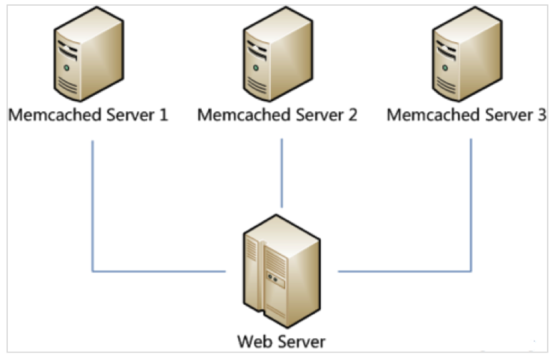
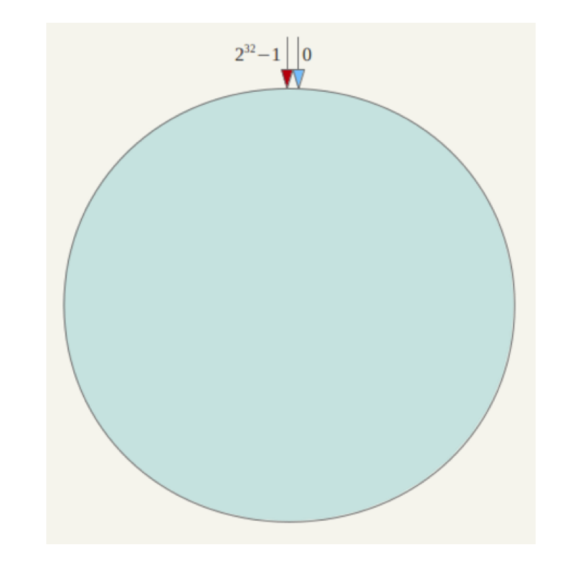
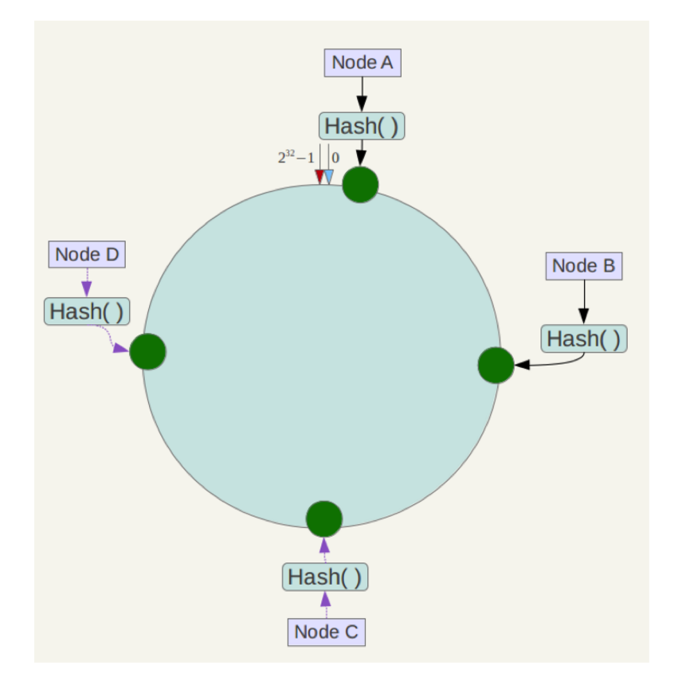
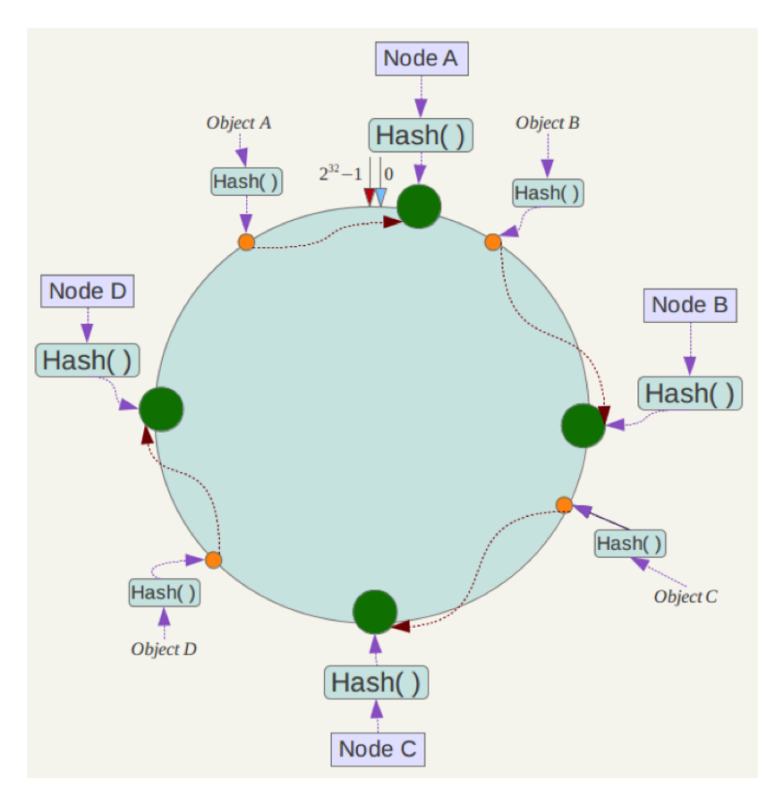
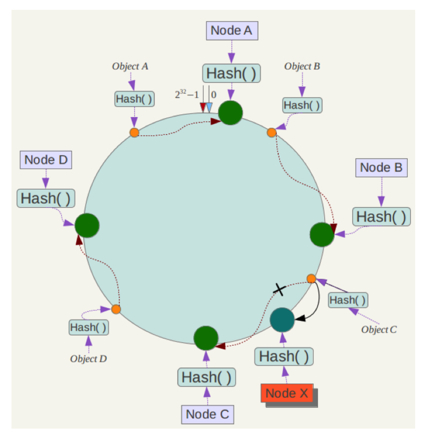
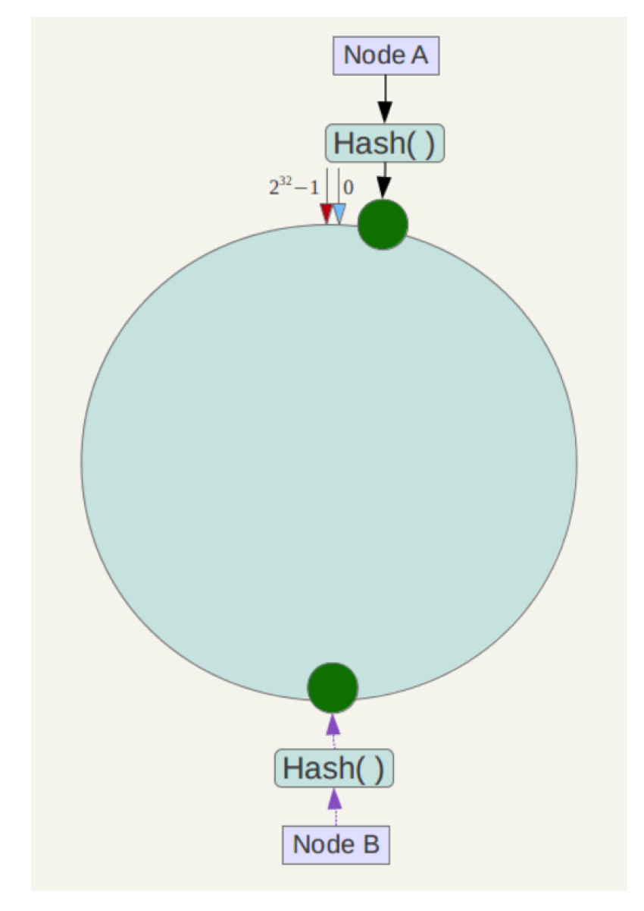
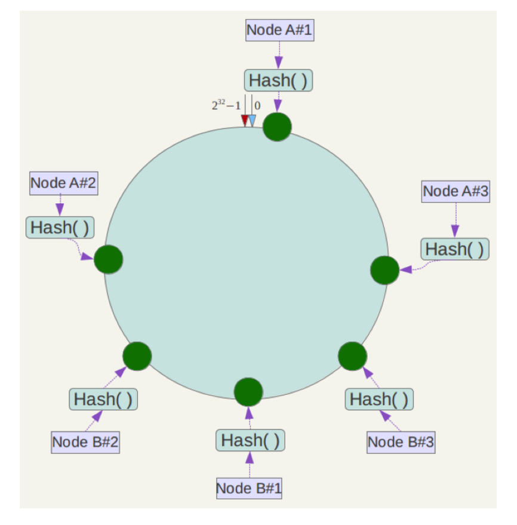
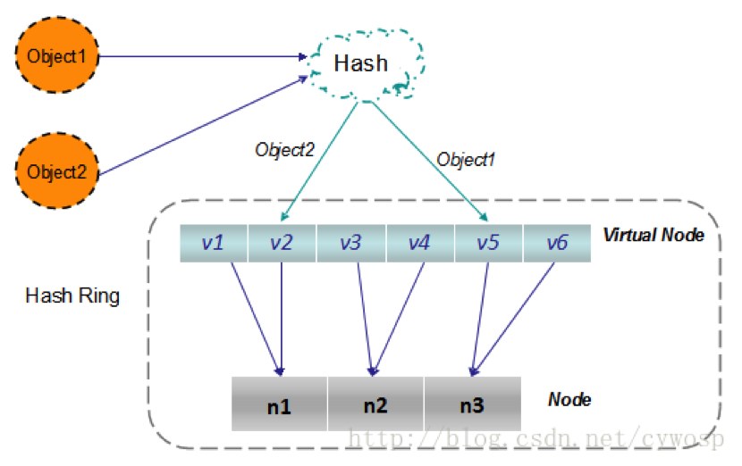

# 1、分布式缓存问题

在做服务器负载均衡时可供选择的负载均衡的算法有很多，如：

- 轮循算法(Round Robin)
- 哈希算法(HASH)
- 最少连接算法(Least Connection)
- 响应速度算法(Response Time)
- 加权法(Weighted )

假如现在有这样的应用场景：有N台服务器提供缓存服务，需要对服务器进行负载均衡，将请求平均分发到每台服务器上，每台机器负责1/N的服务。现在我们一共有三台机器可以作为Memcached服务器，如下图所示：



很显然，最简单的策略是将每一次Memcached请求随机发送到一台Memcached服务器，但是这种策略可能会带来两个问题：一是同一份数据可能被存在不同的机器上而造成数据冗余，二是有可能某数据已经被缓存但是访问却没有命中，因为无法保证对相同key的所有访问都被发送到相同的服务器。因此，随机策略无论是时间效率还是空间效率都非常不好。

要解决上述问题只需做到如下一点：**保证对相同key的访问会被发送到相同的服务器**。很多方法可以实现这一点，最常用的方法是计算哈希。例如对于每次访问，可以按如下算法计算其哈希值：

`h = Hash(key) % 3`

其中Hash是一个从字符串到正整数的哈希映射函数。这样，如果我们将Memcached Server分别编号为0、1、2，那么就可以根据上式和key计算出服务器编号h，然后去访问。

这个方法虽然解决了上面提到的两个问题，但是存在一些其它的问题。如果将上述方法抽象，可以认为通过：

`h = Hash(key) % N`

这个算式计算每个key的请求应该被发送到哪台服务器，其中N为服务器的台数，并且服务器按照0 – (N-1)编号。

这个算法的问题在于容错性和扩展性不好。所谓容错性是指当系统中某一个或几个服务器变得不可用时，整个系统是否可以正确高效运行；而扩展性是指当加入新的服务器后，整个系统是否可以正确高效运行。

现假设有一台服务器宕机了，那么为了填补空缺，要将宕机的服务器从编号列表中移除，后面的服务器按顺序前移一位并将其编号值减1，此时每个key就要按`h = Hash(key) % (N-1)`重新计算；同样，如果新增了一台服务器，虽然原有服务器编号不用改变，但是要按`h = Hash(key) % (N+1)`重新计算哈希值。因此系统中一旦有服务器变更，大量的key会被重定位到不同的服务器，从而造成大量的缓存不命中。而这种情况在分布式系统中是非常糟糕的。

那么，如何设计一个负载均衡策略，使得受到影响的请求尽可能的少呢?

在Memcached、Key-Value Store 、Bittorrent DHT、LVS中都采用了**一致性哈希**（Consistent Hashing）算法，可以说一致性哈希算法是分布式系统负载均衡的首选算法。

# 2、一致性哈希算法

一致性哈希算法在1997年由麻省理工学院提出，设计目标是为了解决因特网中的热点(Hot pot)问题，初衷和**CARP**（缓冲阵列路由协议，Cache Array Routing Protocol）十分类似。一致性哈希修正了CARP使用的简单哈希算法带来的问题，使得**DHT**（Distributed Hash Table，分布式哈希）可以在P2P环境中真正得到应用。

## 2.1 标准

一致性哈希提出了在动态变化的Cache环境中，哈希算法应该满足的4个适应条件：

- **平衡性**(Balance)
  平衡性也就是说负载均衡，是指客户端hash后的请求应该能够分散到不同的服务器上去。一致性hash可以做到每个服务器都进行处理请求，但是不能保证每个服务器处理的请求的数量大致相同。
- **单调性**(Monotonicity)
  单调性是指如果已经有一些内容通过哈希分派到了相应的缓冲中，又有新的缓冲加入到系统中。哈希的结果应该能够保证已分配的内容可以被映射到新的缓冲中去，而不会被映射到旧的缓冲集合中的其他缓冲区。
  比如，之前有三台服务器A、B、C，某个key被映射到B当中，当新增服务器D后，这个key要么被映射到之前的B中，要么被映射到新增的D中，而不应该映射到A或者C当中。
  简单的哈希算法往往不能满足单调性的要求，如最简单的线性哈希：
  `x → ax + b mod (P)`
  在上式中，P表示全部缓冲的大小。不难看出，当缓冲大小发生变化时(从P1到P2)，原来所有的哈希结果均会发生变化，从而不满足单调性的要求。哈希结果的变化意味着当缓冲空间发生变化时，所有的映射关系需要在系统内全部更新。
- **分散性**(Spread)
  分布式环境中，客户端请求时候可能不知道所有服务器的存在，可能只知道其中一部分服务器，在客户端看来他看到的部分服务器会形成一个完整的hash环。如果多个客户端都把部分服务器作为一个完整hash环，那么可能会导致，同一个用户的请求被路由到不同的服务器进行处理。这种情况显然是应该避免的，因为它不能保证同一个用户的请求落到同一个服务器。所谓分散性是指上述情况发生的严重程度。
- **负载(**Load)
  负载问题实际上是从另一个角度看待分散性问题。既然不同的终端可能将相同的内容映射到不同的缓冲区中，那么对于一个特定的缓冲区而言，也可能被不同的用户映射为不同的内容。与分散性一样，这种情况也是应当避免的，因此好的哈希算法应能够尽量降低缓冲的负荷。

## 2.2 实现原理

### 2.2.1 环形哈希空间

简单来说，一致性哈希将整个哈希值空间组织成一个虚拟的圆环，如，假设某哈希函数H的值空间为0-232-1，整个哈希空间环如下：



整个空间按顺时针方向组织。0和232-1在零点钟方向重合。

下一步将机器也映射到环中（一般情况下对机器的hash计算是采用机器的IP或者机器唯一的别名作为输入值），这里假设将上文中四台服务器使用ip地址哈希后在环空间的位置如下：



接下来使用如下算法定位数据访问到相应服务器：将数据key使用相同的Hash函数计算出哈希值，并确定此数据在环上的位置，从此位置沿环顺时针“行走”，第一台遇到的服务器就是其应该定位到的服务器。

例如我们有Object A、Object B、Object C、Object D四个数据对象，经过哈希计算后，在环空间上的位置如下：



根据一致性哈希算法，数据A会被定为到Node A上，B被定为到Node B上，C被定为到Node C上，D被定为到Node D上。

### 2.2.2 容错性与可扩展性

下面分析一致性哈希算法的容错性和可扩展性。现假设Node C不幸宕机，可以看到此时对象A、B、D不会受到影响，只有C对象被重定位到Node D。一般的，在一致性哈希算法中，如果一台服务器不可用，则受影响的数据仅仅是此服务器到其环空间中前一台服务器（即沿着逆时针方向行走遇到的第一台服务器）之间数据，其它不会受到影响。

下面考虑另外一种情况，如果在系统中增加一台服务器Node X，如下图所示：



此时对象Object A、B、D不受影响，只有对象C需要重定位到新的Node X 。一般的，在一致性哈希算法中，如果增加一台服务器，则受影响的数据仅仅是新服务器到其环空间中前一台服务器（即沿着逆时针方向行走遇到的第一台服务器）之间数据，其它数据也不会受到影响。

综上所述，一致性哈希算法对于节点的增减都只需重新定位环空间中的一小部分数据，具有较好的容错性和可扩展性。

### 2.2.3 虚拟节点

根据上面的图解分析，一致性哈希算法满足了单调性和负载均衡的特性以及一般hash算法的分散性，但这还并足以成为其被广泛应用的原由，因为还缺少了平衡性。一致性哈希算法在服务节点太少时，容易因为节点分部不均匀而造成数据倾斜问题。例如系统中只有两台服务器，其环分布如下：



此时很可能造成大量数据集中到Node A上，而只有少量数据定位到Node B上。为了解决这种数据倾斜问题，一致性哈希算法引入了虚拟节点（ virtual node ），虚拟节点是实际节点（机器）在 hash 空间的复制品，一个实际节点（机器）对应了若干个虚拟节点。 比如对每一个服务节点计算多个哈希，每个计算结果位置都放一个服务节点，称为**虚拟节点**。具体做法可以在服务器ip或主机名的后面增加编号来实现。例如上面的情况，可以为每台服务器计算三个虚拟节点，于是可以分别计算 “Node A#1”、“Node A#2”、“Node A#3”、“Node B#1”、“Node B#2”、“Node B#3”的哈希值，于是形成六个虚拟节点：



同时数据定位算法不变，只是多了一步虚拟节点到实际节点的映射，例如定位到“Node A#1”、“Node A#2”、“Node A#3”三个虚拟节点的数据均定位到Node A上。这样就解决了服务节点少时数据倾斜的问题。在实际应用中，通常将虚拟节点数设置为32甚至更大，因此即使很少的服务节点也能做到相对均匀的数据分布。

# 3、Jedis中的一致性Hash

`ShardedJedis`通过一致性哈希实现的的分布式缓存，具体实现在其父类`Sharded`当中，核心代码如下：

```java
	public class Sharded<R, S extends ShardInfo<R>> {

		// 分片的默认值，权重越大 ，分配的虚拟节点越多
		public static final int DEFAULT_WEIGHT = 1;

		// 虚拟节点——》分片
		private TreeMap<Long, S> nodes;

		// 采用的哈希算法，默认为MURMUR_HASH
		private final Hashing algo;

		// 分片——》真实的jedis资源
		private final Map<ShardInfo<R>, R> resources = new LinkedHashMap<ShardInfo<R>, R>();

		// keyTagPattern来指定我们key的分布策略，
		// 所有能够匹配keyTagPattern的key（通过正则匹配）将放在同一个redis里
		// 默认的是直接使用key来进行判定
		private Pattern tagPattern = null;

		public static final Pattern DEFAULT_KEY_TAG_PATTERN = Pattern.compile("\\{(.+?)\\}");

		private void initialize(List<S> shards) {
			nodes = new TreeMap<Long, S>();

			for (int i = 0; i != shards.size(); ++i) {// 遍历分片
				final S shardInfo = shards.get(i);
				// 为每个分片创建160个虚拟节点
				if (shardInfo.getName() == null)
					for (int n = 0; n < 160 * shardInfo.getWeight(); n++) {
						nodes.put(this.algo.hash("SHARD-" + i + "-NODE-" + n), shardInfo);
					}
				else
					for (int n = 0; n < 160 * shardInfo.getWeight(); n++) {
						nodes.put(this.algo.hash(shardInfo.getName() + "*" + shardInfo.getWeight() + n), shardInfo);
					}

				// 为每个分片生成一个真实的资源
				resources.put(shardInfo, shardInfo.createResource());
			}
		}

		public R getShard(byte[] key) {
			return resources.get(getShardInfo(key));
		}

		public R getShard(String key) {
			return resources.get(getShardInfo(key));
		}

		public S getShardInfo(byte[] key) {

			SortedMap<Long, S> tail = nodes.tailMap(algo.hash(key));// 获取键值大于等于key哈希值的虚拟节点
			if (tail.isEmpty()) { // 把nodes当做首尾相接的哈希环，如果上一步的结果为空，则取第一个节点
				return nodes.get(nodes.firstKey());
			}
			return tail.get(tail.firstKey()); // 反之，则取大于等于key哈希值的第一个节点
		}

		public S getShardInfo(String key) {
			return getShardInfo(SafeEncoder.encode(getKeyTag(key)));
		}

		/**
		 * 可以传入keyTagPattern来指定我们key的分布策略， 所有能够匹配keyTagPattern的key（通过正则匹配）将放在同一个redis里，
		 * 默认的是直接使用key来进行判定
		 * 
		 * @param key
		 * @return
		 */
		public String getKeyTag(String key) {
			if (tagPattern != null) {
				Matcher m = tagPattern.matcher(key);
				if (m.find())
					return m.group(1);
			}
			return key;
		}

	}
```

主要思路：

- 将每台服务器节点采用hash算法划分为160个虚拟节点(可以配置划分权重)，将划分虚拟节点采用键值有序的`TreeMap`存储
- 对每个redis服务器的物理连接采用`LinkedHashMap`存储
- 对`Key or KeyTag`采用同样的hash算法，然后从`TreeMap`获取大于等于键hash值得节点，取最邻近节点存储；当key的hash值大于虚拟节点hash值得最大值时，存入第一个虚拟节点



`Sharded`类是对分片的抽象，`ShardInfo`是对真实资源的抽象。两者维护了一致性哈希后的物理机器和虚拟节点的映射关系。

TreeMap<Long, S> nodes，存储的是虚拟节点和key的映射关系。有了虚拟节点，还要找到真正的存储位置。

Map<ShardInfo<R>, R> resources，维护了虚拟节点和真正的存储位置的映射关系。

也是说，hash(key) -> virtual node -> real node。