# 1、引言

在传统单体应用下，请求从客户端到服务层，再到数据库，很多时候通过关系型数据库自身的事务机制，保证了数据在读写层面的一致性（ACID）。

而对于分布式系统来说，在实际的场景中很容易出现以下问题：

* 节点之间的网络通信是不可靠的，包括消息延迟、乱序、内容错误等；

* 节点的处理时间无法保障，结果可能出现错误，甚至节点自身宕机；

所以就需要通过一些协议和算法来保证数据的一致性，换句话说，就是保证集群里的节点存储的数据是一模一样的。

一致性协议可以有多种分类方法，关键要看我们选取的是哪个观察角度，这里我们从单主和多主的角度对协议进行分类。

单主协议：即整个分布式集群中只存在一个主节点，主节点发出数据，传输给其余从节点，能保证数据传输的有序性。采用这个思想的主要有**2PC**, **Paxos**, **Raft**等。

多主协议：即整个集群中不只存在一个主节点，从多个主节点出发传输数据，传输顺序具有随机性，因而数据的有序性无法得到保证，只保证最终数据的一致性。典型代表是**Pow**协议以及著名的**Gossip**协议。

# 2、Gossip协议

## 2.1 基本概念

> `Gossip protocol` 也叫 `Epidemic Protocol` （流行病协议）。Gossip protocol在1987年由施乐公司发表ACM上的论文`《Epidemic Algorithms for Replicated Database Maintenance》`中提出。原本用于分布式数据库中节点同步数据使用，后被广泛用于数据库复制、信息扩散、集群成员身份确认、故障探测等。

Gossip协议是基于**六度分隔理论**（Six Degrees of Separation）哲学的体现。简单的来说，一个人通过6个中间人可以认识世界任何人。假设每个人认识150人，其六度就是150^6 ＝11,390,625,000,000（约11.4万亿）。

基于六度分隔理论，任何信息的传播其实非常迅速，而且网络交互次数不会很多。比如Facebook在2016年2月4号做了一个实验：研究了当时已注册的15.9亿使用者资料，发现这个神奇数字的“网络直径”是4.57，翻成白话文意味着每个人与其他人间隔为4.57人。

Gossip 协议的消息传播方式有两种：

* **Anti-Entropy(反熵传播)**：是以固定的概率传播所有的数据。所有参与节点只有两种状态：Suspective(病原)、Infective(感染)。这种节点状态又叫做simple epidemics(SI model)。过程是种子节点会把所有的数据都跟其他节点共享，以便消除节点之间数据的任何不一致，它可以保证最终、完全的一致。缺点是消息数量非常庞大，且无限制；**通常只用于新加入节点的数据初始化**。

* **Rumor-Mongering(谣言传播)**：是以固定的概率仅传播新到达的数据。所有参与节点有三种状态：Suspective(病原)、Infective(感染)、Removed(愈除)。这种节点状态又叫做complex epidemics(SIR model)。过程是消息只包含最新 update，谣言消息在某个时间点之后会被标记为 removed，并且不再被传播。缺点是系统有一定的概率会不一致，**通常用于节点间数据增量同步**。

Gossip 协议最终目的是将数据分发到网络中的每一个节点。根据不同的具体应用场景，网络中两个节点之间存在三种通信方式：

* **Push**: 节点 A 将数据 (key,value,version) 及对应的版本号推送给 B 节点，B 节点更新 A 中比自己新的数据
* **Pull**：A 仅将数据 key, version 推送给 B，B 将本地比 A 新的数据（Key, value, version）推送给 A，A 更新本地
* **Push/Pull**：与 Pull 类似，只是多了一步，A 再将本地比 B 新的数据推送给 B，B 则更新本地

如果把两个节点数据同步一次定义为一个周期，则在一个周期内，Push 需通信 1 次，Pull 需 2 次，Push/Pull 则需 3 次。虽然消息数增加了，但从效果上来讲，Push/Pull 最好，理论上一个周期内可以使两个节点完全一致。直观上，Push/Pull 的收敛速度也是最快的。

## 2.2 执行过程

Gossip协议执行过程：

1. 种子节点周期性的散播消息。
2. 被感染节点随机选择N个邻接节点散播消息。
3. 节点只接收消息不反馈结果。
4. 每次散播消息都选择尚未发送过的节点进行散播。
5. 收到消息的节点不再往发送节点散播：A -> B，那么B进行散播的时候，不再发给 A。

接下来通过多张图片剖析Gossip协议是如何运行的。如下图所示，Gossip协议是周期循环执行的。图中的公式表示Gossip协议把信息传播到每一个节点需要多少次循环动作，需要说明的是，公式中的20表示整个集群有20个节点，4表示某个节点会向4个目标节点传播消息：
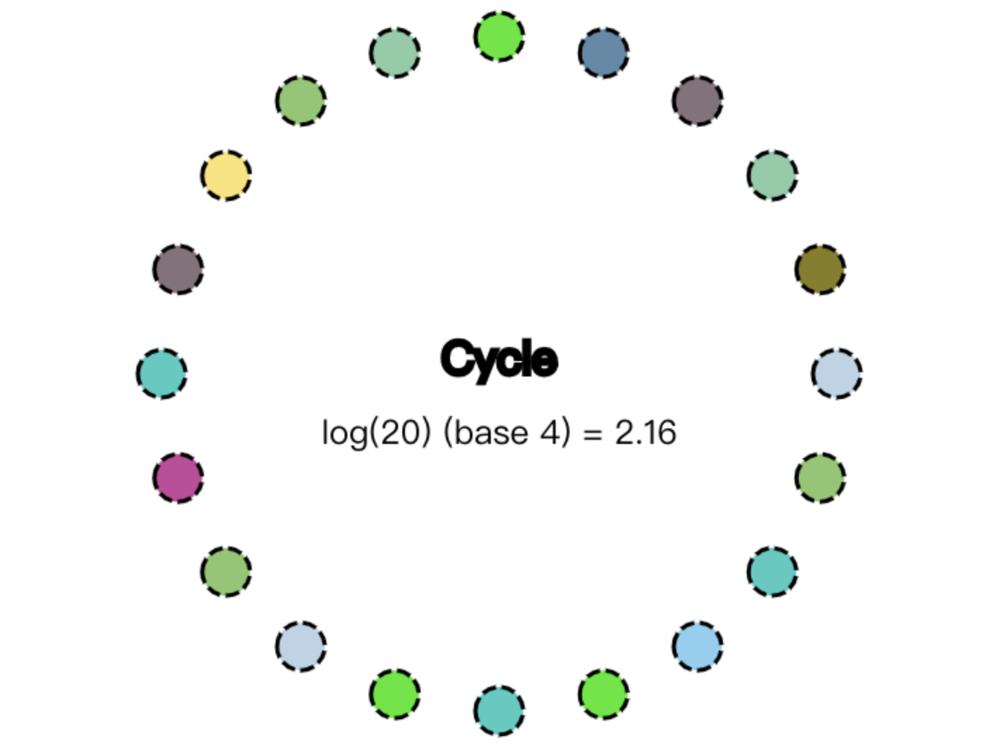

如下图所示，红色的节点表示其已经“受到感染”，即接下来要传播信息的源头，连线表示这个初始化感染的节点能正常连接的节点（其不能连接的节点只能靠接下来感染的节点向其传播消息）。并且N等于4，我们假设4根较粗的线路，就是它第一次传播消息的线路：

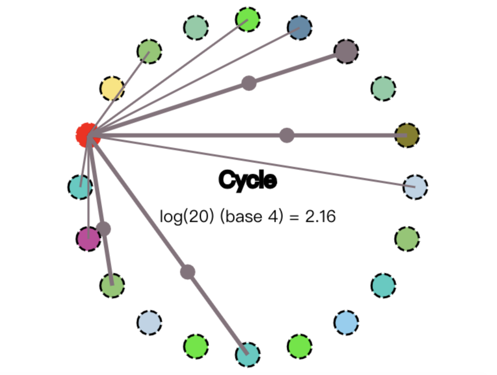

第一次消息完成传播后，新增了4个节点会被“感染”，即这4个节点也收到了消息。这时候，总计有5个节点变成红色：

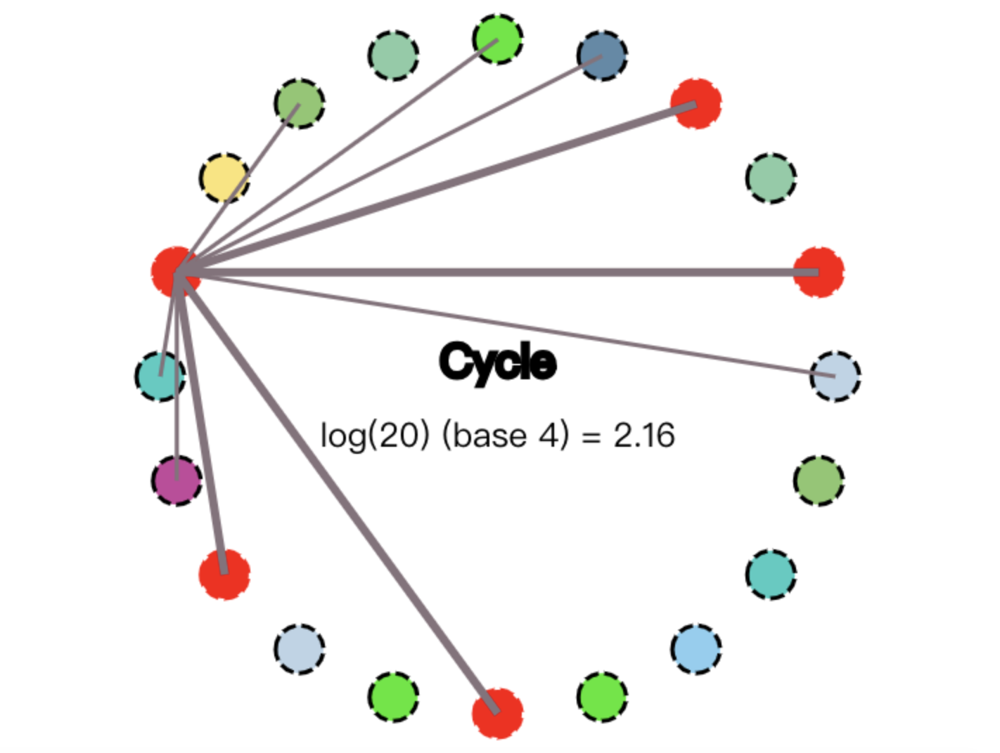

那么在下一次传播周期时，总计有5个节点，且这5个节点每个节点都会向4个节点传播消息。最后，经过3次循环，20个节点全部被感染（都变成红色节点），即说明需要传播的消息已经传播给了所有节点：

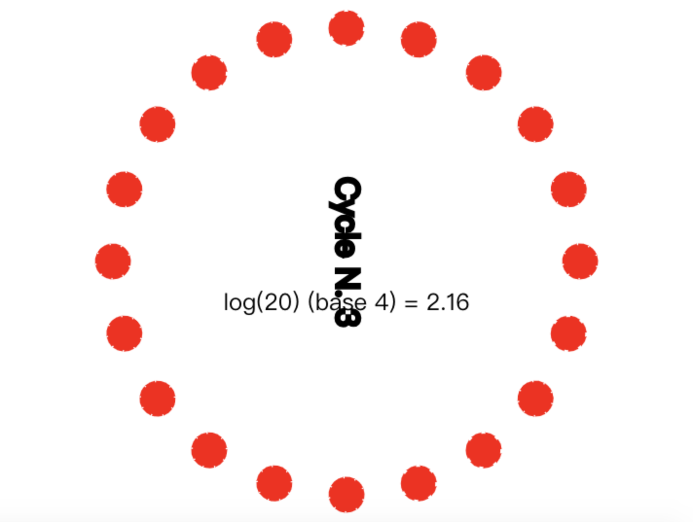

需要说明的是，20个节点且设置fanout=4，公式结果是2.16，这只是个近似值。真实传递时，可能需要3次甚至4次循环才能让所有节点收到消息。这是因为每个节点在传播消息的时候，是随机选择N个节点的，这样的话，就有可能某个节点会被选中2次甚至更多次。

Goosip 协议的信息传播和扩散通常需要由种子节点发起。整个传播过程可能需要一定的时间，由于不能保证某个时刻所有节点都收到消息，但是理论上最终所有节点都会收到消息，因此它是一个**最终一致性**协议。

Gossip协议是一个多主协议，所有写操作可以由不同节点发起，并且同步给其他副本。Gossip内组成的网络节点都是对等节点，是非结构化网络。

## 2.3 总结

综上所述，我们可以得出Gossip是一种去中心化的分布式协议，数据通过节点像病毒一样逐个传播。因为是指数级传播，整体传播速度非常快。

它具备以下优势：

* **可扩展性**：允许节点的任意增加和减少，新增节点的状态最终会与其他节点一致。
* **容错性**：任意节点的宕机和重启都不会影响 Gossip 消息的传播，具有天然的分布式系统容错特性。
* **去中心化**：无需中心节点，所有节点都是对等的，任意节点无需知道整个网络状况，只要网络连通，任意节点可把消息散播到全网。

同样也存在以下缺点：

* **消息延迟**：节点随机向少数几个节点发送消息，消息最终是通过多个轮次的散播而到达全网；不可避免的造成消息延迟。
* **消息冗余**：节点定期随机选择周围节点发送消息，而收到消息的节点也会重复该步骤；不可避免的引起同一节点消息多次接收，增加消息处理压力。
* **拜占庭问题**：如果有一个恶意传播消息的节点，Gossip协议的分布式系统就会出问题。

Gossip协议由于以上的优缺点，所以适合于AP场景的数据一致性处理，常见应用有：P2P网络通信、Apache Cassandra、Redis Cluster、Consul。

# 3、Paxos协议

## 3.1 基本概念

**Paxos**算法是分布式领域的大师**Lamport**提出的一种基于消息传递的一致性算法，Lamport凭借此算法获得2013年图灵奖。

有一种说法，说**所有共识算法都是Paxos**。这种说法的来源，一方面是由于Paxos的第一次提出非常的早，另一方面则是因为，Paxos解决的其实是在分布式环境下，所有服务达成一次某个值的共识的过程，而这一过程，可以说每种共识算法都绕不开。

自Paxos问世以来就持续垄断了分布式一致性算法，Paxos这个名词几乎等同于分布式一致性。Google的很多大型分布式系统都采用了Paxos算法来解决分布式一致性问题，如Chubby、Megastore以及Spanner等。开源的ZooKeeper，以及MySQL 5.7推出的用来取代传统的主从复制的MySQL Group Replication等纷纷采用Paxos算法解决分布式一致性问题。

Paxos采取了一个我们非常熟悉的达成共识的方法：**少数服从多数**。只要有超过一半的机器认可某一个消息，那么最终就所有机器都接受这条消息并将它作为本次的结论。而竞选失败的少数派消息，就会被拒绝，并由第一个从客户端处接收到该消息的机器，向客户端发送失败结果，由客户端进行重试，去尝试在下一轮竞选中胜出。

Paxos算法运行在允许宕机故障的异步系统中，不要求可靠的消息传递，可容忍消息丢失、延迟、乱序以及重复。它利用大多数机制保证了2F+1的容错能力，即2F+1个节点的系统最多允许F个节点同时出现故障。

Paxos将系统中的角色分为**提议者** (Proposer)，**决策者** (Acceptor)，和**学习者** (Learner):

* **Proposer**: 提出提案 (Proposal)。Proposal信息包括提案编号 (Proposal ID) 和提议的值 (Value)。
* **Acceptor**：参与决策，回应Proposers的提案。收到Proposal后可以接受提案，若Proposal获得多数Acceptors的接受，则称该Proposal被批准。
* **Learner**：不参与决策，从Proposers/Acceptors学习最新达成一致的提案（Value）。

在多副本状态机中，每个副本同时具有Proposer、Acceptor、Learner三种角色。

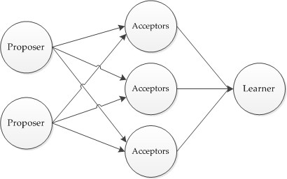

Paxos算法通过一个决议分为两个阶段：

* **Prepare阶段**：Proposer向Acceptors发出Prepare请求，Acceptors针对收到的Prepare请求进行Promise承诺。
* **Accept阶段**：Proposer收到多数Acceptors承诺的Promise后，向Acceptors发出Propose请求，Acceptors针对收到的Propose请求进行Accept处理。

Proposer在收到多数Acceptors的Accept之后，标志着本次Accept成功，决议形成，将形成的决议发送给所有Learners。

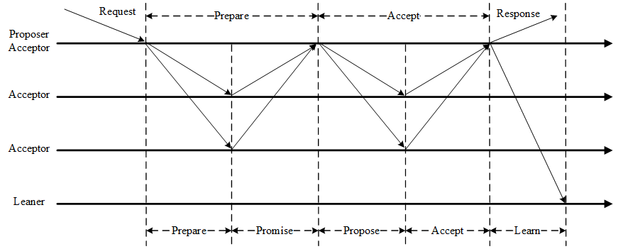

Paxos算法流程中的每条消息描述如下：

* **Prepare**: Proposer生成**全局唯一且递增**的Proposal ID (可使用时间戳加Server ID)，向所有Acceptors发送Prepare请求，这里无需携带提案内容，只携带Proposal ID即可。
* **Promise**: Acceptors收到Prepare请求后，做出“两个承诺，一个应答”。

**两个承诺：**

1. 不再接受Proposal ID小于等于（注意：这里是<= ）当前请求的Prepare请求。
2. 不再接受Proposal ID小于（注意：这里是< ）当前请求的Propose请求。

**一个应答：**

不违背以前作出的承诺下，回复已经Accept过的提案中Proposal ID最大的那个提案的Value和Proposal ID，没有则返回空值。

* **Propose**: Proposer 收到多数Acceptors的Promise应答后，从应答中选择Proposal ID最大的提案的Value，作为本次要发起的提案。如果所有应答的提案Value均为空值，则可以自己随意决定提案Value。然后携带当前Proposal ID，向所有Acceptors发送Propose请求。
* **Accept**: Acceptor收到Propose请求后，在不违背自己之前作出的承诺下，接受并持久化当前Proposal ID和提案Value。
* **Learn**: Proposer收到多数Acceptors的Accept后，决议形成，将形成的决议发送给所有Learners。

## 3.2 执行过程

### 3.2.1 一个简单的提案

先描述最简单的情况，假设现在有四台机器，其中一台收到了来自客户端的写操作请求，需要同步给其他机器。

此时这台收到请求的机器，我们称它为Proposer，因为它将要开始将收到的请求，作为一个提案，提给其他的机器。这里为了方便，我们假设这个请求是要将一个地址设置为“深圳”，那么如下图所示：

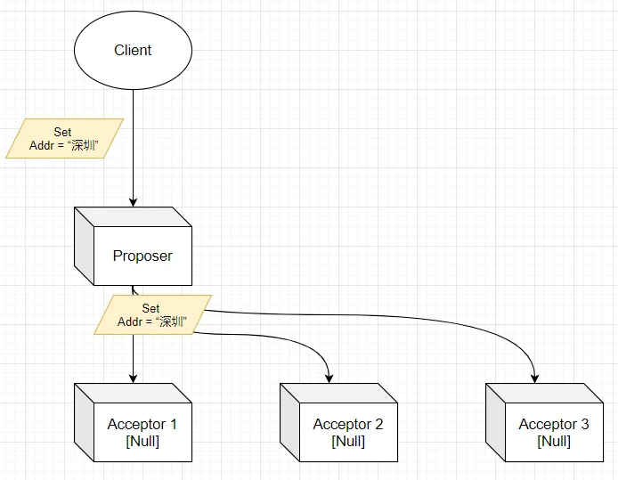

此时，其他的Acceptor都闲着呢，也没其他人找，所以当它们收到Proposer的提案时，就直接投票了，说可以可以，我是空的，赞成提案（同意提议）：

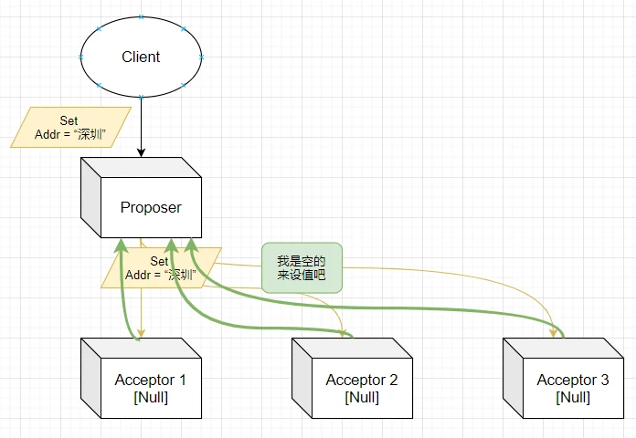

到这里，就还是一个简单的同步的故事，但需要注意的是，这里Proposer实际上是经历了两步的。

在这个简单的提案过程中，Proposer其实也经历了两个阶段：

Prepare阶段：Proposer告诉所有其他机器，我这里有一个提案（操作），想要你们投投票支持一下，想听听大家的意见。Acceptor看自己是NULL，也就是目前还没有接受过其他的提案，就说我肯定支持。

Accept阶段：Proposer收到其他机器的回复，说他们都是空的，也就是都可以支持接受Proposer的提案（操作），于是正式通知大家这个提案被集体通过了，可以生效了，操作就会被同步到所有机器正式生效。

### 3.2.2 两个提案并发进行

现在考虑一个更复杂的场景，因为我们处于一个分布式的场景，每台机器都可能会收到请求，那如果有两台机器同时收到了两个客户端的不同请求，该怎么处理呢？大家听谁的呢？最后的共识以谁的为准呢？如下图所示：

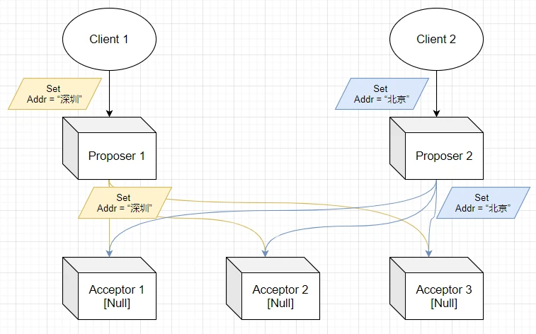

在这种情况下，由于网络传输的时间问题，两个Proposer的提案到达各个机器，是会存在先后顺序的。假设Proposer 1的提案先达到了Acceptor 1和 Acceptor 2，而Proposer 2的提案先达到了Acceptor 3，其达到Acceptor 1和Acceptor 2时，由于机器已经投票给Proposer 1了，所以Proposer 2的提案遭到拒绝，Proposer 1达到Acceptor 3的时候同样被拒。

Acceptor们迷了，Proposer们也迷了，到底应该接受谁？此时，还是遵循自由民主的法则——少数服从多数。

Proposer 1发现超过半数的Acceptor都接受了自己，所以放心大胆地发起要求，让所有Acceptor都按照自己的值来操作。而Proposer 2发现只有不到半数的Acceptor支持自己，而有超过半数是支持Proposer 1的值的，因此只能拒绝Client 2，并将自己也改为Proposer 1的操作：

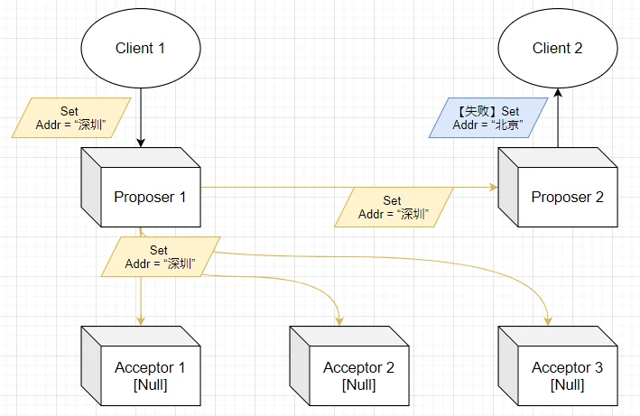

到此为止，看起来没有问题，但是，这是因为恰好Acceptor的数量是单数，可以选出“大多数”，但是因为同时成为Proposer的机器数量是不确定的，因此是无法保证Acceptor的数量一定是单数的，如下面这种情况就无法选出“大多数”了：

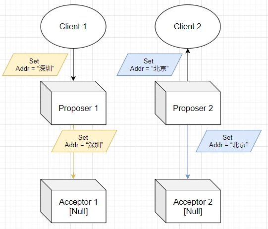

这时，两个Proposer有可能总是先抢到一个Acceptor的支持，然后在另一个Acceptor处折戟沉沙，算法就一直循环死锁下去了。为了解决这种情况，Paxos给提案加了一个编号。

### 3.2.3 给提案加上编号

之前我们Proposer的提案都是只有操作内容的，现在我们给他加一个编号，即：

* Proposer 1的提案为：[n1，v1]
* Proposer 2的提案为：[n2，v2]

假设Proposer 1接到Client 1的消息稍微早一点，那么它的编号就是1，Proposer 2的编号就是2，那么他们的提案实际就是：

* Proposer 1的提案为：[1，{ Set Addr =“深圳”}]
* Proposer 2的提案为：[2，{ Set Addr =“北京”}]

此时，Paxos加上一条规则：

> Acceptor如果还没有正式通过提案（即还没有Accept使操作生效），就可以接受编号更大的Prepare请求。

所以，回到上面的困境。

当Proposer 1想要向Acceptor 2寻求支持时，Acceptor 2一看你的编号（1）比我已经支持的编号（2）要小，拒绝。此时Proposer 1由于没有得到过半数的支持，会重新寻求支持。

而当Proposer 2想要向Acceptor 1寻求支持时，Acceptor 1一看你的编号（2）比我已经支持的编号（1）要大，好的你是老大我听你的。此时Proposer 2已经得到了超过半数的支持，可以进入正式生效的Accept阶段了。
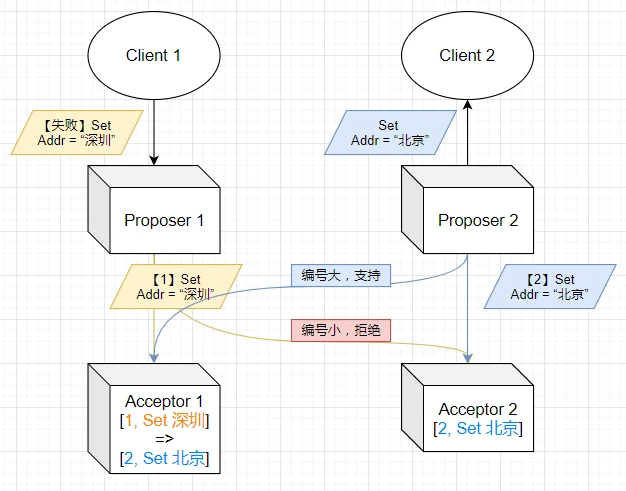

这里需要补充一下，Proposer 1这里支持提案失败，他是怎么让自己也接受Proposer 2的提案的呢？

所以这里的后续会发生的事情是：

Proposer 2发现得到了过半数的支持，开始向所有Acceptor发送Accept请求。

所有Acceptor接收到Accept请求后，按照之前Prepare时收到的信息与承诺，去生效Proposer 2的提案内容（即Set Addr=“北京”的操作）。

Proposer 1之前已经收到了所有Acceptor的回复，发现没有得到过半数的支持，直接回复Client 1请求失败，并变成一个Acceptor（或者说Learner），接受Proposer 2的Accept请求。

这里再想多一点，考虑另一种场景：假设Proposer 2的Accept请求先达到了Acceptor 2，然后Proposer 1向Acceptor 2发送的Prepare请求才到达 Acceptor 2，会发生什么呢？

最直观的处理是，Acceptor 2直接拒绝，然后Proposer 1走上面的流程，但Paxos为了效率，又增加了另一条规则：

> 如果一个Prepare请求，到达Acceptor时，发现该Acceptor已经接受生效了另一个提案，那么它除了回复提案被拒绝外，还会带上Acceptor已经通过的编号最大的那个提案的内容回到Proposer。Proposer收到带内容的拒绝后，需要修改自己的提案为返回的内容。

此时会发生的事情就变成了：

此时Acceptor 2除了会拒绝它的请求，还会告诉Proposer 1，说我已经通过并生效了另一个编号为2的提案，内容是`Set Addr=“北京”`。

然后Proposer 1查看回复时，发现已经有Acceptor生效提案了，于是就修改自己的提案，也改为`Set Addr=“北京”`，并告知Client 1你的请求失败了。

接着Proposer 1开始充当Proposer 2的小帮手，帮他一起传播 Proposer 2的提案，加快达成共识的过程。

这里需要注意， 编号是需要保证全局唯一的，而且是全局递增的 ，否则在比较编号大小的时候就会出现问题，怎么保证编号唯一且递增有很多方法，比如都向一个统一的编号生成器请求新编号；又比如每个机器的编号用机器ID拼接一个数字，该数字按一个比总机器数更大的数字间隔递增。

### 3.2.4 异常情况

上面的规则是不是就能保证整个算法解决所有问题了呢？恐怕不是，这里再看看一些异常情况。

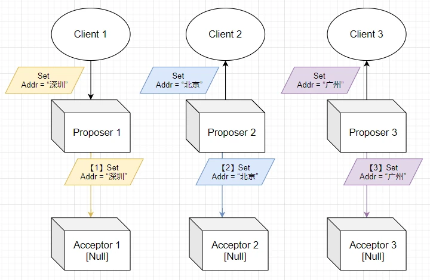

**异常情况一**：假设现在有三个Proposer同时收到客户端的请求，那么他们会生成全局唯一的不同编号，带着各自接收到的请求提案，去寻求Acceptor的支持。但假设他们都分别争取到了一个Acceptor的支持，此时由于Prepare阶段只会接受编号更大的提案，所以正常情况下只有Proposer 3的提案会得到所有Acceptor的支持。但假设这时候Proposer 3机器挂了，无法进行下一步的Accept了，怎么办呢？那么所有Acceptor就会陷入持续的等待，而其他的Proposer也会一直重试然后一直失败。

为了解决这个问题，Paxos决定，**允许Proposer在提案遭到过半数的拒绝时，更新自己的提案编号，用新的更大的提案编号，去发起新的Prepare请求**。

那么此时Proposer 1和Proposer 2就会更新自己的编号，从【1】与【2】，改为比如【4】和【5】，重新尝试提案。这时即使Proposer 3机器挂了，没有完成Accept，Acceptor也会由于接收到了编号更大的提案，从而覆盖掉Proposer 3的提案，进入新的投票支持阶段。

**异常情况二**：虽然更新编号是解决了上面的问题，但却又引入了**活锁**的问题。由于可以更新编号，那么有概率出现这种情况，即每个Proposer都在被拒绝时，增大自己的编号，然后每个Proposer在新的编号下又争取到了小于半数的Acceptor，都无法进入Accept，又重新加大编号发起提案，一直这样往复循环，就成了活锁（和死锁的区别是，他们的状态一直在变化，尝试解锁，但还是被锁住了）。

要解决活锁的问题，有几种常见的方法：

当Proposer接收到回复，发现支持它的Acceptor小于半数时，可以不立即更新编号重试，而是随机延迟一小段时间，来错开彼此的冲突。

可以**设置一个Proposer的Leader，全部由它来进行提案**，这即使共识算法的常见套路，选择一个Leader。这需要进行Leader的选举，以及解决存活性检查以及换届的问题。实际上就已经演变成**Multi-Paxos**了。

**异常情况三**：由于在提案时，Proposer都是根据是否得到超过半数的Acceptor的支持，来作为是否进入Accept阶段的依据，那如果在算法进行中新增或下线了机器呢？如果此时一些Proposer知道机器数变了，一些Proposer不知道，那么大家对半数的判断就会不一致，导致算法出错。

因此在实际运行中，机器节点数的变动，也需要作为一条要达成共识的请求提案，通过Paxos算法本身，传达到所有机器节点上。

为了使Paxos运行得更稳定，不需要时刻担心是否有节点数变化，可以固定一个周期，要求只有在达到固定周期时才允许变更节点数，比如只有在经过十次客户端请求的提案与接受后，才处理一次机器节点数变化的提案。

那如果这个间隔设置地相对过久，导致现在想要修改节点数时，一直要苦等提案数，怎么办呢？毕竟有时候机器坏了是等不了的。那么可以支持主动填充空的提案数，来让节点变更的提案尽早生效。

## 3.3 总结

抽象和完善一下这个过程，就是：

### Prepare准备阶段

1. 在该阶段，Proposer会尝试告诉所有的其他机器，我现在有一个提案（操作），请告诉我你们是否支持（是否能接受）。其他机器会看看自己是否已经支持其他提案了（是否接受过其他操作请求），并回复给Proposer（如果曾经接受过其他值，就告诉Proposer接受过什么值/操作）；
2. Acceptor如果已经支持了编号N的提案，那么不会再支持编号小于N的提案，但可以支持编号更大的提案；
3. Acceptor如果生效了编号为N的提案，那么不会再接受编号小于N的提案，且会在回复时告知当前已生效的提案编号与内容。

### Accept提交阶段

1. 在该阶段，Proposer根据上一阶段接收到的回复，来决定行为；
2. 如果上一阶段超过半数的机器回复说接受提案，那么Proposer就正式通知所有机器去生效这个操作；
3. 如果上一阶段超过半数的机器回复说他们已经先接受了其他编号更大的提案，那么Proposer会更新一个更大的编号去重试（随机延时）；
4. 如果上一阶段的机器回复说他们已经生效了其他编号的提案，那么Proposer就也只能接受这个其他人的提案，并告知所有机器直接接受这个新的提案；
5. 如果上一阶段都没收到半数的机器回复，那么提案取消；

接受其他提案，以及提案取消的情况下，Proposer就要直接告诉客户端该次请求失败了，等待客户端重试即可。

这里可以看到，超过半数以上的机器是个很重要的决定结果走向的条件。至此，已经描述完了针对一次达成共识的过程，这被称为**Basic-Paxos**。

那如果有多个值需要达成共识呢？答案是升级为**Multi-Paxos**。

如果有多个值要不断地去针对一次次请求达成共识，使用Basic-Paxos也是可以的，无非就是一遍遍地执行算法取得共识并生效嘛，但在分布式系统下，容易由于多次的通信协程造成响应过慢的问题，何况还有活锁问题存在。因此Lamport给出的解法是：

先选择一个Leader来担当Proposer的角色，取消多Proposer，只有一个Leader来提交提案，这样就没有了竞争（也没有了活锁）。同时，由于无需协商判断，有了Leader后就可以取消Prepare阶段，两阶段变一阶段，提高效率。

对于每一次要确定的值/操作，使用唯一的一个标识来区分，保证其单调递增即可。

对于选择Leader的过程，简单的做法很多，复杂的也只需要进行一次Basic-Paxos即可。选出Leader后，直到Leader挂掉或者到期，都可以保持由它来进行简化的Paxos协议。

如果有多个机器节点都由于某些问题自认为自己是Leader，从而都提交了提案，也没关系，可以令其退化成Basic-Paxos，也可以在发现后再次选择Leader即可。

# 4、Raft协议

## 4.1 基本概念

**Raft**协议是斯坦福的Diego Ongaro、John Ousterhout两人于2013年提出，Raft的作者也曾研究过Paxos，可以认为**Raft是Multi-Paxos的改进版**。不得不说，Raft作为一种易于理解，且工程上能够快速实现一个较完整的原型的算法，受到业界的广泛追捧，大量基于Raft的一致性框架层出不穷。

既然Paxos是前辈，为什么应用的反而要少呢？这是因为Basic-Paxos相对比较耗时，而Multi-Paxos，作者并没有给出具体的实现细节，这虽然给了开发者发挥的空间，但同样可能会在实现的过程中由于开发者不同的实现方式带来不同的问题，对于一个分布式共识算法，谁也不知道潜在的问题会不会就影响到一致性了。而Raft算法给出了大量实现细节，简单说就是，实现起来更不容易出错。

Raft协议同样是需要选举出Leader的，从这里也能看到，**共识算法大都会走向选举出一个Leader的方向，来提升效率和稳定性**。不同之处可能只在于选举的方式，以及消息同步的方式。

Raft的算法逻辑主要可以分成两个部分，一个是选举部分，另一个是log传输部分。和Paxos部分不同的是，这里的**log是连续并且按序传输的**。

Raft中定义了一个叫**term**概念，**一个term实际上相当于一个时间片**，如下图所示，这个时间片被分成两个部分，第一部分是选举部分，第二部分是传输部分。

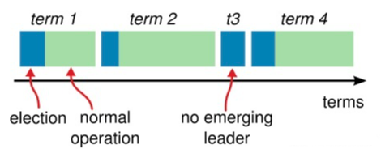

Raft算法为节点定义了三种角色：

* **领导者**（Leader）：负责处理写请求、管理日志复制和不断地发送心跳信息，通知其他节点“我是领导者，我还活着，你们现在不要发起新的选举，找个新领导者来替代我”
* **跟随者**（Follower）：接收和处理来自领导者的消息，当等待领导者心跳信息超时的时候，就主动站出来，推荐自己当候选人
* **候选人**（Candidate）：候选人将向其他节点发送请求投票（RequestVote）RPC消息，通知其他节点来投票，如果赢得了大多数选票，就晋升当领导者

**Raft算法是强领导者模型，集群中只能有一个领导者，通过一切以领导者为准的方式，实现一系列值的共识和各节点日志的一致**。

## 4.2 执行过程

### 4.2.1 领导者选举

在初始状态下，集群中所有的节点都是跟随者状态：

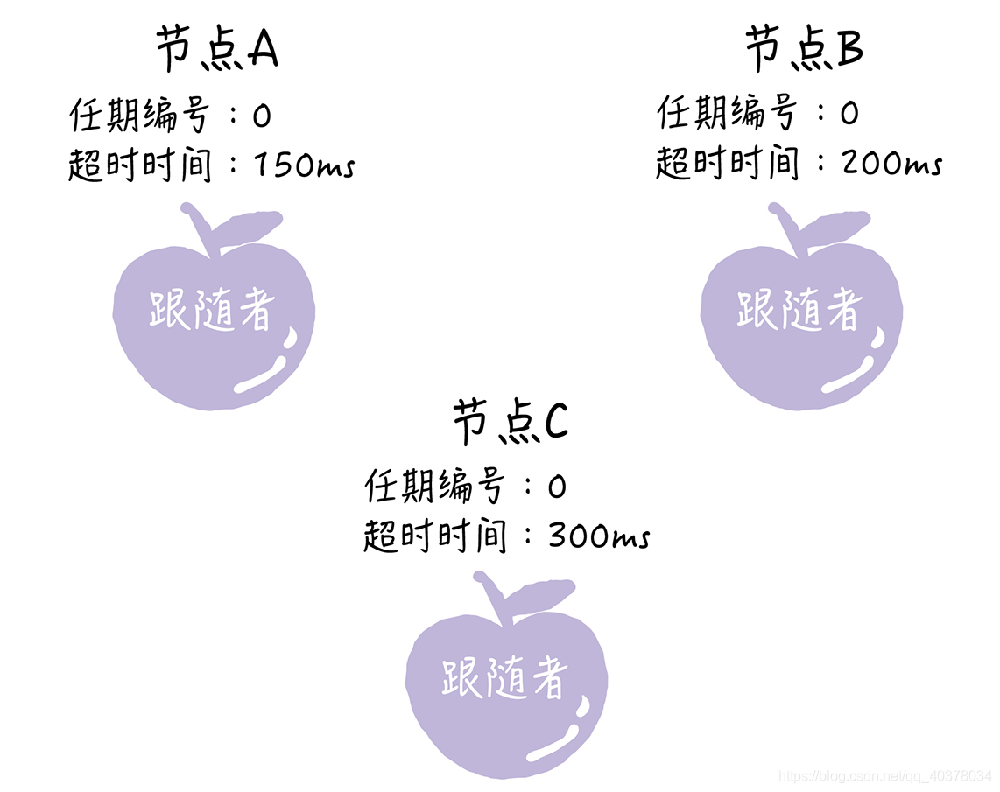

Raft算法实现了随机超时时间的特性，**每个节点等待领导者心跳信息的超时时间间隔是随机的**。上图中，集群中没有领导者，而节点A的等待超时时间最小，它会最先因为没有等到领导者的心跳信息，发生超时

这时，节点A增加自己的任期编号，并推举自己为候选人，先给自己投上一张选票，然后向其他节点发送请求投票RPC消息，请它们选举自己为领导者。

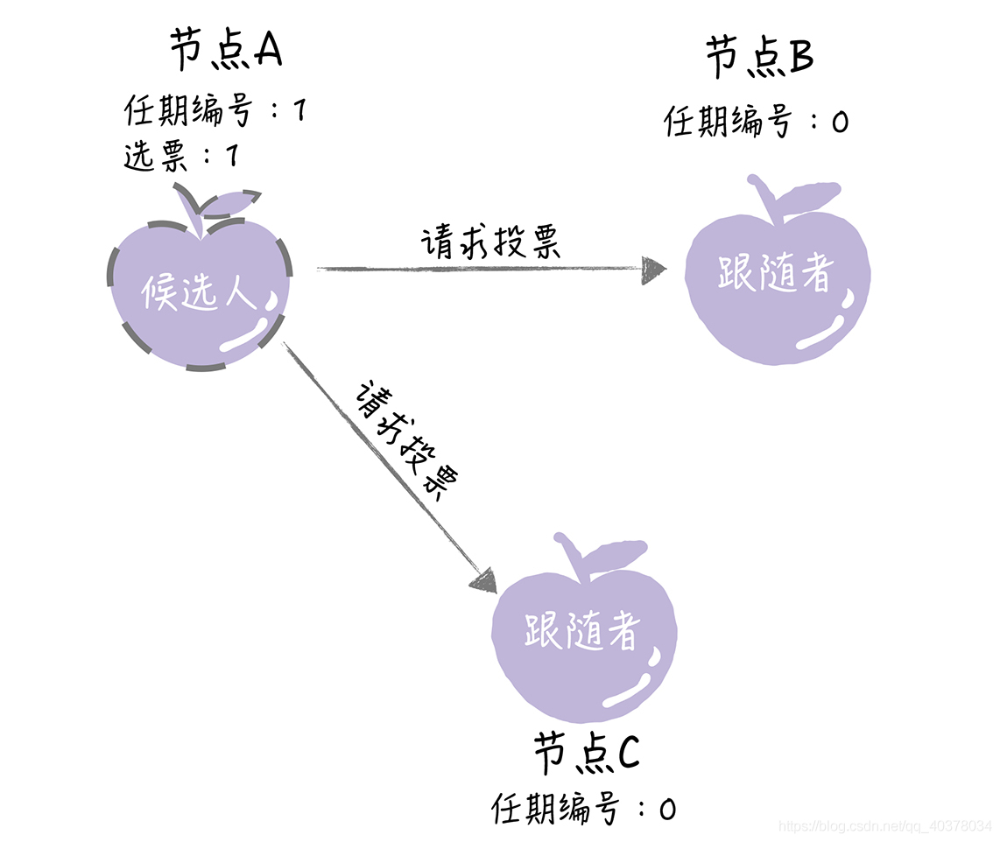

如果其他节点接收到候选人A的请求投票RPC消息，在编号为1的这届任期内，也还没有进行过投票，那么它将把选票投给节点A，并增加自己的任期编号。

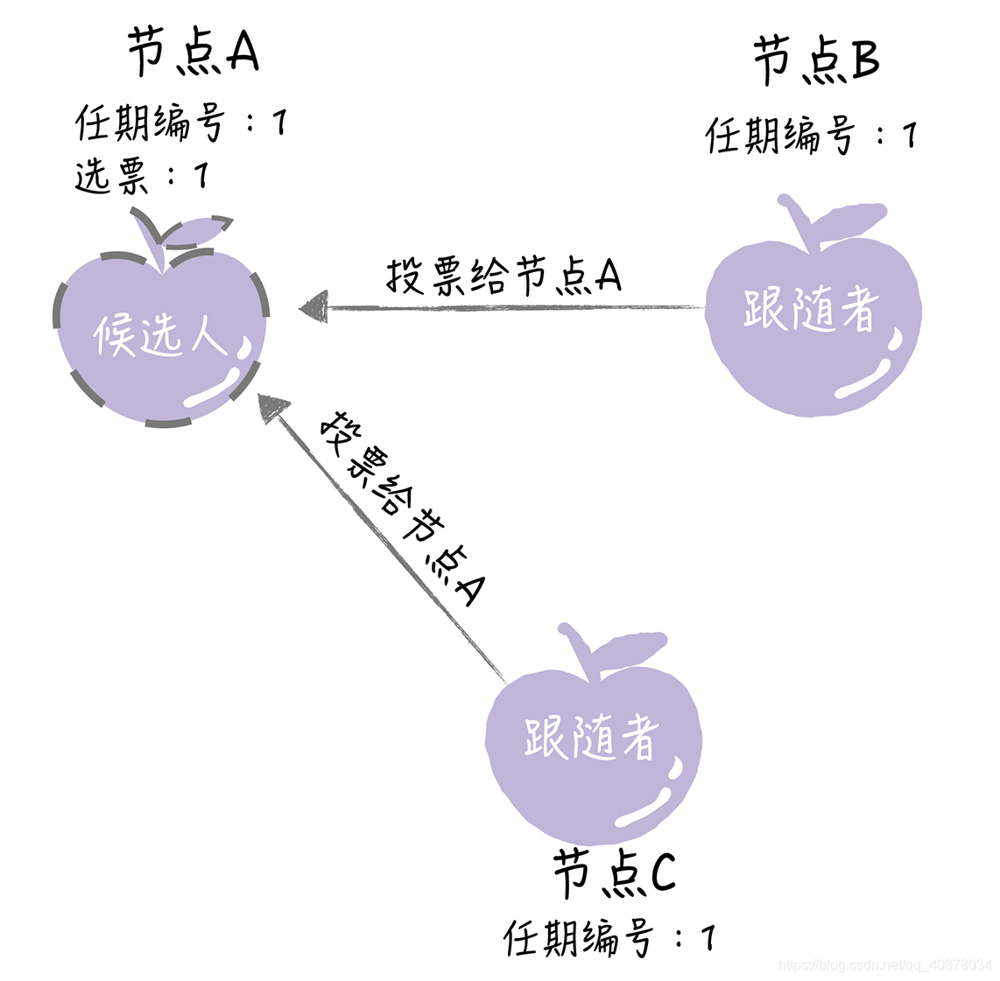

如果候选人在选举超时时间内赢得了大多数的选票，那么它就会成为本届任期内新的领导者。节点A当选领导者后，它将周期性地发送心跳消息，通知其他服务器我是领导者，阻止跟随者发起新的选举。

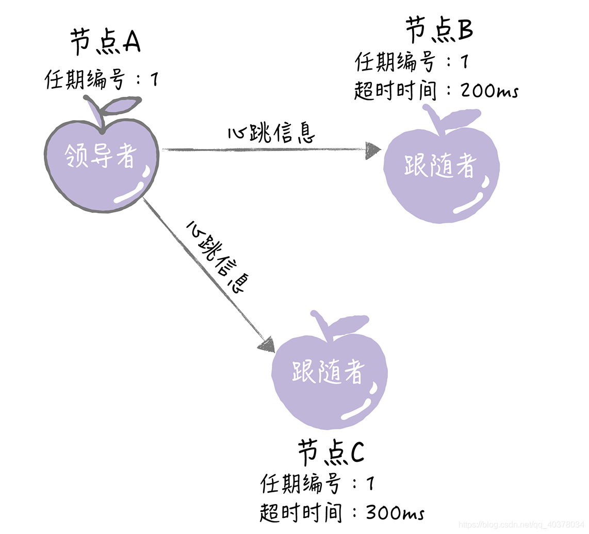

Raft算法中每个任期由单调递增的数字（任期编号）标识，任期编号是随着选举的举行而变化的：

1. 跟随者在等待领导者心跳信息超时后，推举自己为候选人时，会增加自己的任期编号，比如节点A的任期编号为0，那么在推举自己为候选人时，会将自己的任期编号增加为1
2. 如果一个服务器节点，发现自己的任期编号比其他节点小，那么它会更新自己的任期编号到较大的编号值，比如节点B的任期编号是0，当收到来自节点A的请求投票RPC消息时，因为消息中包含了节点A的任期编号，且编号为1，那么节点B将把自己的任期编号更新为1
3. 如果一个候选人或者领导者，发现自己的任期编号比其他节点小，那么它会立即恢复成跟随者状态。比如分区错误恢复后，任期编号为3的领导者节点B，收到来自新领导者的包含任期编号为4的心跳消息，那么节点B将立即恢复成跟随者状态
4. 如果一个节点接收到一个包含较小的任期编号值的请求，那么它会直接拒绝这个请求。比如节点C的任期编号为4，收到包含任期编号为3的请求投票RPC消息，那么它将拒绝这个消息

在一次选举中，**每一个服务器节点最多会对一个任期编号投出一张选票**，并且按照先来先服务的原则进行投票。比如节点C的任期编号为3，先收到了一个包含任期编号为4的投票请求（来自节点A），然后又收到了一个包含任期编号为4的投票请求（来自节点B）。那么节点C将会把唯一一张选票投给节点A，当再收到节点B的投票请求RPC消息时，对于编号为4的任期，已没有选票可投了。

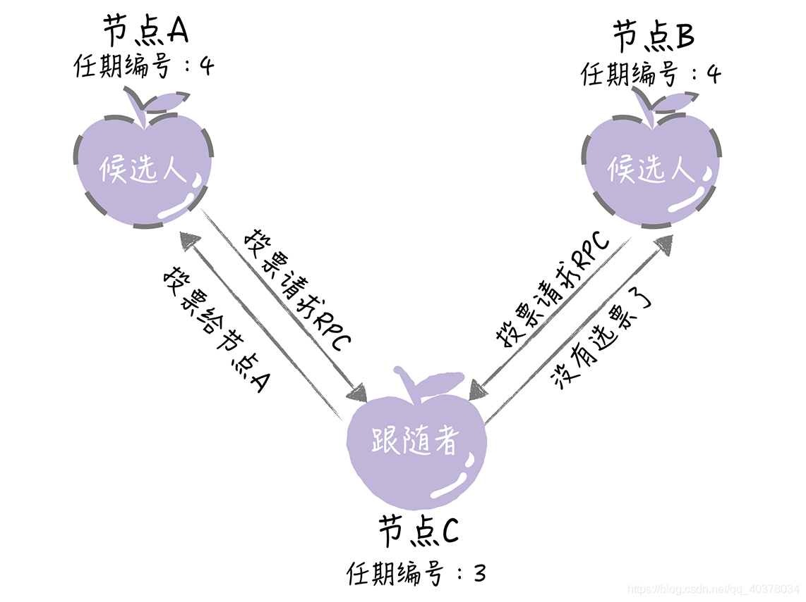

**日志完整性高的跟随者（也就是最后一条日志项对应的任期编号值更大，索引号更大）拒绝投票给日志完整性低的候选人**。比如节点B的任期编号为3，节点C的任期编号为4，节点B的最后一条日志项对应的任期编号为3，而节点C为2，那么当节点C请求节点B投票给自己时，节点B将拒绝投票。

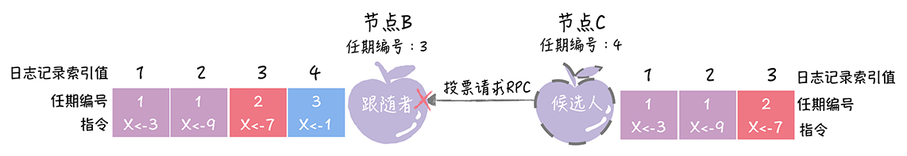

### 4.2.2 日志复制

副本数据是以日志的形式存在的，日志是由日志项组成，日志项是一种数据格式，它主要包含用户指定的数据，也就是指令（Command），还包含一些附加信息，比如索引值（Log index）、任期编号（Term）。

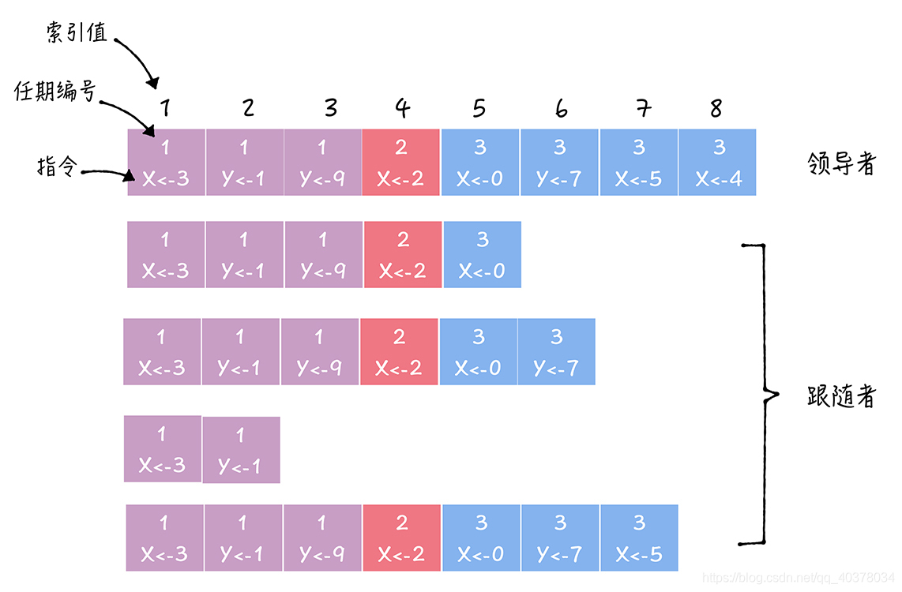

* **指令**：一条由客户端请求指定的、状态机需要执行的指令，可以理解成客户端指定的数据
* **索引值**：日志项对应的整数索引值，用来标识日志项的，是一个连续的、单调递增的证书号码
* **任期编号**：创建这条日志项的领导者的任期编号

首先，领导者通过日志复制消息，将日志项复制到集群其他节点上。

接着，如果领导者接收到大多数的复制成功响应后，它将日志项应用到它的状态机，并返回成功给客户端。如果领导者没有接收到大多数的复制成功响应，那么就返回错误给客户端。

领导者将日志项应用到它的状态机，怎么没通知跟随者应用日志项呢？

因为领导者的日志复制RPC消息或心跳消息，包含了当前最大的、将会被提交的日志项索引值。所以通过日志复制RPC消息或心跳消息，跟随者就可以知道领导者的日志提交位置信息。

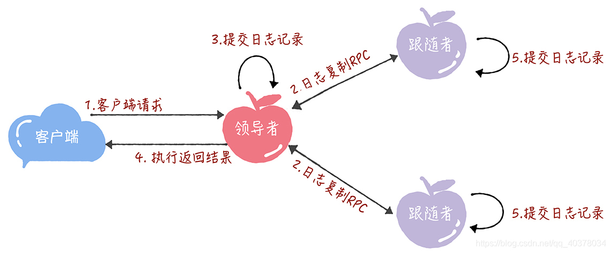

1. 接收到客户端请求后，领导者基于客户端请求中的指令，创建一个新日志项，并附加到本地日志中
2. 领导者通过日志复制RPC，将新的日志复制到其他的服务器
3. 当领导者将日志项成功复制到大多数的服务器上的时候，领导者会将这条日志项应用到它的状态机中
4. 领导者将执行的结果返回给客户端
5. 当跟随者接收到心跳消息，或者新的日志复制RPC消息后，如果跟随者发现领导者已经提交了某条日志项，而它还没应用，那么跟随者就将这条日志项应用到本地的状态机上

在Raft算法中，领导者通过强制跟随者直接复制自己的日志项，处理不一致日志。跟随者中的不一致日志项会被领导者的日志覆盖，而且领导者从来不会覆盖或者删除自己的日志。

也就是说，**Raft是通过以领导者的日志为准，来实现各节点日志的一致性的**。

## 4.3 总结

Raft算法的强领导者模型选举限制和局限如下：

* 读写请求和数据转发压力落在领导者节点，相当于单机，性能和吞吐量也会受到限制
* 大规模跟随者的集群，领导者需要承担大量元数据维护和心跳通知的成本
* 领导者单点问题，故障后直到新领导者选举出来期间集群不可用
* 随着候选人规模增长，收集半数以上投票的成本更大

强领导者模型会限制集群的写性能，有什么办法能突破Raft集群的写性能瓶颈呢？

参考Kafka的分区和ES的主分片副本分片这种机制，虽然写入只能通过Leader写，但每个Leader可以负责不同的片区，来提高写入的性能。

Paxos算法和Raft算法有显而易见的相同点和不同点。二者的共同点在于，它们本质上都是单主的一致性算法，且**都以不存在拜占庭将军问题作为前提条件**。二者的不同点在于，Paxos算法相对于Raft，更加理论化，原理上理解比较抽象，仅仅提供了一套理论原型，这导致很多人在工业上实现Paxos时，不得已需要做很多针对性的优化和改进，但是改进完却发现算法整体和Paxos相去甚远，无法从原理上保证新算法的正确性，这一点是Paxos难以工程化的一个很大原因。相比之下Raft描述清晰，作者将算法原型的实现步骤完整地列在论文里，极大地方便了业界的工程师实现该算法，因而能够受到更广泛的应用。同时Paxos日志的传输过程中允许有空洞，而Raft传输的日志却一定是需要有连续性的，这个区别致使它们确认日志传输的过程产生差异。

但其实从根本上来看，Raft的核心思想和Paxos是非常一致的，甚至可以说，Raft是基于Paxos的一种具体化实现和改进，它让一致性算法更容易为人所接受，更容易得到实现。由此亦可见，Paxos在一致性算法中的奠基地位是不可撼动的。

# 5、Pow协议

## 5.1 引言

Gossip、Paxos、Raft及其变种在生产环境得到了广发的应用，但是，这类经典的一致性协议头上始终悬着一把达克摩斯之剑——无法解决**拜占庭将军问题**。也就意味着**它们只能在安全的、可靠的信道使用，可以容忍消息的乱序、丢失，但是不能容忍消息的篡改**。

拜占庭将军问题，是Lamport大神在论文中抽象出来一个著名的例子：

> 拜占庭帝国想要进攻一个强大的敌人，为此派出了10支军队去包围这个敌人。这个敌人虽不比拜占庭帝国，但也足以抵御5支常规拜占庭军队的同时袭击。这10支军队在分开的包围状态下同时攻击。他们任一支军队单独进攻都毫无胜算，除非有至少6支军队（一半以上）同时袭击才能攻下敌国。他们分散在敌国的四周，依靠通信兵骑马相互通信来协商进攻意向及进攻时间。困扰这些将军的问题是，他们不确定他们中是否有叛徒，叛徒可能擅自变更进攻意向或者进攻时间。在这种状态下，拜占庭将军们才能保证有多于6支军队在同一时间一起发起进攻，从而赢取战斗？

拜占庭将军问题中并不去考虑通信兵是否会被截获或无法传达信息等问题，即消息传递的信道绝无问题。Lamport已经证明了**在消息可能丢失的不可靠信道上试图通过消息传递的方式达到一致性是不可能的**。所以，在研究拜占庭将军问题的时候，已经假定了信道是没有问题的。

单从上面的说明可能无法理解这个问题的复杂性，我们来简单分析一下：

1. 先看在没有叛徒情况下，假如一个将军A提一个进攻提议（如：明日下午1点进攻，你愿意加入吗？）由通信兵通信分别告诉其他的将军，如果幸运中的幸运，他收到了其他6位将军以上的同意，发起进攻。如果不幸，其他的将军也在此时发出不同的进攻提议（如：明日下午2点、3点进攻，你愿意加入吗？），由于时间上的差异，不同的将军收到（并认可）的进攻提议可能是不一样的，这是可能出现A提议有3个支持者，B提议有4个支持者，C提议有2个支持者等等。
2. 再加一点复杂性，在有叛徒情况下，一个叛徒会向不同的将军发出不同的进攻提议（通知A明日下午1点进攻， 通知B明日下午2点进攻等等），一个叛徒也会可能同意多个进攻提议（即同意下午1点进攻又同意下午2点进攻）。

叛徒发送前后不一致的进攻提议，被称为“拜占庭错误”，而能够处理拜占庭错误的这种容错性称为**拜占庭容错**（Byzantine fault tolerance，简称为BFT）。

对于拜占庭容错，往往都需要通过其他方面的激励或惩罚，来让“诚实”表达的节点利益最大化。

在出现比特币之前，解决分布式系统一致性问题主要是Lamport提出的Paxos算法或其衍生算法。Paxos类算法仅适用于中心化的分布式系统，这样的系统的没有不诚实的节点（不会发送虚假错误消息，但允许出现网络不通或宕机出现的消息延迟）。

**中本聪**在比特币中创造性的引入了“**工作量证明**（POW : Proof of Work）”来解决这个问题，大量的节点参与竞争，通过自身的工作量大小来证明自己的能力，最终能力最大的节点获得优胜，其他节点的信息需要与该节点统一。

通过工作量证明就增加了发送信息的成本，降低节点发送消息速率，这样就以保证在一个时间只有一个节点(或是很少)在进行广播，同时在广播时会附上自己的签名。

这个过程就像一位将军A在向其他的将军（B、C、D…）发起一个进攻提议一样，将军B、C、D…看到将军A签过名的进攻提议书，如果是诚实的将军就会立刻同意进攻提议，而不会发起自己新的进攻提议。

我们稍微把将军问题改一下：假设攻下一个城堡需要多次的进攻，每次进攻的提议必须基于之前最多次数的胜利进攻下提出的（只有这样敌方已有损失最大，我方进攻胜利的可能性就更大），这样约定之后，将军A在收到进攻提议时，就会检查一下这个提议是不是基于最多的胜利提出的，如果不是（基于最多的胜利）将军A就不会同意这样的提议，如果是的，将军A就会把这次提议记下来。

这就是比特币网络**最长链选择**。

## 5.2 执行过程

如何构建一个安全、稳定、有效的隐匿系统，前辈们滋滋不求，一直进行尝试但每次都以失败告终。直到2008年10月31日，中本聪(化名)第一次出现，他在一个密码朋克邮件组中发帖2，写到：

> 我一直在研究一种全新的电子现金系统，它完全是点对点的，没有可信赖的第三方。 I’ve been working on a new electronic cash system that’s fully peer-to-peer, with no trusted third party.

从软件工程上，比特币是一个分布式系统。中本聪利用密码学知识解决了分布式共识问题，而且是零信任环境。 他巧妙地利用加密哈希算法特性（比特币使用的哈希算法是**SHA-256**，这类SHA-2算法簇是一种“单向”操作）。**对于给定的哈希值，没有实用的方法可以反向计算出原始输入**，也就是说很难伪造，且不同的原始输入值对应的哈希值差异大，无规律可循。

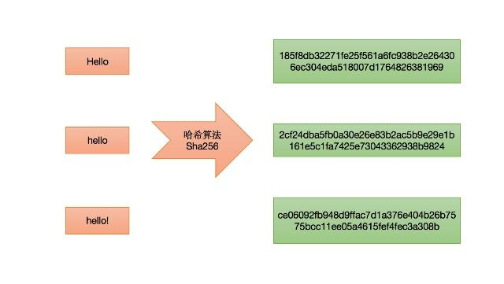

从上图中，我们可以看到只有细微差异的三个输入值：”hello”、”Hello”、”Hello!“，其对应的哈希值天壤之别。

按照工作量证明的策略，中本聪在比特币系统中，给每一个节点出了一个难题。
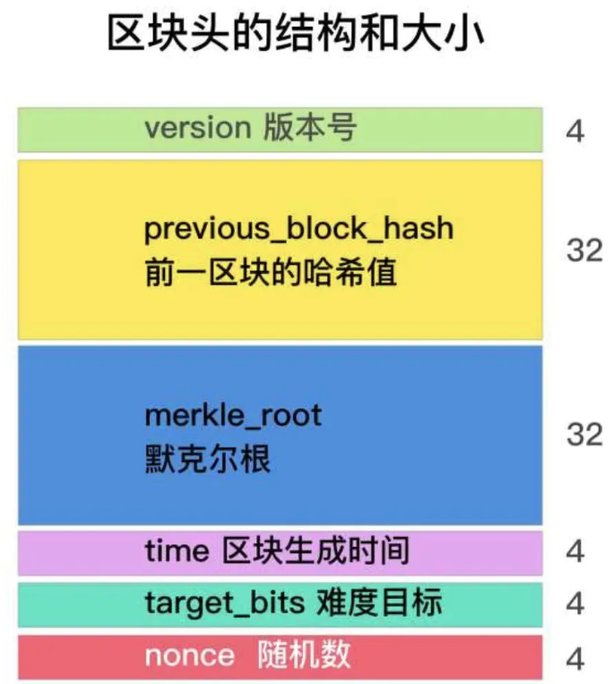

上图是一个区块头的数据结构，里面有个Nonce字段。中本聪的难题就是：在其他字段值不变的前提下，通过不断调节Nonce的值，来对BlockHeader这个结构体值算Hash，要求找到一个Nonce值，使得算出来的hash值小于或大于某个固定值，在BlockHeader结构体中由`target_bits`来标示，这个固定值就是**难度目标**，每两周更新一次。

因为哈希算法的单向性操作，无法逆向根据哈希值计算原始输入。因此为了寻找一个符合要求的哈希值，矿工就不得不在利用已知的前区块哈希、交易集哈希、时间戳再上附加一个数字，不断的更换nonce随机数，使用这个值计算出的哈希值能满足那个固定的难度目标。

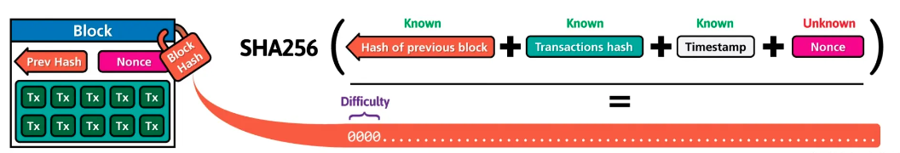

找出那个数字的耗时只取决于计算机哈希计算速度和难度系数，计算速度越快能越早找出，难度越大，查找的次数越多，时间越长。这个数字是不确定的，是1到2的256次方之间的数，称之为随机数nonce。

有了这个随机数，矿工立即将随机数记录到区块上并立即广播这个区块，其他节点收到这个区块后，只需要执行一次哈希运算就可以验证这个区块是否符合难度要求。一旦符合要求，节点便放弃本地的挖矿工作，立即进入下一个区块的挖矿。如果全网51%以上的节点都接收了这个区块，全网便已达成共识。找出这个随机数的矿工，将获得奖励（比特币）。

这就是工作量证明，简称Pow（proof of work），只有劳动才有收获，多劳多得，没有不劳而获。

工作证明早期便用使用，主要用于防止DOS攻击，以及过滤垃圾邮件，强迫每个邮件发送者，必须进行一段垃圾运算，人为造成一小段时间的延迟，比如1s。正常发送邮件的人，每天只发几封十几封，几乎不会察觉什么。但是，发送垃圾邮件的人就惨了，之前限制他发送速度的是网速，每秒能发1000封，现在又多了个CPU性能的限制，速度变成了每秒1封。速度降低1000倍，也就减少了垃圾邮件的影响。 类似的策略也可以用于反爬虫，反机器人一类的。

PoW算法革命性的解决分布式共识决策问题。在一个充满欺诈的分布式环境中，不需要任何第三方介入，也不需要任何节点间的协作，就让各个节点间达成一致性共识。

如何达成共识的呢？因为有成千上万的矿工同时在对一个高度的区块寻找随机数，意味着只要时间充足，总能找到。很有可能有多个矿工相继找到随机数。这样网络中便存在多个符合要求的区块，造成区块链分叉。

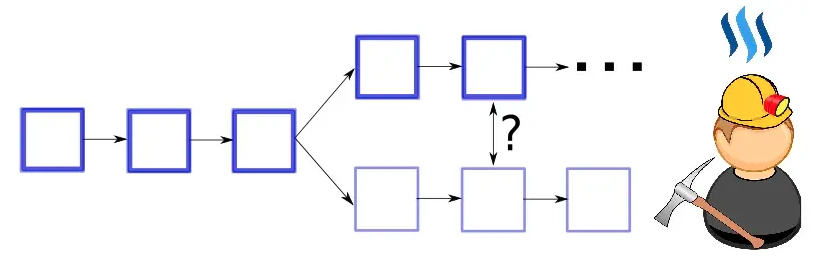

到底该选哪一条继续延伸？此时就看网络中的大部分矿工如何选择，**默认原则是选择最长的一个分支继续挖矿**。经过短暂分叉后又走在一起，分分合合，携手共进。

## 5.3 总结

工作量证明其实相当于提高了做叛徒（发布虚假区块）的成本，在工作量证明下，只有第一个完成证明的节点才能广播区块，竞争难度非常大，需要很高的算力，如果不成功其算力就白白的耗费了（算力是需要成本的），如果有这样的算力作为诚实的节点，同样也可以获得很大的收益（这就是矿工所作的工作），这也实际就不会有做叛徒的动机，整个系统也因此而更稳定。

依靠Pow算法，比特币很大程度保证了交易平台的安全性。因为如果要对该平台的数据进行篡改或者毁坏，篡改者至少需要获得比特币全网一半以上的算力，这是非常难以达到的。

但是同样Pow存在很多缺点，Pow达成一致性的速度很慢，应用在比特币中每秒钟只能做成7笔交易，这在大部分的商业应用中都是达不到要求的。其次Pow造成了很大的资源浪费。所有的竞争者夺取记账权需要付出巨大的硬件算力，这在背后是大量的硬件成本、电力损耗，而一旦记账权确定，其余没有获得记账权的节点的算力等于白白浪费。最后是现在出现了一些大规模的专业矿场，这些矿场的算力非常强大，它们的存在增大了平台被篡改的可能性。
