# 1、引言

在微服务架构中，根据业务来拆分成一个个的服务，服务与服务之间可以相互调用（RPC）。为了保证其高可用，单个服务通常会集群部署。由于网络原因或者自身的原因，服务并不能保证100%可用，如果单个服务出现问题，调用这个服务就会出现线程阻塞，此时若有大量的请求涌入，Servlet容器的线程资源会被消耗完毕，导致服务瘫痪。服务与服务之间的依赖性，故障会传播，会对整个微服务系统造成灾难性的严重后果，这种现象就是“**服务雪崩**”。

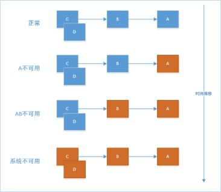

如上图图所示：A作为服务提供者，B为A的服务消费者，C和D是B的服务消费者。A不可用引起了B的不可用，并将不可用像滚雪球一样放大到C和D时，雪崩效应就形成了。

另外，在大中型分布式系统中，通常系统很多依赖(HTTP,hession,Netty,Dubbo等)，如下图：

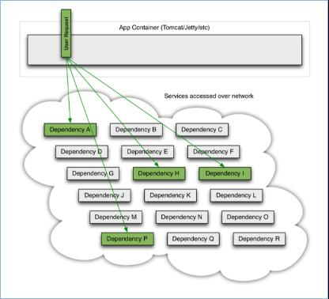

在高并发访问下，这些依赖的稳定性与否对系统的影响非常大，但是依赖有很多不可控问题：如网络连接缓慢，资源繁忙，暂时不可用，服务脱机等。

如下图：QPS为50的依赖 I 出现不可用，但是其他依赖仍然可用：

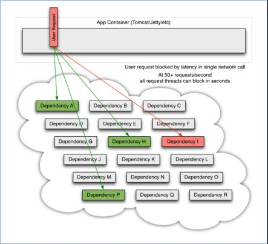

当依赖I 阻塞时，大多数服务器的线程池就出现阻塞，影响整个线上服务的稳定性。如下图:

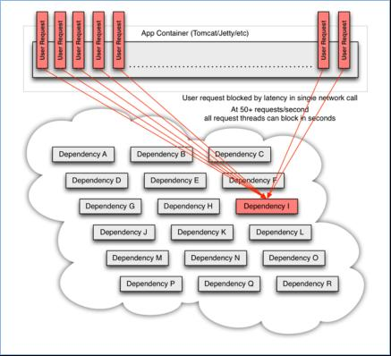

在复杂的分布式架构的应用程序有很多的依赖，都会不可避免地在某些时候失败。高并发的依赖失败时如果没有隔离措施，当前应用服务就有被拖垮的风险。

很多服务框架会提供服务重试机制，在很大程度上解决了由于网络瞬时不可达的问题。但是**在很多的情况下造成服务雪崩的元凶正是服务重试机制**。

某个服务本来就已经出现问题了，造成资源占用无法释放、请求延时等问题。这时在请求失败之后又不断的发送重试请求，在原本就无法释放的资源基础上继续膨胀式占用，导致整个系统资源耗尽。导致服务雪崩。

要防止系统发生雪崩，就必须要有**容错设计**。如果遇到突增流量，一般的做法是对非核心业务功能采用**熔断**和**降级**的措施来保护核心业务功能正常服务，而对于核心功能服务，则需要采用**限流**的措施。

# 2、熔断

**熔断**来自英文短语`circuit breaker`，circuit breaker在电工学里就是断路器的意思。它就相当于一个开关，打开后可以阻止流量通过。比如保险丝，当电流过大时，就会熔断，从而避免元器件损坏。

服务熔断是指调用方访问服务时通过断路器做代理进行访问，断路器会持续观察服务返回的成功、失败的状态，当失败超过设置的阈值时断路器打开，请求就不能真正地访问到服务了。

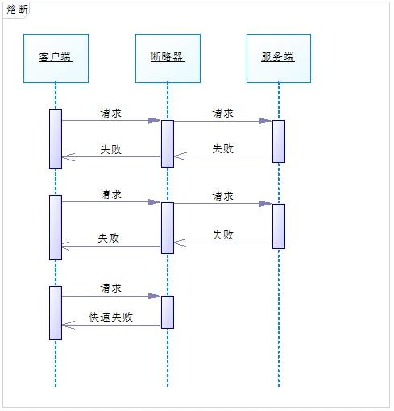

一般而言，熔断状态不会一直持续，而是有一个时间范围，时间过了以后再去尝试请求服务提供者，一旦服务提供者的服务能力恢复，请求将继续可以调用服务提供者。

断路器的状态转换图如下：

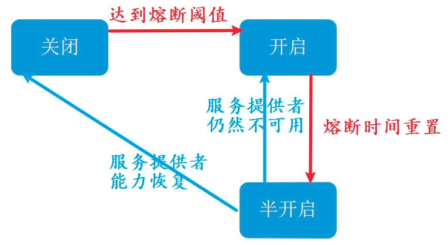

* 断路器默认处于“关闭”状态，当服务提供者的错误率到达阈值，就会触发断路器“开启”。
* 断路器开启后进入熔断时间，到达熔断时间终点后重置熔断时间，进入“半开启”状态
* 在半开启状态下，如果服务提供者的服务能力恢复，则断路器关闭熔断状态。进而进入正常的服务状态。
* 在半开启状态下，如果服务提供者的服务能力未能恢复，则断路器再次触发服务熔断，进入熔断时间。

# 3、降级

服务熔断通常适与服务降级配合使用。在服务发生熔断后，一般会让请求走事先配置的处理方法，这个处理方法就是一个降级逻辑。

简言之，**服务降级是一种兜底的服务策略，体现了一种“实在不行就怎么这么样”的思想**。想去北京买不到飞机票，实在不行就坐高铁去吧；感冒了想去看病挂不上号，实在不行就先回家吃点药睡一觉吧；实在不行之后的处理方法，被称为**fallback方法**。

当服务提供者故障触发调用者服务的熔断机制，服务调用者就不再调用远程服务方法，而是调用本地的fallback方法。此时你需要预先提供一个处理方法，作为服务降级之后的执行方法，fallback返回值一般是设置的默认值或者来自缓存。

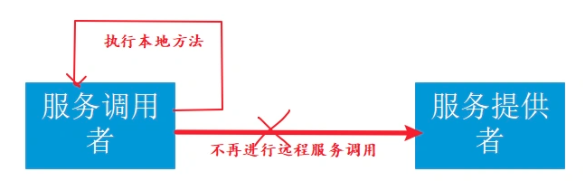

除了可以在服务调用端实现服务降级，还可以在服务提供端实现服务降级。

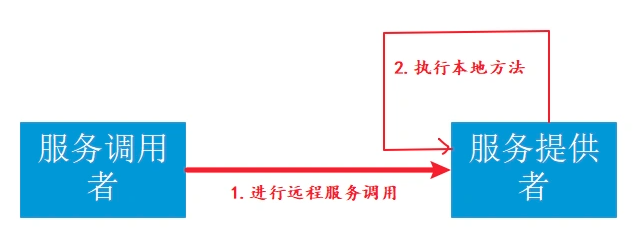

实际上在大型的微服务系统中，服务提供者和服务消费者并没有严格的区分，很多的服务既是提供者，也是消费者。

# 4、限流

## 4.1 为什么需要限流

举一个我们生活中的例子：一些热门的旅游景点，往往会对每日的旅游参观人数有严格的限制，比如厦门的鼓浪屿、北京的故宫等，每天只会卖出固定数目的门票，如果你去的晚了，可能当天的票就已经卖完了，当天就无法进去游玩了。

为什么旅游景点要做这样的限制呢？多卖一些门票多赚一些钱岂不是更好？

原因在于景点的服务资源是有限的，每日能服务的人数是有限的，一旦放开限制了，景点的工作人员就会不够用，卫生情况也得不到保障，安全也有隐患，超密集的人群也会严重的影响游客的体验。 但由于景区名气大，来游玩的旅客络绎不绝，远超出了景区的承载能力，因此景区只好做出限制每日人员流量的举措。

同理，在IT软件行业中，系统服务也是这样的。

> 服务限流是指当系统资源不够，不足以应对大量请求，即系统资源与访问量出现矛盾的时候，我们为了保证有限的资源能够正常服务，因此对系统按照预设的规则进行流量限制或功能限制的一种方法。

如果你的系统理论是时间单位内可服务100W用户，但是今天却突然来了300W用户，由于用户流量的随机性，如果不加以限流，很有可能这300W用户一下子就压垮了系统，导致所有人都得不到服务。

因此为了保证系统至少还能为100W用户提供正常服务，我们需要对系统进行限流设计。

有的人可能会想，既然会有300W用户来访问，那为啥系统不干脆设计成能足以支撑这么大量用户的集群呢？

这是个好问题。如果系统是长期有300W的用户来访问，肯定是要做上述升级的，但是常常面临的情况是，系统的日常访问量就是100W，只不过偶尔有一些不可预知的特定原因导致的短时间的流量激增，这个时候，公司往往出于节约成本的考虑，不会为了一个不常见的尖峰来把我们的系统扩容到最大的尺寸。

## 4.2 计数器算法

最简单的实现方式，维护一个计数器，来一个请求计数加一，达到阈值时，直接拒绝请求。比如限流qps为100，算法的实现思路就是从第一个请求进来开始计时，在接下去的1s内，每来一个请求，就把计数加1，如果累加的数字达到了100，那么后续的请求就会被全部拒绝。等到1s结束后，把计数恢复成0，重新开始计数。

但是这个方法存在 2 个明显的问题。

（1）单位时间(比如 1s )很难把控，如下图：

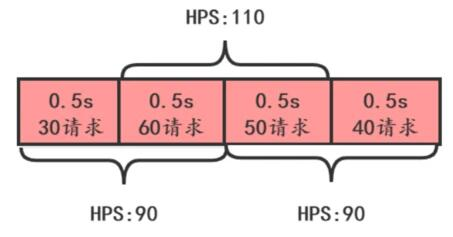

这张图上，从下面时间看， HPS 没有超过 100 ，但是从上面看 HPS 超过 100 了。

(2)突刺现象

如果我在单位时间1s内的前10ms，已经通过了100个请求，那后面的990ms，只能眼巴巴的把请求拒绝，我们把这种现象称为“突刺现象”

## 4.3 滑动时间窗口

滑动时间窗口算法是目前比较流行的限流算法，主要思想是把时间看做是一个向前滚动的窗口，如下图：

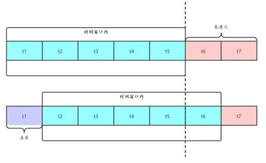

开始的时候，我们把 `t1~t5` 看做一个时间窗口，每个窗口 `1s` ，如果我们定的限流目标是每秒 50 个请求，那 `t1~t5` 这个窗口的请求总和不能超过 250 个。

这个窗口是滑动的，下一秒的窗口成了 `t2~t6` ，这时把 `t1` 时间片的统计抛弃，加入 `t6` 时间片进行统计。这段时间内的请求数量也不能超过 250 个。

滑动时间窗口的优点是解决了流量计数器算法的缺陷，但是也有 2 个问题：

* 流量超过就必须抛弃或者走降级逻辑
* 对流量控制不够精细，不能限制集中在短时间内的流量，也不能削峰填谷

## 4.4 漏桶算法

为了消除"突刺现象"，可以采用漏桶算法实现限流，漏桶算法这个名字就很形象，算法内部有一个容器，类似生活用到的漏斗，当请求进来时，相当于水倒入漏斗，然后从下端小口慢慢匀速的流出。不管上面流量多大，下面流出的速度始终保持不变。

不管服务调用方多么不稳定，通过漏桶算法进行限流，每10毫秒处理一次请求。因为处理的速度是固定的，请求进来的速度是未知的，可能突然进来很多请求，没来得及处理的请求就先放在桶里，既然是个桶，肯定是有容量上限，如果桶满了，那么新进来的请求就丢弃。

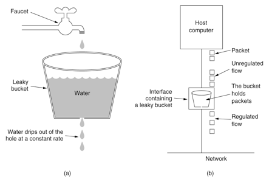

在算法实现方面，可以准备一个队列，用来保存请求，另外通过一个线程池来定期从队列中获取请求并执行，可以一次性获取多个并发执行。

漏桶算法的优点是实现简单，可以使用消息队列来削峰填谷，但是也有3个问题需要考虑:

* 漏桶的大小，如果太大，可能给服务端带来较大处理压力，太小可能会有大量请求被丢弃。
* 漏桶给服务端的请求发送速率。
* 使用缓存请求的方式，会使请求响应时间变长。

## 4.5 令牌桶算法

从某种意义上讲，令牌桶算法是对漏桶算法的一种改进，桶算法能够限制请求调用的速率，而令牌桶算法能够在限制调用的平均速率的同时还允许一定程度的突发调用。

在令牌桶算法中，存在一个桶，用来存放固定数量的令牌。算法中存在一种机制，以一定的速率往桶中放令牌。每次请求调用需要先获取令牌，只有拿到令牌，才有机会继续执行，否则选择选择等待可用的令牌、或者直接拒绝。

放令牌这个动作是持续不断的进行，如果桶中令牌数达到上限，就丢弃令牌，所以就存在这种情况，桶中一直有大量的可用令牌，这时进来的请求就可以直接拿到令牌执行，比如设置qps为100，那么限流器初始化完成一秒后，桶中就已经有100个令牌了，这时服务还没完全启动好，等启动完成对外提供服务时，该限流器可以抵挡瞬时的100个请求。所以，只有桶中没有令牌时，请求才会进行等待，最后相当于以一定的速率执行。

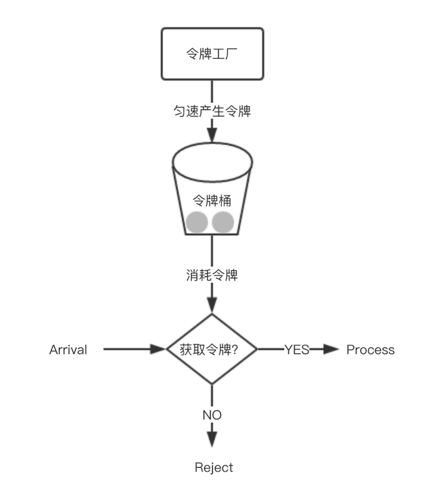

令牌桶算法实现并不复杂，使用信号量就可以实现。在实际限流场景中使用最多，比如 google 的 guava 中就实现了令牌桶算法限流，感兴趣可以研究一下。

## 4.6 分布式限流

前面讨论的几种算法都属于单机限流的范畴，如果在分布式系统场景下，上面介绍几种限流算法是否还适用呢？

以令牌桶算法为例，假如在电商系统中客户下了一笔订单，如下图：

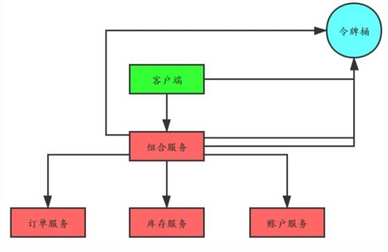

比如为了限制某个资源被每个用户或者商户的访问次数，5s只能访问2次，或者一天只能调用1000次，这种需求，单机限流是无法实现的，这时就需要通过集群限流进行实现。

如果我们把令牌桶单独保存在一个地方(比如 Redis 中)供整个分布式系统用，那客户端在调用组合服务，组合服务调用订单、库存和账户服务都需要跟令牌桶交互，交互次数明显增加了很多。

有一种改进就是客户端调用组合服务之前首先获取四个令牌，调用组合服务时减去一个令牌并且传递给组合服务三个令牌，组合服务调用下面三个服务时依次消耗一个令牌。

# 5、开源框架

## 5.1 Hystrix

### 5.1.1 概述

> Hystrix是由Netflix开源的一个工具类库，经常被用于服务的熔断，降级等领域，基于**RxJava**（一种基于观察者模式的响应式编程框架）实现，具备服务降级、服务熔断、线程与信号隔离、请求缓存、请求合并以及服务监控等强大功能。


Hystrix对应的中文名字是“豪猪”，豪猪周身长满了刺，能保护自己不受天敌的伤害，代表了一种防御机制，这与Hystrix本身的功能不谋而合，因此Netflix团队将该框架命名为Hystrix，并使用了对应的卡通形象做作为Logo。

Hystrix具有以下特征：

1. 通过`HystrixCommand`或者`HystrixObservableCommand`来封装对外部依赖的访问请求，这个访问请求一般会运行在独立的线程中，资源隔离
2. 对于超出我们设定阈值的服务调用，直接进行超时，不允许其耗费过长时间阻塞住。这个超时时间默认是99.5%的访问时间
3. **为每一个依赖服务维护一个独立的线程池**，或者是信号量，当线程池已满时，直接拒绝对这个服务的调用
4. 对依赖服务的调用的成功次数，失败次数，拒绝次数，超时次数，进行统计
5. 如果对一个依赖服务的调用失败次数超过了一定的阈值，自动进行熔断，在一定时间内对该服务的调用直接降级，一段时间后再自动尝试恢复
6. 当一个服务调用出现失败，被拒绝，超时，短路等异常情况时，自动调用fallback降级机制
7. 对属性和配置的修改提供近实时的支持

### 5.1.2 原理与使用

Hystrix服务调用的内部逻辑如下图所示：
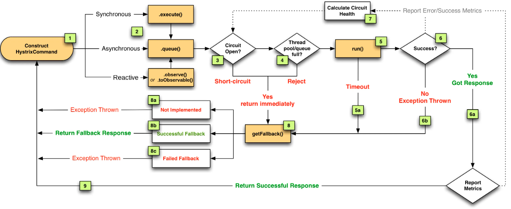

1. 构建Hystrix的Command对象, 调用执行方法.
2. Hystrix检查当前服务的熔断器开关是否开启, 若开启, 则执行降级服务getFallback方法.
3. 若熔断器开关关闭, 则Hystrix检查当前服务的线程池是否能接收新的请求, 若超过线程池已满, 则执行降级服务getFallback方法.
4. 若线程池接受请求, 则Hystrix开始执行服务调用具体逻辑run方法.
5. 若服务执行失败, 则执行降级服务getFallback方法, 并将执行结果上报Metrics更新服务健康状况.
6. 若服务执行超时, 则执行降级服务getFallback方法, 并将执行结果上报Metrics更新服务健康状况.
7. 若服务执行成功, 返回正常结果.
8. 若服务降级方法getFallback执行成功, 则返回降级结果.
9. 若服务降级方法getFallback执行失败, 则抛出异常.

Hystrix 提供了两个请求命令：`HystrixCommand`、`HystrixObservableCommand`可以使用这两个对象来包裹待执行的任务。`HystrixCommand`用与依赖服务返回单个操作结果的场景，而`HystrixObservableCommand`用于依赖服务返回多个操作结果的场景。

下面的代码实例，通过在方法上加上`HystrixCommand`注解和`HystrixProperty`注解来实现某个方法的服务熔断配置：

```java
@PostMapping(value = "/pwd/reset")
@HystrixCommand(
  commandProperties = {
    @HystrixProperty(name = "metrics.rollingStats.timeInMilliseconds", value = "10000") //统计窗口时间
    @HystrixProperty(name = "circuitBreaker.enabled", value = "true"),  //启用熔断功能
    @HystrixProperty(name = "circuitBreaker.requestVolumeThreshold", value = "20"),  //20个请求失败触发熔断
    @HystrixProperty(name = "circuitBreaker.errorThresholdPercentage", value = "60"),  //请求错误率超过60%触发熔断
    @HystrixProperty(name = "circuitBreaker.sleepWindowInMilliseconds", value = "300000"),//熔断后开始尝试恢复的时间
  }
)
public AjaxResponse pwdreset(@RequestParam Integer userId) {
  sysuserService.pwdreset(userId);
  return AjaxResponse.success("重置密码成功!");
}

```

* 熔断开关：`enabled=ture`，打开断路器状态转换的功能。
* 熔断阈值配置
    * `requestVolumeThreshold=20`，表示在Hystrix默认的时间窗口10秒钟之内有20个请求失败（没能正常返回结果），则触发熔断。断路器由“关闭状态”进入“开启状态”。
    * `errorThresholdPercentage=60`，表示在Hystrix默认的时间窗口10秒钟之内有60%以上的请求失败（没能正常返回结果），则触发熔断。断路器由“关闭状态”进入“开启状态”。
* 熔断恢复时间：`sleepWindowInMilliseconds=300000`，表示断路器开启之后300秒钟进入半开启状态。


## 5.1 Sentinel

### 5.1.1 概述

> Sentinel 是阿里中间件团队研发的面向分布式服务架构的轻量级高可用流量控制组件，于2018年7月正式开源。Sentinel 主要以流量为切入点，从流量控制、熔断降级、系统负载保护等多个维度来帮助用户提升服务的稳定性。

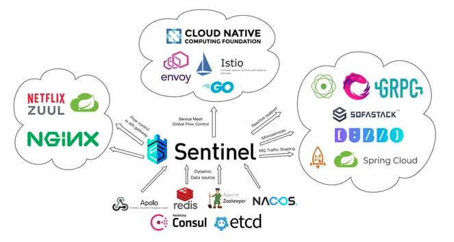

Sentinel具有以下特征：

1. 轻量级，核心库无多余依赖，性能损耗小。
2. 方便接入，开源生态广泛。
3. 丰富的流量控制场景。
4. 易用的控制台，提供实时监控、机器发现、规则管理等能力。
5. 完善的扩展性设计，提供多样化的 SPI 接口，方便用户根据需求给 Sentinel 添加自定义的逻辑。

### 5.1.2 原理与使用

Sentinel总体的框架如下:
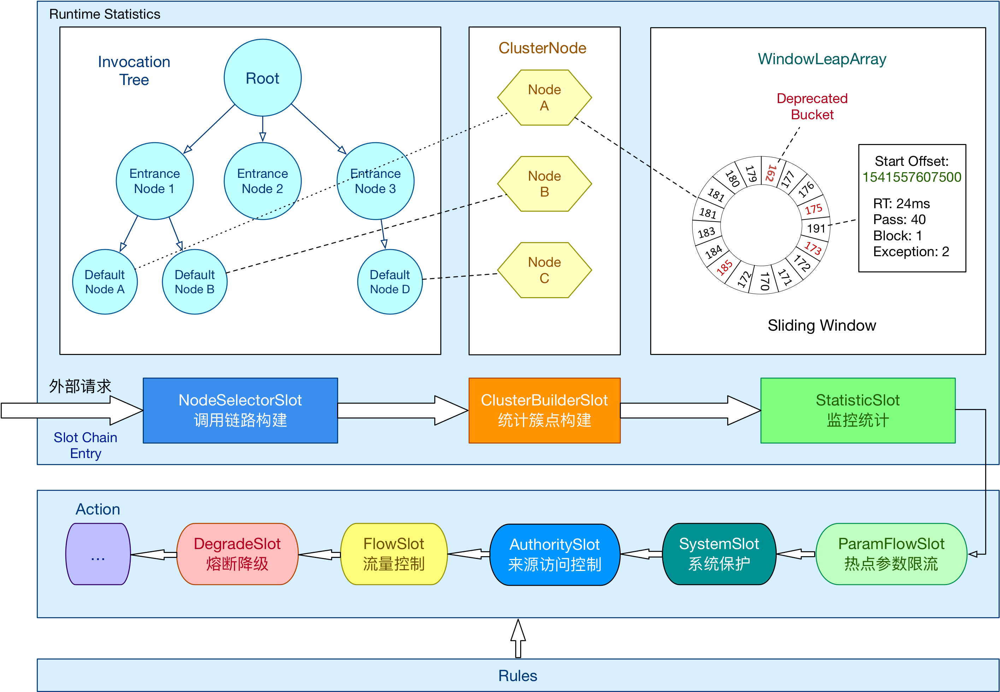

在 Sentinel 里面，所有的资源都对应一个资源名称以及一个 `Entry`。`Entry` 可以通过对主流框架的适配自动创建，也可以通过注解的方式或调用 API 显式创建；每一个 `Entry` 创建的时候，同时也会创建一系列**功能插槽**（slot chain）。这些插槽有不同的职责，例如:

* **NodeSelectorSlot**：负责收集资源的路径，并将这些资源的调用路径，以树状结构存储起来，用于根据调用路径来限流降级；
* **ClusterBuilderSlot**：用于存储资源的统计信息以及调用者信息，例如该资源的 RT, QPS, thread count 等等，这些信息将用作为多维度限流，降级的依据；
* **StatisticSlot**：用于记录、统计不同纬度的 runtime 指标监控信息；
* **FlowSlot**：用于根据预设的限流规则以及前面 slot 统计的状态，来进行流量控制；
* **AuthoritySlot**：根据配置的黑白名单和调用来源信息，来做黑白名单控制；
* **DegradeSlot**：通过统计信息以及预设的规则，来做熔断降级；
* **SystemSlot**：通过系统的状态，例如 load1 等，来控制总的入口流量；

Sentinel 将 `ProcessorSlot` 作为 SPI 接口进行扩展，使得 Slot Chain 具备了扩展的能力。可以自行加入自定义的 slot 并编排 slot 间的顺序，从而可以给 Sentinel 添加自定义的功能。

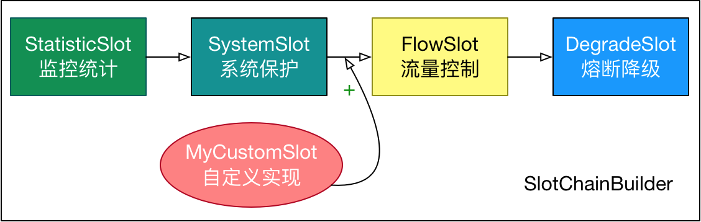


## 5.3 Hystrix与Sentinel的对比

### 5.3.1 资源模型和执行模型上的对比

Hystrix 的资源模型设计上采用了命令模式，其底层的执行是基于 RxJava 实现的。每个 Command 创建时都要指定 `commandKey` 和 `groupKey`（用于区分资源）以及对应的隔离策略（线程池隔离 or 信号量隔离）。线程池隔离模式下需要配置线程池对应的参数（线程池名称、容量、排队超时等），然后 Command 就会在指定的线程池按照指定的容错策略执行；信号量隔离模式下需要配置最大并发数，执行 Command 时 Hystrix 就会限制其并发调用。

Sentinel 的设计则更为简单。相比 Hystrix Command 强依赖隔离规则，Sentinel 的资源定义与规则配置的耦合度更低。Hystrix 的 Command 强依赖于隔离规则配置的原因是隔离规则会直接影响 Command 的执行。在执行的时候 Hystrix 会解析 Command 的隔离规则来创建 RxJava Scheduler 并在其上调度执行，若是线程池模式则 Scheduler 底层的线程池为配置的线程池，若是信号量模式则简单包装成当前线程执行的 Scheduler。而 Sentinel 并不指定执行模型，也不关注应用是如何执行的。Sentinel 的原则非常简单：根据对应资源配置的规则来为资源执行相应的限流/降级/负载保护策略。**在 Sentinel 中资源定义和规则配置是分离的**。用户先通过 Sentinel API 给对应的业务逻辑定义资源（埋点），然后可以在需要的时候配置规则。

Sentinel 提供多样化的规则配置方式。除了直接通过 loadRules API 将规则注册到内存态之外，用户还可以注册各种外部数据源来提供动态的规则。用户可以根据系统当前的实时情况去动态地变更规则配置，数据源会将变更推送至 Sentinel 并即时生效。

### 5.3.2 隔离设计上的对比

**隔离是 Hystrix 的核心功能之一**。Hystrix 提供两种隔离策略：**线程池隔离**和**信号量隔离**，其中最推荐也是最常用的是线程池隔离。Hystrix 的线程池隔离针对不同的资源分别创建不同的线程池，不同服务调用都发生在不同的线程池中，在线程池排队、超时等阻塞情况时可以快速失败，并可以提供 fallback 机制。线程池隔离的好处是隔离度比较高，可以针对某个资源的线程池去进行处理而不影响其它资源，但是代价就是线程上下文切换的开销比较大，特别是对低延时的调用有比较大的影响。

但是，实际情况下，线程池隔离并没有带来非常多的好处。首先就是过多的线程池会非常影响性能。考虑这样一个场景，在 Tomcat 之类的 Servlet 容器使用 Hystrix，本身 Tomcat 自身的线程数目就非常多了（可能到几十或一百多），如果加上 Hystrix 为各个资源创建的线程池，总共线程数目会非常多（几百个线程），这样上下文切换会有非常大的损耗。另外，线程池模式比较彻底的隔离性使得 Hystrix 可以针对不同资源线程池的排队、超时情况分别进行处理，但这其实是超时熔断和流量控制要解决的问题，如果组件具备了超时熔断和流量控制的能力，线程池隔离就显得没有那么必要了。

Sentinel 可以通过并发线程数模式的流量控制来提供信号量隔离的功能。这样的隔离非常轻量级，仅限制对某个资源调用的并发数，而不是显式地去创建线程池，所以开销比较小，但是效果不错。并且结合基于响应时间的熔断降级模式，可以在不稳定资源的平均响应时间比较高的时候自动降级，防止过多的慢调用占满并发数，影响整个系统。而 Hystrix 的信号量隔离比较简单，无法对慢调用自动进行降级，只能等待客户端自己超时，因此仍然可能会出现级联阻塞的情况。

### 5.3.3 熔断降级对比

Sentinel 和 Hystrix 的熔断降级功能本质上都是基于熔断器模式。

**Sentinel 与 Hystrix 都支持基于失败比率（异常比率）的熔断降级**，在调用达到一定量级并且失败比率达到设定的阈值时自动进行熔断，此时所有对该资源的调用都会被 block，直到过了指定的时间窗口后才启发性地恢复。上面提到过，Sentinel 还支持基于平均响应时间的熔断降级，可以在服务响应时间持续飙高的时候自动熔断，拒绝掉更多的请求，直到一段时间后才恢复。这样可以防止调用非常慢造成级联阻塞的情况。

### 5.3.4 实时指标统计实现对比

**Hystrix 和 Sentinel 的实时指标数据统计实现都是基于滑动窗口的**。

Hystrix 1.5 以后对实时指标统计的实现进行了重构，将指标统计数据结构抽象成了响应式流（reactive stream）的形式，方便消费者去利用指标信息。同时底层改造成了基于 RxJava 的事件驱动模式，在服务调用成功/失败/超时的时候发布相应的事件，通过一系列的变换和聚合最终得到实时的指标统计数据流，可以被熔断器或 Dashboard 消费。

Sentinel 目前抽象出了 Metric 指标统计接口，底层可以有不同的实现，目前默认的实现是基于 LeapArray 的滑动窗口，后续根据需要可能会引入 reactive stream 等实现。

### 5.3.5 总结

Hystrix与Sentinel的关键特性对比如下：
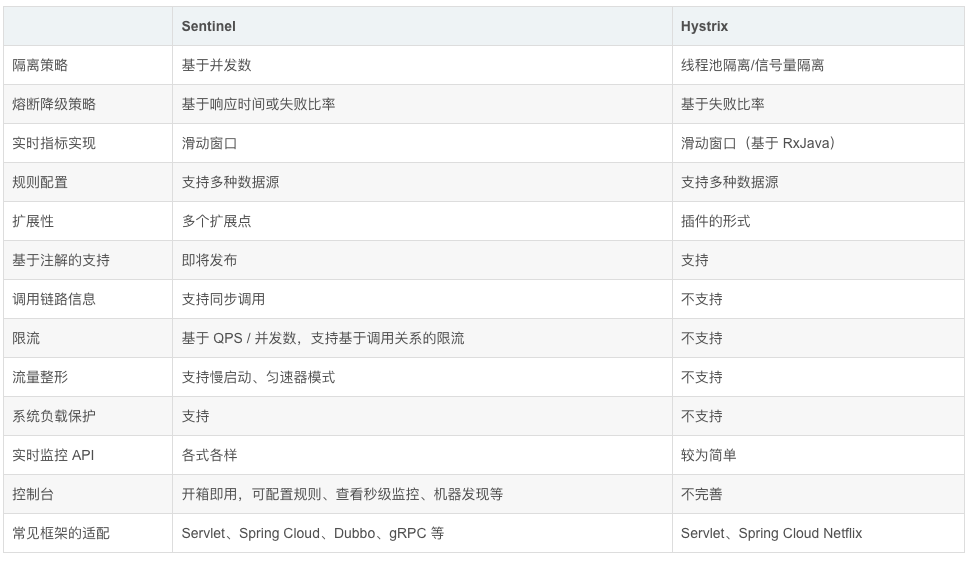

通过上面的对比不难看出，Sentinel在很多方面的设计与实现上都超越了老前辈Hystrix，而且随着Sentinel的不断迭代，生态系统的不断完善，两者的差距还会越来越大，**因为Hystrix项目目前已经进入到维护阶段，不再开发新版本**。

即便如此，Hystrix的很多概念和设计思想都非常有价值，Sentinel也有所借鉴，仍然值得学习。

