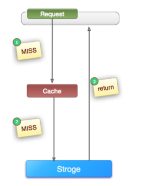
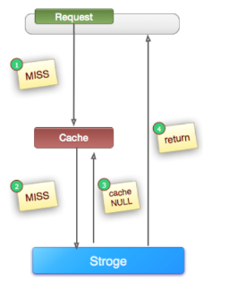
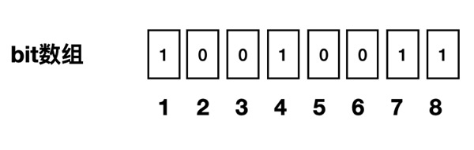
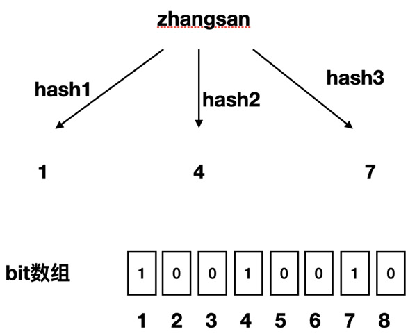
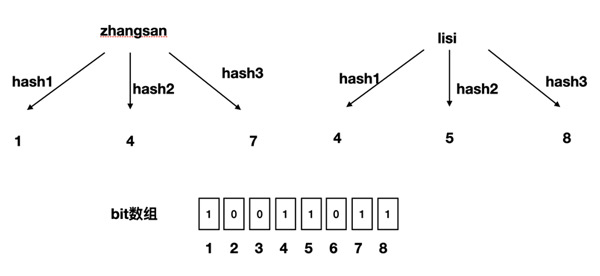
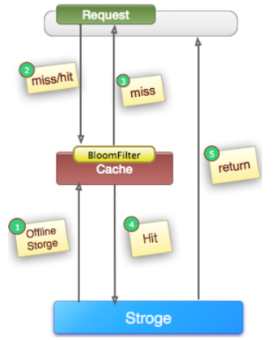

# 1、缓存穿透

> **缓存穿透**是指查询一个不存在的数据，由于缓存不命中，而将请求全部打到数据库上的情况。缓存起不到作用，请求每次都会走到数据库，流量大时数据库可能会被打挂。此时缓存就好像被“穿透”了一样，起不到任何作用。

一般来说，少量的缓存穿透对系统的伤害不大，而且不可避免，原因有以下几点：

- 缓存系统的容量是有限的，不可能存储系统所有的数据，那么在查询未缓存数据的时候就会发生缓存穿透。
- 另一方面就是基于“二八原则”，我们通常只会缓存常用的那 20% 的热点数据。

但是如果我们系统被人恶意攻击，那么很有可能查询的值是伪造的，必然大概率不存在我们的系统中，这样无论查询多少次，在缓存中一直不存在，这样缓存穿透就一直存在。比如用一个不存在的用户id获取用户信息，不论缓存还是数据库都没有，若黑客利用此漏洞进行攻击可能压垮数据库。

下图是一个比较典型的cache-storage架构，cache(例如memcache, redis等等) + storage(例如mysql, hbase等等)架构，查一个压根就不存在的值, 如果不做兼容，永远会查询storage：



基于存在这种大量缓存穿透的可能性，所以我们就需要从根源上解决缓存穿透的问题，目前一般有两种方案：缓存空值和使用布隆过滤器。

## 1.1 缓存空值



如上图所示，当第2步MISS后，仍然将空对象保留到Cache中（可能是保留几分钟或者一段时间，具体问题具体分析），下次新的Request（同一个key）将会从Cache中获取到数据，保护了后端的Storage。

这种方案适用于数据命中不高，数据频繁变化的场景。

下面是一段伪代码：

```java
       Object nullValue = new Object();
        try {
            //从数据库中查询数据
            Object valueFromDB = getFromDB(uid); 
            if (valueFromDB == null) {
                //如果从数据库中查询到空值，就把空值写入缓存，设置较短的超时时间
                cache.set(uid, nullValue, 10);   
            } else {
                cache.set(uid, valueFromDB, 1000);
            }
        } catch (Exception e) {
            cache.set(uid, nullValue, 10);
        }
```

这种方式也存在弊端，因为在缓存系统中存了大量的空值，浪费缓存的存储空间，可能会逐出真实有效的信息反而会造成缓存命中率的下降。

## 1.2 布隆过滤器

1970年布隆提出了一种过滤器的算法，用来判断一个元素是否在一个集合中。布隆过滤器底层是一个超级大的 bit 数组，默认值都是 0 ，一个元素通过多个hash函数映射到这个 bit 数组上，并且将 0 改成 1。

相比于传统的 List、Set、Map 等数据结构，布隆过滤器是一个bit数组, 它更高效、占用空间更少。



如果我们要映射一个值到布隆过滤器中，我们需要使用多个不同的哈希函数生成多个哈希值，并对每个生成的哈希值指向的 bit 位置 1，例如针对值 “zhangsan” 和三个不同的哈希函数分别生成了哈希值 1、4、7：



我们现在再存一个值 “lisi”，如果哈希函数返回 4、5、8 的话，图继续变为：



当我们想要判断布隆过滤器是否记录了某个数据时，布隆过滤器会先对该数据进行同样的哈希处理, 比如 “wangwu”的哈希函数返回了 2、5、8三个值，结果我们发现 2 这个 bit 位上的值为 0，说明没有任何一个值映射到这个 bit 位上，因此我们可以很确定地说 “wangwu” 这个数据**一定不存在**。

但是同时我们会发现，4 这个 bit 位由于”zhangsan”和”lisi”的哈希函数都返回了这个 bit 位，因此它被覆盖了。那么随着布隆过滤器保存的数据不断增多，重复的概率就会不断增大，所以当我们过滤某个数据时，如果发现其三个哈希值都在过滤器中进行了记录，那么也只能说明过滤器中**可能包含了该数据，并不能绝对肯定**，因为哈希碰撞可能导致误判。

也就是说布隆过滤器可以做到以下两点：

- 某个值一定不存在
- 某个可能存在

利用布隆过滤器的这个特点可以解决缓存穿透的问题，在服务启动的时候先把数据的查询条件，例如数据的 ID 映射到布隆过滤器上，当然如果新增数据时，除了写入到数据库中之外，也需要将数据的ID存入到布隆过滤器中。

我们在查询某条数据时，先判断这个查询的 ID 是否存在布隆过滤器中，如果不存在就直接返回空值，而不需要继续查询数据库和缓存，存在布隆过滤器中才继续查询数据库和缓存，这样就解决缓存穿透的问题。




# 2、缓存击穿

> **缓存击穿**是指某一个**热点** key，在缓存过期的一瞬间，同时有大量的请求打进来，由于此时缓存过期了，所以请求最终都会走到数据库，造成瞬时数据库请求量大、压力骤增，甚至可能打垮数据库。

注意与缓存穿透的区别：

- 导致缓存穿透的数据**在数据库不存在，在缓存也不存在**
- 导致缓存击穿的数据**在数据库存在，而缓存不存在**，一般是热点数据的缓存时间到期了

缓存击穿的解决方案有两种：使用互斥锁或设置热点数据永远不过期

## 2.1 互斥锁

业界比较常用的做法是使用mutex。简单地来说，就是在缓存失效的时候（判断拿出来的值为空），只有第一个请求线程能拿到锁并执行数据库查询操作，其他的线程拿不到锁就阻塞等着，等到第一个线程将数据写入缓存后，直接走缓存。

可以使用缓存工具的某些带成功操作返回值的操作（比如Redis的SETNX或者Memcache的ADD）去set一个mutex key。

Redis的`SETNX`是`SET if Not eXists`的缩写，也就是只有不存在的时候才设置，可以利用它来实现锁的效果：

```java
public String get(key) {
      String value = redis.get(key);
      if (value == null) { //代表缓存值过期
          //设置3min的超时，防止del操作失败的时候，下次缓存过期一直不能load db
      if (redis.setnx(key_mutex, 1, 3 * 60) == 1) {  //代表设置成功
               value = db.get(key);
                      redis.set(key, value, expire_secs);
                      redis.del(key_mutex);
              } else {  //这个时候代表同时候的其他线程已经load db并回设到缓存了，这时候重试获取缓存值即可
                      sleep(50);
                      get(key);  //重试
              }
          } else {
              return value;      
          }
 }
```

memcache代码：

```java
if (memcache.get(key) == null) {  
    // 3 min timeout to avoid mutex holder crash  
    if (memcache.add(key_mutex, 3 * 60 * 1000) == true) {  
        value = db.get(key);  
        memcache.set(key, value);  
        memcache.delete(key_mutex);  
    } else {  
        sleep(50);  
        retry();  
    }  
}
```

## 2.2 设置热点数据永远不过期

直接将缓存设置为不过期，然后由定时任务去异步加载数据，更新缓存。

这种方式适用于比较极端的场景，例如流量特别大的场景，使用时需要考虑业务能接受数据不一致的时间，还有就是异常情况的处理。

# 3、缓存雪崩

> **缓存雪崩**是指在某一个时刻，缓存大面积地失效（比如采用了相同的过期时间），从而导致所有请求都会去查数据库，导致数据库、CPU和内存负载过高，甚至宕机。

缓存雪崩其实有点像“升级版的缓存击穿”，缓存击穿是一个热点 key，缓存雪崩是一组热点 key。

解决方案有以下几种。

## 3.1 加锁/队列

一般并发量不是特别多的时候，使用最多的解决方案是加锁排队，加锁排队只是为了减轻数据库的压力，并没有提高系统吞吐量。假设在高并发下，缓存重建期间key是锁着的，这是过来1000个请求999个都在阻塞的。同样会导致用户等待超时，这是个治标不治本的方法。

## 3.2 为key设置不同的缓存失效时间

在缓存的时候给过期时间加上一个随机值，将缓存失效时间分散开。

## 3.3 双缓存

- 
  主缓存：有效期按照经验值设置，主要读取的缓存，主缓存失效后从数据库加载最新值。
- 备份缓存：有效期长，获取锁失败时读取的缓存，主缓存更新时需要同步更新备份缓存。


其实就是缓存降级策略。

## 3.4 数据预热

数据预热的含义就是在正式部署之前，我先把可能的数据先预先访问一遍，这样部分可能大量访问的数据就会加载到缓存中。在即将发生大并发访问前（比如双十一零点之前）手动触发加载缓存不同的key，设置不同的过期时间，让缓存失效的时间点尽量均匀。


