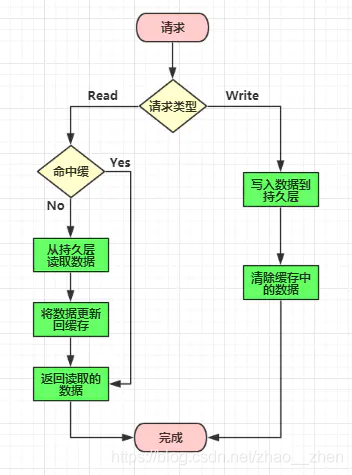
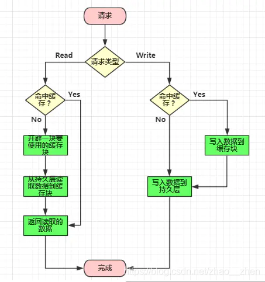
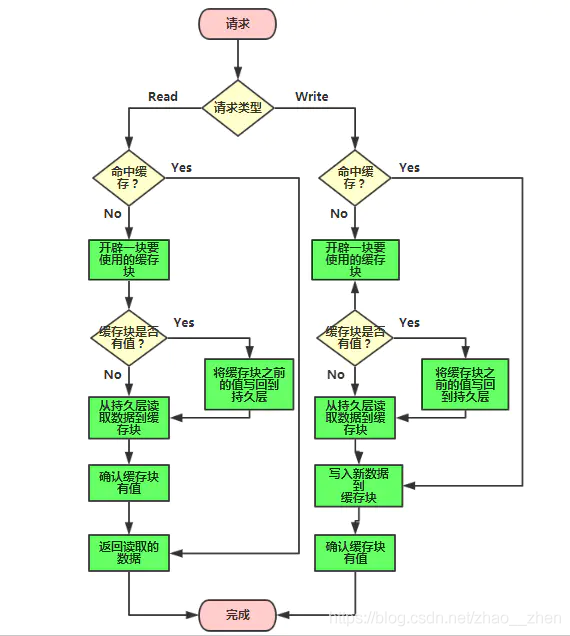
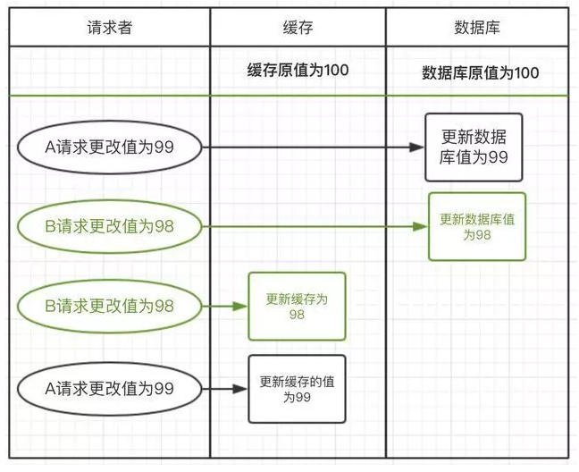
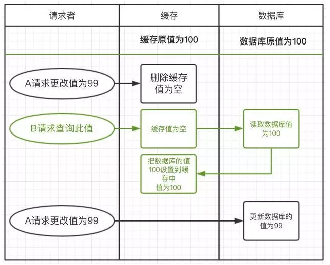
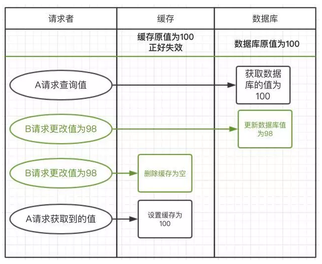
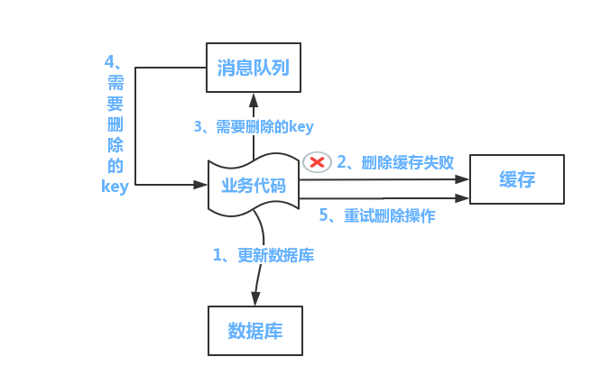
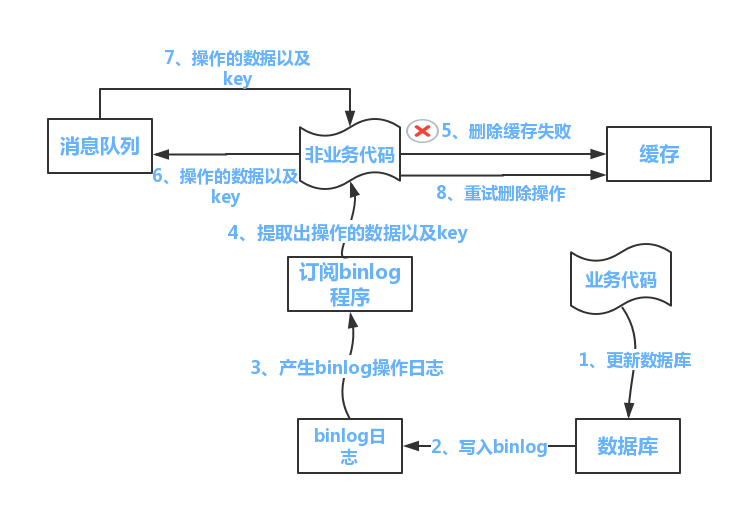

# 1、为什么需要缓存

一般在项目中，最消耗性能的地方就是后端服务的数据库了。而数据库的读写频率常常都是不均匀分布的，大多情况是读多写少，并且读操作还会有一些复杂的判断条件，比如 like、group、join 等等，这些语法是非常消耗性能，因此数据库很容易在读操作的环节遇到瓶颈。

那么通过给数据库加一个前置缓存，就可以有效的吸收不均匀的请求，抵挡流量波峰。

另外，如果应用与数据源不在同一个服务器的情况下，中间还会有很多的网络消耗，也会对应用的响应速度有很大影响，如果当前应用对数据实时性的要求不那么强的话，在应用侧加上缓存就能很快速的提升效率。

# 2、更新策略

既然是缓存，就意味着缓存中暂存的数据只是个副本，相当于把数据存放了2份，一份是在数据库中，另一份存放在缓存中。当有新的数据要写入或者旧数据需要更新的时候，如果我们只更新了其中一份数据源，那两边的数据就不一致。所以使用缓存必然要面对一个问题：缓存数据与数据库数据如何进行有效且快速的同步。

一般来说，缓存的更新策略有以下三种模式：

- Cache Aside 更新模式 ：同时更新缓存和数据库
- Read/Write Through 更新模式 ：先更新缓存，缓存负责同步更新数据库
- Write Behind Caching 更新模式： 先更新缓存，缓存定时异步更新数据库

## 2.1 Cache Aside更新模式

- 失效：应用程序先从 cache 取数据，没有得到，则从数据库中取数据，成功后，放到缓存中。
- 命中：应用程序从 cache 中取数据，取到后返回。
- 更新：先把数据存到数据库中，成功后，再去删除缓存或者让缓存失效。

这种策略下，在并发写的时候可能会出现脏数据的问题。

## 2.2 Read/Write Through 更新模式

应用程序只需要维护缓存，数据库的维护工作由缓存代理：

### 2.2.1 Read Through

Read Through 模式就是在查询操作中更新缓存，也就是说，当缓存失效的时候，Cache Aside 模式是由调用方负责把数据加载入缓存，而 Read Through 则用缓存服务自己来加载。

### 2.2.2 Write Through

Write Through 模式和 Read Through 相仿，不过是在更新数据时发生。当有数据更新的时候，如果没有命中缓存，直接更新数据库，然后返回。如果命中了缓存，则更新缓存，然后由缓存自己更新数据库（这是一个同步操作）

## 2.3 Write Behind Caching 更新模式

Write Behind Caching 更新模式就是在更新数据的时候，只更新缓存，不更新数据库，而我们的缓存会异步地批量更新数据库。这个设计的好处就是直接操作内存速度快。因为异步，Write Behind Caching 更新模式还可以合并对同一个数据的多次操作到数据库，所以性能的提高是相当可观的。

但其带来的问题是，数据不是强一致性的，而且可能会丢失。另外，Write Behind Caching 更新模式实现逻辑比较复杂，因为它需要确认有哪些数据是被更新了的，哪些数据需要刷到持久层上。只有在缓存需要失效的时候，才会把它真正持久起来。

# 3、场景推演

以上的理论知识准备完毕，下面来用具体场景推演一下缓存更新的细节问题。

理论是美好的，现实是残酷的，现实最终会把“美好的”的理论变成“没好的”，不信走着瞧。

缓存怎么更新，在实际应用中有很多种骚操作，但是归根结底来说，就是当数据发生变化时如何考虑以下两个问题：

- 对缓存是删除，还是更新？
- 先操作数据库，还是先操作缓存？

组合起来有以下四种方案。

## 3.1 先更新数据库，后更新缓存

第一种场景：更新数据库成功，更新缓存失败，则出现缓存与数据库不一致。

第二种场景：请求A更新值为99，请求B更新值为98。

- 请求A先发起，更新数据库为99，但还没有来得及更新缓存
- 请求B发起，更新数据库为98，又更新了缓存值为98
- 请求A这时才更新缓存的值为99

这样数据库的值为98，但缓存的值为99，数据一致出现了。

## 3.2 先更新缓存，后更新数据库

第一种场景：更新缓存成功，更新数据库失败，则出现缓存与数据库不一致。

第二种场景：与上面的流程类似，出现的问题也很类似。

- 请求A先更新缓存为99，但还没有来得及更新数据库
- 请求B更新缓存为98，又更新了数据库为98
- 请求A这时更新数据库为99

这样就缓存的值为98，数据库为99导致不一致。

## 3.3 先删除缓存，后更新数据库

第一种场景：删除缓存成功，更新数据库失败，则缓存与数据库不一致，但这种不一致会马上被修正，因而影响不大，因为下一次请求缓存的时候发现缓存中没有，会从数据库重新加载。但是又有一个问题出现了，在旧的缓存被删除后，新的缓存未写入之前，这段时间内如果有读操作，那么旧的值会被重新加载到缓存，这就相当于没更新缓存。

第二种场景：请求A更新值为99，请求B获取值。

- 请求A更新值，先把缓存中的值删除，但还没有来得及更新数据库
- 此时请求B过来查询此值，发现缓存中不存在，就到数据库中查询
- 请求B在数据库中获取到值，在把值设置到缓存中
- 请求A这时才更新数据库里面的值为99

这样就导致了缓存和数据库的不一致问题，缓存中的值一直是旧数据。

## 3.4 先更新数据库，后删除缓存

第一种场景：更新数据成功，删除缓存失败，则出现缓存与数据库不一致。

第二种场景：请求A查询值，请求B更新值。

- 请求A发起查询请求，直接到数据库查询到100，但还没有来得及去设置缓存
- 请求B更新值，先更新数据库，在删除缓存
- 请求A这时才设置缓存为100

## 3.5 总结

推演完毕。

结果发现，没有一个方案走得通，这还怎么玩？这么一看，现实不只把理论给打残了，而且是按在地上摩擦啊！

通过上面的推演，可以发现每种方案都有两种问题：

（1）第一种问题：**操作的原子性无法保证**

对数据库与缓存的操作是分两步操作的，并没有类似数据库事务那样的控制，一旦第一步成功，第二步失败，必然导致数据不一致。

（2）第二种问题：**并发请求导致数据覆盖**

并发环境下，多个请求的处理顺序无法保证，会导致旧数据覆盖掉新数据的情况。但是，不是说并发一定导致数据覆盖，这是一个概率问题，如何将概率降至最低，或者降为零（比如加锁），需要我们根据具体的业务场景来分析。

但是，**任何脱离实际业务的推演都是耍流氓**。

下面来一个个的分析。

### 3.5.1 先更新数据库，后更新缓存

相对来讲，理论上这种方式比“先更新数据库，再删缓存”有着更高的读性能，因为它事先在缓存中准备好了数据。

但是缺点也很明显：

- 如果是一个写多读少的场景，采用这种方案就会导致，可能更新了十次缓存，但是就读了一次，其余九次的更新是没必要的，浪费性能。
- 如果你写入数据库的值，并不是直接写入缓存的，而是要经过一系列复杂的计算再写入缓存。那么，每次写入数据库后都再次计算写入缓存的值，同样是浪费性能的，这种情况下显然删除缓存更为适合。

那更新缓存与删除缓存呢到底哪种更好呢？实际上主要取决于“更新缓存的复杂度”。

- 如果更新缓存的代价很小，一般应该更倾向于更新缓存，以保证更高的缓存命中率。
- 如果缓存是通过很复杂的数据计算得出来的，更新缓存的代价很大，一般更倾向于删除缓存。

### 3.5.2 先更新缓存，后更新数据库

既然我们把缓存当做副本，所有数据必须要以数据库为准。“先更新缓存，后更新数据库”可能导致的“缓存有数据，而数据库没数据”，是绝对不能容忍的，所以该方案在实际业务当中基本没法用。

### 3.5.3 先删除缓存，后更新数据库

该方案会导致的不一致可以依靠“**延时双删策略**”解决。

- 先淘汰缓存
- 再写数据库（这两步和原来一样）
- 休眠1秒，再次淘汰缓存

这么做，可以将1秒内所造成的缓存脏数据，再次删除。

第1个问题：这个1秒怎么确定的，具体该休眠多久呢？

需要根据读数据业务逻辑的耗时综合判断。然后写数据的休眠时间则在读数据业务逻辑的耗时基础上，加几百ms即可。这么做的目的，就是确保读请求结束，写请求可以删除读请求造成的缓存脏数据。

第2个问题：采用这种同步淘汰策略，吞吐量降低怎么办？

将第二次删除作为异步的。自己起一个线程，异步删除。这样，写请求就不用休眠一段时间后再返回了，可以加大吞吐量。

第3个问题：第二次删除如果失败了怎么办？

如果对缓存的准确性要求不高，可以依靠MQ消息的重试或者定时任务来兜底。

### 3.5.4 先更新数据库，后删除缓存

这种方案时在实际业务当中是使用率最高的。原因有两点：

- 先更新数据库，首先保证了数据源头一定是正确的。
- 并发导致的数据不一致，概率非常低。

回头看看上面的场景，如果发生不一致，需要具备以下四个条件：

- 读操作时，缓存恰好失效
- 有个并发的写操作
- 写操作比读操作更快
- 读操作早于写操作进入数据库，晚于写操作更新缓存

而实际上数据库的写操作普遍比读操作慢得多，而且可能还要锁行、锁表。而读操作必需在写操作前进入数据库操作，而又要晚于写操作更新缓存，所有的这些条件都具备的概率基本并不大。并且即使出现这个问题，还可以设置缓存过期时间来自动兜底。

但是该方案还有个问题要解决，第二步删除缓存失败怎么办？

答案是提供一个重试机制即可，比如MQ：

- 更新数据库数据；
- 缓存因为种种问题删除失败
- 将需要删除的key发送至消息队列
- 自己消费消息，获得需要删除的key
- 继续重试删除操作，直到成功

然而，该方案有一个缺点，对业务线代码造成大量的侵入。于是有了方案二，在方案二中，启动一个订阅程序去订阅数据库的binlog，获得需要操作的数据。在应用程序中，另起一段程序，获得这个订阅程序传来的信息，进行删除缓存操作。

- 更新数据库数据
- 数据库会将操作信息写入binlog日志当中
- 订阅程序提取出所需要的数据以及key
- 另起一段非业务代码，获得该信息
- 尝试删除缓存操作，发现删除失败
- 将这些信息发送至消息队列
- 重新从消息队列中获得该数据，重试操作。

### 3.5.5 总结

- **方案1**：先更新数据库，后更新缓存，**最好不用**
- **方案2**：先删除缓存，后更新数据库，**坚决不用**
- **方案3**：先删除缓存，后更新数据库，**适度使用**
- **方案4**：先更新数据库，后删除缓存，**推荐使用**

但是也不能盲从，马克思曾经曰过的：具体问题，具体分析。

没有完美的方案，只有合适的方案。

# 4、 主从架构下的问题

上面的各种场景都是只有一个数据库实例的情况，而实际生产过程中往往是一主多从的。

按照写主读从，缓存加载数据的时候应该从从库中读，而本来主从同步就有延迟，于是读从库很有可能读到的是旧数据。

为了解决这种问题，可以考虑以下几种方案：

- 第一种：强制缓存读主数据库

这样一来，就不必考虑主从同步的问题了，可行。

- 第二种：选择性地读主数据库

之所以强制读主库，是因为在主从同步完成之前从库中的数据还是旧的，当主从同步完成后再读从库就没什么问题了，那么如果在主从同步的这段时间内如果没有请求读这个KEY就没有问题，如果这段时间内有请求读取这个KEY，那么在同步完成后要删除这个KEY。

如何判断在主从同步这段时间内有没有请求读取这个KEY呢？

在更新数据库的时候，往缓存中设置一个KEY，格式是：缓存KEY+业务数据ID，其生存时间是主从延时时间。在读的时候，首先判断缓存中有没有这样一个KEY，如果有则从主库中重新加载数据到缓存，没有，则直接从从库中加载数据到缓存

- 第三种：订阅从库的binlog

可以通过工具（比如，canal）订阅从库的binlog，这是比较准确的，从库数据有更新，则立即更新缓存。