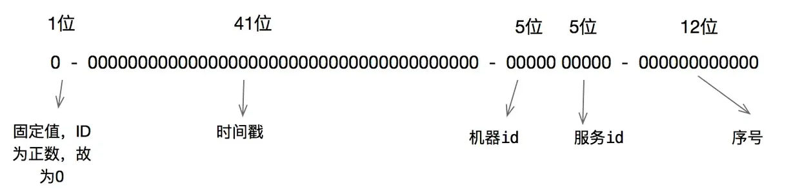

# 1、引言

现在的服务基本是分布式、微服务形式的，而且大数据量也导致分库分表的产生，对于水平分表就需要保证表中 id 的全局唯一性。

对于 MySQL 而言，一个表中的主键 id 一般使用自增的方式，但是如果进行水平分表之后，多个表中会生成重复的 id 值。那么如何保证水平分表后的多张表中的 id 是全局唯一性的呢？

如果还是借助数据库主键自增的形式，那么可以让不同表初始化一个不同的初始值，然后按指定的步长进行自增。例如有3张拆分表，初始主键值为1，2，3，自增步长为3。

当然也有人使用 UUID 来作为主键，但是 UUID 生成的是一个无序的字符串，对于 MySQL 推荐使用增长的数值类型值作为主键来说不适合。

也可以使用 Redis 的自增原子性来生成唯一 id，但是这种方式业内比较少用。

当然还有其他解决方案，不同互联网公司也有自己内部的实现方案。雪花算法是其中一个用于解决分布式 id 的高效方案，也是许多互联网公司在推荐使用的。

> Snowflake算法是Twitter发明的一种算法，用于在分布式、高并发环境中，生成64位自增ID。

64位ID的构成如下图所示：



* 最高 1 位固定值 0，因为生成的 id 是正整数，如果是 1 就是负数了。
* 接下来 41 位存储毫秒级时间戳，`2^41/(1000*60*60*24*365)=69`，**大概可以使用 69 年**。
* 再接下 10 位存储机器码，包括 5 位 datacenterId 和 5 位 workerId。**最多可以部署 2^10=1024 台机器**。
* 最后 12 位存储序列号。同一毫秒时间戳时，通过这个递增的序列号来区分。即对于同一台机器而言，**同一毫秒内可以生成 2^12=4096 个不重复 id**。

可以将雪花算法作为一个单独的服务进行部署，然后需要全局唯一 id 的系统，请求雪花算法服务获取 id 即可。

对于每一个雪花算法服务，需要先指定 10 位的机器码，这个根据自身业务进行设定即可。例如机房号+机器号，机器号+服务号，或者是其他可区别标识的 10 位比特位的整数值都行。

# 2、算法实现

```java
public class IdWorker{
    //下面两个每个5位，加起来就是10位的工作机器id
    private long workerId;    //工作id
    private long datacenterId;   //数据id
    //12位的序列号
    private long sequence;

    public IdWorker(long workerId, long datacenterId, long sequence){
        // sanity check for workerId
        if (workerId > maxWorkerId || workerId < 0) {
            throw new IllegalArgumentException(String.format("worker Id can't be greater than %d or less than 0",maxWorkerId));
        }
        if (datacenterId > maxDatacenterId || datacenterId < 0) {
            throw new IllegalArgumentException(String.format("datacenter Id can't be greater than %d or less than 0",maxDatacenterId));
        }
        System.out.printf("worker starting. timestamp left shift %d, datacenter id bits %d, worker id bits %d, sequence bits %d, workerid %d",
                timestampLeftShift, datacenterIdBits, workerIdBits, sequenceBits, workerId);

        this.workerId = workerId;
        this.datacenterId = datacenterId;
        this.sequence = sequence;
    }

    //初始时间戳
    private long twepoch = 1288834974657L;

    //长度为5位
    private long workerIdBits = 5L;
    private long datacenterIdBits = 5L;
    //最大值
    private long maxWorkerId = -1L ^ (-1L << workerIdBits);
    private long maxDatacenterId = -1L ^ (-1L << datacenterIdBits);
    //序列号id长度
    private long sequenceBits = 12L;
    //序列号最大值
    private long sequenceMask = -1L ^ (-1L << sequenceBits);
    
    //工作id需要左移的位数，12位
    private long workerIdShift = sequenceBits;
   //数据id需要左移位数 12+5=17位
    private long datacenterIdShift = sequenceBits + workerIdBits;
    //时间戳需要左移位数 12+5+5=22位
    private long timestampLeftShift = sequenceBits + workerIdBits + datacenterIdBits;
    
    //上次时间戳，初始值为负数
    private long lastTimestamp = -1L;

    public long getWorkerId(){
        return workerId;
    }

    public long getDatacenterId(){
        return datacenterId;
    }

    public long getTimestamp(){
        return System.currentTimeMillis();
    }

     //下一个ID生成算法
    public synchronized long nextId() {
        long timestamp = timeGen();

        //获取当前时间戳如果小于上次时间戳，则表示时间戳获取出现异常
        if (timestamp < lastTimestamp) {
            System.err.printf("clock is moving backwards.  Rejecting requests until %d.", lastTimestamp);
            throw new RuntimeException(String.format("Clock moved backwards.  Refusing to generate id for %d milliseconds",
                    lastTimestamp - timestamp));
        }

        //获取当前时间戳如果等于上次时间戳（同一毫秒内），则在序列号加一；否则序列号赋值为0，从0开始。
        if (lastTimestamp == timestamp) {
            sequence = (sequence + 1) & sequenceMask;
            if (sequence == 0) {
                timestamp = tilNextMillis(lastTimestamp);
            }
        } else {
            sequence = 0;
        }
        
        //将上次时间戳值刷新
        lastTimestamp = timestamp;

        /**
          * 返回结果：
          * (timestamp - twepoch) << timestampLeftShift) 表示将时间戳减去初始时间戳，再左移相应位数
          * (datacenterId << datacenterIdShift) 表示将数据id左移相应位数
          * (workerId << workerIdShift) 表示将工作id左移相应位数
          * | 是按位或运算符，例如：x | y，只有当x，y都为0的时候结果才为0，其它情况结果都为1。
          * 因为个部分只有相应位上的值有意义，其它位上都是0，所以将各部分的值进行 | 运算就能得到最终拼接好的id
        */
        return ((timestamp - twepoch) << timestampLeftShift) |
                (datacenterId << datacenterIdShift) |
                (workerId << workerIdShift) |
                sequence;
    }

    //获取时间戳，并与上次时间戳比较
    private long tilNextMillis(long lastTimestamp) {
        long timestamp = timeGen();
        while (timestamp <= lastTimestamp) {
            timestamp = timeGen();
        }
        return timestamp;
    }

    //获取系统时间戳
    private long timeGen(){
        return System.currentTimeMillis();
    }
}
```

其实雪花算法每一部分占用的比特位数量并不是固定死的。例如你的业务可能达不到 69 年之久，那么可用减少时间戳占用的位数，雪花算法服务需要部署的节点超过1024 台，那么可将减少的位数补充给机器码用。

对于机器码，可根据自身情况做调整，例如机房号，服务器号，业务号，机器 IP 等都是可使用的。对于部署的不同雪花算法服务中，最后计算出来的机器码能区分开来即可。


# 3、算法改进

雪花算法有很多优点：

* 高并发分布式环境下生成不重复 id，每秒可生成百万个不重复 id。
* 基于时间戳，以及同一时间戳下序列号自增，基本保证 id 有序递增。
* 不依赖第三方库或者中间件。
* 算法简单，在内存中进行，效率高。

但是，雪花算法也有一个严重的缺点：**依赖服务器时间，服务器时钟回拨时可能会生成重复 id**。

为了避免时钟回拨导致的错误，需要对算法进行改进。

首先，SnowFlake的末尾12位是序列号，用来记录同一毫秒内产生的不同id，同一毫秒总共可以产生4096个id，每一毫秒的序列号都是从0这个基础序列号开始递增。假设我们的业务系统在单机上的QPS为3w/s，那么其实平均每毫秒只需要产生30个id即可，远没有达到设计的4096，也就是说通常情况下序列号的使用都是处在一个低水位，当发生时钟回拨的时候，这些尚未被使用的序号就可以派上用场了。
因此，可以对给定的基础序列号稍加修改，后面每发生一次时钟回拨就将基础序列号加上指定的步长，例如开始时是从0递增，发生一次时钟回拨后从1024开始递增，再发生一次时钟回拨则从2048递增，这样还能够满足3次的时钟回拨到同一时间点。

```java
    /** 步长, 1024 */
    private static long stepSize = 2 << 9;
    /** 基础序列号, 每发生一次时钟回拨, basicSequence += stepSize */
    private long basicSequence = 0L;

    private long handleMovedBackwards(long currStmp) {
        basicSequence += stepSize;
        if (basicSequence == MAX_SEQUENCE + 1) {
            basicSequence = 0;
            currStmp = getNextMill();
        }
        sequence = basicSequence;
        lastStmp = currStmp;
        return (currStmp - START_STMP) << TIMESTMP_LEFT
                | workId << WORK_LEFT 
                | sequence; 
    }
```

如果上面的解法还是不足于满足要求，还有一种更彻底的解法。

雪花算法给workerId预留了10位，即workId的取值范围为[0, 1023]，事实上实际生产环境不大可能需要部署1024个分布式ID服务，所以：将workerId取值范围缩小为[0, 511]，[512, 1023]这个范围的workerId当做备用workerId。workId为0的备用workerId是512，workId为1的备用workerId是513，以此类推...

```java
// 修改处: workerId原则上上限为1024, 但是为了每台sequence服务预留一个workerId, 所以实际上workerId上限为512
private static final long WORKER_ID_MAX_VALUE = 1L << WORKER_ID_BITS >> 1;
    
/**
  * 保留workerId和lastTime, 以及备用workerId和其对应的lastTime
  */
 private static Map<Long, Long> workerIdLastTimeMap = new ConcurrentHashMap<>();
 
/**
 * Generate key. 考虑时钟回拨, 与sharding-jdbc源码的区别就在这里</br>
 * 缺陷: 如果连续两次时钟回拨, 可能还是会有问题, 但是这种概率极低极低
 */
@Override
public synchronized Number generateKey() {
    long currentMillis = System.currentTimeMillis();

    // 当发生时钟回拨时
    if (lastTime > currentMillis){
        // 如果时钟回拨在可接受范围内, 等待即可
        if (lastTime - currentMillis < MAX_BACKWARD_MS){
            try {
                Thread.sleep(lastTime - currentMillis);
            } catch (InterruptedException e) {
                e.printStackTrace();
            }
        }else {
            // 如果时钟回拨太多, 那么换备用workerId尝试

        // 当前workerId和备用workerId的值的差值为512
            long interval = 512L;
            // 发生时钟回拨时, 计算备用workerId[如果当前workerId小于512,
            // 那么备用workerId=workerId+512; 否则备用workerId=workerId-512, 两个workerId轮换用]
            if (MyKeyGenerator.workerId >= interval) {
                MyKeyGenerator.workerId = MyKeyGenerator.workerId - interval;
            } else {
                MyKeyGenerator.workerId = MyKeyGenerator.workerId + interval;
            }

            // 取得备用workerId的lastTime
            Long tempTime = workerIdLastTimeMap.get(MyKeyGenerator.workerId);
            lastTime = tempTime==null?0L:tempTime;
            // 如果在备用workerId也处于过去的时钟, 那么抛出异常
            // [这里也可以增加时钟回拨是否超过MAX_BACKWARD_MS的判断]
            Preconditions.checkState(lastTime <= currentMillis, "Clock is moving backwards, last time is %d milliseconds, current time is %d milliseconds", lastTime, currentMillis);
            // 备用workerId上也处于时钟回拨范围内的逻辑还可以优化: 比如摘掉当前节点. 运维通过监控发现问题并修复时钟回拨
        }
    }

    // 如果和最后一次请求处于同一毫秒, 那么sequence+1
    if (lastTime == currentMillis) {
        if (0L == (sequence = ++sequence & SEQUENCE_MASK)) {
            currentMillis = waitUntilNextTime(currentMillis);
        }
    } else {
        // 如果是一个更近的时间戳, 那么sequence归零
        sequence = 0;
    }

    lastTime = currentMillis;
    // 更新map中保存的workerId对应的lastTime
    workerIdLastTimeMap.put(MyKeyGenerator.workerId, lastTime);

    if (log.isDebugEnabled()) {
        log.debug("{}-{}-{}", new SimpleDateFormat("yyyy-MM-dd HH:mm:ss.SSS").format(new Date(lastTime)), workerId, sequence);
    }
    System.out.println(new SimpleDateFormat("yyyy-MM-dd HH:mm:ss.SSS").format(new Date(lastTime))
                +" -- "+workerId+" -- "+sequence+" -- "+workerIdLastTimeMap);
    return ((currentMillis - EPOCH) << TIMESTAMP_LEFT_SHIFT_BITS) | (workerId << WORKER_ID_LEFT_SHIFT_BITS) | sequence;
}
```


