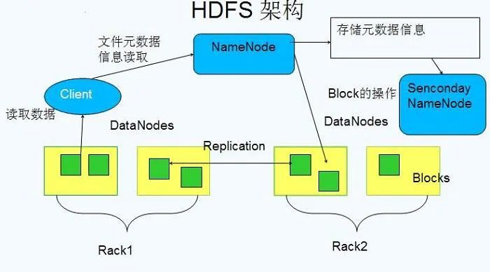
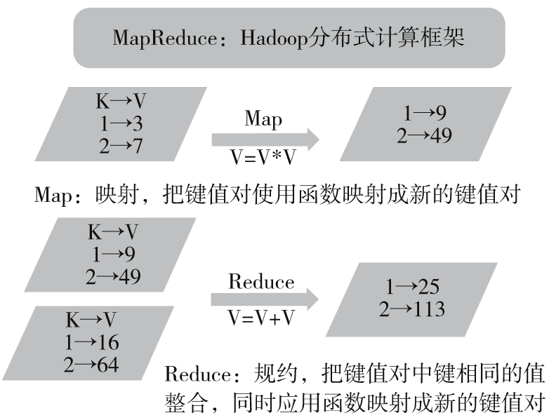
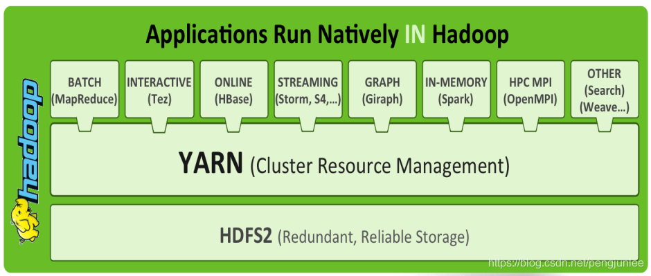
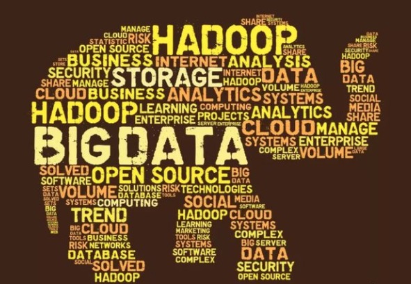

# 1 从 Lucene 到 Hadoop

**Doug Cutting**，你可能没听过这个名字，但你一定听说过乃至修炼过他流传于世的武林三绝——**Lucene**、**Nutch**、**Hadoop**。此人乃大数据派的开山祖师，为全球的徒子徒孙创造了无数的财富与就业机会。

1985 年，Cutting 毕业于美国斯坦福大学，其后进入 Xerox（施乐）公司。他花了四年的时间搞研发，阅读了大量的论文，同时，自己也发表了很多论文，用 Cutting 自己的话说——“我的研究生是在 Xerox 读的。”

说点题外话，现在如果提起施乐公司的名号，鲜有人知；就算有人听说过，也仅仅认为它是一家复印机、打印机厂商而已。实际上，施乐公司有一个更知名的东西，那就是施乐研究中心，简称 **PARC**（Xerox Palo Alto Research Center）。依靠着充足的经费和宽松自由的制度，当年的 PARC 汇集了大量全美乃至全世界最优秀的电脑科学家，是许多现代计算机技术的诞生地。

与 PARC 有关的技术包括但不限于：

- **Alto**：人类历史上第一台个人电脑，它第一个使用了鼠标，第一个具备以太网接口，第一个采用了位图显示器，第一个具备图形用户界面，第一个采用了桌面化的交互方式。Alto 的软件被苹果、微软学去，硬件被 IBM 学去，自己却蹉跎半生，无疾而终。
- **以太网**：计算机局域网的基石。无线 Wi-Fi 技术也借鉴了以太网的思想。
- **WYSIWYG**：What You See Is What You Get，第一个所见即所得文字编辑器，对以后文字编辑器的发展产生了重要的影响，此后 Mac OS 上的文字编辑器，以及微软的 Word 都来源于此。
- **图形用户界面（GUI）**：包括图标、下拉菜单、窗口。众所周知，这个创意很快被乔布斯抄去，随后又被微软抄去，对个人计算机的发展产生重要的影响。
- **PostScript & Interpress**：PostScript 是一种编程语言，适用于列印图像和文字，用公式描述字母和文字，大大提高了计算机处理图形的能力。两位 PARC 的研究员 John Warnock 和 Chuck Geschke 研发出名为 Interpress 的语言，随后离职创立了如今大名鼎鼎的 Adobe 公司，并在 Interpress 的基础上开发出了 PostScript 语言。

Cutting 事业的起步阶段大部分都是在 Xerox 度过的，这段时间让他在搜索技术的知识上有了很大提高。

1997 年底，Doug Cutting 决定把自己多年的技术积累付诸实践，开始在业余时间里用 Java 开发搜索引擎，不久之后，**Lucene** 诞生了。作为第一个全文文本搜索的开源函数库，支撑了 Nutch、Solr、Elasticsearch 等搜索引擎的内核，Lucene 的伟大自不必多言。

之后，Cutting 再接再厉，在 Lucene 的基础上将开源的思想继续深化。2004 年，Cutting 和同为程序员出身的 Mike Cafarella 决定开发一款可以代替当时的主流搜索产品的开源搜索引擎，这个项目被命名为 **Nutch**。

Nutch 是一个建立在 Lucene 核心之上的网页搜索应用程序，可以下载下来直接使用。它在 Lucene 的基础上加了网络爬虫和一些网页相关的功能，目的就是从一个简单的站内检索推广到全球网络的搜索上，就像 Google 一样。

Nutch 在业界的影响力比 Lucene 更大。大批网站采用了 Nutch 平台，大大降低了技术门槛，使低成本的普通计算机取代高价的 Web 服务器成为可能。甚至有一段时间，在硅谷有了一股用 Nutch 低成本创业的潮流。

但是，随着抓取网页数量的增加，Nutch 遇到了严重的可扩展性问题——如何解决数十亿网页的存储和索引问题。

这时候，搜索巨头 Google 送来了两本武林秘籍。

2003 年，Google 发表了一篇技术学术论文，公开介绍了自己的谷歌文件系统 **GFS（Google File System）**，可用于处理海量网页的存储。Doug Cutting 基于 Google 的 GFS 论文，实现了分布式文件存储系统，并将它命名为 **NDFS（Nutch Distributed File System）**。

2004 年，Google 又发表了一篇技术学术论文，介绍自己的 **MapReduce** 编程模型，可用于大规模数据集的并行分析运算。Doug Cutting 基于 Google 的编程模型，解决了海量网页的索引计算问题。

2005 年，Doug Cutting 将 NDFS 和 MapReduce 进行了升级改造，并重新命名为 **Hadoop**，NDFS 也改名为 **HDFS**（Hadoop Distributed File System）。

Hadoop 这个名字，实际上是 Doug Cutting 儿子的黄色玩具大象的名字。所以，Hadoop 的 Logo 就是一只奔跑的黄色大象。这就是后来大名鼎鼎的大数据框架系统——Hadoop 的由来。而 Doug Cutting，则被人们称为 Hadoop 之父。

2006 年，Google 又发论文了，介绍了自己的 **BigTable**。这是一种分布式数据存储系统，用来处理海量数据的非关系型数据库。Doug Cutting 当然没有放过，在自己的 Hadoop 系统里面，引入了 BigTable，并命名为 **HBase**。

总而言之一句话，Doug Cutting 紧跟 Google 的步伐，你出什么，我学什么。Hadoop 的核心部分，基本上都有 Google 的影子。

2008 年 1 月，Hadoop 成功上位，正式成为 Apache 基金会的顶级项目。同年 2 月，Yahoo 宣布建成了一个拥有 1 万个内核的 Hadoop 集群，并将自己的搜索引擎产品部署在上面。7 月，Hadoop 打破世界纪录，成为最快排序 1TB 数据的系统，用时 209 秒。

此后，Hadoop 经历了十多年的高速发展与广泛应用，奠定了大数据时代的基石。尽管如今云原生与存算分离架构日益普及，Hadoop 的核心思想依然深刻影响着现代大数据系统的底层设计。

# 2 Hadoop 核心架构

Hadoop 的核心，说白了，就是 HDFS 和 MapReduce。HDFS 为海量数据提供了**存储**，而 MapReduce 为海量数据提供了**计算框架**。

## 2.1 HDFS

对外部客户端而言，HDFS 就像一个传统的分级文件系统，可以进行创建、删除、移动或重命名文件或文件夹等操作，与 Linux 文件系统类似。

存储在 HDFS 中的文件被分成**块**，然后这些块被复制到多个**数据节点**。块的大小（通常为 128MB）和复制的块数量在创建文件时由客户机决定。**名称节点**可以控制所有文件操作。HDFS 内部的所有通信都基于标准的 TCP/IP 协议。

### 2.1.1 名称节点（NameNode）

它是整个文件系统的管理节点，维护着整个文件和目录的元数据信息、文件系统的文件目录树以及每个文件对应的数据块列表，还能够接收用户的操作请求。

### 2.1.2 数据节点（DataNode）

Hadoop 集群包含一个 NameNode 和大量 DataNode。数据节点通常以机架的形式组织，机架通过一个交换机将所有系统连接起来。数据节点响应来自 HDFS 客户机的读写请求。它们还响应来自 NameNode 的创建、删除和复制块的命令。名称节点依赖来自每个数据节点的定期心跳（heartbeat）消息。每条消息都包含一个块报告，名称节点可以根据这个报告验证块映射和其他文件系统元数据。如果数据节点不能发送心跳消息，名称节点将采取修复措施，重新复制在该节点上丢失的块。

### 2.1.3 第二名称节点（Secondary NameNode）

第二名称节点的作用在于为 NameNode 定期执行 Checkpoint，合并元数据镜像（fsimage）与编辑日志（edits），减轻 NameNode 的负担并缩短其重启时间。需要说明的是，Secondary NameNode 并不是 NameNode 的热备份，真正的 HA（High Availability，高可用）需要依赖 Active/Standby 双 NameNode 架构来实现。

举个数据上传的例子来深入理解下 HDFS 内部是怎么工作的：

文件在客户端时会被分块，这里可以看到文件被分为 5 个块，分别是：A、B、C、D、E。同时为了负载均衡，每个节点有 3 个块。下面来看看具体步骤：

1. 客户端将要上传的文件按 128MB 的大小分块。
2. 客户端向名称节点发送写数据请求。
3. 名称节点记录各个 DataNode 信息，并返回可用的 DataNode 列表。
4. 客户端直接向 DataNode 发送分割后的文件块，发送过程以流式写入。
5. 写入完成后，DataNode 向 NameNode 发送消息，更新元数据。

这里需要注意：

1. 写 1TB 文件，需要 3TB 的存储，3TB 的网络流量。
2. 在执行读或写的过程中，NameNode 和 DataNode 通过心跳（heartbeat）保持通信，确认 DataNode 是否存活。如果发现某个 DataNode 宕机或失去响应，就会把该节点上的数据复制到其他节点，读取时改从其他节点读取。
3. 宕掉一个节点没关系，还有其他节点可以备份；甚至宕掉某一个机架也没关系，因为其他机架上也有备份。

## 2.2 MapReduce

**Map**（映射）和 **Reduce**（归纳）以及它们的主要思想，都是从函数式编程、矢量编程借来的。

下面将以 Hadoop 的“Hello World”——单词计数来分析 MapReduce 的逻辑。

1. **Input**：输入数据通常存储在 HDFS 上，并且文件会被分块处理。关于文件块和文件分片的关系，在输入分片中说明。
2. **Splitting**：在进行 Map 阶段之前，MapReduce 框架会根据输入文件计算输入分片（split），每个输入分片会对应一个 Map 任务，输入分片往往和 HDFS 的块关系很密切。例如，HDFS 的块的大小是 128MB，如果我们输入两个文件，大小分别是 27MB、129MB，那么 27MB 的文件会作为一个输入分片（不足 128MB 会被当作一个分片），而 129MB 则是两个输入分片（129-128=1，不足 128MB，所以 1MB 也会被当作一个输入分片），所以，一般来说，一个文件块会对应一个分片。
3. **Mapping**：这个阶段的处理逻辑其实就是程序员编写好的 Map 函数，因为一个分片对应一个 Map 任务，并且是对应一个文件块，所以这里其实是数据本地化的操作，也就是所谓的移动计算而不是移动数据。这里的操作其实就是把每句话进行分割，然后得到每个单词，再对每个单词进行映射，得到单词和 1 的键值对。
4. **Shuffling**：这是“奇迹”发生的地方，**MapReduce 的核心其实就是 Shuffle**。那么 Shuffle 的原理呢？Shuffle 就是将 Map 的输出进行整合，然后作为 Reduce 的输入发送给 Reduce。简单理解就是把所有 Map 的输出按照键进行排序，并且把相同键的键值对整合到同一个组中。如上图所示，Bear、Car、Deer、River 是按序排列的，并且 Bear 这个键有两个键值对。
5. **Reducing**：与 Map 类似，这里也是用户编写程序的地方，可以针对分组后的键值对进行处理。如上图所示，针对同一个键 Bear 的所有值进行了一个加法操作，得到 <Bear, 2> 这样的键值对。
6. **Final Result**：Reduce 的输出直接写入 HDFS 上，同样这个输出文件也是分块的。

MapReduce 的本质就是把一组键值对 <K1, V1> 经过 Map 阶段映射成新的键值对 <K2, V2>；接着经过 Shuffle/Sort 阶段进行排序和“洗牌”，把键值对排序，同时把相同的键的值整合；最后经过 Reduce 阶段，把整合后的键值对组进行逻辑处理，输出到新的键值对 <K3, V3>。

## 2.3 YARN

在 Hadoop 1.0 时代，使用 **JobTracker** 来作为自己的资源管理框架，MapReduce 是分布式计算框架唯一的选择。

当 Hadoop 发展到 2.x 时，提出了另一个资源管理架构 **YARN**（Yet Another Resource Negotiator）。这里需要注意，YARN 不是 JobTracker 的简单升级，而是“大换血”。**由于 YARN 资源管理系统的出现，使得在 Hadoop 集群上可以同时运行多种计算框架**，比如 MapReduce、Spark、Flink、Tez 等。

YARN 的框架图如下：

- **ResourceManager**：负责所有资源的监控、分配和管理，并处理客户端请求，启动和监控 AppMaster、NodeManager。
- **NodeManager**：单个节点上的资源管理和任务管理，处理 ResourceManager、AppMaster 的命令。
- **AppMaster**：负责某个具体应用程序的调度和协调，为应用程序申请资源，并对任务进行监控。
- **Container**：YARN 中的一个动态资源分配的概念，其拥有一定的内存、核数。

一个任务提交的整体流程：

1. Client 向 YARN 中提交应用程序，其中包括 ApplicationMaster 程序、命令、用户程序、资源等。
2. ResourceManager 为该应用程序分配第一个 Container，并与对应的 NodeManager 通信，要求它在这个 Container 中启动应用程序的 ApplicationMaster。
3. ApplicationMaster 首先向 ResourceManager 注册，这样用户可以直接通过 ResourceManager 查看应用程序的运行状态，然后它将为各个任务申请资源，并监控它的运行状态。
4. ApplicationMaster 采用轮询的方式通过 RPC 协议向 ResourceManager 申请和领取资源。
5. 一旦 ApplicationMaster 申请到资源后，便与对应的 NodeManager 通信，要求它启动任务。
6. NodeManager 为任务设置好运行环境（包括环境变量、Jar 包、二进制程序等）后，将任务启动命令写到一个脚本中，并通过运行该脚本启动任务。
7. 各个任务通过某个 RPC 协议向 ApplicationMaster 汇报自己的状态和进度，以让 ApplicationMaster 随时掌握各个任务的运行状态，从而可以在任务失败时重新启动任务。在应用程序运行过程中，用户可随时通过 RPC 向 ApplicationMaster 查询应用程序的当前运行状态。
8. 应用程序运行完成后，ApplicationMaster 向 ResourceManager 注销并关闭自己。

# 3 Hadoop 生态圈

狭义上来说，Hadoop 就是单独指代 Hadoop 这个软件。

广义上来说，Hadoop 指代大数据的一个生态圈，包括很多其他的软件。

简单介绍一下其中几个比较重要的组件：

## 3.1 HBase

HBase（Hadoop Database），来源于 Google 的 BigTable，是一个高可靠性、高性能、面向列、可伸缩的分布式数据库，利用 HBase 技术可在廉价 PC Server 上搭建起大规模结构化存储集群。

## 3.2 Hive

Hive 是建立在 Hadoop 上的一个数据仓库工具，可以将结构化的数据文件映射为一张数据库表，通过类 SQL 语句快速实现简单的 MapReduce 统计，不必开发专门的 MapReduce 应用，十分适合数据仓库的统计分析。

## 3.3 Pig

Pig 是一个基于 Hadoop 的大规模数据分析平台，它提供的 SQL-LIKE 语言叫作 Pig Latin。Pig Latin 是一种更高级的数据流语言，它将 MapReduce 中的常见设计模式抽象为了 Filter、GroupBy、Join、OrderBy 等操作。

## 3.4 Flume

Flume 是 Cloudera 提供的一个高可用、高可靠、分布式的海量日志采集、聚合和传输的系统，Flume 支持在日志系统中定制各类数据发送方，用于收集数据。同时，Flume 提供对数据进行简单处理并写到各种数据接收方的能力。

## 3.5 Oozie

Oozie 是基于 Hadoop 的调度器，以 XML 的形式写调度流程，可以调度 MapReduce、Pig、Hive、shell、jar 任务等。

## 3.6 Ambari

Ambari 是 Hadoop 管理工具，可以快捷地监控、部署、管理集群。

## 3.7 ZooKeeper

ZooKeeper 是一个开放源码的分布式应用程序协调服务，是 Google Chubby 的一个开源实现，是 Hadoop 和 HBase 的重要组件。它是一个为分布式应用提供一致性服务的软件，提供的功能包括：配置维护、域名服务、分布式同步、组服务等。

## 3.8 Avro

Avro 是一个数据序列化的系统。它可以提供：丰富的数据结构类型、快速可压缩的二进制数据形式、存储持久数据的文件容器、远程过程调用 RPC。

总的来看，Hadoop 有以下优点：

- **高可靠性**：这个是由它的基因决定的。它的基因来自 Google。Google 最擅长的事情，就是“垃圾利用”。Google 起家的时候就是穷，买不起高端服务器，所以，特别喜欢在普通电脑上部署这种大型系统。虽然硬件不可靠，但是系统非常可靠。
- **高扩展性**：Hadoop 是在可用的计算机集群间分配数据并完成计算任务的，这些集群可以方便地进行扩展。
- **高效性**：Hadoop 能够在节点之间动态地移动数据，并保证各个节点的动态平衡，因此处理速度非常快。
- **高容错性**：Hadoop 能够自动保存数据的多个副本，并且能够自动将失败的任务重新分配。
- **低成本**：Hadoop 是开源的，依赖于社区服务，使用成本比较低。

基于这些优点，Hadoop 适合应用于大数据存储和大数据分析，适合于服务器几千台到几万台的集群运行，支持 PB 级的存储容量。

Hadoop 的应用非常广泛，包括：搜索、日志处理、推荐系统、数据分析、视频图像分析、数据保存等，都可以使用它进行部署。

