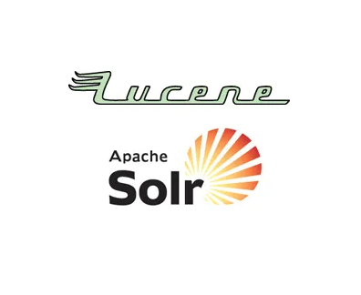
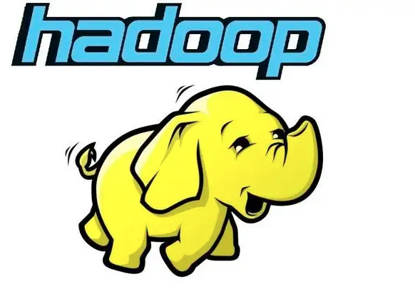
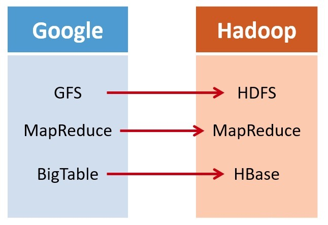
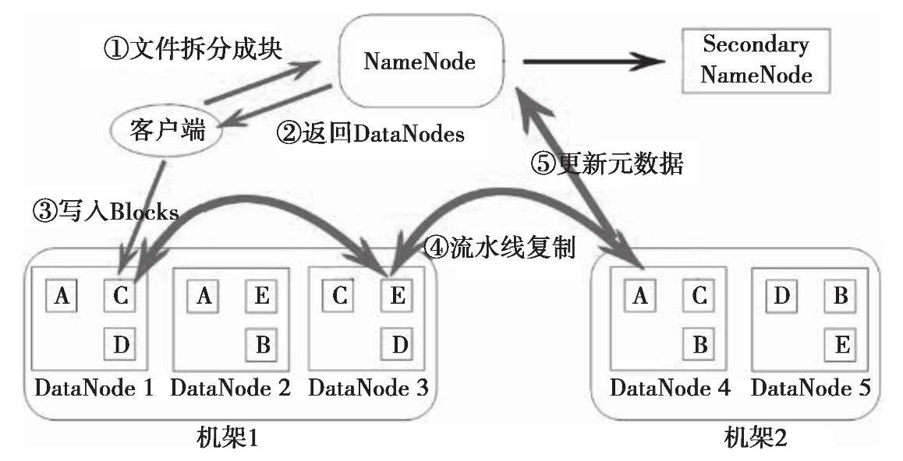
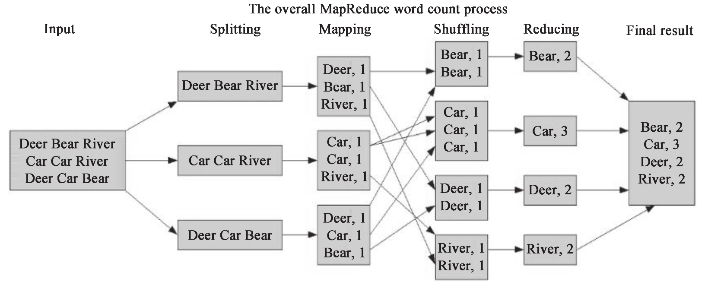
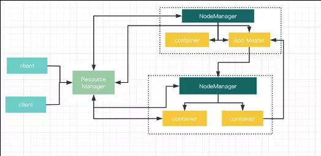
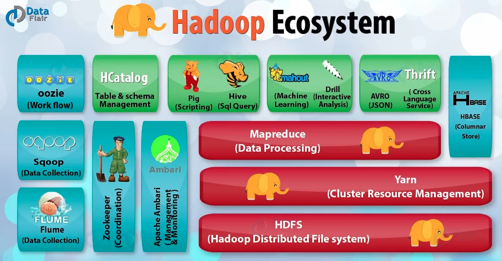

# 1、从Lucene到Hadoop

**Doug Cutting**，你可能没听过这个名字，但你一定听说过乃至修炼过他流传于世的武林三绝——**Lucene**、**Nutch**、**Hadoop**。此人乃大数据派的开山祖师，为全球的徒子徒孙创造了无数的财富与就业机会。

1985年，Cutting毕业于美国斯坦福大学，其后进入Xerox（施乐）公司。他花了四年的时间搞研发，阅读了大量的论文，同时，自己也发表了很多论文，用 Cutting 自己的话说——“我的研究生是在 Xerox 读的。”

说点题外话，现在如果提起施乐公司的名号鲜有人知，就算有人听说过，也仅限于这是一个复印机、打印机厂商的认知而已。实际上，施乐公司有一个更知名的东西，那就是施乐研究中心，简称**PARC**(Xerox Pali Alto Research Center)。依靠着充足的经费和宽松自由的制度，当年的PARC汇集了大量全美乃至全世界最优秀的电脑科学家，是许多现代计算机技术的诞生地。

与PARC有关的技术包括但不限于：

- **Alto**：人类历史上第一台个人电脑，它第一个使用了鼠标，第一个具备以太网接口，第一个位图显示器，第一个具备图形用户界面，第一个采用了桌面化的交互方式。Alto的软件被苹果、微软学去，硬件被IBM学去，自己却蹉跎半生，无疾而终。
- **以太网**：计算机局域网的基石。无线wifi技术也借鉴了以太网的思想。
- **WYSIWYG**：What You See Is What You Get，第一个所见即所得文字编辑器 ，对以后文字编辑器的发展产生了重要的影响，此后 Mac OS 上的文字编辑器，以及微软的 Word 都来源于此。
- **图形用户界面（GUI）**：包括图标、下拉菜单、窗口。众所周知，这个创意很快被乔布斯抄去，随后又被微软抄去，对个人计算机的发展产生重要的影响。
- **PostScript & Interpress**：PostScript是一种编程语言，适用于列印图像和文字，用公式描述字母和文字，大大提高了计算机处理图形的能力。两位PARC的研究员John Warnock和Chuck Geschke基于PostScript研发出名为Interpress的语言，成立了如今大名鼎鼎的Adobe公司。

Cutting 事业的起步阶段大部分都是在 Xerox 度过的，这段时间让他在搜索技术的知识上有了很大提高。

1997年底，Doug Cutting决定把自己多年的技术积累付诸实践，开始在业余时间里用Java开发搜素引擎，不久之后，**Lucene**诞生了。作为第一个全文文本搜索的开源函数库，支撑了Nutch、Solr、ElasticSearch等搜索引擎的内核，Lucene的伟大自不必多言。

之后，Cutting再接再厉，在 Lucene的基础上将开源的思想继续深化。2004年，Cutting和同为程序员出身的Mike Cafarella决定开发一款可以代替当时的主流搜索产品的开源搜索引擎，这个项目被命名为**Nutch**。

Nutch是一个建立在Lucene核心之上的网页搜索应用程序，可以下载下来直接使用。它在Lucene的基础上加了网络爬虫和一些网页相关的功能，目的就是从一个简单的站内检索推广到全球网络的搜索上，就像Google一样。

Nutch在业界的影响力比Lucene更大。大批网站采用了Nutch平台，大大降低了技术门槛，使低成本的普通计算机取代高价的Web服务器成为可能。甚至有一段时间，在硅谷有了一股用Nutch低成本创业的潮流。

但是，随着抓取网页数量的增加，Nuttch遇到了严重的可扩展性问题——如何解决数十亿网页的存储和索引问题。

这时候，搜索巨头Google送来了两本武林秘籍。

2003年，Google发表了一篇技术学术论文，公开介绍了自己的谷歌文件系统**GFS（Google File System）**，可用于处理海量网页的存储。Doug Cutting基于Google的GFS论文，实现了分布式文件存储系统，并将它命名为**NDFS（Nutch Distributed File System）**。

2004年，Google又发表了一篇技术学术论文，介绍自己的**MapReduce**编程模型，可用于大规模数据集的并行分析运算。Doug Cutting基于Google的编程模型，解决了海量网页的索引计算问题。

2005年，Doug Cutting将NDFS和MapReduce进行了升级改造，并重新命名为**Hadoop**，NDFS也改名为**HDFS**(Hadoop Distributed File System)。

Hadoop这个名字，实际上是Doug Cutting 儿子的黄色玩具大象的名字。所以，Hadoop的Logo就是一只奔跑的黄色大象。这就是后来大名鼎鼎的大数据框架系统——Hadoop的由来。而Doug Cutting，则被人们称为Hadoop之父。

2006年，Google又发论文了，介绍了自己的**BigTable**。这是一种分布式数据存储系统，用来处理海量数据的非关系型数据库。Doug Cutting当然没有放过，在自己的Hadoop系统里面，引入了BigTable，并命名为**HBase**。

总而言之一句话，Doug Cutting紧跟Google的步伐，你出什么，我学什么。Hadoop的核心部分，基本上都有Google的影子。

2008年1月，Hadoop成功上位，正式成为Apache基金会的顶级项目。同年2月，Yahoo宣布建成了一个拥有1万个内核的Hadoop集群，并将自己的搜索引擎产品部署在上面。7月，Hadoop打破世界纪录，成为最快排序1TB数据的系统，用时209秒。

此后，Hadoop便进入了高速发展期，直至现在。

# 2、Hadoop核心架构

Hadoop的核心，说白了，就是HDFS和MapReduce。HDFS为海量数据提供了**存储**，而MapReduce为海量数据提供了**计算框架**。

## 2.1 HDFS

对外部客户端而言，HDFS 就像一个传统的分级文件系统，可以进行创建、删除、移动或重命名文件或文件夹等操作，与 Linux 文件系统类似。

存储在 HDFS 中的文件被分成**块**，然后这些块被复制到多个**数据节点**。块的大小(通常为128M)和复制的块数量在创建文件时由客户机决定。**名称节点**可以控制所有文件操作。HDFS 内部的所有通信都基于标准的 TCP/IP 协议。

### 名称节点（NameNode）

它是整个文件系统的管理节点，维护着整个文件和目录的元数据信息、文件系统的文件目录树以及每个文件对应的数据块列表，还能够接收用户的操作请求。

### 数据节点（DataNode）

Hadoop 集群包含一个 NameNode 和大量 DataNode。数据节点通常以机架的形式组织，机架通过一个交换机将所有系统连接起来。数据节点响应来自 HDFS 客户机的读写请求。它们还响应来自 NameNode 的创建、删除和复制块的命令。名称节点依赖来自每个数据节点的定期心跳（heartbeat）消息。每条消息都包含一个块报告，名称节点可以根据这个报告验证块映射和其他文件系统元数据。如果数据节点不能发送心跳消息，名称节点将采取修复措施，重新复制在该节点上丢失的块。

### 第二名称节点（Secondary NameNode）

第二名称节点的作用在于为 HDFS 中的名称节点提供一个 Checkpoint，是HA（High Availably，高可用）的一个解决方案，它负责辅助NameNode完成相应的工作。

举个数据上传的例子来深入理解下HDFS内部是怎么工作的：

文件在客户端时会被分块，这里可以看到文件被分为 5 个块，分别是：A、B、C、D、E。同时为了负载均衡，所以每个节点有 3 个块。下面来看看具体步骤：

1. 客户端将要上传的文件按 128M 的大小分块。
2. 客户端向名称节点发送写数据请求。
3. 名称节点记录各个 DataNode 信息，并返回可用的 DataNode 列表。
4. 客户端直接向 DataNode 发送分割后的文件块，发送过程以流式写入。
5. 写入完成后，DataNode 向 NameNode 发送消息，更新元数据。

这里需要注意：

1. 写 1T 文件，需要 3T 的存储，3T 的网络流量。
2. 在执行读或写的过程中，NameNode 和 DataNode 通过 HeartBeat 进行保存通信，确定 DataNode 活着。如果发现 DataNode 死掉了，就将死掉的 DataNode 上的数据，放到其他节点去，读取时，读其他节点。
3. 宕掉一个节点没关系，还有其他节点可以备份；甚至，宕掉某一个机架也没关系；其他机架上也有备份。

## 2.2 MapReduce

**Map**（映射）和**Reduce**（归纳）以及它们的主要思想，都是从函数式编程、矢量编程借来的。

下面将以 Hadoop 的“Hello World”——单词计数来分析MapReduce的逻辑。

1. **Input**：输入就不用说了，数据一般放在 HDFS 上面就可以了，而且文件是被分块的。关于文件块和文件分片的关系，在输入分片中说明。
2. **Splitting**：在进行 Map 阶段之前，MapReduce 框架会根据输入文件计算输入分片（split），每个输入分片会对应一个 Map 任务，输入分片往往和 HDFS 的块关系很密切。例如，HDFS 的块的大小是 128M，如果我们输入两个文件，大小分别是 27M、129M，那么 27M 的文件会作为一个输入分片（不足 128M 会被当作一个分片），而 129MB 则是两个输入分片（129-128＝1，不足 128M，所以 1M 也会被当作一个输入分片），所以，一般来说，一个文件块会对应一个分片。
3. **Mapping**：这个阶段的处理逻辑其实就是程序员编写好的 Map 函数，因为一个分片对应一个 Map 任务，并且是对应一个文件块，所以这里其实是数据本地化的操作，也就是所谓的移动计算而不是移动数据。这里的操作其实就是把每句话进行分割，然后得到每个单词，再对每个单词进行映射，得到单词和1的键值对。
4. **Shuffling**：这是“奇迹”发生的地方，**MapReduce 的核心其实就是 Shuffle**。那么 Shuffle 的原理呢？Shuffle 就是将 Map 的输出进行整合，然后作为 Reduce 的输入发送给 Reduce。简单理解就是把所有 Map 的输出按照键进行排序，并且把相对键的键值对整合到同一个组中。如上图所示，Bear、Car、Deer、River 是排序的，并且 Bear 这个键有两个键值对。
5. **Reducing**：与 Map 类似，这里也是用户编写程序的地方，可以针对分组后的键值对进行处理。如上图所示，针对同一个键 Bear 的所有值进行了一个加法操作，得到 <Bear，2> 这样的键值对。
6. **Final Result**：Reduce 的输出直接写入 HDFS 上，同样这个输出文件也是分块的。

MapReduce 的本质就是把一组键值对 <K1，V1> 经过 Map 阶段映射成新的键值对 <K2，V2>；接着经过 Shuffle/Sort 阶段进行排序和“洗牌”，把键值对排序，同时把相同的键的值整合；最后经过 Reduce 阶段，把整合后的键值对组进行逻辑处理，输出到新的键值对 <K3，V3>。

## 2.3 YARN

在Hadoop 1.0时代，使用**JobTracker** 来作为自己的资源管理框架，MapReduce是分布式计算框架唯一的选择。

当 Hadoop 发展到 2.x 时，提出了另外的一个资源管理架构 **YARN**（Yet Another Resource Manager）。这里需要注意，YARN 不是 JobTracker 的简单升级，而是“大换血”。**由于YARN资源管理系统的出现，使得在Hadoop集群上可以同时运行多种计算框架**，MapReduce，Spark，Strom，Tez等。

YARN的框架图如下：

- **ResourceManeger**：负责所有资源的监控、分配和管理，并处理客户端请求，启动和监控AppMaster、NodeManager
- **NodeManager**：单个节点上的资源管理和任务管理，处理ResourceManager、AppMaster 的命令
- **AppMaster**：负责某个具体应用程序的调度和协调，为应用程序申请资源，并对任务进行监控
- **Container**：YARN中的一个动态资源分配的概念，其拥有一定的内存，核数

一个任务提交的整体流程：

1. Client向YARN中提交应用程序，其中包括ApplicationMaster程序、命令、用户程序,资源等。
2. ResourceManager为该应用程序分配第一个Container，并与对应的NodeManager通信，要求它在这个Container中启动应用程序的ApplicationMaster。
3. ApplicationMaster首先向ResourceManager注册，这样用户可以直接通过ResourceManager查看应用程序的运行状态，然后它将为各个任务申请资源，并监控它的运行状态
4. ApplicationMaster采用轮询的方式通过RPC协议向ResourceManager申请和领取资源。
5. 一旦ApplicationMaster申请到资源后，便与对应的NodeManager通信，要求它启动任务。
6. NodeManager为任务设置好运行环境（包括环境变量、Jar包、二进制程序等）后，将任务启动命令写到一个脚本中，并通过运行该脚本启动任务。
7. 各个任务通过某个RPC协议向ApplicationMaster汇报自己的状态和进度，以让ApplicationMaster随时掌握各个任务的运行状态，从而可以在任务失败时重新启动任务。在应用程序运行过程中，用户可随时通过RPC向ApplicationMaster查询应用程序的当前运行状态。
8. 应用程序运行完成后，ApplicationMaster向ResourceManager注销并关闭自己。

# 3、Hadoop生态圈

狭义上来说，Hadoop就是单独指代Hadoop这个软件。

广义上来说，Hadoop指代大数据的一个生态圈，包括很多其他的软件。

简单介绍一下其中几个比较重要的组件：

## HBase

HBase（Hadoop Database），来源于Google的BigTable；是一个高可靠性、高性能、面向列、可伸缩的分布式数据库，利用 HBase 技术可在廉价 PC Server 上搭建起大规模结构化存储集群。

## Hive

Hive 是建立在 Hadoop 上的一个数据仓库工具，可以将结构化的数据文件映射为一张数据库表，通过类SQL语句快速实现简单的MapReduce统计，不必开发专门的MapReduce应用，十分适合数据仓库的统计分析。

## Pig

Pig 是一个基于 Hadoop 的大规模数据分析平台，它提供的 SQL-LIKE 语言叫作 Pig Latin。Pig Latin是更高级的过程语言，通过将MapReduce中的设计模式抽象为操作，如Filter，GroupBy，Join，OrderBy等，

## Sqoop

Sqoop 是一款开源的工具，主要用于在 Hadoop（Hive）与传统的数据库（MySQL、post-gresql等）间进行数据的传递，可以将一个关系型数据库中的数据导入 Hadoop 的 HDFS 中，也可以将 HDFS 的数据导入关系型数据库中。

## Flume

Flume 是 Cloudera 提供的一个高可用、高可靠、分布式的海量日志采集、聚合和传输的系统，Flume 支持在日志系统中定制各类数据发送方，用于收集数据。同时，Flume 提供对数据进行简单处理并写到各种数据接受方的能力

## Oozie

Oozie 是基于 Hadoop 的调度器，以 XML 的形式写调度流程，可以调度 Mr、Pig、Hive、shell、jar 任务等。

## Ambari

Hadoop管理工具，可以快捷地监控、部署、管理集群。

## Chukwa

Chukwa 是一个开源的、用于监控大型分布式系统的数据收集系统。它构建在 Hadoop 的 HDFS 和 MapReduce 框架上，继承了 Hadoop 的可伸缩性和鲁棒性。Chukwa 还包含了一个强大和灵活的工具集，可用于展示、监控和分析已收集的数据。

## ZooKeeper

ZooKeeper 是一个开放源码的分布式应用程序协调服务，是 Google 的 Chubby 一个开源的实现，是 Hadoop 和 Hbase 的重要组件。它是一个为分布式应用提供一致性服务的软件，提供的功能包括：配置维护、域名服务、分布式同步、组服务等。

## Avro

Avro 是一个数据序列化的系统。它可以提供：丰富的数据结构类型、快速可压缩的二进制数据形式、存储持久数据的文件容器、远程过程调用 RPC。

## Mahout

Mahout 是 Apache Software Foundation（ASF）旗下的一个开源项目，提供一些可扩展的机器学习领域经典算法的实现，旨在帮助开发人员更加方便快捷地创建智能应用程序。Mahout 包含许多实现，包括聚类、分类、推荐过滤、频繁子项挖掘。此外，通过使用 Apache Hadoop 库，可以有效地将 Mahout 扩展到云中。

总的来看，Hadoop有以下优点：

- **高可靠性**：这个是由它的基因决定的。它的基因来自Google。Google最擅长的事情，就是“垃圾利用”。Google起家的时候就是穷，买不起高端服务器，所以，特别喜欢在普通电脑上部署这种大型系统。虽然硬件不可靠，但是系统非常可靠。
- **高扩展性**：Hadoop是在可用的计算机集群间分配数据并完成计算任务的，这些集群可以方便地进行扩展。
- **高效性**：Hadoop能够在节点之间动态地移动数据，并保证各个节点的动态平衡，因此处理速度非常快。
- **高容错性**：Hadoop能够自动保存数据的多个副本，并且能够自动将失败的任务重新分配。这个其实也算是高可靠性。
- **低成本**：Hadoop是开源的，依赖于社区服务，使用成本比较低。

基于这些优点，Hadoop适合应用于大数据存储和大数据分析的应用，适合于服务器几千台到几万台的集群运行，支持PB级的存储容量。

Hadoop的应用非常广泛，包括：搜索、日志处理、推荐系统、数据分析、视频图像分析、数据保存等，都可以使用它进行部署。

