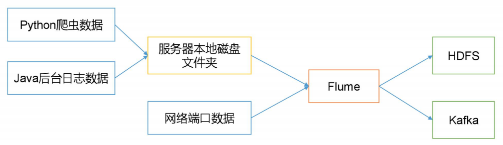
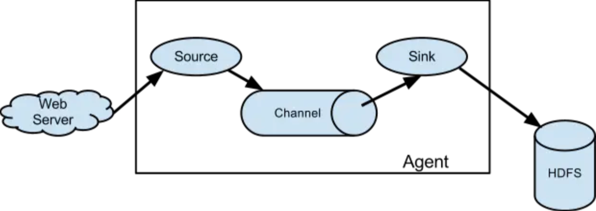
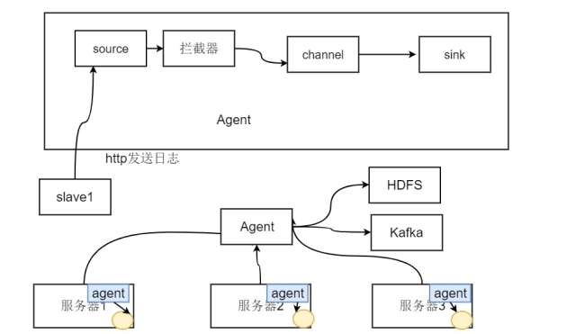
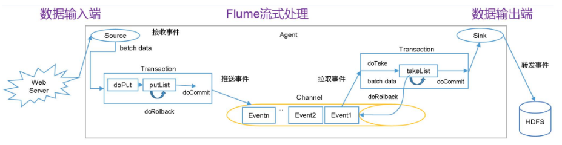
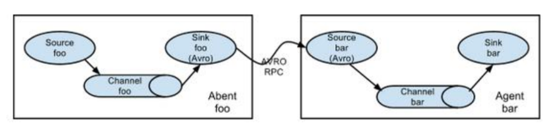
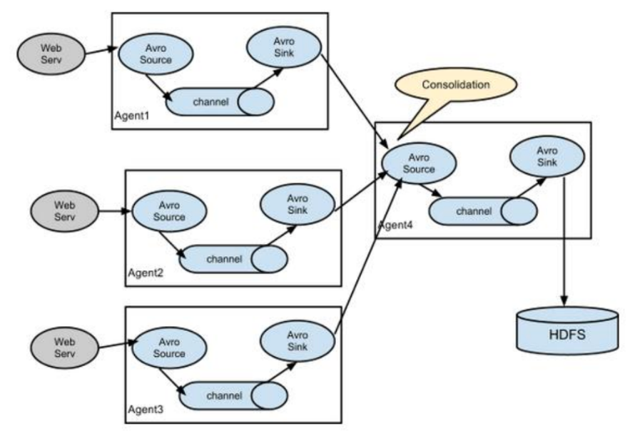
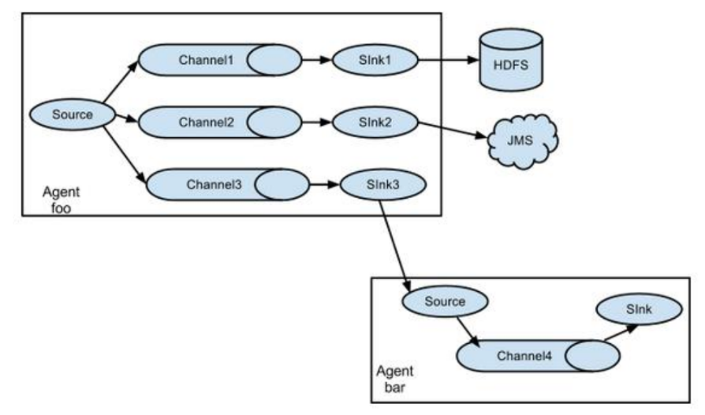
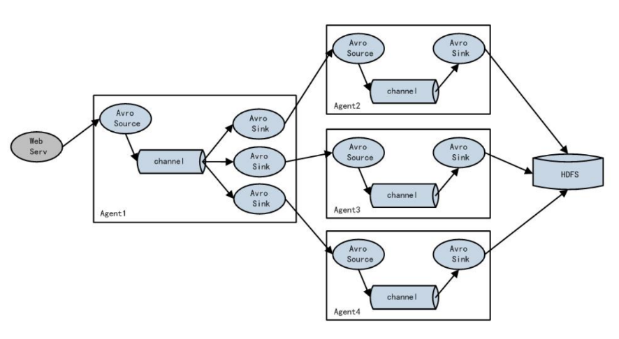

# 1、Flume是什么

在大数据的业务处理过程中，对于数据的采集是十分重要的一步。许多公司的平台每天会产生大量的日志（一般为流式数据，如，搜索引擎的pv，查询等），处理这些日志需要特定的日志系统，一般而言，这些系统需要具有以下特征：

* 构建应用系统和分析系统的桥梁，并将它们之间的关联解耦；
* 支持近实时的在线分析系统和类似于Hadoop之类的离线分析系统；
* 具有高可扩展性。即：当数据量增加时，可以通过增加节点进行水平扩展。

**Flume**是由Cloudera公司研发的一个高可用、高可靠、分布式的海量日志采集、聚合和传输系统，后于2009年捐赠给Apache软件基金会。

Apache Flume 的使用不仅限于日志数据聚合。由于数据源是可定制的，因此 Flume 可用于传输大量事件数据，包括但不限于网络流量数据、社交媒体生成的数据、电子邮件消息以及几乎任何可能的数据源。

与Flume类似的开源框架还有Facebook的**Scribe**、Apache的**Chukwa**、阿里巴巴的**Time Tunnel**。

# 2、Flume架构

## 2.1 Flume Agent

Flume内部有一个或者多个Agent，对于每一个Agent来说，它就是一个独立的守护进程(JVM)，它从客户端哪儿接收收集，或者从其他的 Agent接收，然后迅速的将获取的数据传给下一个目的节点sink，或者agent。

Agent主要由source、channel、sink三个组件组成。

### 2.1.1 Agent Source

Source 负责数据的产生或搜集，一般是对接一些RPC的程序或者是其他的Flume节点的Sink，从数据发生器接收数据，并将接收的数据以Flume的event格式传递给一个或者多个通道Channel。

Flume提供多种数据接收的方式，比如包括avro、thrift、jms、syslog等，如果不能满足需求还可以自定义。

### 2.1.2 Agent Channel

**Channel是位于Source和Sink之间的缓冲区**。因此，Channel允许Source和Sink运作在不同的速率上。Channel是线程安全的，可以同时处理几个Source的写入操作和几个Sink的读取操作。

Channel 是一种短暂的存储容器，负责数据的存储持久化，可以持久化到jdbc,file,memory，将从Source处接收到的event格式的数据缓存起来，直到它们被sinks消费掉。数据只有存储在下一个存储位置（可能是最终的存储位置，如HDFS；也可能是下一个Flume节点的Channel），数据才会从当前的Channel中删除。**这个过程是通过事务来控制的，这样就保证了数据的可靠性**。

### 2.1.3 Agent Sink

Sink 负责数据的转发，不断地轮询Channel中的事件且批量地移除它们，并将这些事件批量写入到存储或索引系统、或者被发送到另一个Flume Agent。

**Sink 是完全事务性的**。在从 Channel 批量删除数据之前，每个 Sink 用 Channel 启动一 个事务。批量事件一旦成功写出到存储系统或下一个 Flume Agent，Sink 就利用 Channel 提 交事务。事务一旦被提交，该 Channel 从自己的内部缓冲区删除事件。

Sink组件目的地包括hdfs、logger、file、HBase或者自定义等。若sink 发送失败，会将数据重新写入Channel ，这里涉及到Flume 的事务（回滚）。

## 2.2 Flume Event

Flume的数据流由**事件**(Event)贯穿始终。

事**件是Flume内部数据传输的最基本单元**，由一个转载数据的字节数组+一个可选头部构成：

* **Header**： key/value 形式，可以用来制造路由决策或携带其他结构化信息(如事件的时间戳或事件来源的服务器主机名)。你可以把它想象成和 HTTP 头一样提供相同的功能——通过该方法来传输正文之外的额外信息。
* **Body**：是一个字节数组，包含了实际的内容

# 3、Flume 拓扑结构

## 3.1 Agent连接

可以将多个Agent顺序连接起来，最初的数据源经过收集，存储到最终的存储系统中。这是最简单的情况，一般情况下，应该控制这种顺序连接的Agent 的数量，因为数据流经的路径变长了，如果不考虑failover的话，出现故障将影响整个Flow上的Agent收集服务。 

## 3.2 Agent聚合

这种情况应用的场景比较多，比如要收集Web网站的用户行为日志， Web网站为了可用性使用的负载集群模式，每个节点都产生用户行为日志，可以为每 个节点都配置一个Agent来单独收集日志数据，然后多个Agent将数据最终汇聚到一个用来存储数据存储系统，如HDFS上。

## 3.3 Agent多路复用

Flume还支持多级流。来举个例子，当syslog， java， nginx、 tomcat等混合在一起的日志流开始流入一个agent后，可以agent中将混杂的日志流分开，然后给每种日志建立一个自己的传输通道。

## 3.4 Agent负载均衡

下图Agent1是一个路由节点，负责将Channel暂存的Event均衡到对应的多个Sink组件上，而每个Sink组件分别连接到一个独立的Agent上 。
