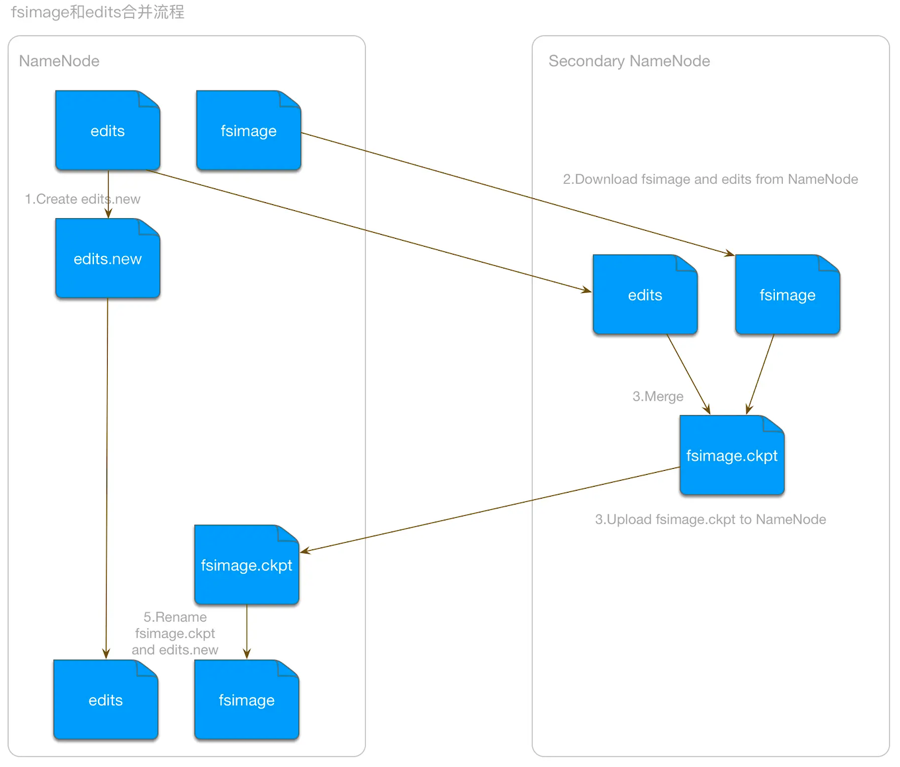
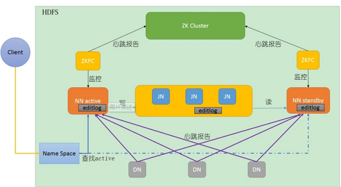
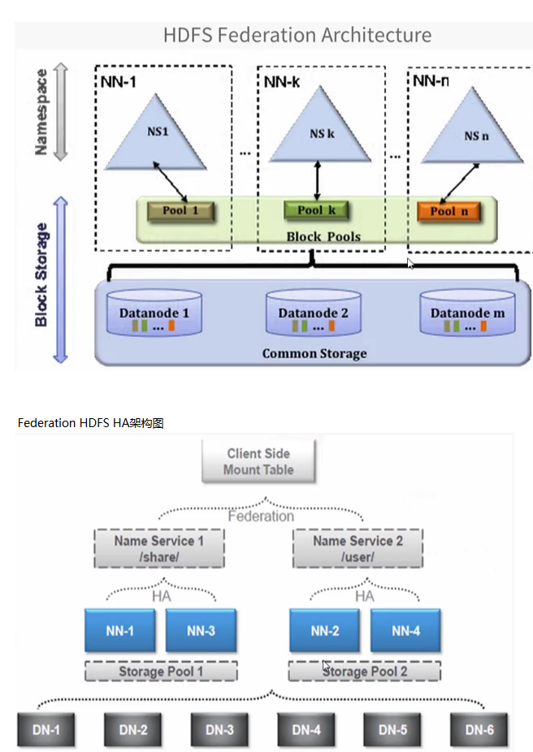

# 1 概述

在现代的企业环境中，单机容量往往无法存储大量数据，需要跨机器存储。统一管理分布在集群上的文件系统称为**分布式文件系统**。

**HDFS**（Hadoop Distributed File System）是 Hadoop 的核心组件之一，非常适于存储大型数据（比如 TB 和 PB），HDFS 使用多台计算机存储文件，并且提供统一的访问接口，像是访问一个普通文件系统一样使用分布式文件系统。

HDFS 是分布式计算中数据存储管理的基础，是基于流数据模式访问和处理超大文件的需求而开发的，可以运行于廉价的商用服务器上。它所具有的**高容错、高可靠性、高可扩展性、高可用性、高吞吐率**等特征为海量数据提供了不怕故障的存储，为超大数据集的应用处理带来了很多便利。

HDFS 具有以下**优点**：

1. 高容错性

   - 数据自动保存多个副本。它通过增加副本的形式，提高容错性。
   - 某一个副本丢失以后，它可以自动恢复，这是由 HDFS 内部机制实现的，我们不必关心。

2. 适合批处理

   - 通过移动计算而不是移动数据。
   - 它会把数据位置暴露给计算框架。

3. 适合大数据处理

   - 处理的数据达到 GB、TB 甚至 PB 级别。
   - 能够处理百万规模以上的文件数量，数量相当之大。
   - 能够处理 10K 节点的规模。

4. 流式文件访问

   - 一次写入，多次读取。**文件一旦写入不能修改，只能追加**。
   - 它能保证数据的一致性。

5. 可构建在廉价机器上

   - 它通过多副本机制，提高可靠性。
   - 它提供了容错和恢复机制。比如某一个副本丢失，可以通过其他副本来恢复。

当然 HDFS 也有它的**劣势**，并不适合以下场合：

1. 低延时数据访问
   - 例如要求毫秒级的数据访问延迟，HDFS 难以满足此类需求。
   - HDFS 旨在实现高吞吐率（单位时间内读写大量数据），而非低延迟访问。
2. 小文件存储
   - 存储大量小文件（这里的小文件是指小于 HDFS 系统的 block 大小的文件（默认 128MB））的话，它会占用 NameNode 大量的内存来存储文件、目录和块信息。这样是不可取的，因为 NameNode 的内存总是有限的。
   - 大量小文件还会使 MapReduce/Spark 等计算框架产生过多的 Task，任务调度开销往往远大于实际计算时间，偏离了 HDFS 面向大文件流式处理的设计目标。
3. 并发写入、文件随机修改
   - 一个文件只能有一个写入者，不允许多个线程同时写。
   - 仅支持数据 append（追加），不支持文件的随机修改。

# 2 架构

HDFS 采用 Master/Slave 的架构来存储数据，这种架构主要由四个部分组成，分别为 HDFS Client、NameNode、DataNode 和 Secondary NameNode。

## 2.1 NameNode

NameNode 是整个文件系统的管理节点，负责接收用户的操作请求。它维护着整个文件系统的目录树，文件的元数据信息以及文件到块的对应关系和块到节点的对应关系。

NameNode 保存了两个核心的数据结构：

- **fsimage：**fsimage 是 NameNode 内存中元数据的镜像文件，是元数据的一个永久性 checkpoint，包含了 HDFS 的所有目录和文件 inode 的序列化信息，可以类比银行的账户余额，只有简单的信息。
- **EditLog：**EditLog 是用于衔接内存元数据和 fsimage 之间的操作日志（对应磁盘上的 edits 文件），保存了自最后一次检查点之后，所有针对 HDFS 文件系统的操作，比如增加文件、重命名文件、删除目录等等，可以类比银行的账户流水，包括每一笔的记录，如果日积月累，流水信息可以非常大。

在 NameNode 启动的时候，先将 fsimage 中的文件系统元数据信息加载到内存，然后根据 edits 中的记录将内存中的元数据同步到最新状态；所以，这两个文件一旦损坏或丢失，将导致整个 HDFS 文件系统不可用。

为了避免 edits 文件过大，**SecondaryNameNode 会按照时间阈值或者大小阈值，周期性地将 fsimage 和 edits 合并**，然后将最新的 fsimage 推送给 NameNode。

## 2.2 SecondaryNameNode

并非 NameNode 的热备。当 NameNode 挂掉的时候，它并不能马上替换 NameNode 并提供服务。其主要任务是辅助 NameNode，定期合并 fsimage 和 edits。

## 2.3 DataNode

DataNode 是实际存储数据块的地方，负责执行数据块的读/写操作。

一个数据块在 DataNode 上以文件形式存储在磁盘上，包括两个文件，一个是数据本身，一个是元数据，包括数据块的长度，块数据的校验和，以及时间戳。

文件划分成块，默认大小 128MB，以块为单位，每个块有多个副本（默认 3 个）存储在不同的机器上。

Hadoop 2.x 及 3.x 版本中默认块大小均为 128MB，**小于一个块的文件，并不会占据整个块的空间**。block（数据块）大小设置较大的原因：

- 减少文件寻址时间
- 减少管理块的数据开销，因每个块都需要在 NameNode 上有对应的记录
- 对数据块进行读写，减少建立网络的连接成本

## 2.4 Client

文件上传 HDFS 的时候，Client 将文件切分成一个一个的 block，然后进行存储。

Client 还提供一些命令来管理 HDFS，比如启动或者关闭 HDFS。

# 3 实现原理

## 3.1 读流程

1. 客户端通过调用 FileSystem 对象中的 open() 方法来读取需要的数据。
2. DistributedFileSystem 通过 RPC（远程过程调用）获得文件的第一批 block 的 locations，同一 block 按照副本数会返回多个 locations，这些 locations 按照 Hadoop 拓扑结构排序，距离客户端近的排在前面。
3. 客户端调用 read 方法，DFSInputStream 就会找出离客户端最近的 DataNode 并连接 DataNode。
4. 数据从 DataNode 源源不断地流向客户端。
5. 如果第一个 block 的数据读完了，就会关闭指向第一个 block 的 DataNode 连接，接着读取下一个 block。这些操作对客户端来说是透明的，从客户端的角度来看只是读一个持续不断的流。
6. 如果第一批 block 都读完了，DFSInputStream 就会去 NameNode 拿下一批 blocks 的 location，然后继续读，如果所有的 block 都读完，这时就会关闭掉所有的流。

## 3.2 写流程

1. 客户端通过调用 DistributedFileSystem 的 create 方法，创建一个新的文件。
2. DistributedFileSystem 通过 RPC（远程过程调用）调用 NameNode，去创建一个没有 blocks 关联的新文件。创建前，NameNode 会做各种校验，比如文件是否存在，客户端有无权限去创建等。如果校验通过，NameNode 就会记录下新文件，否则就会抛出 IO 异常。
3. 客户端开始写数据到 DFSOutputStream，DFSOutputStream 会把数据切成一个个小 packet，然后排成队列 **data queue**。
4. DataStreamer 会去处理 data queue，它先问询 NameNode 这个新的 block 最适合存储在哪几个 DataNode 里，比如副本数是 3，那么就找到 3 个最适合的 DataNode，把它们排成一个 **pipeline**。DataStreamer 把 packet 按队列输出到管道的第一个 DataNode 中，第一个 DataNode 又把 packet 输出到第二个 DataNode 中，以此类推。
5. DFSOutputStream 还有一个队列叫 **ack queue**，也是由 packet 组成，等待 DataNode 收到响应，当 pipeline 中的所有 DataNode 都表示已经收到的时候，ack queue 才会把对应的 packet 包移除掉。
6. 客户端完成写数据后，调用 close 方法关闭写入流。
7. DataStreamer 把剩余的包都刷到 pipeline 里，然后等待 ack 信息，收到最后一个 ack 后，通知 DataNode 把文件标记为已完成。

## 3.3 checkpoint 机制

NameNode 始终在内存中保存 metadata，用于处理“读请求”，当有“写请求”到来时，NameNode 会**先写 EditLog 到磁盘，即向 edits 文件中写日志，成功返回后，才会修改内存**，并且向客户端返回。Hadoop 会维护一个 fsimage 文件，也就是 NameNode 中 metadata 的镜像，但是 fsimage 不会随时与 NameNode 内存中的 metadata 保持一致，而是每隔一段时间通过合并 edits 文件来更新内容。

1. 将 HDFS 更新记录写入一个新的文件——edits.new
2. SecondaryNameNode 通过 HTTP 协议从 NameNode 下载 fsimage 和 edits 文件
3. 将 fsimage 和 edits 合并，生成一个新的文件 fsimage.ckpt
4. 将生成的 fsimage.ckpt 文件通过 HTTP 协议发送至 NameNode
5. 重命名 fsimage.ckpt 为 fsimage，edits.new 为 edits

## 3.4 HA 方案

### 3.4.1 热备份

HDFS HA（High Availability）是为了解决单点故障问题。

HA 集群设置两个名称节点，“活跃（**Active**）”和“待命（**Standby**）”，两个名称节点的状态同步，可以借助于一个共享存储系统来实现，一旦活跃名称节点出现故障，就可以立即切换到待命名称节点。

为了保证读写数据一致性，HDFS 集群设计为只能有一个状态为 Active 的 NameNode，但这种设计存在单点故障问题，官方提供了两种解决方案：

- **QJM**（推荐）：通过同步编辑事务日志的方式备份命名空间数据，同时需要 DataNode 向所有 NameNode 上报块列表信息。还可以配置 ZKFC 组件实现故障自动转移。
- **NFS**：将需要持久化的数据写入本地磁盘的同时写入一个远程挂载的网络文件系统作为备份（注：该方案在现代生产环境中已极少使用）。

通过增加一个处于 Standby 状态的 NameNode，与 Active 的 NameNode 同时运行。当 Active 的节点出现故障时，切换到 Standby 节点。

为了保证 Standby 节点能够随时顶替上去，它需要定时同步 Active 节点的事务日志来更新本地的文件系统目录树信息，同时 DataNode 需要配置所有 NameNode 的位置，并向所有 NameNode 发送块列表信息和心跳。

同步事务日志来更新目录树由 JournalNode 的守护进程来完成，这种机制简称为 QJM（Quorum Journal Manager）。JournalNode 进程由一组独立的节点组成（通常部署奇数个，一般为 3 个），当 Active 节点执行任何命名空间文件目录树修改时，它会将修改记录持久化到大多数 JournalNode 中，Standby 节点从 JournalNode 中监听并读取编辑事务日志内容，并将编辑日志应用到自己的命名空间。发生故障转移时，Standby 节点将确保在将自身提升为 Active 状态之前，从 JournalNode 读取所有编辑内容。

注意，QJM 只是实现了数据的备份，当 Active 节点发生故障时，需要手工提升 Standby 节点为 Active 节点。如果要实现 NameNode 故障自动转移，则需要配套 ZKFC 组件来实现，ZKFC 也是独立运行的一个守护进程，基于 ZooKeeper 来实现选举和自动故障转移。

### 3.4.2 HDFS 联邦（Federation）

虽然 HDFS HA 解决了“单点故障”问题，但是在系统扩展性、整体性能和隔离性方面仍然存在问题：

1. 系统扩展性方面，元数据存储在 NameNode（NN）内存中，受内存上限的制约。
2. 整体性能方面，吞吐量受单个 NN 的影响。
3. 隔离性方面，所有程序共享单个 NameNode 的 RPC 处理能力，元数据操作之间也存在竞争，一个程序消耗过多资源会导致其他程序无法顺利运行。

HDFS HA 本质上还是单名称节点。HDFS 联邦可以解决以上三个方面的问题。

在 HDFS 联邦中，设计了多个相互独立的 NN，使得 HDFS 的命名服务能够水平扩展，这些 NN 分别进行各自命名空间和块的管理，不需要彼此协调，不同业务可以分配到不同的命名空间，从而实现相互隔离。每个 DataNode（DN）要向集群中所有的 NN 注册，并周期性地发送心跳信息和块信息，报告自己的状态。

HDFS 联邦拥有多个独立的命名空间，其中，每一个命名空间管理属于自己的一组块，这些属于同一个命名空间的块组成一个“块池”。每个 DN 会为多个块池提供块的存储，块池中的各个块实际上是存储在不同 DN 中的。
