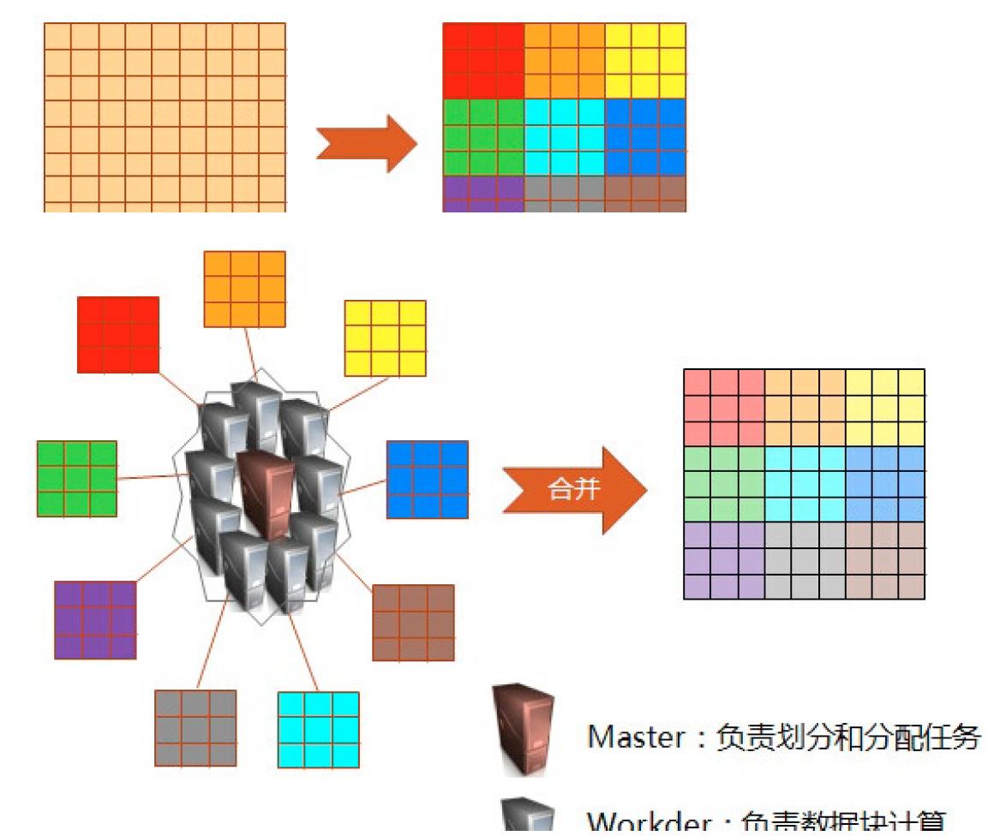
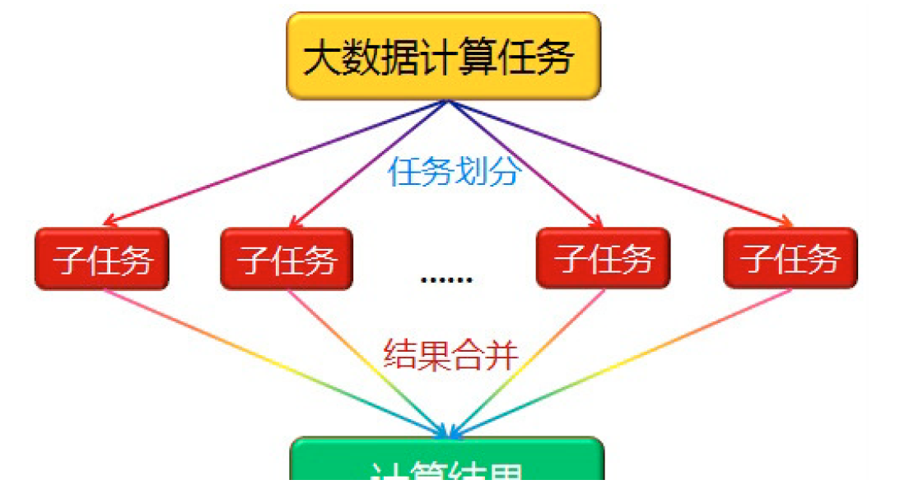
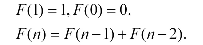
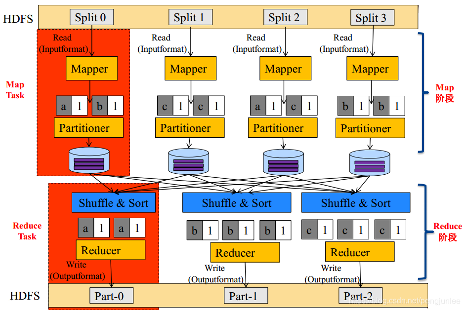
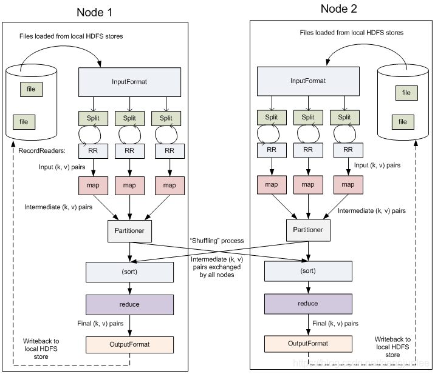
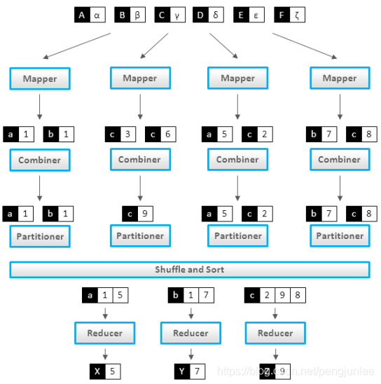

# 1、从一个例子开始

**问**：要数出一摞牌中有多少张黑桃，拢共分几步？

- 普通青年：从头至尾，一张一张检查
- 2B青年：用意念，随便猜一个数
- 文艺青年：
  1. 给在座的所有人平均分配这摞牌
  2. 让每个人数自己手中的牌有几张是黑桃
  3. 把所有人告诉汇报的数字加起来，得到最后的结论

都是接受了九年义务教育的少年，为啥文艺青年就这么优秀呢？因为他掌握了MapReduce大法。

重新审视分散纸牌的例子，里面包含了MapReduce数据分析的基本方法。在这个例子里，人代表计算机，因为他们同时工作，所以他们是个**集群**。在大多数实际应用中，我们假设数据已经在每台计算机上了——也就是说把牌分发出去并不是MapReduce的一步。事实上，在计算机集群中如何存储文件是HDFS关心的事。

通过把牌分给多个玩家并且让他们各自数数，就等同于**并行**执行运算，因为每个玩家都在同时计数。这同时把这项工作变成了**分布式**的，多个不同的人在解决同一个问题的过程中并不需要知道他们的邻居在干什么。

通过告诉每个人去数数，你对一项检查每张牌的任务进行了映射。 你不会让他们把黑桃牌递给你，而是让他们把你想要的东西化简为一个数字。

另外一个需要注意的前提是，纸牌需要随机、均匀的分配。MapReduce假设数据是**洗过的**（**shuffled**）—— 如果所有黑桃都分到了一个人手上，那他数牌的过程可能比其他人要慢很多。

如果有足够的人的话，问一些更有趣的问题就相当简单了。 比如“一摞牌的平均值是什么”。你可以通过合并“所有牌的值的和是什么”及“我们有多少张牌”这两个问题来得到答案。用这个和除以牌的张数就得到了平均值。

MapReduce算法的机制要远比这复杂得多，但是主体思想是一致的 ——**通过分散计算来分析大量数据**。无论是Facebook、Google，还是小创业公司，MapReduce都是目前分析互联网级别数据的主流方法。

# 2、分而治之

MapReduce对付大数据的核心手段就是**分而治之**。

一个大数据若可以分为具有同样计算过程的数据块，并且这些数据块之间不存在数据依赖关系，则提高处理速度的最好办法就是**并行计算**。

例如，假设有一个巨大的二维数据需要处理(比如求每个元素的开立方)，其中对每个元素的处理是相同的，并且数据元素间不存在数据依赖关系，可以考虑不同的划分方法将其划分为子数组，由一组处理器并行处理。

并行计算的第一个重要问题是如何划分计算任务或者计算数据，以便对划分的子任务或数据块同时进行计算。但一些计算问题恰恰无法进行这样的划分：

>
> Nine women cannot have a baby in one month.
>

再例如Fibonacci函数: 

前后数据项之间存在很强的依赖关系，只能串行计算。

**结论**：不可分拆的计算任务或相互间有依赖关系的数据无法进行并行计算。

# 3、编程模型

Wordcount，即统计一大批文件中每个单词出现的次数，经常被拿来当做MapReduce入门案例。主要处理流程如下：

 MapReduce将作业的整个运行过程分为两个阶段： **Map**（映射）阶段和**Reduce**（归约）阶段。

Mapper负责“分”，即把复杂的任务分解为若干个“简单的任务”来处理。“简单的任务”包含三层含义：

1. 数据或计算的规模相对原任务要大大缩小；
2. **就近计算原则**，即任务会分配到存放着所需数据的节点上进行计算；
3. 这些小任务可以并行计算，**彼此间几乎没有依赖关系**。

Map阶段由一定数量的Map Task组成，包含如下几个步骤：

- 输入数据格式解析： InputFormat
- 输入数据处理： Mapper
- 结果本地汇总：Combiner（ local reducer）
- 数据分组： Partitioner

Reducer负责对map阶段的结果进行汇总。

Reduce阶段由一定数量的Reduce Task组成，包含如下几个步骤：

- 数据远程拷贝
- 数据按照key排序
- 数据处理： Reducer
- 数据输出格式： OutputFormat

以Wordcount为例，MapReduce的内部执行过程如下图所示：

外部物理结构如下图所示：

Combiner可以看做是 local reducer，在Mapper计算完成后将相同的key对应的value进行合并（ Wordcount例子），如下图所示：

Combiner通常与Reducer逻辑是一样的，使用Combiner有如下好处：

- 减少Map Task输出数据量（磁盘IO）
- 减少Reduce-Map网络传输数据量(网络IO)

需要注意的是，并不是所有的MapReduce场景都能够使用Combiner，计算结果可以累加的场景一般可以使用，例如Sum，其他的例如求平均值 Average 则不能使用 Combiner。

# 4、总结

## 4.1 优点

### 易于编程

MapReduce向用户提供了简单的编程接口，由框架层自动完成数据分布存储、数据通信、容错处理等复杂的底层处理细节，用户只需要使用接口实现自己的数据处理逻辑即可。也就是说你写一个分布式程序，跟写一个简单的串行程序是一模一 样的，就是因为这个特点使得 MapReduce 编程变得非常流行。

### 良好的扩展性

当你的计算资源不能得到满足的时候，可以通过简单的增加机器来扩展它的计算能力。

### 高容错性

MapReduce 设计的初衷就是使程序能够部署在廉价的 PC 机器上，这就要求它具有很高 的容错性。比如其中一台机器挂了，它可以把上面的计算任务转移到另外一个节点上运行， 不至于这个任务运行失败，而且这个过程不需要人工参与，而完全是由 Hadoop 内部完成的。

### 大数据量

适合 PB 级以上海量数据的离线处理，可以实现上千台服务器集群并发工作，提供数据处理能力。

## 4.2 缺点

### 不擅长实时计算

MapReduce 无法像MySQL一样，在毫秒或者秒级内返回结果。

### 不擅长流式计算

流式计算的输入数据是动态的，而 **MapReduce 的输入数据集是静态的**，不能动态变化。 这是因为 MapReduce 自身的设计特点决定了数据源必须是静态的。

### 不擅长 DAG（有向无环图）计算

多个应用程序存在依赖关系，后一个应用程序的输入为前一个的输出。在这种情况下， MapReduce 并不是不能做，而是使用后，**每个 MapReduce 作业的输出结果都会写入到磁盘，** **会造成大量的磁盘 IO，导致性能非常的低下。**

