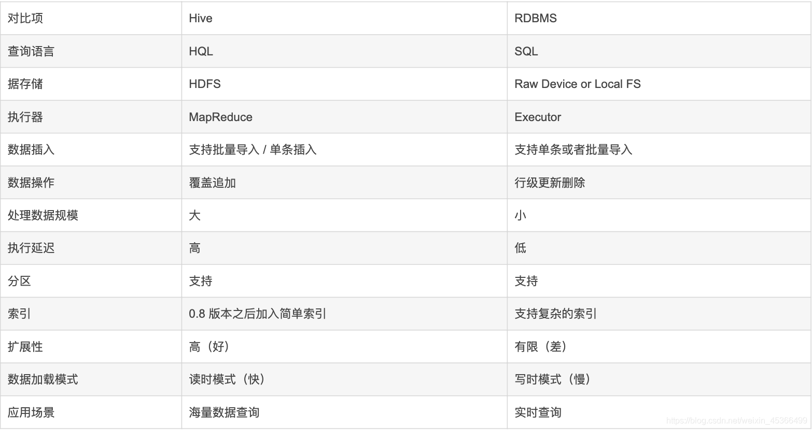
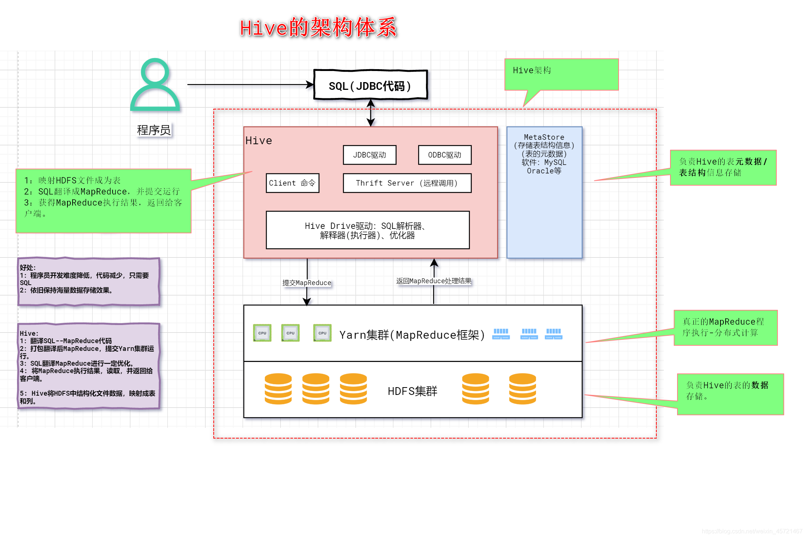
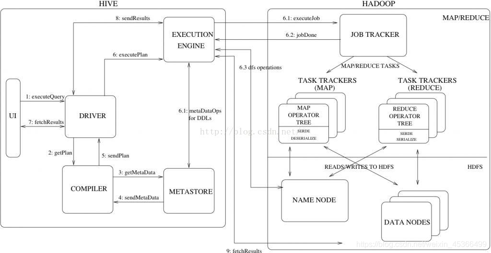
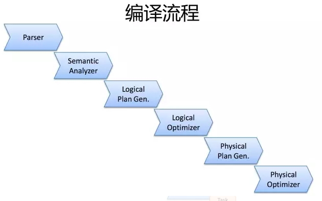
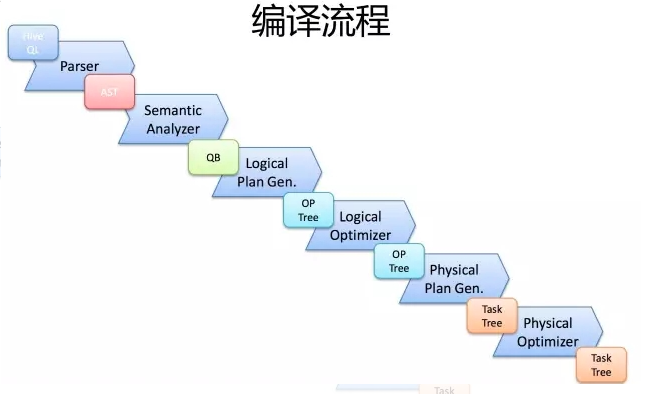

# 1、Hive是什么

## 1.1 概述

在Hadoop项目中，HDFS解决了文件分布式存储的问题，MapReduce解决了数据处理分布式计算的问题。

然而，如果想要对HDFS中的数据进行查询、分析，需要手工写一堆MapReduce的Java程序，这就要求使用者既要了解MapReduce的特性，又要会写Java代码，无形中把很多业务人员挡在了门外。尤其在数据分析领域，数据分析师习惯了使用SQL与数据打交道，SQL才是查询市场的硬通货。

打通Hadoop与SQL的桥梁，就是Hive。

Hive是基于Hadoop平台的数仓工具，由FaceBook研发并开源。FaceBook最开始使用Oracle作为数仓，随着数据量的爆炸式增长，Oracle数仓性能越来越差，无法实现海量数据的离线批量分析，因此FaceBook基于Hadoop研发了Hive。Hive具有海量数据存储、水平可扩展、离线批量处理的优点，解决了传统关系型数仓不能支持海量数据存储、水平可扩展性差等问题。

Hive可以将结构化的数据文件映射成一张表，定义了简单的类SQL查询语言，称为 **HQL**。Hive中的表是纯逻辑表，就只是表的定义等，即表的元数据。本质就是Hadoop的目录/文件，达到了元数据与数据存储分离的目的，Hive本身不存储数据，它完全依赖HDFS和MapReduce。

由以上可以总结出Hive的三大基石：
* 使用HQL作为查询接口
* 使用HDFS存储
* 使用MapReduce计算

一句话概括，**Hive就是把SQL语句，翻译成Mapreduce代码，扔到Hadoop上执行**。

## 1.2 优缺点

优点

* 学习成本低：Hive 封装了一层接口，并提供类 SQL 的查询功能，避免去写 MapReduce，减少了开发人员的学习成本
* 扩展性高：可以自由扩展集群的规模，不需要重启服务而进行横向扩展
* 容错性高：可以保障即使有节点出现问题，SQL 语句也可以完成执行
* 延展性高：支持用户自定义函数，可以根据自己的需求来实现自己的函数

缺点

* 延迟高：Hive操作默认基于MapReduce引擎，而MapReduce引擎与其它的引擎（如spark引擎）相比，特点就是慢、延迟高、**不适合交互式查询**
* 不支持更新与事务：Hive **不支持行级别的更新操作**（hive 2.3.2 版本支持记录级别的插入操作），所以主要用来做 OLAP（联机分析处理），而不是 OLTP（联机事物处理）
* 表达能力有限：Hive 自动生成的 MapReduce 作业，通常情况下不够智能，当我们的逻辑需求特别复杂的时候，还是要借助MapReduce

## 1.3 与传统数据的区别

由于Hive采用了SQL的查询语言HQL，因此很容易将Hive理解为数据库。其实从结构上来看，Hive和数据库除了拥有类似的查询语言，再无类似之处。数据库可以用在Online的应用中，但是Hive是为数据仓库而设计的。



* **查询语言**：由于SQL被广泛的应用在数据仓库中，因此，专门针对Hive的特性设计了类SQL的查询语言HQL。熟悉SQL开发的开发者可以很方便的使用Hive进行开发。
* **数据存储**：Hive是建立在Hadoop之上的，所有Hive的数据都是存储在HDFS中的。而数据库则可以将数据保存在块设备或者本地文件系统中。
* **数据格式**：Hive中没有定义专门的数据格式，数据格式可以由用户指定，用户定义数据格式需要指定三个属性：**列分隔符**(通常为空格、"\t"、"\x001")、**行分隔符**("\n")以及**读取文件数据的方法**(Hive中默认有三个文件格式TextFile、SequenceFile以及RCFile)。由于在加载数据的过程中，不需要从用户数据格式到Hive定义的数据格式的转换，因此，Hive在加载的过程中不会对数据本身进行任何修改，而只是将数据内容复制或者移动到相应的HDFS目录中。而在数据库中，不同的数据库有不同的存储引擎，定义了自己的数据格式。所有数据都会按照一定的组织存储，因此，数据库加载数据的过程会比较耗时。
* **数据更新**：由于Hive是针对数据仓库应用设计的，而数据仓库的内容是读多写少的。因此，**Hive中不支持对数据的改写和添加**，所有的数据都是在加载的时候中确定好的。而数据库中的数据通常是需要经常进行修改的，因此可以使用`INSERT INTO...VALUES`添加数据，使用`UPDATE...SET`修改数据。
* **索引**：Hive在加载数据的过程中不会对数据进行任何处理，甚至不会对数据进行扫描，因此也没有对数据中的某些Key建立索引。Hive要访问数据中满足条件的特定值时，需要暴力扫描整个数据，因此访问延迟较高。由于MapReduce的引入，Hive可以并行访问数据，因此即使没有索引，对于大数据量的访问，Hive仍然可以体现出优势。数据库中，通常会针对一个或几个列建立索引，因此对于少量的特定条件的数据的访问，数据库可以有很高的效率，较低的延迟。由于数据的访问延迟较高，决定了Hive不适合在线数据查询。高版本的Hive已经支持索引，但是功能很弱，适用场景很少。
* **执行**：Hive中大多数查询的执行是通过Hadoop提供的MapReduce来实现的。而数据库通常有自己的执行引擎。
* **时延**：Hive在查询数据的时候，由于没有索引，需要扫描整个表，因此延迟较高。另外一个导致Hive执行延迟高的因素是MapReduce框架。由于MapReduce本身具有较高的延迟，因此在利用MapReduce执行Hive查询时，也会有较高的延迟。相对的，数据库的执行延迟较低。当然，这个低是有条件的，即数据规模较小，当数据规模大到超过数据库的处理能力的时候，Hive的并行计算显然能体现出优势。
* **可扩展性**：由于Hive是建立在Hadoop之上的，因此Hive的可扩展性是和Hadoop的可扩展性是一致的。而数据库由于ACID语义的严格限制，扩展性非常有限。目前最先进的并行数据库Oracle在理论上的扩展能力也只有100台左右。
* **数据规模**：由于Hive建立在集群上并可以利用MapReduce进行并行计算，因此可以支持很大规模的数据；对应的，数据库可以支持的数据规模较小。


# 2、数据模型

## 2.1 内部表

默认创建的表都是所谓的**内部表**，有时也被称为**管理表**。因为这种表，Hive 会(或多或少地)控制着数据的生命周期。Hive 默认情况下会将这些表的数据存储在由配置项`hive.metastore.warehouse.dir`所定义的目录的子目录下。**当我们删除一个管理表时，Hive 也会删除这个表中的数据**，因此内部表不适合和其他工具共享数据。

内部表创建示例：

```sql
CREATE TABLE emp( 
    empno INT, 
    ename STRING, 
    job STRING, 
    mgr INT, 
    hiredate TIMESTAMP, 
    sal DECIMAL(7,2), 
    comm DECIMAL(7,2), 
    deptno INT) 
    ROW FORMAT DELIMITED FIELDS TERMINATED BY "\t"; -- 分隔符\t 
```

## 2.2 外部表

外部表在创建表时需要指定文件的存储位置，如果删除外部表时，只会删除元数据不会删除表数据。

外部表创建命令，仅内部表多一个LOCATION而已：

```sql
CREATE EXTERNAL TABLE emp_external( 
  empno INT, 
  ename STRING, 
  job STRING, 
  mgr INT, 
  hiredate TIMESTAMP, 
  sal DECIMAL(7,2), 
  comm DECIMAL(7,2), 
  deptno INT) 
  ROW FORMAT DELIMITED FIELDS TERMINATED BY "\t" 
  LOCATION '/hive/emp_external';  -- 存储路径
```


外部表与内部表的区别：

* 内部表数据由Hive自身管理，外部表则是由HDFS管理。
* 删除内部表会直接删除元数据（metadata）以及储存数据；删除外部表仅仅会删除元数据，HDFS上的文件并不会被删除。
* 对内部表的修改会直接同步给元数据，而对外部表的表结构和分区进行修改，则需要修复。


## 2.3 分区表

**分区表实际上就是对应一个 HDFS 文件系统上的独立的文件夹**，该文件夹下是该分区所有的数据文件。Hive 中的分区就是分目录，把一个大的数据集根据业务需要分割成小的数据集。在查询时通过 WHERE 子句中的表达式选择查询所需要的指定的分区，这样的查询效率会提高很多。

具体的分区表创建命令如下，比外部表多一个`PARTITIONED`，需要指定表中的其中一个字段，划分不同的文件夹。

```sql
CREATE EXTERNAL TABLE emp_partition( 
  empno INT, 
  ename STRING, 
  job STRING, 
  mgr INT, 
  hiredate TIMESTAMP, 
  sal DECIMAL(7,2), 
  comm DECIMAL(7,2) 
  ) 
  PARTITIONED BY (deptno INT)   -- 按照部门编号进行分区 
  ROW FORMAT DELIMITED FIELDS TERMINATED BY "\t" 
  LOCATION '/hive/emp_partition'; 
```

## 2.4 分桶表

**分区在HDFS上的表现形式是一个目录，分桶则是一个单独的文件**。分桶则是指定分桶表的某一列，让该列数据按照哈希取模的方式随机、均匀地分发到各个桶文件中。

分桶操作和分区一样，需要根据某一列具体数据来进行哈希取模操作，故指定的分桶列必须基于表中的某一列(字段)。

分桶表的创建命令比分区表的不同在于`CLUSTERED`：

```sql
CREATE EXTERNAL TABLE emp_bucket( 
  empno INT, 
  ename STRING, 
  job STRING, 
  mgr INT, 
  hiredate TIMESTAMP, 
  sal DECIMAL(7,2), 
  comm DECIMAL(7,2), 
  deptno INT) 
  CLUSTERED BY(empno) SORTED BY(empno ASC) INTO 4 BUCKETS  --按照员工编号散列到四个 bucket 中 
  ROW FORMAT DELIMITED FIELDS TERMINATED BY "\t" 
  LOCATION '/hive/emp_bucket'; 
```

# 3、实现原理

## 3.1 体系架构




### 3.1.1 用户接口Client

* **CLI(command line interface)**： shell 命令行

* **JDBC/ODBC**： Hive 的 JAVA 实现，与传统数据库JDBC 类似

* **WebGUI**： 是通过浏览器访问 Hive

* **ThriftServer**：HiveServer2基于Thrift, 允许远程客户端使用多种编程语言如Java、Python向Hive提交请求

### 3.1.2 元数据Metastore

Hive将元数据存储在数据库中，Hive中的元数据包括

* 表的名字
* 表的列
* 分区及其属性
* 表的属性（是否为外部表等）
* 表的数据所在目录等

元数据默认存在Hive自带的 Derby 数据库中。缺点就是不适合多用户操作，并且数据存储目录不固定。数据库跟着 Hive 走，极度不方便管理。实际应用中，一般会自建MySQL库来存储元数据，Hive 和 MySQL 之间通过 MetaStore 进行交互。

### 3.1.3 驱动器Driver

* **解析器（SQL Parser）**：将 SQL 字符串转换成抽象语法树 AST，这一步一般都用第三方工具库完成，比如 `antlr`；对 AST 进行语法分析，比如表是否存在、字段是否存在、SQL语义是否有误

* **编译器（Physical Plan）**：将 AST 编译生成逻辑执行计划

* **优化器（Query Optimizer**）：对逻辑执行计划进行优化

* **执行器（Execution）**：把逻辑执行计划转换成可以运行的物理计划。对于 Hive 来说，就是 MR/Spark

### 3.1.4 Hadoop

* 使用 HDFS 进行存储
* 使用 MapReduce 进行计算

## 3.2 工作流程



1. 用户提交查询等任务给Driver。
2. 编译器获得该用户的任务Plan。
3. 编译器Compiler根据用户任务去MetaStore中获取需要的Hive的元数据信息。
4. 编译器Compiler得到元数据信息，对任务进行编译，先将HiveQL转换为抽象语法树，然后将抽象语法树转换成查询块，将查询块转化为逻辑的查询计划，重写逻辑查询计划，将逻辑计划转化为物理的计划（MapReduce）, 最后选择最佳的策略。
5. 将最终的计划提交给Driver。
6. Driver将计划Plan转交给ExecutionEngine去执行，获取元数据信息，提交给JobTracker或者SourceManager执行该任务，任务会直接读取HDFS中文件进行相应的操作。
7. 获取执行的结果。
8. 取得并返回执行结果。

## 3.3 编译流程

Hive作业的执行过程实际上是SQL翻译成作业的过程？那么，它是怎么翻译的？



一条SQL，进入的Hive。经过上述的过程，其实也是一个比较典型的编译过程变成了一个作业。



1. 首先，Driver会输入一个字符串SQL，然后经过Parser变成**AST**，这个变成AST的过程是通过**Antlr**来完成的，也就是Anltr根据语法文件来将SQL变成AST。

2. AST进入**SemanticAnalyzer**（核心）变成QB，也就是所谓的**QueryBlock**。一个最简的查询块，通常来讲，一个From子句会生成一个QB。生成QB是一个递归过程，生成的 ＱＢ经过GenLogicalPlan过程，变成了一个Operator图，也是一个有向无环图。

3. OP DAG经过逻辑优化器，对这个图上的边或者结点进行调整，顺序修订，变成了一个优化后的有向无环图。这些优化过程可能包括**谓词下推**（Predicate Push Down），**分区剪裁**（Partition Prunner），**关联排序**（Join Reorder）等等

4. 经过了逻辑优化，这个有向无环图还要能够执行。所以有了生成物理执行计划的过程。Ｈive的作法通常是碰到需要分发的地方，切上一刀，生成一道MapReduce作业。如Group By切一刀，Join切一刀，Distribute By切一刀，Distinct切一刀。这么很多刀砍下去之后，刚才那个逻辑执行计划，也就是那个逻辑有向无环图，就被切成了很多个子图，每个子图构成一个结点。这些结点又连成了一个执行计划图，也就是**Task Tree**.

5. 把这些个Task Tree 还可以有一些优化，比如基于输入选择执行路径，增加备份作业等。进行调整。这个优化就是由**Physical Optimizer**来完成的。经过Physical Optimizer，这每一个结点就是一个MapReduce作业或者本地作业，就可以执行了。

这就是一个SQL如何变成MapReduce作业的过程。要想观查这个过程的最终结果，可以打开Hive，输入`Explain ＋ 语句`，就能够看到。

