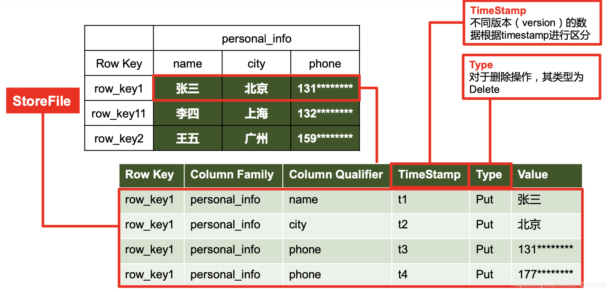
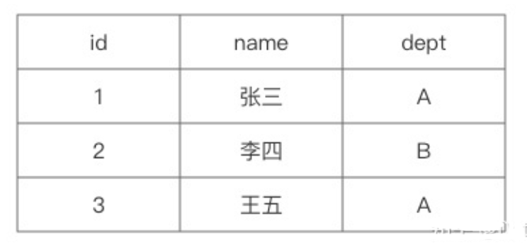
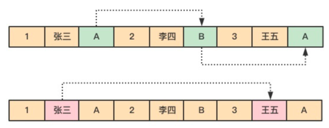
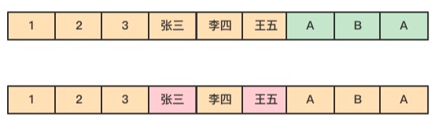
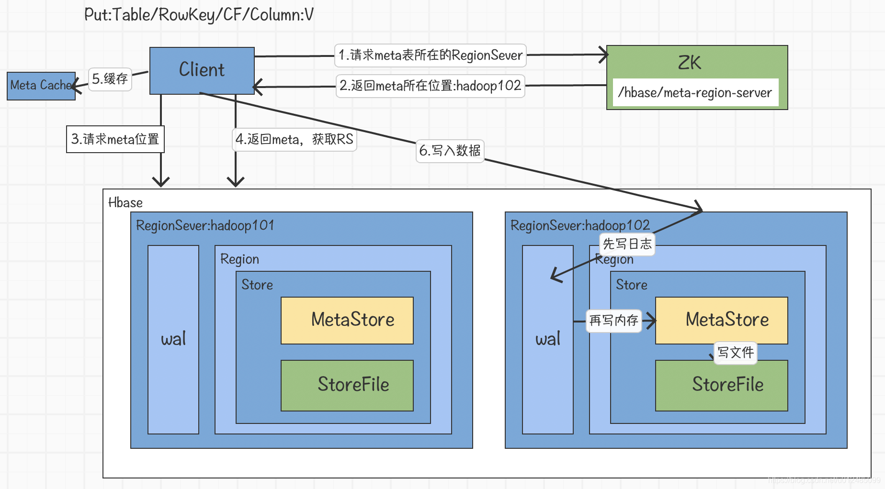
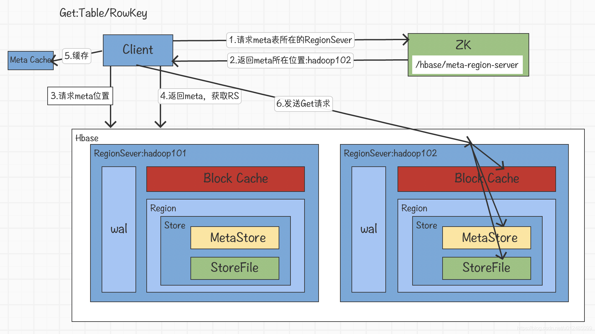

# 1、HBase是什么

**Hbase**是**Hadoop Database**的简称，是一个面向**列式存储**的分布式数据库，其设计思想来源于 Google 的 BigTable 论文。

HDFS为Hbase提供可靠的底层数据存储服务，MapReduce为Hbase提供高性能的计算能力，Zookeeper为Hbase提供稳定服务和Failover机制。HBase 良好的分布式架构设计为海量数据的快速存储、随机访问提供了可能，基于数据副本机制和分区机制可以轻松实现在线扩容、缩容和数据容灾，是大数据领域中 Key-Value 数据结构存储最常用的数据库方案。

HBASE具有以下特点：

* **易扩展**：Hbase 的扩展性主要体现在两个方面，一个是基于运算能力（RegionServer） 的扩展，通过增加 RegionSever 节点的数量，提升 Hbase 上层的处理能力；另一个是基于存储能力的扩展（HDFS），通过增加 DataNode 节点数量对存储层的进行扩容，提升 HBase 的数据存储能力。

* **海量存储**：Hbase适合存储PB级别的海量数据，在PB级别的数据以及采用廉价PC存储的情况下，能在几十到百毫秒内返回数据。这与Hbase的极易扩展性息息相关。正式因为Hbase良好的扩展性，才为海量数据的存储提供了便利。

* **列式存储**：Hbase 是根据列族来存储数据的。列族下面可以有非常多的列。列式存储的最大好处就是，其数据在表中是按照某列存储的，这样在查询只需要少数几个字段时，能大大减少读取的数据量。

* **高可靠性**：WAL 机制保证了数据写入时不会因集群异常而导致写入数据丢失，Replication 机制保证了在集群出现严重的问题时，数据不会发生丢失或损坏。而且 Hbase 底层使用 HDFS，HDFS 本身也有备份。

* **稀疏性**：在 HBase 的列族中，可以指定任意多的列，为空的列不占用存储空间，表可以设计得非常稀疏。

# 2、数据模型

逻辑上，HBase 的数据模型同关系型数据库很类似，数据存储在一张表中，有行有列。


在 HBase 表中，一条数据拥有一个全局唯一的键(RowKey)和任意数量的列(Column)，一列或多列组成一个列族(Column Family)，同一个列族中列的数据在物理上都存储在同一个 HFile 中，这样基于列存储的数据结构有利于数据缓存和查询。 HBase 中的表是疏松地存储的，因此用户可以动态地为数据定义各种不同的列。HBase中的数据按主键排序，同时，HBase 会将表按主键划分为多个 Region 存储在不同 Region Server 上，以完成数据的分布式存储和读取。

但从底层物理存储结构(K-V)来看，HBase 更像是一个多维 map。


## 2.1 Name Space

命名空间，类似于关系型数据库的 DatabBase 概念，每个命名空间下有多个表。HBase有两个自带的命名空间，分别是“hbase” 和 “default”，“hbase” 中存放的是 HBase 内置的表，“default”表是用户默认使用的命名空间。

## 2.2 Region

HBase 将表中的数据基于 RowKey 的不同范围划分到不同 Region 上，每个Region都负责一定范围的数据存储和访问。

每个表一开始只有一个 Region，随着数据不断插入表，Region 不断增大，当增大到一个阀值的时候，Region 就会等分成两个新的 Region。当table中的行不断增多，就会有越来越多的 Region。

另外，**Region 是 Hbase 中分布式存储和负载均衡的最小单元**，不同的 Region 可以分布在不同的 HRegion Server上。但一个Hregion是不会拆分到多个server上的。

## 2.3 Row

HBase 表中的每行数据都由一个 RowKey 和多个 Column（列）组成，**数据是按照 RowKey的字典顺序存储的**，并且**查询数据时只能根据 RowKey 进行检索**，所以 RowKey 的设计十分重要。

## 2.4 Column

HBase 中的每个列都是由**Column Family**(列簇)和 **Column Qualifier**(列限定符)运行限定，例如：`info: name`，`info: age` 。建表时，只需声明列簇，而列限定符无需预先定义。

## 2.5 Cell

由`{RowKey, Column Family：Column Qualifier, Time Stamp}` 唯一确定的单元。cell 中的数据是没有类型的，全部是字节码形式存储。

## 2.6 TimeStamp

TimeStamp 是实现 HBase 多版本的关键。在HBase 中，使用不同 TimeStamp 来标识相同RowKey对应的不同版本的数据。相同 RowKey的数据按照 TimeStamp 倒序排列。默认查询的是最新的版本，当然用户也可以指定 TimeStamp 的值来读取指定版本的数据。

# 3、列式存储与行式存储

列式存储并不是一项新技术，最早可以追溯到 1983 年的论文 Cantor。然而，受限于早期的硬件条件和应用场景，传统的事务型数据库（OLTP）如 Oracle、MySQL 等关系型数据库都是以行的方式来存储数据的。

直到近几年分析型数据库（OLAP）的兴起，列式存储这一概念又变得流行，如 HBase、Cassandra 等大数据相关的数据库都是以列的方式来存储数据的。为什么列式存储会广泛地应用在 OLAP 领域，和行式存储相比，它的优势在哪里呢？

## 3.1 行式存储的原理与特点

对于 OLAP 场景，大多都是对一整行记录进行增删改查操作的，那么行式存储采用以行的行式在磁盘上存储数据就是一个不错的选择。

当查询基于需求字段查询和返回结果时，由于这些字段都埋藏在各行数据中，就必须读取每一条完整的行记录，大量磁盘转动寻址的操作使得读取效率大大降低。

举个例子，下图为员工信息emp表。


数据在磁盘上是以行的形式存储在磁盘上，同一行的数据紧挨着存放在一起。


对于 emp 表，要查询部门 dept 为 A 的所有员工的名字。

```sql
select name from emp where dept = A
```

由于 dept 的值是离散地存储在磁盘中，在查询过程中，需要磁盘转动多次，才能完成数据的定位和返回结果。



## 3.1 列式存储的原理与特点

对于 OLAP 场景，一个典型的查询需要遍历整个表，进行分组、排序、聚合等操作，这样一来行式存储中把一整行记录存放在一起的优势就不复存在了。而且，分析型 SQL 常常不会用到所有的列，而仅仅对其中某些需要的的列做运算，那一行中无关的列也不得不参与扫描。

然而在列式存储中，由于同一列的数据被紧挨着存放在了一起，如下图所示。


那么基于需求字段查询和返回结果时，就不许对每一行数据进行扫描，按照列找到需要的数据，磁盘的转动次数少，性能也会提高。

还是上面例子中的查询，由于在列式存储中 dept 的值是按照顺序存储在磁盘上的，因此磁盘只需要顺序查询和返回结果即可。


列式存储不仅具有按需查询来提高效率的优势，由于同一列的数据属于同一种类型，如数值类型，字符串类型等，相似度很高，还可以选择使用合适的编码压缩可减少数据的存储空间，进而减少IO提高读取性能。

总的来说，行式存储和列式存储没有说谁比谁更优越，只能说谁更适合哪种应用场景。


# 3、架构


HBase 的核心架构由五部分组成，分别是 HBase Client、HMaster、Region Server、ZooKeeper 以及 HDFS。它的架构组成如下图所示。


## 3.1 HBase Client

HBase Client 为用户提供了访问 HBase 的接口，可以通过元数据表来定位到目标数据的RegionServer，另外 HBase Client 还维护了对应的 cache 来加速 Hbase 的访问，比如缓存元数据的信息。

## 3.2 HMaster

HMaster 是 HBase 集群的主节点，负责整个集群的管理工作，主要工作职责如下：

* **分配Region**：负责启动的时候分配Region到具体的 RegionServer；
* **负载均衡**：一方面负责将用户的数据均衡地分布在各个 Region Server 上，防止Region Server数据倾斜过载。另一方面负责将用户的请求均衡地分布在各个 Region Server 上，防止Region Server 请求过热；
* **维护数据**：发现失效的 Region，并将失效的 Region 分配到正常的 RegionServer 上，并且在Region Sever 失效的时候，协调对应的HLog进行任务的拆分。

## 3.3 Region Server

Region Server 直接对接用户的读写请求，是真正的干活的节点，主要工作职责如下。

* 管理 HMaster 为其分配的 Region；
* 负责与底层的 HDFS 交互，存储数据到 HDFS；
* 负责 Region 变大以后的拆分以及 StoreFile 的合并工作。

当某个 RegionServer 宕机之后，ZK 会通知 Master 进行失效备援。下线的 RegionServer 所负责的 Region 暂时停止对外提供服务，Master 会将该 RegionServer 所负责的 Region 转移到其他 RegionServer 上，并且会对所下线的 RegionServer 上存在 MemStore 中还未持久化到磁盘中的数据由 WAL 重播进行恢复。

一个 Region Server 可以包含多个 Region ，基本结构如下：
* **Region**：每一个 Region 都有起始 RowKey 和结束 RowKey，代表了存储的Row的范围，保存着表中某段连续的数据。一开始每个表都只有一个 Region，随着数据量不断增加，当 Region 大小达到一个阀值时，Region 就会被 Regio Server 水平切分成两个新的 Region。当 Region 很多时，HMaster 会将 Region 保存到其他 Region Server 上。
* **Store**：一个 Region 由多个 Store 组成，每个 Store 都对应一个 Column Family, Store 包含 MemStore 和 StoreFile。
    * **MemStore**：作为HBase的内存数据存储，数据的写操作会先写到 MemStore 中，当MemStore 中的数据增长到一个阈值（默认64M）后，Region Server 会启动 flasheatch 进程将 MemStore 中的数据写人 StoreFile 持久化存储，每次写入后都形成一个单独的 StoreFile。当客户端检索数据时，先在 MemStore中查找，如果MemStore 中不存在，则会在 StoreFile 中继续查找。
    * **StoreFile：MemStore** 内存中的数据写到文件后就是StoreFile，StoreFile底层是以 HFile 的格式保存。HBase以Store的大小来判断是否需要切分Region。

当一个Region 中所有 StoreFile 的大小和数量都增长到超过一个阈值时，HMaster 会把当前Region分割为两个，并分配到其他 Region Server 上，实现负载均衡。

* **HFile：HFile**：和 StoreFile 是同一个文件，只不过站在 HDFS 的角度称这个文件为HFile，站在HBase的角度就称这个文件为StoreFile。
* **HLog**：负责记录着数据的操作日志，当HBase出现故障时可以进行日志重放、故障恢复。例如，磁盘掉电导致 MemStore中的数据没有持久化存储到 StoreFile，这时就可以通过HLog日志重放来恢复数据。

## 3.4 ZooKeeper

HBase 通过 ZooKeeper 来完成选举 HMaster、监控 Region Server、维护元数据集群配置等工作，主要工作职责如下：

* **选举HMaster**：通ooKeeper来保证集中有1HMaster在运行，如果 HMaster 异常，则会通过选举机制产生新的 HMaster 来提供服务；
* **监控Region Server**: 通过 ZooKeeper 来监控 Region Server 的状态，当Region Server 有异常的时候，通过回调的形式通知 HMaster 有关Region Server 上下线的信息；
* 维**护元数据和集群配置**：通过ZooKeeper存储信息并对外提供访问接口。

## 3.5 HDFS

HDFS 为 HBase 提供底层数据存储服务，同时为 HBase提供高可用的支持， HBase 将 HLog 存储在 HDFS 上，当服务器发生异常宕机时，可以重放 HLog 来恢复数据。

# 4、工作流程

## 4.1 写流程


1. Client 先访问 zookeeper，获取 hbase:meta 表位于哪个 Region Server
2. 访问对应的 Region Server，获取 hbase:meta 表，根据读请求的 namespace:table/rowkey， 查询出目标数据位于哪个 Region Server 中的哪个 Region 中。并将该 table 的 region 信息以及 meta 表的位置信息缓存在客户端的 meta cache，方便下次访问
3. 与目标 Region Server 进行通讯
4. 将数据顺序写入(追加)到 WAL，即Hlog
5. 将数据写入对应的 MemStore，数据会在 MemStore 进行排序
6. 向客户端发送 ack
7. 等达到 MemStore 的刷写时机后，将数据刷写到 HFile

**WAL** (Write-Ahead-Log) 预写日志是 HBase 的 RegionServer 在处理数据插入和删除过程中用来记录操作内容的一种日志。每次Put、Delete等一条记录时，首先将其数据写入到 RegionServer 对应的 HLog 文件中去。

而WAL是保存在HDFS上的持久化文件，数据到达 Region 时先写入 WAL，然后被加载到 MemStore 中。这样就算Region宕机了，操作没来得及执行持久化，也可以再重启的时候从 WAL 加载操作并执行。

那么，我们从写入流程中可以看出，数据进入 HFile 之前就已经被持久化到 WAL了，而 WAL 就是在 HDFS 上的，MemStore 是在内存中的，增加 MemStore 并不能提高写入性能，为什么还要从 WAL 加载到 MemStore中，再刷写成 HFile 呢？

原因在于：

* 数据需要顺序写入，但 HDFS 是不支持对数据进行修改的；
* WAL 的持久化为了保证数据的安全性，是无序的；
* Memstore在内存中维持数据按照row key顺序排列，从而顺序写入磁盘；

所以 **MemStore 的意义在于维持数据按照RowKey的字典序排列**，而不是做一个缓存提高写入效率。 


## 4.2 读流程


1. Client 先访问 zookeeper，获取 hbase:meta 表位于哪个 Region Server
2. 访问对应的 Region Server，获取 hbase:meta 表，根据读请求的 namespace:table/rowkey， 查询出目标数据位于哪个 Region Server 中的哪个 Region 中。并将该 table 的 region 信息以 及 meta 表的位置信息缓存在客户端的 meta cache，方便下次访问
3. 与目标 Region Server 进行通讯
4. 分别在 Block Cache(读缓存)，MemStore 和 Store File(HFile)中查询目标数据，并将 查到的所有数据进行合并。此处所有数据是指同一条数据的不同版本(time stamp)或者不 同的类型(Put/Delete)
5. 将从文件中查询到的数据块(Block，HFile 数据存储单元，默认大小为 64KB)缓存到 Block Cache
6. 将合并后的最终结果返回给客户端

## 4.3 删除流程

HBase 的数据删除操作并不会立即将数据从磁盘上删除，因为 HBase 的数据通常被保存在 HDFS 中，而 HDFS 只允许新增或者追加数据文件，所以删除操作主要对要被删除的数据进行标记。

当执行删除操作时，HBase 新插入一条相同的 Key-Value 数据，但是 keyType=Delete，这便意味着数据被删除了，直到发生 Major_compaction 操作，数据才会真正地被从磁盘上删除。

HBase这种基于标记删除的方式是按顺序写磁盘的的，因此很容易实现海量数据的快速删除，有效避免了在海量数据中查找数据、执行删除及重建索引等复杂的流程。

## 4.4 StoreFile Compaction

由于 memstore 每次刷写都会生成一个新的 HFile，且同一个字段的不同版本(timestamp) 和不同类型(Put/Delete)有可能会分布在不同的 HFile 中，因此查询时需要遍历所有的 HFile为了减少 HFill的个数，以及清理掉过期和删除的数据，会进行 StoreFile Compaction

Compaction 分为两种，分别是 **Minor Compaction** 和 **Major Compaction**。Minor Compaction会将临近的若干个较小的HFile 合并成一个较大的 HFile，但不会清理过期和删除的数据。 Major Compaction 会将一个 Store 下的所有的 HFile 合并成一个大 HFile，并且会清理掉过期和删除的数据
