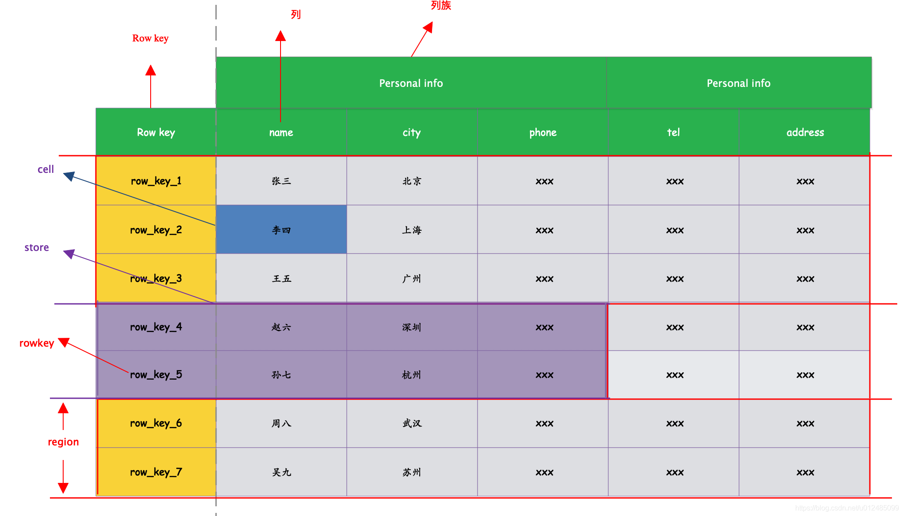
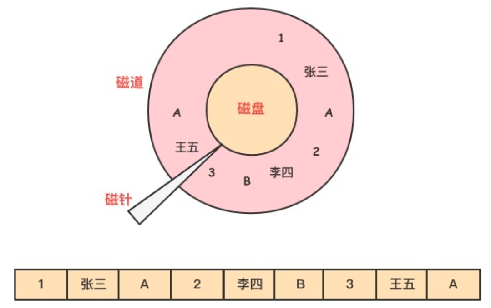
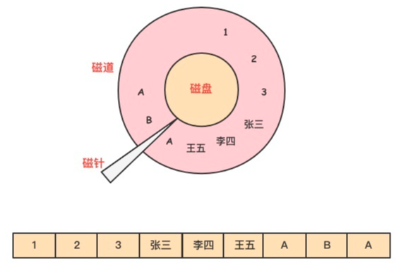
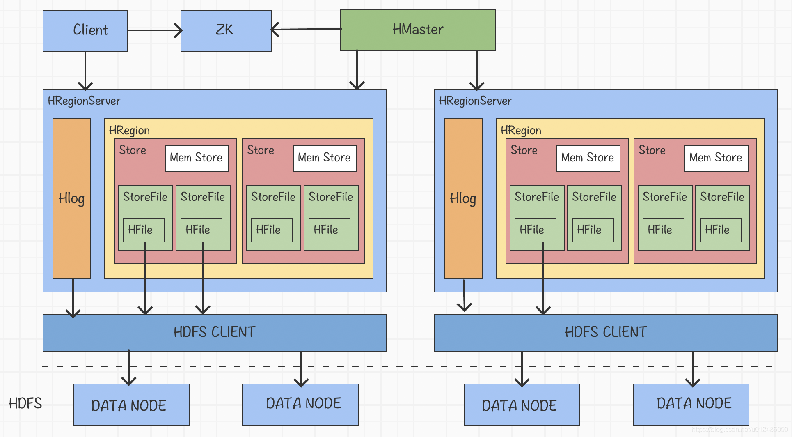

# 1 HBase 是什么

**HBase** 是 **Hadoop Database** 的简称，是一个面向**列族（Column Family）存储**的分布式数据库，其设计思想来源于 Google 的 BigTable 论文。

HDFS 为 HBase 提供可靠的底层数据存储服务，MapReduce 为 HBase 提供高性能的计算能力，ZooKeeper 为 HBase 提供稳定服务和 Failover 机制。HBase 良好的分布式架构设计为海量数据的快速存储、随机访问提供了可能，基于数据副本机制和分区机制可以轻松实现在线扩容、缩容和数据容灾，是大数据领域中 Key-Value 数据结构存储最常用的数据库方案。

HBase 具有以下特点：

* **易扩展**：HBase 的扩展性主要体现在两个方面，一个是基于运算能力（RegionServer）的扩展，通过增加 RegionServer 节点的数量，提升 HBase 上层的处理能力；另一个是基于存储能力的扩展（HDFS），通过增加 DataNode 节点数量对存储层进行扩容，提升 HBase 的数据存储能力。

* **海量存储**：HBase 适合存储 PB 级别的海量数据，在 PB 级别的数据以及采用廉价 PC 存储的情况下，能在几十到上百毫秒内返回数据。这与 HBase 的极易扩展性息息相关。正因为 HBase 良好的扩展性，才为海量数据的存储提供了便利。

* **列族存储**：HBase 是根据列族来组织数据的，同一列族的数据在物理上存放在一起，列族下面可以有非常多的列。这样在查询时只需要读取涉及的列族，就能大大减少读取的数据量。

* **高可靠性**：WAL 机制保证了数据写入时不会因集群异常而导致写入数据丢失，Replication 机制保证了在集群出现严重的问题时，数据不会发生丢失或损坏。而且 HBase 底层使用 HDFS，HDFS 本身也有备份。

* **稀疏性**：在 HBase 的列族中，可以指定任意多的列，为空的列不占用存储空间，表可以设计得非常稀疏。

# 2 数据模型

逻辑上，HBase 的数据模型同关系型数据库很类似，数据存储在一张表中，有行有列。


在 HBase 表中，一条数据拥有一个全局唯一的键（RowKey）和任意数量的列（Column），一列或多列组成一个列族（Column Family），同一个列族中列的数据在物理上都存储在同一个 HFile 中，这样基于列族的数据结构有利于数据缓存和查询。HBase 中的表是稀疏地存储的，因此用户可以动态地为数据定义各种不同的列。HBase 中的数据按主键排序，同时，HBase 会将表按主键划分为多个 Region 存储在不同 RegionServer 上，以完成数据的分布式存储和读取。

但从底层物理存储结构（K-V）来看，HBase 更像是一个多维 map。


## 2.1 Namespace

命名空间，类似于关系型数据库的 Database 概念，每个命名空间下有多个表。HBase 有两个自带的命名空间，分别是“hbase” 和 “default”，“hbase” 中存放的是 HBase 内置的表，“default” 是用户默认使用的命名空间。

## 2.2 Region

HBase 将表中的数据基于 RowKey 的不同范围划分到不同 Region 上，每个 Region 都负责一定范围的数据存储和访问。

每个表一开始只有一个 Region，随着数据不断插入表，Region 不断增大，当增大到一个阈值的时候，Region 就会等分成两个新的 Region。当表中的行不断增多，就会有越来越多的 Region。

另外，**Region 是 HBase 中分布式存储和负载均衡的最小单元**，不同的 Region 可以分布在不同的 RegionServer 上。但一个 Region 是不会拆分到多个 Server 上的。

## 2.3 Row

HBase 表中的每行数据都由一个 RowKey 和多个 Column（列）组成，**数据是按照 RowKey 的字典顺序存储的**，并且**查询数据时主要依赖 RowKey 进行高效检索**（HBase 原生只有 RowKey 索引，其他字段查询要么全表扫描并配合 Filter 过滤，要么借助 Phoenix 等二级索引方案），所以 RowKey 的设计十分重要。

## 2.4 Column

HBase 中的每个列都是由 **Column Family**（列族）和 **Column Qualifier**（列限定符）进行限定，例如：`info:name`、`info:age`。建表时，只需声明列族，而列限定符无需预先定义。

## 2.5 Cell

由`{RowKey, Column Family:Column Qualifier, Time Stamp}` 唯一确定的单元。Cell 中的数据是没有类型的，全部以字节数组（byte[]）形式存储。

## 2.6 TimeStamp

TimeStamp 是实现 HBase 多版本的关键。在 HBase 中，使用不同 TimeStamp 来标识相同 RowKey 对应的不同版本的数据。相同 RowKey 的数据按照 TimeStamp 倒序排列。默认查询的是最新的版本，当然用户也可以指定 TimeStamp 的值来读取指定版本的数据。

# 3 列式存储与行式存储

列式存储并不是一项新技术，最早可以追溯到 20 世纪 80 年代的学术研究。然而，受限于早期的硬件条件和应用场景，传统的事务型数据库（OLTP）如 Oracle、MySQL 等关系型数据库都是以行的方式来存储数据的。

近年来，随着分析型数据库（OLAP）的兴起，列式存储这一概念又变得流行，ClickHouse 等分析型数据库以及 Parquet、ORC 等存储格式都采用列式存储，而 HBase、Cassandra 等大数据数据库采用的则是列族模型。为什么列式存储会广泛地应用在 OLAP 领域，和行式存储相比，它的优势在哪里呢？

## 3.1 行式存储的原理与特点

对于 OLTP 场景，大多都是对一整行记录进行增删改查操作的，那么行式存储采用以行的方式在磁盘上存储数据就是一个不错的选择。

当基于需求字段查询和返回结果时，由于这些字段都埋藏在各行数据中，就必须读取每一条完整的行记录，大量磁盘转动寻址的操作使得读取效率大大降低。

举个例子，下图为员工信息emp表。


数据是以行的形式存储在磁盘上，同一行的数据紧挨着存放在一起。


对于 emp 表，要查询部门 dept 为 A 的所有员工的名字。

```sql
select name from emp where dept = A
```

由于 dept 的值是离散地存储在磁盘中，在查询过程中，需要磁盘转动多次，才能完成数据的定位和返回结果。


## 3.2 列式存储的原理与特点

对于 OLAP 场景，一个典型的查询需要遍历整个表，进行分组、排序、聚合等操作，这样一来行式存储中把一整行记录存放在一起的优势就不复存在了。而且，分析型 SQL 常常不会用到所有的列，而仅仅对其中某些需要的列做运算，那一行中无关的列也不得不参与扫描。

然而在列式存储中，由于同一列的数据被紧挨着存放在了一起，如下图所示。


那么基于需求字段查询和返回结果时，就不必对每一行数据进行扫描，按照列找到需要的数据，磁盘的转动次数少，性能也会提高。

还是上面例子中的查询，由于在列式存储中 dept 的值是按照顺序存储在磁盘上的，因此磁盘只需要顺序查询和返回结果即可。


列式存储不仅具有按需查询来提高效率的优势，由于同一列的数据属于同一种类型，如数值类型，字符串类型等，相似度很高，还可以选择使用合适的编码压缩可减少数据的存储空间，进而减少IO提高读取性能。

总的来说，行式存储和列式存储没有说谁比谁更优越，只能说谁更适合哪种应用场景。

需要说明的是，HBase 属于列族模型，并非严格意义上的纯列式存储：同一列族的数据在物理上连续存放在同一个 Store 中，但列族内不同列的数据在 HFile 中是按 RowKey 排序交错存放的，并不会像 ClickHouse 等纯列式数据库那样把同一列的所有数据连续存放。列族模型的优势在于稀疏数据的灵活扩展，纯列式存储的优势则在于同类型数据的高压缩比和聚合性能。

# 4 架构



HBase 的核心架构由五部分组成，分别是 HBase Client、HMaster、RegionServer、ZooKeeper 以及 HDFS。它的架构组成如下图所示。

## 4.1 HBase Client

HBase Client 为用户提供了访问 HBase 的接口，可以通过元数据表来定位到目标数据的 RegionServer，另外 HBase Client 还维护了对应的 cache 来加速 HBase 的访问，比如缓存元数据的信息。

## 4.2 HMaster

HMaster 是 HBase 集群的主节点，负责整个集群的管理工作，主要工作职责如下：

* **分配 Region**：负责在启动的时候分配 Region 到具体的 RegionServer；
* **负载均衡**：一方面负责将用户的数据均衡地分布在各个 RegionServer 上，防止 RegionServer 数据倾斜过载。另一方面负责将用户的请求均衡地分布在各个 RegionServer 上，防止 RegionServer 请求过热；
* **维护数据**：发现失效的 Region，并将失效的 Region 分配到正常的 RegionServer 上，并且在 RegionServer 失效的时候，协调对应的 WAL 进行任务的拆分。

## 4.3 RegionServer

RegionServer 直接对接用户的读写请求，是真正干活的节点，主要工作职责如下。

* 管理 HMaster 为其分配的 Region；
* 负责与底层的 HDFS 交互，存储数据到 HDFS；
* 负责 Region 变大以后的拆分以及 StoreFile 的合并工作。

当某个 RegionServer 宕机之后，ZK 会通知 Master 进行失效备援。下线的 RegionServer 所负责的 Region 暂时停止对外提供服务，Master 会将该 RegionServer 所负责的 Region 转移到其他 RegionServer 上，并且会对所下线的 RegionServer 上存在 MemStore 中还未持久化到磁盘中的数据由 WAL 重播进行恢复。

一个 RegionServer 可以包含多个 Region，基本结构如下：

* **Region**：每一个 Region 都有起始 RowKey 和结束 RowKey，代表了存储的 Row 的范围，保存着表中某段连续的数据。一开始每个表都只有一个 Region，随着数据量不断增加，当 Region 大小达到一个阈值（默认 10GB，由参数 `hbase.hregion.max.filesize` 控制）时，Region 就会被 RegionServer 水平切分成两个新的 Region。当 Region 很多时，HMaster 会将 Region 保存到其他 RegionServer 上。
* **Store**：一个 Region 由多个 Store 组成，每个 Store 都对应一个 Column Family，Store 包含 MemStore 和 StoreFile。
    * **MemStore**：作为 HBase 的内存数据存储，数据的写操作会先写到 MemStore 中，当 MemStore 中的数据增长到一个阈值（默认 128MB）后，RegionServer 会启动 flush 进程将 MemStore 中的数据写入 StoreFile 持久化存储，每次写入后都形成一个单独的 StoreFile。当客户端检索数据时，先在 MemStore 中查找，如果 MemStore 中不存在，则会在 StoreFile 中继续查找。
    * **StoreFile**：MemStore 内存中的数据写到文件后就是 StoreFile，StoreFile 底层是以 HFile 的格式保存。HBase 以 Store 的大小来判断是否需要切分 Region。
    * **HFile**：和 StoreFile 是同一个文件，只不过站在 HDFS 的角度称这个文件为 HFile，站在 HBase 的角度就称这个文件为 StoreFile。

* **WAL**：即 Write-Ahead Log（早期版本中称为 HLog），负责记录数据的操作日志，当 HBase 出现故障时可以进行日志重放、故障恢复。例如，磁盘掉电导致 MemStore 中的数据没有持久化存储到 StoreFile，这时就可以通过 WAL 日志重放来恢复数据。

当一个 Region 中所有 StoreFile 的大小和数量都增长到超过一个阈值时，RegionServer 会把当前 Region 分割为两个，并分配到其他 RegionServer 上，实现负载均衡。

## 4.4 ZooKeeper

HBase 通过 ZooKeeper 来完成选举 HMaster、监控 RegionServer、维护元数据集群配置等工作，主要工作职责如下：

* **选举 HMaster**：生产环境中通常部署多个 HMaster，通过 ZooKeeper 选举保证同一时刻只有一个 Active HMaster 对外提供服务，其余 HMaster 处于 Standby 状态，随时准备接管；
* **监控 RegionServer**：通过 ZooKeeper 来监控 RegionServer 的状态，当 RegionServer 有异常的时候，通过回调的形式通知 HMaster 有关 RegionServer 上下线的信息；
* **维护元数据和集群配置**：通过 ZooKeeper 存储信息并对外提供访问接口。

## 4.5 HDFS

HDFS 为 HBase 提供底层数据存储服务，同时为 HBase 提供高可用的支持，HBase 将 WAL 存储在 HDFS 上，当服务器发生异常宕机时，可以重放 WAL 来恢复数据。

# 5 工作流程

## 5.1 写流程


1. Client 先访问 ZooKeeper，获取 hbase:meta 表位于哪个 RegionServer
2. 访问对应的 RegionServer，获取 hbase:meta 表，根据写请求的 namespace:table/rowkey，查询出目标数据位于哪个 RegionServer 中的哪个 Region 中。并将该表的 Region 信息以及 meta 表的位置信息缓存在客户端的 meta cache 中，方便下次访问
3. 与目标 RegionServer 进行通讯
4. 将数据顺序写入（追加）到 WAL
5. 将数据写入对应的 MemStore，数据会在 MemStore 进行排序
6. 向客户端发送 ack
7. 等达到 MemStore 的刷写时机后，将数据刷写到 HFile

**WAL**（Write-Ahead-Log）预写日志是 HBase 的 RegionServer 在处理数据插入和删除过程中用来记录操作内容的一种日志。每次 Put、Delete 一条记录时，首先将其数据写入到 RegionServer 对应的 WAL 文件中去。

而 WAL 是保存在 HDFS 上的持久化文件，数据到达 Region 时先写入 WAL，然后被加载到 MemStore 中。这样就算 Region 宕机了，操作没来得及执行持久化，也可以在重启的时候从 WAL 加载操作并执行。

那么，从写入流程中可以看出，数据在进入 HFile 之前就已经持久化到 WAL 了，为什么还要先写入 MemStore，再刷写成 HFile 呢？

原因在于：

* HDFS 不支持对已写入的数据进行修改，HFile 中的数据必须按 RowKey 有序存放，才能支持高效的检索；
* WAL 是为保证数据安全而追加写入的，其中的数据是无序的；
* MemStore 在内存中承接写入并将数据按 RowKey 排序，达到阈值后一次性顺序刷写到磁盘。

所以 MemStore 的作用主要有两个：一是**缓冲高频写入、批量刷盘**，把大量随机的磁盘写转化为内存操作加顺序写，提升写入吞吐；二是**维持数据按 RowKey 的字典序排列**，保证刷写生成的 HFile 有序，从而支持高效的读取。

## 5.2 读流程


1. Client 先访问 ZooKeeper，获取 hbase:meta 表位于哪个 RegionServer
2. 访问对应的 RegionServer，获取 hbase:meta 表，根据读请求的 namespace:table/rowkey，查询出目标数据位于哪个 RegionServer 中的哪个 Region 中。并将该表的 Region 信息以及 meta 表的位置信息缓存在客户端的 meta cache 中，方便下次访问
3. 与目标 RegionServer 进行通讯
4. 分别在 Block Cache（读缓存）、MemStore 和 StoreFile（HFile）中查询目标数据，并将查到的所有数据进行合并。此处所有数据是指同一条数据的不同版本（TimeStamp）或者不同的类型（Put/Delete）
5. 将从文件中查询到的数据块（Block，HFile 数据存储单元，默认大小为 64KB，注意区别于 HDFS 的存储 Block，后者默认 128MB）缓存到 Block Cache
6. 将合并后的最终结果返回给客户端

## 5.3 删除流程

HBase 的数据删除操作并不会立即将数据从磁盘上删除，因为 HBase 的数据通常被保存在 HDFS 中，而 HDFS 只允许新增或者追加数据文件，所以删除操作主要对要被删除的数据进行标记。

当执行删除操作时，HBase 会写入一条墓碑标记（Tombstone Marker），即一条 Key 相同但类型为删除的记录。删除标记也分为不同的类型（如 Delete、DeleteColumn、DeleteFamily，分别用于删除特定版本、整个列和整个列族），直到发生 Major Compaction 操作，数据才会真正地被从磁盘上删除。

HBase 这种基于标记删除的方式是按顺序写磁盘的，因此很容易实现海量数据的快速删除，有效避免了在海量数据中查找数据、执行删除及重建索引等复杂的流程。

## 5.4 StoreFile Compaction

由于 MemStore 每次刷写都会生成一个新的 HFile，且同一个字段的不同版本（TimeStamp）和不同类型（Put/Delete）有可能会分布在不同的 HFile 中，因此查询时需要遍历所有的 HFile。为了减少 HFile 的个数，以及清理掉过期和删除的数据，会进行 StoreFile Compaction

Compaction 分为两种，分别是 **Minor Compaction** 和 **Major Compaction**。Minor Compaction 会将临近的若干个较小的 HFile 合并成一个较大的 HFile，但不会清理过期和删除的数据。Major Compaction 会将一个 Store 下的所有的 HFile 合并成一个大 HFile，并且会清理掉过期和删除的数据。

此外，HBase 还提供了 **Stripe Compaction** 和 **Date Tiered Compaction** 等可选的 Compaction 策略（在 1.x 版本中就已引入）：前者把大 Region 划分为多个条带分别做 Compaction，缓解大 Region 做 Major Compaction 时的 IO 压力；后者按时间窗口分层合并，适合时间序列数据。
