# 1、Spark与Hadoop

Hadoop 已经成了大数据技术的事实标准，Hadoop MapReduce 也非常适合于对大规模数据集合进行批处理操作，但是其本身还存在一些缺陷。特别是 MapReduce 存在的延迟过高，无法胜任实时、快速计算需求的问题，使得需要进行多路计算和迭代算法的作业过程十分低效。

根据 Hadoop MapReduce 的工作流程，可以分析出 Hadoop MapRedcue 的一些缺点：

* **表达能力有限**：所有计算都需要转换成 Map 和 Reduce 两个操作，不能适用于所有场景，对于复杂的数据处理过程难以描述。
* **磁盘 I/O 开销大**：Hadoop MapReduce 要求每个步骤间的数据序列化到磁盘，所以 I/O 成本很高，导致交互分析和迭代算法开销很大，而几乎所有的最优化和机器学习都是迭代的。所以，Hadoop MapReduce 不适合于交互分析和机器学习。
* **计算延迟高**：如果想要完成比较复杂的工作，就必须将一系列的 MapReduce 作业串联起来然后顺序执行这些作业。每一个作业都是高时延的，而且只有在前一个作业完成之后下一个作业才能开始启动。因此，Hadoop MapReduce 不能胜任比较复杂的、多阶段的计算服务。

Spark 是加州大学伯克利分校 AMP（Algorithms，Machines，People）实验室开发的通用内存并行计算框架。它借鉴了 Hadoop MapReduce 技术发展而来，继承了其分布式并行计算的优点并改进了 MapReduce 明显的缺陷。

Spark 使用 **Scala** 语言进行实现，它是一种面向对象的函数式编程语言，能够像操作本地集合对象一样轻松地操作分布式数据集。它具有运行速度快、易用性好、通用性强和随处运行等特点，具体优势如下：

* **速度快**：Spark 提供了内存计算，**把中间结果放到内存中**，带来了更高的迭代运算效率。与Hadoop的MapReduce相比，Spark基于内存的运算比MR要快100倍；而基于硬盘的运算也要快10倍。
* **易用**：Spark的基于**RDD**的计算模型，提供广泛的数据集操作类型（20+种），不像Hadoop只提供了Map和Reduce两种操作，在实现各种复杂功能时，比如二次排序、topN等复杂操作时，更加便捷。
* **调度机制更先进**：程序开发者可以使用 **DAG** 开发复杂的多步数据管道，控制中间结果的存储、分区等，Spark 各个处理结点之间的通信模型不再像 Hadoop 一样只有 Shuffle 一种模式。


尽管与 Hadoop 相比 Spark 有较大优势，但是并不能够取代 Hadoop。因为 Spark 是基于内存进行数据处理的，所以不适合于数据量特别大、对实时性要求不高的场合。另外，Hadoop 可以使用廉价的通用服务器来搭建集群，而 Spark 对硬件要求比较高，特别是对内存和 CPU 有更高的要求。

Spark主要用于替代Hadoop中的MapReduce计算模型。存储依然可以使用HDFS，但是中间结果可以存放在内存中。Spark并不是要成为一个大数据领域的“独裁者”，一个人霸占大数据领域所有的“地盘”，而是与Hadoop进行了高度的集成，两者可以完美的配合使用。Hadoop的HDFS、Hive、HBase负责存储，YARN负责资源调度，Spark负责大数据计算。实际上，Hadoop+Spark的组合，是一种双赢的组合。

通过以上分析，可以总结 Spark 的适应场景有以下几种。

* Spark 是基于内存的迭代计算框架，适用于需要多次操作特定数据集的应用场合。需要反复操作的次数越多，所需读取的数据量越大，受益越大；数据量小但是计算密集度较大的场合，受益就相对较小。
* Spark 适用于数据量不是特别大，但是要求实时统计分析的场景。
* 由于 RDD 的特性，Spark 不适用于那种异步细粒度更新状态的应用，例如，Web 服务的存储，或增量的 Web 爬虫和索引，也就是不适合增量修改的应用模型。

从广义上来讲，Spark不单指一套内存计算框架，而是包含了众多大数据处理框架的生态系统，伯克利大学将之称为**伯克利数据分析栈**(BDAS)，在核心框架 Spark 的基础上，主要提供四个范畴的计算框架:
* **Spark SQL**: 提供了类 SQL 的查询,返回 Spark-DataFrame 的数据结构(类似 Hive)
* **Spark Streaming**: 流式计算,主要用于处理线上实时时序数据(类似 storm)
* **MLlib**: 提供机器学习的各种模型和调优
* **GraphX**: 提供基于图的算法,如 PageRank

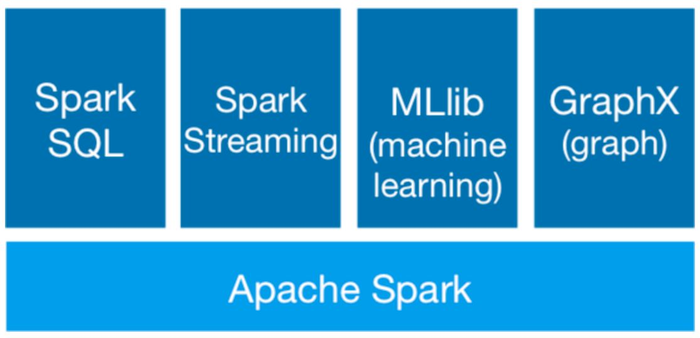


概括来讲，大数据处理场景有以下几个类型：

* **复杂的批量处理**
偏重点是处理海量数据的能力，对处理速度可忍受，通常的时间可能是在数十分钟到数小时。

* **基于历史数据的交互式查询**
通常的时间在数十秒到数十分钟之间。

* **基于实时数据流的数据处理**
通常在数百毫秒到数秒之间。

目前对以上三种场景需求都有比较成熟的处理框架：
* 用 Hadoop 的 MapReduce 技术来进行批量海量数据处理。
* 用 Impala 进行交互式查询。
* 用 Storm/Flink分布式处理框架处理实时流式数据

以上三者都是比较独立的，所以维护成本比较高，而 Spark 生态圈能够一站式满足以上需求。

# 2、RDD

## 2.1 RDD 基本概念

**RDD**（Resiliennt Distributed Datasets，弹性分布式数据集） 是 Spark 提供的最重要的抽象概念，它是一种有容错机制的特殊数据集合，可以分布在集群的结点上，以函数式操作集合的方式进行各种并行操作。

通俗点来讲，可以将 RDD 理解为一个分布式对象集合，本质上是一个只读的分区记录集合。每个 RDD 可以分成多个分区，每个分区就是一个数据集片段。一个 RDD 的不同分区可以保存到集群中的不同结点上，从而可以在集群中的不同结点上进行并行计算。

下图展示了 RDD 的分区及分区与工作结点的分布关系：
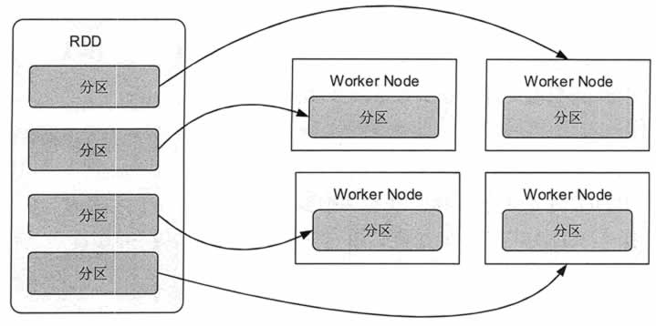

RDD 具有容错机制，并且只读不能修改，可以执行确定的转换操作创建新的 RDD。具体来讲，RDD 具有以下几个属性：

* **只读**：不能修改，只能通过转换操作生成新的 RDD。
* **分布式**：可以分布在多台机器上进行并行处理。
* **弹性**：计算过程中内存不够时它会和磁盘进行数据交换。
* **基于内存**：可以全部或部分缓存在内存中，在多次计算间重用。

RDD 实质上是一种更为通用的迭代并行计算框架，用户可以显示控制计算的中间结果，然后将其自由运用于之后的计算。

在大数据实际应用开发中存在许多迭代算法，如机器学习、图算法等，和交互式数据挖掘工具。这些应用场景的共同之处是在不同计算阶段之间会重用中间结果，即一个阶段的输出结果会作为下一个阶段的输入。

RDD 正是为了满足这种需求而设计的。虽然 MapReduce 具有自动容错、负载平衡和可拓展性的优点，但是其最大的缺点是采用非循环式的数据流模型，使得在迭代计算时要进行大量的磁盘 I/O 操作。

通过使用 RDD，用户不必担心底层数据的分布式特性，只需要将具体的应用逻辑表达为一系列转换处理，就可以实现管道化，从而避免了中间结果的存储，大大降低了数据复制、磁盘 I/O 和数据序列化的开销。


## 2.2 RDD 基本操作

RDD支持两种操作：

* **Transformation**：转化操作，返回值还是RDD。如`map()`,`filter()`等。这种操作是**惰性的**，即从一个RDD转换生成另一个RDD的操作不是马上执行，只是记录下来，只有等到有Action操作是才会真正启动计算，将生成的新RDD写到内存或hdfs里，不会对原有的RDD的值进行改变；
  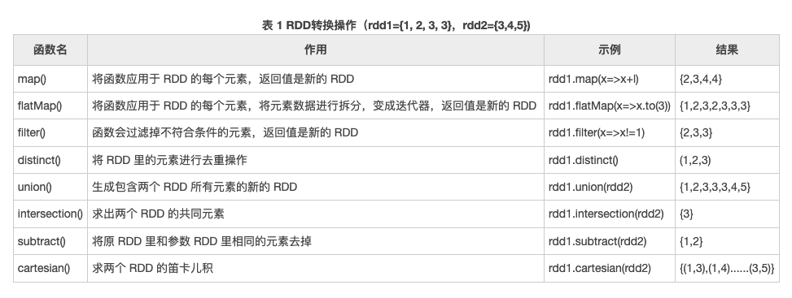

* **Action**：行动操作，返回值不是RDD。会实际触发Spark计算，对RDD计算出一个结果，并把结果返回到内存或hdfs中，如`count()`,`first()`等。
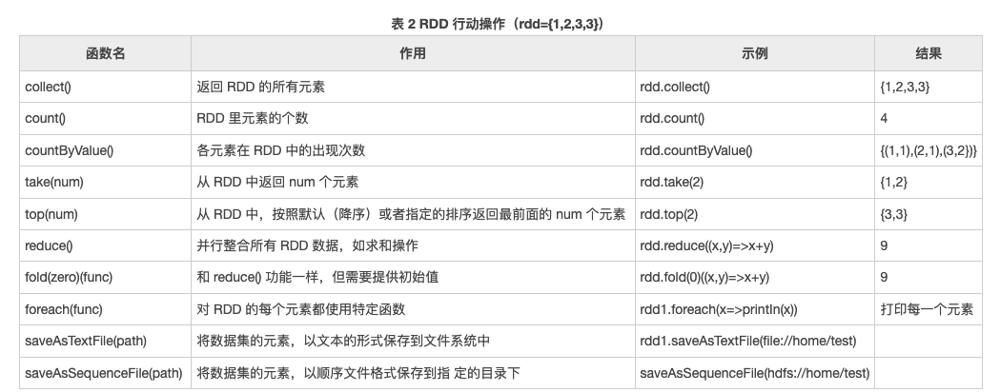


Transformation 操作不是马上提交 Spark 集群执行的，需要等到有 Action 操作的时候才会真正启动计算过程进行计算。针对每个 Action，Spark 会生成一个 Job, 从数据的创建开始，经过 Transformation，结尾是 Action 操作。这些操作对应形成一个**有向无环图**(DAG)，**形成 DAG 的先决条件是最后的函数操作是一个Action**。

如下例子：
```scala
val arr = Array("cat", "dog", "lion", "monkey", "mouse")
// create RDD by collection
val rdd = sc.parallize(arr)    
// Map: "cat" -> c, cat
val rdd1 = rdd.Map(x => (x.charAt(0), x))
// groupby same key and count
val rdd2 = rdd1.groupBy(x => x._1).
                Map(x => (x._1, x._2.toList.length))
val result = rdd2.collect()             
print(result)
// output:Array((d,1), (l,1), (m,2))

```
首先，前几行代码实际上并不会立即执行函数，而是当到了`val result = rdd2.collect()`的时候, Spark 才会开始计算，从 `sc.parallize(arr)` 到最后的 `collect`，形成一个 Job。

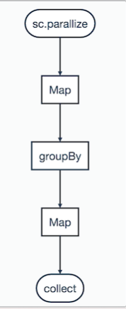

## 2.3 RDD 依赖关系

RDD 的最重要的特性之一就是**血缘关系**（Lineage )，它描述了一个 RDD 是如何从父 RDD 计算得来的。如果某个 RDD 丢失了，则可以根据血缘关系，从父 RDD 计算得来。

下图给出了一个 RDD 执行过程的实例。系统从输入中逻辑上生成了 A 和 C 两个 RDD， 经过一系列转换操作，逻辑上生成了 F 这个 RDD。
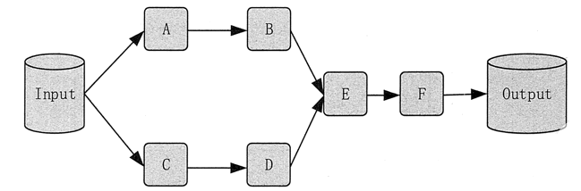

Spark 记录了 RDD 之间的生成和依赖关系。当 F 进行行动操作时，Spark 才会根据 RDD 的依赖关系生成 DAG，并从起点开始真正的计算。

根据不同的转换操作，RDD 血缘关系的依赖分为**窄依赖**（narrow dependency）和**宽依赖**（wide dependency）。

**窄依赖是指父RDD的每一个分区最多被一个子RDD的分区使用**。窄依赖的表现一般分为两类，第一类表现为一个父RDD的分区对应于一个子RDD的分区；第二类表现为多个父RDD的分区对应于一个子RDD的分区。也就是说，一个父RDD的一个分区不可能对应一个子RDD的多个分区。为了便于理解，我们通常把窄依赖形象的比喻为独生子女。当RDD执行map、filter及union和join操作时，都会产生窄依赖，如下图所示。
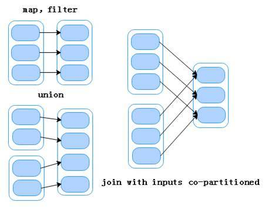

**宽依赖是指子RDD的每一个分区都会使用所有父RDD的所有分区或多个分区**。为了便于理解，我们通常把宽依赖形象的比喻为超生。当RDD做groupByKey和join操作时，会产生宽依赖，如下图所示。

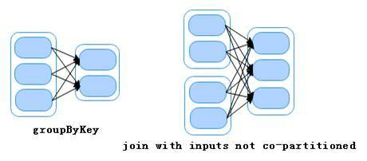

从图中可以看出，父RDD做groupByKey和join（输入未协同划分）算子操作时，子RDD的每一个分区都会依赖于所有父RDD的所有分区。当子RDD做算子操作，因为某个分区操作失败导致数据丢失时，则需要重新对父RDD中的所有分区进行算子操作才能恢复数据。

需要注意的是，join算子操作既可以属于窄依赖，也可以属于宽依赖。当join算子操作后，分区数量没有变化则为窄依赖（如join with inputs co-partitioned，输入协同划分）；当join算子操作后，分区数量发生变化则为宽依赖（如join with inputs not co-partitioned，输入非协同划分）。

相对而言，窄依赖的失败恢复更为高效，它只需要根据父 RDD 分区重新计算丢失的分区即可，而不需要重新计算父 RDD 的所有分区。而对于宽依赖来讲，单个结点失效，即使只是 RDD 的一个分区失效，也需要重新计算父 RDD 的所有分区，开销较大。

**窄依赖跟宽依赖的区别是是否发生 shuffle(洗牌) 操作**。宽依赖会发生 shuffle 操作，窄依赖是子 RDD的各个分片不依赖于其他分片，能够独立计算得到结果。

## 2.4 DAG 阶段划分

用户提交的计算任务是一个由 RDD 构成的 DAG，如果 RDD 的转换是宽依赖，那么这个宽依赖转换就将这个 DAG 分为了不同的**阶段**（Stage)。由于宽依赖会带来“洗牌”，所以不同的 Stage 是不能并行计算的，后面 Stage 的 RDD 的计算需要等待前面 Stage 的 RDD 的所有分区全部计算完毕以后才能进行。

这点就类似于在 MapReduce 中，Reduce 阶段的计算必须等待所有 Map 任务完成后才能开始一样。

在对 Job 中的所有操作划分 Stage 时，一般会按照倒序进行，即从 Action 开始，遇到窄依赖操作，则划分到同一个执行阶段，遇到宽依赖操作，则划分一个新的执行阶段。后面的 Stage 需要等待所有的前面的 Stage 执行完之后才可以执行，这样 Stage 之间根据依赖关系就构成了一个大粒度的 DAG。

假设从 HDFS 中读入数据生成 3 个不同的 RDD，通过一系列转换操作后得到新的 RDD，并把结果保存到 HDFS 中。
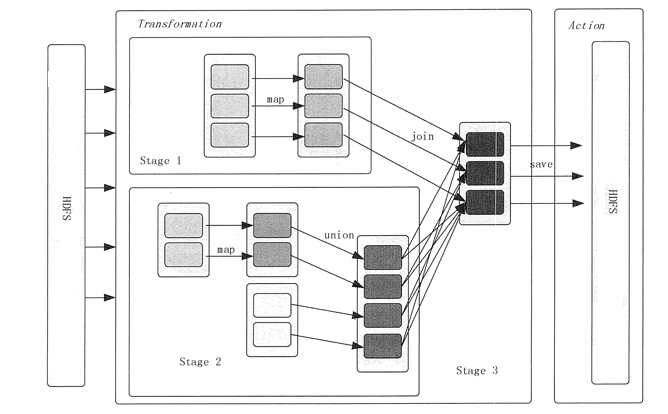

可以看到这幅 DAG 中只有 join 操作是一个宽依赖，Spark 会以此为边界将其前后划分成不同的阶段。同时可以注意到，在 Stage2 中，从 map 到 union 都是窄依赖，这两步操作可以形成一个流水线操作，通过 map 操作生成的分区可以不用等待整个 RDD 计算结束，而是继续进行 union 操作，这样大大提高了计算的效率。

把一个 DAG 图划分成多个 Stage 以后，每个 Stage 都代表了一组由关联的、相互之间没有宽依赖关系的任务组成的任务集合。在运行的时候，Spark 会把每个任务集合提交给任务调度器进行处理。


# 3、架构原理

## 3.1 架构

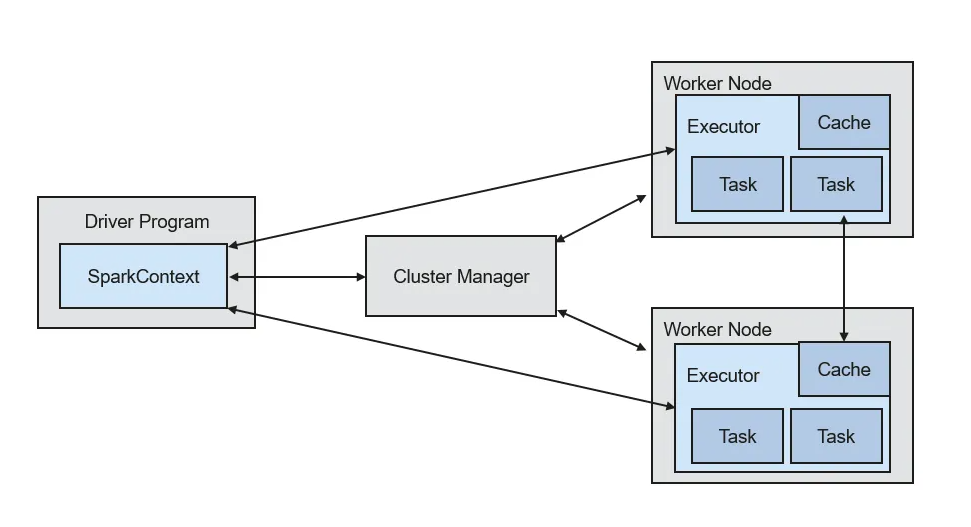

* **Driver**：是运行 Spark Applicaion 的 main() 函数，它会创建 SparkContext。SparkContext 负责和 Cluster Manager 通信，进行资源申请、任务分配和监控等。
* **Cluster Manager**：负责申请和管理在 Worker Node 上运行应用所需的资源，目前包括 Spark 原生的 Cluster Manager、Mesos Cluster Manager 和 Hadoop YARN Cluster Manager。
* **Executor**：是 Application 运行在 Worker Node 上的一个进程，负责运行 Task（任务），并且负责将数据存在内存或者磁盘上，每个 Application 都有各自独立的一批 Executor。每个 Executor 则包含了一定数量的资源来运行分配给它的任务。

每个 Worker Node 上的 Executor 服务于不同的 Application，它们之间是不可以共享数据的。与 MapReduce 计算框架相比，Spark 采用的 Executor 具有两大优势：

* Executor 利用多线程来执行具体任务，相比 MapReduce 的进程模型，使用的资源和启动开销要小很多。
* Executor 中有一个 BlockManager 存储模块，会将内存和磁盘共同作为存储设备，当需要多轮迭代计算的时候，可以将中间结果存储到这个存储模块里，供下次需要时直接使用，而不需要从磁盘中读取，从而有效减少 I/O 开销，在交互式查询场景下，可以预先将数据缓存到 BlockManager 存储模块上，从而提高读写 I/O 性能。

## 3.2 运行流程

Spark 运行基本流程如上图所示，具体步骤如下。

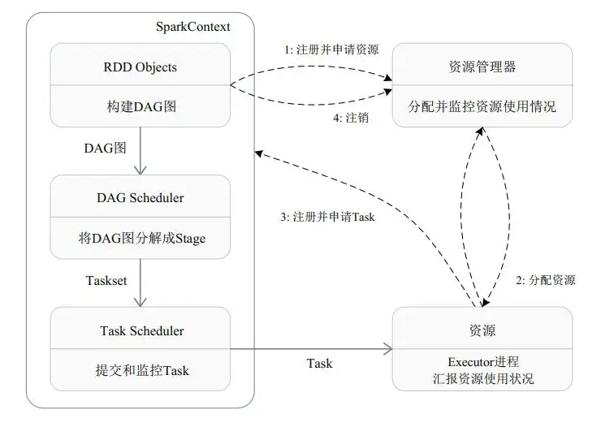

1. 构建 Spark Application 的运行环境（启动 SparkContext），SparkContext 向 Cluster Manager 注册，并申请运行 Executor 资源。

2. Cluster Manager 为 Executor 分配资源并启动 Executor 进程，Executor 运行情况将随着“心跳”发送到 Cluster Manager 上。

3. SparkContext 构建 DAG 图，将 DAG 图分解成多个 Stage，并把每个 Stage 的 TaskSet（任务集）发送给 Task Scheduler (任务调度器）。Executor 向 SparkContext 申请 Task, Task Scheduler 将 Task 发放给 Executor,同时，SparkContext 将应用程序代码发放给 Executor。

4. Task 在 Executor 上运行，把执行结果反馈给 Task Scheduler，然后再反馈给 DAG Scheduler。运行完毕后写入数据，SparkContext 向 ClusterManager 注销并释放所有资源。

DAG Scheduler 决定运行 Task 的理想位置，并把这些信息传递给下层的 Task Scheduler。

DAG Scheduler 把一个 Spark 作业转换成 Stage 的 DAG，根据 RDD 和 Stage 之间的关系找出开销最小的调度方法，然后把 Stage 以 TaskSet 的形式提交给 Task Scheduler。此外，DAG Scheduler 还处理由于 Shuffle 数据丢失导致的失败，这有可能需要重新提交运行之前的 Stage。

Task Scheduler 维护所有 TaskSet，当 Executor 向 Driver 发送“心跳”时，Task Scheduler 会根据其资源剩余情况分配相应的 Task。另外，Task Scheduler 还维护着所有 Task 的运行状态，重试失败的 Task。


总体而言，Spark 运行机制具有以下几个特点。

* 每个 Application 拥有专属的 Executor 进程，该进程在 Application 运行期间一直驻留，并以多线程方式运行任务。
  这种 Application 隔离机制具有天然优势，无论是在调度方面（每个 Driver 调度它自己的任务），还是在运行方面（来自不同 Application 的 Task 运行在不同的 JVM 中）。
  同时，Executor 进程以多线程的方式运行任务，减少了多进程频繁的启动开销，使得任务执行非常高效可靠。当然，这也意味着 Spark Application 不能跨应用程序共享数据，除非将数据写入到外部存储系统。

* Spark 与 Cluster Manager 无关，只要能够获取 Executor 进程，并能保持相互通信即可。

* 提交 SparkContext 的 JobClient 应该靠近 Worker Node，最好是在同一个机架里，因为在 Spark Application 运行过程中，SparkContext 和 Executor 之间有大量的信息交换。

* Task 采用了数据本地性和推测执行的优化机制。数据本地性是指尽量将计算移到数据所在的结点上进行，移动计算比移动数据的网络开销要小得多。同时，Spark 采用了延时调度机制，可以在更大程度上优化执行过程。

* Executor 上的 BlockManager（存储模块），可以把内存和磁盘共同作为存储设备。在处理迭代计算任务时，不需要把中间结果写入分布式文件系统，而是直接存放在该存储系统上，后续的迭代可以直接读取中间结果，避免了读写磁盘。在交互式查询情况下，也可以把相关数据提前缓存到该存储系统上，以提高查询性能。


