# 1 流计算的基本概念

## 1.1 批处理与流处理

在大数据处理领域，批处理与流处理曾被视为两类不同的任务，早期框架往往侧重其中一种。Storm 主要面向流处理，MapReduce 主要面向批处理；Spark 则同时提供批处理与流式处理能力，例如 Structured Streaming。

通过灵活的执行引擎，**Flink 能够同时支持批处理任务与流处理任务**。在执行引擎层面，两类任务的重要差异之一是节点之间的数据传输与缓冲方式。

如下图所示，典型的逐记录流式处理会在记录处理后尽快将其传递给下游节点；批处理则更倾向于积累一批数据后再传输，以降低传输开销。

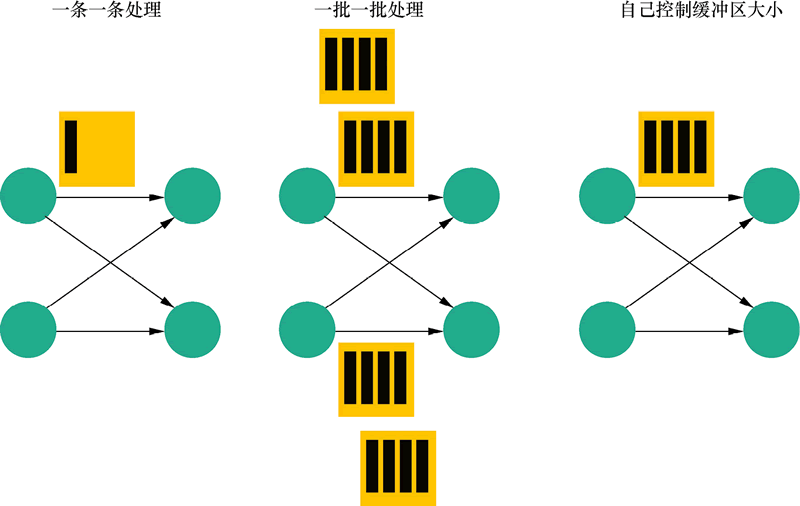

这两种传输方式分别侧重较低延迟与较高吞吐。Flink 以固定网络缓冲区传输数据，并允许通过缓冲超时配置控制缓冲区的发送时机，从而在延迟与吞吐量之间权衡。

- 当缓冲超时设置得很小（例如 0）时，数据会更快发送，网络批处理等待时间更短，但吞吐量可能下降。
- 当缓冲区主要在填满后才发送时，批处理效果更明显，通常有利于吞吐量，但会增加等待时间。

具体可用配置值随 Flink 版本而变化。实际调优时，应结合端到端延迟、网络开销和吞吐目标选择合适的缓冲超时，而不应只追求某一个极端值。

## 1.2 有界流与无界流

Spark Structured Streaming 常以微批方式处理流式数据；而 Flink 采用统一的流模型，将离线数据视为有边界的流，将实时数据视为无边界的流，即**有界流**和**无界流**。

* **无界数据流**：有开始但没有结束，数据会持续产生，因此必须在事件（event）到达后持续处理。由于输入不会完成，处理无界流通常需要结合事件发生顺序或时间语义判断结果的完整性。
* **有界数据流**：有明确定义的开始和结束，可在执行计算前获取完整输入。

统一的流模型使有界与无界数据可以采用相近的抽象和 API 进行处理；是否获得低延迟仍取决于执行模式、算子逻辑、状态规模和运行配置。

## 1.3 有状态与无状态

在流计算中，**状态**（State）是一个较宽泛的概念。在此我们首先给出明确的定义：

> 状态（State）即计算过程中保留的中间信息（Intermediate Information）

从数据的角度看，流计算的处理方法主要有以下两种：

* **无状态**（Stateless）：每一条进入的记录都独立于其他记录，不同记录之间没有关联，可以被独立处理和持久化。例如：`map`、`filter`、静态数据 `join` 等操作。

* **有状态**（Stateful）：处理进入的记录依赖于之前记录处理的结果。因此，我们需要维护不同数据处理之间的中间信息。每一个进入的记录都可以读取和更新该信息。我们把这个中间信息称作状态（State）。例如：独立键的聚合计数、去重等等。

除业务计算产生的中间状态外，流处理系统还需要维护运行与恢复所需的元数据，例如 Source 的读取位置、Checkpoint 和 Savepoint 等。这些信息与业务状态共同构成高可靠流处理的基础。

业务状态来自截至当前已处理的数据，需要在记录之间维护，因此只在 Stateful 模式下存在。

维护流式计算的中间信息不仅是为了完成计算，也是为了在故障后恢复一致的执行状态。

故障可能由机器、网络、软件或服务异常重启等原因引起，并会导致任务执行失败。为此，流计算系统需要周期性地持久化状态快照，即 Checkpoint；当系统发生异常后，可从最近的持久化快照恢复执行，从而保障计算结果的正确性。

## 1.4 状态一致性

有状态流处理中的每个算子任务都可以维护自己的状态。状态一致性关注的是：发生故障并恢复后，状态和计算结果是否仍符合预期。

* **At-Most-Once（最多一次）**：故障后不恢复丢失的状态或数据，因此每个事件最多处理一次，也可能丢失。
* **At-Least-Once（至少一次）**：确保事件不会丢失，但故障恢复后某些事件可能被重复处理。
* **Exactly-Once（精确一次）**：在 Flink 的内部状态中，每条已处理的数据对状态的更新恰好生效一次，是最严格的状态一致性保障。

三种语义的保障程度依次增强。Exactly-Once 能保证 Flink 内部状态的一致性；端到端结果是否精确一次，还取决于 Source 和 Sink 是否支持重放、事务、幂等写入或去重。

**Flink 的分布式异步快照机制支持 Exactly-Once 状态一致性，也提供 At-Least-Once 语义**，使用户能够在结果完整性与处理延迟之间进行选择。

# 2 从 Storm 到 Flink

从流计算的发展史来看，常见的开源流处理框架经历了从 Storm、Spark Streaming 到 Flink 的演进。它们的发展背景、API 与适用场景不同，以下比较应结合具体版本和部署配置理解。

## 2.1 Storm

Storm 是较早成熟的流式计算框架，适合低延迟的事件处理。其 Core API 侧重轻量级拓扑；复杂的状态、窗口与事务语义通常需要结合 Trident 或外部系统实现。阿里巴巴曾推出 JStorm，对 Storm 的工程化实践作了扩展。

**优点：**

* 延迟低，适合简单的事件驱动流处理。
* 架构成熟，可用于高吞吐拓扑。

**局限：**

* Storm Core 的状态管理与事件时间、窗口等高级语义相对有限，复杂场景常需额外组件。
* 投递语义取决于拓扑和配置；At-Least-Once 是常见选择，可能产生重复数据。

## 2.2 Spark Streaming

传统 Spark Streaming（DStream）以微批方式处理数据流，但在 2026 年的 Spark 生态中，该 API 已被视为遗留（Legacy）接口，仅推荐 Structured Streaming 作为流处理方案。Structured Streaming 默认采用微批执行，并提供事件时间、水位线与 Checkpoint 等能力；实际延迟和吞吐量取决于触发间隔、状态规模及资源配置。

微批模型可以复用批处理引擎的执行与容错能力，但批次等待时间会影响端到端延迟。因此，应根据延迟目标、状态计算和运维环境选择具体 API，而不宜将其简单归类为“不能处理低延迟”的框架。

**优点：**

* 与 Spark 批处理生态集成紧密，适合高吞吐的数据处理。
* Structured Streaming 提供较高级的声明式 API、事件时间和水位线支持。
* 通过 Checkpoint 及受支持的 Source、Sink，可实现相应的一致性语义。

**局限：**

* 默认微批模式的低延迟能力受批次间隔影响。
* 高级状态和端到端一致性仍需结合具体 Source、Sink 与参数进行调优。

## 2.3 Flink

Flink 的前身就是柏林理工大学的一个研究性项目，在 2014 年这个项目被 Apache 孵化器所接受后，Flink 迅速成为 ASF（Apache Software Foundation）的顶级项目之一，是流式计算领域冉冉升起的一颗新星。

Flink 主要由 Java 实现，同时支持实时流处理和批处理。Flink 将批数据视为有界流，因此可在统一的数据流模型下处理两类任务。

Flink 提供状态管理、事件时间、水位线、Checkpoint 和资源调度等能力。其吞吐量、延迟和运维成本会受作业拓扑、状态规模、硬件与参数配置影响。

**特点：**

* 支持事件时间处理、水位线和有状态流计算。
* 支持低延迟与高吞吐的流式数据处理。
* 提供 Exactly-Once 状态一致性，并可通过支持的连接器实现端到端一致性语义。

**注意：**

* 社区生态、连接器和运维经验应结合具体版本与团队技术栈评估。
* 高级状态和一致性能力需要合理配置 Checkpoint、状态后端和 Sink。

## 2.4 性能对比

为直观比较三类框架，以下引入两份历史测试报告。测试结论受框架版本、作业拓扑、硬件和参数配置影响，只适合作为当时条件下的参考。

第一份测试来自 Yahoo 的 Storm 团队，是较早基于真实应用程序的流处理基准之一。

该应用程序从 Kafka 消费广告曝光消息，再从 Redis 查询广告对应的宣传活动，并按活动分组，以 10 秒窗口计算广告浏览量。窗口最终结果写入 Redis，窗口状态也会按秒写入，以支持实时查询。

在该基准的早期测评中，为了与 Storm Core 的无状态拓扑进行对比，Flink 作业也以无状态模式编写，状态统一存储在 Redis 中。

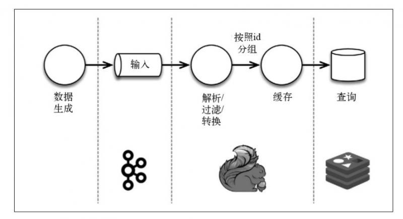

在该测试配置下，Spark Streaming 的批次规模会影响吞吐量与延迟：批次增大通常有利于吞吐量，但可能增加延迟；缩小批次则可能降低吞吐量。Storm 和 Flink 在该拓扑中表现出较低的延迟。

这说明不同执行模型在该历史基准下存在取舍，不能据此直接给出当前版本框架的绝对排名。

第二份报告来自美团大数据团队，对 Storm 与 Flink 在特定作业和环境中的表现进行了比较。

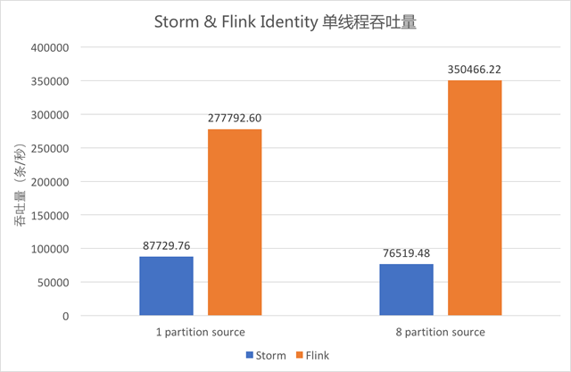

* 上图中蓝色柱形为单线程 Storm 作业的吞吐，橙色柱形为单线程 Flink 作业的吞吐。
* Identity 逻辑下，Storm 单线程吞吐为 8.7 万条/秒，Flink 单线程吞吐可达 35 万条/秒。
* 当 Kafka Data 的 Partition 数为 1 时，Flink 的吞吐约为 Storm 的 3.2 倍；当其 Partition 数为 8 时，Flink 的吞吐约为 Storm 的 4.6 倍。

在该测试环境中，**Flink 的吞吐量约为 Storm 的 3–5 倍**。

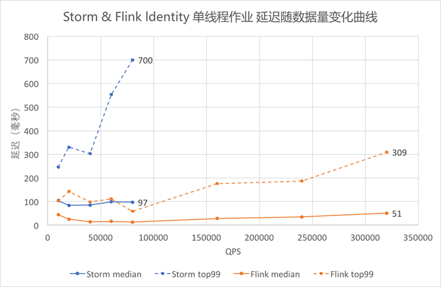

* 本测试以 `outTime - eventTime` 作为延迟指标，蓝色折线代表 Storm，橙色折线代表 Flink；虚线为 P99，实线为中位数。
* 随着数据量增大，Identity 作业的延迟上升；图中 Storm 的上升速度快于 Flink。
* 当 QPS 超过 80,000 时，测试数据超过 Storm 单线程的吞吐能力，因此图中仅保留 Flink 曲线。

在该图最右端的测试点，Storm 的延迟中位数约为 100 毫秒、P99 约为 700 毫秒；Flink 的中位数约为 50 毫秒、P99 约为 300 毫秒。**在这一特定测试条件下，Flink 满吞吐时的延迟约为 Storm 的一半。**

**注意**：以上两份报告均来自较早时期的测试，不代表框架当前版本或其他生产环境的水平。

## 2.5 总结

Storm、Spark Streaming 与 Flink 代表了流处理框架的不同演进路径。Storm 适合低延迟的事件处理；Spark Streaming 及 Structured Streaming 复用了 Spark 的批处理生态和微批执行能力；Flink 则围绕统一流模型、状态管理和事件时间提供了完整的流处理能力。

没有任何框架能在所有场景中同时获得最低延迟、最高吞吐和最低运维成本。选择时应结合延迟目标、状态规模、数据源与 Sink 的一致性能力、团队技术栈及运维经验综合评估。

用一句话概括三者的历史定位：

* **Storm**：流式计算的早期拓荒者。
* **Spark Streaming**：基于微批模型的重要探索者。
* **Flink**：统一流模型和有状态流处理的重要实践者。

# 3 Flink 的体系架构

Flink 的集群架构如下图所示。用户在客户端提交作业（Job），由集群中的 JobManager 和 TaskManager 协同完成调度与执行。具体组件组合会随部署模式而变化。

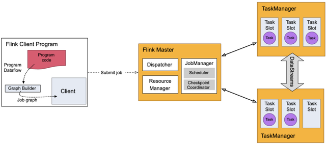

## 3.1 JobManager

- JobManager 是协调 Flink 作业执行的控制进程。一个应用通常由一个 JobManager 控制。
- 它接收待执行应用的作业图、用户代码及其依赖资源，并将 JobGraph 转换为可部署的执行图（ExecutionGraph）。
- JobManager 向 ResourceManager 申请执行所需的 Slot，并将子任务部署到 TaskManager。
- 它还负责需要集中协调的操作，例如 Checkpoint 的触发与确认。

## 3.2 TaskManager

- TaskManager 是实际执行 Flink 子任务的工作进程。一个 TaskManager 包含多个 Slot，Slot 数量限制了该进程可并发执行的子任务数量。
- 启动后，TaskManager 会向 ResourceManager 注册可用 Slot；获得分配后，JobManager 将子任务调度到这些 Slot 中运行。
- 同一作业的 TaskManager 可通过网络交换中间数据。

## 3.3 ResourceManager

- ResourceManager 负责管理和分配 TaskManager 提供的 Slot。
- 它可对接不同的资源提供平台或部署环境，例如 YARN、Kubernetes 和 Standalone 集群。
- 当 JobManager 请求资源时，ResourceManager 会分配可用 Slot；若部署模式支持，也可向底层资源平台请求启动新的 TaskManager。

## 3.4 Dispatcher

- Dispatcher 提供应用提交的 REST 接口，并可管理多个作业的提交。
- 收到应用后，Dispatcher 会启动或委派相应的 JobManager 来执行作业。
- Dispatcher 通常还提供 Web UI，用于提交、查看和监控作业。
- 是否需要独立的 Dispatcher，取决于具体的部署与提交方式。

至此，可以画出 Flink 作业的提交流程：

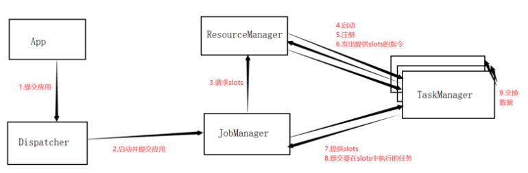

# 4 Flink 的数据模型

Flink 将数据处理抽象为以下三步：

1. 从一个或多个数据源（如 HDFS、Kafka）读取数据。
2. 执行所需的转换算子（Transformation Operators）。
3. 将处理结果写入一个或多个数据汇（Sink）。

如下图所示，Flink 数据流中的算子可分为三类：

1. Source：负责读取输入数据。
2. Transformation：负责数据转换与计算。
3. Sink：负责输出计算结果。

Source 和 Sink 分别负责输入与输出。常见的 Transformation 包括 `map`、`flatMap`、`reduce` 和 `process` 等；`keyBy` 会按 Key 对数据重新分区，类似于按分组键聚合前的数据分组；窗口算子则将持续到达的数据按时间或数量划分为可计算的范围。

Flink 的程序天然支持并行和分布式执行：一个 Stream 可划分为多个 Stream Partition；一个 Operator 可按其并行度拆分为多个并行的 Operator Subtask。算子的并行度等于其 Subtask 数量，生成数据流的算子并行度决定该数据流的分区数。下图展示了并行数据流：

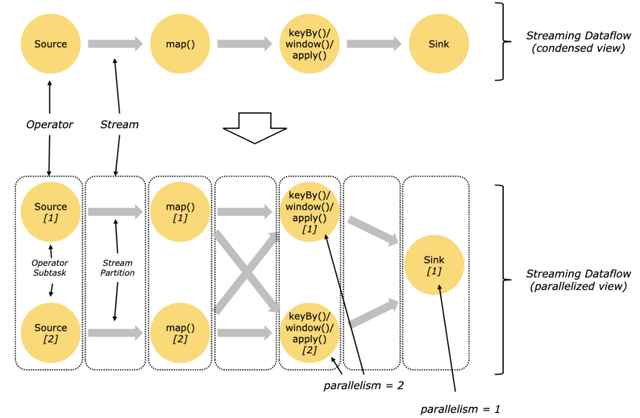

两个算子之间常见的数据交换方式如下：

- **一对一（One-to-one）**：例如 `Source[1]` 到 `map()[1]`。下游子任务接收来自对应上游子任务的数据，保留分区特性和分区内的记录顺序。
- **重新分区（Redistribution）**：例如 `keyBy` 后，数据会按 Key 路由到下游的不同子任务，从而改变数据流的分区方式。

图中 Source Operator 有 2 个 Subtask，因此并行度为 2；Sink Operator 只有 1 个 Subtask，因此并行度为 1。

一个 **Job** 是可独立提交给 Flink 执行的作业。用户程序可通过一次或多次执行调用提交 Job。Flink 会将用户定义的数据流逐步转换为可运行的执行图，如下图所示：

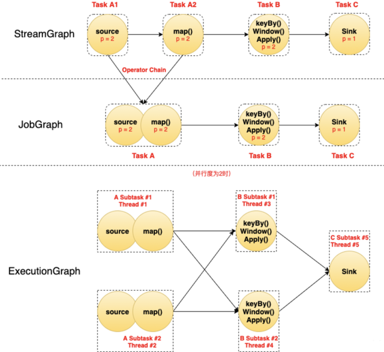

- 图中的圆表示 **Operator**（算子）；虚线圆角框表示经算子链优化后形成的 **Task**；虚线直角框表示并行执行的 **Subtask**；`p` 表示算子的并行度。
- 原始的 StreamGraph 包含多个 Operator。经过算子链优化后，部分满足条件（如并行度相同、数据一对一传输）的相邻算子会组合为一个 JobVertex（图中的 Task），以减少线程切换和序列化开销。
- 在执行图中，一个 Task 会按并行度生成多个 Subtask；例如并行度为 2 的 Task 会生成 2 个并行 Subtask。

可以将几者的关系概括为：

- Operator 描述数据处理逻辑；经过链式优化后，多个 Operator 可组合为一个 Task。
- Subtask 是实际并行执行和调度的基本单元，通常由一个线程执行。
- Slot 是 TaskManager 为 Subtask 分配资源的基本单位；JobManager 申请到 Slot 后，会将 Subtask 部署到相应 Slot 中。

# 5 Flink 的实现原理

## 5.1 Slot Sharing

TaskManager 启动后，会将可用资源以 Slot 的形式注册到 ResourceManager。JobManager 申请到 Slot 后，再将 Subtask 部署到对应的 Slot 中执行。Subtask 是实际调度的基本单元，Slot 则是资源调度的基本单位。

一个 Slot 表示 TaskManager 可分配的一部分资源。多个 Slot 会划分 TaskManager 的托管内存等资源；默认情况下，CPU 并不会被 Slot 严格隔离。

为提高资源利用率，Flink 默认允许同一作业中、位于同一 Slot Sharing Group 的不同 Task 的 Subtask 共享一个 Slot，这称为 **Slot Sharing**。其要点如下：

- Slot Sharing 面向同一作业；不同作业通常不会共享同一个 Slot。
- 可共享的是不同 Task 的 Subtask，而同一 Task 的并行 Subtask 仍需占用不同的 Slot。
- 默认情况下，作业中的算子属于默认 Slot Sharing Group；也可以通过配置划分或禁用共享组。

下图展示了未使用 Slot Sharing 的情况：

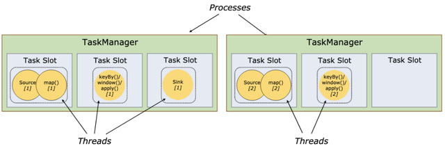

图中两个 TaskManager 共提供 6 个 Slot。若 Source 和 Map 的并行度为 2、Sink 的并行度为 1，作业共有 5 个 Subtask；在未共享时，它们会各自占用一个 Slot。

下图将各算子的并行度调整为 6，并通过 Slot Sharing 让同一并行管道上的不同 Task 共享 Slot：

虽然此时作业包含多个 Task 的 18 个 Subtask，但每条并行管道只需一个 Slot，因此 6 个 Slot 即可运行。Slot Sharing 不仅提高资源利用率，也使所需 Slot 数通常接近同一 Slot Sharing Group 中的最高并行度；实际数量还会受到共享组划分和调度约束影响。

## 5.2 Flink 中的状态

Flink 的一个算子可有多个并行子任务，且子任务可能运行在不同的 TaskManager 上。状态可以理解为某个算子子任务在处理历史数据时保留的中间信息；新记录到达时，子任务读取已有状态、完成计算后再更新状态。

例如，对每个用户的消费金额求和时，子任务需要维护每个用户截至当前的累计金额。状态的读取与更新过程如下图所示：

为支持故障恢复，Flink 会在 Checkpoint 时为状态生成一致性快照，并将快照写入配置好的持久化存储。

按管理方式划分，状态可分为以下两类：

- **托管状态（Managed State）**：由 Flink 负责状态的存储、快照和恢复。开发者通过 Flink 提供的状态 API 定义和访问状态，这是最常用的方式。
- **原始状态（Raw State）**：由用户自行管理序列化和恢复逻辑，Flink 将其视为不透明的字节数据。除少数高级或兼容场景外，通常优先使用托管状态。

托管状态主要包含 **Keyed State** 与 **Operator State** 两种。

对数据流按某个 Key（如用户 ID）执行 `keyBy` 后，会得到 KeyedStream。**Keyed State** 是与 Key 绑定的状态：相同 Key 的记录访问同一份逻辑状态，不同 Key 的状态彼此独立。一个子任务可负责多个 Key，如下图所示：

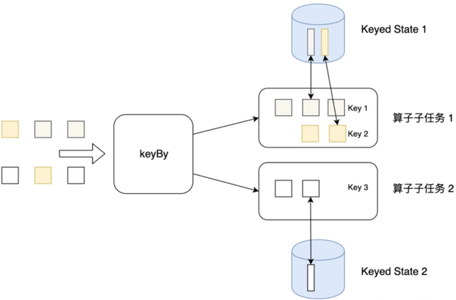

**Operator State** 绑定到算子子任务，而不是某个 Key。一个算子子任务中的所有记录共享该子任务的 Operator State。它常用于 Source 或 Sink，例如保存输入分片的读取进度，或保存待提交的输出缓冲数据。

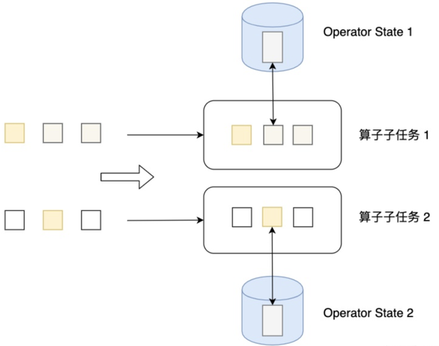

状态在逻辑上由各个算子子任务独立管理；一个子任务不能直接读取另一个子任务的本地状态。状态后端决定运行中状态的存储方式，例如堆内存或嵌入式 RocksDB；Checkpoint 和 Savepoint 则将状态快照写入已配置的持久化存储，例如 HDFS、S3 或其他兼容文件系统。

状态缩放是指作业并行度变化后，对状态进行重新分配。例如，当某个算子吞吐不足时，可提高其并行度；重启或从 Savepoint 恢复时，Flink 会按状态类型将旧并行度下的状态重新映射给新的子任务。

如下图所示，Checkpoint 或 Savepoint 为状态迁移提供了可恢复的快照基础：

## 5.3 Flink 中的时间

流式计算通常需要按照时间解释和聚合数据。当前 Flink 主要使用**处理时间**和**事件时间**两种时间语义；选择不同的时间语义会影响窗口归属和计算结果。

### 处理时间（Processing Time）

处理时间是算子所在机器处理记录时的系统时间。它不依赖事件自带的时间戳，也不需要等待 Watermark，因此实现简单、延迟较低；但网络延迟、重试和机器时钟差异可能使同一批业务事件落入不同窗口。

### 事件时间（Event Time）

事件时间是事件在数据源或业务系统中实际发生的时间，通常由事件携带的时间戳表示。事件时间窗口按该时间戳划分，无论记录何时、以何种顺序到达 Flink。

事件时间能更贴合业务事实，但不会自动保证结果正确。应用仍需根据乱序程度设计 Watermark 策略，并明确处理迟到数据、重复数据和异常时间戳的方式。

### 补充：摄入时间（Ingestion Time）

摄入时间是记录进入 Flink Source 时由系统分配的时间戳，曾在早期 API 中作为独立时间语义出现，介于处理时间与事件时间之间。在 Flink 1.14/1.15 阶段，该语义已被标记为废弃（Deprecated），并在后续版本中被移除。截至 2026 年，新作业必须在处理时间与事件时间中明确选择，而不再使用摄入时间。

## 5.4 Flink 中的水位线

事件时间作业需要知道事件时间的推进进度。例如，一个按小时聚合的事件时间窗口，需要在系统认为该小时的数据已基本到齐时触发计算。Flink 使用**水位线（Watermark）**来表达这一进度。

> `Watermark(t)` 表示系统认为时间戳不大于 `t` 的事件通常已到达，可以推进相应的事件时间计算。这是基于数据乱序特征的估计，而不是绝对保证；之后仍可能收到迟到事件。

水位线的作用如下：

- Watermark 推进事件时间，并可触发事件时间窗口和定时器。
- Watermark Strategy 用于定义允许的乱序范围，从而在结果延迟与迟到数据容忍度之间权衡。
- 水位线通常由 Source 或靠近 Source 的算子生成，并随数据流传播到下游。

每个并行 Source 子任务都会独立生成水位线。下游算子接收多个输入时，通常以各输入水位线的最小值作为自身的有效水位线，避免因某一输入仍可能产生较早事件而过早关闭窗口。对于长期空闲的分区，可通过空闲检测避免其水位线阻塞整体进度。

下图展示了水位线在并行数据流中的传播：

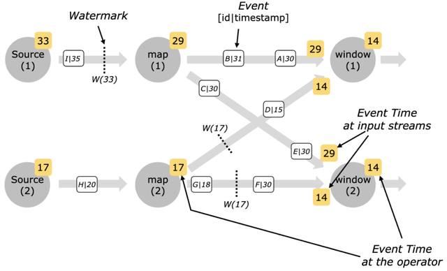

例如，某个 Window 子任务从两个输入接收到水位线 29 和 14 时，其有效水位线为 14，而非两个值中的较大者。

若 `Watermark(t)` 已到达某个窗口算子，之后仍到达时间戳不大于 `t` 的记录，该记录就是**迟到元素**。事件时间窗口默认允许迟到时间为 0，超出窗口关闭时机的记录通常会被丢弃，或通过侧输出（Side Output）收集。设置允许迟到时间后，窗口可接纳这段时间内的迟到记录并再次触发计算；下游 Sink 应能正确处理可能产生的更新或重复结果。

## 5.5 Flink 中的时间窗口

窗口将持续到达的无界数据流划分为有限范围，以便完成聚合、排序等需要边界的计算。窗口可按时间、记录数量或自定义触发条件划分；对 KeyedStream 使用窗口时，每个 Key 通常维护独立的窗口。

Flink 常见的时间窗口如下。

### 滚动窗口（Tumbling Windows）

滚动窗口按固定长度连续划分数据，例如每 1 小时一个窗口。相邻窗口互不重叠，每条记录只会进入一个窗口。

### 滑动窗口（Sliding Windows）

滑动窗口由窗口大小和滑动间隔共同定义，例如窗口大小为 1 小时、每 5 分钟滑动一次。若滑动间隔小于窗口大小，窗口会重叠，一条记录可能属于多个窗口；两者相等时，滑动窗口退化为滚动窗口。

### 会话窗口（Session Windows）

会话窗口用于识别某个 Key 的连续活跃阶段。它由会话间隔（Gap）定义：相邻事件之间的空闲时间小于 Gap 时，事件属于同一会话；空闲时间达到或超过 Gap 时，会开启新的会话。会话窗口常用于分析用户的一段连续操作。

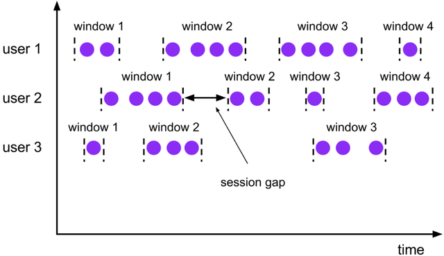

除上述类型外，Flink 还支持全局窗口、计数窗口和自定义窗口触发逻辑；应根据业务时间定义、乱序程度和状态规模选择合适的窗口策略。

## 5.6 Checkpoint 和 Savepoint

**Checkpoint** 是 Flink 的容错机制。Flink 周期性地为算子状态创建一致性快照，并将快照保存到配置好的持久化存储。作业发生故障后，可从最近一次**已完成**的 Checkpoint 恢复状态并继续运行。

Checkpoint 并不等同于暂停整个作业再复制数据。Checkpoint Coordinator 会向 Source 注入带有唯一 ID 的 **Checkpoint Barrier**，Barrier 随记录向下游传播；各算子在达到一致快照点时持久化自身状态。状态快照通常可异步写入远程存储，因此正常处理不会被整体停住。

在**对齐 Checkpoint** 中，多输入算子会暂时阻塞已收到 Barrier 的输入通道，直到其他输入通道也收到同一 Barrier，从而保证各输入对齐。该阻塞仅发生在相关算子和输入通道上，而非整个作业。**非对齐 Checkpoint** 会同时快照状态和必要的在途数据，以降低反压严重时的对齐等待；其代价是快照数据量可能更大。

故障恢复的一般过程如下：

1. 根据重启策略重新部署失败的作业或任务。
2. 从最近一次已完成的 Checkpoint 恢复各子任务的状态。
3. Source 从已快照的读取位置继续消费；支持重放的 Source 会重新提供故障后尚未纳入 Checkpoint 的记录。

这套机制可保证 Flink **内部状态**在配置为 Exactly-Once 时保持一致。端到端是否能达到 Exactly-Once，还取决于 Source 是否可重放、Sink 是否支持事务提交或幂等写入，以及外部系统的语义。例如，Kafka 可保存并恢复消费位置；不具备重放能力的 Socket Source 则无法单独提供端到端 Exactly-Once 保证。

即使某个 TaskManager 或容器异常退出，只要作业配置了可用的重启策略、持久化存储和兼容的 Source/Sink，Flink 通常可从最近一次成功的 Checkpoint 恢复；并非作业变为失败状态后就必然无法恢复。

**Savepoint** 是用户主动触发的、可用于维护操作的状态快照。它常用于升级作业、修改并行度、迁移集群和排查问题后的人工恢复。Savepoint 也使用 Flink 的快照机制，但其用途和生命周期由用户控制。

为提高作业升级时的状态兼容性，建议为有状态算子设置稳定的 `uid`。恢复时，Flink 可根据 UID 将 Savepoint 中的状态映射到新作业的对应算子；若删改有状态算子或更改状态序列化方式，仍需评估状态兼容性。

Checkpoint 与 Savepoint 的主要差异如下：

- Checkpoint 面向故障恢复，由系统按配置自动触发；Savepoint 面向升级、迁移等人工维护，由用户显式触发和保留。
- Checkpoint 一般触发频繁，并会按配置清理或保留；Savepoint 通常保存时间更长，应由用户管理其存储与清理。
- 两者都依赖状态快照机制，但 Savepoint 的可移植性取决于其格式、Flink 版本、状态后端和作业变更情况。升级或改并行度前应在测试环境验证恢复。
- 使用嵌入式 RocksDB 状态后端时，Checkpoint 可采用增量快照降低大状态的写入成本；Savepoint 是否采用增量或可跨环境恢复，取决于选用的保存点格式和具体版本，不能一概而论。

此外，自 Flink 1.15 起，Savepoint 默认采用与 Checkpoint 相同的规范格式（Canonical Format），大幅提升了跨版本升级和跨集群迁移的兼容性。结合 Changelog State Backend，Flink 还能进一步缩短 Checkpoint 耗时并降低网络抖动对大状态作业的影响，但 Changelog 会引入额外的存储和运维开销，需根据实际场景评估。

