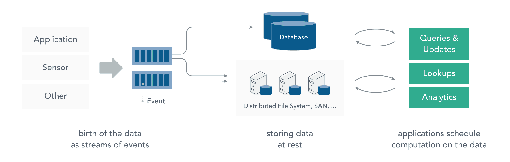
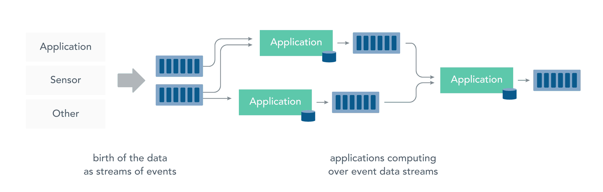
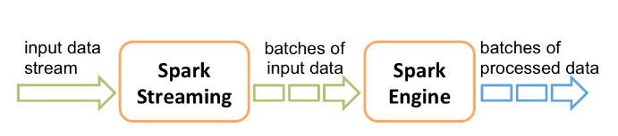
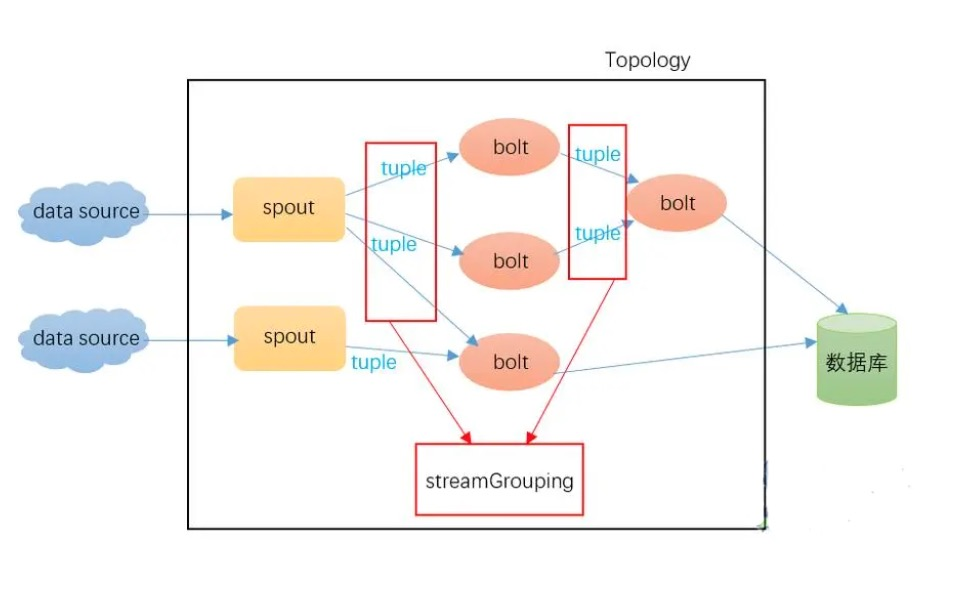
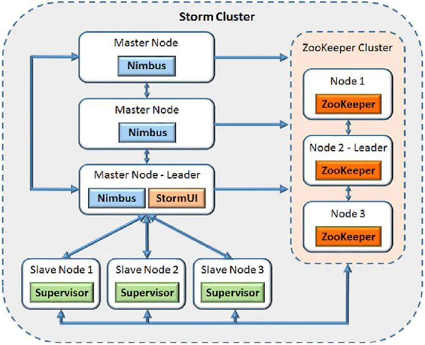
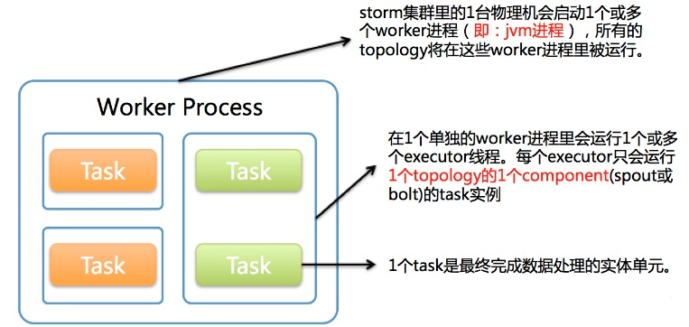
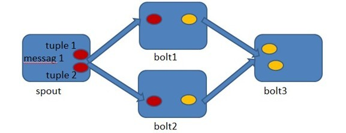

# 1、批处理与流处理

大数据分类两类：**静态数据**和**动态数据**。针对这两类数据的计算模式分别是**批处理**和**流处理**。

**静态数据**：通常存储在数据库或文件系统中，特点是数据量大、数量有限（数据的时间区间是确定的）。例如企业为了支持决策分析而构建的数据仓库系统。对这类数据进行分析处理，采用的计算模式是**批处理**。


Hadoop 采用 HDFS 进行数据存储，采用 MapReduce 进行数据查询或分析，这就是典型的静态数据处理架构。这种计算不太在意计算的时长，可以在很充裕的时间里对海量数据慢慢进行批量计算来得到有用的信息。

**动态数据**：数据以流形式持续到达，这类数据的特点是大量、快速、时变，它在时间和数量上都是无限的，随着时间的流逝，这类数据的价值往往会降低。因此，对这类数据的处理通常对实时性要求比较高，希望能实时得到计算结果，响应时间一般在秒级，采用的计算模式为**流处理**。


实际上，在真实世界中的大多数数据都是连续的流，如传感器数据，网站用户活动数据，金融交易数据等等 ，所有这些数据都是随着时间的推移而源源不断地产生。流处理的基本职责是确保数据有效流动，同时具备可扩展性和容错能力，Storm 和 Flink 就是其代表性的实现。

总结：批处理主要解决的是静态数据的批量处理，即处理的是已经存储到位的数据，一般重视数据的**吞吐量**；而流处理的数据是源源不断流入的，在计算启动的时候数据一般并没有到位，流处理更加关注数据处理的**实时性**。

# 2、Storm是什么

Storm是Twitter开源的分布式实时大数据处理框架，被业界称为**实时版Hadoop**。


Storm对于实时计算（流处理）的的意义相当于Hadoop对于批处理的意义。Hadoop为我们提供了`Map`和`Reduce`原语，使我们对数据进行批处理变的非常的简单和优美。同样，Storm也对数据的实时计算提供了简单`Spout`和`Bolt`原语。

Storm 可以说是第一个实现了分布式实时计算框架，相比于Spark Streaming 的准实时，Storm是“真正意义上的实时”。Spark Streaming 并不是真正意义上的流处理框架。 



Spark Streaming 接收实时输入的数据流，并将数据拆分为一系列批次，然后进行**微批处理**。只不过 Spark Streaming 能够将数据流进行极小粒度的拆分，使得其能够得到接近于流处理的效果，但其本质上还是批处理。

随着越来越多的场景对Hadoop的MapReduce高延迟无法容忍，比如推荐系统（实时推荐，根据下单或加入购物车推荐相关商品）、金融系统、预警系统、网站统计（实时销量、流量统计，如淘宝双11效果图）、交通路况实时系统等等，大数据实时处理解决方案的应用日趋广泛，而Storm更是流计算技术中的先行者。


Stor具有以下特性：

* **快速、实时**：Storm保证每个消息能能得到快速的处理，可以达到毫秒级。

* **编程简单**：开发人员只需要关注应用逻辑，而且跟Hadoop类似，Storm提供的编程原语也很简单

* **分布式**: Storm的集群可以很容易的扩展，可以轻松应对数据量大，单机搞不定的场景。

* **保证无数据丢失**： 实时系统必须保证所有的数据被成功的处理。 那些会丢失数据的系统的适用场景非常窄， 而Storm保证每个消息至少能得到一次完整处理。任务失败时，它会负责从消息源重试消息（ack机制）。

* **容错性好**：单个节点挂了不影响应用。

* **语言无关性**： 可以在Storm之上使用各种编程语言。默认支持Clojure、Java、Ruby和Python。要增加对其他语言的支持，只需实现一个简单的Storm通信协议即可。

# 3、数据模型


## 3.1 Tuple

Storm使用**Tuple**来作定义数据流中的一个基本处理单元。每个Tuple是一堆值，每个值有一个名字，并且每个值可以是任何类型。

Tuple本来应该是一个Key-Value的Map，由于各个组件间传递的Tuple的字段名称已经事先定义好了，所以Tuple只需要按序填入各个Value，所以就是一个Value List。

## 3.2 Stream

一个没有边界的、源源不断的、连续的Tuple序列就组成了Stream。

Stream从Spout中源源不断传递数据给Bolt、以及上一个Bolt传递数据给下一个Bolt。

## 3.3 Spout

拓扑中**数据流的源**。一般会从指定外部的数据源读取元组（Tuple）发送到拓扑（Topology）中。
 
一个Spout可以发送多个数据流（Stream）。Spout中最核心的方法是nextTuple，该方法会被Storm线程不断调用、主动从数据源拉取数据，再通过emit方法将数据生成元组（Tuple）发送给之后的Bolt计算。

Spout分成可靠和不可靠两种；当Storm接收失败时，可靠的Spout会对tuple进行重发；而不可靠的Spout不会考虑接收成功与否只发射一次。

## 3.4 Bolt

拓扑中**数据处理均有Bolt完成**。Bolt 接受数据然后执行处理的组件，用户可以在其中执行自己想要的操作

一个Bolt可以发送多个数据流（Stream）。对于简单的任务或者数据流转换，单个Bolt可以简单实现；更加复杂场景往往需要多个Bolt分多个步骤完成。

## 3.5 Topology

Topology 是由一系列通过数据流相互关联的Spout、Bolt所组成的拓扑结构，它由流数据（Stream），Spout（流生产者），以及Bolt（操作）组成，涵盖了数据源获取、数据生产、数据处理的所有代码逻辑，是对Storm实时计算逻辑的封装。

简单地说，拓扑就是一个有向无环图（DAG），其中顶点是计算，边缘是数据流。

Storm的拓扑只要启动就会一直在集群中运行，直到手动将其kill，否则不会终止。这一点区别于MapReduce当中的Job，MR当中的Job在计算执行完成就会终止。

## 3.6 Stream Grouping

Stream Grouping定义了一个流在Bolt任务间该如何被切分。

目前，Storm Stream Grouping支持如下几种类型：

* **Shuffle Grouping** ：随机分组，尽量均匀分布到下游Bolt中。这种混排分组意味着来自Spout的输入将混排，或随机分发给此Bolt中的任务。shuffle grouping对各个task的tuple分配的比较均匀。

* **Fields Grouping** ：按字段分组，按数据中field值进行分组，相同field值的Tuple被发送到相同的Task。这种grouping机制保证相同field值的tuple会去同一个task，例如，根据“user-id”字段，相同“user-id”的元组总是分发到同一个任务，不同“user-id”的元组可能分发到不同的任务。

* **All grouping** ：广播发送， 对于每一个tuple将会复制到每一个bolt中处理。

* **Global grouping** ：全局分组，Tuple被分配到一个Bolt中的一个Task，实现事务性的Topology。确切地说，是分配给ID最小的那个task。

* **None grouping** ：不分组。不关注并行处理负载均衡策略时使用该方式，目前等同于shuffle grouping，另外storm将会把bolt任务和他的上游提供数据的任务安排在同一个线程下。

* **Direct grouping** ：直接分组、指定分组。由tuple的发射单元直接决定tuple将发射给那个bolt，一般情况下是由接收tuple的bolt决定接收哪个bolt发射的Tuple。这是一种比较特别的分组方法，用这种分组意味着消息的发送者指定由消息接收者的哪个task处理这个消息。只有被声明为Direct Stream的消息流可以声明这种分组方法。

上面几种Streaming Group的内置实现中，最常用的应该是Shuffle Grouping、Fields Grouping、Direct Grouping这三种。

当然，还可以实现CustomStreamGroupimg接口来定制自己需要的分组。

# 4、集群架构



通常来说，Storm集群采用主从架构方式，主节点是Nimbus，从节点是Supervisor，有关调度相关的信息存储到ZooKeeper集群中。

## 4.1 Nimbus

主节点通常运行一个后台程序 —— Nimbus，用于响应分布在集群中的节点，分配任务和监测故障。


## 4.2 Supervisor

工作节点同样会运行一个后台程序 —— Supervisor，用于收听工作指派并基于要求运行工作进程。每个工作节点都是Topology中一个子集的实现。

## 4.3 Zookeeper

Zookeeper是完成Supervisor和Nimbus之间协调的服务。而应用程序实现实时的逻辑则被封装进Storm中的Topology。

## 4.4 Worker

一个Storm在集群上运行一个Topology时，主要通过以下3个实体来完成Topology的执行工作：

1. Worker（进程）
2. Executor（线程）
3. Task

下图简要描述了这3者之间的关系：



* **1个Worker进程执行的是1个Topology的子集**（注：不会出现1个worker为多个Topology服务）。1个worker进程会启动1个或多个executor线程来执行1个Topology的Component(Spout或Bolt)。因此，1个运行中的topology就是由集群中多台物理机上的多个worker进程组成的。

* **Executor是1个被Worker进程启动的单独线程**。每个Executor只会运行1个Topology的1个Component(Spout或Bolt)的task（注：Task可以是1个或多个，Storm默认是1个Component只生成1个Task，Executor线程里会在每次循环里顺序调用所有Task实例）。

* **Task是最终运行Spout或Bolt中代码的单元**（注：1个Task即为Spout或Bolt的1个实例，Executor线程在执行期间会调用该Task的nextTuple或execute方法）。Topology启动后，1个Component(Spout或Bolt)的Task数目是固定不变的，但该Component使用的Executor线程数可以动态调整（例如：1个Executor线程可以执行该Component的1个或多个Task实例）。这意味着，对于1个component存在这样的条件：`threads<=#tasks`（即：线程数小于等于task数目）。默认情况下Task的数目等于Executor线程数目，即1个Executor线程只运行1个Task。


# 5、可靠性

所谓的可靠性，即Storm如何保证消息不丢失？

Storm允许用户在Spout中发射一个新的源Tuple时为其指定一个MessageId，这个MessageId可以是任意的Object对象。多 个源Tuple可以共用同一个MessageId，表示这多个源Tuple对用户来说是同一个消息单元。Storm的可靠性是指Storm会告知用户每一 个消息单元是否在一个指定的时间内被完全处理。完全处理的意思是该MessageId绑定的源Tuple以及由该源Tuple衍生的所有Tuple都经过 了Topology中每一个应该到达的Bolt的处理。



在Spout中由`message 1`绑定的`tuple1`和`tuple2`分别经过`bolt1`和`bolt2`的处理，然后生成了两个新的Tuple，并最终流向了`bolt3`。当`bolt3`处理完之后，称`message 1`被**完全处理**了。

Storm中的每一个Topology中都包含有一个**Acker组件**。Acker组件的任务就是跟踪从Spout中流出的每一个messageId所绑定的Tuple树中的所有Tuple的处理情况。如果在用户设置的最大超时时间内这些Tuple没有被完全处理，那么Acker会告诉Spout该消息处理失败，相反则会告知Spout该消息处理成功。

那么Acker是如何记录Tuple的处理结果呢？？

```
A xor A = 0.

A xor B…xor B xor A = 0
```

其中每一个操作数出现且仅出现两次。

在Spout中，Storm系统会为用户指定的MessageId生成一个对应的64位的整数，作为整个Tuple Tree的**RootId**。RootId会被传递给Acker以及后续的Bolt来作为该消息单元的唯一标识。同时，无论Spout还是Bolt每次新生成 一个Tuple时，都会赋予该Tuple一个唯一的64位整数的Id。

当Spout发射完某个MessageId对应的源Tuple之后，它会告诉Acker自己发射的RootId以及生成的那些源Tuple的Id。而当 Bolt处理完一个输入Tuple并产生出新的Tuple时，也会告知Acker自己处理的输入Tuple的Id以及新生成的那些Tuple的Id。 Acker只需要对这些Id进行异或运算，就能判断出该RootId对应的消息单元是否成功处理完成了。
