# 1、流计算的基本概念

## 1.1 批处理与流处理

在大数据处理领域，批处理与流处理一般被认为是两种截然不同的任务，一个大数据框架一般会被设计为只能处理其中一种任务。比如，Storm 只支持流处理任务，而 MapReduce、Spark 只支持批处理任务。

通过灵活的执行引擎，**Flink 能够同时支持批处理任务与流处理任务**。在执行引擎层级，流处理系统与批处理系统最大的不同在于节点间的数据传输方式。

如下图所示，对于一个流处理系统，其节点间数据传输的标准模型是，在处理完成一条数据后，将其序列化到缓存中，并立刻通过网络传输到下一个节点，由下一个节点继续处理。

这两种数据传输模式是两个极端，对应的是流处理系统对低延迟和批处理系统对高吞吐的要求。Flink 的执行引擎采用了一种十分灵活的方式，同时支持了这两种数据传输模型。

Flink 以固定的缓存块为单位进行网络数据传输，用户可以通过设置缓存块超时值指定缓存块的传输时机。

* 如果缓存块的超时值为 0，则 Flink 的数据传输方式类似于前面所提到的流处理系统的标准模型，此时系统可以获得最低的处理延迟；
* 如果缓存块的超时值为无限大，则 Flink 的数据传输方式类似于前面所提到的批处理系统的标准模型，此时系统可以获得最高的吞吐量。

缓存块的超时值也可以设置为 0 到无限大之间的任意值，缓存块的超时阈值越小，Flink 流处理执行引擎的数据处理延迟就越低，但吞吐量也会降低，反之亦然。通过调整缓存块的超时阈值，用户可根据需求灵活地权衡系统延迟和吞吐量。

## 1.2 有界流与无界流

在 Spark 的世界观中，一切都是由批次组成的，离线数据是一个大批次，而实时数据是由一个一个无限的小批次组成的。 而在 Flink 的世界观中，一切都是由流组成的，离线数据是有界限的流，实时数据是一个没有界限的流，这就是所谓的**有界流**和**无界流**。

* **无界数据流**：有一个开始但是没有结束，它们不会在生成时终止并提供数据，必须连续处理无界流，也就是说必须在获取后立即处理 event（事件）。对于无界数据流我们无法等待所有数据都到达，因为输入是无界的，并且在任何时间点都不会完成。处理无界数据通常要求以特定顺序（例如事件发生的顺序）获取 event，以便能够推断结果完整性。
* **有界数据流**：有明确定义的开始和结束，可以在执行任何计算之前通过获取所有数据来处理有界流。

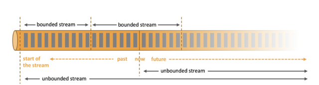

以流为世界观的架构，获得的最大好处就是具有极低的延迟。

## 1.3 有状态与无状态

在流计算中，**状态**（State）是一个较宽泛的概念。这里我们先明确给个定义：

> 状态（State）就是计算的中间信息（Intermediate Information）

从数据的角度看，流计算的处理方法主要有以下两种：

* **无状态**（Stateless）：每一个进入的记录独立于其他记录。不同记录之间没有任何关系，它们可以被独立处理和持久化。例如：map、fliter、静态数据join等操作。

* **有状态**（Stateful）：处理进入的记录依赖于之前记录处理的结果。因此，我们需要维护不同数据处理之间的中间信息。每一个进入的记录都可以读取和更新该信息。我们把这个中间信息称作状态（State）。例如：独立键的聚合计数、去重等等。

对应地，状态处理也分为两种：

* **过程状态**：它是流计算的元数据），用于追踪和记录历史至今，已经被处理的数据偏移量及流处理系统当前的状态。在流的世界中，这些元数据包括 checkpoint /savepoint 以及保存已经处理数据的偏移量（offset）等。这些信息是任何高可靠流处理的基本，同时被无状态和有状态处理需要。

* **数据状态**：这些中间数据来自于数据（目前为止处理过的），它需要在记录之间维护（只在Stateful模式下需要维护）。

事实上，维护流式计算的中间信息不仅仅是因为计算本身所需要，还有个非常重要的原因是流式计算系统的容错性要求。

故障产生的原因多种多样（例如机器故障、网络故障、软件失败或者服务异常重启等），并且发生的时机也具有不确定性，但最终对用户产生的直接影响都是导致任务执行失败。为此，流计算系统需要一种机制来周期性地持久化相应的状态快照（即checkpoint机制），当计算系统出现异常后，就可以从最近的持久化快照中恢复执行，从而确保计算结果的正确性。

## 1.4 状态一致性

有状态的流处理，每个算子任务都可以有自己的状态，所谓的状态一致性， 其实就是我们所说的计算结果要保证准确。一条数据不应该丢失，也不应该重复计算，在遇到故障时可以恢复状态，恢复以后的重新计算，结果应该也是完全正确的。

* **AT-MOST-ONCE (最多一次)**：当任务故障时，最简单的做法是什么都不干，既不恢复丢失的状态，也不重 播丢失的数据。At-most-once 语义的含义是最多处理一次事件。
* **AT-LEAST-ONCE (至少一次)**：在大多数的真实应用场景，我们希望不丢失事件。这种类型的保障称为at- least-once，意思是所有的事件都得到了处理，而一些事件还可能被处理多次。
* **EXACTLY-ONCE (精确一次)**：恰好处理一次是最严格的保证，也是最难实现的。恰好处理一次语义不仅仅意味着没有事件丢失，还意味着针对每一个数据，内部状态仅仅更新一次。

以上三种传递语义的严谨性是逐个递增的。“最多一次”某种程度上跟没提供任何保证一样，而只有“恰好一次”能够保证计算结果的正确性，因此“恰好一次”的传递语义也意味着正确的结果保证。

**Flink的分布式异步快照机制支持“恰好一次”语义，但同样提供了对“至少一次”语义的支持**，这给予了用户根据不同场景（比如允许数据重复，但希望延迟尽可能低）进行合理选择的灵活性。

# 2、从Storm到Flink

目前比较流行的开源流式处理框架是Storm、Spark Streaming、Flink三剑客。

## 2.1 Storm

Storm是最先出现的流式计算框架，技术成熟可靠，社区也很活跃。阿里巴巴还开发了JStorm，对Storm进行了拓展完善。后续JStorm也融入到Storm中，对于Storm也是一个质的提升。比较适合于基于事件的一些简单用例场景。
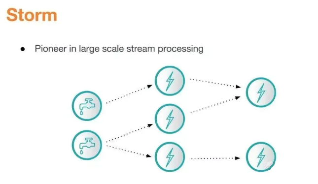

**优点：**
* 极低的延迟，成熟和高吞吐量
* 非常适合简单的流处理

**缺点：**
* 不支持状态管理
* 没有事件时间处理，聚合，窗口，会话，水位等高级功能
* 至少保证一次（可能导致重复）

## 2.3 Spark Streaming

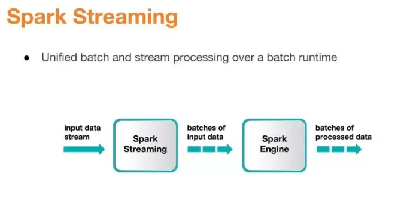

Spark实现了一种叫做**微批处理**（Micro-batch）的概念。在具体策略方面该技术可以将数据流视作一系列非常小的“批”，借此即可通过批处理引擎的原生语义进行处理。

Spark Streaming会以亚秒级增量对流进行缓冲，随后这些缓冲会作为小规模的固定数据集进行批处理。缓冲机制使得该技术可以处理非常大量的传入数据，提高整体吞吐率，但等待缓冲区清空也会导致延迟增高。这意味着Spark Streaming可能不适合处理对延迟有较高要求的工作负载，相比真正的流处理框架在性能方面依然存在不足。

2.0版本之后，Spark除了Structured Streaming之外，还配备了许多优秀的功能，如定制内存管理（与Flink类似）tungsten、watermarks, event time processing支持等。

**优点：**
* 高吞吐量，适用于不需要低延迟的应用场景
* 由于微批次性质，天生具有容错性
* 简单易用的高级API
* 社区活跃，且积极的改进
* 支持exactly-once

**缺点：**
* 不是真正的流处理，不适合低延迟要求
* 要调整的参数很多，很难做到最好
* 在许多高级功能中落后于Flink

## 2.4 Flink

Flink 的前身就是柏林理工大学的一个研究性项目，在 2014 年这个项目被 Apache 孵化器所接受后，Flink 迅速成为 ASF（Apache Software Foundation）的顶级项目之一，是流式计算领域冉冉升起的一颗新星。

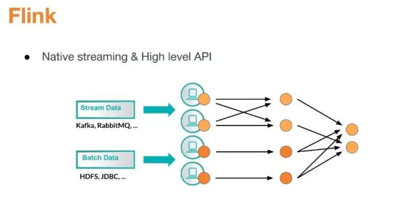

Flink 主要由 Java 代码实现，**它同时支持实时流处理和批处理**。对于 Flink 而言，作为一个流处理框架，批数据只是流数据的一个极限特例而已。

此外，Flink 还支持迭代计算、内存管理和程序优化，这是它的原生特性。

**优点：**
* 开源流处理领域的创新领导者，具有Event Time Processing, Watermarksd等所有高级功能
* 低延迟，高吞吐量，每秒可处理数百万个事件
* 自动调整，需要调整的参数较少，调优方便
* 精确一次（exactly-once）的状态一致性保证

**缺点：**
* 社区没有Spark那么活跃与成熟
* 很多高级功能缺乏大规模实践的验证，工程实现上却相对薄弱

## 2.5 性能对比

为了对三剑客的性能有一个比较直观的对比，这里引入两份测试报告。

第一份来自于Yahoo 的 Storm 团队，该测试对于业界而言极具价值，是流处理领域的第一个基于真实应用程序的基准测试。

该应用程序从 Kafka 消费广告曝光消息，从 Redis 查找每一个广告对应的广 告宣传活动，并按照广告宣传活动分组，以 10 秒为窗口计算广告浏览量。 10 秒窗口的最终结果被存储在 Redis 中，这些窗口的状态也按照每秒记录 一次的频率被写入 Redis，以方便用户对它们进行实时查询。框架

在最初的性能测评中，由于 Storm 是无状态流处理器（即它不能定义和维护状态），因此 Flink 做业也按照无状态模式编写。全部状态都被存储在 Redis 中。

在性能测评中，Spark Streaming 遇到了吞吐量和延迟性难两全的问题。随着批处理做业规模的增长，延迟升高。若是为了下降延迟而缩减规模，吞吐量就会减小。Storm 和 Flink 则能够在吞吐量增长时维持低延迟。

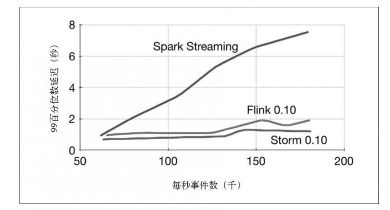

也就是说，如果单从吞吐量和延迟性方面来讲，Spark Stream与Storm、Flink根本不在同一个段位，最先出局。

再来看一下Storm与Flink的对决，来自于美团大数据团队的测试报告。

* 上图中蓝色柱形为单线程 Storm 作业的吞吐，橙色柱形为单线程 Flink 作业的吞吐。
* Identity 逻辑下，Storm 单线程吞吐为 8.7 万条/秒，Flink 单线程吞吐可达 35 万条/秒。
* 当 Kafka Data 的 Partition 数为 1 时，Flink 的吞吐约为 Storm 的 3.2 倍；当其 Partition 数为 8 时，Flink 的吞吐约为 Storm 的 4.6 倍。

由此可以看出，**Flink 吞吐约为 Storm 的 3-5 倍**。

* 采用 outTime – eventTime 作为延迟，图中蓝色折线为 Storm，橙色折线为 Flink。虚线为 99 线，实线为中位数。
* 从图中可以看出随着数据量逐渐增大，Identity 的延迟逐渐增大。其中 99 线的增大速度比中位数快，Storm 的 增大速度比 Flink 快。
* 其中 QPS 在 80000 以上的测试数据超过了 Storm 单线程的吞吐能力，无法对 Storm 进行测试，只有 Flink 的曲线。

对比折线最右端的数据可以看出，Storm QPS 接近吞吐时延迟中位数约 100 毫秒，99 线约 700 毫秒，Flink 中位数约 50 毫秒，99 线约 300 毫秒。**Flink 在满吞吐时的延迟约为 Storm 的一半**。

**注意**：以上两份数据报告来自于多年前的测试，不代表三者当前的水平。

## 2.6 总结

Storm提供了低延迟的流处理，但是为了实时性付出了一些代价：很难实现高吞吐，并且正确性没有达到通常所需的水平，换句话说它并不能保证exactly-one，要想保证正确性级别开销也是很大的。

低延迟和高吞吐流处理系统中维持良好的容错性很困难，但是人们想到了一种替代方法：将连续时间中的流数据分割成一系列微小的批量作业。这就是Spark批处理引擎上运行的Spark Streaming所使用的方法。

Storm Trident是对Storm的延伸，底层流处理引擎就是基于微批处理方法来进行计算的，从而实现了exactly-one语义，但是在延迟性方面付出了很大的代价。

Flink这一技术框架上可以避免上述弊端并且拥有所需的诸多功能，还能按照连续事件高效的处理数据。

截至今天，看起来Flink正在引领Streaming Analytics领域，首先拥有大部分流处理所需的功能，如exactly-one，吞吐量，延迟，状态管理，容错，高级功能等。而且Flink仍在不断创新，如轻量级快照和堆外定制内存管理。

用一句话概括三剑客的江湖地位：

* **Storm**：流式计算的拓荒者
* **Spark Stream**：流式计算的探索者
* **Flink**：流式计算的集大成者

# 3、Flink的体系架构

Flink的系统架构如下图所示。用户在客户端提交一个作业（Job）到服务端。服务端为分布式的主从架构。

## 3.1 JobManager

* 控制一个应用程序执行的**主进程**，也就是说，每个应用程序都会被一个不同的JobManager所控制。
* JobManager会先接收到要执行的应用程序，这个应用程序会包括：作业图，逻辑数据流图和打包了所有类、库和其它资源的jar包。
* JobManager会把JobGraph转换成一个物理层面的数据流图，这个图被叫做**执行图**，包含了所有可以执行的任务。
* JobManager会向资源管理器（ResourceManager）请求执行任务必要的资源，也就是任务管理器（TaskManager）上的**插槽**（Slot）。一旦它获取到了足够的资源，就会将执行图分发到真正运行它们的taskManager上。而在运行过程中，JobManager会负责所有需要中央协调的操作，比如说检查点（checkpoints）的协调。

## 3.2 TaskManager

* TaskManager是Flink中的工作进程。通常在flink中会有多个TaskManager运行，每一TaskManager都包含了一定数量的插槽（solts）。**插槽的数量限制了TaskManager能够执行的任务数量**
* 启动之后，TaskManager会向资源管理器注册它的插槽；收到资源管理器的指令后，TaskManager就会将一个或多个插槽提供给JobManager调用。JobManager就可以向插槽分配任务（tasks）来执行了。
* 在执行过程中，一个TaskManager可以跟其他运行同一应用程序的TaskManager交换数据。

## 3.3 ResourceManager

* 主要负责管理任务管理器（TaskManager）的插槽（solt），插槽是Flink中定义的处理资源单元。
* flink为不同的环境和资源管理工具提供不同的资源管理工具，比如YARN、Mesos、K8s，以及standalone部署。
* 当JonManager申请插槽资源时，ResourceManager会将有空间插槽来满足JobManager的请求，它还可以向资源提供平台发起会话，以提供启动TaskManager进程的容器。

## 3.4 Dispatcher

* 可以跨作业运行，它为应用提交提供了REST接口。
* 当一个应用被提交执行时，分发器就会启动并将应用移交给一个jobManager
* Dispatcher也会启动一个web UI，用来方便地展示和监控作业执行的信息
* Dispatcher在架构中可能并不是必须的，这个取决于应用提交运行的方式

至此，可以画出Flink作业的提交流程：

# 4、FLink的数据模型

Flink对数据的处理被抽象为以下三步：

1. 接收（ingest）一个或者多个数据源（hdfs，kafka等）
2. 执行若干用户需要的转换算子（transformation operators）
3. 将转换后的结果输出（sink）

如下图所示，Flink处理数据流的**算子**（operator）也分为三类：
1. Source负责管理输入（数据源）
2. Tranformation负责数据运算
3. Sink负责管理结果输出

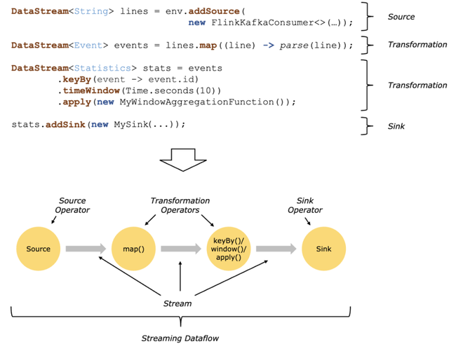

Source和Sink就不再多说了，一个负责输入，一个负责输出。对于Transformation operators，熟悉java stream的同学应该很容易理解，因为Flink中的map，flatMap，reduce，apply等算子和java stream中对应的算子含义差不多。keyBy作为Flink的一个高频使用算子，其功能跟MySQL的group by功能差不多；而window算子则是通过窗口机制，将无界数据集拆分成一个个有界数据集。

在Flink中，程序天生是并行和分布式的：一个Stream可以被分成多个Stream分区（Stream Partitions），一个Operator可以被分成多个Operator Subtask，每一个Operator Subtask是在不同的线程中独立执行的。**一个Operator的并行度，等于Operator Subtask的个数，一个Stream的并行度总是等于生成它的Operator的并行度**。有关Parallel Dataflow的实例，如下图所示：

上图Streaming Dataflow的并行视图中，展现了在两个Operator之间的Stream的两种模式：

* **One-to-one模式**：比如从`Source[1]`到`map()[1]`，它保持了Source的分区特性（Partitioning）和分区内元素处理的有序性，也就是说`map()[1]`的Subtask看到数据流中记录的顺序，与`Source[1]`中看到的记录顺序是一致的。
* **Redistribution模式**：这种模式改变了输入数据流的分区，比如从`map()[1]`、`map()[2]`到`keyBy()/window()/apply()[1]`、`keyBy()/window()/apply()[2]`，上游的Subtask向下游的多个不同的Subtask发送数据，改变了数据流的分区，这与实际应用所选择的Operator有关系。

另外，Source Operator对应2个Subtask，所以并行度为2，而Sink Operator的Subtask只有1个，故而并行度为1。

一个**Job**代表一个可以独立提交给Flink执行的作业，我们向JobManager提交任务的时候就是以Job为单位的，只不过一份代码里可以包含多个Job（每个Job对应一个类的main函数）。接着我们来看Task和SubTask，如下图所示：

* 图中每个圆代表一个**Operator**（算子），每个虚线圆角框代表一个**Task**，每个虚线直角框代表一个**Subtask**，其中的p表示算子的**并行度**。

* 最上面是**StreamGraph**，在没有经过任何优化时，可以看到包含4个Operator/Task：`Task A1`、`Task A2`、`Task B`、`Task C`。

* StreamGraph经过链式优化（Flink默认会将一些并行度相同的算子连成一条链）之后，`Task A1`和`Task A2`两个Task合并成了一个新的`Task A`（可以认为合并产生了一个新的Operator），得到了中间的JobGraph。

* 然后以并行度为2（需要2个Slot）执行的时候，Task A产生了2个Subtask，分别占用了`Thread #1`和`Thread #2`两个线程；`Task B`产生了2个Subtask，分别占用了`Thread #3`和`Thread #4`两个线程；Task C产生了1个Subtask，占用了`Thread #5`。

由此可以总结如下：

* **Task是逻辑概念，一个Operator就代表一个Task**（多个Operator被chain之后产生的新Operator算一个Operator）；

* 真正运行的时候，Task会按照并行度分成多个Subtask，**Subtask是执行/调度的基本单元**；

* JobManager从ResourceManager处申请到Slot资源后，将SubTask调度到这些Slot上面去执行，**Slot是资源分配的基本单元**。

* **每个Subtask需要一个线程（Thread）来执行**。

# 5、Flink的实现原理

## 5.1 SlotSharing

TaskManager启动的时候会将自己的资源以Slot的方式注册到master节点上的资源管理器（ResourceManager）。JobManager从ResourceManager处申请到Slot资源后将自己优化过后的SubTask调度到这些Slot上面去执行。在整个过程中SubTask是调度的基本单元，而Slot则是资源分配的基本单元。需要注意的是目前Slot只隔离内存，不隔离CPU。

为了更高效地使用资源，Flink默认允许同一个Job中不同Task的SubTask运行在同一个Slot中，这就是**SlotSharing**。注意以下描述中的几个关键条件：

* 必须是同一个Job。这个很好理解，slot是给Job分配的资源，目的就是隔离各个Job，如果跨Job共享，但隔离就失效了；
* 必须是不同Task的Subtask。这样是为了更好的资源均衡和利用。
* 默认是允许sharing的，也就是你也可以关闭这个特性。

为了更高效地使用资源，Flink默认允许同一个Job中不同Task的SubTask运行在同一个Slot中，这就是**SlotSharing**。

下面我们依次来看看官方文档给出的两幅图：

图中两个TaskManager节点共有6个slot，5个SubTask，其中sink的并行度为1，另外两个SubTask的并行度为2。此时由于Subtask少于Slot个数，所以每个Subtask独占一个Slot，没有SlotSharing。下面我们把把并行度改为6：

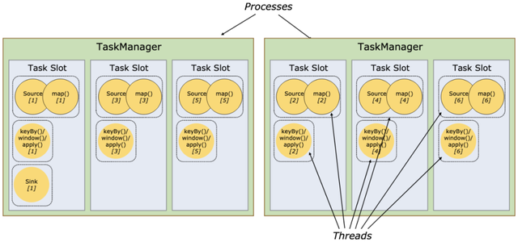

此时，Subtask的个数多于Slot了，所以出现了SlotSharing。一个Slot中分配了多个Subtask，特别是最左边的Slot中跑了一个完整的Pipeline。SlotSharing除了提高了资源利用率，还简化了并行度和Slot之间的关系：**一个Job运行需要的最少的Slot个数就是其中并行度最高的那个Task的并行度**（并行度最高和作业的最大并行度没有任何关系）。

## 5.2 Flink中的状态

Flink的一个算子可能会有多个子任务，每个子任务可能分布在不同的实例上，我们可以把Flink的状态理解为**某个算子的子任务在其当前实例上的一个变量，该变量记录了流过当前实例算子的历史记录产生的结果**。当新数据记录流入时，我们需要结合该结果（即状态）来进行计算。

实际上，Flink的状态是由算子的子任务来创建和管理的。一个状态的更新和获取的流程如下图所示，一个算子子任务接收输入流，获取对应的状态，根据新的计算结果更新状态。一个简单的例子是对一个时间窗口内流入的某个整数字段进行求和，那么当算子子任务接收到新元素时，会获取已经存储在状态中的数值（历史记录的求和结果），然后将当前输入加到状态上，并将状态数据更新。

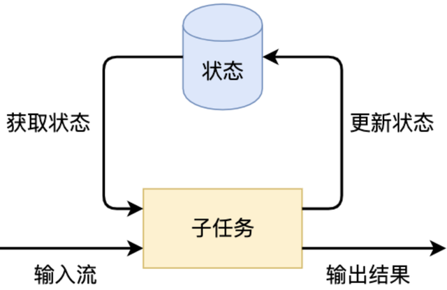

为了保证流式计算的高可用性（容错），**子任务的状态除了会暂存在节点内，还需要进行持久化存储（快照）**。

按照状态的管理方式来分，Flink有两种基本类型的状态：
* **托管状态**（Managed State）：Flink提供了有状态的计算能力，它封装了一些底层的实现，比如状态的高效存储、Checkpoint和Savepoint的持久化备份机制、计算资源扩缩容等能力。因为Flink接管了这些问题，开发者只需调用Flink API，这样可以更加专注于业务逻辑。
* **原生状态**（Raw State）：开发者自己管理的，需要自己序列化。实际上，在绝大多数场景下我们都不需要自行维护状态。

对Managed State继续细分，又可以分为两种类型：**Keyed State**和**Operator State**。

我们首先来看Keyed State。

如果对数据流按照某个关键字段（比如id字段）为Key进行了keyBy分组操作，得到就是一个类型为KeyedStream的数据流。**Keyed State就是这个KeyedStream上的状态**。数据流中所有相同id值的的记录共享一个状态（比如数据记录求和的值），可以访问和更新这个状态。以此类推，每个Key对应一个自己的状态。下图展示了Keyed State，因为一个算子子任务可以处理一到多个Key，算子子任务1处理了两种Key，两种Key分别对应自己的状态。

再来看Operator State。

顾名思义，Operator State就是算子上的状态，每个算子子任务管理自己的Operator State。虽然理论上它可以用在所有算子上，但在实际应用中它常常被用在Source或Sink等算子上，用来保存流入数据的偏移量或对输出数据做缓存，以保证Flink应用的Exactly-Once语义。每个算子的子任务或者说每个算子实例共享同一个状态，流入这个算子子任务的数据可以访问和更新这个状态。下图展示了Operator State，算子子任务1上的所有数据可以共享第一个Operator State，以此类推，每个算子子任务上的数据共享自己的状态。

无论是Keyed State还是Operator State，Flink的状态都是基于本地的，即每个算子子任务维护着这个算子子任务对应状态的存储，算子子任务之间的状态不能相互访问。

介绍完Keyed State和Operator State，我们再来看**状态的缩放**，即状态的横向扩展问题。该问题主要是指因为一些业务原因，需要修改Flink作业的并行度（比如，发现某个运行中的作业的某个算子的耗时较长，影响了整体的计算速度，需要重新调整该算子的并行度，以提升作业的整体处理速度；又比如，发现某个运行的作业的资源利用率不高，可以减少一些算子的并行度）。对于Flink而言，当某个算子的并行实例数或算子的子任务数发生了变化，应用需要关停或新启动一些算子子任务，某些原来在某个算子子任务上的状态数据需要平滑地更新到新的算子子任务上。

如下图所示，**Flink的Checkpoint机制，为状态数据在各算子间迁移提供了保障**。Flink定期将分布式节点上的状态数据生成快照（SNAPSHOT），并保存到分布式存储（如rocksDb或hdfs）上。横向伸缩后，算子子任务的个数发生变化，子任务重启，相应的状态从分布式存储上重建即可。

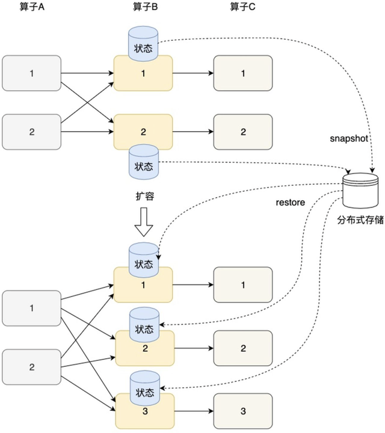

## 5.3 Flink中的时间

流式计算的应用通常都有强实时性或时间敏感性，因此在流式处理中，算子对流中的数据进行处理时采用不同的时间，就会直接影响算子的计算结果。目前Flink支持三种时间语义，如下图所示：

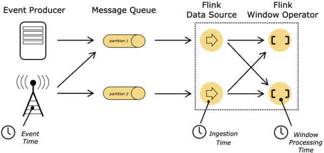

### 处理时间（Processing time）

处理时间是三种时间语义里最简单的一种。它跟具体执行任务的主机的系统时间有关。处理时间不要求在数据流与计算节点之间进行协同，因此相对于其他两种时间，基于处理时间的流计算作业在执行时，无需等待水位线的到来触发窗口，所以可以提供较低的延迟。

### 事件时间（Event time）

事件时间是指每个独立事件发生时所在设备上的时间。事件时间通常在事件进入Flink之前就已经被内嵌在事件中了，其时间戳可以从事件中提取出来。举例而言，一个小时的事件时间窗口将包含所携带的事件时间落在这一小时内的所有事件，而不管它们什么时候并且以怎样的顺序到达Flink。事件时间能够保证正确性，哪怕事件是无序的、延迟的甚至是从持久层的日志或者备份中恢复的。事件时间依赖于事件本身，而不依赖于执行任务的主机的时钟。

### 摄入时间（Ingestion time）

摄入时间指事件进入Flink的时间。作业在执行时，每个事件以执行source运算符对应的任务的节点的当前时钟作为时间戳。**摄入时间介于事件时间和处理时间之间**。跟处理时间相比，其开销会稍微大一点，但会更接近正确的结果。因为摄入时间使用稳定的时间戳，一旦到达source，事件时间戳就会被分配，在不同窗口之间流动的事件将始终携带着最初生成的时间戳，而对处理时间而言，由于各节点本地系统时钟的差异以及传输延迟等因素，原先在同一个窗口中的元素在后续可能会被分配到不同的窗口中去，从而导致了处理结果上的差异。跟事件时间相比，摄入时间不能处理任何的乱序或者延迟事件，但这些基于摄入时间的程序也无需指定生成水位线方式，且其延迟会比事件时间更小。摄入时间更多地被当作事件时间来处理，具备自动的时间戳分配以及水位线生成机制。

小结：由于处理时间不依赖水位线，所以**水位线实际上只在基于事件时间和摄入时间这两种时间类型下起作用**。

## 5.4 FLink中的水位线

支持事件时间的流处理引擎需要一种度量事件时间进度的方式。例如，一个运算符基于大小为一小时的事件时间窗口进行计算，需要被告知到达下一个完整小时的时间点（因为事件时间不依赖于当前节点的时钟），以便该运算符可以结束当前窗口。

> **在Flink计算引擎中度量事件时间进度的机制被称为水位线（Watermarks）**。水位线作为特殊的事件被注入到事件流中流向下游，设其携带时间戳`t`，则`Watermark(t)`定义了在一个流中事件时间已到达时间`t`，同时这也意味着所有的带有时间戳`t’（t’<t）`的事件应该已经发生并已被系统处理（这里说应该，是因为实际业务场景中可能还存在已发生但还没被处理的迟到元素）。

* Watermark是一种衡量Event Time进展的机制，可以设定延迟触发
* Watermark是用于处理乱序事件的，而正确的处理乱序事件，通常用Watermark机制结合window来实现;
* 数据流中的Watermark用于表示timestamp小于Watermark的数据，都已经到达了，因此，window的执行也是由Watermark触发的。
* watermark用来让程序自己平衡延迟和结果正确性

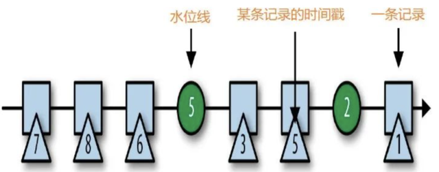

通常水位线在source中生成。每个source的并行任务都会生成各自的水位线从而产生并行流中的水位线场景。并行流中的水位线彼此互不依赖，它们在特定的并行source任务中定义各自的事件时间。

随着水位线的流动，它们会在到达下游某个运算符的任务实例时提升该任务的事件时间。一旦某个任务提升了它的事件时间，它也将为下游任务生成新的水位线并输出。

消费多个输入流的任务，例如，跟在keyBy和partition函数之后的运算符的任务，会在它们的每个输入流上跟踪事件时间。**任务的当前事件时间则由其所有输入流的最小事件时间决定**。

下图展示了事件和水位线流经并行数据流以及并行执行的任务跟踪事件时间的示例：

从上图中我们看到window运算符的两个并行任务实例都接收上游map运算符的两个并行任务实例的输出作为其输入。以window运算符的第一个子任务为例，它从上游的两个输入流中接收事件时间为29和14的两个元素，基于最小事件时间原则，该任务当前的事件时间为14。

现实世界中，在Event Time的语义下，可能会出现Watermark(t)到达某个算子后，仍然有一些时间戳为`t’（t’<=t）`的元素随后到达，甚至`t’`比`t`小任意值都是有可能的，这些元素就是**迟到元素**。为了支持小于水位线基准的迟到元素被正确处理，通常需要界定一个合适的允许迟到的最大时间范围，这个范围是权衡的结果，它不可能非常大，因为这将严重拖慢事件时间窗口的计算。

**Flink在事件时间窗口中对迟到元素提供了支持并允许设置一个明确的最大允许迟到时间**。该值默认为零，也就是说默认情况下，迟到元素将会被删除，而如果设置了该值，在迟到时间范围内的元素仍然会被加入到窗口中，依赖于事件时间触发器的逻辑，迟到的元素可能会导致窗口被重新计算（重新计算可能会产生重复甚至错误的输出，需要考虑去重方案）。

## 5.5 Flink中的时间窗口

窗口将无界流切片成一系列有界的数据集。窗口基本上都是基于时间的，不过也有些系统支持基于元组（tuple-based）的窗口，这种窗口可以认为是基于一个逻辑上的时间域，该时间域中的元素包含顺序递增的逻辑时间戳。从窗口所应用到的数据集的完整度来看，窗口要么是对齐的，要么是非对齐的，对齐的窗口可以应用到整个数据集上，而非对齐的窗口只能应用在整个数据集的子集上（比如某些特定的键对应的数据集）。Flink目前支持的窗口类型列举如下：

### 固定窗口（Fixed Windows）

固定窗口按固定的时间段或长度（比如小时或元素个数）来分片数据集。固定窗口可应用到数据集中的所有数据上，因此它通常被称为**对齐窗口**。但有时为了把窗口计算的负荷均匀分摊到整个时间范围内，会把固定窗口的边界时间加上一个随机数，这样的固定窗口则变成了不对齐窗口。

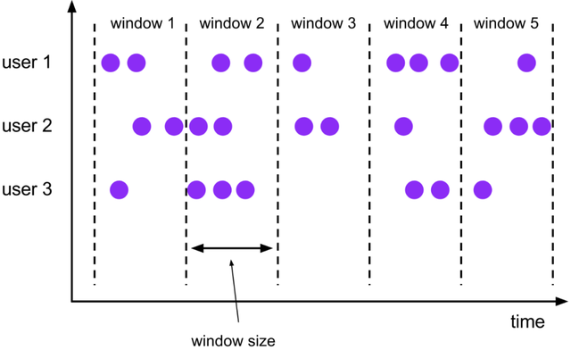

### 滑动窗口（Sliding Windows）

它是固定窗口的一般化形式。由窗口大小以及滑动周期构成（比如以小时作为窗口大小，分钟作为滑动周期）。如果滑动周期小于窗口大小，那么窗口会发生部分重叠；而如果滑动周期跟窗口大小相等，则该窗口就是固定窗口。滑动窗口通常也是对齐的，出于性能考虑某些情况下也可以是非对齐的。需要注意的是，上图为了表明滑动的性质而没有把每个窗口对应到所有的键，实际情况是每个窗口都会对应到所有的键。

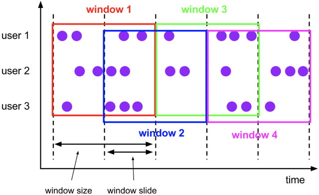

### 会话窗口（Session Windows）

它是一种动态窗口，用于在数据的子集上（比如某个键所对应的数据集）捕获一些活跃的阶段性的数据集。通常会话窗口会定义一个超时时间间隙（Gap），任何发生在小于超时时间点的持续时间段内的事件都归属于同一个会话。会话窗口是非对齐窗口。会话窗口常用于用户行为分析，即观察在一个会话窗口内用户的一系列操作所产生的事件。

Flink还在不断迭代支持更多类型的窗口，感兴趣的可以查看最新版的文档。

## 5.6 Checkpoint和Savepoint

Flink定期将分布式节点上的状态数据保存到远程存储设备（比如rocksDB或者hdfs等）上，故障发生后从之前的备份中恢复，整个被称为**Checkpoint机制**。**它为Flink提供了Exactly-Once的计算保障**。

首先，一个简单的Checkpoint的大致流程包含以下三步：

1. 暂停处理新流入数据，将新数据缓存起来。
2. 将算子子任务的本地状态数据（只拷贝状态数据，新流入的流数据不需要拷贝）拷贝到一个远程的持久化存储上。
3. 继续处理新流入的数据，包括刚才缓存起来的数据。

下面详细进行说明。在介绍Flink的快照流程之前，我们需要先了解**检查点的分界线**（Checkpoint Barrier）概念。它和Watermark类似，也是作为特殊事件被注入到事件流中流向下游。如下图所示，Checkpoint Barrier被插入到数据流中，它将数据流切分成段。**Flink的Checkpoint逻辑是，一段新数据流入导致状态发生了变化，Flink的算子接收到Checpoint Barrier后，对状态进行快照**。每个Checkpoint Barrier有一个ID，表示该段数据属于哪次Checkpoint。如图所示，当ID为n的Checkpoint Barrier到达每个算子后，表示要对n-1和n之间状态的更新做快照。Checkpoint Barrier有点像Event Time中的Watermark，它被插入到数据流中，但并不影响数据流原有的处理顺序。

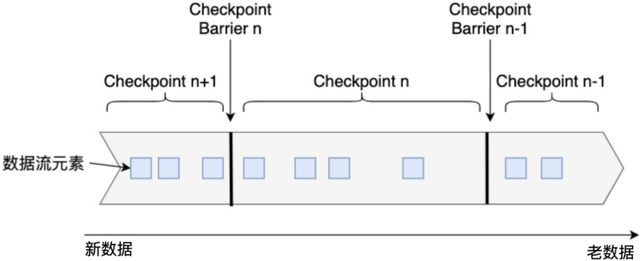

Flink的重启恢复逻辑相对比较简单：

1. 重启应用，在集群上重新部署数据流图。
2. 从持久化存储上读取最近一次的Checkpoint数据，加载到各算子子任务上。
3. 继续处理新流入的数据。

这样的机制就保证了Flink内部状态的Excatly-Once一致性。至于端到端的Exactly-Once一致性，要根据Source和Sink的具体实现而定。当发生故障时，一部分数据有可能已经流入系统，但还未进行Checkpoint，Source的Checkpoint记录了输入的Offset；当重启时，Flink能把最近一次的Checkpoint恢复到内存中，并根据Offset，让Source从该位置重新发送一遍数据，以保证数据不丢不重。像Kafka等消息队列是提供重发功能的，而socketTextStream就不具有这种功能，也意味着不能保证Exactly-Once投递保障。

最后，简单来说下Checkpoint和Savepoint的区别。

**Flink Checkpoint是一种容错恢复机制**。这种机制保证了实时程序运行时，即使突然遇到异常也能够进行自我恢复。Checkpoint对于用户层面，是透明的，用户会感觉程序一直在运行。Flink Checkpoint是Flink自身的系统行为，用户无法对其进行交互，用户可以在程序启动之前，设置好实时程序Checkpoint相关参数，当程序启动之后，剩下的就全交给Flink自行管理。当然在某些情况，比如Flink On Yarn模式，某个Container 发生OOM异常，这种情况程序直接变成失败状态，此时Flink程序虽然开启Checkpoint也无法恢复，因为程序已经变成失败状态，所以此时可以借助外部参与启动程序，比如外部程序检测到实时任务失败时，从新对实时任务进行拉起。

**Flink Savepoint可以把它当做在某个时间点程序状态全局镜像**，以后程序在进行升级，或者修改并发度等情况，还能从保存的状态位继续启动恢复。Flink Savepoint一般存储在hdfs上面，它需要用户主动进行触发。如果是用户自定义开发的实时程序，比如使用DataStream进行开发，建议为每个算子定义一个uid，这样我们在修改作业时，即使导致程序拓扑图改变，由于相关算子uid没有变，那么这些算子还能够继续使用之前的状态，如果用户没有定义uid，Flink会为每个算子自动生成uid，如果用户修改了程序，可能导致之前的状态程序不能再进行复用。

Checkpoint和Savepoint的差异对比如下：
* checkpoint的侧重点是“容错”，即Flink作业意外失败并重启之后，能够直接从早先打下的checkpoint恢复运行，且不影响作业逻辑的准确性。而savepoint的侧重点是“维护”，即Flink作业需要在人工干预下手动重启、升级、迁移或A/B测试时，先将状态整体写入可靠存储，维护完毕之后再从savepoint恢复现场。
* savepoint是“通过checkpoint机制”创建的，所以savepoint本质上是特殊的checkpoint。
* checkpoint面向Flink Runtime本身，由Flink的各个TaskManager定时触发快照并自动清理，一般不需要用户干预；savepoint面向用户，完全根据用户的需要触发与清理。
* checkpoint的频率往往比较高（因为需要尽可能保证作业恢复的准确度），所以checkpoint的存储格式非常轻量级，但作为trade-off牺牲了一切可移植（portable）的东西，比如不保证改变并行度和升级的兼容性。savepoint则以二进制形式存储所有状态数据和元数据，执行起来比较慢而且“贵”，但是能够保证portability，如并行度改变或代码升级之后，仍然能正常恢复。
* checkpoint是支持增量的（通过RocksDB），特别是对于超大状态的作业而言可以降低写入成本。savepoint并不会连续自动触发，所以savepoint没有必要支持增量。

