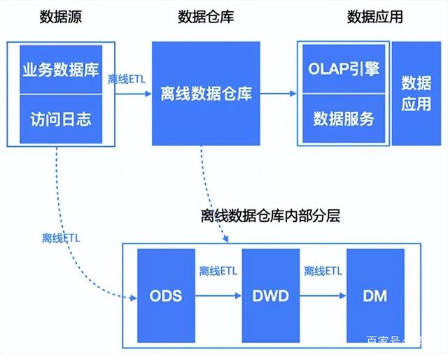
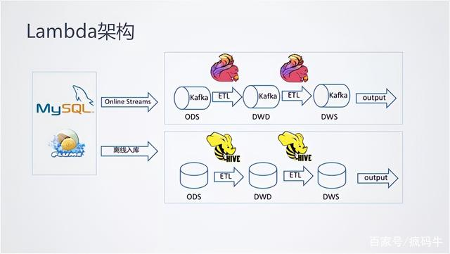
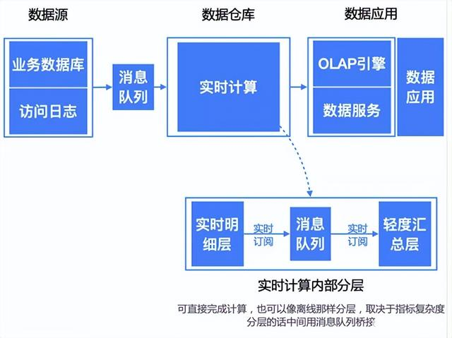
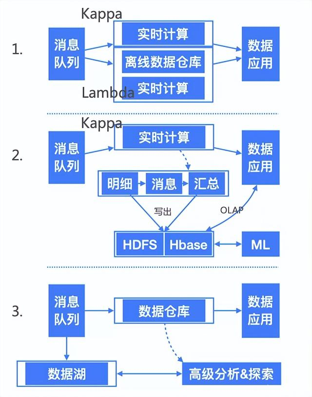

# 1 流批一体的理念
随着互联网和移动互联网的不断发展，各行各业都积累海量的业务数据。而企业为了改善用户体验，提升产品在市场上的竞争力，都采取了实时化方式来处理大数据。社交媒体的实时大屏、电商的实时推荐、城市大脑的实时交通预测、金融行业的实时反欺诈，这些产品的成功都在说明大数据处理的实时化已经成为一个势不可挡的潮流。

在实时化的大趋势下，Flink 已经成为实时计算行业的事实标准。国内外各个领域的头部厂商，都把 Flink 作为实时计算的技术底座，国内有字节跳动、腾讯、华为，国外有 Netflix、Uber 等。

而业务实时化只是一个起点，Flink 的目标之一就是给用户提供实时离线一体化的用户体验。其实，很多企业不仅需要实时的数据统计，为了验证运营或产品策略的效果，还需要将实时数据与历史数据（如昨天甚至去年同期的数据）进行对比分析。而从用户的角度来看，原有的流、批独立方案存在一些痛点：

* **人力成本比较高**。由于流和批是两套系统，相同的逻辑需要两个团队开发两遍。
* **数据链路冗余**。在很多的场景下，流和批计算内容其实是一致的，但是由于是两套系统，所以相同逻辑还是需要运行两遍，产生一定的资源浪费。
* **数据口径不一致**。这个是用户遇到的最重要的问题。两套系统、两套算子、两套 UDF，一定会产生不同程度的误差，这些误差给业务方带来了非常大的困扰。这些误差不是简单依靠人力或者资源的投入就可以解决的。

2020 年，阿里巴巴实时计算团队提出“**流批一体**”的理念，期望依托 Flink 框架解决企业数据分析的三个核心问题，理念中包含三个着力点，分别是一套班子、一套系统、一个逻辑。

* **一套班子**：统一开发人员角色，现阶段企业数据分析有两个团队，一个团队负责实时开发，一个团队负责离线开发，在流批一体的理念中，期望促进两个团队的融合。
* **一套系统**：统一数据处理技术，不管实时开发，还是离线开发都是用 Flink 框架进行，如非必要，尽可能少用其他系统。
* **一个逻辑**：当前企业数据分析，有两套班子，两套技术体系，两套计算模式，导致实时数据和离线数据经常对不上，期望通过 Flink SQL 的方式，让离线和实时计算逻辑保持一致。

简言之，**流批一体**的理念即：

> 使用同一套 API、同一套开发范式来实现大数据的流计算和批计算，进而保证处理过程与结果的一致性。

但是，之前 Flink 一直强调的仅仅是计算层的流批一体，至于流批一体，还有哪些层面呢？

* **数据集成流批一体**：离线与实时是否使用统一数据采集方式；如统一通过 CDC 或者 OGG 将数据实时捕获推送到 Kafka，批与流再从 Kafka 中消费数据，载入明细层。

* **数据存储流批一体**：离线与实时数据是否统一分层、统一存储；兼顾数据的一致性和实时性。

* **处理逻辑流批一体**：流与批处理是否使用统一 SQL 语法或者 ETL 组件，再通过底层分别适配流与批计算引擎，保证数据口径的一致性。

* **计算引擎流批一体**：流与批使用同一套计算引擎，从根本上避免同一个处理逻辑流批两套代码问题。

在解决了计算层的问题之后，掣肘流批一体的核心便落在了数据存储上。过去，实时链路多采用 Kafka 等消息队列，但中间数据不利于直接分析；若导出至 Hive 则时效性骤降，导入 OLAP 引擎又会增加系统复杂度。令人欣慰的是，经过近几年的发展，以 Apache Paimon（源自 Flink Table Store）为代表的流批一体存储方案已经走向成熟。它们不仅补齐了 Flink 生态在存储层的短板，更让“计算引擎 + 数据存储”的流批一体成为了现实，彻底改变了行业的架构范式。

# 2 实时数仓的演进

提到 Flink 发展存储系统，我们不得不先回顾传统大数据架构的演化过程，以史为镜，才能发现存储计算一体化的重要性和紧迫性。

实时数仓的架构，从经典的主题建模，到维度建模，再到 Hadoop 体系，后来的 Lambda 架构、Kappa 架构在逐步完善，但一直没有形成完整的解决方案。

## 2.1 离线数仓

使用 Hadoop 平台的 Hive 做数据仓库，报表层数据保存在 MySQL 中，使用 Tableau 做报表系统，这样不用担心存储问题，计算速度也大大加快了。在此基础上，提供 Hue 给各个部门使用，这样简单的取数工作可以由运营自己来操作，使用 Presto 可以做 MySQL、Hive 的跨库查询，大大提升了查询效率。

## 2.2 Lambda 架构

为了计算一些实时指标，就在原来离线数仓的基础上增加了一个实时计算的链路，并对数据源做流式改造（即把数据发送到消息队列），实时计算去订阅消息队列，直接完成指标增量的计算，推送到下游的数据服务中去，**由数据服务层完成离线 & 实时结果的合并**。

需要注意的是，流处理计算的指标批处理依然会计算，最终以批处理为准，即每次批处理计算后会覆盖流处理的结果（这仅仅是流处理引擎不完善做的折中）。

Lambda 架构整合了离线计算和实时计算，遵循不可变性（Immutability）、读写分离和复杂性隔离等一系列架构原则，可集成 Hadoop、Kafka、Storm、Spark、HBase 等各类大数据组件。

**同样的需求需要开发两套一样的代码，这是 Lambda 架构最大的问题**，两套代码不仅仅意味着开发困难（同样的需求，一个在批处理引擎上实现，一个在流处理引擎上实现，还要分别构造数据测试保证两者结果一致），后期维护更加困难，比如需求变更后需要分别更改两套代码，独立测试结果，且两个作业需要同步上线。

此外，同样的逻辑计算两次，整体资源占用会增多（多出实时计算这部分）。下游需要整合实时和离线处理结果，处理比较复杂。

## 2.3 Kappa 架构

再后来，实时的业务越来越多，事件化的数据源也越来越多，**实时处理从次要部分变成了主要部分**，架构也做了相应调整，出现了以实时事件处理为核心的 Kappa 架构。当然要实现这一变化，还需要技术本身的革新——Flink，Flink 的出现使得 Exactly-Once 和状态计算成为可能，这个时候实时计算的结果才能保证最终结果的准确性。

Lambda 架构虽然满足了实时的需求，但带来了更多的开发与运维工作，其架构背景是流处理引擎还不完善，流处理的结果只作为临时的、近似的值提供参考。后来随着 Flink 等流处理引擎的出现，流处理技术很成熟了，这时为了解决两套代码的问题，LinkedIn 的 Jay Kreps 提出了 Kappa 架构。

Kappa 架构可以视为 Lambda 架构的简化版，即去除了其中的批处理链路。在 Kappa 架构中，需求修改或历史数据重新处理都通过上游重放完成。

存在的问题：Kappa 架构最大的问题是**流式重新处理历史的吞吐能力会低于批处理**，但这个可以通过增加计算资源来弥补。

## 2.4 混合架构

在真实的场景中，很多时候并不是完全规范的 Lambda 架构或 Kappa 架构，可以是两者的混合，比如大部分实时指标使用 Kappa 架构完成计算，少量关键指标（比如金额相关）使用 Lambda 架构用批处理重新计算，增加一次校对过程。

Kappa 架构并不是中间结果完全不落地，现在很多大数据系统都需要支持机器学习（离线训练），所以实时中间结果需要落地到对应的存储引擎供机器学习使用，另外有时候还需要对明细数据进行查询，这种场景也需要把实时明细层写出到对应的引擎中。

还有就是 Kappa 这种以实时为主的架构设计，除了增加了计算难度，对资源提出了更高的要求之外，还增加了开发的难度，所以才有了下面的混合架构，可以看出这个架构的出现，完全是出于需求和现状考虑的。

混合架构在解决了部分业务问题的同时，也带来了架构的复杂性，在计算引擎及存储介质上，存在多元性，那么不管是学习成本还是开发成本以及后期的维护成本，都是指数级的增长，未必是一种最优的选择。

同样，混合架构支持实时入湖、入湖后实时增量分析，但这些场景的实时性大打折扣，因为数据湖存储格式本质还是 mini-batch，实时计算在混合架构中退化到 mini-batch 模式。毫无疑问，这对实时性要求很高的业务是很大的灾难。

# 3 流式数仓

数据集成、不同数据源之间的数据同步对于很多团队来说是刚需，但传统方案往往复杂度太高且时效性不好。传统的数据集成方案通常是离线数据集成和实时数据集成分别采用两套技术栈，其中涉及很多数据同步工具，比如 Sqoop、DataX 等，这些工具要么只能做全量，要么只能做增量，开发者需要自己控制全量与增量的切换，配合起来比较复杂。

在这个背景下，**Flink CDC** 应运而生，专门用于对变更数据进行实时捕获。基于 Flink 强大的流批一体能力和 Flink CDC，如今只需编写一条 SQL，就可以实现先全量同步历史数据，再自动断点续传增量数据的一站式数据集成。全程无需用户判断和干预，Flink 能自动完成批流之间的切换并保证数据的一致性。

Flink 可以让当前业界主流数仓架构再进阶一层，实现真正端到端全链路的实时化分析能力，即：当数据在源头发生变化时就能捕捉到这一变化，并支持对它做逐层分析，让所有数据实时流动起来，并且对所有流动中的数据都可以实时查询。再借助 Flink 完备的流批一体能力，使用同一套 API 就可以同时支持灵活的离线分析。这样一来，实时、离线以及交互式查询分析、短查询分析等，就可以统一成一整套解决方案，成为理想中的“**流式数仓**（Streaming Warehouse）”。

流式数仓更准确地说，其实是“make data warehouse streaming”，就是让整个数仓的数据全实时地流动起来，且是以纯流的方式而不是微批（mini-batch）的方式流动。目标是实现一个具备端到端实时性的纯流服务（Streaming Service），用一套 API 分析所有流动中的数据，当源头数据发生变化，比如捕捉到在线服务的 Log 或数据库的 Binlog 以后，就按照提前定义好的 Query 逻辑或数据处理逻辑，对数据进行分析，分析后的数据落到数仓的某一个分层，再从第一个分层向下一个分层流动，然后数仓所有分层会全部流动起来，最终流到一个在线系统里，用户可以看到整个数仓的全实时流动效果。

在这个过程中，**数据是主动的，而查询是被动的，分析由数据的变化来驱动**。同时在垂直方向上，对每一个数据明细层，用户都可以执行 Query 进行主动查询，并且能实时获得查询结果。此外，它还能兼容离线分析场景，API 依然是同一套，实现真正的一体化。

近年来，随着数据湖存储格式的成熟，端到端全流式链路的解决方案已在业界逐步落地。虽然有纯流的方案和纯交互式查询的方案，但用户往往需要自行将多套方案组合起来，这在一定程度上增加了系统的复杂性。流式数仓要做的，正是在实现高时效性的同时，不进一步提高系统复杂性，让整个架构对于开发和运维人员来说都更加简洁。

当然，流式数仓作为理想终态，要达成这个目标，需要配套的流批一体存储支持。其实 Flink 本身有内置的分布式 RocksDB 作为 State 存储，但这个存储只能解决任务内部流数据状态的存储问题。

流式数仓需要一个计算任务之间的表存储服务：第一个任务将数据写进去，第二个任务就能从它实时地再读出来，第三个任务还能对它执行用户的 Query 分析。因此，Flink 社区孵化了具备流表二象性的存储方案，即 **Apache Paimon**（源自 Flink Table Store）。

Apache Paimon 可以理解为一套流批一体的存储，并无缝对接 Flink SQL。原来 Flink 只能读写像 Kafka、HBase 这样的外部表，现在用同一套 Flink SQL 语法就可以像原来创建源表和目标表一样，创建一个 Paimon 表。

流式数仓的分层数据可以全部放到 Apache Paimon 中，通过 Flink SQL 就能实时地串联起整个数仓的分层，既可以对 Paimon 中不同明细层的数据做实时查询和分析，也可以对不同分层做批量 ETL 处理。

从数据结构上看，Paimon 内部有两个核心存储组件，分别是 File Store 和 Log Store。顾名思义，File Store 是 Table 的文件存储形式，采用经典的 LSM 架构，支持流式的更新、删除、增加等；同时，采用开放的列存结构，支持压缩等优化；它对应 Flink SQL 的批模式，支持全量批式读取。而 Log Store 存储的是 Table 的操作记录，是一个不可变更序列，对应 Flink SQL 的流模式，可以通过 Flink SQL 订阅 Paimon 的增量变化做实时分析，目前支持插件化实现。

如今，利用 Flink CDC、Flink SQL 以及成熟的流式存储（如 Apache Paimon），我们已经能够构建起完整的流式数仓，实现实时离线一体化及对应计算存储一体化的体验。而面向未来，如何进一步降低运维门槛、提升极致性能，将是该技术继续精进的方向。
