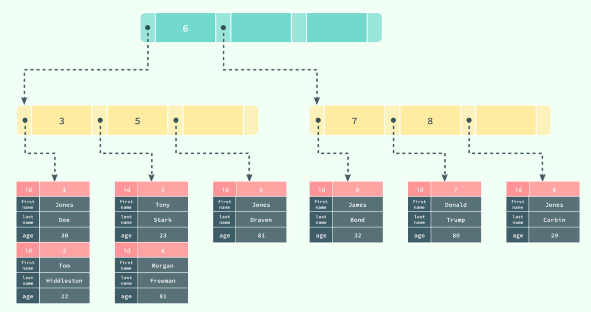
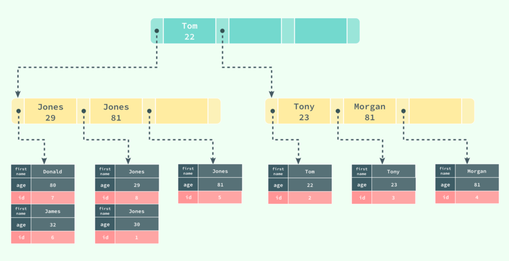
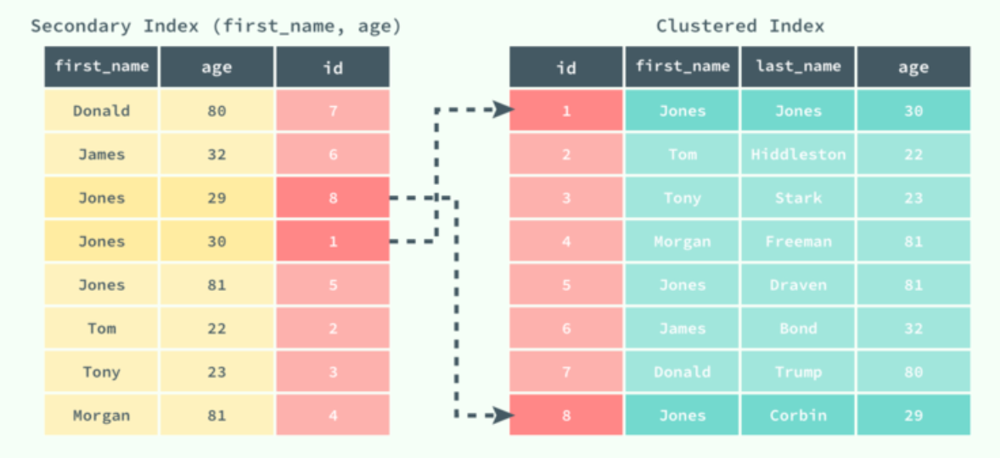
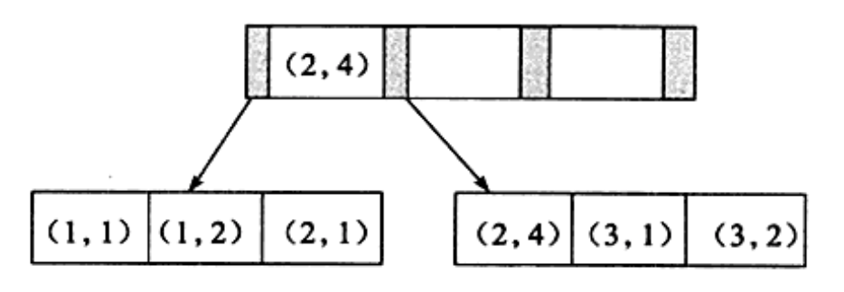

# 1、索引组织表

> 在InnoDB中，表都是根据主键顺序组织存放的，称为**索引组织表**（index organized table）。

每张表都有个主键，如果没有显示地定义主键，则会按照如下方式选择或创建主键：

- 如果有非空唯一索引，以建表时第一个定义的非空唯一索引作为主键
- 如果没有非空唯一索引，InnoDB会自动创建一个6字节大小的rowid作为主键

InnoDB 存储引擎在绝大多数情况下使用 B+ 树建立索引，这是关系型数据库中查找最为常用和有效的索引，但是 B+ 树索引并不能找到一个给定键对应的具体值，它只能找到数据行对应的页，数据库把整个页读入到内存中，并在内存中查找具体的数据行。

# 2、聚集索引与辅助索引

数据库中的 B+ 树索引可以分为**聚集索引**（clustered index）和**辅助索引**（secondary index），它们之间的最大区别就是，聚集索引中存放着一条行记录的全部信息，而辅助索引中只包含索引列和一个用于查找对应行记录的“书签”。

## 2.1 聚集索引

> **聚集索引**就是按照每张表的主键构造一棵B+树，同时叶子节点中存放的即为整张表的行记录数据，也将聚集索引的叶子节点成为**数据页**。

如果使用下面的 SQL 在数据库中创建一张：

```mysql
CREATE TABLE users( 

id INT NOT NULL, 

first_name VARCHAR(20) NOT NULL, 

last_name VARCHAR(20) NOT NULL, 

age INT NOT NULL, 

PRIMARY KEY(id), 

KEY(last_name, first_name, age) 

KEY(first_name) 

)
```

B+ 树就会使用 id 作为索引的键，并在叶子节点中存储一条记录中的所有信息:



聚集索引决定了数据的物理顺序，所以**每张表应该有且仅有一个聚集索引**（绝大多数情况下都是主键），表中的所有行记录数据都是按照聚集索引的顺序存放的，即只要索引是相邻的，那么对应的数据一定也是相邻地存放在磁盘上的。

在多数情况下，查询优化器倾向于采用聚集索引，因为聚集索引能够在B+树索引的叶子节点上直接找到数据，不需要进行第二次操作。此外，由于定义了数据的逻辑顺序，聚集索引对于主键的排序查找和范围查找非常快。

## 2.2 辅助索引

> 所有的非聚集索引都称为为辅助索引。
>

辅助索引也是通过 B+ 树实现的，但是它的叶节点并不包含行记录的全部数据，仅包含索引中的所有键和一个用于查找对应行记录的“书签”，**在 InnoDB 中这个书签就是当前记录的主键**。

辅助索引的存在并不会影响聚集索引，因为聚集索引构成的 B+ 树是数据实际存储的形式，而辅助索引只用于加速数据的查找，所以一张表上往往有多个辅助索引以此来提升数据库的性能。

如果在表 `users` 中存在一个辅助索引 `(first_name, age)`，那么它构成的 B+ 树大致就是下图这样：



按照 `(first_name, age)` 的字母顺序对表中的数据进行排序，当查找到主键时，再通过聚集索引获取到整条行记录。

例如执行下面的查询语句：

```mysql
select * from users where first_name = "Jones" and age <=30
```

数据库首先通过辅助索引查找到对应的主键，然后在聚集索引中使用主键获取对应的行记录。

示意图如下：



## 2.3 总结

聚集索引表记录的排列顺序与索引的排列顺序一致，优点是查询速度快，因为一旦具有第一个索引值的纪录被找到，具有连续索引值的记录也一定物理的紧跟其后。

聚集索引的缺点是对表进行修改速度较慢。为了保持表中的记录的物理顺序与索引的顺序一致，必须在数据页中进行数据重排，降低了执行速度。

建议使用聚集索引的场合为：

- 此列包含有限数目的不同值
- 查询的结果返回一个区间的值
- 查询的结果返回某值相同的大量结果集

非聚集索引指定了表中记录的逻辑顺序，物理顺序和索引的顺序不一致，所以往往需要回表进行二次查询才能定位到真正的记录。

非聚集索引比聚集索引层次多，添加记录不会引起数据顺序的重组，所以修改操作要比聚集索引更加快速。

建议使用非聚集索引的场合为：

- 此列包含了大量数目不同的值
- 查询的结束返回的是少量的结果集
- order by 子句中使用了该列

# 3、联合索引

## 3.1 联合索引的特性

> 联合索引，也称复合索引，指由两个或以上的字段共同构成一个索引。

从本质上来说，联合索引也是一棵B+树，不同的是联合索引的键值数量不是1，而是大于等于2。

例如，有一个表使用两个整形列a和b建立了联合索引：



其实和单个键值的B+树没什么不同，键值都是排序的，通过叶子节点可以逻辑上顺序地读出所有数据，就上面的例子来说，即(1,1)、(1,2)、(2,1)、(2,4)、(3,1)、(3,2)是按照**先a后b的顺序排列**。

## 3.2 最左前缀匹配原则

MySQL 建立联合索引的规则是这样的：它会首先根据联合索引中最左边的、也就是第一个字段进行排序，在第一个字段排序的基础上，再对联合索引中后面的第二个字段进行排序，依此类推。

因此，对于查询

`select * from table where a = xxx and b = xxx`

显然可以使用`(a,b)`这个联合索引。对于单个的a列查询

`select * from table where a = xxx`

也可以使用这个联合索引。但是对于b列的查询

`select * from table where b = xxx`

则不可以使用这棵B+树索引，**因为b列的值1、2、1、4、1、2不是有序的**。

综上，第一个字段是绝对有序的，从第二个字段开始是无序的，这就解释了为什么直接使用第二字段进行条件判断用不到索引了：从第二个字段开始，无序，无法走 B+ Tree 索引。

以上可以归纳为联合索引的**最左前缀匹配原则**：

> 当查询条件**精确匹配**左边连续一个或多个列时，索引可以被使用，但只能使用一部分

描述比较抽象，下面通过一个更详细的例子来说明。

一个表`test`建有联合索引`index(a, b, c)`，则相当于同时生效了`index(1)`、`index(a, b)`、`index(a, b, c)`三个索引。不同查询语句对应的索引使用情况如下：

| SQL                                            | 是否使用索引 |
| ---------------------------------------------- | ------------ |
| `select * from test where a=x`                 | 是           |
| `select * from test where a=x and b=y`         | 是           |
| `select * from test where a=x and b=y and cz1` | 是           |
| `select * from test where b=y and c=z`         | 否           |
| `select * from test where b=y`                 | 否           |
| `select * from test where c=z`                 | 否           |
| `select * from test where a=x  and c=z`        | 是           |

从形式上看就是索引向左侧聚集，所以叫做最左前缀匹配原则，因此最常用的条件应该放到联合索引的最左侧。

最左前缀匹配原则可以通过以下这几个特性来理解：

- 联合查询条件符合“交换律”，也就是where a = 1 and b = 1 等价于 where b = 1 and a = 1。
- = 和 in 可以乱序，比如针对查询条件a = 3 and b = 4 and c = 5 ，index（a，b，c）可以任意顺序。
- 对于联合索引，MySQL 会一直向右匹配直到遇到范围查询（> ， < ，between，like）就停止匹配。比如 a = 3 and b = 4 and c > 5 and d = 6，如果建立的是（a,b,c,d）这种顺序的索引，那么 d 是用不到索引的，但是如果建立的是 （a,b,d,c）这种顺序的索引的话，那么就没问题，而且 a，b，d 的顺序可以随意调换。

- 如果建立的索引顺序是 （a，b）那么直接采用 where b = 5 这种查询条件是无法利用到索引的，这一条最能体现最左匹配的特性。

## 3.3 ref与index

有点需要特别注意，针对上面的第4点，`无法利用索引`**不是说查询过程不会使用联合索引，而是达不到索引预期的效果**。仍然用一个例子说明。

对于联合索引(col1,col2,col3)，查询语句`SELECT * FROM test WHERE col2=2;`是否能够触发索引？
大多数人都会说NO，实际上却是YES。

使用`EXPLAIN`来分析以下两个语句：

```mysql
`EXPLAIN ``SELECT` `* ``FROM` `test ``WHERE` `col2=2;``EXPLAIN ``SELECT` `* ``FROM` `test ``WHERE` `col1=1;`
```

观察上述两个explain结果中的type字段。查询中分别是：

- type: **index**

  这种类型表示MySQL会对整个该索引进行扫描。只要是索引，或者某个联合索引的一部分，MySQL都可能会采用index类型的方式扫描。不过效率不高，按索引次序扫描，先读索引，再读实际的行，结果还是**全表扫描**，主要优点是避免了排序，因为索引是排好的。

- type: **ref**

  这种类型表示MySQL会根据特定的算法快速查找到某个符合条件的索引，而不是会对索引中每一个数据都进行一一的扫描判断。而要想实现这种效果，索引索引就要满足特定的数据结构。简单说，也就是**索引字段的数据必须是有序的**，才能实现这种类型的查找，才能利用到索引。

我们通常所说的“用到了索引”是狭义地指`ref`这种情况，也就是达到了快速查找的效果。而`index`也会触发索引，只是达不到快速查找的效果而已。

## 3.4 为什么要使用联合索引

- **减少开销**

  建一个联合索引(col1,col2,col3)，实际相当于建了(col1),(col1,col2),(col1,col2,col3)三个索引。每多一个索引，都会增加写操作的开销和磁盘空间的开销。对于大量数据的表，使用联合索引会大大的减少开销

- **覆盖索引**

  对联合索引(col1,col2,col3)，如果有如下的sql: `select col1,col2,col3 from test where col1=1 and col2=2`，那么MySQL可以直接通过遍历索引取得数据，而无需回表，这减少了很多的随机io操作。减少io操作，特别的随机io其实是DBA主要的优化策略。所以，在真正的实际应用中，覆盖索引是主要的提升性能的优化手段之一。

- **效率高**

  索引列越多，通过索引筛选出的数据越少。有1000W条数据的表，有如下sql:`select from table where col1=1 and col2=2 and col3=3`，假设假设每个条件可以筛选出10%的数据，如果只有单值索引，那么通过该索引能筛选出1000w乘10%=100w条数据，然后再回表从100w条数据中找到符合`col2=2 and col3= 3`的数据，然后再排序，再分页；如果是联合索引，通过索引筛选出1000w乘10%乘10% 乘10%=1w，效率提升可想而知。

联合索引的另一个好处是，第二个列在小范围内有序。虽然b列的值整体无序，但是当a列限定为一个定值的时候，b列相对有序。利用这个特性，在查询中使用排序(DESC、ASC)、分组（GROUP BY）等语句时，可以免去一次filesort排序操作。

对于联合索引`(a,b)`，下列语句可以直接通过索引得到结果：

`select ... from table where a = xxx order by b`

对于联合索引`(a,b,c)`来说，下列语句同样可以直接通过索引得到结果：

`select ... from table where a = xxx order by b`

`select ... from table where a = xxx and b = xxx order by c`

但是对于下面的语句，联合索引不能直接得到结果，还需要执行一次filesort排序操作，因为索引`(a,c)`并未排序：

`select ... from table where a = xxx order by c`


# 4、索引覆盖

InnoDB支持**索引覆盖**（covering index），即从辅助索引中就可以查询到记录，而不需要查询聚集索引中的记录。使用索引覆盖的一个好处是辅助索引不包含整行记录的所有信息，故其大小要远小于聚集索引，可以减少大量的IO操作。

索引覆盖的另一个好处是对于某些统计问题，如

`select count(*) from table`

如果有辅助索引，InnoDB更倾向于选择辅助索引，而非聚集索引来进行统计。

```mysql
mysql> explain select count(*) from t\G;
*************************** 1. row ***************************
           id: 1
  select_type: SIMPLE
        table: t
   partitions: NULL
         type: index
possible_keys: NULL
          key: idx_c
      key_len: 4
          ref: NULL
         rows: 2
     filtered: 100.00
        Extra: Using index
```

possible_keys为NULL，但是实际执行时优化器却选择了indx_c索引，而Extra中的Using index表明优化器进行了索引覆盖操作。

表中有a、b列的联合索引时，如果对b列进行了查询过滤，一般是无法利用索引的，但是如果是统计操作，并且可以利用索引覆盖，优化器会选择该联合索引，如

`select count(*) from table where b < 100 and b> 0`

# 5、 Cardinality

对于什么时候添加B+树索引，一般的经验是，在访问表中很少一部分时使用B+树索引才有意义。比如对于性别、省份、学历等字段可取值范围很小，称为**低选择性**。如

`SELECT * FROM student WHERE sex='M'`

按性别进行查询时，可取值一般只有M、F。因此SQL语句得到的结果可能是该表50%的数据，这时添加B+树索引是完全没有必要的。相反，如果某个字段的取值范围很广，几乎没有重复，属于**高选择性**。则此时使用B+树的索引是最合适的。例如手机号、邮箱，基本上在一个应用中不允许重复出现。

可以使用命令`show index`查看`Cardinality`信息：

```mysql
mysql> show index from t\G;
*************************** 1. row ***************************
        Table: t
   Non_unique: 0
     Key_name: PRIMARY
 Seq_in_index: 1
  Column_name: a
    Collation: A
  Cardinality: 2
     Sub_part: NULL
       Packed: NULL
         Null:
   Index_type: BTREE
      Comment:
Index_comment:
```

- Table：表的名称
- Non_unique：索引是否唯一，如果可以，则为1的，否则，为0
- Key_name：索引的名称
- Seq_in_index：索引中的列序列号，从1开始
- Column_name：列名称
- Collation：列以什么方式存储在索引中。在MySQL中，有值‘A’（升序）或NULL（无分类）
- Cardinality：索引中唯一值的估计数量。通过运行`ANALYZE TABLE`可以更新
- Sub_part：如果列只是被部分地编入索引，则为被编入索引的字符的数目。如果整列被编入索引，则为NULL
- Packed：关键字如何被压缩。如果没有被压缩，则为NULL
- Null：如果列含有NULL，则含有YES。如果没有，则该列含有NO
- Index_type：索引类型，InnoDB只会是BTREE
- Comment ：注释

Cardinality值非常关键，表示索引中不重复记录数量的预估值，优化器会根据这个值来判断是否使用这个索引。在实际应用中，Cardinality应该尽可能接近数据行的总数，如果远小于数据行总数，那么就需要考虑是否还有必要创建这个索引。

如果每次索引在发生更改就对Cardinality进行更新，将会给数据库带来很大的负担。因此，数据库对于Cardinality的统计都是通过采样的方法来完成的。

InnoDB对更新Cardinality的策略为：

- 表中1/16的数据已发生过变化
- stat_modified_counter > 20亿。

第二种情况考虑的是，如果对表中某一行数据频繁地更新操作，表中有过改变的行记录总数并没有发生变化。故在InnoDB内部有一个stat_modified_counter 计数器，用来表示发生变化的次数。

在InnoDB中，Cardinality的采样方法为：随机选取8个叶子节点，计算其平均数据量，然后乘以叶子节点总数。


