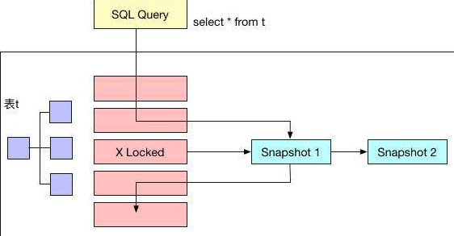
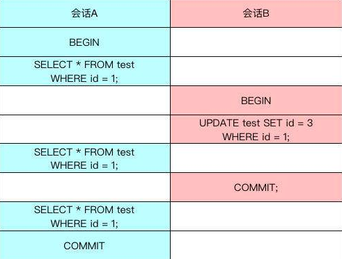
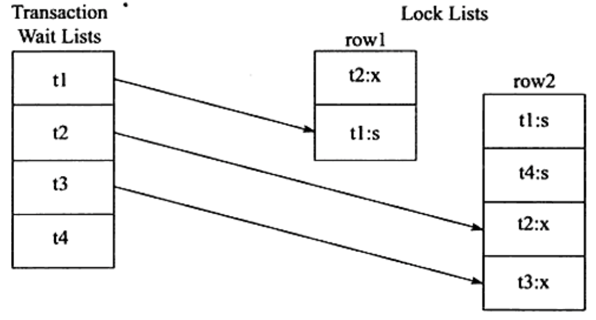
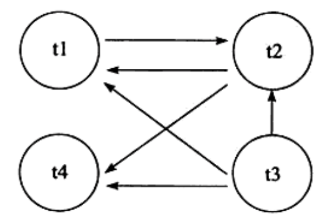
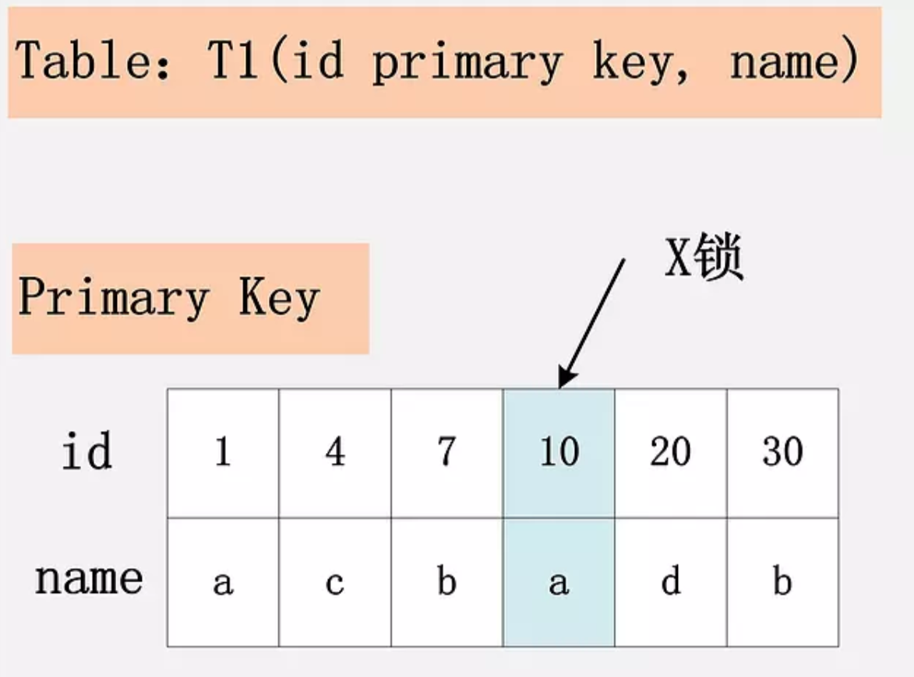
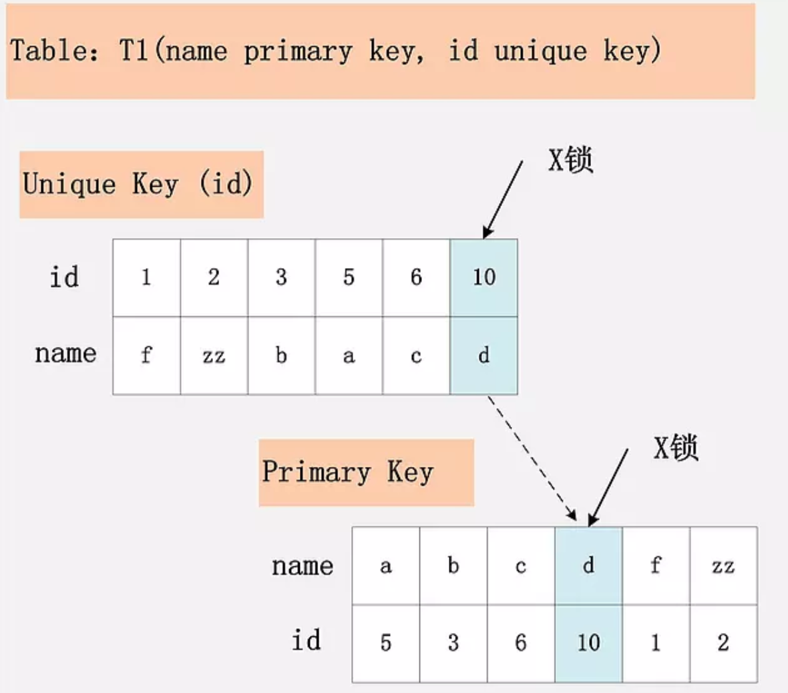
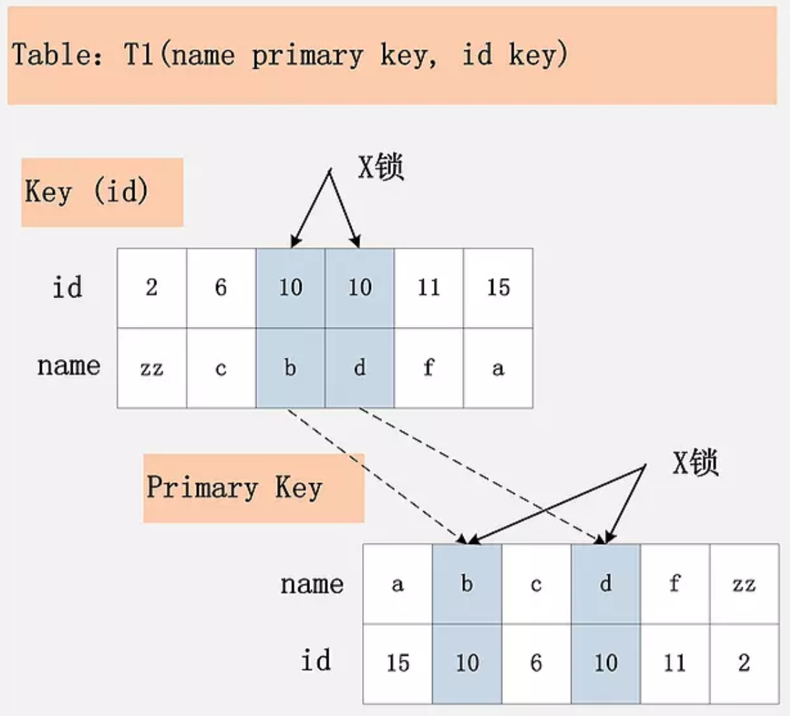
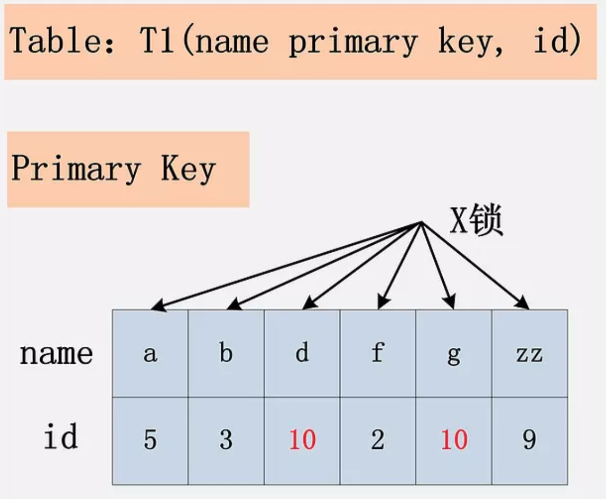
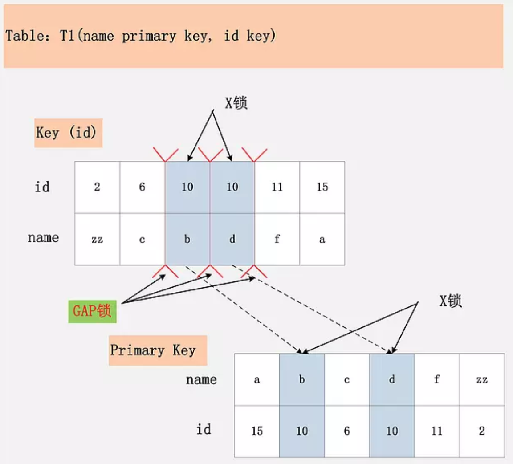
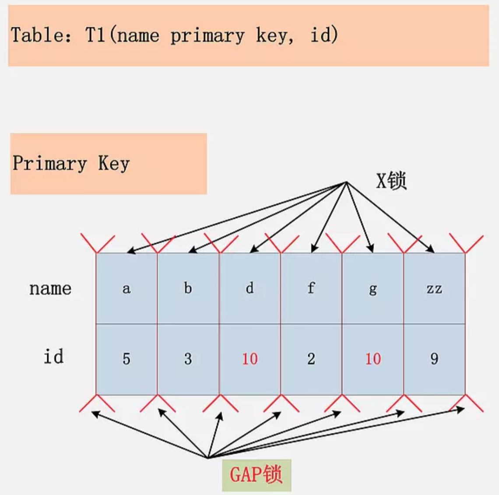

# 1、锁的类型

InnoDB实现了如下两种标准的行级锁：

- **共享锁**（S Lock）：允许事务对一条行数据进行读取
- **排他锁**（X Lock）：允许事务对一条行数据进行删除或更新

如果一个事务T1已经获得了行r的共享锁， 那么另外的事务T2可以立即获得行r的共享锁， 因为读取并没有改变行 r 的数据， 称这种情况为**锁兼容** (Lock Compatible)。 但若有其他的事务T3想获得行r的排他锁， 则其必须等待事务T1, T2释放行r上的共享锁——这种情况称为**锁不兼容**。因为获取排他锁一般是为了改变数据，所以不能同时进行读取或则其他写入操作。

|      | X      | S      |
| ---- | ------ | ------ |
| X    | 不兼容 | 不兼容 |
| S    | 不兼容 | 兼容   |

从上表可以发现，**X锁与任何锁都不兼容，而S锁仅和S锁兼容**。

此外， InnoDB 存储引擎支持多粒度锁定， 这种锁定允许事务在行级上的锁和表级上的锁同时存在。为了支待在不同粒度上进行加锁操作， InnoDB 存储引擎支持 一种额外的锁方式， 称之为**意向锁** (Intention Lock)。意向锁是将锁定的对象分为多个层次， 意向锁意味着事务希望在更细粒度上进行加锁。

InnoDB存储引擎支持意向锁设计比较简练，其**意向锁即为表级别的锁**。设计目的主要是为了在事务中揭示下一行将被请求的锁类型。其支持两种意向锁：

- **意向共享锁**（IS Lock）：事务想要获得一张表中某几行的共享锁
- **意向排他锁**（IX Lock）：事务想要获得一张表中某几行的排他锁

由于InnoDB存储引擎支持的是行级别的锁，因此**意向锁不会阻塞除全表扫描以外的任何请求**，它们的主要目的是为了表示是否有人请求锁定表中的某一行数据。

如果没有意向锁，当已经有人使用行锁对表中的某一行进行修改时，如果另外一个请求要对全表进行修改，那么就需要对所有的行是否被锁定进行扫描，在这种情况下，效率是非常低的；不过，在引入意向锁之后，当有人使用行锁对表中的某一行进行修改之前，会先为表添加意向互斥锁（IX），再为行记录添加互斥锁（X），在这时如果有人尝试对全表进行修改就不需要判断表中的每一行数据是否被加锁了，只需要通过等待意向互斥锁被释放就可以了。

故表级意向锁和行级锁的兼容性如下表所示：

|      | IS     | IX     | S      | X      |
| ---- | ------ | ------ | ------ | ------ |
| IS   | 兼容   | 兼容   | 兼容   | 不兼容 |
| IX   | 兼容   | 兼容   | 不兼容 | 不兼容 |
| S    | 兼容   | 不兼容 | 兼容   | 不兼容 |
| X    | 不兼容 | 不兼容 | 不兼容 | 不兼容 |

# 2、锁的算法

InnoDB有三种行锁的算法：

- **Record Lock**

  简单说就是单个行记录上加锁，防止事务间修改或删除数据。Record Lock总是会去锁住索引记录，如果表建立的时候没有设置任何一个索引，InnoDB存储引擎会使用隐式的主键来进行锁定。

- **Gap Lock**

  间隙锁，表示只锁住一段范围，**不锁记录本身**，通常表示两个索引记录之间，或者索引上的第一条记录之前，或者最后一条记录之后的锁。

- **Next-Key Lock**

  Gap Lock + Record Lock，锁定一个范围及锁定记录本身。例如一个索引有10, 11, 13, 20这四个值，那么该索引可能被Next-key Locking的区间为`(负无穷, 10), (10, 11), (11, 13), (12, 20), (20, 正无穷)`。需要理解一点，InnoDB中加锁都是给所有记录一条一条加锁，并没有一个直接的范围可以直接锁住，所以会生成多个区间。

MySQL默认情况下使用RR的隔离级别，而**Next-key Lock正是为了解决RR隔离级别下的不可重复读问题和幻读问题**。所谓不可重复读就是一个事务内执行相同的查询，会看到不同的行记录，在RR隔离级别下这是不允许的。

假设索引上有记录`1，4，5，8，12`，我们执行类似语句`SELECT … WHERE col > 10 FOR UPDATE`。如果我们不在`(8, 12)`之间加上Next-key Lock，另外一个会话就可能向其中插入一条记录9，再执行一次相同的`SELECT ... FOR UPDATE`，就会看到新插入的记录。这也是为什么MySQL插入一条记录时，需要判断下一条记录上是否加锁了，如果加锁就需要等待。

**InnoDB对行的查询默认采用Next-key算法**。然而，**当查询条件为等值时，且索引有唯一属性时（就是只锁定一条记录），InnoDB存储引擎会对Next-Key Lock进行优化，将其降级为Record Lock**，即仅锁住索引本身，而不是一个范围，因为此时不会产生重复读问题。

# 3、锁读取

> **一致性非锁定读**(consistent nonlocking read)是指InnoDB存储引擎通过多版本控制(MVVC)读取当前数据库中行数据的方式。如果读取的行正在执行DELETE或UPDATE操作，这时读取操作不会因此去等待行上锁的释放。相反地，InnoDB会去读取行的一个快照。



上图直观地展现了InnoDB一致性非锁定读的机制。之所以称其为非锁定读，是因为不需要等待行上排他锁的释放。快照数据是指该行的之前版本的数据，每行记录可能有多个版本，一般称这种技术为**行多版本技术**。由此带来的并发控制，称之为**多版本并发控制**(Multi Version Concurrency Control, MVVC)。**InnoDB是通过undo log来实现MVVC**。undo log本身用来在事务中回滚数据，因此快照数据本身是没有额外开销。此外，读取快照数据是不需要上锁的，因为没有事务需要对历史的数据进行修改操作。

**一致性非锁定读是InnoDB默认的读取方式**，即读取不会占用和等待行上的锁。但是并不是在每个事务隔离级别下都是采用此种方式。此外，即使都是使用一致性非锁定读，但是对于快照数据的定义也各不相同。

在事务隔离级别READ COMMITTED和REPEATABLE READ下，InnoDB使用一致性非锁定读。然而，对于快照数据的定义却不同。

我们下面举个例子来详细说明一下上述的情况。



首先在会话A中显示地开启一个事务，然后读取test表中的id为1的数据，但是事务并没有提交。与此同时，在开启另一个会话B，将test表中id为1的记录修改为id=3，但是事务同样也没有提交，这样id=1的行其实加了一个排他锁。

由于InnoDB在READ COMMITTED和REPEATABLE READ事务隔离级别下使用一致性非锁定读，这时如果会话A再次读取id为1的记录，仍然能够读取到相同的数据。此时，READ COMMITTED和REPEATABLE READ事务隔离级别没有任何区别。

当会话B提交事务后，会话A再次运行`SELECT * FROM test WHERE id = 1`的SQL语句时，两个事务隔离级别下得到的结果就不一样了：

- **对于READ COMMITTED的事务隔离级别，它总是读取行的最新版本**，如果行被锁定了，则读取该行版本的最新一个快照。因为会话B的事务已经提交，所以在该隔离级别下上述SQL语句的结果集是空的。
- **对于REPEATABLE READ的事务隔离级别，总是读取事务开始时的行数据**，因此，在该隔离级别下，上述SQL语句仍然会获得相同的数据。

在默认情况下，即事务的隔离级别是repeatable read模式下，InnoDB存储引擎的SELECT操作使用的是一致性非锁定读。但是在某些情况下，用户需要显示的读取数据操作进行加锁保证数据逻辑的一致性。

InnoDB提供了两种方式实现一致性锁定读：

- `select … for udpate`，对读取的行加了X锁
- `select … lock in share mode`，对读取的行加了S锁

需要注意的是，以上两种语句必须在一个事务当中，当事务提交了，锁也就释放了。

# 4、阻塞

> 因为不同锁之间的兼容性关系，有时候一个事务中的锁需要等待另一个事务中的锁释放它所占用的资源，这就是**阻塞**。

在InnoDB中，参数`innodb_lock_wait_timeout`用来控制等待的时间，`innodb_rollback_on_timeout`用来设定是否在等待超时后回滚。前者是动态的，后者是静态的。

```mysql
mysql> show variables like 'innodb_lock_wait_timeout'\G;
*************************** 1. row ***************************
Variable_name: innodb_lock_wait_timeout
        Value: 50
        
        
mysql> show variables like 'innodb_rollback_on_timeout'\G;
*************************** 1. row ***************************
Variable_name: innodb_rollback_on_timeout
        Value: OFF
```

# 5、死锁

死锁是指两个或两个以上的事务在执行过程中，因争夺资源而造成的一种相互等待的现象。若无外力作用，事务都将无法推进下去。

解决死锁做简单的方法就是超时，即当两个事务互相等待时，当一个等待时间超过了某一阈值，其中一个事务进行回滚，另一个等待的事务就能继续进行。

但是如果超时的事务所占权重比较大，如事务更新了很多行，占用了较多的undo log，回滚这个事务的时间相对于另一个事务所占用的时间可能会更多，就显得不合适了。

因此，除了超时机制，当前数据库都普遍采用**等待图**（wait-for graph）的方式来进行死锁检测。

wait-for graph要求数据库保存以下两种信息:

- 锁的信息链表
- 事务等待链表

通过上述链表可以构造出一张图，而在这个图中若存在回路，就代表存在死锁，因此资源间相互发生等待。在 wait-for graph中,事务为图中的节点。而在图中,事务T1指向T2边的定义为:

- 事务T1等待事务T2所占用的资源
- 事务T1最终等待T2所占用的资源,也就是事务之间在等待相同的资源,而事务T1发生在事务T2的后面

来看一个例子：



在 Transaction Wait Lists中可以看到共有4个事务t1、t2、t3、t4,故在wait-for graph中应有4个节点。



通过上图可以发现存在回路(t1,t2)，因此存在死锁。可以发现wait-for graph是一种较为主动的死锁检测机制，在每个事务请求锁并发生等待时都会判断是否存在回路，若存在则有死锁，通常来说InnoDB存储引擎选择回滚undo量最小的事务。

# 6、InnoDB锁相关状态查询

用户可以使用`INFOMATION_SCHEMA`库下的`INNODB_TRX`、`INNODB_LOCKS`和`INNODB_LOCK_WAITS`表来监控当前事务并分析可能出现的锁问题。`INNODB_TRX`的关键字段如下：

| 字段名              | 说明                                                         |
| ------------------- | ------------------------------------------------------------ |
| trx_id              | InnoDB存储引擎内部唯一的事务ID                               |
| trx_state           | 当前事务的状态                                               |
| trx_started         | 事务的开始时间                                               |
| trx_request_lock_id | 等待事务的锁ID。如果trx_state的状态为LOCK WAIT,那么该字段代表当前事务等待之前事务占用的锁资源ID |
| trx_wait_started    | 事务等待的时间                                               |
| trx_weight          | 事务的权重，反映了一个事务修改和锁住的行数，当发生死锁需要回滚时，会选择该数值最小的进行回滚 |
| trx_mysql_thread_id | 线程ID，SHOW PROCESSLIST 显示的结果                          |
| trx_query           | 事务运行的SQL语句                                            |

```mysql
mysql> SELECT * FROM information_schema.INNODB_TRX\G;
************************************* 1.row *********************************************
trx_id:  7311F4
trx_state: LOCK WAIT
trx_started: 2010-01-04 10:49:33
trx_requested_lock_id: 7311F4:96:3:2
trx_wait_started: 2010-01-04 10:49:33
trx_weight: 2
trx_mysql_thread_id: 471719
trx_query: select * from parent lock in share mode
```

`INNODB_TRX`表只能显示当前运行的InnoDB事务，并不能直接判断锁的一些情况。如果需要查看锁，则还需要访问表`INNODB_LOCKS`，该表的关键字段组成如下：

| 字段名      | 说明                                           |
| ----------- | ---------------------------------------------- |
| lock_id     | 锁的ID                                         |
| lock_trx_id | 事务的ID                                       |
| lock_mode   | 锁的模式                                       |
| lock_type   | 锁的类型，表锁还是行锁                         |
| lock_table  | 要加锁的表                                     |
| lock_index  | 锁住的索引                                     |
| lock_space  | 锁住的space id                                 |
| lock_page   | 事务锁定页的数量，若是表锁，则该值为NULL       |
| lock_rec    | 事务锁定行的数量，如果是表锁，则该值为NULL     |
| lock_data   | 事务锁住记录的主键值，如果是表锁，则该值为NULL |

```mysql
mysql> SELECT * FROM information_schema.INNODB_LOCKS\G;
*************************** 1. row ***************************
    lock_id: 16219:56:4:5
lock_trx_id: 16219
  lock_mode: X,GAP
  lock_type: RECORD
 lock_table: `test`.`z`
 lock_index: b
 lock_space: 56
  lock_page: 4
   lock_rec: 5
  lock_data: 6, 7
*************************** 2. row ***************************
    lock_id: 16218:56:4:5
lock_trx_id: 16218
  lock_mode: X,GAP
  lock_type: RECORD
 lock_table: `test`.`z`
 lock_index: b
 lock_space: 56
  lock_page: 4
   lock_rec: 5
  lock_data: 6, 7
2 rows in set, 1 warning (0.00 sec)
```

通过表INNODB_LOCKS查看每张表上锁的情况后，用户就可以来判断由此引发的等待情况。当时当事务量非常大，其中锁和等待也时常发生，这个时候就不那么容易判断。但是通过表INNODB_LOCK_WAITS，可以很直观的反应当前事务的等待。表INNODB_LOCK_WAITS由四个字段组成，如下表所示。

| 字段名             | 说明               |
| ------------------ | ------------------ |
| requesting_trx_id  | 申请锁资源的事务ID |
| requesting_lock_id | 申请的锁的ID       |
| blocking_trx_id    | 阻塞的事务ID       |
| blocking_lock_id   | 阻塞的锁的ID       |

```mysql
mysql> SELECT * FROM information_schema.INNODB_LOCK_WAITS\G;
*******************************************1.row************************************
requesting_trx_id: 7311F4
requesting_lock_id: 7311F4:96:3:2
blocking_trx_id: 730FEE
blocking_lock_id: 730FEE:96:3:2
```

 通过上述的SQL语句，用户可以清楚直观地看到哪个事务阻塞了另一个事务，然后使用上述的事务ID和锁ID，去INNODB_TRX和INNDOB_LOCKS表中查看更加详细的信息。

# 7、锁的应用实例解析

有一点需要特别注意，MySQL怎么使用锁，与事务的隔离级别、列上的索引状况等密切相关。单拎出一条SQL语句来讨论加锁的方式以及范围而不考虑使用场景，都是耍流氓的行为。

下面就不同场景下锁的使用情况做一下对比，深入理解上面的理论知识。

## 7.1 场景1：RR隔离级别+主键索引

首先根据如下代码创建测试表t，然后开启两个事务进行操作。

```mysql
create table t(a int primary key);
insert into t select 1;
insert into t select 2;
insert into t select 5;
insert into t select 7;
insert into t select 9;
```

开启事务1，保持未提交的状态：

```mysql
begin;
select * from t where a=5 for update;
```

开启事务2并提交：

```mysql
begin;
insert into t select 4;
commit;
```

表t共有1、2、5、7、9五个值，在上面的例子中，在事务1中首先对`a=5`进行X锁定，而由于a是主键且唯一，因此锁定的仅是5这个值，而不是（2,5）这个范围。这样在事务2中插入值4而不会阻塞，可以立即插入并返回。即锁定由Next-key Lock算法降级为Record Lock，从而提高应用的并发性。

需要注意的一点是，对于唯一键值的锁定，**Next-Key Lock降级为Record Lock仅存在于查询所有的唯一索引列**。若唯一索引由多个列组成，而查询仅是查找多个唯一索引列中的其中一个，那么查询其实是range类型查询，而不是const类型查询，故InnoDB存储引擎依然使用Next-Key Lock进行锁定。

但如果对主键进来范围查询时，锁的范围是怎么样的呢？

开启事务1，保持未提交的状态：

```mysql
begin;
select * from t where a<=5 for update;
```

针对下面的sql语句：

```mysql
insert into test.t select 6;
insert into test.t select 8
```

第一条会产生锁等待，而第二条可以插入成功。

表t共有1、2、5、7、9五个值，在上面的例子中，在事务1中执行`a<=5`范围查询时，事务1加锁范围是`(负无穷, 1)、(1, 2)、(2, 5)、(5, 7)`，且`1、2、5、7`这四条记录也都加锁了，也就是说再插入`<=7`的记录都是会产生锁等待，插入记录8是成功的。

那么InnoDB如何判断是否允许插入数据呢？对于普通索引，insert的加锁策略是：查找小于等于 insert_rec 的第一条记录，然后查看第一条记录的下一个记录是否有Gap锁，有则等待，没有则插入。比如说我们插入6这条记录，首先定位`<=6`的记录，也就是5，然后确认5的下一条记录是否锁住了Gap，这里也就是7，当7这条记录有锁是代表锁住的是`(5, 7)`这个范围，就不允许插入（会申请一把插入意向锁），保证了可重复读。证明了在RR隔离级别下使用了Next-key Lock来保证其“可重复读”的特性。如果没有锁就直接插入即可。

但是如果插入的记录有唯一约束时，只判断下一条记录是否锁住了Gap就不行了，显然会插入重复数据破坏唯一性。这时还会把插入的记录与前一条数据进行比较，如果相同则给插入记录的前一条记录加S Lock（lock in share mode），加锁成功则返回duplicate key，否则等待S Lock。

这个地方可能有人会有一个疑问，为什么MySQL在加锁时，不直接加5这条记录本身以及<5的记录呢？为什么还要给`(5, 7)`加锁呢？因为(5, 7)加不加锁并不会影响RR级别可重复读的特性。其实这就跟B+树有关系了，首先MySQL定位到1这条记录并加锁，然后顺着1往后读取数据并加锁，直到读取到第一条不匹配数据才能确定是否停止继续读取数据，而在RR隔离级别下只要被读到的数据都需要进行加锁。如果查询条件是<5，那么加锁只会加到5这条记录为止。

如果是在RC隔离级别下，只会对符合条件的记录进行加记录锁，不会对满足条件的下一条记录进行加锁。

## 7.2 场景2：RR隔离级别+普通索引

正如上面所介绍的，Next-Key Lock降级为Record Lock仅在查询的列是唯一索引且条件为等值查询的情况下。若是辅助索引，则情况会完全不同，

首先根据如下代码创建测试表z：

```mysql
create table z(id int primary key,b int,index(b));
insert into z values(1,1);
insert into z values(3,1);
insert into z values(5,3);
insert into z values(7,6);
insert into z values(10,8);
```

开启事务1，保持未提交的状态：

```mysql
begin;
select * from z where b=3 for update;
```

这时SQL语句通过索引列b进行查询，因此其使用传统的Next-key Locking技术加锁，并且由于有两个索引，其需要分别进行锁定。对于聚集索引，其仅对列id等于5的索引加上Record Lock。那么，为什么主键索引上的记录也要加锁呢？因为有可能其他事务会根据主键对 z 表进行更新，试想一下，如果主键索引没有加锁，那么显然会存在并发问题。

而对于辅助索引，其加上的是Next-key Lock，锁定的范围是（1, 3），特别需要注意的是，InnoDB存储引擎还会对辅助索引下一个键值加上Gap lock，即还有一个辅助索引范围为（3, 6）的锁。

此时，若在新的事务2中运行下面的SQL语句：

```mysql
select * from z where id=5 lock in share mode;
insert into z select 2,1;
insert into z select 4,2;
insert into z select 6,6;
```

第一个SQL语句，在事务1中执行的SQL语句已经对聚集索引中的列“a=5”的值加上X锁，因此执行会被阻塞。

第二个SQL语句，主键插入2，没有问题，插入的辅助索引值1也不在锁定的范围（1,3）中，因此可以执行成功。

第三个SQL语句，主键插入4，没有问题，插入的辅助索引值2在锁定的范围（1,3）中，因此执行会被阻塞。

第四个SQL语句，插入的主键6没有被锁定，6也不在范围（1,3）之间。但插入的值6在另一个锁定的范围（3,6）中，故同样需要等待。

在RR隔离级别下，对于INSERT的操作，其会检查插入记录的下一条记录是否被锁定，若已经被锁定，则不允许操作，从而避免不可重复读问题。而下面的SQL语句，不会被阻塞，可以立即执行：

```mysql
insert into z select 8,6;
insert into z select 2,0;
insert into z select 6,7;
```

从上面的例子中可以看到，Gap Lock的作用是为了阻止多个事务将记录插入到同一个范围内，解决“不可重复读”问题的产生。例如在上面的例子中，事务1中用户已经锁定了b=3的记录，若此时没有Gap Lock锁定`(3, 6)`，那么用户可以插入索引b列为3的记录，这会导致事务1中的用户再次执行同样的查询时会返回不同的记录，即产生不可重复读问题。

这里有一个问题值得思考一下，为什么插入`(6, 6)`不允许，而插入`(8, 6)`是允许的。这跟InnoDB索引结构有关系，我们知道二级索引是指向主键，所以结构如：`(1, 1), (1, 3), (3, 5), (6, 7), (8, 10)`。真正的Gap锁锁住的也是`((1, 1), (1, 3))`这样的结构，所以当我们插入`(6, 6)`时，需要插入到`(3, 5), (6, 7)`之间，这区间被锁，所以无法插入；而我们插入`(8, 6)`是需要插入到`(6, 7), (8, 10)`之间，没有锁存在，所以可以插入成功。

另外，在RR隔离级别下，我们访问条件为二级索引的情况下，就算访问一条不存在的记录同样需要加Next-key Lokcs，比如我们查询

```mysql
select * from z where b=7 for update;
```

InnoDB会对(6, 8)这个区间加了Gap Lock，也就是说插入这个区间的数据都会被阻塞。

虽然在RR隔离级别默认使用Gap Lock，但用户可以通过以下两种方式来显式地关闭Gap Lock：

- 将事务的隔离级别设置为READ COMMITTED；
- 将参数`innodb_locks_unsafe_for_binlog`设置为1；

当设置了上述参数或隔离级别调整到**READ COMMITTED**时，除了外键约束和唯一性检查（duplicate key）依然需要Gap Lock，其余情况仅使用Record Lock进行锁定。但需要知道的是，上述设置破坏了事务的隔离性，并且对于MySQL复制来说，可能会导致主从数据的不一致。虽然MySQL目前默认隔离级别是RR，但是基本生产环境标配基本都是RC隔离级别+ROW格式。

## 7.3 场景3：RC隔离级别+主键索引

将事务隔离级别切为RC，开启事务1，保持未提交的状态：

```mysql
begin;
select * from z where id>3 for update; 
```

执行下面的SQL：

```mysql
insert into z select 6,6; 
```

可以执行成功。证明在事务1执行主键范围for update时，事务2对这个范围扔可以申请写锁。证明RC隔离级别没有使用NEXT-KEY Lock，而是使用行级锁锁住对应的记录。

## 7.4 场景4：RC隔离级别+普通索引

将事务隔离级别切为RC，开启事务1，保持未提交的状态：

```mysql
begin;
select * from z where b>3 for update;
```

此时，若在新的事务2中运行下面的SQL语句：

```mysql
insert into z select 8,4;
update z set b = 10 where b = 6;
update z set b = 10 where b = 1;
```

第一个SQL语句，插入数据到事务1的for update范围内是可以的，因为这里事务1在RC模式下没有加NEXT-KEY LOCK锁，所以可以插入数据。

第二个SQL语句，会出现锁等待，我们选择普通索引作为条件，此时MySQL给普通索引b>3的记录都会加行锁。同时，这些记录对应主键索引上的记录也都加上了锁

第三个SQL语句，插入成功，说明b<3的记录都无锁。

## 7.5 场景5：RR + 无索引

**InnoDB行锁是通过给索引上的索引项加锁来实现的**，这一点MySQL与Oracle不同，后者是通过在数据块中对相应数据行加锁来实现的。InnoDB这种行锁实现特点意味着：**只有通过索引条件检索数据，InnoDB才使用行级锁，否则，InnoDB将会给所有记录加锁**。

在RR隔离级别下，由于查询条件没有索引，那么InnoDB需要扫描所有数据来查找数据，对于扫描过的数据InnoDB都会加上锁，并且是加Next-key lock。

建立测试表：

```mysql
create table tab_no_index(id int,b int) engine=innodb;
insert into tab_no_index values(1,1),(2,2),(3,3),(4,4),(100,100);
```

开启事务1，保持未提交的状态：

```mysql
begin;
select * from tab_no_index where id = 1 for update;
```

执行下面的SQL：

```mysql
insert into tab_no_index values(5,5);
```

这时候，并不能插入成功。看起来事务1只给一行加了排他锁，但事务2在请求其他行的排他锁时，却出现了锁等待。原因就在于没有索引的情况下，InnoDB只能扫描所有记录（锁住所有记录）。当我们给其增加一个唯一索引后，InnoDB就只锁定了符合条件的行。

当我们给其增加一个唯一索引后，InnoDB就只锁定了符合条件的行。

```mysql
create table tab_with_index(id int,b int,primary key(id));
insert into tab_with_index values(1,1),(2,2),(3,3),(4,4),(100,100);
```

开启事务1，保持未提交的状态：

```mysql
begin;
select * from tab_with_index where id = 1 for update;
```

执行下面的SQL：

```mysql
select * from tab_with_index where id = 2 for update;
```

由这个例子可以看出，对于id是主键索引的情况下，只锁了id=1这一行记录。其余的行都是可以进行DML操作的，但前提条件是以id为条件。如果是以b字段为条件，那么还是会锁的。

## 7.6 场景6：RC + 无索引

上面演示了在RR隔离级别下，对于where条件无索引的情况下，InnoDB是对所有记录加Next-key Locks。

但是在RC隔离级别下，对于where条件无索引的情况下，则不会对所有记录加锁，而是只对命中的数据的聚簇索引加X锁。

同样针对tab_no_index``表，开启事务1，保持未提交的状态：

```mysql
begin;
delete from tab_no_index where id = 1;
```

执行下面的SQL：

```mysql
delete from tab_no_index where id = 99;
update tab_no_index set id=2 where id=100;
insert into tab_no_index select 99,99;
```

都可以执行成功。

## 7.7 沙场练兵

有了上面的分场景演习，下面就两条简单SQL进行一场加锁分析的实战。

下面两条简单的SQL，加什么锁？

```mysql
select * from t1 where id = 10;
delete from t1 where id = 10;
```

一眼看去，不经大脑的回答是：

- SQL1：不加锁。因为MySQL是使用多版本并发控制的，读不加锁
- SQL2：对id = 10的记录加写锁 (走主键索引)

可能是正确的，也有可能是错误的，已知条件不足，要回答这个问题，还缺少几个前提条件：

- id列是不是主键？
- 当前系统的隔离级别是什么？
- id列如果不是主键，那么id列上有索引吗？
- id列上如果有二级索引，那么这个索引是唯一索引吗？

**组合一：id列是主键，RC隔离级别**

这个组合，是最简单，最容易分析的组合。id是主键，Read Committed隔离级别，给定SQL：`delete from t1 where id = 10;` 只需要将主键上，id = 10的记录加上X锁即可。



**组合二：id唯一索引+RC**

id是unique索引，而主键是name列。由于id是unique索引，因此delete语句会选择id列的索引进行where条件的过滤，在找到id=10的记录后，首先会将unique索引上的id=10索引记录加上X锁，同时，会根据读取到的name列，回主键索引(聚簇索引)，然后将聚簇索引上的name = ‘d’ 对应的主键索引项加X锁。

为什么聚簇索引上的记录也要加锁？如果并发的一个SQL，是通过主键索引来更新：`update t1 set id = 100 where name = ‘d’;` 此时，如果delete语句没有将主键索引上的记录加锁，那么并发的update就会感知不到delete语句的存在，违背了同一记录上的更新/删除需要串行执行的约束。

若id列是unique列，其上有unique索引。那么SQL需要加两个X锁，一个对应于id unique索引上的id = 10的记录，另一把锁对应于聚簇索引上的[name=’d’,id=10]的记录。



**组合三：id非唯一索引+RC**

相对于组合一、二，id列不再唯一，只有一个普通的索引。

满足id = 10查询条件的记录，均已加锁。同时，这些记录对应的主键索引上的记录也都加上了锁。与组合二唯一的区别在于，组合二最多只有一个满足等值查询的记录，而组合三会将所有满足查询条件的记录都加锁。



**组合四：id无索引+RC**

这个过滤条件，没法通过索引进行过滤，那么只能走全表扫描做过滤。对应于这个组合，SQL会加什么锁？换句话说，全表扫描时，会加什么锁？

由于id列上没有索引，因此只能走聚簇索引，进行全部扫描。聚簇索引上所有的记录，都被加上了X锁。无论记录是否满足条件，全部被加上X锁。既不是加表锁，也不是在满足条件的记录上加行锁。



为什么不是只在满足条件的记录上加锁呢？这是由于MySQL的实现决定的。如果一个条件无法通过索引快速过滤，那么存储引擎层面就会将所有记录加锁后返回，然后由MySQL Server层进行过滤。因此也就把所有的记录都锁上了。

在实际的实现中，MySQL有一些改进，在MySQL Server过滤条件，发现不满足后，会调用unlock_row方法，把不满足条件的记录放锁 (违背了2PL的约束)。这样做，保证了最后只会持有满足条件记录上的锁，但是每条记录的加锁操作还是不能省略的。

**组合五：id主键+RR**

上面的四个组合，都是在Read Committed隔离级别下的加锁行为，接下来的四个组合，是在Repeatable Read隔离级别下的加锁行为。

id列是主键列，Repeatable Read隔离级别，针对`delete from t1 where id = 10;` 这条SQL，加锁与组合一：[id主键，Read Committed]一致。

**组合六：id唯一索引+RR**

与组合二：[id唯一索引，Read Committed]一致。两个X锁，id唯一索引满足条件的记录上一个，对应的聚簇索引上的记录一个。

**组合七：id非唯一索引+RR**

RC隔离级别允许幻读，而RR隔离级别，不允许存在幻读。那么RR隔离级别下，如何防止幻读呢？

组合七，Repeatable Read隔离级别，id上有一个非唯一索引，执行`delete from t1 where id = 10;` 假设选择id列上的索引进行条件过滤，最后的加锁行为，是怎么样的呢？



相对于组合三：[id列上非唯一锁，Read Committed]看似相同，其实却有很大的区别。

最大的区别在于，多了一个GAP锁，而且GAP锁看起来也不是加在记录上的，是加载两条记录之间的位置，GAP锁有何用？

**这个多出来的GAP锁，就是RR隔离级别，相对于RC隔离级别，不会出现幻读的关键**。

GAP锁锁住的位置，不是记录本身，而是两条记录之间的GAP。所谓幻读，就是同一个事务，连续做两次当前读(例如：`select * from t1 where id = 10 for update;`)，那么这两次当前读返回的是完全相同的记录 (记录数量一致，记录本身也一致)，第二次的当前读，不会比第一次返回更多的记录 (幻象)。

如何保证两次当前读返回一致的记录，那就需要在第一次当前读与第二次当前读之间，其他的事务不会插入新的满足条件的记录并提交。为了实现这个功能，GAP锁应运而生。

如图中所示，有哪些位置可以插入新的满足条件的项 (id = 10)，考虑到B+树索引的有序性，满足条件的项一定是连续存放的。记录[6,c]之前，不会插入id=10的记录；[6,c]与[10,b]间、[10,b]与[10,d]间、[10,d]与[11,f]间可以插入满足条件的[10,e],[10,z]等；而[11,f]之后也不会插入满足条件的记录。

因此，为了保证[6,c]与[10,b]间，[10,b]与[10,d]间，[10,d]与[11,f]不会插入新的满足条件的记录，MySQL选择了用GAP锁，将这三个GAP给锁起来。

Insert操作，如insert [10,a]，首先会定位到[6,c]与[10,b]间，然后在插入前，会检查这个GAP是否已经被锁上，如果被锁上，则Insert不能插入记录。因此，通过第一遍的当前读，不仅将满足条件的记录锁上 (X锁)，与组合三类似。同时还是增加3把GAP锁，将可能插入满足条件记录的3个GAP给锁上，保证后续的Insert不能插入新的id=10的记录，也就杜绝了同一事务的第二次当前读，出现幻象的情况。

既然防止幻读，需要靠GAP锁的保护，为什么组合五、组合六，也是RR隔离级别，却不需要加GAP锁呢？
 GAP锁的目的，是为了防止同一事务的两次当前读，出现幻读的情况。而组合五，id是主键；组合六，id是unique键，都能够保证唯一性。一个等值查询，最多只能返回一条记录，而且新的相同取值的记录，一定不会在新插入进来，因此也就避免了GAP锁的使用。

结论：Repeatable Read隔离级别下，id列上有一个非唯一索引，对应SQL：`delete from t1 where id = 10; `首先，通过id索引定位到第一条满足查询条件的记录，加记录上的X锁，加GAP上的GAP锁，然后加主键聚簇索引上的记录X锁，然后返回；然后读取下一条，重复进行。直至进行到第一条不满足条件的记录[11,f]，此时，不需要加记录X锁，但是仍旧需要加GAP锁，最后返回结束。

**组合八：id无索引+RR**

id列上没有索引。此时SQL：`delete from t1 where id = 10; `没有其他的路径可以选择，只能进行全表扫描。最终的加锁情况，如下图所示：



这是一个很恐怖的现象。首先，聚簇索引上的所有记录，都被加上了X锁。其次，聚簇索引每条记录间的间隙(GAP)，也同时被加上了GAP锁。这个示例表，只有6条记录，一共需要6个记录锁，7个GAP锁。试想，如果表上有1000万条记录呢？

在这种情况下，这个表上，除了不加锁的快照度，其他任何加锁的并发SQL，均不能执行，不能更新，不能删除，不能插入，全表被锁死。

当然，跟组合四：[id无索引, Read Committed]类似，这个情况下，MySQL也做了一些优化，就是所谓的`semi-consistent read`。`semi-consistent read`开启的情况下，对于不满足查询条件的记录，MySQL会提前放锁。

结论：在Repeatable Read隔离级别下，如果进行全表扫描的当前读，那么会锁上表中的所有记录，同时会锁上聚簇索引内的所有GAP，杜绝所有的并发 更新/删除/插入 操作。当然，也可以通过触发`semi-consistent read`，来缓解加锁开销与并发影响，但是`semi-consistent read`本身可能会带来其他问题。

**组合九：Serializable**

Serializable隔离级别。对于SQL2：`delete from t1 where id = 10;` 来说，Serializable隔离级别与Repeatable Read隔离级别完全一致

Serializable隔离级别，影响的是SQL1：`select * from t1 where id = 10; `这条SQL，在RC，RR隔离级别下，都是快照读，不加锁。但是在Serializable隔离级别，SQL1会加读锁，也就是说快照读不复存在，MVCC并发控制降级为Lock-Based CC。

MVCC 最大的好处：读不加锁，读写不冲突。在读多写少的OLTP应用中，读写不冲突是非常重要的，极大的增加了系统的并发性能，这也是为什么现阶段，几乎所有的RDBMS，都支持了MVCC

在MySQL/InnoDB中，所谓的读不加锁，并不适用于所有的情况，而是隔离级别相关的。Serializable隔离级别，读不加锁就不再成立，所有的读操作，都是当前读。

