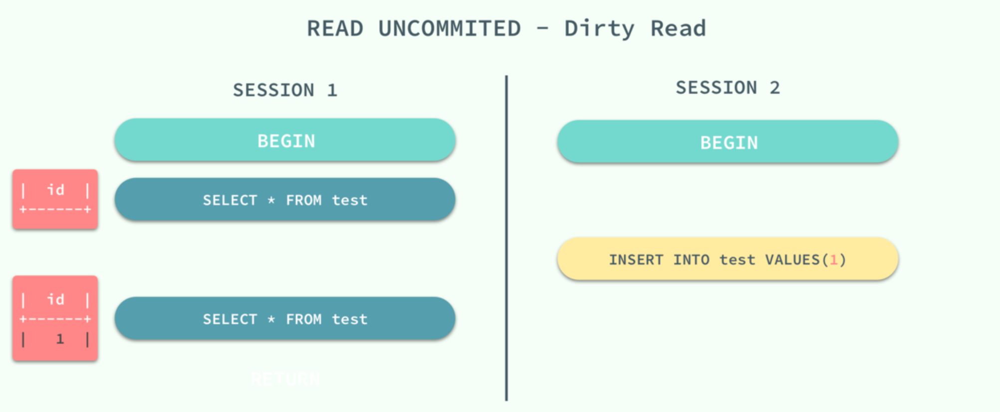
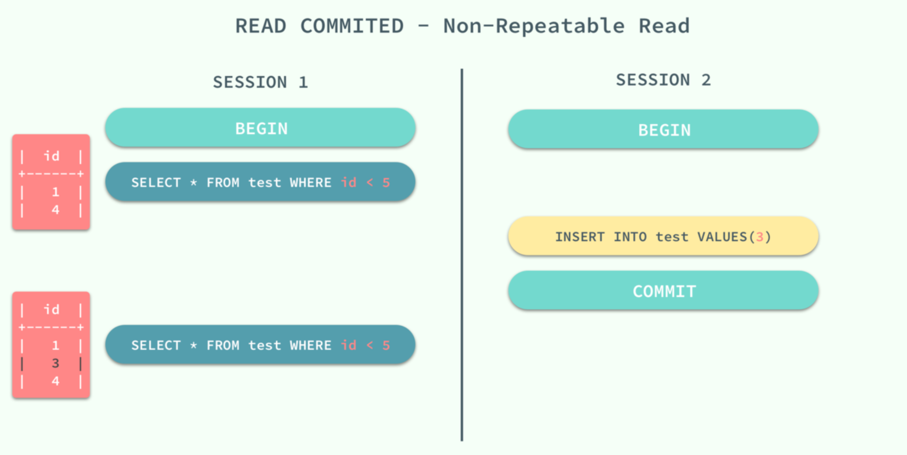
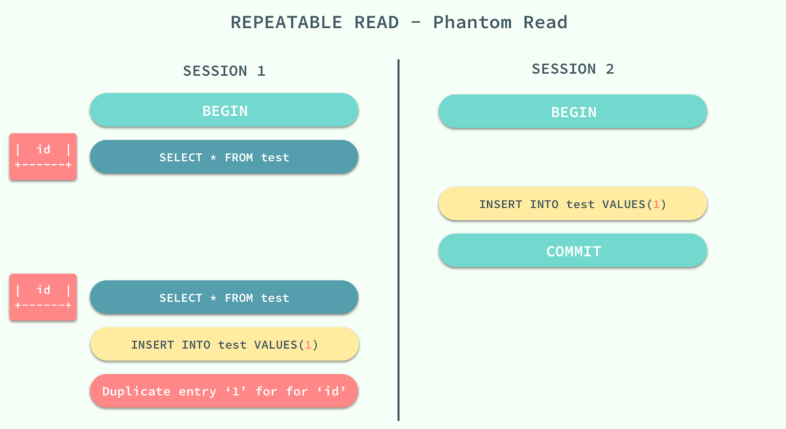
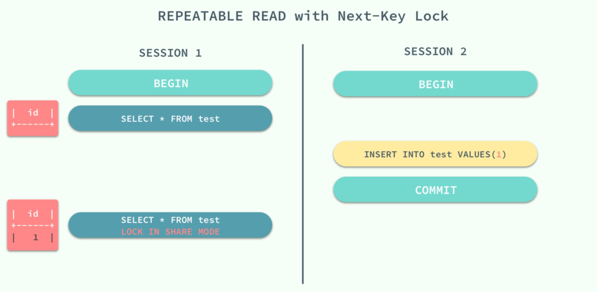
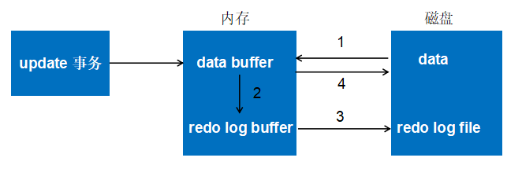
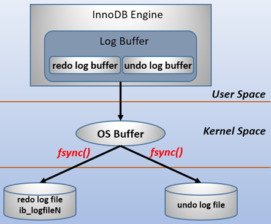
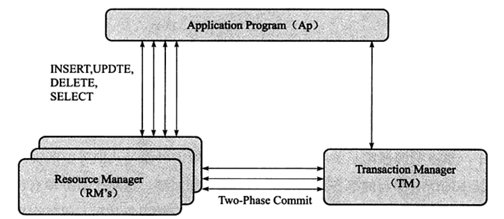
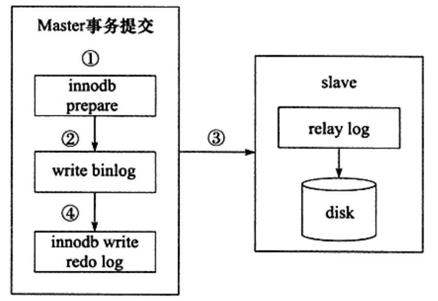

# 1、ACID

事务是数据库区别于文件系统的重要特性之一。

InnoDB的事务完全符合ACID特性。

- 原子性（**A**tomicity）：操作过程不可分割，要么全部成功，要么全部失败
- 一致性（**C**onsistency）：完整性约束不被破坏
- 隔离性（**I**solution）：事务提交前对其他事务不可见
- 持久性（**D**urability）：事务一旦提交，其结果就是永久性的

In弄DB中的ACID特性依靠如下机制实现：

- 隔离性由锁来实现；
- 原子性和持久性由redo log来实现；
- 一致性由undo log来实现。

# 2、隔离级别

事务的隔离性是数据库处理数据的几大基础之一，而隔离级别其实就是提供给用户用于在性能和可靠性做出选择和权衡的配置项。

 InnoDB 遵循了 SQL:1992 标准中的四种隔离级别：

- `RAED UNCOMMITED`：使用查询语句不会加锁，可能会读到未提交的行（Dirty Read）；
- `READ COMMITED`：只对记录加记录锁，而不会在记录之间加间隙锁，所以允许新的记录插入到被锁定记录的附近，所以再多次使用查询语句时，可能得到不同的结果（Non-Repeatable Read）；
- `REPEATABLE READ`：多次读取同一范围的数据会返回第一次查询的快照，不会返回不同的数据行，但是可能发生幻读（Phantom Read）；
- `SERIALIZABLE`：InnoDB 隐式地将全部的查询语句加上共享锁，解决了幻读的问题；

MySQL 中默认的事务隔离级别就是 `REPEATABLE READ`，但是它通过 `Next-Key` 锁也能够在某种程度上解决幻读的问题。


接下来，我们将数据库中创建如下的表并通过个例子来展示在不同的事务隔离级别之下，会发生什么样的问题：

```mysql
CREATE TABLE test(
    id INT NOT NULL,
    UNIQUE(id)
);
```

## 2.1 脏读

当事务的隔离级别为 `READ UNCOMMITED` 时，我们在 `SESSION 2` 中插入的**未提交**数据在 `SESSION 1` 中是可以访问的。



## 2.2 不可重复读

当事务的隔离级别为 `READ COMMITED` 时，虽然解决了脏读的问题，但是如果在 `SESSION 1` 先查询了一个范围的数据，在这之后 `SESSION 2` 中插入一条数据并且提交了修改，在这时，如果 `SESSION 1` 中再次使用相同的查询语句，就会发现两次查询的结果不一样。



不可重复读的原因就是，在 `READ COMMITED` 的隔离级别下，存储引擎不会在查询记录时添加间隙锁，锁定 `id < 5` 这个范围。

## 2.3 幻读

重新开启了两个会话 `SESSION 1` 和 `SESSION 2`，在 `SESSION 1` 中我们查询全表的信息，没有得到任何记录；在 `SESSION 2` 中向表中插入一条数据并提交；由于 `REPEATABLE READ` 的原因，再次查询全表的数据时，我们获得到的仍然是空集，但是在向表中插入同样的数据却出现了错误。



这种现象在数据库中就被称作幻读，虽然我们使用查询语句得到了一个空的集合，但是插入数据时却得到了错误，好像之前的查询是幻觉一样。

在标准的事务隔离级别中，幻读是由更高的隔离级别 `SERIALIZABLE` 解决的，但是它也可以通过 MySQL 提供的 Next-Key 锁解决：



`REPERATABLE READ` 和 `READ UNCOMMITED` 其实是矛盾的，如果保证了前者就看不到已经提交的事务，如果保证了后者，就会导致两次查询的结果不同，MySQL 为我们提供了一种折中的方式，能够在 `REPERATABLE READ` 模式下加锁访问已经提交的数据，其本身并不能解决幻读的问题，而是通过文章前面提到的 Next-Key 锁来解决。

# 3、重做日志（redo log）

## 3.1 write-ahead logging

> **预写式日志（write-ahead logging，WAL ）**，是一种实现事务日志的标准方法，其中心思想是对数据文件的修改必须发生在这些修改已经记录了日志之后。

 如果遵循这个过程，那么就不需要在每次事务提交的时候都把数据页冲刷到磁盘，因为即便出现宕机的情况， 我们也可以用日志来恢复数据库：任何尚未附加到数据页的记录都将先从日志记录中重做（这叫向前滚动恢复，也叫做 redo）。

使用 WAL 的第一个主要的好处就是显著地减少了磁盘写的次数。 因为在日志提交的时候只有日志文件需要冲刷到磁盘；而不是事务修改的所有数据文件。 在多用户环境里，许多事务的提交可以用日志文件的一次 `fsync()` 来完成。而且，**日志文件是顺序写的**， 因此同步日志的开销要远比同步数据页的开销要小。 这一点对于许多小事务对磁盘的随机写入更是如此。

## 3.2 基本概念

MySQL作为一个存储系统，为了保证数据的可靠性，最终得落盘；又为了数据写入的速度，需要引入基于内存的“缓冲池”。也就是说，数据是先缓存在缓冲池中，然后再以某种方式刷新到磁盘，在某个时间段之内，缓存中的数据与磁盘的数是不一致的，如果这个时候宕机会导致缓存数据的丢失。

引入redo log的目的就是为了防止以上问题的发生。

当向InnoDB写用户数据时，先写redo log，然后redo log根据一定的规则持久化到磁盘，变成redo log file，用户数据则在buffer中(比如数据页、索引页)。如果发生宕机，重启后则读取磁盘上的 redo log file 进行数据的恢复。

从这个角度来说，**InnoDB事务的持久性是通过 redo log 来实现的**。

下面以一个更新事务为例，宏观上把握redo log 流转过程，如下图所示：



- 第一步：先将原始数据从磁盘中读入内存中来，修改数据的内存拷贝
- 第二步：生成一条重做日志并写入redo log buffer，记录的是数据被修改后的值
- 第三步：当事务commit时，将redo log buffer中的内容刷新到 redo log file，对 redo log file采用追加写的方式
- 第四步：定期将内存中修改的数据刷新到磁盘中

redo log包括两部分：

- 内存中的日志缓冲(redo log buffer)，该部分日志是易失性的
- 磁盘上的重做日志文件(redo log file)，该部分日志是持久的

InnoDB通过**force log at commit**机制实现事务的持久性，即在事务提交的时候，必须先将该事务的所有事务日志写入到磁盘上的redo log file和undo log file中进行持久化。

为了确保每次日志都能写入到事务日志文件中，在每次将log buffer中的日志写入日志文件的过程中都会调用一次操作系统的fsync操作(即fsync()系统调用)。因为MySQL是工作在用户空间的，MySQL的log buffer处于用户空间的内存中。要写入到磁盘上的log file中，中间还要经过操作系统内核空间的os buffer，调用fsync()的作用就是将OS buffer中的日志刷到磁盘上的log file中。

也就是说，从redo log buffer写日志到磁盘的redo log file中，过程如下：



redo log buffer 刷新到磁盘的时机由参数 `InnoDB_flush_log_at_trx_commit` 控制，默认为1：

- 0： 事务提交时不进行写入redo log操作，而是依靠master线程周期性的刷盘来保证。由于master线程每1秒进行一次redo log的fsync操作，因此实例崩溃后最多丢失1秒钟内的事务
- 1： 事务提交时必须调用一次 `fsync` 操作，这种方式即使系统崩溃也不会丢失任何数据，但是因为每次提交都写入磁盘，IO的性能较差。该值是InnoDB的**默认值**
- 2： 在事务提交时只保证将redo log buffer写到系统的os buffer中，不进行`fsync`操作，因此如果MySQL数据库宕机时 不会丢失事务，但操作系统宕机则可能丢失事务

## 3.3 两次写

> 当发生数据库宕机时，可能InnoDB存储引擎正在写入某个页到表中，而这个页只写了一部分，比如16KB的页，只写了前4KB，之后就发生了宕机，这种情况被称为**部分写失效**（partial page write）。

部分写失效的问题，依靠重做日志无法恢复，因为重做日志是基于偏移量的物理操作。例如，写'aaaa'记录到偏移量800的位置，如果这个页本身已经发生了损坏，再对其进行重做是没有意义的。这就是说，在使用重做日志前，用户需要一个页的副本，当写入失效发生时，先通过页的副本来还原该页，再进行重做，这就是**doublewrite**。

下面是两次写的原理图：


doublewrite由两部分组成：

- 内存中的doublewrite buffer，大小为2MB
- 物理磁盘上共享表空间中连续的128个页，即2个区（extent），大小同样为2MB

当刷新缓冲池脏页时，并不直接写到数据文件中，而是按照下面的路程执行：

1. 拷贝至内存中的两次写缓冲区。
2. 从两次写缓冲区分两次写入磁盘共享表空间中，每次1MB
3. 待第2步完成后，再将两次写缓冲区写入数据文件

这样就可以解决上文提到的部分写失效的问题，因为在磁盘共享表空间中已有数据页副本拷贝，如果数据库在页写入数据文件的过程中宕机，在实例恢复时，可以从共享表空间中找到该页副本，将其拷贝覆盖原有的数据页，再应用重做日志即可。

其中第2步是额外的性能开销，但由于磁盘共享表空间是连续的，因此开销不是很大。可以通过参数`skip_innodb_doublewrite`禁用两次写功能，默认是开启的。

## 3.4 LSN

缓存中未刷到磁盘的数据称为**脏数据**(dirty data)。由于数据和日志都以页的形式存在，所以**脏页**包含脏数据和脏日志。

在InnoDB中，由一系列的规则来判断是否到达了`checkpoint`，到达后会将缓存中的脏数据页和脏日志页都刷到磁盘。

`LSN`称为日志的逻辑序列号(log sequence number)，随着日志的写入而逐渐增大。根据LSN，可以获取到几个有用的信息：

- 数据页的版本信息。
- 写入的日志总量，通过LSN开始号码和结束号码可以计算出写入的日志量。
- 可知道检查点的位置。

可以通过`show engine innodb status`命令查看LSN的情况：

```mysql
mysql> show engine innodb status\G;
*************************** 1. row ***************************
...
---
LOG
---
Log sequence number 2611354
Log flushed up to   2611354
Pages flushed up to 2611354
Last checkpoint at  2611345
0 pending log flushes, 0 pending chkp writes
10 log i/o's done, 0.09 log i/o's/second
...
```

- Log sequence number表示当前的LSN,
- Log flushed up to表示刷新到重做日志文件的LSN
- Pages flushed up to表示写入磁盘的dirty page 上的LSN
- Last checkpoint at表示写入磁盘的checkpoint上的LSN

## 3.5 恢复过程

在启动InnoDB的时候，不管上次是正常关闭还是异常关闭，总是会进行恢复操作。

因为**redo log记录的是数据页的物理变化**，因此恢复的时候速度比逻辑日志(如二进制日志)要快很多。而且，InnoDB自身也做了一定程度的优化，让恢复速度变得更快。

重启InnoDB时，checkpoint表示已经完整刷到磁盘上data page上的LSN，因此恢复时仅需要恢复从checkpoint开始的日志部分。例如，当数据库在上一次checkpoint的LSN为10000时宕机，且事务是已经提交过的状态。启动数据库时会检查磁盘中数据页的LSN，如果数据页的LSN小于日志中的LSN，则会从检查点开始恢复。

还有一种情况，在宕机前正处于checkpoint的刷盘过程，且数据页的刷盘进度超过了日志页的刷盘进度。这时候一宕机，数据页中记录的LSN就会大于日志页中的LSN，在重启的恢复过程中会检查到这一情况，这时超出日志进度的部分将不会重做，因为这本身就表示已经做过的事情，无需再重做。

另外，**事务日志具有幂等性**，所以多次操作得到同一结果的行为在日志中只记录一次。而二进制日志不具有幂等性，多次操作会全部记录下来，在恢复的时候会多次执行二进制日志中的记录，速度就慢得多。例如，某记录中id初始值为2，通过update将值设置为了3，后来又设置成了2，在事务日志中记录的将是无变化的页，根本无需恢复；而二进制会记录下两次update操作，恢复时也将执行这两次update操作，速度比事务日志恢复更慢。

# 4、回滚日志（undo log）

## 4.1 基本概念

重做日志记录了事务的行为，可以很好地通过其进行"重做"。但是事务有时还需要撤销，这是就需要undo。undo与redo正好相反，对于数据库进行修改时，数据库不但会产生redo，而且还会产生一定量的undo。如果因为某些原因导致事务失败或回滚了，可以借助该undo进行回滚。

undo log有两个作用：

- 提供回滚

  当事务回滚时，或者数据库崩溃后重启，可以利用undo日志，即旧版本数据，撤销未提交事务对数据库产生的影响。

- 多版本控制(MVCC)

  当读取的某一行被其他事务锁定时，它可以从undo log中分析出该行记录以前的数据是什么，从而提供该行版本信息，让用户实现非锁定一致性读取。

与redo不同的是，redo存放在重做日志文件中，undo存放在数据库内部的一个特殊的段(segment)中，称为**undo段**(undo segment)，**undo段位于共享表空间内**。InnoDB对undo的管理同样采用段的方式，称为rollback segment。每个回滚段记录了1024个undo段。

undo log和redo log记录物理日志不一样，**它是逻辑日志**。可以认为当delete一条记录时，undo log中会记录一条对应的insert记录，反之亦然，当update一条记录时，它记录一条对应相反的update记录。

另外，**undo log也会产生redo log**，因为undo log也要实现持久性保护。

## 4.2 purge

purge线程两个主要作用是：清理undo页和清除page里面带有Delete_Bit标识的数据行。

对插入、更新、删除操作来说，purge操作的作用如下：

- insert

  因为insert操作的记录，只对事务本身可见，对其他事务不可见，所以不需要保证MVCC。故该undo log可以在事务提交后直接删除，不需要进行purge操作。

- update

  该undo log可能需要服务MVCC，因此不能再事务提交时就进行删除。提交时放入undo log链表，等待purge线程进行最后的删除

- delete

  与update类似，delete的undo log也可能需要服务MVCC。在InnoDB中，事务中的**delete操作实际上并不是真正的删除掉数据行，而是做了个标记**，真正的删除工作需要后台purge线程去完成。

# 5、分布式事务

InnoDB通过XA事务来支持分布式事务的实现。

XA事务由一个或多个**资源管理器**（Resource Manager）、一个**事务管理器**（Transaction Manager）以及一个**应用程序**组成：

- 资源管理器：提供访问事务资源的方法。通常一个数据就是一个资源管理器
- 事务管理器：协调参与全局事务中的各个事务。需要和参与全局事务的所有资源管理器进行通信
- 应用程序：定义事务的边界，指定全局事务中的操作



分布式事务使用**两段式提交**（two-phase commit）的方式。

- 第一个阶段，所有参与全局事务的节点都开始准备，告诉事务管理器它们准备好提交了。
- 第二个阶段，事务管理器告诉资源管理器执行rollback或者commit，如果任何一个节点显示不能commit，那么所有的节点就得全部rollback。    

在MySQL中还存在一种内部XA事务，存在于存储引擎与插件之间，又或者存储引擎与存储引擎之间。

最常见的内部XA事务是binlog与InnoDB之间。 由于复制的需要，因此目前绝大多数的数据库都开启了 binlog 功能。在事务提交时，先写二进制日志，再写 InnoDB 存储引擎的重做日志。对上述两个操作的要求也是原子的，即二进制日志和重做日志必须同时写入。若二进制日志先写了，而在写入 InnoDB 存储引擎时发生了者机，那么 slave 可能会接收到 master 传过去的二进制日志并执行，最终导致了主从不一致的情况。


 在上图中，如果执行完第二步，未执行第三步时 MySQL 数据库发生了宕机 ，则会发生主从不一致的情况。为了解决这个问题，MySQL 数据库在 binlog 与 InnoDB 存储引擎之间采用XA事务。当事务提交时，InnoDB 存储引擎会先做一个PREPARE操作，将事务的xid写入，接着进行二进制日志的写入。



如果在 InnoDB 存储引擎提交前，MySQL 数据库宕机了，那么 MySQL 数据库在重启后会先检查准备的 UXID 事务是否已经提交，若没有，则在存储引擎层再进行一次提交操作。