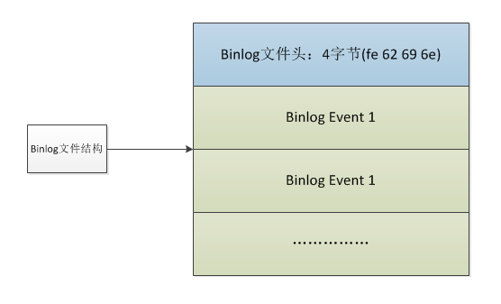
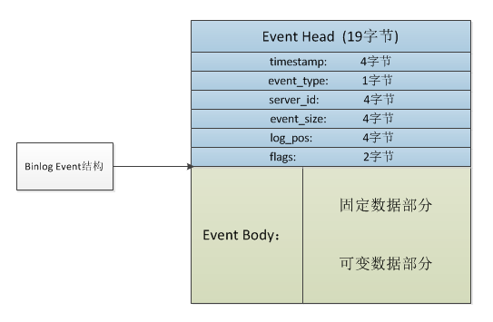
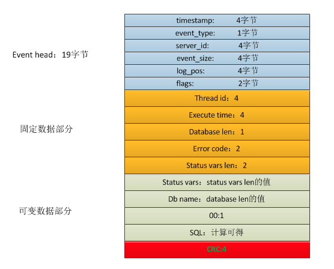
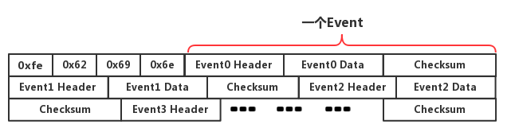
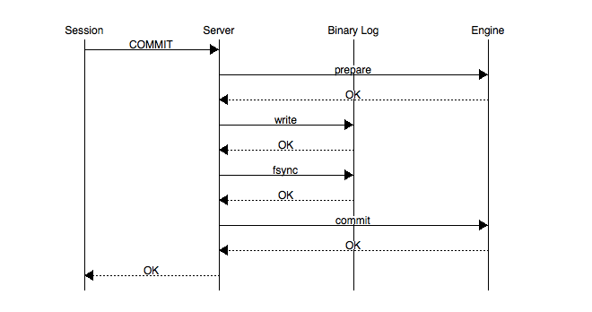
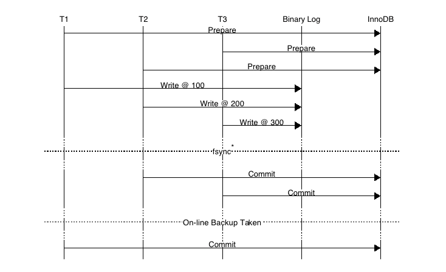
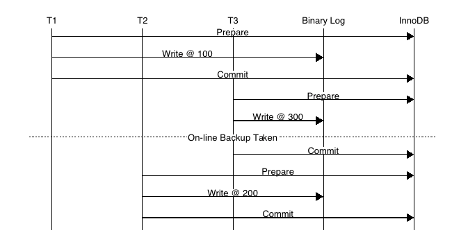
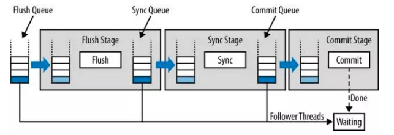

# 1、基本概念

> 二进制日志（binnary log）以**事件形式**记录了对MySQL数据库执行更改的所有操作。

binlog是记录所有数据库表结构变更（例如CREATE、ALTER TABLE…）以及表数据修改（INSERT、UPDATE、DELETE…）的二进制日志。不会记录SELECT和SHOW这类操作，因为这类操作对数据本身并没有修改，但可以通过查询通用日志来查看MySQL执行过的所有语句。

需要注意的一点是，即便**update操作没有造成数据变化，也是会记入binlog**。

binlog有两个常用的使用场景：

- 主从复制：mysql replication在master端开启binlog,master把它的二进制日志传递给slaves来达到master-slave数据一致的目的。

- 数据恢复：通过mysqlbinlog工具来恢复数据。

# 2、关键参数

binLog默认是关闭的，可以通过参数`log_bin`控制：

```mysql
mysql> show variables like 'log_bin'\G;
*************************** 1. row ***************************
Variable_name: log_bin
        Value: OFF
```

参数`max_binlog_size`指定了单个二进制日志文件的最大值:

```mysql
mysql> show variables like 'max_binlog_size'\G;
*************************** 1. row ***************************
Variable_name: max_binlog_size
        Value: 1073741824
```

默认为1G，如果超过该值，会写入新的文件，并记录到.index文件。

InnoDB会将所有未提交的binLog写到一个缓存中，等事务提交后再将缓存刷新到文件。缓存大小有参数`binlog_cache_size`控制。

```mysql
mysql> show variables like 'binlog_cache_size'\G;
*************************** 1. row ***************************
Variable_name: binlog_cache_size
        Value: 32768
```

需要注意的是，**该值是基于session的**，每个事务都会分配一个大小为binlog_cache_size的缓存。当一个事务的记录大于该值，MySQL会把缓冲中的日志写入一个临时文件。因此，需要根据使用场景合理设置这个参数，过大或者过小都会影响性能。

参数`sync_binlog`表示每写缓冲多少次就同步到磁盘：

```mysql
mysql> show variables like 'sync_binlog'\G;
*************************** 1. row ***************************
Variable_name: sync_binlog
        Value: 1
```

- N=1：表示采用同步写磁盘的方式来写二进制日志，这时写操作不使用操作系统的缓冲来写二进制日志，每次事务提交都会写入文件。
- N=0：表示MySQL不控制binlog的刷新，由文件系统自己控制它的缓存的刷新。这时候的性能是最好的，但是风险也是最大的。因为一旦系统Crash，在binlog_cache中的所有binlog信息都会被丢失。

但是，即使将sync_binlog设为1，还是会有一种情况会导致问题的发生。当使用InnoDB存储引擎时，在一个事务发出COMMIT动作之前，由于sync_binlog设为1，因此会将二进制日志立即写入磁盘。如果这时已经写入了二进制日志，但是提交还没有发生，并且此时发生了宕机，那么在MySQL数据库下次启动时，因为COMMIT操作并没有发生，所以这个事务会被回滚掉。但是二进制日志已经记录了该事务信息，不能被回滚。这个问题可以通过将参数`innodb_support_xa`设为1来解决，虽然innodb_support_xa与XA事务有关，但它同时也确保了二进制日志和InnoDB存储引擎数据文件的同步。


`binlog_format`是一个非常重要的参数，决定了记录二进制日志的格式：

```mysql
mysql> show variables like 'binlog_format'\G;
*************************** 1. row ***************************
Variable_name: binlog_format
        Value: ROW
```

可选值有：

- STATEMENT

  记录SQL语句。日志文件小，节约IO，但是对一些系统函数不能准确复制或不能复制，如now()、uuid()等

- ROW

  记录表的行更改情况，可以为数据库的恢复、复制带来更好的可靠性，但是二进制文件的大小相较于STATEMENT会有所增加

- MIXED

  STATEMENT和ROW模式的混合。默认采用STATEMENT格式进行二进制日志文件的记录，但是在一些情况下会使用ROW格式。

业内目前推荐使用的是`ROW`模式，准确性高，虽然说文件大，但是现在有SSD和万兆光纤网络，这些磁盘IO和网络IO都是可以接受的。

# 3、文件结构

## 3.1 文件头

Binlog文件从一个Binlog文件头开始，接着是一系列的Binlog事件。



文件头由一个四字节`Magic Number`构成，其值为1852400382，在内存中就是"0xfe,0x62,0x69,0x6e"。这个`Magic Number`就是来验证这个`binlog`文件是否有效 。

其实，在Java的class文件头中，也有这么一个四个字节的Magic Number——`0xCAFEBABE`，昵称“咖啡宝贝”。

## 3.2 事件



每个binlog事件都以一个**事件头**（event header）开始，然后是一个binlog事件类型特定的数据部分，称为**事件体**（event body）。

事件头的结构如下：

| 属性         | 字节数 | 含义                                     |
| ------------ | ------ | ---------------------------------------- |
| timestamp    | 4      | 包含了该事件的开始执行时间               |
| eventType    | 1      | 事件类型                                 |
| serverId     | 4      | 标识产生该事件的MySQL服务器的server-id   |
| eventLength  | 4      | 该事件的长度(Header+Data+CheckSum)       |
| nextPosition | 4      | 下一个事件在binlog文件中的位置           |
| flags        | 2      | 标识产生该事件的MySQL服务器的server-id。 |

事件体的具体结构与事件类型相关，以`QUERY_EVENT`类型为例，存储格式如下：



常见的事件类型有：

- **FORMAT_DESCRIPTION_EVENT**：该部分位于整个文件的头部，每个binlog文件都必定会有唯一一个该event
- **PREVIOUS_GTIDS_EVENT**：包含在每个binlog的开头，用于描述所有以前binlog所包含的全部***GTID***的一个集合(包括已经删除的binlog)
- **GTID_EVENT/ANONYMOUS_GTID_EVENT**：每一个Query事务前都会有这样的一个GTID_EVENT，如果未开启则是ANONYMOUS_GTID_EVENT。
- **QUERY_EVENT**：事务开始时，执行的BEGIN操作；ROW格式中的DDL操作等
- **TABLE_MAP_EVENT**：每个DML事务之前，都会有一个TABLE_MAP_EVENT，记录操作对应的表的信息。
- **WRITE_ROW_EVENT**：插入操作。
- **DELETE_ROW_EVENT**：删除操作。
- **UPDATE_ROW_EVENT**：更新操作。记载的是一条记录的完整的变化情况，即从**前量**变为**后量**的过程
- **XID_EVENT**：主要是事务提交的时候回在最后生成一个xid号，有这个便代表事务已经成功提交了
- **ROTATE_EVENT**：Binlog结束时的事件，与`FORMAT_DESCRIPTION_EVENT`一样仅有一个

更多事件类型的详细介绍可以参见[MySQL官方文档](https://dev.mysql.com/doc/internals/en/binlog-event.html)。

# 4、实战演练

默认情况下，二进制日志可能未开启，可以手动修改`my.cnf`文件，在`[mysqld]`配置段中加入如下配置，表示开启binlog，并且设置二进制日志文件名前缀为`mysql-binl`。

```properties
[mysqld]
server-id=1
log-bin=mysql-bin
```

重启mysql服务后，可以看到二进制日志功能已经开启：

```mysql
mysql> show variables like '%log_bin%';
+---------------------------------+---------------------------------------+
| Variable_name                   | Value                                 |
+---------------------------------+---------------------------------------+
| log_bin                         | ON                                    |
| log_bin_basename                | /usr/local/mysql/data/mysql-bin       |
| log_bin_index                   | /usr/local/mysql/data/mysql-bin.index |
| sql_log_bin                     | ON                                    |
+---------------------------------+---------------------------------------+
```

此时查看对应的日志目录，会发现两个文件:

- 索引文件(文件名后缀为.index)：用于记录哪些日志文件正在被使用
- 日志文件(文件名后缀为.00000*)：记录数据库所有的DDL和DML语句事件。

使用如下两条命令中的任何一条，均可在mysql中查看二进制日志的文件列表：

```mysql
mysql> show binary logs;
+------------------+-----------+
| Log_name         | File_size |
+------------------+-----------+
| mysql-bin.000001 |       658 |
+------------------+-----------+


mysql> show master logs;
+------------------+-----------+
| Log_name         | File_size |
+------------------+-----------+
| mysql-bin.000001 |       658 |
+------------------+-----------+

```

查看binlog的事件列表：

```mysql
mysql> show binlog events in 'mysql-bin.000001';
+-----+----------------+-------------+---------------------------------------+
| Pos | Event_type     | End_log_pos | Info                                  |
+-----+----------------+-------------+---------------------------------------+
|   4 | Format_desc    |         123 | Server ver: 5.7.22-log, Binlog ver: 4 |
| 123 | Previous_gtids |         154 |                                       |
| 154 | Anonymous_Gtid |         219 | SET @@SESSION.GTID_NEXT= 'ANONYMOUS'  |
| 219 | Query          |         291 | BEGIN                                 |
| 291 | Table_map      |         335 | table_id: 108 (test.t)                |
| 335 | Write_rows     |         375 | table_id: 108 flags: STMT_END_F       |
| 375 | Xid            |         406 | COMMIT /* xid=33 */                   |
| 406 | Anonymous_Gtid |         471 | SET @@SESSION.GTID_NEXT= 'ANONYMOUS'  |
| 471 | Query          |         543 | BEGIN                                 |
| 543 | Table_map      |         587 | table_id: 108 (test.t)                |
| 587 | Write_rows     |         627 | table_id: 108 flags: STMT_END_F       |
| 627 | Xid            |         658 | COMMIT /* xid=35 */                   |
+-----+----------------+-----------+-------------+---------------------------------------+
```

> 注：以上binlog的格式为`ROW`，且查询结果省略了`Log_name`列与`Server_id`列。

可以把整个二进制文件想象成一个字节序列。



文件头占用了最开始的四个字节，所以第一个事件是从`Pos`=4开始，到`End_log_pos=123`结束；第二个事件则从`Pos`=123开始，到`End_log_pos=154`结束……

binlog，顾名思义，它是二进制的，所以我们不能直接使用`cat`、`vim`命令查看，而是需要通过MySQL内置的命令`mysqlbinlog`读取日志内容。

执行命令`mysqlbinlog mysql-bin.000001`，看到类似下面这样的文本：

```shell
...
DELIMITER /*!*/;
# at 4
#191123 11:30:09 server id 1  end_log_pos 123 CRC32 0xaf6d52cc 	Start: binlog v 4, server v 5.7.22-log created 191123 11:30:09 at startup
# Warning: this binlog is either in use or was not closed properly.
ROLLBACK/*!*/;
BINLOG '
wafYXQ8BAAAAdwAAAHsAAAABAAQANS43LjIyLWxvZwAAAAAAAAAAAAAAAAAAAAAAAAAAAAAAAAAA
AAAAAAAAAAAAAAAAAADBp9hdEzgNAAgAEgAEBAQEEgAAXwAEGggAAAAICAgCAAAACgoKKioAEjQA
AcxSba8=
'/*!*/;
# at 123
#191123 11:30:09 server id 1  end_log_pos 154 CRC32 0x263544c0 	Previous-GTIDs
# [empty]
# at 154
#191123 15:42:40 server id 1  end_log_pos 219 CRC32 0xa887384b 	Anonymous_GTID	last_committed=0	sequence_number=1	rbr_only=yes
/*!50718 SET TRANSACTION ISOLATION LEVEL READ COMMITTED*//*!*/;
SET @@SESSION.GTID_NEXT= 'ANONYMOUS'/*!*/;
# at 219
#191123 15:42:40 server id 1  end_log_pos 291 CRC32 0x3901cdf0 	Query	thread_id=578	exec_time=0	error_code=0
SET TIMESTAMP=1574494960/*!*/;
SET @@session.pseudo_thread_id=578/*!*/;
SET @@session.foreign_key_checks=1, @@session.sql_auto_is_null=0, @@session.unique_checks=1, @@session.autocommit=1/*!*/;
SET @@session.sql_mode=1436549152/*!*/;
SET @@session.auto_increment_increment=1, @@session.auto_increment_offset=1/*!*/;
/*!\C utf8 *//*!*/;
SET @@session.character_set_client=33,@@session.collation_connection=33,@@session.collation_server=8/*!*/;
SET @@session.lc_time_names=0/*!*/;
SET @@session.collation_database=DEFAULT/*!*/;
BEGIN
/*!*/;
# at 291
...
# at 627
#191123 15:43:49 server id 1  end_log_pos 658 CRC32 0xc0b9acd9 	Xid = 35
COMMIT/*!*/;
SET @@SESSION.GTID_NEXT= 'AUTOMATIC' /* added by mysqlbinlog */ /*!*/;
DELIMITER ;
# End of log file
```

注意其中的`at 4`、`at 123`、`at 154`等，与`show binlog events in 'mysql-bin.000001'`查询结果中的`Pos`、`End_log_pos`是一一对应的。

# 5、二进制日志与重做日志的区别


二进制日志中也记录了InnoDB表的很多操作，也能实现重做的功能，但是它与重做日志们之间有很大区别。

- **二进制日志是MySQL Server层的**，不管是什么存储引擎，对数据库进行了修改都会产生二进制日志。而**redo log是InnoDB存储引擎层的**，只记录该存储引擎中表的修改。
- **二进制日志记录的是逻辑日志**。即便它是基于行格式的记录方式，其本质也还是逻辑的SQL设置，如该行记录的每列的值是多少。而**redo log是在物理格式上的日志**，它记录的是数据库中每个页的修改。
- 二进制日志只在每次事务提交的时候一次性写入缓存中的日志"文件"(对于非事务表的操作，则是每次执行语句成功后就直接写入)。而redo log在数据准备修改前写入缓存中的redo log中，然后才对缓存中的数据执行修改操作；而且保证在发出事务提交指令时，先向缓存中的redo log写入日志，写入完成后才执行提交动作。
- 因为**二进制日志只在提交的时候一次性写入**，所以二进制日志中的记录方式和提交顺序有关，且一次提交对应一次记录。而redo log中是记录的物理页的修改，redo log文件中同一个事务可能多次记录，最后一个提交的事务记录会覆盖所有未提交的事务记录。而且redo log是并发写入的，不同事务之间的不同版本的记录会穿插写入到redo log文件中，例如可能redo log的记录方式如下： T1-1,T1-2,T2-1,T2-2,T2,T1-3,T1 。
- 事务日志记录的是物理页的情况，它具有幂等性，因此记录日志的方式极其简练。幂等性的意思是多次操作前后状态是一样的，例如新插入一行后又删除该行，前后状态没有变化。而二进制日志记录的是所有影响数据的操作，记录的内容较多。例如插入一行记录一次，删除该行又记录一次。

# 6、Redo log与Binlog的一致性

## 6.1 CrashSafe

**CrashSafe**指MySQL服务器宕机重启后，能够保证：

- 所有已经提交的事务的数据仍然存在。
- 所有没有提交的事务的数据自动回滚。

MySQL没有开启Binary log的情况下，Innodb通过Redo Log和Undo Log可以保证以上两点。为了保证严格的CrashSafe，必须要在每个事务提交的时候，将Redo Log写入硬件存储。

那么，在MySQL开启Binary log的主从架构中，怎么保证CrashSafe的呢？

首先，为了保证master和slave的数据一致性，就**必须保证binlog和InnoDB redo日志的一致性**。因为备库通过二进制日志重放主库提交的事务，而主库binlog写入在commit之前，如果写完binlog主库crash，再次启动时会回滚事务。但此时从库已经执行，则会造成主备数据不一致。

为此，MySQL引入二阶段提交，MySQL内部会自动将普通事务当做一个XA事务（内部分布式事物）来处理：

- 自动为每个事务分配一个唯一的ID（XID）。
- COMMIT会被自动的分成Prepare和Commit两个阶段。
- Binlog会被当做事务协调者(Transaction Coordinator)，Binlog Event会被当做协调者日志。

**Binlog在2PC中充当了事务的协调者**（Transaction Coordinator）。由Binlog来通知InnoDB引擎来执行prepare，commit或者rollback的步骤。事务提交的整个过程如下：



以上的图片中可以看到，事务的提交主要分为三个主要步骤：

- **步骤1**：此时SQL已经成功执行，并生成xid信息及redo和undo的内存日志。然后调用prepare方法完成第一阶段，papare方法实际上什么也没做，将事务状态设为TRX_PREPARED，并将redo log刷磁盘。
- **步骤2**：如果事务涉及的所有存储引擎的prepare都执行成功，则记录协调者日志，即Binlog日志。此时，事务已经肯定要提交了。否则，调用ha_rollback_trans方法回滚事务，而SQL语句实际上也不会写到binlog。
- **步骤3**：调用引擎的commit完成事务的提交。会清除undo信息，刷redo日志，将事务设为TRX_NOT_STARTED状态。

也就是说，记录Binlog是在InnoDB引擎Prepare（即Redo Log写入磁盘）之后。一旦步骤2中的操作完成，就确保了事务的提交，即使在执行步骤3时数据库宕机。

此外需要注意的是，每个步骤都需要进行一次fsync操作才能保证上下两层数据的一致性。步骤2的fsync参数由`sync_binlog=1`控制，步骤3的fsync由参数`innodb_flush_log_at_trx_commit=1`控制，俗称“双1”，是保证CrashSafe的根本。

> `innodb_flush_log_at_trx_commit`：设置为1，表示每次事务的redolog都直接持久化到磁盘（注意是这里指的是redolog日志本身落盘），保证mysql重启后数据不丢失。
>
> `sync_binlog`： 设置为1，表示每次事务的binlog都直接持久化到磁盘（注意是这里指的是binlog日志本身落盘），保证mysql重启后binlog记录是完整的。

事务的两阶段提交协议保证了无论在任何情况下，事务要么同时存在于存储引擎和binlog中，要么两个里面都不存在，这就保证了主库与从库之间数据的一致性。

另外，MySQL内部两阶段提交需要开启`innodb_support_xa=true`，默认开启。这个参数就是支持分布式事务两段式事务提交。redo和binlog数据一致性就是靠这个两段式提交来完成的，如果关闭会造成事务数据的丢失。

## 6.2 故障恢复

如果数据库系统发生崩溃，当数据库系统重新启动时会进行崩溃恢复操作，存储引擎中处于prepare状态的事务会去查询该事务是否也同时存在于binlog中，如果存在就在存储引擎内部提交该事务（因为此时从库可能已经获取了对应的binlog内容），如果binlog中没有该事务，就回滚该事务。例如：当崩溃发生在第一步和第二步之间时，明显处于prepare状态的事务还没来得及写入到binlog中，所以该事务会在存储引擎内部进行回滚，这样该事务在存储引擎和binlog中都不会存在；当崩溃发生在第二步和第三步之间时，处于prepare状态的事务存在于binlog中，那么该事务会在存储引擎内部进行提交，这样该事务就同时存在于存储引擎和binlog中。

MySQL在prepare阶段会生成**xid**，然后会在commit阶段写入到binlog中。在进行恢复时**事务要提交还是回滚，是由Binlog来决定的**。

- 事务的Xid_log_event存在，就要提交。
- 事务的Xid_log_event不存在，就要回滚。

恢复的过程非常简单：

- 从Binlog中读出所有的Xid_log_event
- 告诉InnoDB提交这些XID的事务
- InnoDB回滚其它的事务

总结一下，可能会出现的情况有三种：

- 当事务在prepare阶段crash，数据库recovery的时候该事务未写入Binary log并且存储引擎未提交，将该事务rollback。
- 当事务在binlog阶段crash，此时日志还没有成功写入到磁盘中，启动时会rollback此事务。
- 当事务在binlog日志已经fsync()到磁盘后crash，但是InnoDB没有来得及commit，此时MySQL数据库recovery的时候将会读出二进制日志的Xid_log_event，然后告诉InnoDB提交这些XID的事务，InnoDB提交完这些事务后会回滚其它的事务，使存储引擎和二进制日志始终保持一致。

可以看出，如果一个事务在prepare阶段中落盘成功，并在MySQL Server层中的binlog也写入成功，那这个事务必定commit成功。

## 6.3 提交顺序一致性

上面提到单个事务的二阶段提交过程，能够保证存储引擎和binary log日志保持一致，但是在并发的情况下怎么保证InnoDB层事务日志和MySQL数据库二进制日志的提交的顺序一致？

先来看下如果Binary Log和存储引擎顺序不一致会造成什么影响。

假如我们通过xtrabackup或ibbackup这种物理备份工具进行备份时，并使用备份来建立复制：



如上图，事务按照T1、T2、T3顺序开始执行，将二进制日志（按照T1、T2、T3顺序）写入日志文件系统缓冲，调用fsync()进行一次group commit将日志文件永久写入磁盘，但是存储引擎提交的顺序为T2、T3、T1。当T2、T3提交事务之后，若通过在线物理备份进行数据库恢复来建立复制时，因为在InnoDB存储引擎层会检测事务T3在上下两层都完成了事务提交，不需要在进行恢复了，此时主备数据不一致（搭建Slave时，change master to的日志偏移量记录T3在事务位置之后）。

为了解决以上问题，在早期的MySQL 5.6版本之前，通过`prepare_commit_mutex`锁以串行的方式来保证MySQL数据库上层二进制日志和Innodb存储引擎层的事务提交顺序一致，然后会导致**组提交**（group commit）特性无法生效。为了满足数据的持久化需求，一个完整事务的提交最多会导致3次fsync操作。为了提高MySQL在开启binlog的情况下单位时间内的事务提交数，就必须减少每个事务提交过程中导致的fsync的调用次数。所以，MySQL从5.6版本开始加入了`binlog group commit`技术。

MySQL数据库内部在prepare redo阶段获取prepare_commit_mutex锁，一次只能有一个事务可获取该mutex。通过这个臭名昭著prepare_commit_mutex锁，将redo log和binlog刷盘串行化，串行化的目的也仅仅是为了保证redo log和Binlog一致，继而无法实现group commit，牺牲了性能。整个过程如下图：



上图可以看出在prepare_commit_mutex，只有当上一个事务commit后释放锁，下一个事务才可以进行prepare操作，从而保证二进制日志和存储引擎顺序保持一致，锁机制造成高并发提交事务的时候性能非常差而且二进制日志也无法group commit。

## 6.4 BLGC（Binary Log Group Commit）

MySQL 5.6引入了BLGC（Binary Log Group Commit），不但MySQL数据库上层二进制日志写入是group commit的，InnoDB存储引擎层也是group commit的。此外还移除了原先的锁prepare_commit_mutex，从而大大提高了数据库的整体性。其事务的提交过程分成三个阶段，Flush stage、Sync stage、Commit stage。如下图：



- Flush Stage
  将每个事务的二进制日志写入内存中。
- Sync Stage
  将内存中的二进制日志刷新到磁盘，若队列中有多个事务，那么仅一次fsync操作就完成了二进制日志的写入，这就是BLGC。
- Commit Stage
  leader根据顺序调用存储引擎层事务的提交，Innodb本身就支持group commit，因此修复了原先由于锁prepare_commit_mutex导致group commit失效的问题。

BLGC的基本思想是，**引入队列机制保证Innodb commit顺序与binlog落盘顺序一致**，并将事务分组，组内的binlog刷盘动作交给一个事务进行，实现组提交目的。在MySQL数据库上层进行提交时首先按顺序将其放入一个队列中，每个队列各自有mutex保护，队列中的第一个事务称为leader，其他事务称为follow，leader控制着follow的行为。

当有一组事务在进行commit阶段时，其他新事物可以进行Flush阶段，从而使group commit不断生效。当然group commit的效果由队列中事务的数量决定，若每次队列中仅有一个事务，那么可能效果和之前差不多，甚至会更差。但当提交的事务越多时，group commit的效果越明显，数据库性能的提升也就越大。