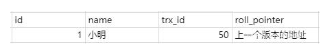
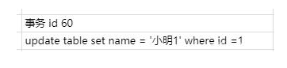
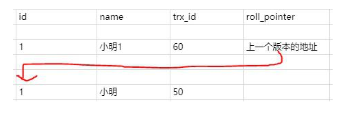
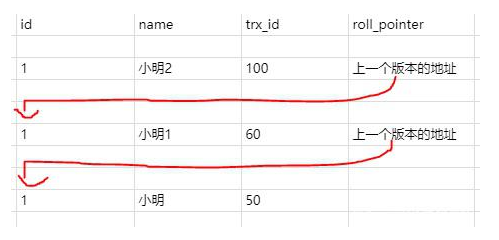
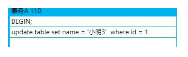
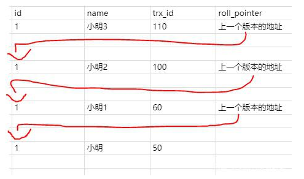

# 1、基本概念

> **MVCC**(Mutil-Version Concurrency Control)，即多版本并发控制，通过保存数据在某个时间点的快照来实现。根据事务开始的时间不同，每个事务对同一张表，用一时刻看到的数据可能是不一样的。

MVCC的基本原理如下：

- 每行数据都存在一个版本，每次数据更新时都更新该版本。
- 修改时Copy出当前版本随意修改，各个事务之间无干扰。
- 保存时比较版本号，如果成功（commit），则覆盖原记录；失败则放弃copy（rollback）

使用基于锁的并发控制（Lock-Based Concurrency Control），开销是非常大的 ，而使用MVCC机制来做，能一定程度的代替行锁，可以做到**读不加锁，读写不冲突**，在读多写少的OLTP应用中，读写不冲突是非常重要的，极大的增加了系统的并发性能。

# 2、版本链

在InnoDB引擎表中，它的聚集索引记录中有两个必要的隐藏列：



- **trx_id**：用来标识最近一次对本行记录做修改(insert|update)的事务的标识符, 即最后一次修改(insert|update)本行记录的事务id。
- **roll_pointer**：每次有修改的时候，都会把老版本写入undo日志中。这个roll_pointer就是存了一个指针，它指向这条聚簇索引记录的上一个版本的位置，通过它来获得上一个版本的记录信息。(注意插入操作的undo日志没有这个属性，因为它没有老版本)

比如现在有个事务id是60的执行的这条记录的修改语句：



此时在undo日志中就存在版本链：



# 3、ReadView

MVCC在InnoDB引擎中，就是指在`已提交读`(READ COMMITTD)和`可重复读(`REPEATABLE READ)这两种隔离级别下的事务对于SELECT操作会访问版本链中的记录的过程。

**已提交读和可重复读的区别就在于它们生成ReadView的策略不同**。

ReadView中主要就是有个列表来存储我们系统中当前活跃着的读写事务，也就是begin了还未提交的事务。通过这个列表来判断记录的某个版本是否对当前事务可见。

假设当前列表里的事务id为[80,100]。

- 如果你要访问的记录版本的事务id为50，比当前列表最小的id80小，那说明这个事务在之前就提交了，所以对当前活动的事务来说是可访问的。
- 如果你要访问的记录版本的事务id为90,发现此事务在列表id最大值和最小值之间，那就再判断一下是否在列表内，如果在那就说明此事务还未提交，所以版本不能被访问。如果不在那说明事务已经提交，所以版本可以被访问。
- 如果你要访问的记录版本的事务id为110，那比事务列表最大id100都大，那说明这个版本是在ReadView生成之后才发生的，所以不能被访问。

这些记录都是去版本链里面找的，先找最近记录，如果最近这一条记录事务id不符合条件，不可见的话，再去找上一个版本再比较当前事务的id和这个版本事务id看能不能访问，以此类推直到返回可见的版本或者结束。

举个例子 ，在已提交读隔离级别下：

比如此时有一个事务id为100的事务，修改了name,使得的name等于小明2，但是事务还没提交。则此时的版本链是



那此时另一个事务发起了select 语句要查询id为1的记录，那此时生成的ReadView 列表只有[100]。那就去版本链去找了，首先肯定找最近的一条，发现trx_id是100,也就是name为小明2的那条记录，发现在列表内，所以不能访问。

这时候就通过指针继续找下一条，name为小明1的记录，发现trx_id是60，小于列表中的最小id,所以可以访问，直接访问结果为小明1。

那这时候我们把事务id为100的事务提交了，并且新建了一个事务id为110也修改id为1的记录，并且不提交事务



这时候版本链就是



这时候之前那个select事务又执行了一次查询,要查询id为1的记录。

**关键的地方来了**：

- 已提交读隔离级别：这时候会重新一个ReadView，那活动事务列表中的值就变了，变成了[110]，去版本链通过trx_id对比查找到合适的结果就是小明2。
- 可重复读隔离级别：ReadView还是第一次select时候生成的ReadView，也就是列表的值还是[100]。所以select的结果是小明1。所以第二次select结果和第一次一样，所以叫可重复读。

**也就是说已提交读隔离级别下的事务在每次查询的开始都会生成一个独立的ReadView，而可重复读隔离级别则在第一次读的时候生成一个ReadView，之后的读都复用之前的ReadView。**

# 4、实例分析

InnoDB的MVCC，是通过在每行记录后面保存两个隐藏的列来实现的。这两个列，分别保存了这个行的创建时间，一个保存的是行的删除时间。这里存储的并不是实际的时间值,而是系统版本号(可以理解为事务的ID，也就是上文中的`trx_id`)，每开始一个新的事务，系统版本号就会自动递增。

下面看一下在REPEATABLE READ隔离级别下，MVCC下的增删改查具体是如何操作的。

建立测试表：

```mysql
create table test(
    id int primary key auto_increment,
	name varchar(20)
);
```

## 4.1 INSERT

InnoDB为新插入的每一行保存当前系统版本号作为版本号。

```mysql
start transaction;-- 事务1
insert into test values(NULL,'Jack Ma') ; -- 马云
insert into test values(NULL,'Pony Ma');-- 马化腾
insert into test values(NULL,'Richard Liu');-- 刘强东
commit;
```

假设版本号从1开始，对应在数据中的表如下(后面两列是隐藏列)：

| id   | name        | 创建时间(事务ID) | 删除时间(事务ID) |
| ---- | ----------- | ---------------- | ---------------- |
| 1    | Jack Ma     | 1                | undefined        |
| 2    | Pony Ma     | 1                | undefined        |
| 3    | Richard Liu | 1                | undefined        |

## 4.2 SELECT

InnoDB会根据以下两个条件检查每行记录：

- **InnoDB只会查找版本早于当前事务版本的数据行**(也就是，行的系统版本号小于或等于事务的系统版本号)，这样可以确保事务读取的行，要么是在事务开始前已经存在的，要么是事务自身插入或者修改过的。
- **行的删除版本要么未定义，要么大于当前事务版本号**，这可以确保事务读取到的行，在事务开始之前未被删除。

## 4.3 DELETE

InnoDB会为删除的每一行保存当前系统的版本号(事务的ID)作为删除标识。
看下面的具体例子分析:

```mysql
start transaction; -- 事务2
select * from test;  -- (1)
select * from test;  -- (2)
commit; 
```

### 4.3.1 情况一

假设在执行这个事务ID为2的过程中，刚执行到(1)，这时，有另一个事务ID为3往这个表里插入了一条数据：

```mysql
start transaction;-- 事务3
insert into test values(NULL,'William Ding'); -- 丁磊
commit;
```

这时表中的数据如下:

| id   | name         | 创建时间(事务ID) | 删除时间(事务ID) |
| ---- | ------------ | ---------------- | ---------------- |
| 1    | Jack Ma      | 1                | undefined        |
| 2    | Pony Ma      | 1                | undefined        |
| 3    | Richard Liu  | 1                | undefined        |
| 4    | William Ding | 3                | undefined        |

然后接着执行事务2中的(2)，由于id=4的数据的创建时间(事务ID为3)，执行当前事务的ID为2，而InnoDB只会查找事务ID小于等于当前事务ID的数据行，所以id=4的数据行并不会在执行事务2中的(2)被检索出来，在事务2中的两条select 语句检索出来的数据都只会下表:

| id   | name        | 创建时间(事务ID) | 删除时间(事务ID) |
| ---- | ----------- | ---------------- | ---------------- |
| 1    | Jack Ma     | 1                | undefined        |
| 2    | Pony Ma     | 1                | undefined        |
| 3    | Richard Liu | 1                | undefined        |

### 4.3.2 情况二

假设在执行这个事务ID为2的过程中，刚执行到(1)，假设事务执行完事务3后，接着又执行了事务4：

```mysql
start transaction;  -- 事务4
delete from test where id=1;
commit;  
```

此时数据库中的表如下:

| id   | name         | 创建时间(事务ID) | 删除时间(事务ID) |
| ---- | ------------ | ---------------- | ---------------- |
| 1    | Jack Ma      | 1                | 4                |
| 2    | Pony Ma      | 1                | undefined        |
| 3    | Richard Liu  | 1                | undefined        |
| 4    | William Ding | 3                | undefined        |

接着执行事务ID为2的事务(2)，根据检索条件可以知道，它会检索创建事务的ID小于当前事务ID的行和删除事务的ID大于当前事务的行，而id=4的行上面已经说过，而id=1的行由于删除事务的ID大于当前事务的ID，所以事务2的(2)也会把id=1的数据检索出来。所以，事务2中的两条select 语句检索出来的数据都如下:

| id   | name        | 创建时间(事务ID) | 删除时间(事务ID) |
| ---- | ----------- | ---------------- | ---------------- |
| 1    | Jack Ma     | 1                | 4                |
| 2    | Pony Ma     | 1                | undefined        |
| 3    | Richard Liu | 1                | undefined        |

## 4.4 UPDATE

InnoDB执行UPDATE，实际上是新插入了一行记录，并保存其创建时间为当前事务的ID，同时保存当前事务ID到要UPDATE的行的删除时间。

假设在执行完事务2的(1)后又执行，其它用户执行了事务3、4，这时，又有一个用户对这张表执行了UPDATE操作:

```mysql
start transaction;-- 事务5
update test set name='Charles Zhang' where id=2; -- 张朝阳
commit;
```


根据update的更新原则：会生成新的一行，并在原来要修改的列的删除时间列上添加本事务ID，得到表如下:

| id   | name          | 创建时间(事务ID) | 删除时间(事务ID) |
| ---- | ------------- | ---------------- | ---------------- |
| 1    | Jack Ma       | 1                | 4                |
| 2    | Pony Ma       | 1                | 5                |
| 3    | Richard Liu   | 1                | undefined        |
| 4    | William Ding  | 3                | undefined        |
| 2    | Charles Zhang | 5                | undefined        |


继续执行事务2的(2)，根据select 语句的检索条件，得到下表:

| id   | name        | 创建时间(事务ID) | 删除时间(事务ID) |
| ---- | ----------- | ---------------- | ---------------- |
| 1    | Jack Ma     | 1                | 4                |
| 2    | Pony Ma     | 1                | 5                |
| 3    | Richard Liu | 1                | undefined        |

还是和事务2中(1)select 得到相同的结果。