# 1、缓冲池的定义

应用系统分层架构，为了加速数据访问，会把最常访问的数据放在**缓存**(cache)里，避免每次都去访问数据库。操作系统会有**缓冲池**(buffer pool)机制，避免每次访问磁盘，以加速数据的访问。MySQL作为一个存储系统，同样具有缓冲池机制，以避免每次查询数据都进行磁盘IO。

> 缓冲池简单来说就是一块内存区域，通过内存的速度来弥补磁盘速度较慢对数据库性能的影响。

在数据库当中读取页的操作，首先将从磁盘读到的页存放在缓存池中。下一次再读相同的页时，首先判断该页是不是在缓冲池中。若在，直接读取。否则，读取磁盘上的页。

对于数据库中页的修改操作，则首先修改缓存池中的页，然后再以一定的频率刷新到磁盘上。需要注意的是，缓冲池刷新回磁盘并不是每次页发生更新时触发，而是通过一种称为**Checkpoint**的机制刷新回磁盘。

缓冲池中缓存的数据页类型有：索引页、数据页、undo页、插入缓冲（insert buffer）、自适应哈希索引（adaptive hash index）、InnoDB存储的锁信息（lock info）、数据字典信息（data dictionary）等。不能简单地认为，缓冲池只是缓存索引页和数据页，它们只是占缓冲池很大的一部分而已。

下图很好地显示了InnoDB存储引擎中内存的结构情况。

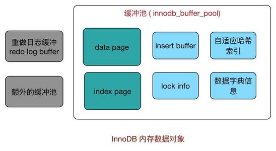

**缓冲池中页的大小默认为16KB**。 

缓冲池大小可以通过`innodb_buffer_pool_size`参数来设置

```mysql
mysql> show variables like 'innodb_buffer_pool_size'\G;
*************************** 1. row ***************************
Variable_name: innodb_buffer_pool_size
        Value: 134217728
```

为了减少数据库内部资源竞争，增加数据库并发能力，可以使用多个缓冲实例，每个页根据哈希值平均分配道不同缓冲池实例中，设置参数为`innodb_buffer_poll_instances`，默认为1。

```mysql
mysql> show variables like 'innodb_buffer_pool_instances'\G;
*************************** 1. row ***************************
Variable_name: innodb_buffer_pool_instances
        Value: 1
```

# 2、预读

## 2.1 基本概念

InnoDB在I/O的优化上有个比较重要的特性为**预读**(Read-Ahead)，它会异步地在缓冲池中提前读取多个预计很快就会用到的数据页。

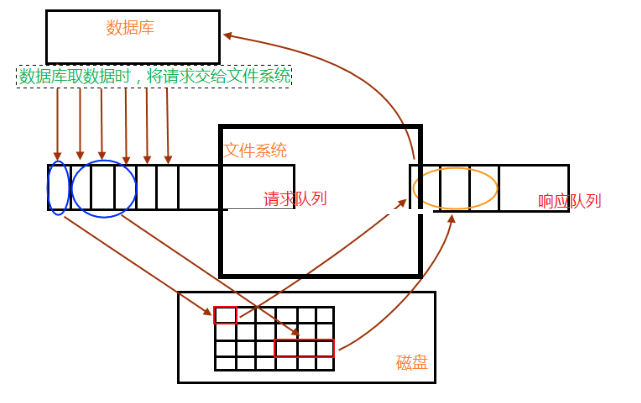

数据库请求数据的时候，会将读请求交给文件系统，放入请求队列中；相关进程从请求队列中将读请求取出，根据需求到相关数据区(内存、磁盘)读取数据；取出的数据，放入响应队列中，最后数据库就会从响应队列中将数据取走，完成一次数据读操作过程。

接着进程继续处理请求队列，判断后面几个数据读请求的数据是否相邻，再根据自身系统IO带宽处理量，进行预读，进行读请求的合并处理，一次性读取多块数据放入响应队列中，再被数据库取走。

## 2.2 两种算法

InnoDB使用两种预读算法来提高I/O性能：**线性预读**（linear read-ahead）和**随机预读**（randomread-ahead）

为了区分这两种预读的方式，我们可以把线性预读放到以extent为单位，而随机预读放到以extent中的page为单位。线性预读着眼于将下一个extent提前读取到buffer pool中，而随机预读着眼于将当前extent中的剩余的page提前读取到buffer pool中。

### 2.2.1 线性预读

线性预读方式有一个很重要的变量控制是否将下一个extent预读到buffer pool中，通过使用配置参数`innodb_read_ahead_threshold`控制触发innodb执行预读操作的时间。

如果一个extent中的被顺序读取的page超过或者等于该参数变量时，Innodb将会异步的将下一个extent读取到buffer pool中，`innodb_read_ahead_threshold`可以设置为0-64的任何值(因为一个extent中也就只有64页)，默认值为56，值越高，访问模式检查越严格。

```mysql
mysql> show variables like 'innodb_read_ahead_threshold';
+-----------------------------+-------+
| Variable_name               | Value |
+-----------------------------+-------+
| innodb_read_ahead_threshold | 56    |
+-----------------------------+-------+
```

例如，如果将值设置为48，则InnoDB只有在顺序访问当前extent中的48个pages时才触发线性预读请求，将下一个extent读到内存中。如果值为8，InnoDB触发异步预读，即使程序段中只有8页被顺序访问。

在没有该变量之前，当访问到extent的最后一个page的时候，innodb会决定是否将下一个extent放入到buffer pool中。

### 3.2.2 随机预读

随机预读方式则是表示当同一个extent中的一些page在buffer pool中发现时，Innodb会将该extent中的剩余page一并读到buffer pool中。

```mysql
mysql> show variables like 'innodb_random_read_ahead';
+--------------------------+-------+
| Variable_name            | Value |
+--------------------------+-------+
| innodb_random_read_ahead | OFF   |
+--------------------------+-------+
```

由于随机预读方式给innodb code带来了一些不必要的复杂性，同时在性能也存在不稳定性，在5.5中已经将这种预读方式废弃，默认是OFF。

# 3、缓冲刷新策略

## 3.1 LRU算法

通常来说，缓冲池是通过**LRU**（*Latest Recent Used*，最近最少使用）算法来进行管理的。即最多使用页在LRU列表前端，而最少使用页在LRU列表后端。当缓冲池不能存放新读取到的页时，将首先释放LRU列表中末端的页。

这里又分两种情况：

- 页已经在缓冲池里，那就只做“移至”LRU头部的动作，而没有页被淘汰；
- 页不在缓冲池里，除了做“放入”LRU头部的动作，还要做“淘汰”LRU尾部页的动作；

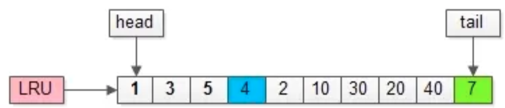

如上图，假如管理缓冲池的LRU长度为10，缓冲了页号为1，3，5…，40，7的页。

假如，接下来要访问的数据在页号为4的页中：

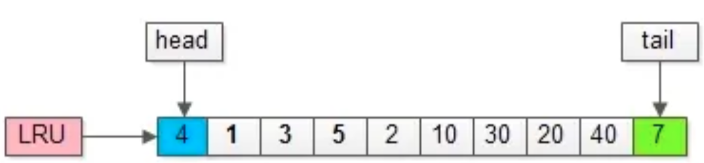

- 页号为4的页，本来就在缓冲池里；
- 把页号为4的页，放到LRU的头部即可，没有页被淘汰；

为了减少数据移动，LRU一般用链表实现。

假如，再接下来要访问的数据在页号为50的页中：

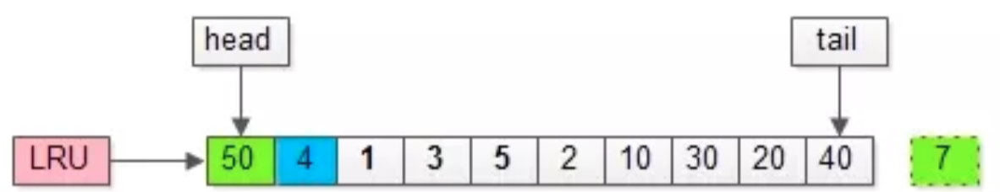

- 页号为50的页，原来不在缓冲池里；
- 把页号为50的页，放到LRU头部，同时淘汰尾部页号为7的页；


传统的LRU缓冲池算法十分直观，OS，memcache等很多软件都在用，但是InnoDB对传统LRU算法做了一些优化，来应对**预读失效**与**缓冲池污染**的问题。

## 3.2 预读失效

> 由于预读，提前把页放入了缓冲池，但最终MySQL并没有从页中读取数据，称为**预读失效**。

要优化预读失效，思路是：

- 让预读失败的页，停留在缓冲池LRU里的时间尽可能短；
- 让真正被读取的页，才挪到缓冲池LRU的头部；

以此来保证真正被读取的热数据留在缓冲池里的时间尽可能长。

具体方法是：

- 将LRU分为两个部分：新生代(new sublist)与老生代(old sublist)
- 新老生代收尾相连，即：新生代的尾(tail)连接着老生代的头(head)；
- 新页（例如被预读的页）加入缓冲池时，只加入到老生代头部：如果数据真正被读取（预读成功），才会加入到新生代的头部；如果数据没有被读取，则会比新生代里的“热数据页”更早被淘汰出缓冲池

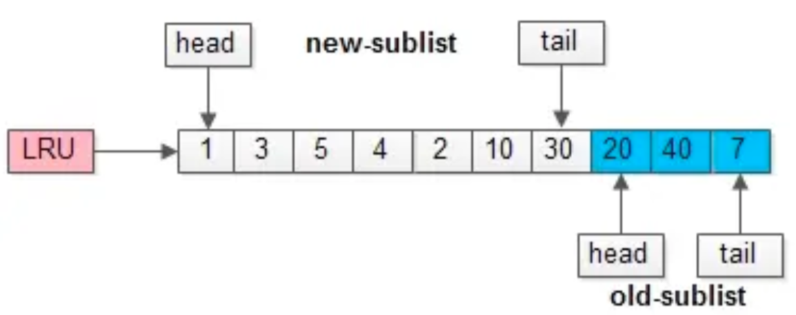

举个例子，整个缓冲池LRU如上图：

- 整个LRU长度是10；
- 前70%是新生代；
- 后30%是老生代；
- 新老生代首尾相连；

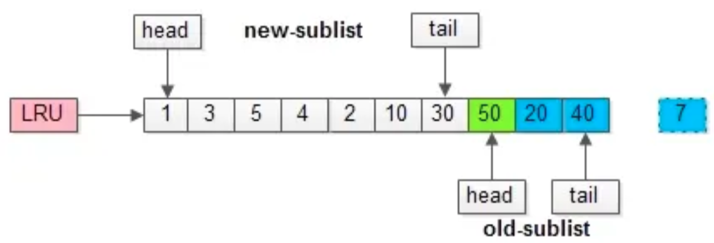

假如有一个页号为50的新页被预读加入缓冲池：

- 50只会从老生代头部插入，老生代尾部（也是整体尾部）的页会被淘汰掉；
- 假设50这一页不会被真正读取，即预读失败，它将比新生代的数据更早淘汰出缓冲池；

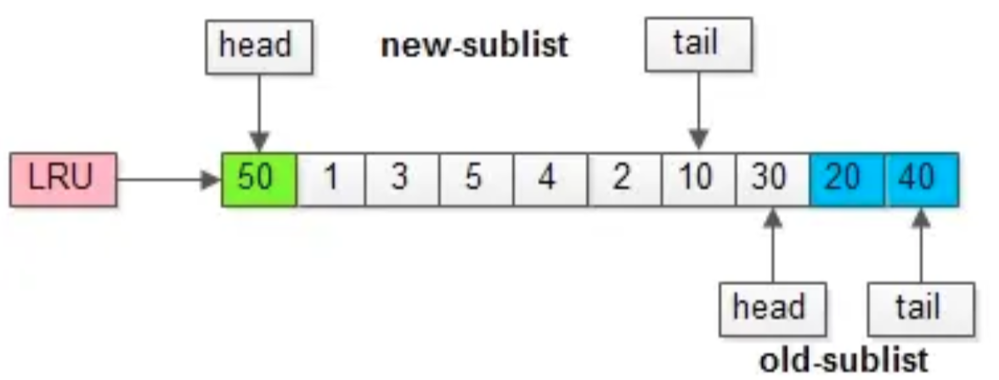

假如50这一页立刻被读取到，例如SQL访问了页内的行row数据：

- 它会被立刻加入到新生代的头部；
- 新生代的页会被挤到老生代，此时并不会有页面被真正淘汰；

## 3.3 缓冲池污染

> 当某一个SQL语句，要批量扫描大量数据时，可能导致把缓冲池的所有页都替换出去，导致大量热数据被换出，MySQL性能急剧下降，这种情况叫**缓冲池污染**。

例如，有一个数据量较大的用户表，当执行：

`select * from user where name like "%John%";`

虽然结果集可能只有少量数据，但这类like不能命中索引，必须全表扫描，就需要访问大量的页：

- 把页加到缓冲池（插入老生代头部）；
- 从页里读出相关的row（插入新生代头部）；
- row里的name字段和字符串shenjian进行比较，如果符合条件，加入到结果集中；
- …直到扫描完所有页中的所有row…

如此一来，所有的数据页都会被加载到新生代的头部，但只会访问一次，真正的热数据被大量换出。

怎么这类扫码大量数据导致的缓冲池污染问题呢？MySQL缓冲池加入了一个“**老生代停留时间窗口**”的机制：假设T=老生代停留时间窗口，插入老生代头部的页，即使立刻被访问，并不会立刻放入新生代头部，只*满足“被访问”并且“在老生代停留时间”大于T，才会被放入新生代头部。

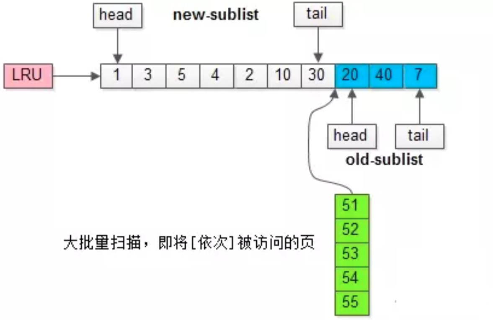

继续举例，假如批量数据扫描，有51，52，53，54，55等五个页面将要依次被访问。

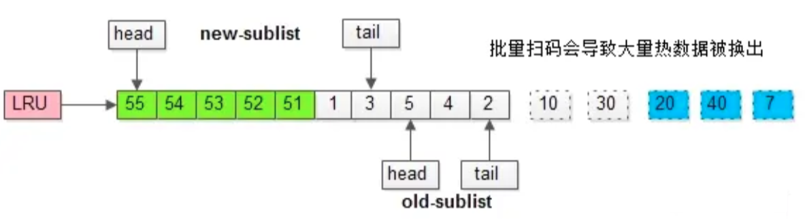

如果没有“老生代停留时间窗口”的策略，这些批量被访问的页面，会换出大量热数据。

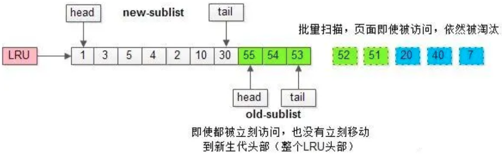

加入“老生代停留时间窗口”策略后，短时间内被大量加载的页，并不会立刻插入新生代头部，而是优先淘汰那些，短期内仅仅访问了一次的页。

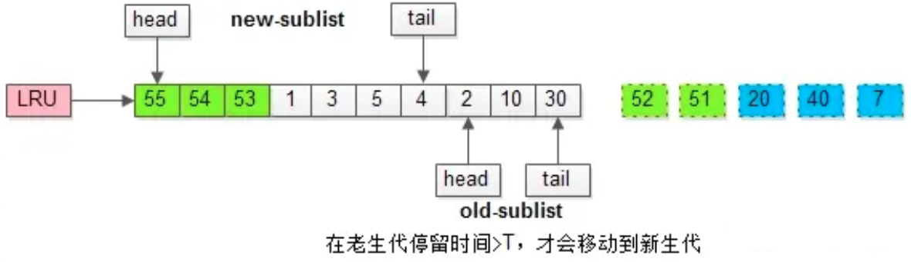

而只有在老生代呆的时间足够久，停留时间大于T，才会被插入新生代头部。

## 3.4 相关参数

```mysql
mysql> show variables like 'innodb_old_blocks_pct'\G;
*************************** 1. row ***************************
Variable_name: innodb_old_blocks_pct
        Value: 37
```

`innodb_old_blocks_pct`控制老生代占整个LRU链长度的比例，默认是37，即整个LRU中新生代与老生代长度比例是63:37。如果把这个参数设为100，就退化为普通LRU了。

```mysql
mysql> show variables like 'innodb_old_blocks_time'\G;
*************************** 1. row ***************************
Variable_name: innodb_old_blocks_time
        Value: 1000
```

`innodb_old_blocks_time`代表老生代停留时间窗口，单位是毫秒，默认是1000，即同时满足“被访问”与“在老生代停留时间超过1秒”两个条件，才会被插入到新生代头部。


数据库刚启动时，LRU列表是空的，缓冲池的所有页都存放在**Free列表**中。需要添加新的缓冲时，若Free列表中有可用的空闲页，则将其移到LRU列表；否则，根据LRU算法，淘汰末尾页。

LRU列表中的页被修改后，跟磁盘上的页就产生了不一致的情况，称该页为**脏页**（dirty page）。数据库会通过checkpoint机制将脏页刷新回磁盘。脏页由**Flush列表**管理。

可以通过`show engine innodb status`命令查看缓冲池的的状态：

```mysql
mysql> show engine innodb status\G;
*************************** 1. row ***************************
  Type: InnoDB
  Name:
Status:
=====================================
2019-03-07 22:09:08 0x7000013d8000 INNODB MONITOR OUTPUT
=====================================
Per second averages calculated from the last 3 seconds
...
----------------------
BUFFER POOL AND MEMORY
----------------------
Total large memory allocated 137428992
Dictionary memory allocated 100382
Buffer pool size   8192		//缓冲池页的总数
Free buffers       7945		//Free列表页的数量
Database pages     247		//LRU列表页的数量
Old database pages 0
Modified db pages  0		//脏页数量
Pending reads      0
Pending writes: LRU 0, flush list 0, single page 0
Pages made young 0, not young 0
0.00 youngs/s, 0.00 non-youngs/s
Pages read 213, created 34, written 36
0.00 reads/s, 0.00 creates/s, 0.00 writes/s
No buffer pool page gets since the last printout	//Buffer pool hit rate 1000 / 1000...
Pages read ahead 0.00/s, evicted without access 0.00/s, Random read ahead 0.00/s
LRU len: 247, unzip_LRU len: 0	//LRU表共有247页，unzip_LRU管理的是压缩页
I/O sum[0]:cur[0], unzip sum[0]:cur[0]
...
```

本例中的数据库是一个空数据库，所以没有缓冲池命中率的统计。实际应用中一般会打印出这样的一句话：

`Buffer pool hit rate 1000 / 1000, young-making rate 0 / 1000 not 0 / 1000…`

正常情况下缓冲池的命中率应该接近100%，如果低于95%，说明LRU表很可能存在被污染的问题。
