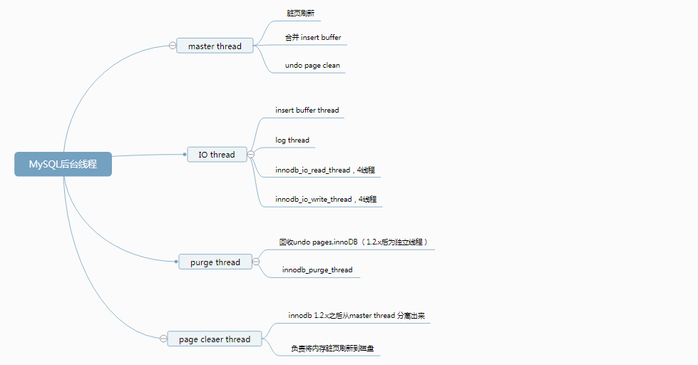

InnoDB采用的是多线程模型，后台有多个不同的线程负责处理不同的任务。



# 1. Master Thead

master thread是一个非常核心的后台线程，具有最高的线程优先级。InnoDB存储引擎的主要工作都是在一个单独的后台线程Master Thread完成的，比如将缓冲池中的数据异步刷新到磁盘，保证数据的一致性，包括脏页面的刷新、合并插入缓冲、undo页的回收等。

Master Thread内部有多个循环组成（loop）：

- 主循环（loop）
- 后台循环（backgroup loop）
- 刷新循环（flush loop）
- 暂停循环（suspend loop）

Master Thread会根据数据库运行的状态在四中循环之间切换。

## 1.1 主循环

大多数的操作都是在主循环中完成，根据执行频率，可以分为两类操作：

### 1.1.1 每秒一次的操作

- 日志缓冲刷新到磁盘（总是）
- 合并插入缓冲（可能）
- 刷新脏页到磁盘（可能）
- 如果没有用户活动切换到background thread（可能）

即使某个事务没有提交，InnoDB仍然每秒将重做日志缓冲刷新到磁盘，这一点保证了再大的事务提交也是很快的。

只有脏页比例超过了一个阈值，InnoDB才会执行刷新操作，该值与参数`innodb_max_dirty_pages_pct`有关，默认为75%：

```mysql
mysql> show variables like 'innodb_max_dirty_pages_pct'\G;
*************************** 1. row ***************************
Variable_name: innodb_max_dirty_pages_pct
        Value: 75.000000
```

需要注意的是，在自适应刷新策略下，即使脏页比例小于75%也可能执行刷新操作。

而一次最多合并多少个插入缓冲、刷新多少个脏页，由另一个参数`innodb_io_capacity`来控制，默认为200：

```mysql
mysql> show variables like 'innodb_io_capacity'\G;
*************************** 1. row ***************************
Variable_name: innodb_io_capacity
        Value: 200
```

- 刷新脏页数量 = innodb_io_capacity
- 合并插入缓冲数量 = innodb_io_capacity * 5%

### 1.1.2 每10秒一次的操作

- 刷新脏页到磁盘（可能）
- 合并至多5个插入缓冲（总是）
- 日志缓冲刷新到磁盘（总是）
- 删除无用的Undo页（总是）
- 刷新innodb_io_capacity个或10%的脏页到磁盘（总是）

第一步与第五步都是刷新脏页操作，但是执行条件不一样：

- 第一步不是必现的，InnoDB会先判断过去10秒之内的磁盘IO操作是否小于innodb_io_capacity次，如果是，认为当前有足够的磁盘IO操作能力，然后将脏页刷新到磁盘；
- 第五步是必现的，InnoDB会判断脏页比例，如果超过70%，则刷新100个脏页；否则，只刷新10%的脏页。

在InnoDB 1.2.x版本以后，刷新脏页的操作从Master Thread分离出来，交由单独的**Page Cleaner Thread**执行。

其中，InnoDB还会执行一项称为**full purge**操作，即删除无用的undo页。InnoDB对表进行update、delete这类操作时，原先的行被标记为删除，但是需要保留这些行版本的信息，有时候可能还有查询操作需要能读取之前版本的undo信息。如果undo页确认可以删除。每次回收undo页的数量由参数`innodb_purge_batch_size`控制：

```mysql
mysql> show variables like 'innodb_purge_batch_size'\G;
*************************** 1. row ***************************
Variable_name: innodb_purge_batch_size
        Value: 300
```

## 1.2、后台循环

若当前没有用户活动或数据库关闭，就会切到这个循环，执行以下操作：

- 删除无用的undo页（总是）
- 合并20个插入缓冲（缓冲）
- 跳回到主循环（总是）
- 跳到flush loop（可能）

## 1.3、刷新循环

只干一件事，就是刷新页到缓冲池。

## 1.4、 暂停循环

若flush loop中也没有什么事情可以做了，InnoDB会切换到suspend loop，将Master Thread挂起，等待事件的发生。

# 2. IO Thread

InnoDB使用了大量AIO（Async IO）来处理IO请求，而IO Thread的工作主要是负责这些IO请求的回调处理。

可以通过`show engine innodb status`命令来观察InnoDB的状态，从中可以看到IO Thread的情况

```mysql
mysql> show engine innodb status\G;
*************************** 1. row ***************************
  Type: InnoDB
  Name:
Status:
=====================================
2019-03-07 22:09:08 0x7000013d8000 INNODB MONITOR OUTPUT
=====================================
Per second averages calculated from the last 3 seconds
...
--------
FILE I/O
--------
I/O thread 0 state: waiting for i/o request (insert buffer thread)
I/O thread 1 state: waiting for i/o request (log thread)
I/O thread 2 state: waiting for i/o request (read thread)
I/O thread 3 state: waiting for i/o request (read thread)
I/O thread 4 state: waiting for i/o request (read thread)
I/O thread 5 state: waiting for i/o request (read thread)
I/O thread 6 state: waiting for i/o request (write thread)
I/O thread 7 state: waiting for i/o request (write thread)
I/O thread 8 state: waiting for i/o request (write thread)
I/O thread 9 state: waiting for i/o request (write thread)
Pending normal aio reads: [0, 0, 0, 0] , aio writes: [0, 0, 0, 0] ,
 ibuf aio reads:, log i/o's:, sync i/o's:
Pending flushes (fsync) log: 0; buffer pool: 0
242 OS file reads, 53 OS file writes, 7 OS fsyncs
0.00 reads/s, 0 avg bytes/read, 0.00 writes/s, 0.00 fsyncs/s
...
```

可以发现，默认情况下一共有10个IO线程：

- (insert buffer thread)* 1  
- (log thread) \* 1   
- (read thread) \* 4   
- (write thread) \* 4

 read thread与write thread数量可以通过参数进行调整：

```mysql
mysql> show variables like 'innodb_%io_threads'\G;
*************************** 1. row ***************************
Variable_name: innodb_read_io_threads
        Value: 4
*************************** 2. row ***************************
Variable_name: innodb_write_io_threads
        Value: 4
```

# 3. Purge Thread

事务被提交后，其所使用的undo log（用于事务commit失败后回滚操作用）可能不在需要，因此需要purge线程来回收undo页。

还可以通过参数`innodb_purge_threads设置多个purge thread以进一步加快undo页回收。

```mysql
mysql> show variables like 'innodb_purge_threads'\G;
*************************** 1. row ***************************
Variable_name: innodb_purge_threads
        Value: 4
```

# 4. Page Cleaner Tread

为了减轻Maser Thread的工作压力及对于用户查询线程的阻塞，将脏页的刷新交由单独的Page Cleaner Thread来完成。

