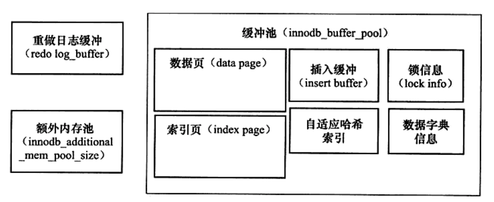
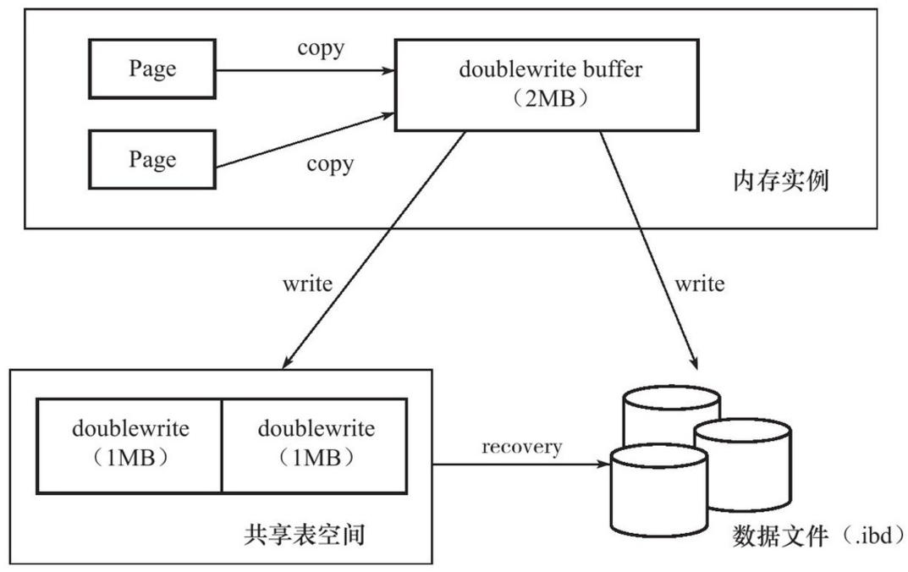
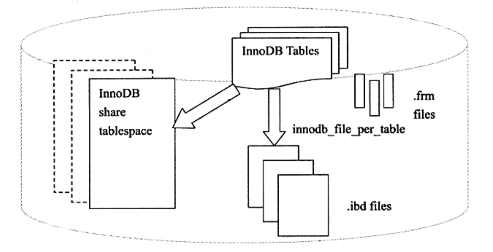
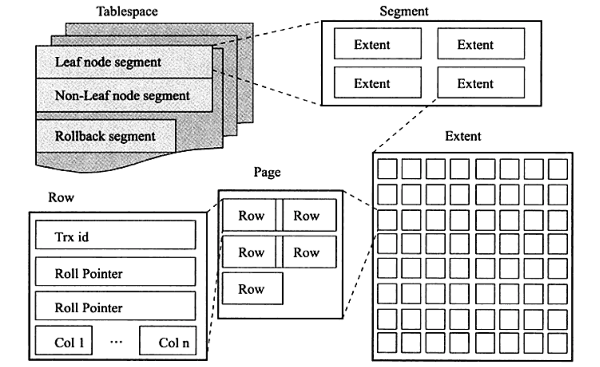
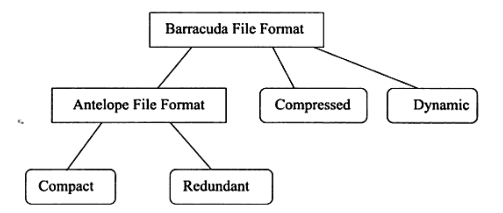
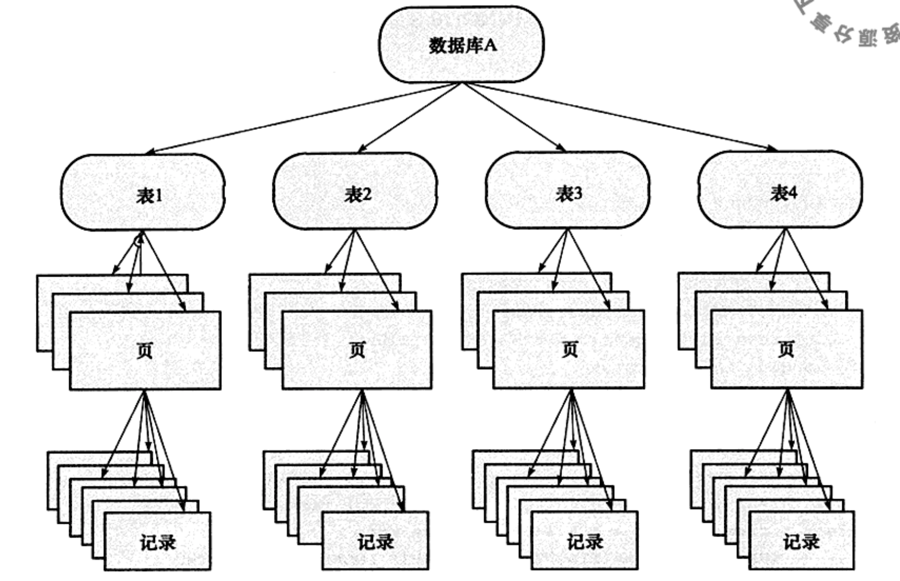
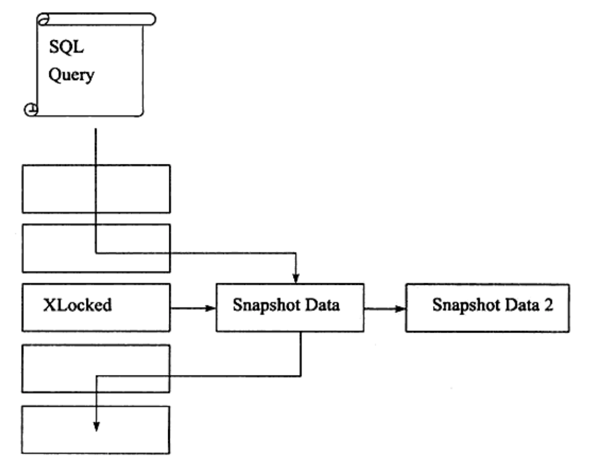
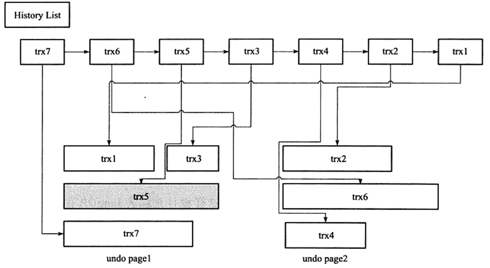
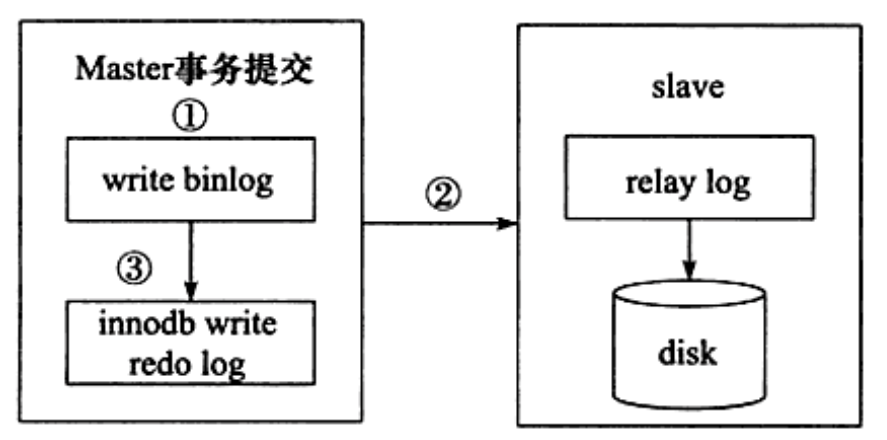
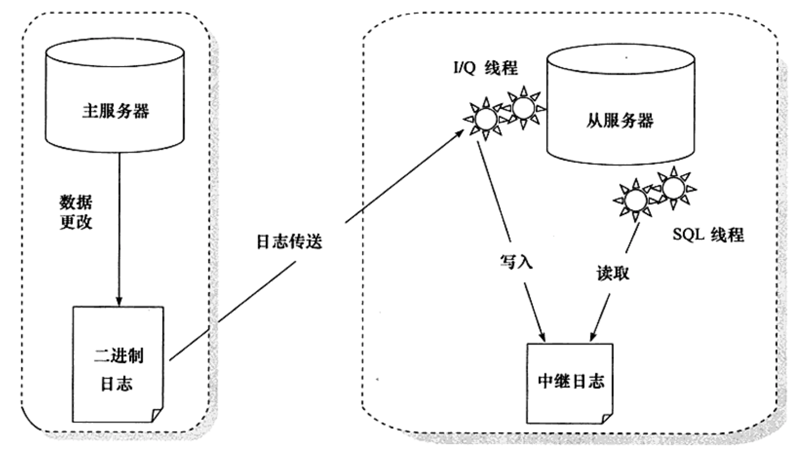

第一章 MySQL体系结构
====================

 

**数据库**：物理操作系统文件或其他形式文件类型的集合

**实例**：MySQL数据库由后台线程以及一个共享内存区组成，在系统上的变现就是一个进程。

 存储引擎是基于表的，而不是数据库。

 `MySql架构图`

 InnoDB支持事务，行锁，支持外键，使用多版本并发控制（MVCC）来获得高并发性

MyISAM不支持事务，表锁，支持全文索引。一个与众不同的地方是它的缓冲池只缓存索引文件，而不缓冲数据文件，数据文件的缓冲由操作系统本身来完成。

`两者区别？`

数据库与传统文件系统的最大区别在于数据库是支持事务的。 

第二章 InnoDB存储引擎
=====================

 

`为什么叫InnoDB？`

 

后台线程
--------

### 1. Master Thead

主要负责将缓冲池中的数据异步刷新到磁盘，保持数据的一致性。包括脏页的刷新、合并插入缓冲、UNDO页的回收等。

 

### 2. IO Thread

InnoDB使用了大量AIO（Async IO）来处理IO请求，而IO Thread的工作主要是负责这些IO请求的回调处理。

分别为write、read、insert buffer和log IO thread

在5.5以上, 总共有10个FILE_IO线程  

insert buffer thread) \* 1  

(log thread) \* 1   

(read thread) \* 4   

(write thread) \* 4

 

线程数量可以通过参数进行调整：

```
mysql> show variables like 'innodb_%io_threads'\G;
*************************** 1. row ***************************
Variable_name: innodb_read_io_threads
        Value: 4
*************************** 2. row ***************************
Variable_name: innodb_write_io_threads
        Value: 4
```


可以通过`show engine innodb status`命令来观察InnoDB的状态，从中可以看到IO Thread的情况

```mysql
mysql> show engine innodb status\G;
*************************** 1. row ***************************
  Type: InnoDB
  Name:
Status:
=====================================
2019-03-07 22:09:08 0x7000013d8000 INNODB MONITOR OUTPUT
=====================================
Per second averages calculated from the last 3 seconds
...
--------
FILE I/O
--------
I/O thread 0 state: waiting for i/o request (insert buffer thread)
I/O thread 1 state: waiting for i/o request (log thread)
I/O thread 2 state: waiting for i/o request (read thread)
I/O thread 3 state: waiting for i/o request (read thread)
I/O thread 4 state: waiting for i/o request (read thread)
I/O thread 5 state: waiting for i/o request (read thread)
I/O thread 6 state: waiting for i/o request (write thread)
I/O thread 7 state: waiting for i/o request (write thread)
I/O thread 8 state: waiting for i/o request (write thread)
I/O thread 9 state: waiting for i/o request (write thread)
Pending normal aio reads: [0, 0, 0, 0] , aio writes: [0, 0, 0, 0] ,
 ibuf aio reads:, log i/o's:, sync i/o's:
Pending flushes (fsync) log: 0; buffer pool: 0
242 OS file reads, 53 OS file writes, 7 OS fsyncs
0.00 reads/s, 0 avg bytes/read, 0.00 writes/s, 0.00 fsyncs/s
...
```


### 3. Purge Thread

负责回收已经使用并分配的undo页，purge操作默认是由master thread中完成的，为了减轻master thread的工作，提高cpu使用率以及提升存储引擎的性能。用户可以在参数文件中添加如下命令来启动独立的purge thread

``` mysql
mysql> show variables like 'innodb_purge_threads'\G;
*************************** 1. row ***************************
Variable_name: innodb_purge_threads
        Value: 4
```

 

### 4. Page Cleaner Tread

为了减轻Maser Thread的工作压力及对于用户查询线程的阻塞，将脏页的刷新交由单独的Page Cleaner Thread来完成，

 

缓冲池
------

缓冲池简单来说就是一块内存区域，通过内存的速度来弥补磁盘速度较慢对数据库性能的影响。在数据库当中读取页的操作，首先将从磁盘读到的页存放在缓存池中，这个过程称为将页“*FIX*”在缓冲池中。下一次再读相同的页时，首先判断该页是不是在缓冲池中。若在，直接读取。否则，读取磁盘上的页。

对于数据库中页的修改操作，则首先修改缓存池中的页，然后再以一定的频率刷新到磁盘上。注意：缓冲池刷新回磁盘并不是每次页发生更新时触发，而是通过一种称为**Checkpoint**的机制刷新回磁盘。这样，是为了进一步提高数据库整体性能。

**缓冲池中页的大小默认为16KB**。 

缓冲池大小可以通过 innodb_buffer_pool_size参数来设置

``` 
mysql> show variables like 'innodb_buffer_pool_size'\G;
*************************** 1. row ***************************
Variable_name: innodb_buffer_pool_size
        Value: 134217728
```

为了减少数据库内部资源竞争，增加数据库并发能力，可以使用多个缓冲实例，每个页根据哈希值平均分配道不同缓冲池实例中，设置参数为innodb_buffer_poll_instances，默认为1。

```
mysql> show variables like 'innodb_buffer_pool_instances'\G;
*************************** 1. row ***************************
Variable_name: innodb_buffer_pool_instances
        Value: 1
```

### 缓冲刷新策略

通常来说，缓冲池是通过**LRU**（*Latest Recent Used*，最近最少使用）算法来进行管理的。即最多使用页在LRU列表前端，而最少使用页在LRU列表后端。当缓冲池不能存放新读取到的页时，将首先释放LRU列表中末端的页。

InnoDB对传统LRU算法做了一些优化，在LRU列表加入了**midpoint**位置。midpoint位置就是读取到新页时，不是刷新到LRU的首页，而是LRU列表的midpoint位置。midpoint位置可有参数 innodb_old_blocks_pct 控制。

```
mysql> show variables like 'innodb_old_blocks_pct'\G;
*************************** 1. row ***************************
Variable_name: innodb_old_blocks_pct
        Value: 37
```

表示新读取到的页插入到列表尾端的37%处。midpoint之后的列表被称为old表，之前的列表被称为new表。old表中的页达到一定条件（比如较短时间内被查询了1000次），会被移到new表，此时发生的操作被称为***page made young***。

那么，为什么不将新读取到的页直接插入到列表的首部呢？因为有些操作需要访问表中的很多页，甚至全部页，而这些页通常来说又仅在这次查询操作中需要，并不是活动的热点数据。如果页被全部放入LRU列表的首部，很可能会将真正的热点数据挤出列表，从而影响缓冲池的效率。

为了进一步解决这个问题，InnoDB还提供了**innodb_old_blocks_time**来表示页读取到mid位置后，需要等待多久才会被加入到LRU列表的热端。

```
mysql> show variables like 'innodb_old_blocks_time'\G;
*************************** 1. row ***************************
Variable_name: innodb_old_blocks_time
        Value: 1000
```


数据库刚启动时，LRU列表是空的，缓冲池的所有页都存放在**Free列表**中。需要添加新的缓冲时，若Free列表中有可用的空闲页，则将其移到LRU列表；否则，根据LRU算法，淘汰末尾页。

LRU列表中的页被修改后，跟磁盘上的页就产生了不一致的情况，称该页为**脏页**（dirty page）。数据库会通过checkpoint机制将脏页刷新回磁盘。脏页由**Flush列表**管理。

可以通过`show engine innodb status`命令查看缓冲池的的状态：

```
mysql> show engine innodb status\G;
*************************** 1. row ***************************
  Type: InnoDB
  Name:
Status:
=====================================
2019-03-07 22:09:08 0x7000013d8000 INNODB MONITOR OUTPUT
=====================================
Per second averages calculated from the last 3 seconds
...
----------------------
BUFFER POOL AND MEMORY
----------------------
Total large memory allocated 137428992
Dictionary memory allocated 100382
Buffer pool size   8192		//缓冲池页的总数
Free buffers       7945		//Free列表页的数量
Database pages     247		//LRU列表页的数量
Old database pages 0
Modified db pages  0		//脏页数量
Pending reads      0
Pending writes: LRU 0, flush list 0, single page 0
Pages made young 0, not young 0
0.00 youngs/s, 0.00 non-youngs/s
Pages read 213, created 34, written 36
0.00 reads/s, 0.00 creates/s, 0.00 writes/s
No buffer pool page gets since the last printout	//Buffer pool hit rate 1000 / 1000...
Pages read ahead 0.00/s, evicted without access 0.00/s, Random read ahead 0.00/s
LRU len: 247, unzip_LRU len: 0	//LRU表共有247页，unzip_LRU管理的是压缩页
I/O sum[0]:cur[0], unzip sum[0]:cur[0]
...
```

本例中的数据库是一个空数据库，所以没有缓冲池命中率的统计。实际应用中一般会打印出这样的一句话：

`Buffer pool hit rate 1000 / 1000, young-making rate 0 / 1000 not 0 / 1000…`

正常情况下缓冲池的命中率应该接近100%，如果低于95%，说明LRU表很可能存在被污染的问题。

## 重做日志缓冲



重做日志（redo log）用于保障事务的持久性。

InnoDB首先将重做日志放入重做日志缓冲，然后在下列三种情况下刷新到磁盘：

- master thread每一秒将重做日志缓冲刷新到重做日志文件
- 每个事务提交时会刷新到重做日志文件
- 当重做日志缓冲池剩余空间小于1/2时，重做日志缓冲会刷新到重做日志文件

重做日志缓冲大小由参数innodb_log_buffer_size控制：

```
mysql> show variables like 'innodb_log_buffer_size'\G;
*************************** 1. row ***************************
Variable_name: innodb_log_buffer_size
        Value: 16777216
```


## 额外的内存池

InnoDB通过一种称为**内存堆**的方式管理内存。

在对一些数据结构本身的额内存进行分配时，需要从额外的内存池中进行申请，当该区域的内存不够时，会从缓冲池中申请。

## checkpoint技术

页的操作首先都是在缓冲池中完成的，数据库需要一种机制来同步缓冲池与磁盘间的数据。

倘若每次一个页发生变化就出发一次刷新操作，数据库的性能将变得非常差。同时，如果还没来得及完成刷新数据库就发生了宕机，那么数据就不能恢复了，为了避免数据丢失的问题，当前数据库系统普遍采用了Write Ahead Log策略，即当事务提交时，先写重做日志，再修改页。宕机后通过重做日志来恢复数据。

checkpoint技术的目的是解决以下几个问题：

- 缩短数据库的恢复时间

  重做日志中记录了的checkpoint的位置，这个点之前的页已经刷新回磁盘，只需要对checkpoint之后的重做日志进行恢复,这样就大大缩短了恢复时间.

- 缓冲池不够用时，将脏页刷新到磁盘

  缓冲池不够用时，根据LRU算法，溢出最近最少使用的页，如果页为脏页，强制执行checkpoint，将页刷新回磁盘。

- 重做日志不可用时，刷新脏页

  重做日志是循环使用的。重做日志不可用，是指数据还未刷新到磁盘上导致这部分不可以被覆盖，此时，必须强制执行checkpoint，将缓冲池中的页至少刷新到当前重做日志的位置

  

## Master Thread

InnoDB存储引擎的主要工作都是在一个单独的后台线程Master Thread完成的，Master Thread具有最高的线程优先级。

Master Thread内部有多个循环组成（loop）：

- 主循环（loop）
- 后台循环（backgroup loop）
- 刷新循环（flush loop）
- 暂停循环（suspend loop）

Master Thread会根据数据库运行的状态在四中循环之间切换。

### 主循环

大多数的操作都是在主循环中完成，根据执行频率，可以分为两类操作：

#### 每秒一次的操作

- 日志缓冲刷新到磁盘（总是）
- 合并插入缓冲（可能）
- 刷新脏页到磁盘（可能）
- 如果没有用户活动切换到background thread（可能）

即使某个事务没有提交，InnoDB仍然每秒将重做日志缓冲刷新到磁盘，这一点保证了再大的事务提交也是很快的。

只有脏页比例超过了一个阈值，InnoDB才会执行刷新操作，该值与参数`innodb_max_dirty_pages_pct`有关，默认为75%：

```
mysql> show variables like 'innodb_max_dirty_pages_pct'\G;
*************************** 1. row ***************************
Variable_name: innodb_max_dirty_pages_pct
        Value: 75.000000
```

需要注意的是，在自适应刷新策略下，即使脏页比例小于75%也可能执行刷新操作。

而一次最多合并多少个插入缓冲、刷新多少个脏页，由另一个参数`innodb_io_capacity`来控制，默认为200：

```
mysql> show variables like 'innodb_io_capacity'\G;
*************************** 1. row ***************************
Variable_name: innodb_io_capacity
        Value: 200
```

- 刷新脏页数量 = innodb_io_capacity

- 合并插入缓冲数量 = innodb_io_capacity * 5%


#### 每10秒一次的操作

- 刷新脏页到磁盘（可能）
- 合并至多5个插入缓冲（总是）
- 日志缓冲刷新到磁盘（总是）
- 删除无用的Undo页（总是）
- 刷新innodb_io_capacity个或10%的脏页到磁盘（总是）

第一步与第五步都是刷新脏页操作，但是执行条件不一样：

第一步不是必现的，InnoDB会先判断过去10秒之内的磁盘IO操作是否小于innodb_io_capacity次，如果是，认为当前有足够的磁盘IO操作能力，然后将脏页刷新到磁盘；

第五步是必现的，InnoDB会判断脏页比例，如果超过70%，则刷新100个脏页；否则，只刷新10%的脏页。

在InnoDB 1.2.x版本以后，刷新脏页的操作从Master Thread分离出来，交由单独的**Page Cleaner Thread**执行。

其中，InnoDB还会执行一项称为**full purge**操作，即删除无用的undo页。InnoDB对表进行update、delete这类操作时，原先的行被标记为删除，但是需要保留这些行版本的信息，有时候可能还有查询操作需要能读取之前版本的undo信息。如果undo页确认可以删除。每次回收undo页的数量由参数`innodb_purge_batch_size`控制：

```
mysql> show variables like 'innodb_purge_batch_size'\G;
*************************** 1. row ***************************
Variable_name: innodb_purge_batch_size
        Value: 300
```

### 后台循环

若当前没有用户活动或数据库关闭，就会切到这个循环，执行以下操作：

- 删除无用的undo页（总是）
- 合并20个插入缓冲（缓冲）
- 跳回到主循环（总是）
- 跳到flush loop（可能）

### 刷新循环

只干一件事，就是刷新页到缓冲池。

### 暂停循环

若flush loop中也没有什么事情可以做了，InnoDB会切换到suspend loop，将Master Thread挂起，等待时间的发生。

## Change Buffer

在InnoDB中，主键是行唯一的标识符。

通常主键被设计成自增的，页中的行记录按照聚集索引Primary Key）顺序存放，一般情况下，聚集索引的插入时不需要随机读取其他页中的记录，因此速度非常快。

但是，对于非聚集的且不是唯一的索引插入，就需要离散地访问非聚集索引页，导致插入操作性能下降。

为了解决这个问题，InnoDB引入了Insert Buffer。对于非聚集索引的插入或更新操作，不是每一次直接插入到索引页，而是先判断插入的非聚集索引页是否在缓冲池中，若在，则直接插入；若不在，则先放入到一个Insert Buffer对象中，然后会以一定的频率将Insert Buffer中的记录merge到索引页。这样一来就大大提高了非聚集索引插入的性能。

Insert Buffer的使用需要满足以下条件：

- 索引不是聚集索引
- 索引不是唯一索引

要求不能是聚集索引，因为聚集索引的插入本来就很快，插入缓冲无异于画蛇添足。

要求不能是唯一索引，因为在插入缓冲时，数据库并不去检查索引页来判断记录的唯一性，如果查找又会有离散读取的情况发生，导致Insert Buffer失去意义。

除了Insert Buffer，InnoDB还使用**Delete Buffer**、**Purger Buffer**支持删除与更新操作。

例如，删除一条记录可分为两步：

- 将记录标记为删除
- 真正将记录删除

Delete Buffer用于第一步，Purger Buffer用于第二步。

InnoDB提供了参数`innodb_change_buffering`来开启各种Buffer的选项，默认为all:

```
mysql> show variables like 'innodb_change_buffering'\G;
*************************** 1. row ***************************
Variable_name: innodb_change_buffering
        Value: all
```

可选值为：

- inserts: 只启用Insert Buffer
- deletes: 只启用Delete Buffer
- purges: 只启用Purge Buffer
- changes: 启用Insert Buffer 、 Delete Buffer
- alll: 全部启用
- none: 全部不启用

还有一个参数`innodb_change_buffer_max_size`用于控制Change Buffer最大使用内存比例，默认为25%，上限为50%：

```
mysql> show variables like 'innodb_change_buffer_max_size'\G;
*************************** 1. row ***************************
Variable_name: innodb_change_buffer_max_size
        Value: 25
```


可以通过`show engine innodb status`命令查看Change Buffer的状态：

```
mysql> show engine innodb status\G;
*************************** 1. row ***************************
  Type: InnoDB
  Name:
Status:
=====================================
2019-03-13 21:25:55 0x70000cec5000 INNODB MONITOR OUTPUT
=====================================
Per second averages calculated from the last 27 seconds
...
-------------------------------------
INSERT BUFFER AND ADAPTIVE HASH INDEX
-------------------------------------
Ibuf: size 1, free list len 0, seg size 2, 0 merges 
merged operations:
 insert 0, delete mark 0, delete 0
discarded operations:
 insert 0, delete mark 0, delete 0
...
```

第一行，size代表已经合并的页的总数；free list len代表空闲列表的长度；seg size代表Change Buffer有多少页；merges代表代表合并的次数。

merged operations下列举了每个操作的次数；discarded operations表示当Change Buffer发生merge时，表已被删除，就无需merge到辅助索引当中了。


Change Buffer的数据结构是一个B+树，而且是全局的，存放于共享表空间，负责对所有表的辅助索引进行变更缓冲。

启用Change Buffer后，需要保证每次将缓冲数据merge到索引页的操作必须成功，也就是需要保证索引页有足够的可用空间。InnoDB使用一个称为`Insert Buffer Bitmap`的页来标记每个辅助索引页的可用空间。

以Insert Buffer为例，若待插入记录的辅助索引不在缓冲池中，首先将索引记录插入到B+树，然后在合适的机会再merge到索引页。

以下几种情况可能会触发merge操作：

- 辅助索引页被读取到缓冲池
- Insert Buffer Bitmap页追踪到该辅助索引页已无可用空间
- Master Thread

第一种情况，当辅助索引页被读取到缓冲池时，例如在执行正常的select操作，这是需要检查Insert Buffer Bitmap页，然后确认该辅助页是否有记录存放于Insert Buffer B+ 树中。若有，则将该页的记录插入到索引页。

第二种情况，若插入辅助索引记录时检测到插入记录后可用空间会小于1/32页，则会强制进行一次合并操作，即强制读取辅助索引页，将Insert Buffer B+ 树中该页的记录及待插入的记录插入到辅助索引页。

第三种情况，就是Master Thread每1秒或每10秒进行一次Merge Insert Buffer操作。

## 两次写

当发生数据库宕机时，可能InnoDB存储引擎正在写入某个页到表中，而这个页只写了一部分，比如16KB的页，只写了前4KB，之后就发生了宕机，这种情况被称为**部分写失效**（partial page write）。

部分写失效的问题，依靠重做日志无法恢复，因为重做日志是基于偏移量的物理操作。例如，写'aaaa'记录到偏移量800的位置，如果这个页本身已经发生了损坏，再对其进行重做是没有意义的。这就是说，在使用重做日志前，用户需要一个页的副本，当写入失效发生时，先通过页的副本来还原该页，再进行重做，这就是**doublewrite**。

下面是两次写的原理图：



doublewrite由两部分组成：

- 内存中的doublewrite buffer，大小为2MB
- 物理磁盘上共享表空间中连续的128个页，即2个区（extent），大小同样为2MB

当刷新缓冲池脏页时，并不直接写到数据文件中，而是按照下面的路程执行：

1. 拷贝至内存中的两次写缓冲区。

2. 从两次写缓冲区分两次写入磁盘共享表空间中，每次1MB

3. 待第2步完成后，再将两次写缓冲区写入数据文件

这样就可以解决上文提到的部分写失效的问题，因为在磁盘共享表空间中已有数据页副本拷贝，如果数据库在页写入数据文件的过程中宕机，在实例恢复时，可以从共享表空间中找到该页副本，将其拷贝覆盖原有的数据页，再应用重做日志即可。

其中第2步是额外的性能开销，但由于磁盘共享表空间是连续的，因此开销不是很大。可以通过参数`skip_innodb_doublewrite`禁用两次写功能，默认是开启的。

## 自适应哈希

InnoDB存储引擎会监控对表上各索引页的查询。如果观察到建立哈希索引可以带来速度提升，则建立哈希索引，称之为**自适应哈希索引**(Adaptive Hash Index, AHI)。AHI是通过缓冲池的B+树页构造而来，因此建立的速度很快，而且不需要对整张表构建哈希索引。InnoDB存储引擎会自动根据访问的频率和模式来自动地为某些热点页建立哈希索引。

AHI有一个要求，对这个页的连续访问模式必须是一样的。例如对于(a,b)这样的联合索引页，其访问模式可以是下面情况： 

- where a=xxx 

- where a =xxx and b=xxx 

访问模式一样是指查询的条件是一样的，若交替进行上述两种查询，那么InnoDB存储引擎不会对该页构造AHI。 
AHI还有下面几个要求： 

- 以该模式访问了100次 

- 页通过该模式访问了N次，其中N=页中记录*1/16

可以通过参数innodb_adaptive_hash_index来考虑禁用或启动此特性，默认是开启状态：

```
mysql> show variables like 'innodb_adaptive_hash_index'\G;
*************************** 1. row ***************************
Variable_name: innodb_adaptive_hash_index
        Value: ON
```

## 异步IO

为了提高磁盘操作性能，当前的数据库系统都采用异步IO（Asynchronous IO，AIO）的方式来处理磁盘操作。

与AIO对应的Sync IO，即每进行一次IO操作，需要等待此操作结束才能继续接下来的操作。但是如果用户发出的是一条索引扫描的查询，那么这条SQL查询语句可能需要扫描多个索引页，也就是需要进行多次的IO操作。在每扫描一个页并等待其完成后再进行下一次的扫描，这是没有必要的。用户可以在发出一个IO请求后立即再发出另一个IO请求，当全部IO请求发送完毕后，等待所有IO操作的完成，这就是AIO。

AIO另一个优势是进行IO Merge操作，也就是将多个IO合并为1个IO,这样可以提高IOPS的性能。例如用户需要访问页的（space, offset）为： 
`(8,6),(8,7),(8,8) `

每个页的大小为16KB，那么同步IO需要进行3次IO操作。而AIO会判断到这三个页是连续的（可以通过(space,offset)知道）。因此AIO底层会发送一个IO请求，从(8,6)开始，读取48KB的页。

可以通过参数`innodb_use_native_aio`来控制是否启用AIO，Linux下默认是开启状态：

```sql
mysql> show variables like 'innodb_use_native_aio'\G;
*************************** 1. row ***************************
Variable_name: innodb_use_native_aio
        Value: ON
```

## 刷新临接页

当刷新一个脏页时，innodb存储引擎会检测该页所在区(extent)的所有页，如果是脏页，那么一起进行刷新。这样做的好处显而易见，通过AIO可以将多个IO写入操作合并为一个IO操作，增大写入量，减少了物理写IO，故该工作机制在传统机械磁盘下有着显著的优势：

- 在写入次数基本不增加的情况下，增加了写入的量；
- 加速了脏页的回收；
- 充分利用double write每次1M写入的特征；
- 这个功能打开以后会发现iostat里面的wrqm(合并写)这个值会比较高；

需要特别考虑的问题：

- 是不是可能将不怎么脏的页进行了写入，而该页之后又会很快变成脏页？

- 固态硬盘有着较高的 IOPS，是否还需要这个特性？

可以通过参数`innodb_flush_neighbors`来控制是否启用AIO，默认是开启状态：

```mysql
mysql> show variables like 'innodb_flush_neighbors'\G;
*************************** 1. row ***************************
Variable_name: innodb_flush_neighbors
        Value: 1
```

## 关闭参数

在InnoDB关闭时，有个非常重要的参数`innodb_fast_shutdown`影响着表的行为。该参数可取值为0、1、2，默认值为1。

- 0表示在MySQL数据库关闭时，InnoDB需要完成所有的full purge和merge insert buffer，并且将所有的脏页刷新回磁盘。这需要一些时间，有时甚至需要几个小时来完成。
- 1是参数innodb_fast_shutdown的默认值，表示不需要完成上述的full purge和merge insert buffer操作，但是在缓冲池中的一些数据脏页还是会刷新回磁盘。
- 2表示不完成full purge和merge insert buffer操作，也不将缓冲池中的数据脏页写回磁盘，而是将日志都写入日志文件。这样不会有任何事务的丢失，但是下次MySQL数据库启动时，会进行恢复操作（recovery）。

```mysql
mysql> show variables like 'innodb_fast_shutdown'\G;
*************************** 1. row ***************************
Variable_name: innodb_fast_shutdown
        Value: 1
```

# 第三章 文件

## 参数文件

MySQL实例启动时，数据库会先去读取一个配置参数文件，用来寻找各种文件的路径及某些初始化参数等。

简单地说，可以把数据库参数看成一个个的键值对。可以通过`show variables`命令列出数据库中的所有参数。

MySQL中的参数可以分为两类：

- **动态参数**：可以在运行中进行更改
- **静态参数**：整个生命周期内都不可以更改

动态参数的作用域可以是当前会话，以`@@session`为前缀；也可以是整个生命周期，以`@@global`为前缀。

有些动态参数只能 在会话中进行修改，如`autocommit`；有些参数修改完后，在整个实例生命周期中都会生效，如`binlog_cache_size`；而有些参数既可以 在会话又可以在整个实例的生命周期内生效，如`read_buffer_size`。

```mysql
mysql> select @@session.read_buffer_size\G;
*************************** 1. row ***************************
@@session.read_buffer_size: 131072

mysql> select @@global.read_buffer_size\G;
*************************** 1. row ***************************
@@global.read_buffer_size: 131072
```

可以看到，在本机中read_buffer_size在全局中和会话中的大小都是128KB。

可以通过以下命令更改两者的大小：

```mysql
set @@session.read_buffer_size = 262144;
set @@global.read_buffer_size = 262144;
```

## 错误日志

错误日志文件对MySQL的启动、运行、关闭过程进行了记录。

通过`log_error`可以查看错误日志的路径：

```mysql
mysql> show variables like 'log_error'\G;
*************************** 1. row ***************************
Variable_name: log_error
        Value: /usr/local/mysql/data/mysqld.local.err
```

## 通用查询日志

查询日志记录了所有对MySQL请求的信息，包括客户端连接与执行语句。

默认处于关闭状态：

```mysql
mysql> show variables like '%general%'\G;
*************************** 1. row ***************************
Variable_name: general_log
        Value: OFF
*************************** 2. row ***************************
Variable_name: general_log_file
        Value: /usr/local/mysql/data/localhost.log
```


## 慢查询日志

慢查询日志是MySQL提供的一种日志记录，它用了记录在查询时间超过某个阈值的语句，该阈值由参数`long_query_time`决定：

```mysql
mysql> show variables like 'long_query_time'\G;
*************************** 1. row ***************************
Variable_name: long_query_time
        Value: 10.000000
```

默认情况下，MySQL并没有开启慢查询日志：

```mysql
mysql> show variables like 'slow_query_log'\G;
*************************** 1. row ***************************
Variable_name: slow_query_log
        Value: OFF
        
mysql> show variables like 'slow_query_log_file'\G;
*************************** 1. row ***************************
Variable_name: slow_query_log_file
        Value: /usr/local/mysql/data/localhost-slow.log
```

当然，如果不是调优需要，一般不建议启动该参数，因为慢查询日志会或多或少带来一定的性能影响。

此外，MySql还可以将没有使用索引的查询记录下来，是否启用由参数`log_queries_not_using_indexes`控制：

```mysql
mysql> show variables like 'log_queries_not_using_indexes'\G;
*************************** 1. row ***************************
Variable_name: log_queries_not_using_indexes
        Value: OFF
```

另一个相关参数为`log_throttle_queries_not_using_indexes`，用来控制未使用索引查询每分钟的记录次数。该值默认为0，表示无限制。

```mysql
mysql> show variables like 'log_throttle_queries_not_using_indexes'\G;
*************************** 1. row ***************************
Variable_name: log_throttle_queries_not_using_indexes
        Value: 0
```


MySql提供了日志分析工具mysqldumpslow（一个perl脚本），帮助我们更好的分析慢查询日志。

例如：

```mysql
#返回记录集最多的10个SQL
Mysqldumpslow –s r –t 10 localhost-slow.log

#访问次数最多的10个SQL
Mysqldumpslow –s c –t 10 localhost-slow.log

#按照时间排序的前10条里面含有左连接的查询
Mysqldumpslow –s t –t 10 –g "left join" localhost-slow.log

#建议在使用这些命令时结合|和more使用，否则可能出现爆破情况
Mysqldumpslow –s r –t 10 localhost-slow.log | more
```

参数含义：

- -s: 表示按照何种方式排序
- c：访问次数
- l：锁定时间
- r：返回记录
- t：查询时间
- al：平均锁定时间
- -t：返回前面多少条的数据
- -g：后面搭配一个正则表达式

默认情况下，慢查询日志的输出格式为文件：

```mysql
mysql> show variables like 'log_output'\G;
*************************** 1. row ***************************
Variable_name: log_output
        Value: FILE
```

参数`log_output`是动态的，并且是全局的。

如果将log_output设为`TABLE`，日志会记录到slow_log表当中，该表使用的是CSV引擎。

```mysql
mysql> show create table mysql.slow_log\G;
*************************** 1. row ***************************
       Table: slow_log
Create Table: CREATE TABLE `slow_log` (
  `start_time` timestamp(6) NOT NULL DEFAULT CURRENT_TIMESTAMP(6) ON UPDATE CURRENT_TIMESTAMP(6),
  `user_host` mediumtext NOT NULL,
  `query_time` time(6) NOT NULL,
  `lock_time` time(6) NOT NULL,
  `rows_sent` int(11) NOT NULL,
  `rows_examined` int(11) NOT NULL,
  `db` varchar(512) NOT NULL,
  `last_insert_id` int(11) NOT NULL,
  `insert_id` int(11) NOT NULL,
  `server_id` int(10) unsigned NOT NULL,
  `sql_text` mediumblob NOT NULL,
  `thread_id` bigint(21) unsigned NOT NULL
) ENGINE=CSV DEFAULT CHARSET=utf8 COMMENT='Slow log'
```

## 二进制日志

二进制日志（binnary log）记录了对MySQL数据库执行更改的所有操作。主要有以下作用：

- **恢复**

  可以通过binLog进行point-in-time的数据恢复

- **复制**

  通过复制和执行binLog使一台远程数据库（slave或standby）实时同步主数据库的数据变更。

- **审计**

  通过binLog判断是否有异常操作，比如注入攻击等。

binLog默认是关闭的，可以通过参数`log_bin`控制：

```mysql
mysql> show variables like 'log_bin'\G;
*************************** 1. row ***************************
Variable_name: log_bin
        Value: OFF
```

参数`max_binlog_size`指定了单个二进制日志文件的最大值:

```mysql
mysql> show variables like 'max_binlog_size'\G;
*************************** 1. row ***************************
Variable_name: max_binlog_size
        Value: 1073741824
```

默认为1G，如果超过该值，会写入新的文件，并记录到.index文件。

InnoDB会将所有未提交的binLog写到一个缓存中，等事务提交后再将缓存刷新到文件。缓存大小有参数`binlog_cache_size`控制。

```mysql
mysql> show variables like 'binlog_cache_size'\G;
*************************** 1. row ***************************
Variable_name: binlog_cache_size
        Value: 32768
```

需要注意的是，该值是基于session的，每个事务都会分配一个大小为binlog_cache_size的缓存。当一个事务的记录大于该值，MySQL会把缓冲中的日志写入一个临时文件。因此，需要根据使用场景合理设置这个参数，过大或者过小都会影响性能。

参数`sync_binlog`表示每写缓冲多少次就同步到磁盘：

```mysql
mysql> show variables like 'sync_binlog'\G;
*************************** 1. row ***************************
Variable_name: sync_binlog
        Value: 1
```

如果将N设为1，表示采用同步写磁盘的方式来写二进制日志，这时写操作不使用操作系统的缓冲来写二进制日志，每次事务提交都会写入文件。N设为0时，表示MySQL不控制binlog的刷新，由文件系统自己控制它的缓存的刷新。这时候的性能是最好的，但是风险也是最大的。因为一旦系统Crash，在binlog_cache中的所有binlog信息都会被丢失。

但是，即使将sync_binlog设为1，还是会有一种情况会导致问题的发生。当使用InnoDB存储引擎时，在一个事务发出COMMIT动作之前，由于sync_binlog设为1，因此会将二进制日志立即写入磁盘。如果这时已经写入了二进制日志，但是提交还没有发生，并且此时发生了宕机，那么在MySQL数据库下次启动时，因为COMMIT操作并没有发生，所以这个事务会被回滚掉。但是二进制日志已经记录了该事务信息，不能被回滚。这个问题可以通过将参数`innodb_support_xa`设为1来解决，虽然innodb_support_xa与XA事务有关，但它同时也确保了二进制日志和InnoDB存储引擎数据文件的同步。


binlog_format是一个非常重要的参数，决定了记录二进制日志的格式：

```mysql
mysql> show variables like 'binlog_format'\G;
*************************** 1. row ***************************
Variable_name: binlog_format
        Value: ROW
```

可选值有：

- STATEMENT

  记录SQL语句

- ROW

  记录表的行更改情况，可以为数据库的恢复、复制带来更好的可靠性，但是二进制文件的大小相较于STATEMENT会有所增加

- MIXED

  默认采用STATEMENT格式进行二进制日志文件的记录，但是在一些情况下会使用ROW格式，可能的情况有：

  - 表的存储引擎为NDB，这时对于表的DML操作都会以ROW格式记录
  - 使用了UUID()、USER()、CURRENT_USER()、FOUND_ROWS()、ROW_COUNT()等不确定函数
  - 使用了INSERT DELAY语句
  - 使用了用户定义函数（UDF）
  - 使用了临时表（temporary table）

## 表文件

不论使用何种存储引擎，每个表都有一个以`frm`为后缀的文件，记录了该表的结构定义。

对于InnoDB而言，有一个表空间（tableplace）的概念，用于存放各种数据。可以通过参数`innodb_data_file_path`配置：

```mysql
mysql> show variables like 'innodb_data_file_path'\G;
*************************** 1. row ***************************
Variable_name: innodb_data_file_path
        Value: ibdata1:12M:autoextend
```

可见，默认情况下，表空间的名字为`ibdata1`，初始大小为12M，可以自动增长。

ibdata1也被称为共享表空间，所有基于InnoDB的表数据都会记录到共享表空间。

如果想给每个表使用独立表空间，可以通过参数`innodb_file_per_table`开启：

```mysql
mysql> show variables like 'innodb_file_per_table'\G;
*************************** 1. row ***************************
Variable_name: innodb_file_per_table
        Value: ON
```

独立表空间的命名规则为：表名.ibd

需要注意的是，独立表空间文件仅存储该表的数据、索引和插入缓冲等信息，其余信息（两次写缓冲等）还是存放于共享表空间。



## 重做日志文件

默认情况下，在InnoDB的数据目录下，会有两个重做日志文件：

- ib_logfile0
- Ib_logfile1

数据库宕机后，InnoDB会使用重做日志恢复数据，保证数据的完整性。

写入重做日志的操作不是直接写，而是先写入重做日志缓冲，然后按照一定的顺序写入文件。


主线程每秒会将重做日志缓冲写入文件不论事务是否提交。另一个触发写磁盘的过程是有参数`innodb_flush_log_at_trx_commit`控制：

```mysql
mysql> show variables like 'innodb_flush_log_at_trx_commit'\G;
*************************** 1. row ***************************
Variable_name: innodb_flush_log_at_trx_commit
        Value: 1
```

可选值为：

- 0：当前事务提交时，不触发写磁盘操作，而是等待主线程每秒的刷新
- 1：当前事务提交时，触发写磁盘操作
- 2：当前事务提交时，触发写磁盘操作，但是有可能是写到文件系统的缓存中

为了保证事务的持久性，一般都会将该参数设为1。

每个重做日志文件的大小一致，并且以循环写入的方式运行。参数`innodb_log_files_in_group`用于指定重做日志数量：

```mysql
mysql> show variables like 'innodb_log_files_in_group'\G;
*************************** 1. row ***************************
Variable_name: innodb_log_files_in_group
        Value: 2
```

参数`innodb_log_file_size`用于指定重做日志的大小：

```mysql
mysql> show variables like 'innodb_log_file_size'\G;
*************************** 1. row ***************************
Variable_name: innodb_log_file_size
        Value: 50331648
```

重做日志文件的大小设置对于InnoDB的性能有着非常大的影响。如果设置的太大，恢复时可能需要很长的时间；如果设置的太小，可能导致一个事务的日志需要多次切换文件，还会导致频繁地发生async checkpoint。

### 二进制日志与重做日志的区别

- 二进制日志会记录MySQL所有变更记录，跟存储引擎无关；而InnnoDB的重做日志只记录与InnoDB相关的事务日志。
- 二进制日志记录的都是一个操作的具体内容，即逻辑日志；而重做日志记录的是每个页的更改情况，即物理日志
- 二进制日志仅在事务提交前写入磁盘一次，不论事务大小；而重做日志在事务进行中会不断将日志写入重做日志文件

 重做日志

#  第四章 表

## 索引组织表

 在InnoDB中，表都是根据主键顺序组织存放的，称为索引组织表（index organized table）。

每张表都有个主键，如果没有显示地定义主键，则会按照如下方式选择或创建主键：

- 如果有非空唯一索引，以建表时第一个定义的非空唯一索引作为主键
- 如果没有非空唯一索引，InnoDB会自动创建一个6字节大小的rowid作为主键

## 逻辑存储结构 

从InnoDB存储引擎的逻辑结构看，所有数据都被逻辑地存放在一个空间内，称为表空间（tablespace），而表空间由段（sengment）、区（extent）、页（page）组成，页在一些文档中又称块（block）。

InnoDB存储引擎的逻辑存储结构大致如下：

　　

### 表空间

表空间可以看做是InnoDB存储引擎逻辑结构的最高层，所有的数据都存放在表空间中。在默认情况下 InnoDB存储引擎有一个共享表空间 `ibdata1`，即所有数据都存放在这个表空间内。如果用户启用了参数 `innodb_file_per_table`，则每张表内的数据可以单独放到一个表空间内，需要注意的是，独立表空间内存放的只是数据、索引和插入缓冲 Bitmap页，其他类的数据，如回滚(undo)信息，插入缓冲索引页、系统事务信息，二次写缓冲( Double write buffer)等还是存放在原来的共享表空间内。

### 段

表空间是由各个段组成的，常见的段有数据段、索引段、回滚段等。InnoDB下的都是索引组织表，因此数据即索引，索引即数据。那么数据段即为B+树段叶子节点，索引段即为B+树段非索引节点。

### 区

区是由连续的页组成的空间，**在任何情况下每个区大小都为1MB**，为了保证页的连续性，InnoDB存储引擎每次从磁盘一次申请4-5个区。默认情况下，**InnoDB的页大小默认为16KB**，即一个区中有64个连续的页。

在建表的时候可以开启表压缩，能够使表中的数据以压缩格式存储，在一定情况下可以提高原生性能和可伸缩性。

在创建一个压缩表之前，需要启用独立表空间参数`innodb_file_per_table=1`；也需要设置`innodb_file_format=Barracuda`。

```mysql
SET GLOBAL innodb_file_per_table=1;
SET GLOBAL innodb_file_format=Barracuda;
CREATE TABLE t1
 (c1 INT PRIMARY KEY) 
 ROW_FORMAT=COMPRESSED  
 KEY_BLOCK_SIZE=8;
```

`KEY_BLOCK_SIZE`的值作为一种提示，如必要，Innodb也可以使用一个不同的值。KEY_BLOCK_SIZE的值必须小于等于`innodb page size`。0代表默认压缩页的值，为Innodb页的一半。

有一点需要说明，在用户启用了参数 `innodb_file_per_talbe`后，创建的表默认大小是96KB，而不是一个区的大小。这是因为在每个段开始时，先用32个页大小的碎片页( fragment page)来存放数据，在使用完这些页之后才是64个连续页的申请。这样做的目的是，对于一些小表，或者是undo这类的段，可以在开始时申请较少的空间，节省磁盘容量的开销。

### 页

页是InnoDB磁盘管理的最小单位，每个页默认16KB，通过参数`innodb_page_size`可以将默认页的大小设置为4K、8K。

```mysql
mysql> show variables like 'innodb_page_size'\G;
*************************** 1. row ***************************
Variable_name: innodb_page_size
        Value: 16384
```

innoDB存储引擎中，常见的页类型有：

- 数据页（B-tree Node)

-  undo页（undo Log Page）

- 系统页 （System Page）

- 事物数据页 （Transaction System Page）

- 插入缓冲位图页（Insert Buffer Bitmap）

- 插入缓冲空闲列表页（Insert Buffer Free List）

- 未压缩的二进制大对象页（Uncompressed BLOB Page）

- 压缩的二进制大对象页 （compressed BLOB Page）


### 行

InnoDB是按行进行存放的，每个页存放的行记录也是有硬性定义的，最多允许存放16KB/2-200，即7992行记录。 

## 行记录格式 

InnoDB的记录都是以行的形式存储的，具体的存储格式可以通过命令`show table status`来查看：

```java
mysql> show table status like 'servers'\G;
*************************** 1. row ***************************
           Name: servers
         Engine: InnoDB
        Version: 10
     Row_format: Dynamic
           Rows: 0
 Avg_row_length: 0
    Data_length: 16384
Max_data_length: 0
   Index_length: 0
      Data_free: 0
 Auto_increment: NULL
    Create_time: 2018-12-23 20:23:07
    Update_time: NULL
     Check_time: NULL
      Collation: utf8_general_ci
       Checksum: NULL
 Create_options: stats_persistent=0
        Comment: MySQL Foreign Servers table
```

其中，`row_format`属性即代表行记录的结构类型。

Compact是MySql 5.1以上版本中的默认格式，Redundant是为了兼容之前的版本而保留的。

MySQL要求一个行定义长度不能超过65535个字节（64KB），也就是说，**所有字段的长度加起来不能超过65535个字节**，text、blob等大字段类型除外。但是有一个问题，InnoDB一个页的默认大小为16KB，即16384字节，怎么能存放65535字节的数据呢？这是因为InnoDB可以将一条记录中的某些数据存储在真正的数据页之外，被称为行**行溢出数据**。

一般情况下，InnoDB的数据都是存放在页类型为B-Tree node中，但是当BLOB、LOB、TEXT、VARCHAR等这类大对象发生行溢出的时候，数据存放在类型为Uncompress BLOB页中。

Compact和Redundant格式称为Antelope文件格式，还有一种更新的文件格式称为Barracuda，拥有两种新的行记录格式：Compressd和Dynamic。新的两种行记录格式对于BLOB类型的数据采用了完全的行溢出存储方式，在数据页中只存放20个字节的指针，实际的数据都存放在Off Page中，而之前的Compact和Redundant会存放768个前缀字节。Compressd行记录会以zlib算法进行压缩，对于BLOB、TEXT、VARCHAR大长度类型的数据能够进行非常有效的压缩。


InnoDB将1.0.x之前的文件格式称为Antelope，1.0.x新引入的文件格式称为为Barracuda。InnoDB通过Named File Formats机制来解决不同版本下页结构的兼容性，即新的文件格式总是包含于之前版本的页格式。



参数`Barracuda`用来指定文件格式：

```java
mysql> show variables like 'innodb_file_format'\G;
*************************** 1. row ***************************
Variable_name: innodb_file_format
        Value: Barracuda
```

## 约束

关系型数据库基本都会提供约束（constraint）机制，该机制会用一套强制而简易的途径保证数据库中数据的完整性。一般来说，数据完整性有以下三种形式：

### 实体完整性

保证表中有一个主键

### 域完整性

保证每列的值满足特定的条件

### 参照完整性

保证两张表之间的关系


对于InnoDB而言，提供了以下几种约束：

- Primary Key
- Unique Key
- Foreign Key
- Default
- NOＴNULL

### 约束和索引的区别

当用户创建了一个唯一索引也就创建了一个唯一的约束。但是约束和索引的概念还是有所不同的：约束是一个逻辑概念，用来保证数据的完整性；而索引是一个数据结构，偏重于描述物理存储的方式。

### 对错误数据的约束

在某些默认设置下，MySQL允许非法的或不正确的数据插入或更新，又或者可以在数据库内部将其转化为一个合法的值，如向NOT NULL的字段插入一个NULL值，MySQL有可能将其转换为0再进行插入，因此数据库本身并没有对数据的正确性进行约束。

环境变量`sql_mode`会影响MySQL对sql的语法、数据合法性的检查及处理方式。

```mysql
mysql> select @@sql_mode\G;
*************************** 1. row ***************************
@@sql_mode: ONLY_FULL_GROUP_BY,STRICT_TRANS_TABLES,NO_ZERO_IN_DATE,NO_ZERO_DATE,ERROR_FOR_DIVISION_BY_ZERO,NO_AUTO_CREATE_USER,NO_ENGINE_SUBSTITUTION
```

每个值代表的意义如下表所示：

| 变量值 | 说明 |
| ----------------------- | ------------------------------------------------------------ |
| ONLY_FULL_GROUP_BY  | 对于GROUP BY聚合操作，如果在SELECT中的列，没有在GROUP BY中出现，那么将认为这个SQL是不合法的，因为列不在GROUP BY从句中 |
| STRICT_TRANS_TABLES | 在该模式下，如果一个值不能插入到一个事务表中，则中断当前的操作，对非事务表不做任何限制 |
| NO_ZERO_IN_DATE | 在严格模式，不接受月或日部分为0的日期。如果使用IGNORE选项，我们为类似的日期插入'0000-00-00'。在非严格模式，可以接受该日期，但会生成警告。 |
| NO_ZERO_DATE | 在严格模式，不要将 '0000-00-00'做为合法日期。你仍然可以用IGNORE选项插入零日期。在非严格模式，可以接受该日期，但会生成警告 |
| ERROR_FOR_DIVISION_BY_ZERO | 在严格模式，在INSERT或UPDATE过程中，如果被零除(或MOD(X，0))，则产生错误(否则为警告)。如果未给出该模式，被零除时MySQL返回NULL。如果用到INSERT IGNORE或UPDATE IGNORE中，MySQL生成被零除警告，但操作结果为NULL。 |
| NO_AUTO_CREATE_USER | 防止GRANT自动创建新用户，除非还指定了密码。 |


MySQL5.0以上版本支持三种sql_mode模式：ANSI、TRADITIONAL和STRICT_TRANS_TABLES。 

- ANSI模式

宽松模式，更改语法和行为，使其更符合标准SQL。对插入数据进行校验，如果不符合定义类型或长度，对数据类型调整或截断保存，报warning警告。

- TRADITIONAL模式

严格模式，当向mysql数据库插入数据时，进行数据的严格校验，保证错误数据不能插入，报error错误，而不仅仅是警告。用于事务时，会进行事物的回滚。 注释：一旦发现错误立即放弃INSERT/UPDATE。如果使用非事务存储引擎，这种方式不是想要的，因为出现错误前进行的数据更改不会“滚动”，结果是更新“只进行了一部分”。

- STRICT_TRANS_TABLES模式

严格模式，进行数据的严格校验，错误数据不能插入，报error错误。如果不能将给定的值插入到事务表中，则放弃该语句。对于非事务表，如果值出现在单行语句或多行语句的第1行，则放弃该语句。

## 分区表

分区的过程是将一个表或索引分解为多个更小、更可管理的部分。就访问数据库的应用而言，从逻辑上讲，只有一个表或一个索引，但是在物理上这个表或索引可能由数十个物理分区组成。每个分区都是独立的对象，可以独自处理，也可以作为一个更大对象的一部分进行处理。

分区功能并不是在存储引擎层完成的，因此不是只有InnoDB支持分区，但也不是所有的存储引擎都支持，如MyISAM、NDB支持，而CSV、MERGE等不支持。

MySQL数据库支持的分区类型为**水平分区**（指将同一个表中不同行的记录分配到不同的物理文件中），并不支持**垂直分区**（指将同一表中不同列的记录分配到不同的物理文件中）。此外，MySQL数据库的分区是**局部分区**索引，一个分区中既存放了数据又存放了索引。而**全局分区**是指，数据存放在各个分区中，但是所有数据的索引放在一个对象中。

可以通过以下命令查看是否启用了分区功能：

```mysql
mysql> show plugins\G;
#...
*************************** 44. row ***************************
   Name: partition
 Status: ACTIVE
   Type: STORAGE ENGINE
Library: NULL
License: GPL
#...
```

无论使用哪种类型的分区，如果表中存在主键或者唯一索引，分区列必须是唯一索引的一个组成部分。如果建表时没有指定主键、唯一索引，可以指定任何一个列为分区列。

### RANGE分区

RANGE分区是比较常用的一种分区类型，行数据基于属于一个给定连续区间的列值被放入分区，简单的说就是根据给定范围进行划分。

定义RANGE分区语句为`PARTITION BY RANGE( expr) `，这里的表达式 expr 的返回值要是一个确定的整数类型，且不能是常数。如果不是整型，那么应该通过函数将其转化为整型。

```mysql
mysql> create table test_range (id int) 
  	-> ENGINE = INNODB 
  	-> PARTITION BY RANGE (id)(
    -> PARTITION P0 VALUES LESS THAN (10),
    -> PARTITION P1 VALUES LESS THAN (20));
```

创建分区后，存储文件的独立表空间将根据分区存储，如下图所示：

```bash
-rw-rw----  1 _mysql  _mysql    96K Jan 28 17:05 test_range#P#P0.ibd
-rw-rw----  1 _mysql  _mysql    96K Jan 28 17:05 test_range#P#P1.ibd
-rw-rw----  1 _mysql  _mysql   8.4K Jan 28 17:05 test_range.frm
-rw-rw----  1 _mysql  _mysql    28B Jan 28 17:05 test_range.par
```

定义了分区后，写入表的数据应该严格遵守分区的定义，如果写入的数据不在分区中定义的范围时，MySQL数据库将会抛出异常。

### LIST分区

LIST分区与RANGE分区十分类似，只是分区列的值是离散的，而非连续的。

LIST分区的定义语句为`PARTITION BY LIST( expr)`，表达式 *expr* 约束与 RANGE分区 一致，必须为整型。

```mysql
mysql> create table test_list 
	-> (a INT, b INT) 
	-> ENGINE = INNODB 
	-> PARTITION BY LIST (b)(
    -> PARTITION P0 VALUES IN (1, 3 ,5, 7, 9),
    -> PARTITION P1 VALUES IN (0, 2, 4, 6, 8));
```

同样的，添加数据时，对应的列必须在指定的范围内，否则将写入失败。

需要注意的是，在 INSERT 多行数据的过程中遇到分区未定义的值时，不同的存储引擎的处理可能会存在差异。

以MyISAM存储引擎和InnoDB存储引擎为例，InnoDB存储引擎会将该操作作为一个完整事务进行处理，当遇到分区未定义的值无法写入时便会抛出异常并进行回滚，结果是满足分区定义的正常值也没有写入表。

MyISAM存储引擎 则不同，由于 MyISAM存储引擎 不支持事务操作，所以在遇到分区未定义的值无法正常写入时会抛出异常，但是在此之前插入的值会保留下来。

### HASH 分区

HASH分区 的目的将数据按照某列进行hash计算后更加均匀的分散到各个分区。相比，RANGE分区 和 LIST分区 来说，HASH分区不用明确指定一个给定的列值或者列值集合，只需要基于将要进行HASH分区的列指定一个列值或者表达式，以及指定分区表将要被分割成的分区数量。

定义HASH分区的语句为 `PARTITION BY HASH( expr) `，其中 `expr` 是一个整型列（类型为MySQL整型的列）的列名或者返回一个整数的表达式。

```mysql
mysql> create table test_hash 
	-> (a INT, b DATETIME) 
	-> ENGINE = INNODB
    -> PARTITION BY HASH (YEAR(b))
    -> PARTITIONS 4;
```

如果没有显式添加 PARTITIONS 子句声明需要分割的分区数量，那么默认只会创建一个分区。

因为分区是按照整型列或者整数表达式进行的，这个值本身是离散的，如果对于连续的值进行HASH分区，则可以较好地将数据进行平均分布，例如自增长的主键。

MySQL数据库还支持 **LINEAR HASH分区** ，这可以看做 HASH分区 的一个变种。LINEAR HASH 分区的语法与 HASH分区 的语法大体一致，但是其内部使用的是一个更加复杂的算法来确定新行写入到分区中的位置。

相对于 HASH分区 来说，LINEAR HASH分区 在增加、删除、合并、拆分分区方面更加快捷，有利于处理含有大量数据的表，但是各个分区间数据的分布可能不大均衡。

### KEY分区

KEY分区和HASH分区十分相似，不同之处在于HASH分区使用用户定义的函数进行分区，KEY分区使用MySQL数据库提供的函数进行分区。例如 InnoDB存储引擎 就是使用内部的哈希函数来进行分区。

```mysql
mysql> create table test_key 
	-> (a INT, b DATETIME) 
	-> ENGINE = INNODB
    -> PARTITION BY KEY (b)
    -> PARTITIONS 4;
```

KEY分区也有类似于HASH分区那样的的LINEAR KEY分区 ，所带来的效果也是一致的。

### COLUMNS分区

以上四种区分方式均存在一样的分区条件：数据必须是整型的，如果不是整型，需要将对应的值转化为整型，如 YEAR()，TO_DAYS() 等函数。MySQL 5.5 版本开始支持 COLUMNS 分区，可视为RANGE分区和LIS 分区的一种进化。

可以直接使用非整形的数据进行分区，如所有的整型类型 SMALLINT、BIGINT，日期类型 DATE、DATETIME，字符串类型 CHAR、VARCHAR，相应的 FLOAT、DECIMAL、BLOB、TEXT、TIMESTAMP 不予支持。

使用的语法为 `RANGE COLUMNS ( expr)` 和 `LIST COLUMNS ( expr) `，表达式 `expr` 不再必须为整型。值得一提的是， RANGE COLUMNS分区还可以对多个列的值进行分区。

### 复合分区

MySQL允许在RANGE和LIST的分区上再进行HASH或KEY的子分区，也称为复合分区。

```mysql
mysql> create table test_subpartitioning
-> (a INT, b DATE)
-> ENGINE = INNODB
-> PARTITION BY RANGE (YEAR(b))
-> SUBPARTITION BY HASH(TO_DAYS(b))
-> SUBPARTITIONS 2
-> (
-> PARTITION p0 VALUE LESS THAN (1990),
-> PARTITION p1 VALUE LESS THAN (2000),
-> PARTITION p2 VALUE LESS THAN maxvalue
-> );
```

b列进行RANGE分区，又进行了一次HASH分区，所以分区的数量是：3 x 2 = 6个。

我们也可以使用subpartition语法显示的指出各个子分区的名字：

```mysql
mysql> create table test_subpartitioning
-> (a INT, b DATE)
-> ENGINE = INNODB
-> PARTITION BY RANGE (YEAR(b))
-> SUBPARTITION BY HASH(TO_DAYS(b))
-> (
-> PARTITION p0 VALUE LESS THAN (1990) (
-> SUBPARTITION s0,
-> SUBPARTITION s1),
-> PARTITION p1 VALUE LESS THAN (2010) (
-> SUBPARTITION s2,
-> SUBPARTITION s3),
-> PARTITION p2 VALUE LESS THAN maxvalue (
-> SUBPARTITION s4,
-> SUBPARTITION s5)
-> );
```

子分区建立需要注意以下几个问题:

1. 每个子分区的数量必须相同
2. 要在一个分区表的任何分区上使用subpartition明确定义任何子分区，就必须定义所有的子分区。
3. 每个subpartition子句必须包括子分区的一个名字
4. 子分区的名字必须是唯一的。

### 分区中的NULL值

MySQL允许对null值做分区。MySQL数据库的分区总是**把null值看做是小于任何一个非null值**，这和MySQL数据库中处理null值得order by操作是一样的。因此对于不同的分区类型，MySQL数据库对于null值的处理也是不相同的。

- 对于RANGE分区，如果向分区中插入null值，则MySQL会将该值放入最左边的分区。同样，如果删除最左边的分区，则会删除该分区的记录包括null值的记录
- LIST分区下要使用null值，则必须显示地指出哪个分区中放入null值，否则会报错。
- HASH和KEY对于null值得处理跟前两者不同，任何分区函数都会将含有null值得记录返回为0。

# 第五章 索引与算法

数据库中的索引可以分为**聚集索引**（clustered index）和**辅助索引**（secondary index）。两者的底层都是依靠B+树实现，即高度平衡的，叶子节点存放着所有数据。聚集索引与辅助索引的主要区别在于，叶子节点存放的是否为一整行的信息。

## 聚集索引

InnoDB中的表是索引组织表，即表中数据按照主键顺序存放。而聚集索引就是按照每张表的主键构造一棵B+树，同时叶子节点中存放的即为整张表的行记录数据，也将聚集索引的叶子节点成为数据页。

由于实际的数据只能按照一棵B+树进行排序，因此每张表只能拥有一个聚集索引。

在多数情况下，查询优化器倾向于采用聚集索引，因为聚集索引能够在B+树索引的叶子节点上直接找到数据。此外，由于定义了数据的逻辑顺序，聚集索引对于主键的排序查找和范围查找非常快。

## 辅助索引

辅助索引的叶子节点不包含行记录的全部数据，而是包含了一个书签，用来告诉InnoDB哪里可以找到对应的行数据。

当通过辅助索引来查找数据时，InnoDB会遍历叶子节点获得指向主键索引，然后再通过主键索引找到一个完整的行记录。

## Fast Index Creation

MySQL5.5版本之前存在一个普遍被人诟病的问题是,MySQL对于索引的添加或删除这类的DDL操作过程为：

1. 首先创建一张新的临时表，表结构为通过命令alter table新定义的结构；
2. 把原表的数据导入临时表中；
3. 删除原表；
4. 把临时表重命名为原来的表。

临时表的创建路劲是通过参数tmpdir进行设置的，用户必须保证tmpdir有足够的空间可以存放临时表，否则会导致创建索引失败。

若用户要对一张大表进行索引的添加和删除操作，那么会需要很长的时间。更关键的是，若有大量事务需要访问正在被修改的表，这意味着数据库服务不可用。

InnoDB 1.0.x版本开始支持一种称为**fast index creation**的索引创建方式——简称**FIC**。

对于辅助索引的创建，InnoDB存储引擎会对创建索引的表加一个S锁。在创建的过程中，不需要重建表，因此速度较之前提高很多。由于加了S锁，创建过程中，可以对表进行读操作，不能进行写操作。删除索引的操作就更简单了。InnoDB存储引擎内部只需要更新内部视图，并将辅助索引的空间标记为可用，同时删除MySQL数据库内部视图上对该表的索引即可。

**FIC方式只限定于辅助索引，对于主键的创建和删除同样需要重建一张表**。

## Online DDL

MySQL 5.6版本开始支持online DDL操作。以下几类操作都可以通过在线方式进行操作：

1. 辅助索引的创建与删除
2. 改变自增长值
3. 添加或删除外键约束
4. 列的重命名

InnoDB存储引擎实现online DDL的原理是在执行创建或删除操作的同时，将insert、update、delete这类DML操作日志写入到一个缓存中，待完成索引的创建后再将重做日志应用到表上，以此达到数据的一致性。这个缓存大小由参数`innodb_online_alter_log_max_size`控制。若用户更新的表比较大，并且在创建的过程中有大量的写事务，如遇到`innodb_online_alter_log_max_size`的空间不能存放日志，就会报错。

需要注意，由于online DDL在创建索引完成后再通过重做日志达到数据库的最终一致性，这意味着在索引创建过程中，SQL优化器不会选择正在创建中的索引。

## cardinality

可以使用命令`show index`查看表中的索引信息

```mysql
mysql> show index from t\G;
*************************** 1. row ***************************
        Table: t
   Non_unique: 0
     Key_name: PRIMARY
 Seq_in_index: 1
  Column_name: a
    Collation: A
  Cardinality: 2
     Sub_part: NULL
       Packed: NULL
         Null:
   Index_type: BTREE
      Comment:
Index_comment:
```

- Table：表的名称
- Non_unique：索引是否唯一，如果可以，则为1的，否则，为0
- Key_name：索引的名称
- Seq_in_index：索引中的列序列号，从1开始
- Column_name：列名称
- Collation：列以什么方式存储在索引中。在MySQL中，有值‘A’（升序）或NULL（无分类）
- Cardinality：索引中唯一值的估计数量。通过运行`ANALYZE TABLE`可以更新
- Sub_part：如果列只是被部分地编入索引，则为被编入索引的字符的数目。如果整列被编入索引，则为NULL
- Packed：关键字如何被压缩。如果没有被压缩，则为NULL
- Null：如果列含有NULL，则含有YES。如果没有，则该列含有NO
- Index_type：索引类型，InnoDB只会是BTREE
- Comment ：注释

Cardinality值非常关键，表示索引中不重复记录数量的预估值，优化器会根据这个值来判断是否使用这个索引。在实际应用中，Cardinality应该尽可能接近数据行的总数，如果远小于数据行总数，那么就需要考虑是否还有必要创建这个索引。

如果每次索引在发生更改就对Cardinality进行更新，将会给数据库带来很大的负担。因此，数据库对于Cardinality的统计都是通过采样的方法来完成的。

InnoDB对更新Cardinality的策略为：

- 表中1/16的数据已发生过变化
- stat_modified_counter > 20亿。

第二种情况考虑的是，如果对表中某一行数据频繁地更新操作，表中有过改变的行记录总数并没有发生变化。故在InnoDB内部有一个stat_modified_counter 计数器，用来表示发生变化的次数。

在InnoDB中，Cardinality的采样方法为：随机选取8个叶子节点，计算其平均数据量，然后乘以叶子节点总数。

## 联合索引

联合索引是指对表上的多个列进行索引。

从本质上来说，联合索引也是一棵B+树，不同的是联合索引的键值数量不是1，而是大于等于2。

例如，有一个表使用两个整形列a和b建立了联合索引：


其实和单个键值的B+树没什么不同，键值都是排序的，通过叶子节点可以逻辑上顺序地读出所有数据，就上面的例子来说，即(1,1)、(1,2)、(2,1)、(2,4)、(3,1)、(3,2)是按照先a后b的顺序排列。

因此，对于查询

`select * from table where a = xxx and b = xxx`

显然可以使用`(a,b)`这个联合索引。对于单个的a列查询

`select * from table where a = xxx`

也可以使用这个联合索引。但是对于b列的查询

`select * from table where b = xxx`

则不可以使用这棵B+树索引，因为b列的值1、2、1、4、1、2显然不是有序的。

联合索引的另一个好处是，第二个列在小范围内有序。上例中，虽然b列的值整体无序，但是当a列限定为一个定值的时候，b列相对有序。利用这个特性，在查询中使用排序(DESC、ASC)、分组（GROUP BY）等语句时，可以免去一次filesort排序操作。

对于联合索引`(a,b)`，下列语句可以直接通过索引得到结果：

`select ... from table where a = xxx order by b`

对于联合索引`(a,b,c)`来说，下列语句同样可以直接通过索引得到结果：

`select ... from table where a = xxx order by b`

`select ... from table where a = xxx and b = xxx order by c`

但是对于下面的语句，联合索引不能直接得到结果，还需要执行一次filesort排序操作，因为索引`(a,c)`并未排序：

`select ... from table where a = xxx order by c`

## 索引覆盖

InnoDB支持索引覆盖（covering index），即从辅助索引中就可以查询到记录，而不需要查询聚集索引中的记录。使用索引覆盖的一个好处是辅助索引不包含整行记录的所有信息，故其大小要远小于聚集索引，可以减少大量的IO操作。

索引覆盖的另一个好处是对于某些统计问题，如

`select count(*) from table`

如果有辅助索引，InnoDB更倾向于选择辅助索引，而非聚集索引来进行统计。

```mysql
mysql> explain select count(*) from t\G;
*************************** 1. row ***************************
           id: 1
  select_type: SIMPLE
        table: t
   partitions: NULL
         type: index
possible_keys: NULL
          key: idx_c
      key_len: 4
          ref: NULL
         rows: 2
     filtered: 100.00
        Extra: Using index
```

possible_keys为NULL，但是实际执行时优化器却选择了indx_c索引，而Extra中的Using index表明优化器进行了索引覆盖操作。

表中有a、b列的联合索引时，如果对b列进行了查询过滤，一般是无法利用索引的，但是如果是统计操作，并且可以利用索引覆盖，优化器会选择该联合索引，如

`select count(*) from table where b < 100 and b> 0`

## force index & hint index

某些情况下，即使查询列有索引，但是会发现优化器并没有选择索引去查找数据，而是通过扫描聚集索引，也就是全表扫描。这种情况多发生于范围查找、JOIN操作等。例如

`select * from table where b < 100 and b> 0 `

即便b列建立了辅助索引，优化器最终也可能选择的是聚集索引。原因在于用户要选取的是所有字段，而辅助索引不能覆盖到我们要查询的全部信息，因此在对辅助索引查询到指定数据后，还需要一次书签访问来查找整行数据。虽然辅助索引中数据是顺序存放的，但是书签访问却变成了磁盘上的离散读取。

如果要访问的数据量很小（一般是20%以下），优化器还是会选择辅助索引，否则，更倾向于选择聚集索引，因为顺序读要远远快于离散读。

如果有足够的自信来确认使用辅助索引可以带来更好的性能，可以使用关键字`FORCE INDEX`来强制使用某个索引，如

`select * from table FORCE INDEX(b) where b < 100 and b> 0`

还有一种被称为**索引提示**（index hint）的方式，建议优化器使用哪个索引：

`select * from table USE INDEX(b) where b < 100 and b> 0`

但是最终听不听这个建议，选择权在优化器。

## Multi-Range Read(MRR)

MRR优化的目的是为了减少磁盘的随机访问，并且将随机访问转化为较为顺序的数据访问。

MRR优化有以下几个好处：

- 使得数据访问变得较为顺序，在查询辅助索引时，先对得到的查询结果按照主键进行排序，并按照主键排列的顺序进行书签查找。
- 减少缓冲池中页被替换的次数。
- 批量处理对键值的查询操作。

对于InnoDB和MyISAM存储引擎的范围查询和联接查询，MRR的工作方式如下：

- 将查询得到的辅助索引键值存放于一个缓存中，这时缓存中的数据是根据辅助索引键值排序的。
- 将缓存中的键值根据RowID进行排序。
- 根据RowID的排序顺序来访问实际的数据文件。

此外，MRR还可以将某些范围查询拆分为键值对，以此来完成批量的数据查询。这样做的好处是可以在拆分过程中，直接过滤一些不符合查询条件的数据，例如：

```mysql
SELECT * FROM t WHERE key_part1 >= 1000 AND key_part1 <= 2000 AND key_part2 = 10000;
```

表t中有(key_part1, key_part2)的联合索引，因此索引根据key_part1、key_part2的位置关系进行排序。若没有MRR，此时查询类型为Range，SQL优化器会先将key_part1大于1000小于2000的数据都取出，就是使key_part2不等于10000，待取出行数据后再根据key_part2的条件进行过滤，这会导致无用数据被取出。如果存在大量的数据并且其key_part2不等于10000，则启用MRR优化性能会有巨大的提升。

倘若启用了MRR优化，那么优化器会先将查询条件进行拆分，然后再进行数据的查询。就上述查询语句而言，优化器会将查询条件拆分为(1000, 10000)，(1001, 10000)，(1002, 10000)，…，(1999, 10000)，最后再根据这些拆分出的条件进行数据查询。

优化器选择MRR时，可在执行计划列EXTRA看到`Using MRR`提示。

## Index Condition Pushdown(ICP)

之前MySQL数据库不支持ICP，当进行索引查询时，首先根据索引来查找记录了，然后再根据where条件来过滤记录。在支持ICP之后，MySQL数据库会在取出索引的同时，判断是否可以进行where条件过滤，也就是将where的部分过滤操作放在了存储引擎层。在一些查询下，可以大大减少上层sql对记录的索取，从而提高数据库的整体性能。

```mysql
SELECT * FROM people

WHERE zipcode='95054'

AND lastname like '%etrunia%'

AND address LIKE '%Main Street%';
```

ICP优化支持对range， ref，eq_ref, ref_or_null类型的查询，当前仅支持MyISAM和InnoDB。当优化器选择ICP时，可在执行计划列EXTRA看到`Using index condition`提示。

对于上述语句，数据库可以通过索引来定位zipcode等于95054的记录，但是索引对where条件的lastname LIKE '%etrunia%' AND address like '%Main Street%'没有任何帮助。若不支持ICP优化，数据库需要先通过索引取出所有zipcode等于95054的记录，然后在过滤WHERE之后的两个条件

若支持ICP，在索引取出时，就会进行WHERE条件的过滤，然后再去获取记录。这将大大提高查询效率。当然，WHERE可以过滤的条件时要改索引可以覆盖的范围。

## 自适应哈希索引

InnoDB使用哈希算法来对字典进行查找，采用链表方式解决冲突，哈希函数采用除法散列。

自适应哈希索引经哈希函数映射到一个哈希表中，因此对于字典类型的查找非常迅速。需要注意的是，**哈希索引只能用来搜索等值的查询**，如

`select * from table where index_col = xxx`

自适应哈希索引是由InnoDB自己控制的，不过可以通过参数`innodb_adaptive_hash_index`来禁用或启用此特性，默认开启。

```mysql
mysql> show variables like 'innodb_adaptive_hash_index'\G;
*************************** 1. row ***************************
Variable_name: innodb_adaptive_hash_index
        Value: ON
```

## 全文检索

5.6版本之后InnoDB存储引擎开始支持全文索引，5.7版本之后通过使用n-gram插件开始支持中文。之前仅支持英文，因为是通过空格作为分词的分隔符，对于中文来说是不合适的。

但是个人觉得，InnoDB全文检索实践意义不大，就此跳过。

# 第六章 锁

## lock与latch

在数据库中，lock与latch都可以被称为“锁”，两者有着截然不同的含义，我们一般所说的锁是指lock。

latch一般称为闩锁（轻量级的锁），要求锁定的时间必须非常短。在InnoDB中，latch又可以分为metex（互斥量）和rwlock（读写锁）。多用于保证并发线程操作临界资源的正确性，并且没有死锁检测。

lock的对象是事务，用来锁定数据库中的表、页、行。并且一般lock的对象仅在事务commit或rollback后进行释放。此外，lock一般都有死锁检测机制。

## 锁的类型

InnoDB实现了如下两种标准的行级锁：

- 共享锁（S Lock），允许事务度一行数据
- 排他锁（X Lock），允许事务删除或更新一条数据

如果一个事务T1已经获得了行r的共享锁， 那么另外的事务T2可以立即获得行r的共享锁， 因为读取并没有改变行 r 的数据， 称这种情况为**锁兼容** (Lock Compatible)。 但若有其他的事务T3想获得行r的排他锁， 则其必须等待事务T1, T2释放行r上的共享锁——这种情况称为**锁不兼容**。因为获取排他锁一般是为了改变数据，所以不能同时进行读取或则其他写入操作。

|      | X      | S      |
| ---- | ------ | ------ |
| X    | 不兼容 | 不兼容 |
| S    | 不兼容 | 兼容   |

从上表可以发现，**X锁与任何锁都不兼容，而S锁仅和S锁兼容**。

此外， InnoDB 存储引擎支持多粒度锁定， 这种锁定允许事务在行级上的锁和表级上的锁同时存在。为了支待在不同粒度上进行加锁操作， InnoDB 存储引擎支持 一种额外的锁方式， 称之为**意向锁** (Intention Lock)。意向锁是将锁定的对象分为多个层次， 意向锁意味着事务希望在更细粒度上进行加锁。

若将上锁的对象看成一棵树，那么对最下层的对象上锁，也就是对最细粒度的对象进行上锁，那么首先需要对粗粒度的对象上锁。



例如，如果想要对页上的某条记录r进行上X锁，那么分别需要数据库、表、页上意向锁IX，最后对记录r上X锁。若其中任何一个部分导致等待，那该操作需要等待粗粒度锁的完成。

InnoDB存储引擎支持意向锁设计比较简练，其意向锁即为表级别的锁。设计目的主要是为了在事务中揭示下一行将被请求的锁类型。其支持两种**意向锁**：

- 意向共享锁（IS Lock），事务想要获得一张表中某几行的共享锁
- 意向排他锁（IX Lock），事务想要获得一张表中某几行的排他锁

由于InnoDB存储引擎支持的是行级别的锁，因此意向锁其实不会阻塞除全表扫描以外的任何请求。故表级意向锁和行级锁的兼容性如下表所示：

|      | IS     | IX     | S      | X      |
| ---- | ------ | ------ | ------ | ------ |
| IS   | 兼容   | 兼容   | 兼容   | 不兼容 |
| IX   | 兼容   | 兼容   | 不兼容 | 不兼容 |
| S    | 兼容   | 不兼容 | 兼容   | 不兼容 |
| X    | 不兼容 | 不兼容 | 不兼容 | 不兼容 |

## InnoDB锁相关状态查询

用户可以使用INFOMATION_SCHEMA库下的INNODB_TRX、INNODB_LOCKS和INNODB_LOCK_WAITS表来监控当前事务并分析可能出现的锁问题。INNODB_TRX的定义如下表所示，其由8个字段组成。

| 字段名              | 说明                                                         |
| ------------------- | ------------------------------------------------------------ |
| trx_id              | InnoDB存储引擎内部唯一的事务ID                               |
| trx_state           | 当前事务的状态                                               |
| trx_started         | 事务的开始时间                                               |
| trx_request_lock_id | 等待事务的锁ID。如果trx_state的状态为LOCK WAIT,那么该字段代表当前事务等待之前事务占用的锁资源ID |
| trx_wait_started    | 事务等待的时间                                               |
| trx_weight          | 事务的权重，反映了一个事务修改和锁住的行数，当发生死锁需要回滚时，会选择该数值最小的进行回滚 |
| trx_mysql_thread_id | 线程ID，SHOW PROCESSLIST 显示的结果                          |
| trx_query           | 事务运行的SQL语句                                            |

```mysql
mysql> SELECT * FROM information_schema.INNODB_TRX\G;
************************************* 1.row *********************************************
trx_id:  7311F4
trx_state: LOCK WAIT
trx_started: 2010-01-04 10:49:33
trx_requested_lock_id: 7311F4:96:3:2
trx_wait_started: 2010-01-04 10:49:33
trx_weight: 2
trx_mysql_thread_id: 471719
trx_query: select * from parent lock in share mode
```

 INNODB_TRX表只能显示当前运行的InnoDB事务，并不能直接判断锁的一些情况。如果需要查看锁，则还需要访问表INNODB_LOCKS，该表的字段组成如下表所示。

| 字段名      | 说明                                           |
| ----------- | ---------------------------------------------- |
| lock_id     | 锁的ID                                         |
| lock_trx_id | 事务的ID                                       |
| lock_mode   | 锁的模式                                       |
| lock_type   | 锁的类型，表锁还是行锁                         |
| lock_table  | 要加锁的表                                     |
| lock_index  | 锁住的索引                                     |
| lock_space  | 锁住的space id                                 |
| lock_page   | 事务锁定页的数量，若是表锁，则该值为NULL       |
| lock_rec    | 事务锁定行的数量，如果是表锁，则该值为NULL     |
| lock_data   | 事务锁住记录的主键值，如果是表锁，则该值为NULL |

```mysql
mysql> SELECT * FROM information_schema.INNODB_LOCKS\G;
*************************************** 1.row *************************************
lock_id: 7311F4:96:3:2
lock_trx_id: 7311F4
lock_mode: S
lock_type: RECORD
lock_type: 'mytest'.'parent'
lock_index: 'PRIMARY'
lock_space: 96
lock_page: 3
lock_rec: 2
lock_data: 1
```

 通过表INNODB_LOCKS查看每张表上锁的情况后，用户就可以来判断由此引发的等待情况。当时当事务量非常大，其中锁和等待也时常发生，这个时候就不那么容易判断。但是通过表INNODB_LOCK_WAITS，可以很直观的反应当前事务的等待。表INNODB_LOCK_WAITS由四个字段组成，如下表所示。

| 字段名             | 说明               |
| ------------------ | ------------------ |
| requesting_trx_id  | 申请锁资源的事务ID |
| requesting_lock_id | 申请的锁的ID       |
| blocking_trx_id    | 阻塞的事务ID       |
| blocking_lock_id   | 阻塞的锁的ID       |

```mysql
mysql> SELECT * FROM information_schema.INNODB_LOCK_WAITS\G;
*******************************************1.row************************************
requesting_trx_id: 7311F4
requesting_lock_id: 7311F4:96:3:2
blocking_trx_id: 730FEE
blocking_lock_id: 730FEE:96:3:2
```

 通过上述的SQL语句，用户可以清楚直观地看到哪个事务阻塞了另一个事务，然后使用上述的事务ID和锁ID，去INNODB_TRX和INNDOB_LOCKS表中查看更加详细的信息。

## 一致性非锁定读

一致性的非锁定读是指InnoDB通过多版本控制的方式来读取当前执行时间数据库中行的数据。如果读取的行正在执行DELETE或UPDATE操作，这时读取操作不会因此去等待行锁的释放。相反地，InnoDB会去读取行的一个快照数据。



之所以称其为非锁定读，因为不需要等待访问的行上X锁的释放。快照数据是指该行的之前版本的数据，每行记录可能有多个版本。一般称这种技术为行多版本技术，由此带来的并发控制，称之为**多版本并发控制**（Multi Version Concurrency Control, MVCC）。

InnoDB的MVCC是通过undo段来完成的。而undo用来在事务中回滚数据，因此快照数据本身是没有额外开销的。此外，读取快照数据是不需要上锁的，因为没有事务需要对历史数据进行修改操作。

在事务隔离级别READ COMMITED和PEPEATABLE READ（InnoDB存储引擎的默认事务隔离级别）下，InnoDB存储引擎使用非锁定的一致性读。然而，对于快照数据的定义却不相同。

- READ COMMITED事务隔离级别下，非一致性读总是读取被锁定行的最新的一份快照数据
- REPEATABLE READ事务隔离级别下，非一致性读总是读取事务开始时的行数据版本

## 一致性锁定读

在默认情况下，即事务的隔离级别是repeatable read模式下，InnoDB存储引擎的SELECT操作使用的是一致性非锁定读。但是在某些情况下，用户需要显示的读取数据操作进行加锁保证数据逻辑的一致性。

InnoDB提供了两种方式实现一致性锁定读：

- `select … for udpate`，对读取的行加了X锁
- `select … lock in share mode`，对读取的行加了S锁

需要注意的是，以上两种语句必须在一个事务当中，当事务提交了，锁也就释放了。

## 外键和锁

如果没有显式地对外键列加索引，InnoDB会自动对其加一个索引。

## 锁的算法

InnoDB有三种行锁的算法：

- Record Lock：单个行记录上的锁
- Gap Lock：间隙锁，锁定一个范围，但是不包含记录本身
- Next-Key Lock：Gap Lock + Record Lock，锁定一个范围，并且锁定记录本身

predict lock

Previous-key lock

<https://www.cnblogs.com/yulibostu/articles/9978603.html>

InnoDB对行的查询默认采用Next-key算法，目的是解决幻读问题。但是，当查询的列是唯一索引时且是等值查询，Next-key锁会降级为Record Lock，因为这种情况下不会产生幻读的问题

## 阻塞

因为不同锁之间的兼容性关系，有时候一个事务中的锁需要等待另一个事务中的锁释放它所占用的资源，这就是阻塞。

在InnoDB中，参数`innodb_lock_wait_timeout`用来控制等待的时间，`innodb_rollback_on_timeout`用来设定是否在等待超时后回滚。前者是动态的，后者是静态的。

```mysql
mysql> show variables like 'innodb_lock_wait_timeout'\G;
*************************** 1. row ***************************
Variable_name: innodb_lock_wait_timeout
        Value: 50
        
        
mysql> show variables like 'innodb_rollback_on_timeout'\G;
*************************** 1. row ***************************
Variable_name: innodb_rollback_on_timeout
        Value: OFF
```

## 死锁

死锁是指两个或两个以上的事务在执行过程中，因争夺资源而造成的一种相互等待的现象。若无外力作用，事务都将无法推进下去。

解决死锁做简单的方法就是超时，即当两个事务互相等待时，当一个等待时间超过了某一阈值，其中一个事务进行回滚，另一个等待的事务就能继续进行。

但是如果超时的事务所占权重比较大，如事务更新了很多行，占用了较多的undo log，回滚这个事务的时间相对于另一个事务所占用的时间可能会更多，就显得不合适了。

因此，除了超时机制，当前数据库都普遍采用**等待图**（wait-for graph）的方式来进行死锁检测。

wait-for graph要求数据库保存以下两种信息:

- 锁的信息链表
- 事务等待链表

通过上述链表可以构造出一张图，而在这个图中若存在回路，就代表存在死锁，因此资源间相互发生等待。在 wait-for graph中,事务为图中的节点。而在图中,事务T1指向T2边的定义为:

- 事务T1等待事务T2所占用的资源
- 事务T1最终等待T2所占用的资源,也就是事务之间在等待相同的资源,而事务T1发生在事务T2的后面

来看一个例子：


在 Transaction Wait Lists中可以看到共有4个事务t1、t2、t3、t4,故在wait-for graph中应有4个节点。


通过上图可以发现存在回路(t1,t2)，因此存在死锁。可以发现wait-for graph是一种较为主动的死锁检测机制，在每个事务请求锁并发生等待时都会判断是否存在回路，若存在则有死锁，通常来说InnoDB存储引擎选择回滚undo量最小的事务。

# 第七章 事务

## 概述

事务是数据库区别于文件系统的重要特性之一。

InnoDB的事务完全符合ACID特性。

- 原子性（**A**tomicity）：操作过程不可分割，要么全部成功，要么全部失败
- 一致性（**C**onsistency）：完整性约束不被破坏
- 隔离性（**I**solution）：事务提交前对其他事务不可见
- 持久性（**D**urability）：事务一旦提交，其结果就是永久性的

隔离性由锁来实现；原子性和持久性由redo log来实现；一致性由undo log来实现。

redo和undo的作用都可以视为一种恢复操作，redo恢复提交事务修改的页操作，而undo回滚行记录到某个特定版本。

redo通常是物理日志，记录页的物理修改操作。

undo是逻辑日志，根据每行记录进行记录。

## redo

重做日志用来实现事务的持久性，由两部分组成:

- 内存中的重做日志缓冲(redo log buffer)，是易失的
- 重做日志文件( redo log file)，是持久的

InnoDB是事务的存储引擎，通过**Force Log at Commit**机制实现事务的持久性，即当事务提交时，必须先将该事务的所有日志写入到重做日志文件进行持久化，待事务的 COMMIT操作完成才算完成。

在InnoDB中，重做日志由redo log和undo log两部分组成。redo log用来保证事务的持久性，undo log用来帮助事务回滚及MVCC的功能。。

为了确保每次日志都写入重做日志文件，在每次将重做日志缓冲写入重做日志文件后， InnoDB存储引擎都需要调用一次 fsync操作。由于重做日志文件打开并没有使用O_DIRECT选项，因此重做日志缓冲先写入文件系统缓存。为了确保重做日志写入磁盘，必须进行一次 fsync操作。由于fsync的效率取决于磁盘的性能，因此磁盘的性能决定了事务提交的性能，也就是数据库的性能。

InnoDB存储引擎允许用户手工设置非持久性的情况发生，以此提高数据库的性能即当事务提交时，日志不写入重做日志文件，而是等待一个时间周期后再执行 fsync操作。由于并非强制在事务提交时进行一次 fsync操作，显然这可以显著提高数据库的性能。但是当数据库发生宕机时，由于部分日志未刷新到磁盘，因此会丢失最后一段时间的事务。
参数`innodb_flush_log_at_trx_commit`用来控制重做日志刷新到磁盘的策略。

在InnoDB存储引擎中，重做日志都是以512字节进行存储的。这意味着重做日志缓存、重做日志文件都是以块( block)的方式进行保存的，称之为重做日志块(redo log block)。由于重做日志块的大小和磁盘扇区大小一样，都是512字节，因此重做日志的写入可以保证原子性，不需要doublewrite技术。

由于InnoDB的存储管理是基于页的，故其重做日志格式也是基于页的。

LSN是**Log Sequence Number**的缩写，其代表的是日志序列号。在 InnoDB存储引擎中，LSN占用8字节，并且单调递增。LSN表示的含义有:

- 重做日志写人的总量
- checkpoint的位置
- 页的版本

可以通过`show engine innodb status`命令查看LSN的情况：

```mysql
mysql> show engine innodb status\G;
*************************** 1. row ***************************
...
---
LOG
---
Log sequence number 2611354
Log flushed up to   2611354
Pages flushed up to 2611354
Last checkpoint at  2611345
0 pending log flushes, 0 pending chkp writes
10 log i/o's done, 0.09 log i/o's/second
...
```

- Log sequence number表示当前的LSN,
- Log flushed up to表示刷新到重做日志文件的LSN
- Pages flushed up to表示写入磁盘的dirty page 上的LSN
- Last checkpoint at表示写入磁盘的checkpoint上的LSN

刷新dirty page，同时会更新checkpoint。但是Pages flushed up to与Last checkpoint at不一定一致，比如flush dirty page过程中出现crash。

## undo

重做日志记录了事务的行为，可以很好地通过其进行"重做"。但是事务有时还需要撤销，这是就需要undo。undo与redo正好相反，对于数据库进行修改时，数据库不但会产生redo，而且还会产生一定量的undo，即使你执行的事务或语句由于某种原因失败了，或者如果你用一条ROLLBACK语句请求回滚，就可以利用这些undo信息将数据回滚到修改之前那的样子。

与redo不同的是，redo存放在重做日志文件中，undo存放在数据库内部的一个特殊的段(segment)中，称为**undo段**(undo segment)，**undo段位于共享表空间内**。

undo用于将数据库**逻辑地**恢复到原来的样子，所有修改都被逻辑地取消，而不是物理地恢复到执行语句或事物之前的样子。数据库的主要任务就是协调对于数据记录的并发访问。如一个事务在修改当前一个页中某几条记录，但同时还有别的事务在对同一个页中另几条记录进行修改。因此，不能将一个页回滚到事务开始的样子，因为这样会影响其他事务正在进行的工作。

**InnoDB中MVCC的实现是通过undo来完成**。当用户读取一行记录时，若该记录已经被其他事务占用，当前事务可以通过undo读取之前的行版本信息，以此实现非锁定读取。

InnoDB对undo的管理同样采用段的方式，称为rollback segment。每个回滚段记录了1024个undo log segment，因此支持同时在线的事务上限为1024，从1.1版本以后，InnoDB支持最大128个回滚段，也就是128*1024个事务。

与undo相关的配置参数如下：

```mysql
mysql> show variables like 'innodb_undo%'\G;
*************************** 1. row ***************************
Variable_name: innodb_undo_directory
        Value: ./
*************************** 2. row ***************************
Variable_name: innodb_undo_log_truncate
        Value: OFF
*************************** 3. row ***************************
Variable_name: innodb_undo_logs
        Value: 128
*************************** 4. row ***************************
Variable_name: innodb_undo_tablespaces
        Value: 0
```

- `innodb_undo_directory`用于设置回滚段文件所在的路径，默认为当前InnoDB的目录。
- `innodb_undo_log_truncate`启用时，一个undo表空间超过参数`innodb_max_undo_log_size`设置的大小时，将被标记为truncate。innodb_max_undo_log_size默认值为1024M。
- `innodb_undo_logs`用于设置回滚段的格式，默认为128。
- `innodb_undo_tablespaces`用于设置回滚段文件的数量。

需要特别注意的是，undo log同样会产生redo log，因为undolog也需要持久性的保护。当事务提交时，InnoDB会做以下两件事情：

- 将undo放入列表中，以供之后的purge操作
- 判断undo log所在的页是否可以重用，若可以，则分配给下一个事务使用

事务提交后并不能马上删除undo log及undolog所在的页。因为可能还有其他事务需要通过undo log来得到行记录之前的版本。所以事务提交时将undo log放入一个链表中，是否可以最终删除undo log及undo log所在页由purge线程来判断。

InnoDB设计中对**undo页可以进行重用**。事务提交时，首先将undo log放入链表中，然后判断undo页的使用空间是否小于3/4，若是则表示该undo页可以被重用，之后新的undo log记录在当前undo log的后面。由于存放undo log的列表是以记录进行组织的，而undo页可能存放着不同事务的undo log，因此purge操作需要涉及磁盘的离散读取操作，是一个比较缓慢的过程。

InnoDB中，undo log分为：

- insert undo log：在insert操作中产生的undo log。因为insert操作的记录只对事务本身可见，对其他事务不可见（事务隔离性的要求），故该undo log可以在事务提交后直接删除。不需要进行purge操作。
- update undo log：记录的是对delete和update操作产生的undo log。该undo log可能需要提供MVCC机制，因此不能在事务提交时就进行删除。提交时放入undo log链表，等待purge线程进行最后的删除。

delete操作，并不直接删除记录，而只是将记录标记为已删除，也就是将记录的delete flag设置为1.而记录最终的删除是在purge操作中完成的。

## purge

delete和update操作可能并不直删除原有的数据。例如下面的语句：

`delete from t where a = 1`

表t上列a有聚集索引，列b上有辅助索引。对于上述delete操作，仅是将主键列等于1的记录delete flag设置为1，记录并没有被删除，即记录还是存在于B+树。其次，对辅助索引上的记录同样没有做任何处理，甚至没有产生undo log。真正删除组这行的操作其实被延迟到purge操作中完成。

这样设计是因为 InnoDB存储引擎支持MVCC，所以记录不能在事务提交时立即进行处理。这时其他事物可能正在引用这行，故 InnoDB存储引擎需要保存记录之前的版本。而是否可以删除该条记录通过 purge来进行判断。若该行记录已不被任何其他事务引用，那么就可以进行真正的 delete操作。可见， purge操作是清理之前的 delete和 update操作，将上述操作“最终”完成。而实际执行的操作为 delete操作，清理之前行记录的版本。

为了节省存储空间， InnoDB的一个回滚页上允许多个事务的 undo log存在。虽然这不代表事务在全局过程中提交的顺序，但是后面的事务产生的 undo log总在最后。此外， InnoDB存储引擎还有个 history列表，它根据事务提交的顺序，将 undo log进行链接。



history list表示按照事务提交的顺序将undo log进行组织。在InnoDB存储引擎的设计中，先提交的事务总在尾端。 undo page存放了 undo log，由于可以重用，因此一个 undo page中可能存放了多个不同事务的undo log。trx5的灰色阴影表示该 undo log还被其他事务引用。

在执行 purge的过程中， InnoDB存储引擎首先从 history list中找到第一个需要被清理的记录，这里为txl，清理之后 InnoDB存储引擎会在trx1的 undo log所在的页中继续寻找是否存在可以被清理的记录，这里会找到事务tx3，接着找到tx5，但是发现trx5被其他事务所引用而不能清理，故去再次去 history list中查找，发现这时最尾端的记录为trx2，接着找到trx2所在的页，然后依次再把事务trx6、trx4的记录进行清理。由于 undo page2中所有的页都被清理了，因此该 undo page可以被重用。

InnoDB存储引擎这种先从 history list中找 undo log，然后再从 undo page中找undo log的设计模式是为了避免大量的随机读取操作，从而提高 purge的效率。全局动态参数 `innodb_purge_batch_size`用来设置每次 purge操作需要清理的undo page数量。

```mysql
mysql> show variables like 'innodb_purge_batch_size'\G;
*************************** 1. row ***************************
Variable_name: innodb_purge_batch_size
        Value: 300
```

通常来说，该参数设置得越大，每次回收的 undo page也就越多，这样可供重用的 undo page就越多，减少了磁盘存储空间与分配的开销。不过，若该参数设置得太大，则每次需要 purge处理更多的 undo page，从而导致CPU和磁盘IO过于集中于对undo log的处理，使性能下降。

https://www.cnblogs.com/mao3714/p/8734838.html     

## 隐式提交的SQL语句   

TRUNCATE TABLE，无法回滚

## 分布式事务

InnoDB通过XA事务来支持分布式事务的实现。

XA事务由一个或多个资源管理器（Resource Manager）、一个事务管理器（Transaction Manager）以及一个应用程序组成：

- 资源管理器：提供访问事务资源的方法。通常一个数据就是一个资源管理器
- 事务管理器：协调参与全局事务中的各个事务。需要和参与全局事务的所有资源管理器进行通信
- 应用程序：定义事务的边界，指定全局事务中的操作


分布式事务使用**两段式提交**（two-phase commit）的方式。

- 第一个阶段，所有参与全局事务的节点都开始准备，告诉事务管理器它们准备好提交了。

- 第二个阶段，事务管理器告诉资源管理器执行rollback或者commit，如果任何一个节点显示不能commit，那么所有的节点就得全部rollback。    


在MySQL中还存在一种内部XA事务，存在于存储引擎与插件之间，又或者存储引擎与存储引擎之间。

最常见的内部XA事务是binlog与InnoDB之间。 由于复制的需要，因此目前绝大多数的数据库都开启了 binlog 功能。在事务提交时，先写二进制日志，再写 InnoDB 存储引擎的重做日志。对上述两个操作的要求也是原子的，即二进制日志和重做日志必须同时写入。若二进制日志先写了，而在写入 InnoDB 存储引擎时发生了者机，那么 slave 可能会接收到 master 传过去的二进制日志并执行，最终导致了主从不一致的情况。



 在上图中，如果执行完第二步，未执行第三步时 MySQL 数据库发生了宕机 ，则会发生主从不一致的情况。为了解决这个问题，MySQL 数据库在 binlog 与 InnoDB 存储引擎之间采用XA事务。当事务提交时，InnoDB 存储引擎会先做一个PREPARE操作，将事务的xid写入，接着进行二进制日志的写入。

如果在 InnoDB 存储引擎提交前，MySQL 数据库宕机了，那么 MySQL 数据库在重启后会先检查准备的 UXID 事务是否已经提交，若没有，则在存储引擎层再进行一次提交操作。

# 第八章 备份与恢复

根据备份的方法不同可以将备份分为：

- Hot Backup（热备）：在数据库进行中直接备份，对操作没有任何影响
- Cold Backup（冷备）：在数据库停止后备份，复制物理文件即可
- Warm Backup（温备）：数据库进行中直接备份，但是会对操作有所影响，如加一个全局读锁

按照备份后的文件内容，备份又可以分为：

- 逻辑备份：文件内容可读，一般由一条条SQL语句组成，恢复所需时间较长
- 裸文件备份：物理文件，恢复时间比逻辑备份短很多

若按照备份数据库的内容来分，备份又可以分为：

- 完全备份：每次备份数据库的全部数据
- 增量备份：在上次完全备份的基础上，对于更改的数据进行备份
- 日志备份：二进制日志

此外还需要理解数据库备份的一致性，即要求备份的时候数据在这一时间点上是一致的。对于InnoDB来说，因为其支持MVCC功能，实现一致的备份比较简单。例如，可以先开启一个事务，然后导出一组相关的表，前提是事务隔离级别必须设置为REPEATABLE READ。

复制（replication）是MySQL提供的一种高可用高性能解决方案，工作原理分为以下三步：

- Master把数据更改记录到binlog
- Slave把Master的binlog复制到自己的relay log
- Slave重做relay log，把更改应用到自己的数据库上

复制的工作原理并不复杂，其实就是完全备份和二进制日志备份的还原。不同的是，这个二进制日志的还原操作基本上是实时进行的。注意，不是完全的实时，而是异步的实时。其中存在主从服务器之间的执行延时，如果主服务器的压力很大，则这个延时可能更长。



从服务器有两个线程：一个是I/O线程，负责读取主服务器的二进制日志，并将其保存为中继日志；另一个是SQL线程，复制执行中继日志。


