# 1、什么是分布式事务

当所有操作都针对同一台机器的同一个数据库时，可以依靠数据库自身的锁、重做日志等来保证事务的ACID特性。

但是，如果一个事务跨越了多个数据库乃至多台机器呢？这时候就需要引入一种协调机制来保证事务的一致性。

> 分布式事务就是指事务的参与者、支持事务的服务器、资源服务器以及事务管理器分别位于不同的分布式系统的不同节点之上。

简单的说，就是一次大的操作由不同的小操作组成，这些小的操作分布在不同的服务器上，且属于不同的应用，分布式事务需要保证这些小操作要么全部成功，要么全部失败。本质上来说，分布式事务就是为了保证不同数据库的数据一致性。

# 2、分布式事务的产生原因

## 2.1 分库分表

一般来说，当数据库单表数据量达到千万级别，就需要考虑进行分库分表。

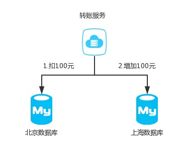

对于一个支付宝的转账业务来说，你给你的朋友转钱，有可能你的数据库是在北京，而你朋友的钱是存在上海，这时就需要借助分布式事务保证数据一致性。

## 2.2 应用SOA化

所谓的SOA化，就是业务的服务化。比如原来单机支撑了整个电商网站，现在对整个网站进行拆解，分离出了订单中心、用户中心、库存中心、优惠券中心等。

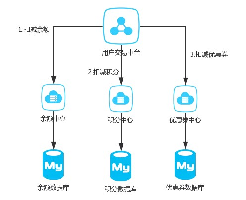

用户的一次下单操作可能会包括扣减余额、扣减几分、扣减优惠券三个子操作，对应三个不同的服务节点，为了保证数据一致性，也需要用到分布式事务。

# 3、CAP理论

## 3.1 CAP定义

分布式系统的最大难点，就是各个节点的状态如何同步。CAP 定理是这方面的基本定理，也是理解分布式系统的起点。

**CAP定理（CAP theorem）**又被称作`布鲁尔定理(Brewer's theorem)`，是加州大学伯克得分校的计算机科学家埃里克·布鲁尔（Eric Brewer）在2000年的ACM PODC上提出的一个猜想。2002 年，麻省理工学院的赛斯·吉尔伯特（Seth Gilbert）和南希·林奇（Nancy Lynch）发表了布鲁尔猜想的证明，使之成为分布式计算领域公认的一个定理。

CAP定理首先把分布式系统中的三个特性进行了如下归纳：

- **一致性（Consistency）**：读操作保证能够返回最新的写操作结果

  即更新操作成功并返回客户端后，所有节点在同一时间的数据完全一致，这就是分布式的一致性。一致性的问题在并发系统中不可避免，对于客户端来说，一致性指的是并发访问时更新过的数据如何获取的问题。从服务端来看，则是更新如何复制分布到整个系统，以保证数据最终一致。

-  **可用性（Availability）**：非故障的节点在合理的时间内返回合理的响应

  读写操作在单台机器发生故障的时候仍然能够进行，不需要等待发生故障的机器重启或者其上面的服务迁移到其他的机器，在分布式领域来说一般是用**多副本**来保证

-  **分区容错性（Partition tolerance）**：当部分节点出现网络故障后，系统能够继续履行职责

  。分区相当于对通信的时限要求。系统如果不能在时限内达成数据一致性，就意味着发生了分区的情况，必须就当前操作在C和A之间做出选择。

## 3.2 CAP定理的证明

> **定理**：任何分布式系统只可同时满足CAP当中的二点，无法三者兼顾

我们用反证法证明，假设现实中确实存在满足这三个条件的分布式系统，那么当系统之间的网络发生分区的时，它看起来像下面的情况：

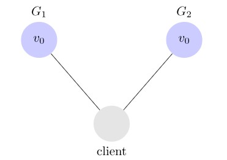

现在客户端 C1 更新 G1 服务器上的 v 为 v1，因为我们的系统是可用的，所以 G1 服务器会做出响应，但是因为网络发生了分区，G1 无法将数据复制到 G2。

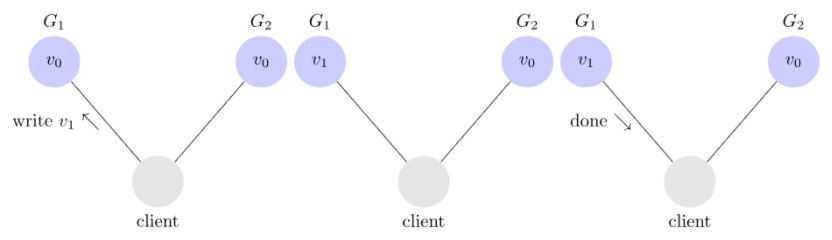

写完数据之后，另外一个客户端 C2 向 G2 服务器发出读取 vv 的请求， 但是因为网络分区的存在，G2 服务器上 v 还是更新之前的值，所以客户端 C2 得到的结果为 v0。

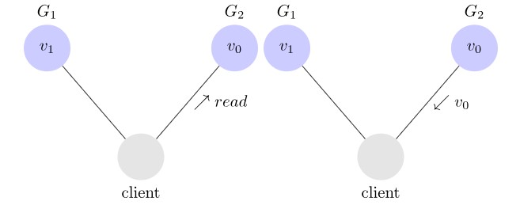

这种情况下 C2 并没有获取到 C1 写入的值，也就不满足数据一致性。由此可以得出分布式系统不能同时满足可用性、一致性以及分区容错性。

## 3.3 取舍策略

CAP三个特性只能满足其中两个，那么取舍的策略就共有三种：

- **CA without P**：如果不要求P（不允许分区），则C（强一致性）和A（可用性）是可以保证的，单节点数据库即为这种模式。但放弃P的同时也就意味着放弃了系统的扩展性，也就是分布式节点受限，没办法部署子节点，这是违背分布式系统设计的初衷的。
- **CP without A**：如果不要求A（可用），相当于每个请求都需要在服务器之间保持强一致，而P（分区）会导致同步时间无限延长(也就是等待数据同步完才能正常访问服务)，一旦发生网络故障或者消息丢失等情况，就要牺牲用户的体验，等待所有数据全部一致了之后再让用户访问系统。设计成CP的系统其实不少，最典型的就是分布式数据库，如Redis、HBase等。对于这些分布式数据库来说，数据的一致性是最基本的要求，因为如果连这个标准都达不到，那么直接采用关系型数据库就好，没必要再浪费资源来部署分布式数据库。
-  **AP wihtout C**：要高可用并允许分区，则需放弃一致性。一旦分区发生，节点之间可能会失去联系，为了高可用，每个节点只能用本地数据提供服务，而这样会导致全局数据的不一致性。典型的应用就如某米的抢购手机场景，可能前几秒你浏览商品的时候页面提示是有库存的，当你选择完商品准备下单的时候，系统提示你下单失败，商品已售完。这其实就是先在 A（可用性）方面保证系统可以正常的服务，然后在数据的一致性方面做了些牺牲，虽然多少会影响一些用户体验，但也不至于造成用户购物流程的严重阻塞。

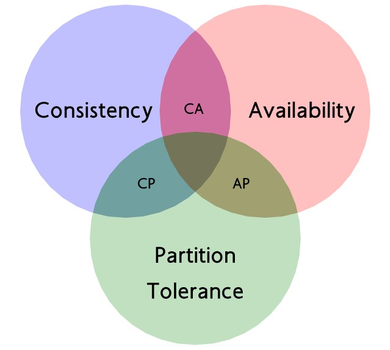

现如今，对于多数大型互联网应用的场景，主机众多、部署分散，而且现在的集群规模越来越大，节点只会越来越多，所以节点故障、网络故障是常态，因此分区容错性也就成为了一个分布式系统必然要面对的问题。**分布式系统必须满足 P**，否则就不是一个正真的分布式系统，那么就只能在C和A之间进行取舍。

如果分布式系统不要求强的可用性，也就是容许系统停机或者长时间无响应的话，这种情况我们就可以考虑舍弃 A。我们常见的 Zookeeper 就是满足 CP 的。

如果我们的系统可用性要求非常高，那么我们可以牺牲一致性来满足。这里说的牺牲一致性并不是说系统一直处于不一致的状态，要是这样的话这系统就没啥用了。我们说的牺牲一致性一般都是说牺牲强一致性，而**保证最终一致性**。也就是说系统短暂是不一致性的，过段时间能保证一致，也就是最终一致性。

所以，对于一个分布式系统来说，P 是一个基本要求，CAP 三者中，只能根据系统要求在 C 和 A 两者之间做权衡，并且要想尽办法提升 P。

## 3.4 CAP扩展

理论的优点在于清晰简洁、易于理解，但是缺点就是高度抽象化、省略了很多的细节，导致在将理论应用到实践时，由于各种复杂情况，可能出现误解和偏差，CAP理论也不例外。

 如果我们没有意识到这些关键的细节点，那么在实践中应用CAP理论时，就可能发出方案很难落地。

- CAP关注的粒度是数据，而不是整个系统。

  C与A之间的取舍可以在同一系统内以非常细小的粒度反复发生，而每一次的决策可能因为具体的操作，乃至因为牵涉到特定的数据或用户有所不同。

  以一个用户管理系统为例，用户管理系统包含用户账号数据（用户ID、密码）、用户信息数据（昵称、兴趣、性别等）。通常情况下，用户账号数据会选择CP，而用户信息数据会选择AP，如果限定整个系统为CP，则不符合用户信息的应用场景；如果限定整个系统为AP，则又不符合用户账号数据的应用场景。
  所以在CAP理论落地实践时，我们需要将系统内的数据按照不同的应用场景和要求进行分类，每类数据选择不同的策略（CP或AP），而不是直接限定整个系统所有数据都是同一策略。

- CAP是忽略网络延迟的。

   这是一个非常隐含的假设，布鲁尔在定义一致性时，并没有将延迟考虑进去。即当事务提交时，数据能够瞬间复制到所有节点。但实际情况下，从节点A复制数据到节点B，总是需要花费一定时间的。如果在相同机房可能是几毫秒，如果跨机房，可能是几十毫秒。这也就是说，CAP理论中的C在实践中是不可能完美实现的，在数据复制的过程中，节点A和节点B的数据并不一致。

- 正常运行情况下，不存在CP和AP的选择，可以同时满足CA。
  CAP理论告诉我们分布式系统只能选择CP或者AP，但其实这里的前提是系统发生了“分区”现象。如果系统没有发生分区现象，也就是说P不存在的时候（节点的网络连接一切正常），我们就没有必要放弃C或者A，应该C和A都可以保证，这就要求架构设计的时候即要考虑分区发生时选择CP还是AP，也要考虑分区没有发生时如何保证CA。

  这里我们还以用户管理系统为例，即使是实现CA，不同的数据实现方式也可能不一样：用户账号数据可以采用“消息队列”的方式来实现CA，因为消息队列可以比较好地控制实时性，但实现起来就复杂一些；而用户信息数据可以采用“数据库同步”的方式来实现CA，因为数据库的方式虽然在某些场景下可能延迟较高，但使用起来简单。

- AP 方案中牺牲一致性只是指分区期间，而不是永远放弃一致性
  CAP理论的“牺牲”只是说在分区过程中我们无法保证C或者A，但并不意味着什么都不做。分区期间放弃C或者A，并不意味着永远放弃C和A，我们可以在分区期间进行一些操作，从而让分区故障解决后，系统能够重新达到CA的状态。
  最典型的就是在分区期间记录一些日志，当分区故障解决后，系统根据日志进行数据恢复，使得重新达到CA状态。

# 4、BASE 理论

BASE 是 **Basically Available（基本可用）**、**Soft state（软状态）**和 **Eventually consistent（最终一致性）**三个短语的简写，由 eBay 架构师 Dan Pritchett 于 2008 年在《BASE: An Acid Alternative》论文中首次提出。

核心思想是**通过牺牲强一致性获得可用性，采用适合的方式达到最终一致性**。 

- 基本可用（Basically Available）
   分布式系统在出现故障时，**允许损失部分可用性**，即保证核心可用。
   这里的关键词`部分`和`核心`，具体选择哪些作为可以损失的业务，哪些是必须保证的业务，是一项有挑战的工作。例如，对于一个用户管理系统来说，“登录”是核心功能，而“注册”可以算作非核心功能。因为未注册的用户本来就还没有使用系统的业务，注册不了最多就是流失一部分用户，而且这部分用户数量较少。如果用户已经注册但无法登录，那就意味用户无法使用系统。例如，充了钱的游戏不能玩了、云存储不能用了……这些会对用户造成较大损失，而且登录用户数量远远大于新注册用户，影响范围更大。
- 软状态（ Soft State）
   允许系统存在中间状态，而该**中间状态不会影响系统整体可用性**。这里的中间状态就是 CAP 理论中的数据不一致。
- 最终一致性（ Eventual Consistency）
  系统中的所有数据副本经过一定时间后，**最终能够达到一致的状态**。
  这里的关键词是`一定时间` 和 `最终`，`一定时间`和数据的特性是强关联的，不同的数据能够容忍的不一致时间是不同的。举一个微博系统的例子，用户账号数据最好能在 1 分钟内就达到一致状态，因为用户在 A 节点注册或者登录后，1 分钟内不太可能立刻切换到另外一个节点，但 10 分钟后可能就重新登录到另外一个节点了；而用户发布的最新微博，可以容忍 30 分钟内达到一致状态，因为对于用户来说，看不到某个明星发布的最新微博，用户是无感知的，会认为明星没有发布微博。“最终”的含义就是不管多长时间，最终还是要达到一致性的状态。

# 5、ACID 、CAP & BASE

`CAP`、`ACID`、`BASE`都是和数据一致性相关的理论。

> 从字面语义来看，BASE在英文中有“碱”的意思，ACID在英文中“酸”的意思，将两者倒在帽子（CAP）当中一掺和，就达到了酸碱平衡。简单来说是在不同的场景下，可以分别利用ACID和BASE来解决分布式服务化系统的一致性问题。

下面简单对比一下ACID、BASE几个概念的关键区别点。

## 5.1 两种一致性

实际上我们通常说的数据库事务的一致性和分布式系统的一致性并不是一个概念。这里可以区分成“**内部一致性**”和“**外部一致性**”。

### 5.1.2 内部一致性

内部一致性搞数据库的人很少这么说，一般就直接说一致性，更准确的说是“Consistency in ACID”（“事务 ACID 属性中的一致性”）。也就是不同隔离级别下，如何解决更新丢失、不可重复读、幻读等异常场景。

### 5.1.2 外部一致性

外部一致性是针对分布式系统而言的，分布式领域提及的 Consistency 表示系统的正确性模型，著名的 CAP 理论中的 C 就是这个范畴的。这主要是由于分布式系统写入和读取都可能不在同一台机器上，而这必然会有一段时间导致不同机器上所存的数据不一致的情况，这就是所谓的“不一致时间窗口”。

外部一致性，通常会分为强一致性，弱一致性，还有最终一致性：

- **强一致性**：指系统中的某个数据被成功更新后，后续任何对该数据的读取操作都将得到更新后的值
- **弱一致性**：弱一致性是相对于强一致性而言，它不保证总能得到最新的值；
- **最终一致性**：是弱一致性的特殊形式，即保证在没有新的更新的条件下，经过一段“不一致时间窗口”，最终所有的访问都是最后更新的值。最常见的是DNS服务，更新域名指向的机器后，多级缓存要等到expiration time的时候才会更新，但是随着时间的推移，最终数据会趋于一致。

## 5.2 对比

这里，我们来说说CAP的具体细节，简单对比一下ACID、BASE几个概念的关键区别点。

- ACID 是数据库事务完整性的理论
- CAP 是分布式系统设计理论
- BASE 理论本质上是对 CAP 的延伸和补充，更具体地说，是对CAP 中 AP 方案的一个补充。

# 6、分布式事务解决方案

## 6.1 X/Open DTP事务模型

X/Open DTP 全称 `X/Open Distributed Transaction Processing Reference`，是X/Open组织定义出的一套分布式事务标准。

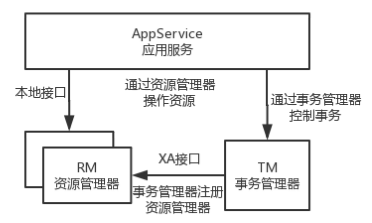

- **AppService**：服务应用。定义事务边界以及组成事务的操作，可以理解为使用分布式事务的应用程序。
- **RM（Resource Manager）**：资源管理器。管理一些共享资源的自治域，可理解为数据库或者消息队列服务器，资源必须实现XA接口。
- **TM（Transaction Manager）**:事务管理器。管理全局事务，协调事务的提交或者回滚，并协调故障恢复。

AppService可以和TM、RM进行通信，TM和RM也能够进行通信。

- AppService可以通过**TX接口**向事务管理器发起事务、提交事务和回滚事务。
- TM和RM通过**XA接口**进行双向通信，比如TM通知RM提交事务或回滚事务；RM把提交结果通知给TM。
- AppService和RM之间则通过RM提供的**本地API接口**进行资源控制。

## 6.2 二阶段提交

XA协议就是根据两阶段提交（two-phase commit, 2PC）来保证事务的完整性，并实现分布式服务化的强一致性。

两阶段提交协议把分布式事务分成两个过程：

**第一阶段：称为准备(prepare)阶段。**事务协调者向各个服务应用发送prepare请求，服务应用在得到请求后做预处理操作，预处理可能是做预检查，也可能是把请求临时存储，可以理解为是一种试探性地提交。下面是一般的步骤：

1. 事务协调者会问所有的参与者服务，是否可以提交操作。
2. 各个参与者开始事务执行的准备工作：如资源上锁，预留资源，写回滚/重试的log。
3. 参与者响应协调者，如果事务准备工作成功，则回应“可以提交”，否则回应拒绝提交。

**第二阶段：称为提交(commit)/回滚(rollback)阶段。**是指事务真正提交或者回滚的阶段。如果事务协调者发现事务参与者有一个在prepare阶段出现失败，则会要求所有的参与者进行回滚。如果协调者发现所有的参与者都prepare操作都是成功，那么他将向所有的参与者发出提交请求，这时所有参与者才会正式提交。由此保证了要求全部提交成功，要么全部失败。下面是具体步骤：

1. 如果所有的参与者都回应“可以提交”，那么协调者向所有参与者发送“正式提交”的命令。参与者完成正式提交，并释放所有资源，然后回应“完成”，协调者收集各个服务的“完成”回应后结束事务。
2. 如果有一个参与者回应“拒绝提交”，那么协调者向所有的参与者发送“回滚操作”，并释放所有的资源，然后回应“回滚完成”，协调者收集各个服务应用的“回滚”返回后，取消整体的分布式事务。

两阶段提交协议成功场景示意图如下：

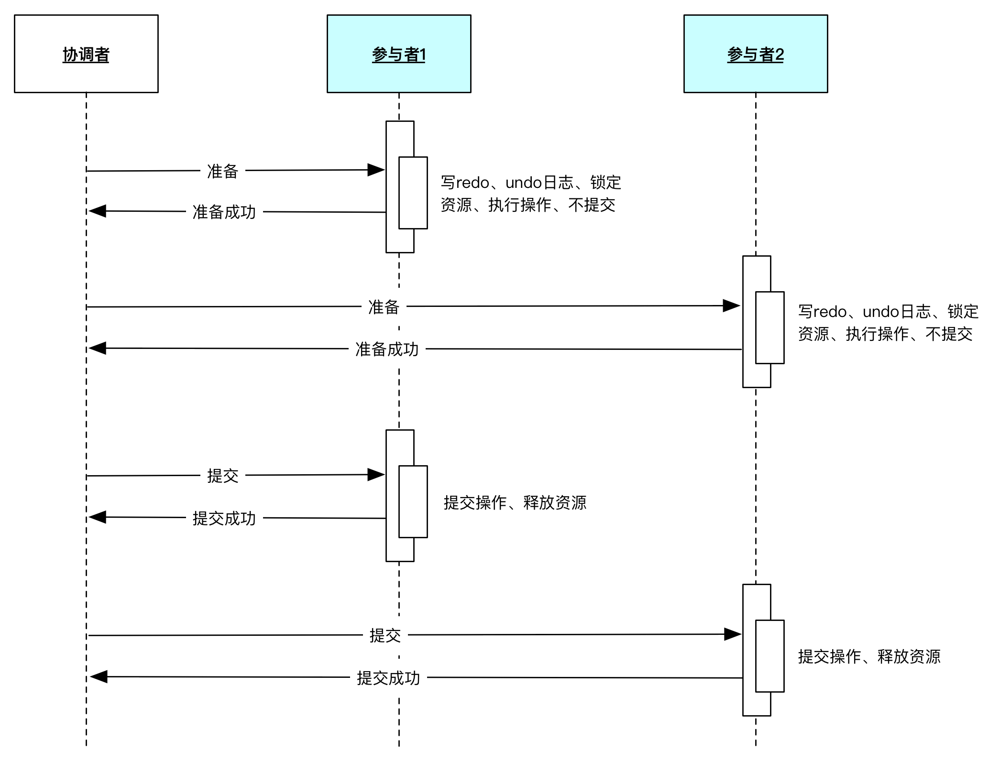

两阶段提交协议**在准备阶段锁定资源**，是一个重量级的操作，并能保证强一致性，但是实现起来复杂、成本较高，不够灵活，更重要的是它有如下致命的问题：

- **同步阻塞**：对于任何一次指令必须收到明确的响应，才会继续做下一步，否则处于阻塞状态，占用的资源被一直锁定，不会被释放
- **单点故障**：如果协调者宕机，参与者没有了协调者指挥，会一直阻塞，尽管可以通过选举新的协调者替代原有协调者，但是如果之前协调者在发送一个提交指令后宕机，而提交指令仅仅被一个参与者接受，并且参与者接收后也宕机，新上任的协调者无法处理这种情况
- **脑裂**：协调者发送提交指令，有的参与者接收到执行了事务，有的参与者没有接收到事务，就没有执行事务，多个参与者之间是不一致的。

总的来说，XA协议比较简单，成本较低，但是其**单点问题**，以及**不能支持高并发(由于同步阻塞)**依然是其最大的弱点。

## 6.3 三阶段提交

三阶段提交协议是两阶段提交协议的改进版本。它**通过超时机制解决了阻塞的问题**，并且把两个阶段增加为三个阶段：

- **询问阶段**：协调者询问参与者是否可以完成指令，协调者只需要回答是还是不是，而不需要做真正的操作，这个阶段超时导致中止
- **准备阶段**：如果在询问阶段所有的参与者都返回可以执行操作，协调者向参与者发送预执行请求，然后参与者写redo和undo日志，执行操作，但是不提交操作；如果在询问阶段任何参与者返回不能执行操作的结果，则协调者向参与者发送中止请求，这里的逻辑与两阶段提交协议的的准备阶段是相似的，这个阶段超时导致成功
- **提交阶段**：如果每个参与者在准备阶段返回准备成功，也就是预留资源和执行操作成功，协调者向参与者发起提交指令，参与者提交资源变更的事务，释放锁定的资源；如果任何一个参与者返回准备失败，也就是预留资源或者执行操作失败，协调者向参与者发起中止指令，参与者取消已经变更的事务，执行undo日志，释放锁定的资源，这里的逻辑与两阶段提交协议的提交阶段一致

三阶段提交协议成功场景示意图如下：

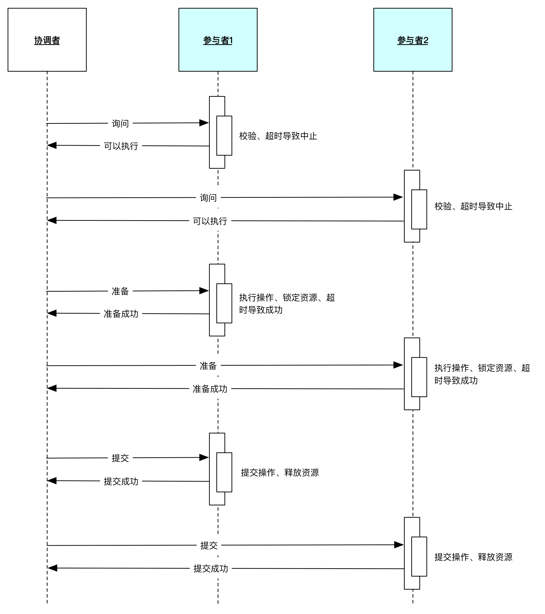

这里与两阶段提交协议有两个主要的不同：

- 增加了一个询问阶段，询问阶段可以确保尽可能早的发现无法执行操作而需要中止的行为，但是它并不能发现所有的这种行为，只会减少这种情况的发生
- 在准备阶段以后，协调者和参与者执行的任务中都增加了超时，一旦超时，协调者和参与者都继续提交事务，默认为成功，这也是根据概率统计上超时后默认成功的正确性最大

三阶段提交协议与两阶段提交协议相比，具有如上的优点，但是一旦发生超时，系统仍然会发生不一致，只不过这种情况很少见罢了，好处就是至少不会阻塞和永远锁定资源。

不论是两阶段提交协议还是三阶段提交协议，遇到极端情况，系统会发生阻塞或者不一致的问题，需要人工解决。两个方案中都包含多个参与者、多个阶段实现一个事务，实现复杂，性能也是一个很大的问题，因此，在互联网高并发系统中，鲜有使用两阶段提交和三阶段提交协议的场景。

## 6.4 TCC

关于**TCC**（Try-Confirm-Cancel）的概念，最早是由Pat Helland于2007年发表的一篇名为*《Life beyond Distributed Transactions:an Apostate’s Opinion》*的论文提出。 TCC事务机制相比于上面介绍的XA，解决了其几个缺点: 

- 解决了协调者单点，由主业务方发起并完成这个业务活动。业务活动管理器也变成多点，引入集群。 
- 引入超时，超时后进行**补偿**，并且不会锁定整个资源，将资源转换为业务逻辑形式，粒度变小。 
- 数据一致性，有了补偿机制之后，由业务活动管理器控制一致性

对于TCC三个阶段分别为:

- **Try阶段**：尝试执行，完成所有业务检查（一致性），预留必须业务资源（准隔离性）
- **Confirm阶段**：确认执行真正执行业务，不作任何业务检查，只使用Try阶段预留的业务资源，**Confirm操作满足幂等性**，Confirm失败后需要进行重试。
- **Cancel阶段**：取消执行，释放Try阶段预留的业务资源， **Cancel操作满足幂等性**，Cancel阶段的异常和Confirm阶段异常处理方案基本上一致。

举个简单的例子，如果你用2元买了一瓶水， Try阶段，你需要向你的钱包检查是否够2元并锁住这2元，水也是一样的；如果有一个失败，则进行cancel，释放这2元和这一瓶水，如果cancel失败不论什么失败都进行重试cancel，所以需要保持幂等；如果都成功，则进行confirm，确认这2元扣，和这一瓶水被卖，如果confirm失败无论什么失败则重试。

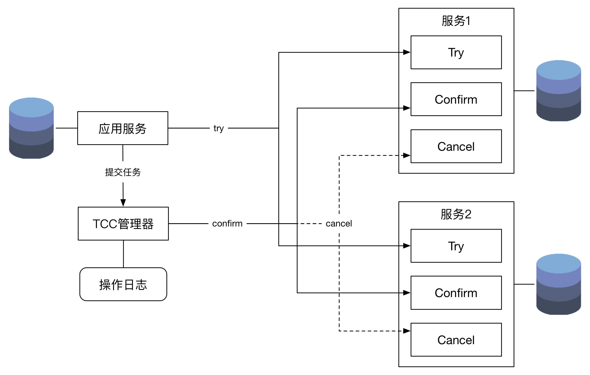

可以看出，从时序上，如果遇到极端情况下TCC会有很多问题的，例如，如果在Cancel的时候一些参与者收到指令，而一些参与者没有收到指令，整个系统仍然是不一致的，这种复杂的情况，系统首先会通过补偿的方式，尝试自动修复的，如果系统无法修复，必须由人工参与解决。

从TCC的逻辑上看，可以说TCC是简化版的三阶段提交协议，解决了两阶段提交协议的阻塞问题，但是没有解决极端情况下会出现不一致和脑裂的问题。然而，TCC通过**自动化补偿手段**，会把需要人工处理的不一致情况降到到最少，也是一种非常有用的解决方案。

> 如果整个事务处于不正常的状态，我们需要修正操作中有问题的子操作，这可能需要重新执行未完成的子操作，或者取消已经完成的子操作，通过修复使整个分布式系统达到一致，为了让系统最终一致而做的努力都叫做**补偿**。

两阶段提交协议、三阶段提交协议、TCC协议都能保证分布式事务的一致性，他们保证的分布式系统的一致性从强到弱，TCC达到的目标是最终一致性。

## 6.5 消息事务

本方案的核心是将需要分布式处理的任务通过消息日志的方式来**异步执行**，是补偿模式的一个典型案例。

本地消息表适用于对响应时间要求并不太高的场景，通常把这类操作从主流程中摘除，通过异步的方式进行处理，处理后把结果通过通知系统通知给使用方，这个方案最大的好处能够对高并发流量进行消峰，例如：电商系统中的物流、配送，以及支付系统中的计费、入账等。

实践中，消息事务有两种常见的模式：本地消息表和MQ事务

### 6.5.1 本地消息表

发送消息之前，把消息持久到数据库，状态标记为待发送，然后发送消息，如果发送成功，将消息改为发送成功。定时任务定时从数据库捞取一定时间内未发送的消息，将消息发送。

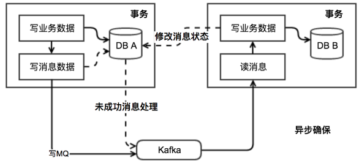

还是拿用2元买水来举例子：

1. 当扣钱的时候，需要在扣钱的服务器上新增加一个本地消息表，把扣钱和写本地消息表的两个操作放入同一个事务，依靠数据库本地事务保证一致性。
2. 有个定时任务去轮询这个本地事务表，把没有发送的消息，扔给商品库存服务器，叫他减去水的库存，到达商品服务器之后，先写入这个服务器的事务表，然后进行扣减，扣减成功后，更新事务表中的状态。
3. 商品服务器通过定时任务扫描消息表或者直接通知扣钱服务器，扣钱服务器本地消息表进行状态更新。
4. 针对一些异常情况，定时扫描未成功处理的消息，进行重新发送，在商品服务器接到消息之后，首先判断是否是重复的，如果已经接收，在判断是否执行，如果执行在马上又进行通知事务，如果未执行，需要重新执行需要由业务保证幂等，也就是不会多扣一瓶水。

### 6.5.2 MQ事务

实现方式与第一种类似，不同的是持久消息的数据库是独立的，并不耦合在业务系统中。实际上就是对本地消息表的一个封装，将本地消息表移动到了MQ内部。

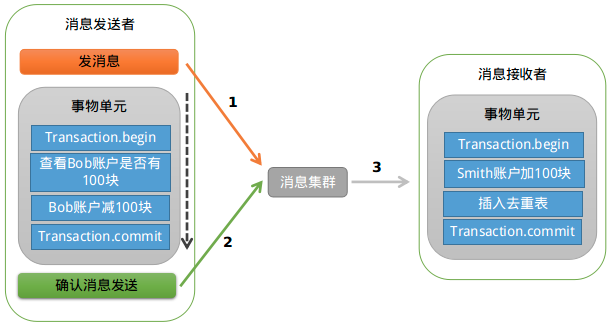

首先，上游服务需要发送一条消息给可靠消息服务，可以认为是对下游服务一个接口的调用，里面包含了对应的一些请求参数。

然后，可靠消息服务就得把这条消息存储到自己的数据库里去，状态为“待确认”。

接着，上游服务就可以执行自己本地的数据库操作，根据自己的执行结果，再次调用可靠消息服务的接口。

如果本地数据库操作执行成功了，那么就找可靠消息服务确认那条消息。如果本地数据库操作失败了，那么就找可靠消息服务删除那条消息。

此时如果是确认消息，那么可靠消息服务就把数据库里的消息状态更新为“已发送”，同时将消息发送给 MQ。

这里有一个很关键的点，就是更新数据库里的消息状态和投递消息到 MQ。这俩操作，必须放在一个方法里，而且得开启本地事务。

啥意思呢？如果数据库里更新消息的状态失败了，那么就抛异常退出了，就别投递到 MQ；如果投递 MQ 失败报错了，那么就要抛异常让本地数据库事务回滚。这俩操作必须得一起成功，或者一起失败。

如果上游服务是通知删除消息，那么可靠消息服务就得删除这条消息。

下游服务就一直等着从 MQ 消费消息好了，如果消费到了消息，那么就操作自己本地数据库。

如果操作成功了，就反过来通知可靠消息服务，说自己处理成功了，然后可靠消息服务就会把消息的状态设置为“已完成”。

如果确认消息失败，定时扫描没有更新状态的消息，如果有消息没有得到确认，会向消息发送者发送消息，来判断是否提交。

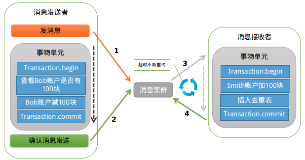

如果我们要保证消息可靠的发送，那么就需要有**重试**机制，有了重试机制，消息一定会**重复**，那么我们需要对重复做处理，也就是保持消息处理接口的**幂等性**。

关于消息的可靠性，有两个问题需要重点分析一下。

- **如何保证上游服务对消息的 100% 可靠投递？**

如果上游服务给可靠消息服务发送待确认消息的过程出错了，那没关系，上游服务可以感知到调用异常的，就不用执行下面的流程了，这是没问题的。

如果上游服务操作完本地数据库之后，通知可靠消息服务确认消息或者删除消息的时候，出现了问题。

比如：没通知成功，或者没执行成功，或者是可靠消息服务没成功的投递消息到 MQ。这一系列步骤出了问题怎么办？

其实也没关系，因为在这些情况下，那条消息在可靠消息服务的数据库里的状态会一直是“待确认”。

此时，我们在可靠消息服务里开发一个后台定时运行的线程，不停的检查各个消息的状态。

如果一直是“待确认”状态，就认为这个消息出了问题。此时可以回调上游服务提供的一个接口，查询对应的对应的数据库操作是否执行成功。

如果执行成功了，那么将消息状态修改为“已发送”，同时投递消息到 MQ。

如果没执行成功，那么将数据库中的消息删除即可。

通过这套机制，就可以保证，可靠消息服务一定会尝试完成消息到 MQ 的投递。

- **如何保证下游服务对消息的 100% 可靠接收？**

对于下游服务消费消息出了问题，没消费到，或者处理失败的情况，依靠消息服务里的后台线程不断检查消息状态来处理。

如果消息状态一直是“已发送”，始终没有变成“已完成”，那么就说明下游服务始终没有处理成功。

此时可靠消息服务就可以再次尝试重新投递消息到 MQ，让下游服务来再次处理。

只要下游服务的接口逻辑实现幂等性，保证多次处理一个消息，不会插入重复数据即可。

消息的可靠性依赖与消息服务的各种自检机制来确保：

- 如果上游服务的数据库操作没成功，下游服务是不会收到任何通知。
- 如果上游服务的数据库操作成功了，可靠消息服务死活都会确保将一个调用消息投递给下游服务，而且一定会确保下游服务务必成功处理这条消息。

通过这套机制，保证了基于 MQ 的异步调用/通知的服务间的分布式事务保障。其实阿里开源的 RocketMQ，就实现了可靠消息服务的所有功能，核心思想跟上面类似。