# 1、引言

转账是生活中常见的操作，比如从A账户转账100元到B账号。站在用户角度而言，这是一个逻辑上的单一操作，然而在数据库系统中，至少会分成两个步骤来完成：

1. 将A账户的金额减少100元
2. 将B账户的金额增加100元

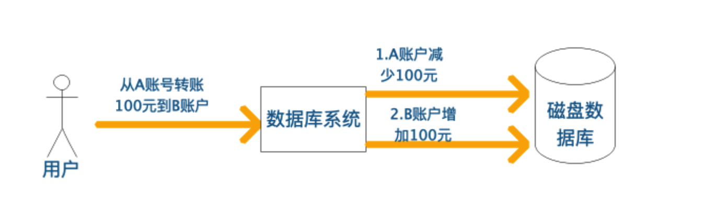

在这个过程中可能会出现以下问题：

- 转账操作的第一步执行成功，A账户上的钱减少了100元，但是第二步执行失败或者未执行便发生系统崩溃，导致B账户并没有相应增加100元
- 转账操作刚完成就发生系统崩溃，系统重启恢复时丢失了崩溃前的转账记录
- 同时又另一个用户转账给B账户，由于同时对B账户进行操作，导致B账户金额出现异常

为了解决这些问题，需要引入数据库事务的概念：

> 事务提供一种机制，将一个活动涉及的所有操作纳入到一个不可分割的执行单元，组成事务的所有操作只有在所有操作均能正常执行的情况下方能提交，只要其中任一操作执行失败，都将导致整个事务的回滚。简单地说，事务提供一种“**要么什么都不做，要么全部做成功（All or Nothing）**”机制。

对于上面的转账例子，可以将转账相关的所有操作包含在一个事务中

```mysql
BEGIN TRANSACTION 
A账户减少100元
B账户增加100元
COMMIT
```

- 当数据库操作失败或者系统出现崩溃，系统能够以事务为边界进行恢复，不会出现A账户金额减少而B账户未增加的情况
- 当有多个用户同时操作数据库时，数据库能够以事务为单位进行并发控制，使多个用户对B账户的转账操作相互隔离

事务使系统能够更方便的进行故障恢复以及并发控制。从而保证数据库状态的一致性。

# 2、ACID特性

为了保证数据完整性，要求数据库维护事务的以下性质：原子性（**A**tomicity）、一致性（**C**onsistency）、隔离性（**I**solation）、持久性（**D**urability），并称为**ACID**特性。

## 2.1 原子性（Atomicity）

事务中的所有操作作为一个整体像原子一样不可分割，**要么全部成功，要么全部失败**。

在数据库管理系统（DBMS）中，默认情况下一条SQL就是一个单独事务，事务是自动提交的。只有显式的使用开启一个事务，才能将一个代码块放在事务中执行。

保障事务的原子性是数据库管理系统的责任，为此许多数据库采用日志机制。例如：对于事务要执行写操作的数据项，数据库系统在磁盘上记录其旧值，如果事务没能完成执行（如在事务执行过程中出现了故障），数据库系统将恢复其旧值，使得表面上事务从未执行过。

## 2.2 一致性（Consistency）

事务的执行结果必须使数据库**从一个一致性状态到另一个一致性状态**。

一致性状态是指：

- 系统的状态满足数据的完整性约束(唯一约束，参照完整性等) 
- 系统的状态反应数据库本应描述的现实世界的真实状态，比如转账前后两个账户的金额总和应该保持不变

确保单个事务的一致性是编写该事务的应用程序员的责任，完整性约束的自动检查给这项工作带来了便利。

## 2.3 隔离性（Isolation）

事务的隔离性确保多个事务并发访问时，事务之间是隔离的，**一个事务不应该影响其它事务运行效果**。

这指的是在并发环境中，当不同的事务同时操纵相同的数据时，每个事务都有各自的完整数据空间。由并发事务所做的修改必须与任何其他并发事务所做的修改隔离。事务查看数据更新时，数据所处的状态要么是另一事务修改它之前的状态，要么是另一事务修改它之后的状态，事务不会查看到中间状态的数据。

即使每个事务都能确保一致性和原子性，如果几个事务并发执行，它们的操作会以某种人们所不希望的方式交叉执行，这也会导致不一致的状态。一种避免事务并发执行而产生的问题的途径是串行地执行事务，但事务并发执行能显著地改善性能，因此人们提出了多种允许多个事务并发执行的解决方法，最常用的就是锁机制。

假如商品表items表中有一个字段status，status=1表示该商品未被下单，status=2表示该商品已经被下单，那么我们对每个商品下单前必须确保此商品的status=1。假设有一件商品，其id为10000；如果不使用锁，那么操作方法如下：

```mysql
   //查出商品状态
   select status from items where id=10000;
   //根据商品信息生成订单
   insert into orders(id，item_id) values(null，10000);
   //修改商品状态为2
   update Items set status=2 where id=10000;
```

上述场景在高并发环境下可能出现问题： 前面已经提到只有商品的status=1是才能对它进行下单操作，上面第一步操作中，查询出来的商品status为1。但是当我们执行第三步update操作的时候，有可能出现其他人先一步对商品下单把Item的status修改为2了，但是我们并不知道数据已经被修改了，这样就可能造成同一个商品被下单2次，使得数据不一致。所以说这种方式是不安全的。

## 2.4 持久性（Durability）

持久性保证事务一旦成功地完成执行，**该事务对数据库所做的更新都是永久的**，即使事务执行完成之后出现系统故障。

在这里持久性的事务完成应该包含了两重含义：

> 1. 在事务结束的时候更新也全部写入磁盘了，这样叫做事务完成。
> 2. 事务结束的时候并非所有更新都写入磁盘了，可能是部分也可能都没有，但写入了哪些更新以及还有哪些没写入的更新的信息是被写入到磁盘上了的，这样也叫做事务完成了。


确保持久性是数据库系统中称为恢复管理部件的软件部件责任。事务管理部件和恢复管理部件之间关系密切。

# 3、并发的价值

事务处理系统通常允许多个事务并发执行。如前所述，允许多个事务并发更新数据引起许多数据一致性的问题。然而有两条理由促使我们使用允许并发：

- **提高吞吐量和资源利用率。**一个事务由多个步骤组成，一些步骤涉及IO活动，另一些涉及CPU活动。计算机系统中CPU和磁盘并行运作。因此IO活动可以与CPU处理并行进行。利用CPU与IO系统的并行性，多个事务可并行执行。当一个事务在一个磁盘上进行读写时，另一个事务可以在CPU上运行，同时第三个事务又可在另一磁盘上进行读写。从而吞吐量增加，即给定的时间内执行的事务数增加，相应地，处理器与磁盘利用率也提高，换句话说处理器与磁盘空闲的时间较少。
- **减少等待时间。**如果事务串行执行，短事务可能必须等待它前面的长事务完成，这可能导致难以预测的延迟。如果各个事务是针对数据库的不同部分进行操作，事务并发执行可能会更好，各个事务可以共享CPU周期和磁盘存取。并发执行也能减少平均响应时间，即一个事务从开始到完成所需的平均时间。

在数据库中使用并发执行后的动机本质上与操作系统中使用**多道程序(multiprograming)**的动机是一样的。

# 4、并发异常

## 4.1 脏写

脏写是指事务回滚了其他事务对数据项的已提交修改，比如下面这种情况：

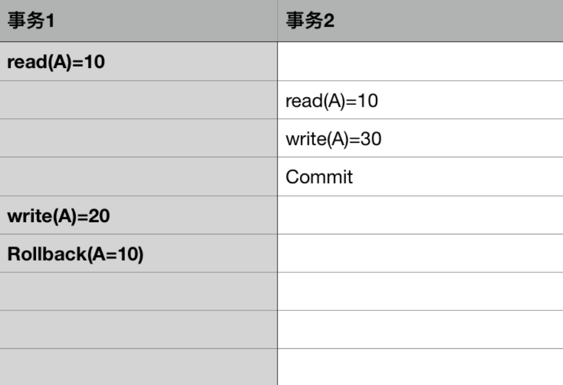

在事务1对数据A的回滚，导致事务2对A的已提交修改也被回滚了。

## 4.2 丢失更新

丢失更新是指事务覆盖了其他事务对数据的已提交修改，导致这些修改好像丢失了一样。

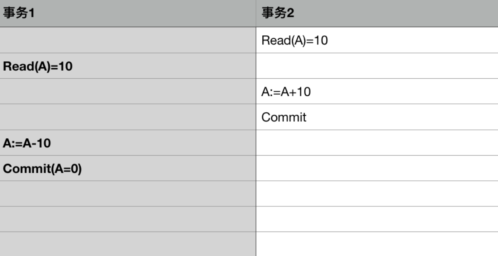

事务1和事务2读取A的值都为10，事务2先将A加上10并提交修改，之后事务2将A减少10并提交修改，A的值最后为，导致事务2对A的修改好像丢失了一样。

## 4.3 脏读

脏读是指一个事务读取了另一个事务未提交的数据。

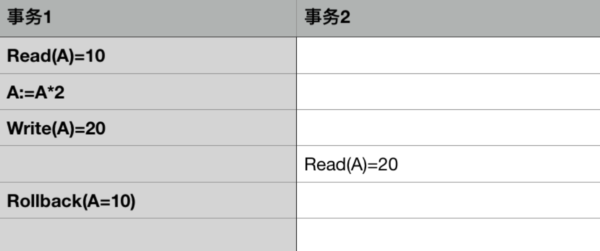

在事务1对A的处理过程中，事务2读取了A的值，但之后事务1回滚，导致事务2读取的A是未提交的脏数据。

## 3.4 不可重复读

不可重复读是指一个事务对同一数据的读取结果前后不一致。

脏读和不可重复读的区别在于：前者读取的是事务未提交的脏数据，后者读取的是事务已经提交的数据，只不过因为数据被其他事务修改过导致前后两次读取的结果不一样，比如下面这种情况：

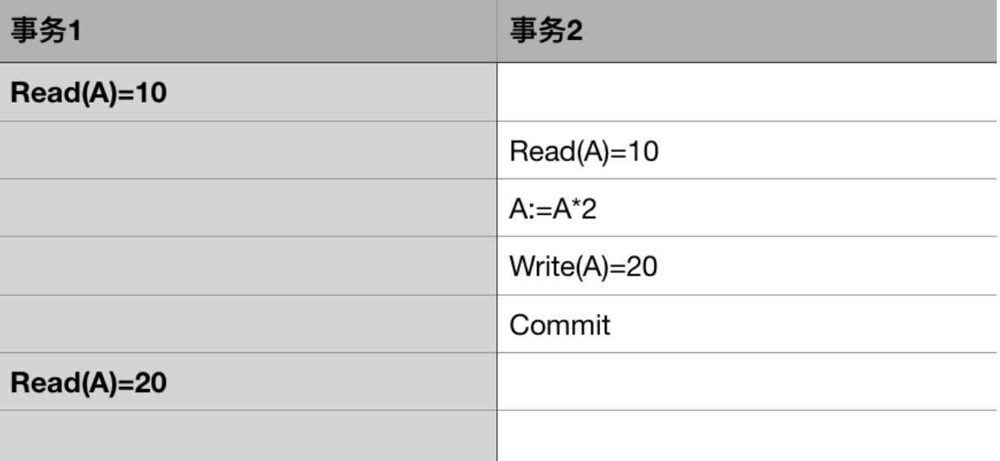

由于事务2对A的已提交修改，事务1前后两次读取的结果不一致。

## 4.5 幻读

幻读是指事务读取某个范围的数据时，因为其他事务的操作导致前后两次读取的结果不一致。

幻读和不可重复读的区别在于：不可重复读是针对确定的某一行数据而言，而幻读是针对不确定的多行数据。

因而幻读通常出现在带有查询条件的范围查询中，比如下面这种情况：

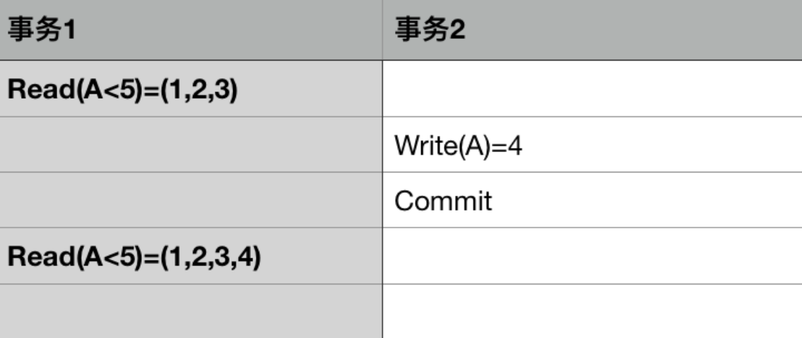

事务1查询A<5的数据，由于事务2插入了一条A=4的数据，导致事务1两次查询得到的结果不一样

# 5、 隔离级别

在实际应用中，对数据库的并发访问是必然的，如何在多个事务的同时操作下保证每个业务流都能获取正确的结果，依靠的就是DBMS提供的不同程度的隔离级别。ANSI/ISO SQL 定义了四种隔离级别：

## 5.1 未提交读(READ UNCOMMITTED)

一个事务过程中可以读取到其他事务对数据的未提交修改。

即事务的修改阶段未加排他锁，对其他事务可见。例如事务A能读取到只是事务B中某一步的修改状态，即存在**脏读**的现象。

## 5.2 已提交读(READ COMMITTED)

一个事务过程中只能读取到其他事务对数据的提交后修改。

即事务的修改阶段加了排它锁，直到事务结束才释放，执行读命令那一刻加了共享锁，读完即释放，以此维持事务修改阶段对其他事务的不可见。例如事务A读取到的只能是事务B提交完成后的状态。该隔离级别避免了脏读现象，但正是由于事务A可能读取到的是事务B修改完成后的数据，以致出现了**不可重复读**现象。

## 5.3 可重复读(REPEATABLE READ)

一个事务过程中不允许其他事务对数据进行修改。

即事务的读取过程加了共享锁，事务的修改过程加了排它锁，并一直维持锁定状态直到事务结束。因为事务的读取或修改都需要维持整个阶段的锁定状态，所以避免了脏读和不可重复读现象。但是因为只对现有的记录上进行了锁定，并未维持间隙锁/范围锁，导致某些数据记录的插入未受阻拦，即存在**幻读**现象。

## 5.4 串行化(SERIALIZABLE)

串行化是最高的事务隔离级别，在该级别下，所有的事务依次逐个执行，相互之间就不可能产生干扰。

由于这种事务隔离级别效率低下，比较耗数据库性能，一般不使用。

## 5.5 总结

事务的隔离级别越低，可能出现的并发异常越多，但是通常而言系统能提供的并发能力越强。

不同的隔离级别与可能的并发异常的对应情况如下表所示：

| 隔离级别 | 脏写 | 脏读 | 不可重复读 | 丢失更新 | 丢失更新幻读 |
| -------- | ---- | ---- | ---------- | -------- | ------------ |
| 未提交读 |      | 可能 | 可能       | 可能     | 可能         |
| 已提交读 |      |      | 可能       | 可能     | 可能         |
| 可重复读 |      |      |            |          | 可能         |
| 串行化   |      |      |            |          |              |

所有事务隔离级别都不允许出现脏写，而串行化可以避免所有可能出现的并发异常，但是会极大的降低系统的并发处理能力。

有一点需要强调，上图中的对应关系只是理论上的，对于特定的数据库实现不一定准确。比如MySQL的Innodb存储引擎，通过Next-Key Locking技术在可重复读级别就消除了幻读的可能。

# 6、并发控制机制

所谓并发控制，就是保证并发执行的事务在某一隔离级别上的正确执行的机制。需要指出的是并发控制由数据库的调度器负责，事务本身并不感知，如下图所示，Scheduler将多个事务的读写请求，排列为合法的序列，使之依次执行：

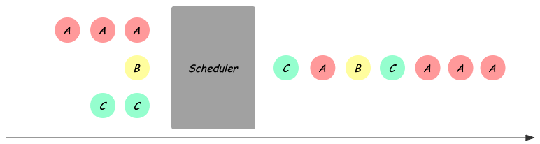

这个过程中，对可能破坏数据正确性的冲突事务，调度器可能选择下面两种处理方式：

- Delay：延迟某个事务的执行到合法的时刻
- Abort：直接放弃事务的提交，并回滚该事务可能造成的影响

可以看出Abort比Delay带来更高的成本，接下来我们就介绍不同的并发控制机制在不同情况下的处理方式。

## 6.1 分类

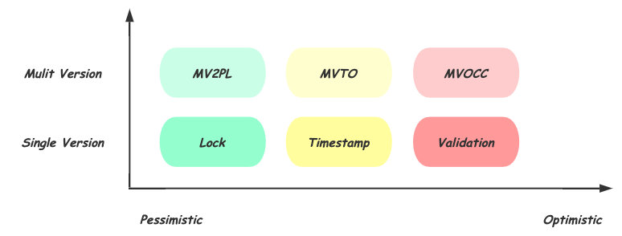

这里从两个维度，对常见的并发控制机制进行分类：

### 6.1.1 乐观程度

不同的实现机制，基于不同的对发生冲突概率的假设，悲观方式认为只要两个事务访问相同的数据库对象，就一定会发生冲突，因而应该尽早阻止；而乐观的方式认为，冲突发生的概率不大，因此会延后处理冲突的时机。如上图横坐标所示，乐观程度从左向右增高：

- 基于Lock：最悲观的实现，需要在操作开始前，甚至是事务开始前，对要访问的数据库对象加锁，对冲突操作Delay；
- 基于Timestamp：乐观的实现，每个事务在开始时获得全局递增的时间戳，期望按照开始时的时间戳依次执行，在操作数据库对象时检查冲突并选择Delay或者Abort；
- 基于Validation：更乐观的实现，仅在Commit前进行Validate，对冲突的事务Abort

可以看出，不同乐观程度的机制**本质的区别在于，检查或预判冲突的时机，Lock在事务开始时，Timestamp在操作进行时，而Validation在最终Commit前**。相对于悲观的方式，乐观机制可以获得更高的并发度，而一旦冲突发生，Abort事务也会比Delay带来更大的开销。

### 6.1.2 单版本 VS 多版本

如上图纵坐标所示，相同的乐观程度下，还存在多版本（MVCC）的实现。所谓多版本，就是在每次需要对数据库对象修改时，生成新的数据版本，每个对象的多个版本共存。读请求可以直接访问对应版本的数据，从而避免读写事务和只读事务的相互阻塞。当然多版本也会带来对不同版本的维护成本，如需要垃圾回收机制来释放不被任何事物可见的版本。

需要指出的是这些并发控制机制并不与具体的隔离级别绑定，通过冲突判断的不同规则，可以实现不同强度的隔离级别，下面基于Serializable具体介绍每种机制的实现方式。

## 6.2 基于锁的并发控制

基于Lock实现的Scheduler需要在事务访问数据前加上必要的锁保护，为了提高并发，会根据实际访问情况分配不同模式的锁，常见的有读写锁，更新锁等。最简单地，需要长期持有锁到事务结束，为了尽可能的在保证正确性的基础上提高并行度，数据库中常用的加锁方式称为**两阶段锁（2PL）**，Growing阶段可以申请加锁，Shrinking阶段只能释放，即在第一次释放锁之后不能再有任何加锁请求。需要注意的是2PL并不能解决死锁的问题，因此还需要有死锁检测及处理的机制，通常是选择死锁的事务进行Abort。

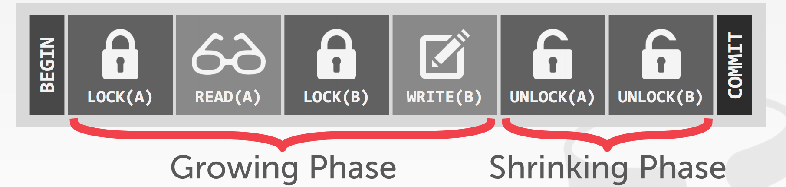

Scheduler对冲突的判断还需要配合**Lock Table**，如下图所示是一个可能得Lock Table信息示意，每一个被访问的数据库对象都会在Lock Table中有对应的表项，其中记录了当前最高的持有锁的模式、是否有事务在Delay、以及持有或等待对应锁的事务链表；同时对链表中的每个事务记录其事务ID，请求锁的模式以及是否已经持有该锁。Scheduler会在加锁请求到来时，通过查找Lock Table判断能否加锁或是Delay，如果Delay需要插入到链表中。对应的当事务Commit或Abort后需要对其持有的锁进行释放，并按照不同的策略唤醒等待队列中Delay的事务。

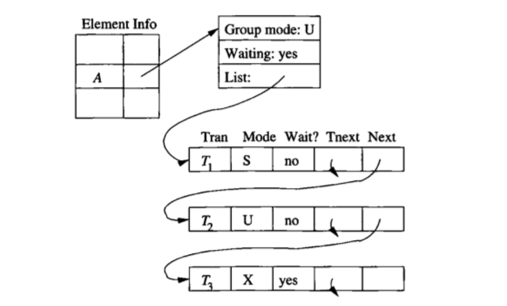

## 6.3 基于时间戳的并发控制

基于Timestamp的Scheduler会在事务开始时候分配一个全局自增的Timestamp，这个Timestamp通常由物理时间戳或系统维护的自增id产生，用于区分事务开始的先后。同时，每个数据库对象需要增加一些额外的信息，这些信息会由对应的事务在访问后更新，包括:

- RT(X): 最大的读事务的Timestamp
- WT(X): 最大的写事务的Timestamp
- C(X): 最新修改的事务是否已经提交

**基于Timestamp假设开始时Timestamp的顺序就是事务执行的顺序**，当事务访问数据库对象时，通过对比事务自己的Timestamp和该对象的信息，可以发现与这种与开始顺序不一致的情况，并作出应对：

- Read Late：比自己Timestamp晚的事务在自己想要Read之前对该数据进行了写入，并修改了WT(X)，此时会Read不一致的数据。
- Write Late: 比自己Timestamp晚的事务在自己想要Write之前读取了该数据，并修改了RT(X)，如果继续写入会导致对方读到不一致数据。

这两种情况都是由于实际访问数据的顺序与开始顺序不同导致的，Scheduler需要对冲突的事务进行Abort。

- Read Dirty：通过对比C(X)，可以发现是否看到的是已经Commit的数据，如果需要保证Read Commit，则需要Delay事务到对方Commit之后再进行提交。

## 6.4 基于有效性检查的并发控制

基于Validation的方式，有时也称为Optimistic Concurrency Control(OCC)，大概是因为它比基于Timestamp的方式要更加的乐观，将冲突检测推迟到Commit前才进行。不同于Timestamp方式记录每个对象的读写时间，Validation的方式记录的是每个事物的读写操作集合。并将事物划分为三个阶段：

- Read阶段：从数据库中读取数据并在私有空间完成写操作，这个时候其实并没有实际写入数据库。维护当前事务的读写集合，RS、WS；
- Validate阶段：对比当前事务与其他有时间重叠的事务的读写集合，判断能否提交；
- Write阶段：若Validate成功，进入Write阶段，这里才真正写入数据库。


同时，Scheduler会记录每个事务的开始时间START(T)，验证时间VAL(T)，完成写入时间FIN(T)

**基于Validataion的方式假设事务Validation的顺序就是事务执行的顺序**，因此验证的时候需要检查访问数据顺序可能得不一致：

- RS(T)和WS(U) 是否有交集，对任何事务U，FIN(U) > START(T)，如果有交集，则T的读可能与U的写乱序；
- WS(T)和WS({U) 是否有交集，对任何事务U， Fin(U) > VAL(T)，如果有交集，则T的写可能与U的写乱序。

## 6.5 多版本控制

对应上述每种乐观程度，都可以有多版本的实现方式，多版本的优势在于，可以让**读写事务与只读事务互不干扰，因而获得更好的并行度**，也正是由于这一点成为几乎所有主流数据库的选择。为了实现多版本的并发控制，需要给每个事务在开始时分配一个唯一标识TID，并对数据库对象增加以下信息：

- txd-id，创建该版本的事务TID
- begin-ts及end-ts分别记录该版本创建和过期时的事务TID
- pointer: 指向该对象其他版本的链表

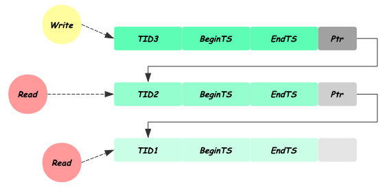

其基本的实现思路是，每次对数据库对象的写操作都生成一个新的版本，用自己的TID标记新版本begin-ts及上一个版本的end-ts，并将自己加入链表。读操作对比自己的TID与数据版本的begin-ts，end-ts，找到其可见最新的版本进行访问。根据乐观程度多版本的机制也分为三类：

### 6.5.1 Two-phase Locking (MV2PL)

与单版本的2PL方式类似，同样需要Lock Table跟踪当前的加锁及等待信息，另外给数据库对象增加了多版本需要的begin-ts和end-ts信息。写操作需要对最新的版本加写锁，并生成新的数据版本。读操作对找到的最新的可见版本加读锁访问。

### 6.5.2 Timestamp Ordering (MVTO)

对比单版本的Timestamp方式对每个数据库对象记录的Read TimeStamp(RT)，Write TimeStamp(WT)，Commited flag(C)信息外增加了标识版本的begin-ts和end-ts，同样在事务开始前获得唯一递增的Start TimeStamp（TS），写事务需要对比自己的TS和可见最新版本的RT来验证顺序，写入是创建新版本，并用自己的TS标记新版本的WT，不同于单版本，这个WT信息永不改变。读请求读取自己可见的最新版本，并在访问后修改对应版本的RT，同样通过判断C flag信息避免Read Uncommitted。

### 6.5.3 Optimistic Concurrency Control (MVOCC)

对比单版本的Validataion（OCC）方式，同样分为三个阶段，Read阶段根据begin-ts，end-ts找到可见最新版本，不同的是在多版本下Read阶段的写操作不在私有空间完成，而是直接生成新的版本，并在其之上进行操作，由于其commit前begin-ts为INF，所以不被其他事务课件；Validation阶段分配新的Commit TID，并以之判断是否可以提交；通过Validation的事务进入Write阶段将begin-ts修改为Commit TID。

## 6.6 总结

相对于悲观的锁实现，乐观的机制可以在冲突发生较少的情况下获得更好的并发效果，然而一旦冲突，需要事务回滚带来的开销要远大于悲观实现的阻塞，因此他们各自适应于不同的场景。而多版本由于避免读写事务与只读事务的互相阻塞， 在大多数数据库场景下都可以取得很好的并发效果，因此被大多数主流数据库采用。可以看出无论是乐观悲观的选择，多版本的实现，读写锁，两阶段锁等各种并发控制的机制，归根接地都是在确定的隔离级别上尽可能的提高系统吞吐，可以隔离级别择决定上限，而并发控制实现决定下限。

