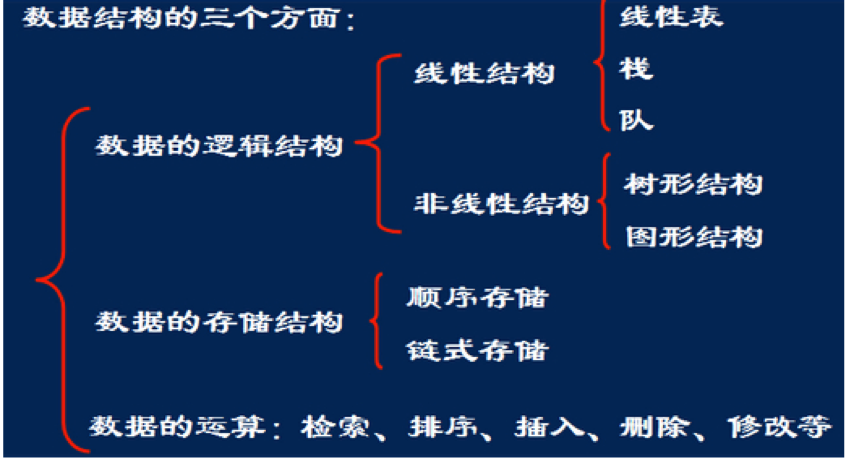

# 1 概述



数据之间的相互关系称为**逻辑结构**。通常分为四类基本结构：

- **集合**：结构中的数据元素除了同属于一种类型外，别无其他关系。
- **线性结构**：结构中的数据元素之间存在一对一的关系。
- **树形结构**：结构中的数据元素之间存在一对多的关系。
- **图状结构或网状结构**：结构中的数据元素之间存在多对多的关系。

数据结构在计算机中有四种常用的存储方法：

- **顺序存储结构**：用数据元素在存储器中的相对位置来表示数据元素之间的逻辑关系。
- **链式存储结构**：用附加的指针字段（节点中的指针域）来表示数据元素之间的逻辑关系。
- **索引存储结构**：在存储数据元素的同时，建立附加的索引表，通过索引表来查找数据元素的存储位置。
- **散列存储结构**：根据数据元素的关键字，通过哈希函数直接计算出该元素的存储位置。

# 2 时间复杂度

一个算法花费的时间与算法中语句的执行次数成正比例，哪个算法中语句执行次数多，它花费的时间就多。算法中的语句执行次数称为语句频度或时间频度，记为 `T(n)`。`n` 称为问题的规模，当 `n` 不断变化时，时间频度 `T(n)` 也会不断变化。但有时我们想知道它变化时呈现什么规律。为此，我们引入**时间复杂度**的概念。

一般情况下，算法中基本操作重复执行的次数是问题规模 `n` 的某个函数，用 `T(n)` 表示，若有某个辅助函数 `f(n)`，使得当 `n` 趋近于无穷大时，`T(n)/f(n)` 的极限值为不等于零的常数，则称 `f(n)` 是 `T(n)` 的**同数量级函数**。记作 `T(n)=O(f(n))`，称 `O(f(n))` 为算法的**渐近时间复杂度**，简称**时间复杂度**。

有时候，算法中基本操作重复执行的次数还随问题的输入数据集不同而不同，如在冒泡排序中，输入数据是有序还是无序，其结果是不一样的。此时，我们需要区分**最好情况**、**最坏情况**和**平均情况**时间复杂度。通常在没有特别说明的情况下，时间复杂度指的是**最坏情况**下的时间复杂度。

常见算法的时间复杂度之间的关系为：

`O(1) < O(log n) < O(n) < O(n log n) < O(n²) < O(2ⁿ) < O(n!) < O(nⁿ)`

实例 1：

```java
  sum=0;     			（1）
     for(i=1;i<=n;i++)   （2）
        for(j=1;j<=n;j++)（3）
        	sum++; 		（4）
```

- 语句（1）执行 1 次
- 语句（2）判断执行 `n+1` 次
- 语句（3）判断执行 `n(n+1)` 次
- 语句（4）执行 `n²` 次

`T(n) = 1 + (n+1) + n(n+1) + n² = 2n² + 2n + 2 = O(n²)`

实例 2：

```java
    a=0;  b=1;          （1）
    for (i=1;i<=n;i++) 	（2）
    {
       s=a+b;　　　　	 （3）
       b=a;　　　　　	（4）
       a=s;　　　　　	（5）
    }
```

- 语句（1）执行 1 次
- 语句（2）判断执行 `n+1` 次
- 语句（3）、（4）、（5）各执行 `n` 次

`T(n) = 1 + (n+1) + 3n = 4n + 2 = O(n)`

实例 3：

```java
    i=1;       		（1）
    while (i<=n)
       i=i*2; 		（2）
```

- 语句（1）的频度是 1

设语句（2）的频度是 `f(n)`，则：

`2^f(n) ≤ n；f(n) ≤ log₂n`

取最大值 `f(n)=log₂n`

`T(n)=O(log₂n)`

# 3 空间复杂度

空间复杂度是对算法所需存储空间的度量，记作：

`S(n)=O(f(n))`

其中 `n` 为问题的规模。

一个算法在计算机存储器上所占用的存储空间，包括三个方面：

- 存储算法本身所占用的存储空间
- 算法的输入输出数据所占用的存储空间
- 算法在运行过程中临时占用的存储空间

如果额外空间相对于输入数据量来说是个常数，则称此算法是**原地工作**。

在分析空间复杂度时，我们主要关注的是**辅助空间**（即除输入输出数据和程序本身外，算法运行所需的额外空间）。

算法的输入输出数据所占用的存储空间是由要解决的问题决定的，是通过参数表由调用函数传递而来的，它不随本算法的不同而改变。存储算法本身所占用的存储空间与算法书写的长短成正比，要压缩这方面的存储空间，就需要编写出较短的算法。