# 1、2-3-4树

在二叉树中，每个节点有一个数据项，最多有两个子节点。如果允许每个节点可以有更多的数据项和更多的子节点，就是**多叉树**（multiway tree）。 

2-3-4树就是一种阶为4的多叉树，它像红黑树一样是平衡树，可以保证在`O(lgn)`的时间内完成查找、插入和删除操作，容易实现，但是效率比红黑树稍差。

下图展示了一颗2-3-4树：

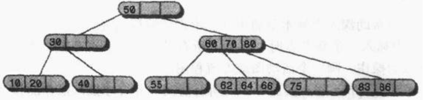

它有如下特点：

- 每个节点可以保存一个、两个或者三个数据项。
- 底层的六个节点都是叶节点，所有的叶节点都是在一层上的
- 非叶子节点的子节点总数总是比它含有的数据项大1

2-3-4树中的2、3、4的含义指的是一个节点可能含有的子节点数。对非子叶节点有三种可能的情况： 

- 有一个数据项的节点总是有两个子节点 
- 有两个数据项的节点总是有三个子节点 
- 有三个数据项的节点重是有四个子节点 

上述的重要的关系决定了2-3-4树的结构，比较而言，叶节点没有子节点，然而它可能还有一个、两个、三个数据项，而空节点是不会存在的。在2-3-4树中不允许只有一个链接。有一个数据项的节点必须总是保持两个连接，除非它是叶节点，在那种情况下没有连接。

如下图所示，有两个链接的节点被称为2-节点，有三个链接的节点被称为3-节点，有四个链接的节点被称为4-节点。

树结构中很重要的一点就是它的链接与自己数据项的关键字之间的关系。二叉树中，所有关键字比某个节点值小的节点都在左子树中，所有关键字比某个值大的节点都在右子树，2-3-4树的规则与之类似：

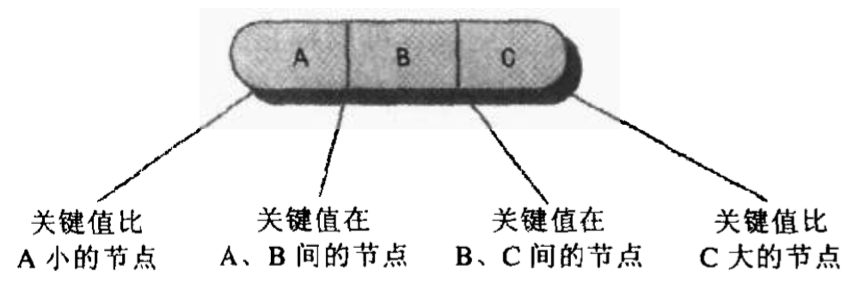

## 1.1 插入

- 如果2-3-4树中已存在当前插入的key，则插入失败，否则最终一定是在叶子节点中进行插入操作
- 如果待插入的节点不是4-节点，那么直接在该节点插入
- 如果待插入的节点是个4-节点，那么应该先分裂该节点然后再插入。一个4-节点可以分裂成一个根节点和两个子节点（这三个节点各含一个key）然后在子节点中插入，我们把分裂形成的根节点中的key看成向上层插入的key，然后重复第2步和第3步。

如果是在4-节点中进行插入，每次插入会多出一个分支，如果插入操作导致根节点分裂，则2-3-4树会生长一层。

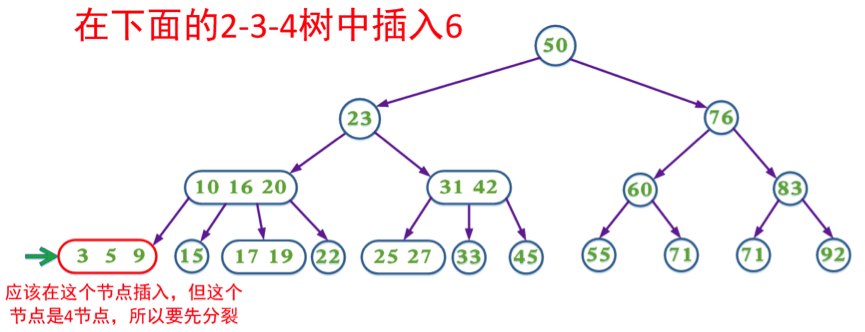 

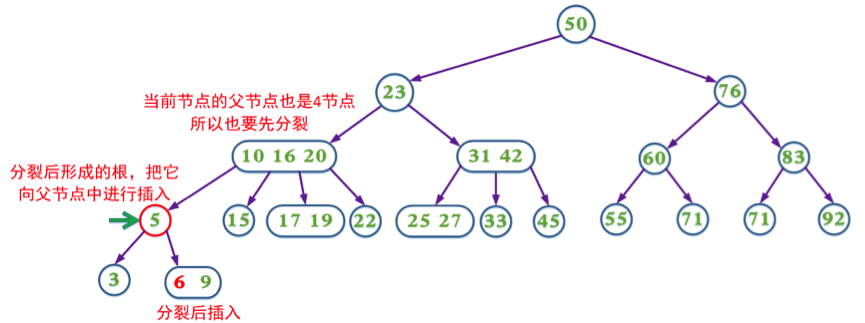

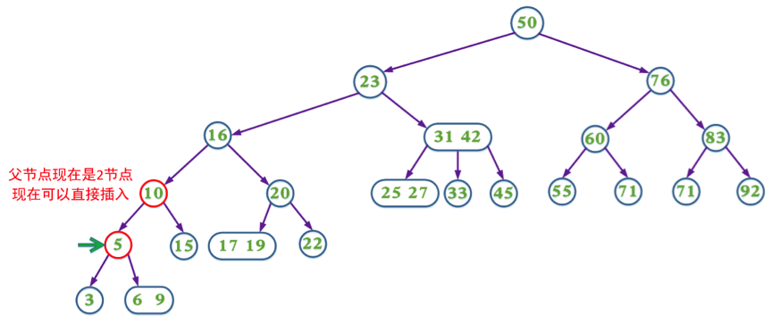

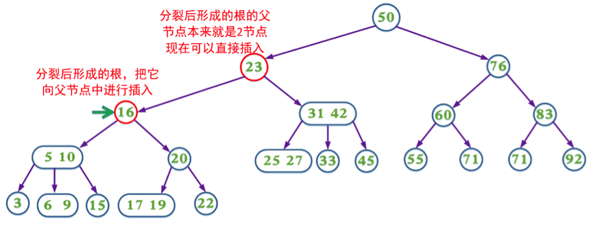

##  1.2 带预分裂的插入

上面的插入操作在某些情况需要不断回溯来调整树的结构以达到平衡。为了消除回溯过程，在插入操作过程中我们可以采取预分裂的操作，即我们在插入的搜索路径中，遇到4-节点就分裂（分裂后形成的根节点的key要上移，与父节点中的key合并）这样可以保证找到需要插入节点时可以直接插入（即该节点一定不是4节点）。

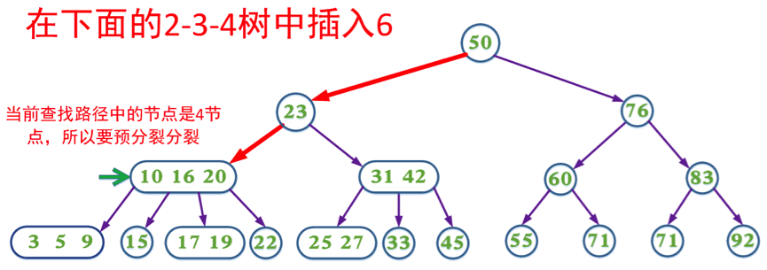 

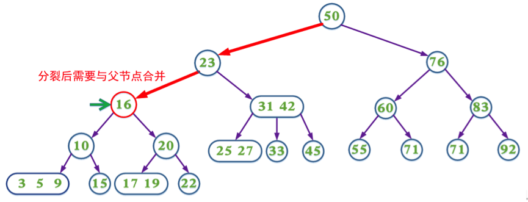 

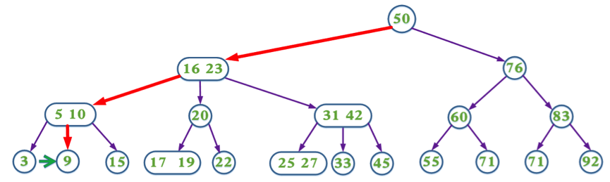

## 1.3 删除

- 如果2-3-4树中不存在当前需要删除的key，则删除失败。
- 如果当前需要删除的key不位于叶子节点上，则用后继key覆盖，然后在它后继key所在的子支中删除该后继key。
- 如果当前需要删除的key位于叶子节点上:
  - 该节点不是2-节点，删除key，结束
  - 该节点是2-节点，删除该节点：
    - 如果兄弟节点不是2-节点，则父节点中的key下移到该节点，兄弟节点中的一个key上移
    - 如果兄弟节点是2-节点，父节点是个3-节点或4-节点，父节点中的key与兄弟节点合并
    - 如果兄弟节点是2-节点，父节点是个2-节点，父节点中的key与兄弟节点中的key合并，形成一个3-节点，把此节点看成当前节点（此节点实际上是下一层的节点），重复步骤3.2.1到3.2.3

如果是在2节点（叶子节点）中进行删除，每次删除会减少一个分支，如果删除操作导致根节点参与合并，则2-3-4树会降低一层。

 

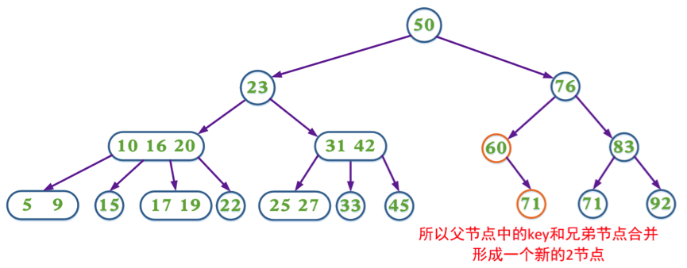 

## 1.4 带有预合并的删除

在删除过程中，我们同样可以采取预合并的操作，即我们在删除的搜索路径中（除根节点，因为根节点没有兄弟节点和父节点），遇到当前节点是2节点，如果兄弟节点也是2节点就合并（该节点的父节点中的key下移，与自身和兄弟节点合并）；如果兄弟节点不是2节点，则父节点的key下移，兄弟节点中的key上移。这样可以保证，找到需要删除的key所在的节点时可以直接删除（即要删除的key所在的节点一定不是2节点）。

 

 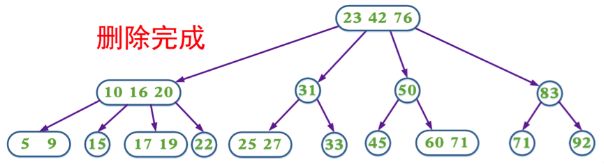

# 2、2-3树

2-3树也是一种多叉树，与2-3-4树类似，现在在很多应用程序中还在应用，一些用于2-3树的技术会在B-树中应用。

2-3树比2-3-4树少一个数据项和一个子节点。节点可以保存1个或者2个数据项，可以有0个、1个、2个或者3个子节点。其它方面，父节点和子节点的关键字值的排列顺序和2-3-4树是一样的。

不同的是， 2-3树节点分裂是自底向上的(不能进行预分裂)，而且2-3树节点分裂必须用到新数据项。

## 2.1 插入

- 如果2-3树中已存在当前插入的key，则插入失败，否则最终一定是在叶子节点中进行插入操作。
- 如果待插入的节点只有1个key，则直接插入即可。
- 如果待插入的节点有2个key，则对节点进行分裂，即2个key加上待插入的key，这3个key分裂成1个key跟两个子节点，然后将分裂之后的3个key中的父节点看作向上层插入的key，然后重复第2步、第3步，直到满足2-3树的定义性质。

  

## 2.2 删除

2-3树有4种节点：

- 仅1个key的叶子节点
- 有 2个key的叶子节点
- 仅1个key的非叶子节点
- 有2个key的非叶子节点

即 1个key与2个key的节点 和 是否为叶子节点 的组合。下面就从简单到复杂的情况开始分析：
1. 当删除的节点是2个key的叶子节点，则将要删除的目标key删除即可，此时原来待删除的2个key的叶子节点，变成1个key的叶子节点，但是符合2-3树；

2. 当删除的节点是2个key的非叶子节点，则此时使用中序遍历找到待删除节点的后继节点，然后将后继节点与待删除节点位置互换，此时就将问题转化为删除节点为叶子节点（平衡树的非叶子节点中序遍历后继节点肯定是叶子节点），如果该叶子是2个key，则跟情况1一样，如果该节点是只有1个key，则跟后面的情况4一样；

3. 当删除的节点是1个key的非叶子节点，实际上操作跟情况（2）是一样的，即使用中序遍历找到待删除节点的后继节点，然后将后继节点与待删除节点位置互换，此时问题转化为删除节点为叶子节点；

4. 当删除的节点是1个key的叶子节点，则将节点删除，此时树肯定不满足2-3树的性质，也即肯定需要调整，但要分情况来进行调整，而总结起来就是当前待删除节点的兄弟节点与父节点，分别是1个key还是2个key，即：

  1)当父节点是1个key（即此时仅有一个兄弟节点），兄弟节点是2个key，则将兄弟节点的一个key上移成父节点，而父节点下移成子节点，也即跟2个key中插入新节点类似，拆成一父两子，此时树满足2-3树，完成调整。

  2)当父节点是1个key，兄弟节点也是1个key，则此时将父节点与兄弟节点合并，将合并后的节点看成当前节点，然后重复4的判断，即判断合并后的当前节点的兄弟节点与父节点的情况，然后走对应的1)、2）、3）处理，直到满足2-3树，完成调整。

  3)当父节点是2个key，即此时有两个兄弟节点，而兄弟节点又可能有多种情况，穷举起来有：删除节点的位置左中右3个，以及另外两个兄弟节点是否为1个key或2个key的4种情况，总共3*4=12种。即：

  i.若删除的是左或右节点，且中间节点只有1个key，则此时父节点的一个key下移，与中间节点合并，此时父节点为1个key，两个子节点，树满足2-3树，完成调整；
  ii.若删除的是左或右节点，且中间节点有2个key，则此时父节点的一个key下移，中间节点的一个key上移与父节点合并，此时父节点为2个key，3个子节点，树满足2-3树，完成调整；
  iii.若删除的是中间节点，且右节点只有1个key，则此时父节点的一个key下移，与右节点合并，此时父节点为1个key，两个子节点，树满足2-3树，完成调整；
  iv.若删除的是中间节点，且右节点有2个key，则此时父节点的一个key下移，右节点的一个key上移与父节点合并，此时父节点为2个key，3个子节点，树满足2-3树，完成调整。

综述：i与ii删除左或右节点两种情况，中间节点1个key或2个key两种情况，兄弟节点1个key或2个key两种情况，总共 2x2x2=8 种；删除中间节点一种情况，iii与iv右节点1个key或2个key两种情况，左节点1个或2个key两种情况，总共 1x2x2=4 种； 4+8=12 种全齐，虽然场景有12种，但是处理的方式只有2种，一种是父节点下移与子节点合并，另一种是父节点下移成单独一个子节点，然后2个key的子节点上移一个key与父节点合并。

最简单的删除情况1，待删除的节点是2个key，直接对节点的key “5” 删除即可：

若删除节点是情况2，如下图所示，删除“100”，而且此时“100”是非叶子节点且2个key，则找到后继节点“120”与“100”互换位置，然后删除“100”：

结果如下图所示，将问题转化为删除一个key的叶子节点，且父节点为2个key，即为情况4，删除的节点为右节点，且中间节点为一个key，也即为情况4中3）的1，所以此时需要将父节点的一个key下移与中间节点合并：

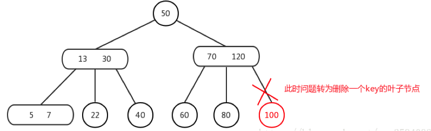

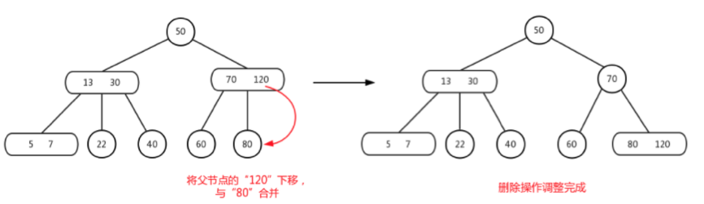

再讲另外一种，情况4中3）的iv，如下图所示，删除节点“22”，而右兄弟节点是2个key，则需要将父节点的“30”下移成中间节点，然后右兄弟的一个key“40”上移与父节点合并：

 

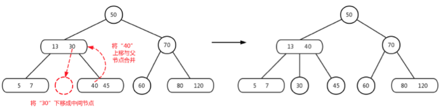

最后再讲一种节点删除的情况，就是满二叉树的情况，根据定义的性质，满二叉树也符合2-3树，如果当满二叉树要删除叶子节点时，是符合情况4中的2）的，即将父节点与兄弟节点合并，此时树的层数显然不平衡，即，将合并后的节点看作被删除的当前节点，而当前节点的兄弟节点与父节点依然是都是一个key，符合情况4的2），将父节点与兄弟节点合并，直至树平衡。

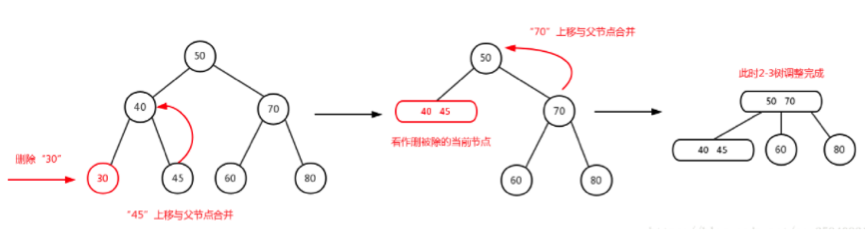

另外，实际上节点删除的情况中2、3是可以整合到一起去处理的，即，删除节点是非叶子节点，无论待删除节点的key数是多少，都用中序排序找到后继节点，然后把问题转化为删除一个key的叶子节点去处理。
对于节点删除中的4的 2）再补充说明一下，如下图删除节点“10”，符合4的 2） 情况，则父节点“13”与兄弟节点“18”合并，：

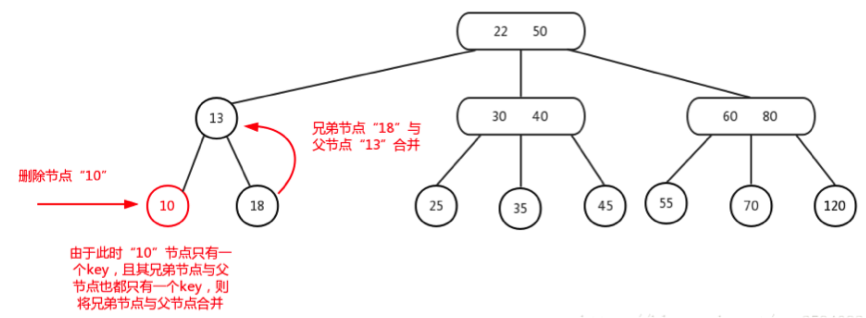

合并之后如下图所示，此时符合4中 3） 的 ii 情况，则父节点的key“22”下移，中间节点的key“30”上移：

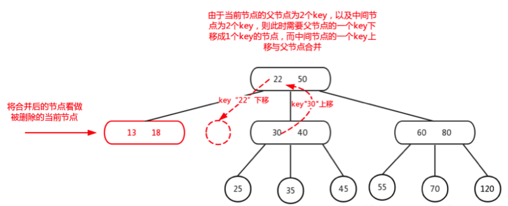

变换结果如下图所示，此时2-3树已经调整完成。这里需要注意的点是，由于之前说父子节点key的上下移对于叶子节点来说并没有子节点，但对于非叶子节点的变换是对应左旋与右旋的，所以上一步的变换，是以节点“22”做左旋操作，由父节点“降级”为子节点，而原本子节点“30”晋升为父节点，并将“30”的左子节点出让给“22”作为右子节点：

