# 排序算法

## 1 排序算法概述

所谓排序，就是使一串记录按其中某个或某些关键字的大小，以递增或递减顺序排列的操作。排序算法是使记录按要求排列的方法。排序算法在许多领域都很重要，尤其适用于大量数据的处理。

> 如果两个记录的关键字相等，且在原始序列中记录 R 位于记录 S 之前，排序后记录 R 仍位于记录 S 之前，则该排序算法是**稳定的**。

稳定排序可以用于多关键字排序：先按次要关键字排序，再按主要关键字稳定排序，次要关键字的顺序便能保留下来。基数排序正是如此：先按低位排序，再逐次按高位排序；当高位相同时，低位排序形成的相对顺序不会改变。

排序算法按是否需要访问外存可分为**内部排序**和**外部排序**。

内部排序是指待排序序列能够完全存放在内存中时进行的排序过程，适用于规模受内存容量限制的序列。

外部排序用于待排序记录无法一次全部装入内存的大文件，需要在内存与外部存储器之间多次交换数据，才能完成整个文件的排序。

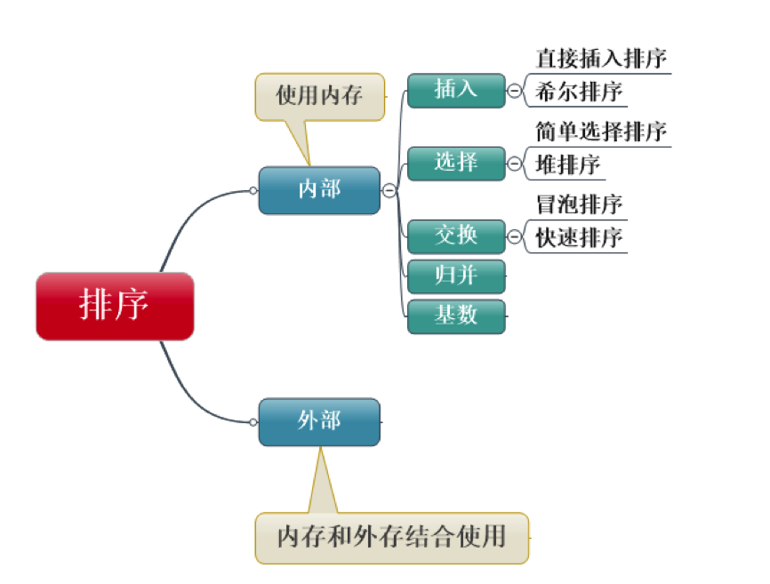

我们现在要讨论的排序都是内部排序。

## 2 冒泡排序

冒泡排序的效率很低，但是算法实现起来很简单，因此很适合作为研究排序的入门算法。

### 2.1 基本思想

对当前尚未排好序的范围，自左向右依次比较相邻的两个数；若它们的顺序与排序要求相反，就交换位置。每次遍历都会将当前范围内的最大值移动到待排序数组的末尾，下一次遍历无需再处理该元素。

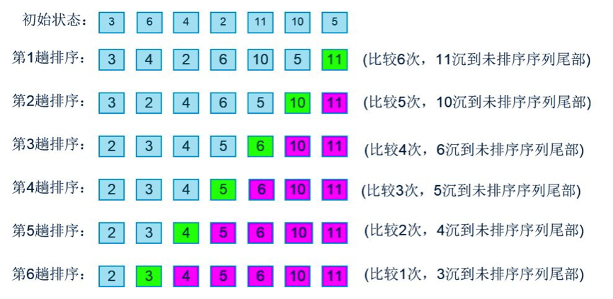

### 2.2 实例

```java
public class Sort {

	private int[] array;

	public Sort(int[] array) {
		this.array = array;
	}

	// 按顺序打印数组中的元素
	public void display() {
		for (int i = 0; i < array.length; i++) {
			System.out.print(array[i] + "\t");
		}
		System.out.println();
	}

	// 冒泡排序
	public void bubbleSort() {
		int temp;
		int len = array.length;

		for (int i = 0; i < len - 1; i++) { // 外层循环：每循环一次就确定了一个相对最大元素
			for (int j = 1; j < len - i; j++) { // 内层循环：有i个元素已经排好，根据i确定本次的比较次数
				if (array[j - 1] > array[j]) { // 如果前一位大于后一位，交换位置
					temp = array[j - 1];
					array[j - 1] = array[j];
					array[j] = temp;
				}
			}
			System.out.print("第" + (i + 1) + "轮排序结果：");
			display();
		}
	}

}
```

测试代码：

```java
	public static void main(String[] args) {
		int [] a = {1,5,4,11,2,20,18};
		Sort sort = new Sort(a);
		System.out.print("未排序时的结果：");
		sort.display();
		sort.bubbleSort();

	}
```

打印结果：

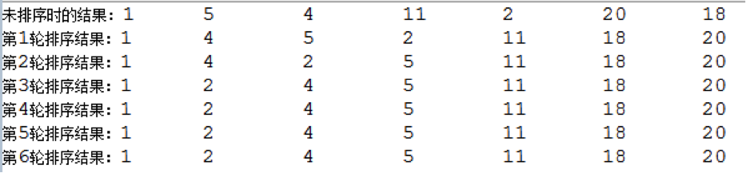

### 2.3 算法分析

上面的例子中，待排序数组共有 7 个数。第一轮进行 6 次比较，第二轮进行 5 次比较，依次类推，最后一轮进行 1 次比较。

假设元素总数为 `N`，则比较次数为：

`(N - 1) + (N - 2) + ... + 1 = N * (N - 1) / 2`

因此，算法大约进行 `N^2 / 2` 次比较。只有当前一个元素大于后一个元素时才会交换，交换次数不超过比较次数；对于随机数据，平均大约有一半比较会发生交换，即约为 `N^2 / 4` 次。最坏情况下，初始数据为逆序，每次比较都需要交换。

比较和交换的操作次数都与 `N^2` 成正比。根据大 O 表示法忽略常数项，冒泡排序的时间复杂度为 `O(N^2)`。

`O(N^2)` 的时间复杂度在数据量较大时效率较低，因此传统冒泡排序通常不用于性能敏感的实际应用。

### 2.4 冒泡排序的改进

上面已经分析过，冒泡排序的效率比较低，所以我们要通过各种方法改进。

最简单的改进方法是加入一标志性变量exchange，用于标志某一趟排序过程中是否有数据交换，如果进行某一趟排序时并没有进行数据交换，则说明数据已经按要求排列好，可立即结束排序，避免不必要的比较过程。

在上例中，第四轮排序之后实际上整个数组已经是有序的了，最后两轮的比较没必要进行。

改进后的代码如下：

```java
	public void bubbleSort_improvement_1() {
		int temp;
		int len = array.length;

		for (int i = 0; i < len - 1; i++) {
			boolean exchange = false; // 设置交换变量
			for (int j = 1; j < len - i; j++) {
				if (array[j - 1] > array[j]) { // 如果前一位大于后一位，交换位置
					temp = array[j - 1];
					array[j - 1] = array[j];
					array[j] = temp;

					exchange = true; // 发生了交换操作
				}
			}
			System.out.print("第" + (i + 1) + "轮排序结果：");
			display();
			if (!exchange)
				break; // 如果上一轮没有发生交换数据，证明已经是有序的了，结束排序
		}
	}
```

用同样的初始数组测试，打印结果如下：

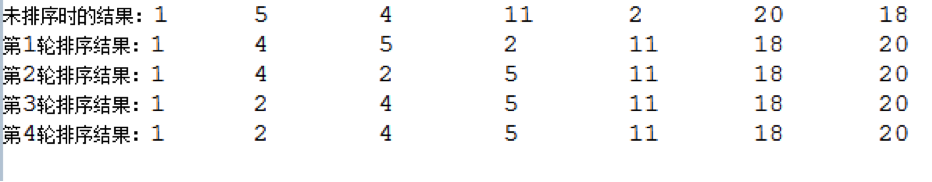

上面的改进方法，是根据上一轮排序是否发生数据交换作为标识。进一步思考：如果上一轮排序中，只有后段的若干元素没有发生数据交换，是否可以判定这一段不用再进行比较？答案是肯定的。

例如上面的例子中，前四轮的排序结果为：

- 未排序时的结果：1	5	4	11	2	20	18
- 第 1 轮排序结果：1	4	5	2	11	18	20
- 第 2 轮排序结果：1	4	2	5	11	18	20
- 第 3 轮排序结果：1	2	4	5	11	18	20
- 第 4 轮排序结果：1	2	4	5	11	18	20

第 1 轮排序后，11、18、20 已经有序；后续几轮中它们的位置并未变化，但按传统冒泡排序，18 仍会在第 2 轮参与比较，11 仍会在第 2、3 轮参与比较，这些比较并无必要。

可以进一步改进：设置一个 `pos` 指针，记录上一轮最后一次交换的位置。`pos` 之后的元素在上一轮中均未交换，下一轮不必再比较。

代码改动如下：

```java
	public void bubbleSort_improvement_2() {
		int temp;
		int counter = 1;
		int endPoint = array.length - 1; // endPoint代表最后一个需要比较的元素下标

		while (endPoint > 0) {
			int pos = 1;
			for (int j = 1; j <= endPoint; j++) {
				if (array[j - 1] > array[j]) { // 如果前一位大于后一位，交换位置
					temp = array[j - 1];
					array[j - 1] = array[j];
					array[j] = temp;

					pos = j; // 下标为j的元素与下标为j-1的元素发生了数据交换
				}
			}
			endPoint = pos - 1; // 下一轮排序时只对下标小于pos的元素排序，下标大于等于pos的元素已经排好

			System.out.print("第" + counter + "轮排序结果：");
			display();
		}
	}
```

对于算法来说，没有最好，只有更适合特定场景的实现。前两种改进能减少部分无效比较；下面介绍一种在每轮中同时确定最大值和最小值的双向冒泡方法。

传统的冒泡算法每次排序只确定最大值。双向冒泡在每轮中分别正向和反向冒泡，确定最大值和最小值，因此可将排序轮数减少约一半。

改进代码如下：

```java
	public void bubbleSort_improvement_3() {
		int temp;
		int low = 0;
		int high = array.length - 1;
		int counter = 1;
		while (low < high) {

			for (int i = low; i < high; ++i) { // 正向冒泡，确定最大值
				if (array[i] > array[i + 1]) { // 如果前一位大于后一位，交换位置
					temp = array[i];
					array[i] = array[i + 1];
					array[i + 1] = temp;
				}
			}
			--high;

			for (int j = high; j > low; --j) { // 反向冒泡，确定最小值
				if (array[j] < array[j - 1]) { // 如果前一位大于后一位，交换位置
					temp = array[j];
					array[j] = array[j - 1];
					array[j - 1] = temp;
				}
			}
			++low;

			System.out.print("第" + counter + "轮排序结果：");
			display();
			counter++;
		}
	}
```

这种双向冒泡也称为**鸡尾酒排序**。它在每轮中同时确定一个最大值和一个最小值，对尾部存在极小值等特定数据分布可能更有效；但其最坏和平均时间复杂度仍为 `O(N^2)`，并未改变算法的渐近复杂度级别。

## 3 选择排序

### 3.1 基本思想

冒泡排序在比较相邻元素时，可能让同一个元素经历多次交换，才能到达最终位置。选择排序通过减少交换次数改善这一点。

选择排序从第一个元素开始扫描整个待排序数组，找到最小元素后再与第一个元素交换；接着从第二个元素开始，继续寻找剩余元素中的最小值并交换，依此类推。


### 3.2 实例

```java
	public void selectionSort() {
		int minPoint; // 存储最小元素的下标
		int len = array.length;
		int temp;
		int counter = 1;

		for (int i = 0; i < len - 1; i++) {

			minPoint = i;
			for (int j = i + 1; j <= len - 1; j++) { // 每完成一轮排序，就确定了一个相对最小元素，下一轮排序只对后面的元素排序
				if (array[j] < array[minPoint]) { // 如果待排数组中的某个元素比当前元素小，minPoint指向该元素的下标
					minPoint = j;
				}
			}

			if (minPoint != i) { // 如果发现了更小的元素，交换位置
				temp = array[i];
				array[i] = array[minPoint];
				array[minPoint] = temp;
			}

			System.out.print("第" + counter + "轮排序结果：");
			display();
			counter++;
		}
	}
```

### 3.3 算法分析

选择排序与冒泡排序一样，需要进行 `N * (N - 1) / 2` 次比较，但至多进行 `N - 1` 次交换。尽管交换次数较少，比较次数仍为二次量级，因此其时间复杂度为 `O(N^2)`。

选择排序与冒泡排序的时间复杂度同属二次量级。若交换操作的代价显著高于比较，选择排序因交换次数较少可能更合适；否则不能仅凭交换次数断定它一定更快。

### 3.4 选择排序的改进

传统的选择排序每次只确定最小值，根据改进冒泡算法的经验，我们可以对排序算法进行如下改进：每趟排序确定两个最值——最大值与最小值，这样就可以将排序趟数缩减一半。

改进后的代码如下：

```java
	public void selectionSort_improvement() {
		int minPoint; // 存储最小元素的下标
		int maxPoint; // 存储最大元素的下标
		int len = array.length;
		int temp;
		int counter = 1;

		for (int i = 0; i < len / 2; i++) {

			minPoint = i;
			maxPoint = i;
			for (int j = i + 1; j <= len - 1 - i; j++) { // 每完成一轮排序，就确定了两个最值，下一轮排序时比较范围减少两个元素
				if (array[j] < array[minPoint]) { // 如果待排数组中的某个元素比当前元素小，minPoint指向该元素的下标
					minPoint = j;
					continue;
				} else if (array[j] > array[maxPoint]) { // 如果待排数组中的某个元素比当前元素大，maxPoint指向该元素的下标
					maxPoint = j;
				}
			}

			if (minPoint != i) { // 如果发现了更小的元素，与第一个元素交换位置
				temp = array[i];
				array[i] = array[minPoint];
				array[minPoint] = temp;

				// 原来的第一个元素已经与下标为minPoint的元素交换了位置
				// 如果之前maxPoint指向的是第一个元素，那么需要将maxPoint重新指向array[minPoint]
				// 因为现在array[minPoint]存放的才是之前第一个元素中的数据
				if (maxPoint == i) {
					maxPoint = minPoint;
				}

			}

			if (maxPoint != len - 1 - i) { // 如果发现了更大的元素，与最后一个元素交换位置
				temp = array[len - 1 - i];
				array[len - 1 - i] = array[maxPoint];
				array[maxPoint] = temp;
			}

			System.out.print("第" + counter + "轮排序结果：");
			display();
			counter++;
		}
	}
```

## 4 插入排序

### 4.1 基本思想

对于一组待排序数据，假设前 `n - 1` 个元素已经有序。将第 `n` 个元素插入前面有序序列的合适位置后，前 `n` 个元素也将有序。重复这一过程，直到所有元素有序。

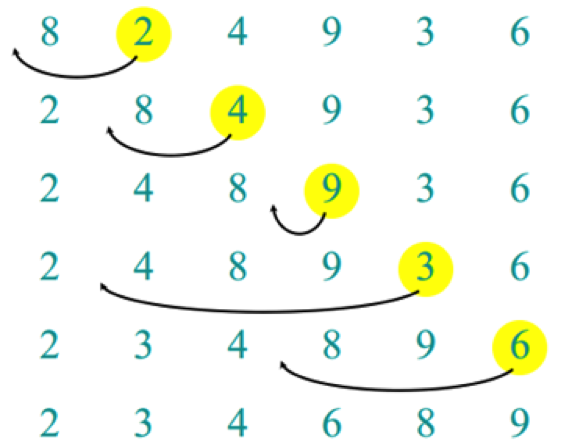

### 4.2 实例

```java
	public void insertionSort() {

		int len = array.length;
		int counter = 1;

		for (int i = 1; i < len; i++) {

			int temp = array[i]; // 存储待排序的元素值
			int insertPoint = i - 1; // 与待排序元素值作比较的元素的下标

			while (insertPoint >= 0 && array[insertPoint] > temp) { // 当前元素比待排序元素大
				array[insertPoint + 1] = array[insertPoint]; // 当前元素后移一位
				insertPoint--;
			}
			array[insertPoint + 1] = temp; // 找到了插入位置，插入待排序元素

			System.out.print("第" + counter + "轮排序结果：");
			display();
			counter++;
		}
	}
```

### 4.3 算法分析

第 1 趟排序最多比较 1 次，第 2 趟最多比较 2 次，依此类推，最后一趟最多比较 `N - 1` 次。因此，最坏情况下的比较次数为：

`1 + 2 + ... + (N - 1) = N * (N - 1) / 2`

对随机数据，插入位置平均位于有序部分的中间，比较和移动次数均约为 `N^2 / 4`。它们的常数开销与具体实现有关，不能简单地断定比其他简单排序快多少。

插入排序、冒泡排序和选择排序的时间复杂度都为 `O(N^2)`，常被称为**简单排序**或**基本排序**。其中，插入排序和冒泡排序是稳定的；直接选择排序通常不稳定。

待排序数组基本有序时，插入排序所需的比较和移动较少，效率会更高。

### 4.4 插入排序的改进

插入元素前需要确定它在有序部分中的位置。逐个扫描有序部分在数据量较大时较耗时，可以用**二分查找法**缩短定位时间；该方法称为二分插入排序。需要注意，元素移动次数并未因此减少。

改进后的代码如下：

```java
	public void binaryInsertionSort() {

		int len = array.length;
		int counter = 1;

		for (int i = 1; i < len; i++) {

			int temp = array[i]; // 存储待排序的元素值

			if (array[i - 1] > temp) { // 比有序数组的最后一个元素要小

				int insertIndex = binarySearch(0, i - 1, temp); // 获取应插入位置的下标
				for (int j = i; j > insertIndex; j--) { // 将有序数组中，插入点之后的元素后移一位
					array[j] = array[j - 1];
				}

				array[insertIndex] = temp; // 插入待排序元素到正确的位置
			}

			System.out.print("第" + counter + "轮排序结果：");
			// display();
			counter++;
		}
	}

	/**
	 *
	 * - 二分查找法
	 * - @param lowerBound 查找段的最小下标
	 * - @param upperBound 查找段的最大下标
	 * - @param target 目标元素
	 * - @return 目标元素应该插入位置的下标
	 */
	public int binarySearch(int lowerBound, int upperBound, int target) {
		while (lowerBound <= upperBound) {
			int mid = lowerBound + (upperBound - lowerBound) / 2;
			if (array[mid] > target) {
				upperBound = mid - 1;
			} else {
				lowerBound = mid + 1;
			}
		}
		return lowerBound;
	}
```

另一种改进方法称为 2 路插入排序，目的是减少排序过程中移动记录的次数，但需要 `N` 个记录的辅助空间。

其思想是另设一个与原待排序序列 `L` 等长的数组 `D`，先将 `L[0]` 复制给 `D[0]`，并将它视作有序序列中的枢纽元素。之后依次处理 `L` 中的其余元素：大于等于枢纽元素的记录插入右侧序列，小于枢纽元素的记录插入左侧序列。

该算法将辅助数组视为首尾相接的环形结构。

示意图如下：


排序完成后，数组中的元素不一定按下标升序排列，而是由 `first` 和 `last` 指针确定有序序列的起止位置。

注意：当初始枢纽元素恰为最小值时，2 路插入排序难以发挥减少移动次数的优势，效果会接近二分插入排序。

当待插入元素位于当前有序序列的中间范围时，仍需移动较多元素；并且该算法需要 `O(N)` 的辅助空间。因此，它在实际工程中较少直接使用，通常作为插入排序优化思路的理论探讨。

代码如下：

```java
	public void two_wayInsertionSort() {

		int len = array.length;
		int[] newArray = new int[len];
		newArray[0] = array[0]; // 将原数组的第一个元素作为枢纽元素
		int first = 0; // 指向最小元素的指针
		int last = 0; // 指向最大元素的指针

		for (int j = 0; j < newArray.length; j++) { // 打印初始化数组
			System.out.print(newArray[j] + "\t");
		}
		System.out.println();

		for (int i = 1; i < len; i++) {

			if (array[i] >= newArray[last]) { // 大于等于最大元素，直接插入到last后面，不用移动元素
				last++;
				newArray[last] = array[i];
			} else if (array[i] < newArray[first]) { // 小于最小元素，直接插到first前面，不用移动元素
				first = (first - 1 + len) % len;
				newArray[first] = array[i];
			} else if (array[i] >= newArray[0]) { // 在最大值与最小值之间，且大于等于枢纽元素，插入到last之前，需要移动元素
				int curIndex = last;
				last++;
				do { // 比array[i]大的元素后移一位
					newArray[curIndex + 1] = newArray[curIndex];
					curIndex--;
				} while (newArray[curIndex] > array[i]);

				newArray[curIndex + 1] = array[i]; // 插入到正确的位置
			} else { // 在最大值与最小值之间，且小于枢纽元素，插入到first之后，需要移动元素
				int curIndex = first;
				first = (first - 1 + len) % len;
				do { // 比array[i]小的元素前移一位
					newArray[curIndex - 1] = newArray[curIndex];
					curIndex = (curIndex + 1 + len) % len;
				} while (newArray[curIndex] <= array[i]);

				newArray[(curIndex - 1 + len) % len] = array[i]; // 插入到正确的位置
			}

			for (int j = 0; j < newArray.length; j++) { // 打印新数组中的元素
				System.out.print(newArray[j] + "\t");
			}
			System.out.println();

		}
	}
```

如果对如下数组进行排序

`8,1,11,12,4,20,7,2,6,15`

打印结果如下：


此时，`first`指向下标为5的元素（1），`last`指向下标为4的元素（20）。

## 5 归并排序

### 5.1 基本思想

分析归并排序之前，先来了解一下**分治算法**。

分治算法的基本思想是将一个规模为 `N` 的问题分解为若干个规模较小、相互独立且与原问题性质相同的子问题。求出子问题的解后，即可合并得到原问题的解。

分治算法的一般步骤：

- 分解，将要解决的问题划分成若干规模较小的同类问题；
- 求解，当子问题划分得足够小时，用较简单的方法解决；
- 合并，按原问题的要求，将子问题的解逐层合并构成原问题的解。

归并排序是分治算法的典型应用。

归并排序先将一个长度为 `N` 的无序数组分解为 `N` 个有序子序列（仅含一个元素的序列视为有序），再两两合并；随后继续将合并后的子序列两两合并，直到得到完整的有序数组。过程如下图所示：


### 5.2 实例

归并排序的核心思想是将两个有序的数组归并到另一个数组中，所以需要开辟额外的空间。

第一步要理清归并的思路。假设现在有两个有序数组A和B，要将两者有序地归并到数组C中。我们用一个实例来推演：


上图中，A数组中有四个元素，B数组中有六个元素，首先比较A、B中的第一个元素，将较小的那个放到C数组的第一位，因为该元素就是A、B所有元素中最小的。上例中，7小于23，所以将7放到了C中。

然后，用23与B中的其他元素比较，如果小于23，继续按顺序放到C中；如果大于23，则将23放入C中。

23放入C中之后，用23之后的47作为基准元素，与B中的其他元素继续比较，重复上面的步骤。

如果有一个数组的元素已经全部复制到C中了，那么将另一个数组中的剩余元素依次插入C中即可。至此结束。

按照上面的思路，用java实现：

```java
	/**
	 *
	 * - 归并arrayA与arrayB到arrayC中
	 *
	 * - @param arrayA 待归并的数组A
	 *
	 * - @param sizeA 数组A的长度
	 *
	 * - @param arrayB 待归并的数组B
	 *
	 * - @param sizeB 数组B的长度
	 *
	 * - @param arrayC 辅助归并排序的数组
	 */
	public static void merge(int[] arrayA, int sizeA, int[] arrayB, int sizeB, int[] arrayC) {

		int i = 0, j = 0, k = 0; // 分别当作arrayA、arrayB、arrayC的下标指针

		while (i < sizeA && j < sizeB) { // 两个数组都不为空
			if (arrayA[i] <= arrayB[j]) { // 相等时优先取左侧元素，以保持稳定性
				arrayC[k++] = arrayA[i++];
			} else {
				arrayC[k++] = arrayB[j++];
			}
		} // 循环结束后，一个数组已完全复制到 arrayC，另一个数组仍有元素

		// 后面的两个while循环用于处理另一个不为空的数组
		while (i < sizeA) {
			arrayC[k++] = arrayA[i++];
		}

		while (j < sizeB) {
			arrayC[k++] = arrayB[j++];
		}

		for (int l = 0; l < arrayC.length; l++) { // 打印新数组中的元素
			System.out.print(arrayC[l] + "\t");
		}
	}
```

示例末尾的打印逻辑仅用于展示归并结果。实际工程中应将 I/O 操作移出排序或合并方法，避免在核心算法中频繁输出而影响性能。

在归并之前，还需要先分解数组，这可以通过递归实现。递归（Recursive）是算法设计中常用的思想。

先递归地分解数组，再逐层合并数组，即可完成归并排序。完整的 Java 代码如下：

```java
public class Sort {

	private int[] array; // 待排序的数组

	public Sort(int[] array) {
		this.array = array;
	}

	// 按顺序打印数组中的元素
	public void display() {
		for (int i = 0; i < array.length; i++) {
			System.out.print(array[i] + "\t");
		}
		System.out.println();
	}

	// 归并排序

	public void mergeSort() {

		int[] workSpace = new int[array.length]; // 用于辅助排序的数组
		recursiveMergeSort(workSpace, 0, workSpace.length - 1);
	}

	/**
	 *
	 * - 递归的归并排序
	 *
	 * - @param workSpace 辅助排序的数组
	 *
	 * - @param lowerBound 欲归并数组段的最小下标
	 *
	 * - @param upperBound 欲归并数组段的最大下标
	 */
	private void recursiveMergeSort(int[] workSpace, int lowerBound, int upperBound) {

		if (lowerBound >= upperBound) { // 该段至多有一个元素，无需排序
			return;
		} else {
			int mid = lowerBound + (upperBound - lowerBound) / 2;
			recursiveMergeSort(workSpace, lowerBound, mid); // 对低位段归并排序
			recursiveMergeSort(workSpace, mid + 1, upperBound); // 对高位段归并排序
			merge(workSpace, lowerBound, mid, upperBound);
			display();
		}
	}

	/**
	 *
	 * - 对数组array中的两段进行合并，lowerBound~mid为低位段，mid+1~upperBound为高位段
	 *
	 * - @param workSpace 辅助归并的数组，容纳归并后的元素
	 *
	 * - @param lowerBound 合并段的起始下标
	 *
	 * - @param mid 合并段的中点下标
	 *
	 * - @param upperBound 合并段的结束下标
	 */
	private void merge(int[] workSpace, int lowerBound, int mid, int upperBound) {

		int lowBegin = lowerBound; // 低位段的起始下标
		int lowEnd = mid; // 低位段的结束下标
		int highBegin = mid + 1; // 高位段的起始下标
		int highEnd = upperBound; // 高位段的结束下标
		int j = 0; // workSpace的下标指针
		int n = upperBound - lowerBound + 1; // 归并的元素总数

		while (lowBegin <= lowEnd && highBegin <= highEnd) {
			if (array[lowBegin] <= array[highBegin]) { // 相等时优先取低位段元素，以保持稳定性
				workSpace[j++] = array[lowBegin++];
			} else {
				workSpace[j++] = array[highBegin++];
			}
		}

		while (lowBegin <= lowEnd) {
			workSpace[j++] = array[lowBegin++];
		}

		while (highBegin <= highEnd) {
			workSpace[j++] = array[highBegin++];
		}

		for (j = 0; j < n; j++) { // 将归并好的元素复制到array中
			array[lowerBound++] = workSpace[j];
		}

	}
}

```

用以下代码测试：

```java
int [] a = {6,2,7,4,8,1,5,3};
Sort sort = new Sort(a);
sort.mergeSort();
```

打印结果如下：


归并的顺序如下：先将初始数组分为两部分，先处理低位段，再处理高位段；每一段继续分解为更小的低位段和高位段，直到每段只包含一个元素，然后自底向上合并。

上例中，第 1 步归并 6 与 2，第 2 步归并 7 与 4，第 3 步归并前两步得到的有序子段 `[2, 6]` 与 `[4, 7]`。至此，数组左半部分（低位段）归并完毕。

接着，第 4 步归并 8 与 1，第 5 步归并 5 与 3，第 6 步归并前两步得到的有序子段 `[1, 8]` 与 `[3, 5]`。至此，数组右半部分（高位段）归并完毕。

最后第 7 步归并左半部分 `[2, 4, 6, 7]` 与右半部分 `[1, 3, 5, 8]`，归并排序结束。

### 5.3 递归

前文按轮次描述了归并排序：先归并所有相邻元素，再进行下一轮归并。递归程序的实际执行顺序则是先完成左半部分的递归与合并，再完成右半部分，最后合并两半；两种描述的合并结果相同，但执行顺序不同。

下面结合代码与图例详细分析递归归并排序的过程。

虚拟机栈（VM Stack）是描述 Java 方法执行的内存模型。每次方法调用都伴随一次压栈和出栈操作。

我们要排序的数组为：

`int [] a = {6,2,7,4,8,1,5,3}`

当`main()`方法调用`mergeSort()`方法时，被调用的方法被压入栈中，然后程序进入`mergeSort()`方法：

```java
	public void mergeSort() {
		int[] workSpace = new int[array.length]; // 用于辅助排序的数组
		recursiveMergeSort(workSpace, 0, workSpace.length - 1);
	}
```

此时，mergeSort()又调用了recursiveMergeSort(workSpace,0,7)方法，recursiveMergeSort(workSpace,0,7)方法也被压入栈中，在mergeSort()之上。

然后，程序进入到`recursiveMergeSort(workSpace,0,7)`方法：

```java
if (lowerBound >= upperBound) { // 该段至多有一个元素，无需排序
    return;
} else {
    int mid = lowerBound + (upperBound - lowerBound) / 2;
    recursiveMergeSort(workSpace, lowerBound, mid); // 对低位段归并排序
    recursiveMergeSort(workSpace, mid + 1, upperBound); // 对高位段归并排序
    merge(workSpace, lowerBound, mid, upperBound);
    display();
}
```

`lowerBound` 的参数值为 0，`upperBound` 的参数值为 7，不满足 `lowerBound >= upperBound`，因此方法进入 `else` 分支，并调用 `recursiveMergeSort(workSpace, 0, 3)`。该方法被压入栈中，此时栈的状态如下：

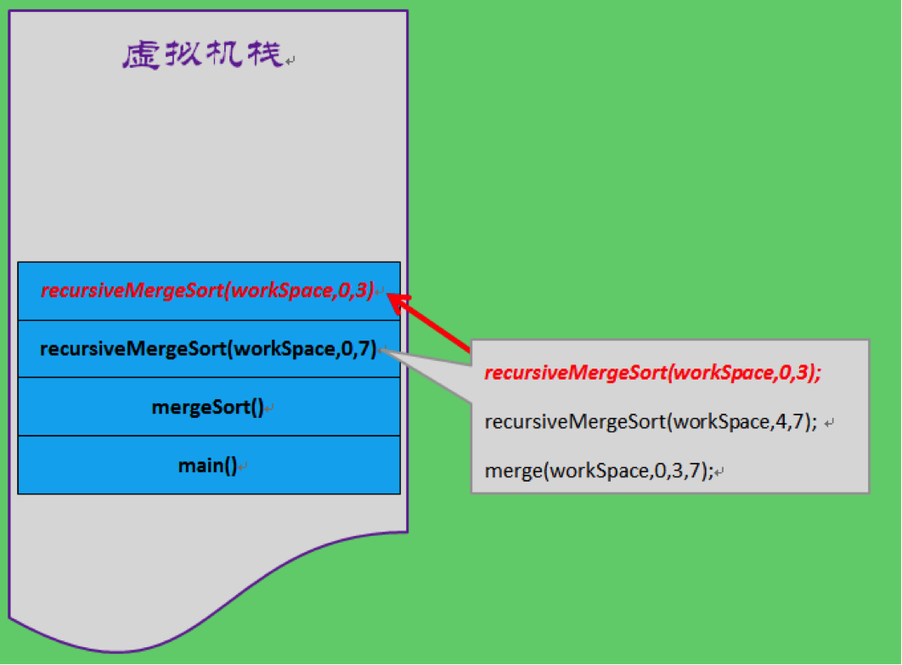

然而，`recursiveMergeSort(workSpace,0,3)`不能立即返回，它在内部又会调用`recursiveMergeSort(workSpace,0,1)`，`recursiveMergeSort(workSpace,0,1)`又调用了`recursiveMergeSort(workSpace,0,0)`，此时，栈中的状态如下：


程序运行到这里，终于有一个方法可以返回了结果了——`recursiveMergeSort(workSpace,0,0)`，该方法的执行的逻辑是对数组中的下标从0到0的元素进行归并，该段只有一个元素，所以不用归并，立即return。

方法一旦return，就意味着方法结束，`recursiveMergeSort(workSpace,0,0)`从栈中弹出。这时候，程序跳到了代码片段（二）中的第二行：`recursiveMergeSort(workSpace,1,1)`，该方法入栈，`recursiveMergeSort(workSpace,0,0)`类似，不用归并，直接返回，方法出栈。

这时，程序跳到代码片段（二）的第三行：`merge(workSpace, 0, 0, 1)`，即合并数组的前两个元素（该 `merge` 调用同样会入栈和出栈）。

至此，代码片段（二）执行完毕，`recursiveMergeSort(workSpace, 0, 1)` 出栈。程序随后执行代码片段（三）的第二行 `recursiveMergeSort(workSpace, 2, 3)`；该方法对第 3、4 个元素进行归并，执行过程与 `recursiveMergeSort(workSpace, 0, 1)` 类似。

然后，程序执行代码片段（三）的第三行 `merge(workSpace, 0, 1, 3)`，将前面已经排好序的两个子序列（第 1、2 个元素为一组，第 3、4 个元素为一组）合并。

然后`recursiveMergeSort(workSpace,0,3)`出栈，程序跳到代码片段（四）的第二行：`recursiveMergeSort(workSpace,4,7)`，对数组的右半部分的四个元素进行归并排序，伴随着一系列的入栈、出栈，最后将后四个元素排好。此时，数组的左半部分与右半部分已经有序。

然后程序跳到代码片段（四）第三行：`merge(workSpace,0,3,7)`，对数组的左半部分与右半部分合并。

然后 `recursiveMergeSort(workSpace, 4, 7)`、`mergeSort()` 依次出栈，最后 `main()` 方法出栈，程序结束。

### 5.4 算法分析

先分析复制次数。

如果待排序数组有 8 个元素，归并排序需要 3 层合并：第一层有 4 个包含 2 个数据项的子数组，第二层有 2 个包含 4 个数据项的子数组，第三层有 1 个包含 8 个数据项的子数组。合并时，每一层中的所有元素都需要复制到 `workSpace`，共复制 `3 * 8 = 24` 次，即合并层数乘以元素总数。

设元素总数为 `N`，合并层数约为 `log2 N`，从原数组复制到辅助数组的次数为 `N * log2 N`。每轮还要从辅助数组复制回原数组，因此总复制次数约为 `2 * N * log2 N`。

大 O 表示法忽略常数项，所以归并排序的时间复杂度为 `O(N log N)`。比较和复制的次数均处于这一量级；具体运行时间还取决于元素复制与比较的实际成本。

下面我们再来分析一下比较次数。

在归并排序中，比较次数总是比复制次数少一些。现在给定两个各有四个元素的子数组，首先来看一下最坏情况和最好情况下的比较次数为多少。

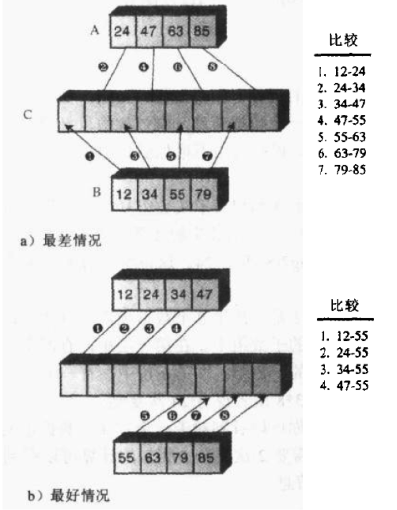

第一种情况，数据项大小交错，所以必须进行7次比较，第二种情况中，一个数组比另一个数组中的所有元素都要小，因此只需要4次比较。

当归并两个子数组时，如果元素总数为N，则最好情况下的比较次数为N/2，最坏情况下的比较次数为N-1。

假设待排序数组的元素总数为 `N`。第一层需要 `N / 2` 次归并，每次归并 2 个元素；第二层需要 `N / 4` 次归并，每次归并 4 个元素；依此类推，最后一层只归并 1 次，共归并 `N` 个元素。总层数约为 `log2 N`。

最好情况下的比较总数为：

`N / 2 * (2 / 2) + N / 4 * (4 / 2) + ... + 1 * (N / 2) = N / 2 * log2 N`

最坏情况下的比较总数为：

`N / 2 * (2 - 1) + N / 4 * (4 - 1) + ... + 1 * (N - 1) < N * log2 N`

可见，比较次数介于 `N / 2 * log2 N` 与 `N * log2 N` 之间，时间复杂度仍为 `O(N log N)`。

## 6 快速排序

### 6.1 基本思想

快速排序同样基于分治算法，步骤如下：

- 选择一个基准元素，通常选择第一个元素或最后一个元素；
- 通过一趟划分将待排序记录分为两部分：一部分元素值不大于基准元素，另一部分元素值不小于基准元素；
- 此时基准元素位于其最终有序位置；
- 分别对两部分记录递归地执行相同操作，直到整个序列有序。

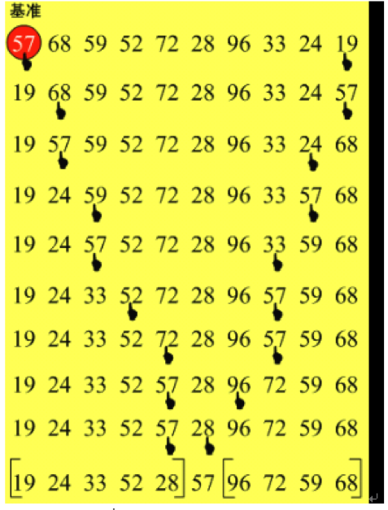

上图中，演示的是第一轮快速排序的过程，首先将第一个元素选为基准点，从右端第一个元素开始扫描，找到第一个比57小的元素（19）时停止，两者交换位置，然后从左端开始扫描，找到第一个比57大的元素（68）时停止，两者交换位置，周而复始，直到57找不到可交换的元素为止，至此一轮快速排序结束。

这时，比57小的元素都在左边，比57大的元素都在右边，分别对两边的数组段继续进行快速排序，依次类推，最终使整个数组有序。

### 6.2 实例

```java
	public void quickSort() {
		recursiveQuickSort(0, array.length - 1);
	}

	/**
	 *
	 * - 递归的快速排序
	 *
	 * - @param low 数组的最小下标
	 * - @param high 数组的最大下标
	 */
	private void recursiveQuickSort(int low, int high) {
		if (low >= high) {
			return;
		} else {
			int pivot = array[low]; // 以第一个元素为基准
			int partition = partition(low, high, pivot);
            // 对数组进行划分，比pivot小的元素在低位段，比pivot大的元素在高位段

			display();

			recursiveQuickSort(low, partition - 1); // 对划分后的低位段进行快速排序
			recursiveQuickSort(partition + 1, high); // 对划分后的高位段进行快速排序
		}
	}

	/**
	 *
	 * - 以pivot为基准对下标low到high的数组进行划分
	 *
	 * - @param low 数组段的最小下标
	 *
	 * - @param high 数组段的最大下标
	 *
	 * - @param pivot 划分的基准元素
	 *
	 * - @return 划分完成后基准元素所在位置的下标
	 */
	private int partition(int low, int high, int pivot) {

		while (low < high) {

			while (low < high && array[high] >= pivot) {
                // 从右端开始扫描，定位到第一个比pivot小的元素
				high--;
			}
			swap(low, high);

			while (low < high && array[low] <= pivot) {
                // 从左端开始扫描，定位到第一个比pivot大的元素
				low++;
			}
			swap(low, high);

		}
		return low;

	}

	/**
	 *
	 * - 交换数组中两个元素的数据
	 - @param low 欲交换元素的低位下标
	 - @param high 欲交换元素的高位下标
	 */
	private void swap(int low, int high) {
		int temp = array[high];
		array[high] = array[low];
		array[low] = temp;
	}
```

### 6.3 算法分析

快速排序和归并排序都使用分治思想，但两者的复杂度特性不同。快速排序在划分较均衡时，平均（或期望）时间复杂度为 `O(N log N)`；若每次划分都极不均衡，则会退化为 `O(N^2)`。

理想情况下，基准元素将序列划分为规模接近的两部分。若始终选第一个元素为基准，则对已升序或降序排列的数据，每次可能只排定一个元素，从而出现最坏情况。随机选择基准元素或在首、中、尾三项中选中值，都能降低出现极端划分的概率，但不改变其最坏时间复杂度为 `O(N^2)` 的事实。

选定第一个元素为基准实现简单，但当它是当前子序列的最大值或最小值时，效率会显著降低。折中的方法是取数组第一个、最后一个和中间位置元素三者的中值作为基准，称为“三数取中”（median-of-three）。

工程实践中，Java 的 `Arrays.sort()` 对基本类型数组通常采用双轴快速排序（Dual-Pivot Quicksort），对对象数组采用 TimSort（结合归并排序与插入排序）；具体实现可能随 JDK 版本和调用方式而变化。

## 7 希尔排序

### 7.1 基本思想

希尔排序是对插入排序的改进，又称**缩小增量排序**。

在插入排序中，标记符左边的元素是有序的，右边的是没有排过序的，这个算法取出标记符所指向的数据，存入一个临时变量，接着，在左边有序的数组中找到临时变量应该插入的位置，然后将插入位置之后的元素依次后移一位，最后插入临时变量中的数据。

试想，假如有一个很小的数据项在靠近右端的位置上，把这个数据项插入到有序数组中时，将会有大量的中间数据项需要右移一位，这个步骤对每一个数据项都执行了将近N次复制。虽然不是所有数据项都必须移动N个位置，但是，数据项平均移动了N/2个位置，一共N个元素，总共是N2/2次复制，这实际上是一个很耗时的过程，希尔排序就是对这一步骤进行了改进，不必一个个的移动所有中间数据项，就能把较小的数据项移动到左边，大大提高了排序效率。

希尔排序通过加大插入排序时元素之间的间隔，并对这些间隔的元素进行插入排序，从而使数据能大跨度地移动。数据项之间的间隔被称为**增量**，习惯上还用h表示。

下图表示的是增量为4时对10个数据项进行第一轮希尔排序的过程：

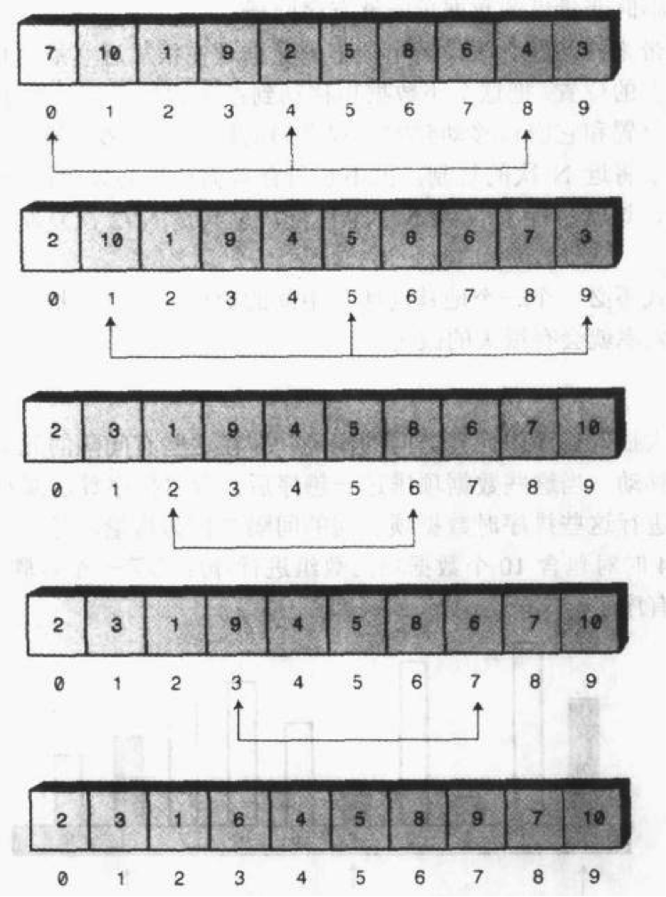

此时，数据已经基本有序，所有元素离它在最终有序序列中的位置相差都不超过2个单元，通过创建这种交错的内部有序的数据项集合，把完成排序所需的工作量降到了最小，这也是希尔排序的精髓所在。

### 7.2 增量算法

在用java实现希尔排序之前，还有一个问题需要弄清楚，就是这个增量该怎么选择？

最简单的做法是第一轮间隔取 `N / 2`，之后不断减半。但是，这种间隔序列的性能较差，在某些输入下可能退化到 `O(N^2)`，并不一定比直接插入排序更好。

增量序列必须以 1 结束，才能保证最后一轮成为完整的插入排序。增量之间互质不是普适的充分条件；不同增量序列会带来不同的理论界与实际表现。

生成增量序列的方法有很多，下面的 Java 代码使用 Donald Knuth 提出的序列：从 1 开始，按递推式 `h = 3 * h + 1` 生成后续间隔。

例如，对 1 000 个数据项排序时，该序列为：

`1, 4, 13, 40, 121, 364, 1093, 3280, ...`

1093 已超过待排序元素总数，因此第一轮应取间隔 364，之后依次取 121、40、13、4、1。

### 7.3 实例

```java
	public void shellSort() {

		int len = array.length;
		int counter = 1;

		int h = 1;
		while (h < len / 3) { // 确定第一轮排序时的间隔
			h = 3 * h + 1;
		}

		while (h > 0) {
			for (int i = 0; i < h; i++) {
				shellInsertSort(i, h); // 对间隔为h的元素进行插入排序
			}

			h = (h - 1) / 3; // 下一轮排序的间隔

			System.out.print("第" + counter + "轮排序结果：");
			display();
			counter++;
		}

	}

	/**
	 *
	 * - 希尔排序内部使用的插入排序:
	 *
	 * -  需要进行插入排序的元素为array[beginIndex]、array[beginIndex+increment]、array[beginIndex+2*increment]...
	 *
	 * - @param beginIndex 起始下标
	 *
	 * - @param increment 增量
	 */
	private void shellInsertSort(int beginIndex, int increment) {

		int targetIndex = beginIndex + increment; // 欲插入元素的下标

		while (targetIndex < array.length) {
			int temp = array[targetIndex];

			int previousIndex = targetIndex - increment; // 前一个元素下标，间隔为increment
			while (previousIndex >= 0 && array[previousIndex] > temp) {
				array[previousIndex + increment] = array[previousIndex]; // 比欲插入数据项大的元素后移一位
				previousIndex = previousIndex - increment;
			}
			array[previousIndex + increment] = temp; // 插入到合适的位置

			targetIndex = targetIndex + increment; // 插入下一个元素
		}

	}
```

### 7.4 算法分析

希尔排序通常比简单排序更高效，且实现相对容易；但它的性能高度依赖增量序列与输入数据，不能笼统地与 `O(N log N)` 或 `O(N^2)` 的算法作绝对比较。

希尔排序没有对所有增量序列都适用的统一时间复杂度。对本节使用的 Knuth 增量序列，常见分析给出的最坏时间复杂度为 `O(N^(3 / 2))`；实际运行表现仍取决于数据分布和具体实现。

## 8 堆排序

### 8.1 基本思想

堆排序是一种**树形选择排序**，是对直接选择排序的改进。

首先，我们来看看什么是堆（heap）：

- 堆中某个节点的值总是不大于或不小于其父节点的值；
- 堆总是一棵**完全二叉树**（Complete Binary Tree）。

完全二叉树是由**满二叉树**（Full Binary Tree）而引出来的。

> 除最后一层无任何子节点外，每一层上的所有结点都有两个子结点的二叉树称为**满二叉树**。
>
> 如果除最后一层外，每一层上的节点数均达到最大值；在最后一层上只缺少右边的若干结点，这样的二叉树被称为**完全二叉树**。

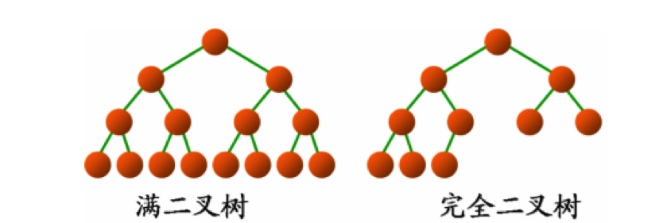

一棵完全二叉树，如果某个节点的值总是不大于其父节点的值，则根节点的关键字是所有节点关键字中最小的，称为**小根堆**（小顶堆）；如果某个节点的值总是不小于其父节点的值，则根节点的关键字是所有节点关键字中最大的，称为**大根堆**（大顶堆）。

从根节点开始，按照每层从左到右的顺序对堆的节点进行编号：

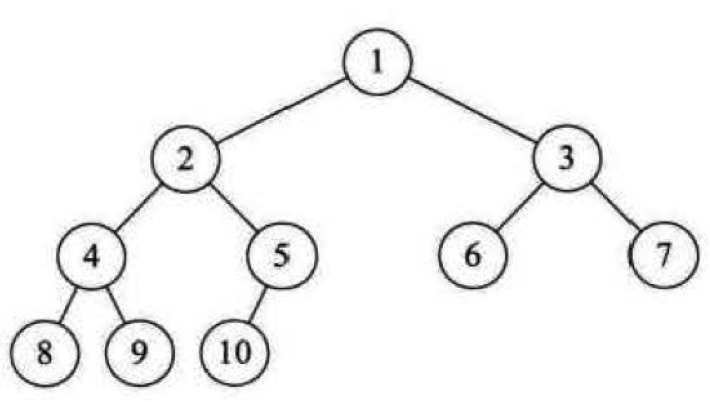

可以发现，如果某个节点的编号为i，则它的子节点的编号分别为：2i、2i+1。据此，推出堆的数学定义：
具有n个元素的序列（k1,k2,...,kn)，当且仅当满足

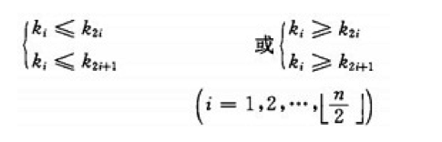

时称之为堆。

需要注意的是，**堆只对父子节点做了约束，并没有对兄弟节点做任何约束，左子节点与右子节点没有必然的大小关系**。

如果用数组存储堆中的数据，逻辑结构与存储结构如下：

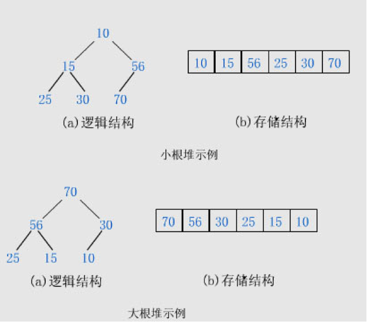

初始时，将待排序的 `N` 个元素视为顺序存储的完全二叉树，并调整为堆。取出堆顶元素即可得到当前最小值或最大值；再将堆中最后一个元素移到堆顶，对剩余元素重新调整为堆。重复这一过程，直到所有元素形成有序序列，这就是堆排序。

### 8.2 堆的构建

写代码之前，我们要解决一个问题：如何将一个不是堆的完全二叉树调整为堆。

例如我们要将这样一个无序序列：

`49，38，65，97，76，13，27，49`

建成堆，将它直接映射成二叉树，结果如下图的(a)：

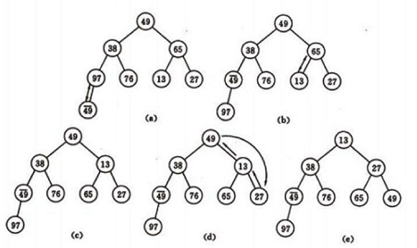

(a)是一个完全二叉树，但不是堆。我们将它调整为小顶堆。

堆有一个性质是：**堆的每个子树也是堆**。

调整的核心思想就是让树的每棵子树都成为堆，以某节点与它的左子节点、右子节点为操作单位，将三者中最小的元素置于子树的根上。

(a)中最后一个元素是49，在树中的序号为8，对应的数组下标则为7，它的父节点对应的数组下标为3（如果一个元素对应的存储数组的下标为i，则它的父节点对应的存储数组的下标为(i-1)/2），49小于97，所以两者交换位置。

此时，以第三层元素为根节点的所有子树都已是堆了，下一步继续调整以第二层元素为根节点的子树。

先调整以65为根的子树，再调整以38为根的子树（满足堆的要求，实际上不用调整）。

然后调整以第一层元素为根的子树，即以49为根，以38为左子节点，以13为右子节点的子树，交换13与49的位置。
一旦交换位置，就有可能影响本来已经是堆的子树。13与49交换位置之后，破坏了右子树，将焦点转移到49上面来，继续调整以它为根节点的子树。如果此次调整又影响了下一层的子树，继续调整，直至叶子节点。

以上就是由数组建堆的过程。

### 8.3 实例

堆建好之后开始排序，堆顶就是最小值，取出放入数组中的最后一个位置，将堆底（数组中的最后一个元素）放入堆顶。这一操作会破坏堆，需要将前n-1个元素调整成堆。

然后再取出堆顶，放入数组的倒数第二个位置，堆底（数组中的倒数第二个元素）放入堆顶，再将前n-2个元素调整成堆。

按照上面的思路循环操作，最终就会将数组中的元素按降序的顺序排列完毕。

如果想要升序排列，利用大顶堆进行类似的操作即可。下面的java实现就是使用大顶堆完成的。

```java
	// 堆排序
	public void heapSort() {

		buildHeap();
		System.out.println("建堆：");
		printTree(array.length);

		int lastIndex = array.length - 1;
		while (lastIndex > 0) {
			swap(0, lastIndex);
            // 取出堆顶元素，将堆底放入堆顶。其实就是交换下标为0与lastIndex的数据
			if (--lastIndex == 0)
				break; // 只有一个元素时就不用调整堆了，排序结束
			adjustHeap(0, lastIndex); // 调整堆

			System.out.println("调整堆：");
			printTree(lastIndex + 1);
		}

	}

	/**
	 *
	 * - 用数组中的元素建堆
	 */
	private void buildHeap() {
		int lastIndex = array.length - 1;
		for (int i = (lastIndex - 1) / 2; i >= 0; i--) {
            // (lastIndex-1)/2就是最后一个元素的根节点的下标，依次调整每棵子树
			adjustHeap(i, lastIndex); // 调整以下标i的元素为根的子树
			// System.out.println("调整以下标"+i+"的元素为根的子树：");
			// printTree(lastIndex+1);

		}
	}

	/**
	 *
	 * - 调整以下标是rootIndex的元素为根的子树
	 *
	 * - @param rootIndex 根的下标
	 *
	 * - @param lastIndex 堆中最后一个元素的下标
	 */
	private void adjustHeap(int rootIndex, int lastIndex) {

		int biggerIndex = rootIndex;
		int leftChildIndex = 2 * rootIndex + 1;
		int rightChildIndex = 2 * rootIndex + 2;

		if (rightChildIndex <= lastIndex) { // 存在右子节点，则必存在左子节点

			if (array[rootIndex] < array[leftChildIndex] || array[rootIndex] < array[rightChildIndex]) { // 子节点中存在比根更大的元素
				biggerIndex = array[leftChildIndex] < array[rightChildIndex] ? rightChildIndex : leftChildIndex;
			}

		} else if (leftChildIndex <= lastIndex) { // 只存在左子节点

			if (array[leftChildIndex] > array[rootIndex]) { // 左子节点更大
				biggerIndex = leftChildIndex;
			}
		}

		if (biggerIndex != rootIndex) { // 找到了比根更大的子节点

			swap(rootIndex, biggerIndex);

			// 交换位置后可能会破坏子树，将焦点转向交换了位置的子节点，调整以它为根的子树
			adjustHeap(biggerIndex, lastIndex);
		}
	}

	/**
	 *
	 * - 将数组按照完全二叉树的形式打印出来
	 */
	private void printTree(int len) {

		// int len = array.length;
		int layers = (int) Math.floor(Math.log((double) len) / Math.log((double) 2)) + 1; // 树的层数
		int maxWidth = (int) Math.pow(2, layers) - 1; // 树的最大宽度
		int endSpacing = maxWidth;
		int spacing;
		int numberOfThisLayer;
		for (int i = 1; i <= layers; i++) { // 从第一层开始，逐层打印
			endSpacing = endSpacing / 2; // 每层打印之前需要打印的空格数
			spacing = 2 * endSpacing + 1; // 元素之间应该打印的空格数
			numberOfThisLayer = (int) Math.pow(2, i - 1); // 该层要打印的元素总数

			int j;
			for (j = 0; j < endSpacing; j++) {
				System.out.print("  ");
			}

			int beginIndex = (int) Math.pow(2, i - 1) - 1; // 该层第一个元素对应的数组下标
			for (j = 1; j <= numberOfThisLayer; j++) {
				System.out.print(array[beginIndex++] + " ");
				for (int k = 0; k < spacing; k++) { // 打印元素之间的空格
					System.out.print("  ");
				}
				if (beginIndex == len) { // 已打印到最后一个元素
					break;
				}
			}

			System.out.println();
		}
		System.out.println();
	}
```

用以下代码测试：

```java
	int [] a = {7,1,9,2,5,10,6,4,3,8};
	Sort sort = new Sort(a);

	System.out.println("未排序时：");
	sort.display();
	System.out.println();

	sort.heapSort();
	System.out.println("排序完成：");
	sort.display();
```

打印结果如下：

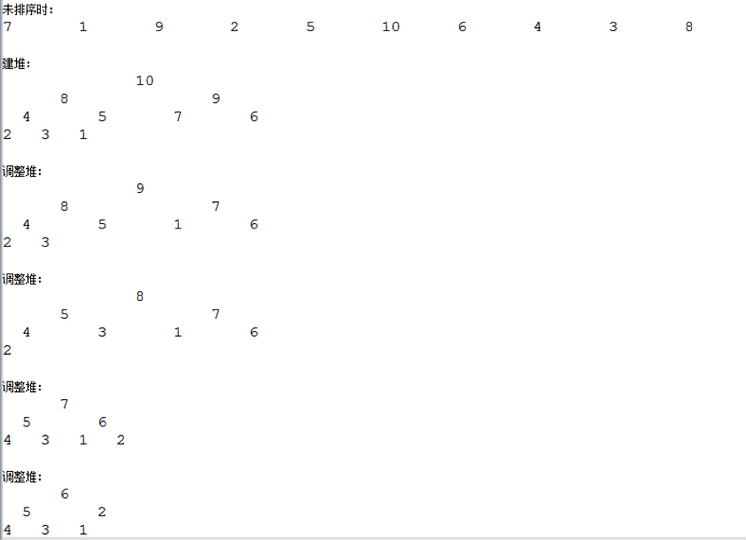

### 8.4 算法分析

它的运行时间主要是消耗在初始构建堆和在重建堆时的反复筛选上。

构建堆时，从最后一个非叶子节点向根节点依次执行下沉调整。每个节点下沉的最大高度不同，越靠近叶子节点可下沉的高度越小；把所有节点的下沉代价相加，建堆时间复杂度为 `O(N)`，而不是因为每个节点都只需常数次比较。

正式排序时，每次取出堆顶并重建堆的时间为 `O(log N)`，共进行约 `N` 次，因此这一阶段的时间复杂度为 `O(N log N)`。

总体而言，堆排序的最好、平均和最坏时间复杂度均为 `O(N log N)`，且对原始数据的有序程度不敏感。这比 `O(N^2)` 的冒泡、直接选择和直接插入排序具有更好的渐近性能。

堆排序只需常数级额外空间，但记录的比较和交换是跳跃式进行的，因此它是不稳定的排序方法。

## 9 基数排序

### 9.1 基本思想

**基数排序**（Radix Sort）是在**桶排序**思想基础上发展而来的算法，两者都属于**分配排序**（Distributive Sort）。分配排序不直接比较关键字，而是通过“**分配**”和“**收集**”过程完成排序。在基数和关键字位数受限时，其时间复杂度可以是线性的。

#### 9.1.1 桶排序

先来看一下桶排序（Bucket Sort）。

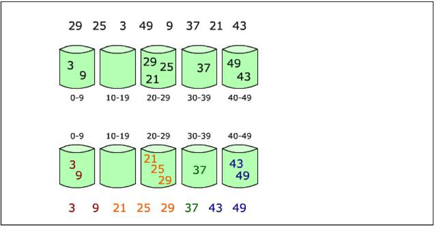

桶排序也称为箱排序（Bin Sort）。其基本思想是设置若干个桶，依次扫描待排序记录 `R[0]、R[1]、...、R[n - 1]`，将关键字落在同一范围内的记录放入对应的桶（分配），再按桶编号顺序收集各桶中的记录。

例如，要将一副混洗的 52 张扑克牌按点数 `A < 2 < ... < J < Q < K` 排序，需要设置 13 个桶。依次将每张牌按点数放入相应的桶，再按桶顺序连接，即可得到按点数递增排列的一副牌。

桶的数量取决于关键字的取值范围，因此关键字范围必须能够划分为有限个桶。每个桶包含的记录数通常无法预知，常使用链表或动态数组保存桶内记录。为保证稳定性，分配与收集都必须保持先进先出顺序。

设桶数为 `m`，分配过程时间为 `O(n)`，收集过程为 `O(m + n)`，因此总时间为 `O(n + m)`。只有当 `m` 的数量级不超过 `n` 时，桶排序才可视为线性时间排序。

桶排序需要额外的桶空间；例如，待排序值的范围为 `0` 至 `m - 1` 时，需要至少 `m` 个桶。因此，它适用于关键字范围相对有限、数据分布适合分桶的场景。

#### 9.1.2 基数排序

基数排序将多位关键字拆成若干位，并对每一位反复执行稳定的分配与收集。它的主要作用是让有限基数的多位关键字无需直接比较即可排序，而不必然比所有比较排序更快。

仍以扑克牌为例。一张牌可由花色和面值两个关键字组成，花色顺序设为“梅花 < 方块 < 红心 < 黑桃”，面值顺序设为“`A < 2 < ... < J < Q < K`”。若花色为主要关键字、面值为次要关键字，则花色不同的两张牌按花色比较；花色相同时再按面值比较。这属于**多关键字排序**。

可采用两种方法：

- 方法 1：先按花色分为梅花、方块、红心、黑桃四组，再在每组内按面值排序，最后依次连接各组。这是最高位优先的思路。
- 方法 2：先按面值稳定分配到 13 组，再按花色稳定分配到 4 组，最后按花色顺序收集。由于每次分配均稳定，最终同一花色内仍保持面值顺序。这是最低位优先的思路。

多关键字排序按处理方向分为两种方法：

**最高位优先**（Most Significant Digit first，MSD）：

- 先按 `k1` 分组，使同一组记录的关键字 `k1` 相等；
- 再对每组按 `k2` 分成子组，并继续处理后续关键字，直到最次位 `kd`；
- 依次连接各组，得到有序序列。

**最低位优先**（Least Significant Digit first，LSD）：

- 先从最次位 `kd` 开始稳定排序，再依次对 `kd - 1`、`kd - 2` 等更高位稳定排序，直至最高位 `k1`；
- 最后收集各组，即得到有序序列。

数字或字符型的单关键字也可看作由多个数位或字符组成的多关键字。每个数位或字符的可能取值数量称为基数；例如扑克牌的花色基数为 4，面值基数为 13。无论采用 MSD 还是 LSD，分配与收集过程都必须保持稳定性。

基数排序的思想就是将待排数据中的每组关键字依次进行桶分配。比如下面的待排序列：

`135、242、192、93、345、11、24、19`

将每个数的个位、十位、百位视为三个关键字。例如：

`135 -> k1（个位）= 5，k2（十位）= 3，k3（百位）= 1`

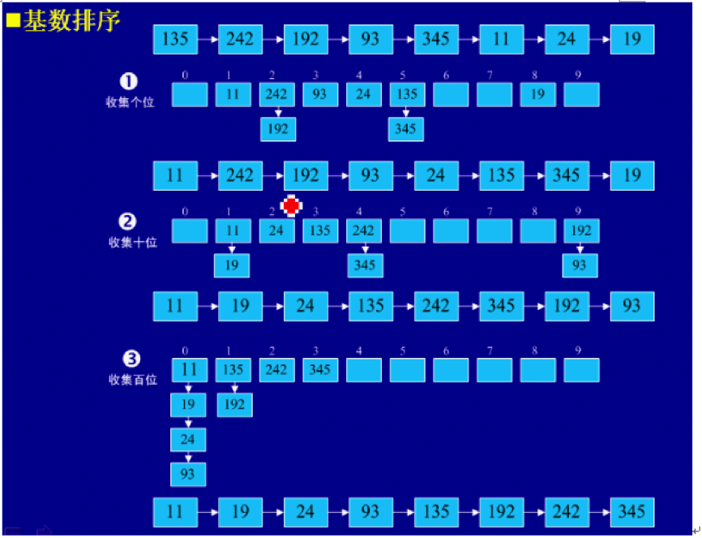

从最低位的个位开始（即从最次关键字开始），对所有数据的 `k1` 进行稳定分配。十进制数字取值为 0 至 9，因此需要 10 个桶。收集后得到以下序列：

`11、242、192、93、24、135、345、19`

再按 `k2`（十位）稳定分配并收集，得到：

`11、19、24、135、242、345、192、93`

最后按 `k3`（百位）稳定分配并收集，得到：

`11、19、24、93、135、192、242、345`

排序完毕。

### 9.2 实例

```java
	public void radixSort() {
		if (array.length < 2) {
			return;
		}

		int max = 0;
		for (int value : array) {
			if (value < 0) {
				throw new IllegalArgumentException("radixSort 仅支持非负整数");
			}
			max = Math.max(max, value);
		}

		List<ArrayList<Integer>> buckets = new ArrayList<ArrayList<Integer>>();
		for (int i = 0; i < 10; i++) { // 十进制的每一位可能为 0 至 9
			buckets.add(new ArrayList<Integer>());
		}

		int divisor = 1;
		int pass = 1;
		while (max / divisor > 0) { // 由最低位到最高位依次分配
			for (int value : array) {
				int key = value / divisor % 10;
				buckets.get(key).add(value);
			}

			int counter = 0;
			for (ArrayList<Integer> bucket : buckets) {
				for (int value : bucket) {
					array[counter++] = value;
				}
				bucket.clear();
			}

			System.out.print("第" + pass + "轮排序：");
			display();
			pass++;

			if (divisor > max / 10) { // 避免位权乘以 10 时溢出
				break;
			}
			divisor *= 10;
		}
	}
```

打印结果如下：

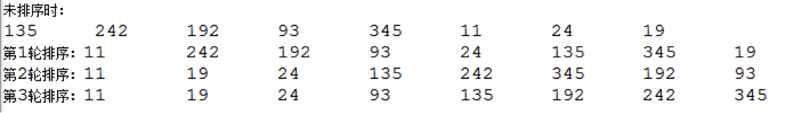

### 9.3 算法分析

基数排序的每一轮都会将全部数据分配到桶中，再按桶顺序收集回数组。若有 `n` 个数据项、关键字长度为 `d`、每一位的基数为 `r`，则时间复杂度为 `O(d * (n + r))`，额外空间复杂度为 `O(n + r)`。

当 `d` 和 `r` 都是常数时，基数排序为 `O(n)`；例如固定宽度的非负整数可以视为 `d` 有上界。数据项数量增加并不必然导致关键字位数增加；只有在特定的输入范围假设下，`d` 才可能随 `n` 增长，从而得到不同的复杂度结论。

## 10 排序算法总结

### 10.1 稳定性与复杂度

八大排序算法的稳定性及复杂度总结如下：

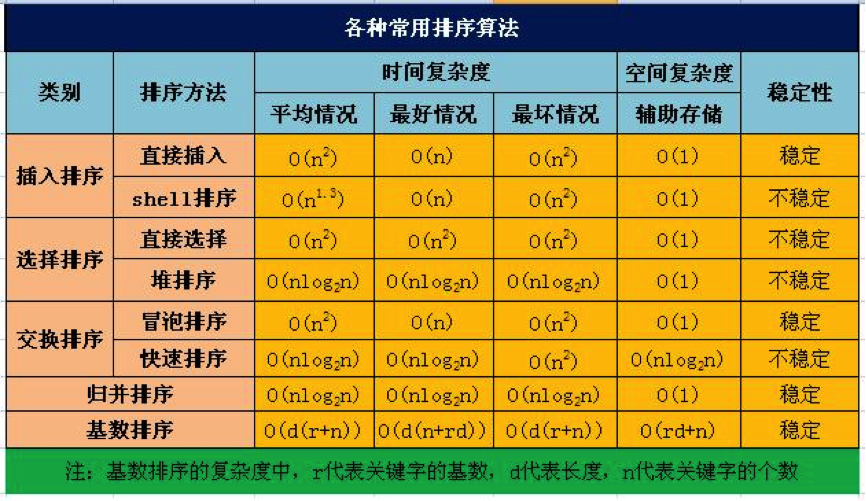

### 10.2 选择排序算法准则

每种排序算法都有适用场景。实际选择时，除了平均时间复杂度，还应考虑最坏时间复杂度、额外空间、稳定性、待排序数据量、关键字结构与分布，以及实现和维护成本。

设待排序元素个数为 `N`，通常可按以下原则选择：

- 当 `N` 较大且需要原地排序时，可考虑快速排序或堆排序。快速排序平均时间复杂度为 `O(N log N)`，通常实践性能良好，但最坏情况为 `O(N^2)`；堆排序的最坏时间复杂度为 `O(N log N)`，但不稳定。
- 当 `N` 较大、内存允许且要求稳定性时，可使用归并排序；它的时间复杂度稳定为 `O(N log N)`，但需要 `O(N)` 的额外空间。
- 当 `N` 较小或原始序列已基本有序时，直接插入排序通常较合适，因为比较和移动次数较少。
- 直接选择排序适合记录移动成本很高且不要求稳定性的场景；它对原始序列是否有序并不敏感。
- 传统冒泡排序通常仅适合教学或极小规模数据；加入提前结束标志后，对已接近有序的数据可减少比较。
- 当关键字可拆分为有限位、基数与位数适合控制时，可使用稳定的基数排序。若包含负数，需要额外处理符号或映射关系。

在工程实践中，常见标准库会采用混合排序策略，以兼顾平均性能、最坏情况和稳定性要求。
