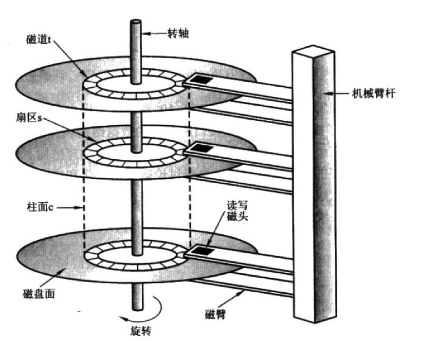
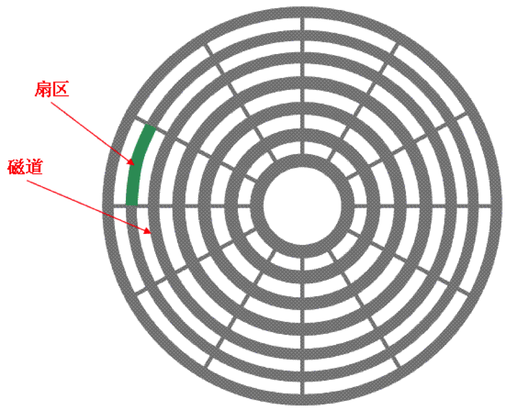
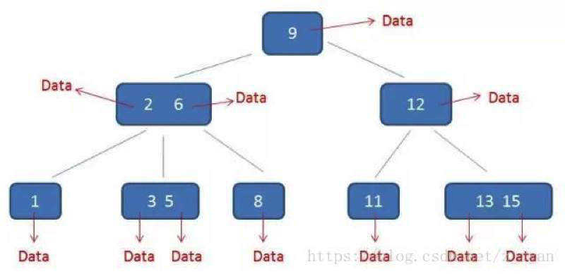
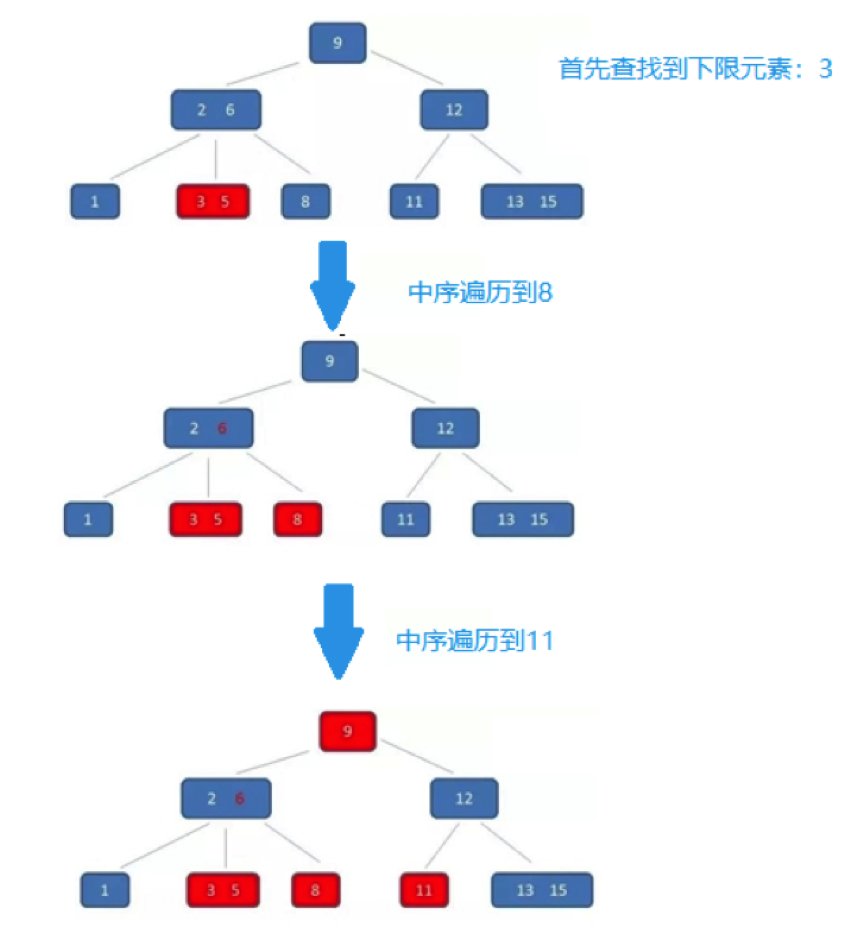
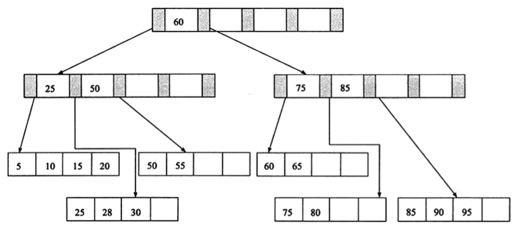
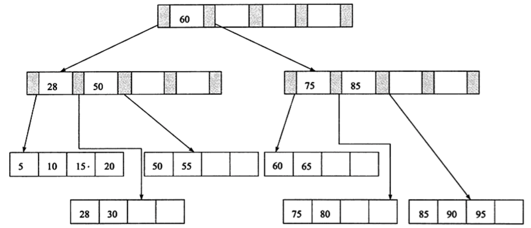

# 1、应用背景

二叉查找树、AVL树、红黑树等都属于二叉树的范围，查找的时间复杂度是`O(log 2N)`，与树的深度相关，那么降低树的深度自然会提高查找效率。

但是我们面对这样一个实际问题：大规模数据存储中，树节点存储的元素数量是有限的（如果元素数量非常多的话，查找就退化成节点内部的线性查找了），这样导致二叉查找树结构由于树的深度过大而造成磁盘I/O读写过于频繁，进而导致查询效率低下。

因此，为**了减少磁盘I/O的次数，必须降低树的深度**，将“瘦高”的树变得“矮胖”。一个基本的想法就是： 

- 每个节点存储多个元素 
- 摒弃二叉树结构，采用多叉树

这样就引出来了一个新的查找树结构 ——**多路查找树**。根据AVL树给我们的启发，一颗平衡多路查找树可以使得数据的查找效率保证在O(logN)这样的对数级别上。

## 1.1 机械硬盘结构

为什么树的深度会与磁盘I/O相关呢？这要从硬件层面来说明。

机械硬盘的结构图如下：

硬盘中一般会有多个盘片组成，每个盘片包含两个面，每个盘面都对应地有一个读/写磁头。

每个盘面都被划分为数目相等的磁道，并从外缘的“0”开始编号，具有相同编号的磁道形成一个圆柱，称之为磁盘的柱面。

盘面中一圈圈灰色同心圆为一条条磁道，从圆心向外画直线，可以将磁道划分为若干个弧段，每个磁道上一个弧段被称之为一个扇区。扇区是磁盘的最小组成单元，通常是512字节，不过由于不断提高磁盘的大小，部分厂商设定每个扇区的大小是4096字节。

顺便多说一句，以上图片是老式机械硬盘的示意图，每个磁道的扇区弧长是不一样的。越靠内的磁道密度越大，存储的数据也就越多；越靠外的磁道密度越小，存储的数据也就越少。所以，虽然内外磁道的扇区弧长不一样，由于密度的原因，每个扇区存储的数据量仍然是一样的。然而在新式磁盘中，内外磁道的扇区密度都是相同的，所以新式磁盘每个扇区的弧长都是一样的。

## 1.2 读写原理

当硬盘驱动器执行读写功能时，盘片绕主轴高速旋转，当磁道在磁头下通过时，就可以进行数据的读写了。

系统将文件存储到磁盘上时，按柱面、磁头、扇区的方式进行，即最先是第1磁道的第一磁头（也就是第1盘面的第1磁道）下的所有扇区，然后，是同一柱面的下一磁头，……，一个柱面存储满后就推进到下一个柱面，直到把文件内容全部写入磁盘。

系统也以相同的顺序读出数据。读出数据时通过告诉磁盘控制器要读出扇区所在的柱面号、磁头号和扇区号（物理地址的三个组成部分）进行（目前多是通过LBA线性寻址的方式定位）。

由于存储介质的特性，磁盘本身存取就比主存慢很多，再加上机械运动耗费（磁盘旋转和磁头移动），磁盘的存取速度往往是主存的几百分之一，因此为了提高效率，要尽量减少磁盘I/O。为了达到这个目的，磁盘往往不是严格按需读取，而是每次都会预读，即使只需要一个字节，磁盘也会从这个位置开始，顺序向后读取一定长度的数据放入内存。

预读的长度一般为页（page）的整倍数。页是计算机管理存储器的逻辑块，硬件及操作系统往往将主存和磁盘存储区分割为连续的大小相等的块，每个存储块称为一页（在许多操作系统中，页得大小通常为4k），主存和磁盘以页为单位交换数据。当程序要读取的数据不在主存中时，会触发一个缺页异常，此时系统会向磁盘发出读盘信号，磁盘会找到数据的起始位置并向后连续读取一页或几页载入内存中，然后异常返回，程序继续运行（详情请参考页面置换算法以及虚拟内存）。

## 1.3 响应时间

磁盘读取响应时间有三部分组成：

- **寻道时间**：磁头从开始移动到数据所在磁道所需要的时间，寻道时间越短，I/O操作越快，目前磁盘的平均寻道时间一般在3－15ms，一般都在10ms左右，这部分的时间代价最高
- **旋转延迟**：盘片旋转将请求数据所在扇区移至读写磁头下方所需要的时间，旋转延迟取决于磁盘转速。普通硬盘一般都是7200rpm，慢的5400rpm，因此一般旋转一圈大约8.3ms
- **数据传输时间**：数据通过系统总线传送到内存的时间, 一般传输一个字节大概0.02us

从上面的指标来看，其实最重要的，或者说我们最关心的应该只有两个：寻道时间与旋转延迟。为提高磁盘传输效率，软件层面应着重考虑减少寻道时间和延迟时间。

磁盘读取数据是以盘块(block)为基本单位的。位于同一盘块中的所有数据都能被一次性全部读取出来。而磁盘IO代价主要花费在查找时间寻道时间上。因此我们应该尽量将相关信息存放在同一盘块，同一磁道中。或者至少放在同一柱面或相邻柱面上，以求在读/写信息时尽量减少磁头来回移动的次数，避免过多的寻道时间。

所以，在大规模数据存储方面，大量数据存储在硬盘中，而在硬盘中读取/写入块(block)中某数据时，首先需要定位到磁盘中的某块，如何有效地查找硬盘中的数据，需要一种合理高效的外存数据结构，就是下面所要重点阐述的B树以及相关变种B+树及B*-树。

# 2、B树

**B树**（Balance Tree）由`Rudolf Bayer`, `Edward M. McCreight`于1970发表的一篇论文*《Organization and Maintenance of Large Ordered Indices》*中首次提出。

一棵m阶的B 树的特性如下：

- 根结点至少有两个子女。
- 每个中间节点都包含k-1个元素和k个孩子，其中 m/2 <= k <= m。
- 每一个叶子节点都包含k-1个元素，其中 m/2 <= k <= m。
- 所有的叶子结点都位于同一层。
- 每个节点中的元素从小到大排列，节点当中k-1个元素正好是k个孩子包含的元素的值域分划。

对比前面介绍过的2-3树与2-3-4树，可以发现，其实2-3树就是m=3时的B树，而2-3-4树就是m=4时的B树，两者是B树的特例。

**注意**：切勿简单的认为一棵m阶的B树是m叉树，虽然存在四叉树，八叉树，KD树，以及/R树/R*树/等空间划分树，但与B树完全不等同。

一个3阶B树的示意图如下：

以上图为例，若查询的数值为５： 

- 第一次磁盘I/O：在内存中定位（与17、35比较），比17小，左子树； 
- 第二次磁盘I/O：在内存中定位（与８、12比较），比８小，左子树； 
- 第三次磁盘I/O：在内存中定位（与3、5比较），找到5，终止。 

整个过程中，我们可以看出：比较的次数并不比二叉查找树少，尤其适当某一节点中的数据很多时，但是磁盘IO的次数却是大大减少。比较是在内存中进行的，相比于磁盘IO的速度，比较的耗时几乎可以忽略。所以当树的高度足够低的话，就可以极大的提高效率。相比之下，节点中的元素多点也没关系，仅仅是多了几次内存交互而已，只要不超过磁盘页的大小即可。

对于一颗节点为N，阶为M的子树，查找和插入需要logM-1N ~ logM/2N次比较。这个很好证明，对于阶为M的B树，每一个节点的子节点个数为M/2 到 M-1之间，所以树的高度在logM-1N至logM/2N之间。这种效率是很高的，对于N=62*1000000000个节点，如果度为1024，则logM/2N <=4，即在620亿个元素中，如果这棵树的度为1024，则只需要小于4次即可定位到该节点，然后再采用二分查找即可找到要找的值。

B树的查找、插入等操作对与上一篇中的的2-3树、2-3-4树类似，不再赘述。

# 3、 B+树

B+树是B树的变形，与B树的区别在于：

- 有k个子结点的结点必然有k个关键字。
- 非叶结点仅具有索引作用，跟记录有关的信息均存放在叶结点中。
- 树的所有叶结点构成一个有序链表，可以按照关键码排序的次序遍历全部记录。 

一棵3阶B+树如下所示：

## 3.1 B+树的查找

B+树的优势在于查找效率上，下面具体说明。

首先，Ｂ+树的查找和Ｂ树一样，类似于二叉查找树。起始于根节点，自顶向下遍历树，在节点内部典型的使用是二分查找来确定这个位置。 

不同的是：
（1）、Ｂ+树中间节点没有卫星数据（索引元素所指向的数据记录），只有索引，而Ｂ树每个结点中的每个关键字都有卫星数据；这就意味着同样的大小的磁盘页可以容纳更多节点元素，在相同的数据量下，Ｂ+树更加“矮胖”，I/O操作更少 
B树的卫星数据：

B+树的卫星数据：

需要补充的是，在数据库的聚集索引（Clustered Index）中，叶子节点直接包含卫星数据。在非聚集索引（NonClustered Index）中，叶子节点带有指向卫星数据的指针。 

（2）、其次，因为卫星数据的不同，导致查询过程也不同；Ｂ树的查找只需找到匹配元素即可，最好情况下查找到根节点，最坏情况下查找到叶子结点，所说性能很不稳定，而Ｂ+树每次必须查找到叶子结点，性能稳定。

（3）、在范围查询方面，B+树的优势更加明显。B树的范围查找需要不断依赖中序遍历。首先二分查找到范围下限，在不断通过中序遍历，知道查找到范围的上限即可。整个过程比较耗时。 

而B+树的范围查找则简单了许多。首先通过二分查找，找到范围下限，然后同过叶子结点的链表顺序遍历，直至找到上限即可，整个过程简单许多，效率也比较高。 

例如：同样查找范围[3-11]，两者的查询过程如下： 

B树的查找过程： 

B+树的查找过程：

## 3.2 B+树的插入

先来看一个B+树，其高度为2，每页可存放4条记录：

可以看出，所有记录都在叶节点中，并且是顺序存放的，如果我们从最左边的叶节点开始顺序遍历，可以得到所有键值的顺序排序：5、10、15、20、25、30、50、55、60、65、75、80、85、90。

B+树的插入必须保证插入后叶节点中的记录依然排序，同时需要考虑插入B+树的三种情况，每种情况都可能会导致不同的插入算法，如下表所示：

我们用实例来分析B+树的插入。

（1）插入28这个键值，发现当前Leaf Page和Index Page都没有满，直接插入就可以了。

（2）这次我们再插入一条70这个键值，这时原先的Leaf Page已经满了，但是Index Page还没有满，符合表中的第二种情况，这时插入Leaf Page后的情况为50、55、60、65、70。我们根据中间的值60拆分叶节点。将中间节点放入到Index Page中。

（3）最后我们来插入记录95，这时符合表中的第三种情况，即Leaf Page和Index Page都满了，这时需要做两次拆分。

可以看到，不管怎么变化，B+树总是会保持平衡。但是为了保持平衡，对于新插入的键值可能需要做大量的拆分页（split）操作，而B+树主要用于磁盘，因此页的拆分意味着磁盘的操作，应该在可能的情况下尽量减少页的拆分。因此，B+树提供了旋转（rotation）的功能。

旋转发生在Leaf Page已经满了、但是其左右兄弟节点没有满的情况下。这时B+树并不会急于去做拆分页的操作，而是将记录移到所在页的兄弟节点上。通常情况下，左兄弟被首先检查用来做旋转操作，这时我们插入键值70，其实B+树并不会急于去拆分叶节点，而是做旋转，50，55，55旋转。

可以看到，采用旋转操作使B+树减少了一次页的拆分操作，而这时B+树的高度依然还是2。

## 3.3 B+树的删除

B+树使用**填充因子**（fill factor）来控制树的删除变化，50%是填充因子可设的最小值。B+树的删除操作同样必须保证删除后叶节点中的记录依然排序，同插入一样，B+树的删除操作同样需要考虑如下表所示的三种情况，与插入不同的是，删除根据填充因子的变化来衡量。

（1）首先，删除键值为70的这条记录，该记录符合表中的第一种情况，删除后：

（2）接着我们删除键值为25的记录，也符合表中的第一种情况，但是该值还是Index Page中的值，因此在删除Leaf Page中25的值后，还应将25的右兄弟节点的28更新到Page Index中：

（3）最后我们来看删除键值为60的情况，删除Leaf Page中键值为60的记录后，填充因子小于50%，这时需要做合并操作，同样，在删除Index Page中相关记录后需要做Index Page的合并操作：

# 4、B*树

B*是B+树的变体，在B+树的非根和非叶子结点再增加指向兄弟的指针；
一棵3阶B*树如下所示：

B* 树定义了非叶子结点关键字个数至少为(2/3)*M，即块的最低使用率为2/3。