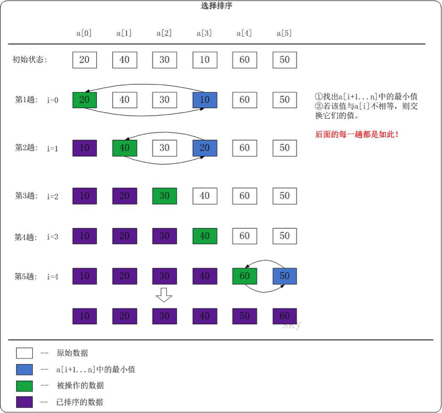

# 1、基本思想

冒泡排序中有一个缺点，比如，我们比较第一个数a1与第二个数a2的时候，只要a1比a2大就会交换位置，但是我们并不能确定a2是最小的元素，假如后面还有比它更小的，该元素还会与a2再次进行交换，而且这种交换有可能发生多次才能确定a2的最终位置。

选择排序可以避免这种耗费时间的交换操作，从第一个元素开始，扫描整个待排数组，找到最小的元素放之后再与第一个元素交换位置，然后再从第二个元素开始，继续寻找最小的元素与第二个元素交换位置，依次类推。

 

# 2、实例

```java
	public void selectionSort() {
		int minPoint; // 存储最小元素的小标
		int len = array.length;
		int temp;
		int counter = 1;

		for (int i = 0; i < len - 1; i++) {

			minPoint = i;
			for (int j = i + 1; j <= len - 1; j++) { // 每完成一轮排序，就确定了一个相对最小元素，下一轮排序只对后面的元素排序
				if (array[j] < array[minPoint]) { // 如果待排数组中的某个元素比当前元素小，minPoint指向该元素的下标
					minPoint = j;
				}
			}

			if (minPoint != i) { // 如果发现了更小的元素，交换位置
				temp = array[i];
				array[i] = array[minPoint];
				array[minPoint] = temp;
			}

			System.out.print("第" + counter + "轮排序结果：");
			display();
			counter++;
		}
	}
```

# 3、算法分析

选择排序与冒泡排序一样，需要进行`N*(N-1)/2`次比较，但是只需要N次交换，当N很大时，交换次数的时间影响力更大，所以选择排序的时间复杂度为`O(N2)`。

虽然选择排序与冒泡排序在时间复杂度属于同一量级，但是毫无疑问选择排序的效率更高，因为它的交换操作次数更少，而且在交换操作比比较操作的时间级大得多时，选择排序的速度是相当快的。

# 4、选择排序的改进

传统的选择排序每次只确定最小值，根据改进冒泡算法的经验，我们可以对排序算法进行如下改进：每趟排序确定两个最值——最大值与最小值，这样就可以将排序趟数缩减一半。

改进后的代码如下：

```java
	public void selectionSort_improvement() {
		int minPoint; // 存储最小元素的小标
		int maxPoint; // 存储最大元素的小标
		int len = array.length;
		int temp;
		int counter = 1;

		for (int i = 0; i < len / 2; i++) {

			minPoint = i;
			maxPoint = i;
			for (int j = i + 1; j <= len - 1 - i; j++) { // 每完成一轮排序，就确定了两个最值，下一轮排序时比较范围减少两个元素
				if (array[j] < array[minPoint]) { // 如果待排数组中的某个元素比当前元素小，minPoint指向该元素的下标
					minPoint = j;
					continue;
				} else if (array[j] > array[maxPoint]) { // 如果待排数组中的某个元素比当前元素大，maxPoint指向该元素的下标
					maxPoint = j;
				}
			}

			if (minPoint != i) { // 如果发现了更小的元素，与第一个元素交换位置
				temp = array[i];
				array[i] = array[minPoint];
				array[minPoint] = temp;

				// 原来的第一个元素已经与下标为minPoint的元素交换了位置
				// 如果之前maxPoint指向的是第一个元素，那么需要将maxPoint重新指向array[minPoint]
				// 因为现在array[minPoint]存放的才是之前第一个元素中的数据
				if (maxPoint == i) {
					maxPoint = minPoint;
				}

			}

			if (maxPoint != len - 1 - i) { // 如果发现了更大的元素，与最后一个元素交换位置
				temp = array[len - 1 - i];
				array[len - 1 - i] = array[maxPoint];
				array[maxPoint] = temp;
			}

			System.out.print("第" + counter + "轮排序结果：");
			display();
			counter++;
		}
	}
```

