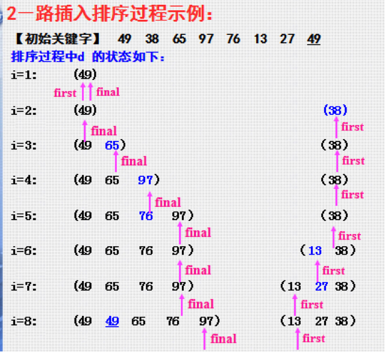
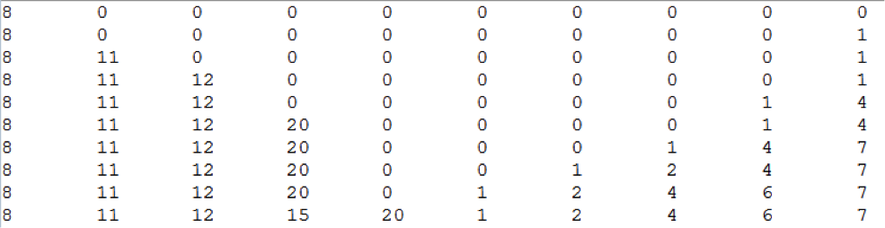

# 1、基本思想

在要排序的一组数中，假设前面(n-1)[n>=2] 个数已经是排好顺序的，现在要把第n个数找到相应位置并插入，使得这n个数也是排好顺序的。如此反复循环，直到全部排好顺序。

 

# 2、实例

```java
	public void insertionSort() {

		int len = array.length;
		int counter = 1;

		for (int i = 1; i < len; i++) {

			int temp = array[i]; // 存储待排序的元素值
			int insertPoint = i - 1; // 与待排序元素值作比较的元素的下标

			while (insertPoint >= 0 && array[insertPoint] > temp) { // 当前元素比待排序元素大
				array[insertPoint + 1] = array[insertPoint]; // 当前元素后移一位
				insertPoint--;
			}
			array[insertPoint + 1] = temp; // 找到了插入位置，插入待排序元素

			System.out.print("第" + counter + "轮排序结果：");
			display();
			counter++;
		}
	}
```

# 3、算法分析

在第一趟排序中，插入排序最多比较一次，第二趟最多比较两次，依次类推，最后一趟最多比较N-1次。因此有：

`1+2+3+...+N-1 = N*N(N-1)/2`

因为在每趟排序发现插入点之前，平均来说，只有全体数据项的一半进行比较，我们除以2得到：

`N*N(N-1)/4`

复制的次数大致等于比较的次数，然而，一次复制与一次比较的时间消耗不同，所以相对于随机数据，这个算法比冒泡排序快一倍，比选择排序略快。

与冒泡排序、选择排序一样，插入排序的时间复杂度仍然为O(N2)，这三者被称为**简单排序**或者**基本排序**，三者都是稳定的排序算法。

如果待排序数组基本有序时，插入排序的效率会更高。

# 4、插入排序的改进

在插入某个元素之前需要先确定该元素在有序数组中的位置，上例的做法是对有序数组中的元素逐个扫描，当数据量比较大的时候，这是一个很耗时间的过程，可以采用**二分查找法**改进，这种排序也被称为二分插入排序。

改进后的代码如下：

```java
	public void BinaryInsertionSort() {

		int len = array.length;
		int counter = 1;

		for (int i = 1; i < len; i++) {

			int temp = array[i]; // 存储待排序的元素值

			if (array[i - 1] > temp) { // 比有序数组的最后一个元素要小

				int insertIndex = binarySearch(0, i - 1, temp); // 获取应插入位置的下标
				for (int j = i; j > insertIndex; j--) { // 将有序数组中，插入点之后的元素后移一位
					array[j] = array[j - 1];
				}

				array[insertIndex] = temp; // 插入待排序元素到正确的位置
			}

			System.out.print("第" + counter + "轮排序结果：");
			// display();
			counter++;
		}
	}

	/**
	 * 
	 * - 二分查找法 
	 * - @param lowerBound 查找段的最小下标 
	 * - @param upperBound 查找段的最大下标 
	 * - @param target 目标元素 
	 * - @return 目标元素应该插入位置的下标
	 */
	public int binarySearch(int lowerBound, int upperBound, int target) {
		int curIndex;
		while (lowerBound < upperBound) {
			curIndex = (lowerBound + upperBound) / 2;
			if (array[curIndex] > target) {
				upperBound = curIndex - 1;
			} else {
				lowerBound = curIndex + 1;
			}
		}
		return lowerBound;
	}
```

还有一种在二分插入排序的基础上进一步改进的排序，称为2-路插入排序，其目的是减少排序过程中移动记录的次数，但为此需要n个记录的辅助空间。

算法的思想为：另设一个和原始待排序列L相同的数组D，首先将L[1]复制给D[1]，并把D[1]看成是已排好序的序列中处于中间位置的元素（枢纽元素），之后将L中的从第二个元素开始依次插入到数组D中，大于D[1]的插入到D[1]之后的序列(此处我称为右半边序列，用的是数组左半部分空间)，小于D[1]的插入到D[1]之前的序列(左半边序列，用的是数组右半部分空间)。

该算法将数组当做首尾衔接的环形结构来使用。

示意图如下：



排序完成之后，数组中的元素并不是按照下标升序排列的，而是靠`first`与`final`指针确定起始元素。

注意：当L[1]为最小值时，2-路插入排序失去它的优越性，等同于二分插入排序。

代码如下：

```java
	public void two_wayInsertionSort() {

		int len = array.length;
		int[] newArray = new int[len];
		newArray[0] = array[0]; // 将原数组的第一个元素作为枢纽元素
		int first = 0; // 指向最小元素的指针
		int last = 0; // 指向最大元素的指针

		for (int j = 0; j < newArray.length; j++) { // 打印初始化数组
			System.out.print(newArray[j] + "\t");
		}
		System.out.println();

		for (int i = 1; i < len; i++) {

			if (array[i] >= newArray[last]) { // 大于等于最大元素，直接插入到last后面，不用移动元素
				last++;
				newArray[last] = array[i];
			} else if (array[i] < newArray[first]) { // 小于最小元素，直接插到first前面，不用移动元素
				first = (first - 1 + len) % len;
				newArray[first] = array[i];
			} else if (array[i] >= newArray[0]) { // 在最大值与最小值之间，且大于等于枢纽元素，插入到last之前，需要移动元素
				int curIndex = last;
				last++;
				do { // 比array[i]大的元素后移一位
					newArray[curIndex + 1] = newArray[curIndex];
					curIndex--;
				} while (newArray[curIndex] > array[i]);

				newArray[curIndex + 1] = array[i]; // 插入到正确的位置
			} else { // 在最大值与最小值之间，且小于枢纽元素，插入到first之后，需要移动元素
				int curIndex = first;
				first = (first - 1 + len) % len;
				do { // 比array[i]小的元素前移一位
					newArray[curIndex - 1] = newArray[curIndex];
					curIndex = (curIndex + 1 + len) % len;
				} while (newArray[curIndex] <= array[i]);

				newArray[(curIndex - 1 + len) % len] = array[i]; // 插入到正确的位置
			}

			for (int j = 0; j < newArray.length; j++) { // 打印新数组中的元素
				System.out.print(newArray[j] + "\t");
			}
			System.out.println();

		}
	}
```

如果对如下数组进行排序

`8,1,11,12,4,20,7,2,6,15`

打印结果如下：



此时，`first`指向下标为5的元素（1），`last`指向下标为4的元素（20）。