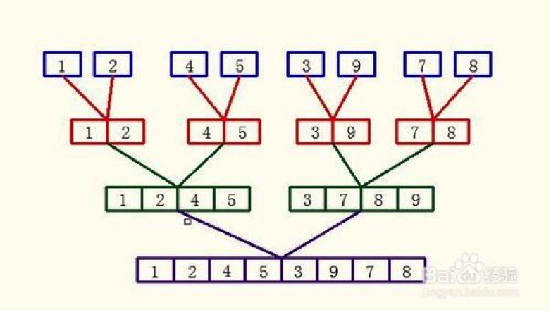
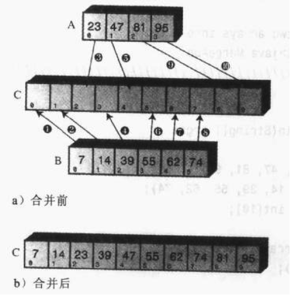
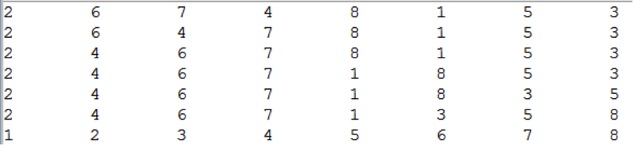
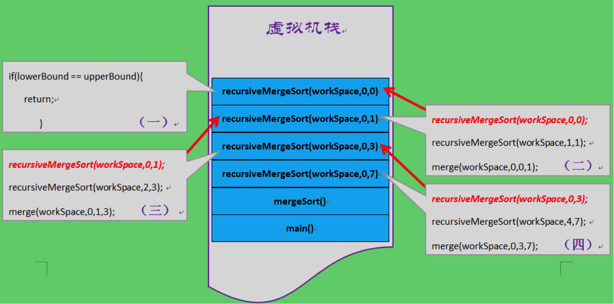

# 1、基本思想

分析归并排序之前，我们先来了解一下**分治算法**。

分治算法的基本思想是将一个规模为N的问题分解为K个规模较小的子问题，这些子问题相互独立且与原问题性质相同。求出子问题的解，就可得到原问题的解。

分治算法的一般步骤：

- 分解，将要解决的问题划分成若干规模较小的同类问题；
- 求解，当子问题划分得足够小时，用较简单的方法解决；
- 合并，按原问题的要求，将子问题的解逐层合并构成原问题的解。

归并排序是分治算法的典型应用。

归并排序先将一个无序的N长数组切成N个有序子序列（只有一个数据的序列认为是有序序列），然后两两合并，再将合并后的N/2（或者N/2 + 1）个子序列继续进行两两合并，以此类推得到一个完整的有序数组。过程如下图所示：



# 2、实例

归并排序的核心思想是将两个有序的数组归并到另一个数组中，所以需要开辟额外的空间。

第一步要理清归并的思路。假设现在有两个有序数组A和B，要将两者有序地归并到数组C中。我们用一个实例来推演：



上图中，A数组中有四个元素，B数组中有六个元素，首先比较A、B中的第一个元素，将较小的那个放到C数组的第一位，因为该元素就是A、B所有元素中最小的。上例中，7小于23，所以将7放到了C中。

然后，用23与B中的其他元素比较，如果小于23，继续按顺序放到C中；如果大于23，则将23放入C中。

23放入C中之后，用23之后的47作为基准元素，与B中的其他元素继续比较，重复上面的步骤。

如果有一个数组的元素已经全部复制到C中了，那么将另一个数组中的剩余元素依次插入C中即可。至此结束。

按照上面的思路，用java实现：

```java
	/**
	 * 
	 * - 归并arrayA与arrayB到arrayC中
	 * 
	 * - @param arrayA 待归并的数组A
	 * 
	 * - @param sizeA 数组A的长度
	 * 
	 * - @param arrayB 待归并的数组B
	 * 
	 * - @param sizeB 数组B的长度
	 * 
	 * - @param arrayC 辅助归并排序的数组
	 */
	public static void merge(int[] arrayA, int sizeA, int[] arrayB, int sizeB, int[] arrayC) {

		int i = 0, j = 0, k = 0; // 分别当作arrayA、arrayB、arrayC的下标指针

		while (i < sizeA && j < sizeB) { // 两个数组都不为空
			if (arrayA[i] < arrayB[j]) { // 将两者较小的那个放到arrayC中
				arrayC[k++] = arrayA[i++];
			} else {
				arrayC[k++] = arrayB[j++];
			}
		} // 该循环结束后，一个数组已经完全复制到arrayC中了，另一个数组中还有元素

		// 后面的两个while循环用于处理另一个不为空的数组
		while (i < sizeA) {
			arrayC[k++] = arrayA[i++];
		}

		while (j < sizeB) {
			arrayC[k++] = arrayA[j++];
		}

		for (int l = 0; l < arrayC.length; l++) { // 打印新数组中的元素
			System.out.print(arrayC[l] + "\t");
		}
	}
```

再归并之前，还有一步工作需要提前做好，就是数组的分解，可以通过递归的方法来实现。递归（Recursive）是算法设计中常用的思想。

这样通过先递归的分解数组，再合并数组就完成了归并排序。完整的java代码如下：

```java
public class Sort {

	private int[] array; // 待排序的数组

	public Sort(int[] array) {
		this.array = array;
	}

	// 按顺序打印数组中的元素
	public void display() {
		for (int i = 0; i < array.length; i++) {
			System.out.print(array[i] + "\t");
		}
		System.out.println();
	}

	// 归并排序

	public void mergeSort() {

		int[] workSpace = new int[array.length]; // 用于辅助排序的数组
		recursiveMergeSort(workSpace, 0, workSpace.length - 1);
	}

	/**
	 * 
	 * - 递归的归并排序
	 * 
	 * - @param workSpace 辅助排序的数组
	 * 
	 * - @param lowerBound 欲归并数组段的最小下标
	 * 
	 * - @param upperBound 欲归并数组段的最大下标
	 */
	private void recursiveMergeSort(int[] workSpace, int lowerBound, int upperBound) {

		if (lowerBound == upperBound) { // 该段只有一个元素，不用排序
			return;
		} else {
			int mid = (lowerBound + upperBound) / 2;
			recursiveMergeSort(workSpace, lowerBound, mid); // 对低位段归并排序
			recursiveMergeSort(workSpace, mid + 1, upperBound); // 对高位段归并排序
			merge(workSpace, lowerBound, mid, upperBound);
			display();
		}
	}

	/**
	 * 
	 * - 对数组array中的两段进行合并，lowerBound~mid为低位段，mid+1~upperBound为高位段
	 * 
	 * - @param workSpace 辅助归并的数组，容纳归并后的元素
	 * 
	 * - @param lowerBound 合并段的起始下标
	 * 
	 * - @param mid 合并段的中点下标
	 * 
	 * - @param upperBound 合并段的结束下标
	 */
	private void merge(int[] workSpace, int lowerBound, int mid, int upperBound) {

		int lowBegin = lowerBound; // 低位段的起始下标
		int lowEnd = mid; // 低位段的结束下标
		int highBegin = mid + 1; // 高位段的起始下标
		int highEnd = upperBound; // 高位段的结束下标
		int j = 0; // workSpace的下标指针
		int n = upperBound - lowerBound + 1; // 归并的元素总数

		while (lowBegin <= lowEnd && highBegin <= highEnd) {
			if (array[lowBegin] < array[highBegin]) { // 将两者较小的那个放到workSpace中
				workSpace[j++] = array[lowBegin++];
			} else {
				workSpace[j++] = array[highBegin++];
			}
		}

		while (lowBegin <= lowEnd) {
			workSpace[j++] = array[lowBegin++];
		}

		while (highBegin <= highEnd) {
			workSpace[j++] = array[highBegin++];
		}

		for (j = 0; j < n; j++) { // 将归并好的元素复制到array中
			array[lowerBound++] = workSpace[j];
		}

	}
}

```

用以下代码测试：

```java
int [] a = {6,2,7,4,8,1,5,3};
Sort sort = new Sort(a);
sort.mergeSort();
```

打印结果如下：



归并的顺序是这样的：先将初始数组分为两部分，先归并低位段，再归并高位段。对低位段与高位段继续分解，低位段分解为更细分的一对低位段与高位段，高位段同样分解为更细分的一对低位段与高位段，依次类推。

上例中，第一步，归并的是6与2，第二步归并的是7和4，第三部归并的是前两步归并好的子段[2,6]与[4,7]。至此，数组的左半部分（低位段）归并完毕，然后归并右半部分（高位段）。

所以第四步归并的是8与1，第四部归并的是5与3，第五步归并的是前两步归并好的字段[1,8]与[3,5]。至此，数组的右半部分归并完毕。

最后一步就是归并数组的左半部分[2,4,6,7]与右半部分[1,3,5,8]。

归并排序结束。

# 3、递归

在本文开始对归并排序的描述中，第一躺归并是对所有相邻的两个元素归并结束之后，才进行下一轮归并，并不是先归并左半部分，再归并右半部分，但是程序的执行顺序与我们对归并排序的分析逻辑不一致，所以理解起来有些困难。

下面结合代码与图例来详细分析一下归并排序的过程。

虚拟机栈（VM  Stack）是描述Java方法执行的内存模型，每一次方法的调用都伴随着一次压栈、出栈操作。

我们要排序的数组为：

`int [] a = {6,2,7,4,8,1,5,3}`

当`main()`方法调用`mergeSort()`方法时，被调用的方法被压入栈中，然后程序进入`mergeSort()`方法：

```java
	public void mergeSort() {
		int[] workSpace = new int[array.length]; // 用于辅助排序的数组
		recursiveMergeSort(workSpace, 0, workSpace.length - 1);
	}
```

此时，mergeSort()又调用了recursiveMergeSort(workSpace,0,7)方法，recursiveMergeSort(workSpace,0,7)方法也被压入栈中，在mergeSort()之上。

然后，程序进入到`recursiveMergeSort(workSpace,0,7)`方法：

```java
if (lowerBound == upperBound) { // 该段只有一个元素，不用排序
    return;
} else {
    int mid = (lowerBound + upperBound) / 2;
    recursiveMergeSort(workSpace, lowerBound, mid); // 对低位段归并排序
    recursiveMergeSort(workSpace, mid + 1, upperBound); // 对高位段归并排序
    merge(workSpace, lowerBound, mid, upperBound);
    display();
}
```

lowerBound参数值为0，upperBound参数值为7，不满足lowerBound == upperBound的条件，所以方法进入else分支，然后调用方法`recursiveMergeSort(workSpace,0,3) `，`recursiveMergeSort(workSpace,0,3)`被压入栈中,此时栈的状态如下：


然而，`recursiveMergeSort(workSpace,0,3)`不能立即返回，它在内部又会调用`recursiveMergeSort(workSpace,0,1)`，`recursiveMergeSort(workSpace,0,1)`又调用了`recursiveMergeSort(workSpace,0,0)`，此时，栈中的状态如下：



程序运行到这里，终于有一个方法可以返回了结果了——`recursiveMergeSort(workSpace,0,0)`，该方法的执行的逻辑是对数组中的下标从0到0的元素进行归并，该段只有一个元素，所以不用归并，立即return。

方法一旦return，就意味着方法结束，`recursiveMergeSort(workSpace,0,0)`从栈中弹出。这时候，程序跳到了代码片段（二）中的第二行：`recursiveMergeSort(workSpace,1,1)`，该方法入栈，`recursiveMergeSort(workSpace,0,0)`类似，不用归并，直接返回，方法出栈。

这时候程度跳到了代码片段（二）中的第三行：`merge(workSpace,0,0,1)`，即对数组中的前两个元素进行合并（自然，`merge(workSpace,0,0,1)`也伴随着一次入栈与出栈）。

至此，代码片段（二）执行完毕，`recursiveMergeSort(workSpace,0,1)`方法出栈，程序跳到代码片段（三）的第二行：`recursiveMergeSort(workSpace,2,3)`，该方法是对数组中的第三个、第四个元素进行归并，与执行recursiveMergeSort(workSpace,0,1)的过程类似，最终会将第三个、第四个元素归并排序。

然后，程序跳到程序跳到代码片段（三）的第三行：`merge(workSpace,0,1,3)`，将前面已经排好序的两个子序列（第一第二个元素为一组、第三第四个元素为一组）合并。

然后`recursiveMergeSort(workSpace,0,3)`出栈，程序跳到代码片段（四）的第二行：`recursiveMergeSort(workSpace,4,7)`，对数组的右半部分的四个元素进行归并排序，伴随着一系列的入栈、出栈，最后将后四个元素排好。此时，数组的左半部分与右半部分已经有序。

然后程序跳到代码片段（四）第三行：`merge(workSpace,0,3,7)`，对数组的左半部分与右半部分合并。

然后`recursiveMergeSort(workSpace,4,7)`出栈，`mergeSort()`出栈，最后`main()方`法出栈，程序结束。

# 4、算法分析

先来分析一下复制的次数。

如果待排数组有8个元素，归并排序需要分3层，第一层有四个包含两个数据项的自数组，第二层包含两个包含四个数据项的子数组，第三层包含一个8个数据项的子数组。合并子数组的时候，每一层的所有元素都要经历一次复制（从原数组复制到`workSpace`数组），复制总次数为3* 8=24次，即层数乘以元素总数。

设元素总数为N，则层数为log2N，复制总次数为`N log2N`。

其实，除了从原数组复制到workSpace数组，还需要从workSpace数组复制到原数组，所以，最终的复制复制次数为`2Nlog2N`。

在大O表示法中，常数可以忽略，所以归并排序的时间复杂度为`O(N log2N)`。

一般来讲，复制操作的时间消耗要远大于比较操作的时间消耗，时间复杂度是由复制次数主导的。

下面我们再来分析一下比较次数。

在归并排序中，比较次数总是比复制次数少一些。现在给定两个各有四个元素的子数组，首先来看一下最坏情况和最好情况下的比较次数为多少。


第一种情况，数据项大小交错，所以必须进行7次比较，第二种情况中，一个数组比另一个数组中的所有元素都要小，因此只需要4次比较。

当归并两个子数组时，如果元素总数为N，则最好情况下的比较次数为N/2，最坏情况下的比较次数为N-1。

假设待排数组的元素总数为N，则第一层需要N/2次归并，每次归并的元素总数为2；则第一层需要N/4次归并，每次归并的元素总数为4；则第一层需要N/8次归并，每次归并的元素总数为8……最后一次归并次数为1，归并的元素总数为N。总层数为log2N。

最好情况下的比较总数为：

`N/2*(2/2)+ N/4*(4/2)+ N/8*(8/2)+...+1*(N/2) = (N/2)*log2N`

最好情况下的比较总数为：

`N/2*(2-1)+ N/4*(4-1)+ N/8*(8-1)+...+1*(N-1) =
(N-N/2)+ (N-N/4)+(N-N/8)+...+(N-1) = 
N*log2N-(1+ N/2+N/4+..)< N*log2N`

可见，比较次数介于(N/2)*log2N与N*log2N之间。如果用大O表示法，时间复杂度也为`O(Nlog2N)`。