# 1 数组

## 1.1 概述

数组是应用最广泛的一种数据结构，常常被植入到编程语言中，作为基本数据类型使用。在一些教材中，数组并没有被当做一种数据结构单独拿出来讲解（其实数组就是一段连续的内存，即使在物理内存中不是连续的，在逻辑上肯定是连续的）。其实没必要在概念上做纠缠，数组可以当做学习数据结构的敲门砖，以此为基础，了解数据结构的基本概念以及构建方法。

数据结构不仅是数据的容器，还要提供对数据的操作方法，比如检索、插入、删除、排序等。

## 1.2 无序数组

下面我们建立一个类，对数组的检索、插入、删除、打印操作进行封装，简便起见，我们假设数组中没有重复值。

```java
public class Array {
	
	private String [] strArray;
	private int length = 0;	//数组元素个数
		
	//构造方法，传入数组最大长度
	public Array(int max){
		strArray = new String [max];
	}
	
	//检测数组是否包含某个元素，如果存在返回其下标，不存在则返回-1
	public int contains(String target){
		int index = -1;
		for(int i=0;i<length;i++){
			if(strArray[i].equals(target)){
				index = i;
				break;
			}
		}
		return index;
	}
	
	//插入
	public void insert(String elem) {
		strArray[length] = elem;
		length++;
	}
	
	//删除某个指定的元素值，删除成功则返回true，否则返回false
	public boolean delete(String target){
		int index = -1;
		if((index = contains(target)) != -1){
			for(int i=index;i<length-1;i++){
				//删除元素之后的所有元素前移一位
				strArray[i] = strArray[i+1];  
			}
			length--;
			return true;
		}else{
			return false;
		}
	}
	
	//列出所有元素
	public void display(){
		for(int i=0;i<length;i++){
			System.out.print(strArray[i]+"\t");
		}
	}
	
}
```

- **无序数组的优点**：插入快，如果知道下标，可以很快地存取
- **无序数组的缺点**：查找慢，删除慢，大小固定

## 1.3 有序数组

所谓的有序数组就是指数组中的元素是按一定规则排列的，其好处就是在根据元素值查找时可以使用**二分查找**，查找效率要比无序数组高很多，在数据量很大时更加明显。当然缺点也显而易见，当插入一个元素时，首先要判断该元素应该插入的下标，然后对该下标之后的所有元素后移一位，才能进行插入，这无疑增加了很大的开销。

因此，**有序数组适用于查找频繁，而插入、删除操作较少的情况**。

有序数组的封装类如下，为了方便，我们依然假设数组中是没有重复值的，并且数据是按照由小到大的顺序排列的。

```java
public class OrderArray {
	private int [] intArray;
	private int length = 0;	//数组元素个数
	
	//构造方法，传入数组最大长度
	public OrderArray(int max){
		intArray = new int [max];
	}
	
	//用二分查找法定位某个元素，如果存在返回其下标，不存在则返回-1
	public int find(int target){
		int lowerBound = 0;			//搜索段最小元素的下标
		int upperBound = length-1;	//搜索段最大元素的下标

		while(lowerBound <= upperBound){
			//当前检测元素的下标，先减后除，避免两个下标相加导致整数溢出
			int curIn = lowerBound + (upperBound-lowerBound)/2;

			if(intArray[curIn] == target){
				return curIn;  //找到了目标元素，返回其下标
			}else if(intArray[curIn] < target){
				//当前元素小于目标元素，目标只可能位于后半段，下一轮从curIn+1开始检索
				lowerBound = curIn+1;
			}else{
				//当前元素大于目标元素，目标只可能位于前半段，下一轮检索到curIn-1为止
				upperBound = curIn-1;
			}
		}

		//搜索范围已经为空，证明数组中没有该元素
		return -1;
	}
	
	//插入
	public void insert(int elem) {
		int location = 0;
		
		//判断应插入位置的下标
		for(;location<length;location++){
			if(intArray[location] > elem)
				break;
		}
		//System.out.println(location);
		//将插入下标之后的所有元素后移一位
		for(int i=length;i>location;i--){
			intArray[i] = intArray[i-1];
		}
		
		//插入元素
		intArray[location] = elem;
		
		length++;
	}
	
	//删除某个指定的元素值，删除成功则返回true，否则返回false
	public boolean delete(int target){
		int index = -1;
		if((index = find(target)) != -1){
			for(int i=index;i<length-1;i++){
				//删除元素之后的所有元素前移一位
				intArray[i] = intArray[i+1];  
			}
			length--;
			return true;
		}else{
			return false;
		}
	}
	
	//列出所有元素
	public void display(){
		for(int i=0;i<length;i++){
			System.out.print(intArray[i]+"\t");
		}
		System.out.println();
	}
}
```


有序数组最大的优势就是可以提高查找元素的效率，在上例中，`find` 方法使用了二分查找法，该算法的示意图如下：

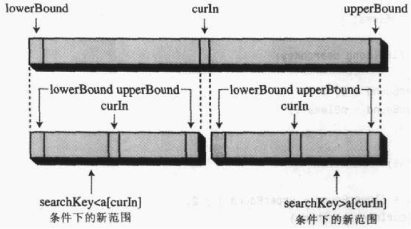

这个方法在一开始设置变量 `lowerBound` 和 `upperBound` 指向数组的第一个和最后一个非空数据项，通过这两个变量确定当前的搜索范围。每轮循环中，当前的下标 `curIn` 被设置为这个范围的中间值，计算中间下标时写成 `lowerBound + (upperBound - lowerBound) / 2` 而不是 `(lowerBound + upperBound) / 2`，可以避免两个下标相加导致的整数溢出。

如果 `curIn` 就是我们要找的数据项，则返回下标，如果不是，就要分两种情况来考虑：

- 如果 `curIn` 指向的数据项比我们要找的数据小，则证明该元素只可能在 `curIn` 之后，即数组后一半中（数组是从小到大排列的），下一轮把 `lowerBound` 更新为 `curIn + 1`，从后半段检索；
- 如果 `curIn` 指向的数据项比我们要找的数据大，则证明该元素只可能在 `curIn` 之前，下一轮把 `upperBound` 更新为 `curIn - 1`，在前半段中检索。

按照上面的方法迭代检索，每轮都会把搜索范围缩小一半，当 `lowerBound` 大于 `upperBound` 时，说明搜索范围已经为空，数组中没有该元素，查找以返回 -1 结束。

- **有序数组的优点**：查找效率高
- **有序数组的缺点**：删除和插入慢，大小固定

# 2 栈

## 2.1 概述

数组、链表、树等数据结构适用于存储数据库应用中的数据记录，它们常常用于记录那些现实世界的对象和活动的数据，便于数据的访问：插入、删除和查找特定数据项。

而栈和队列更多的是作为程序员的工具来使用。它们主要作为构思算法的辅助工具，而不是完全的数据存储工具。这些数据结构的生命周期比那些数据库类型的结构要短很多。在程序操作执行期间它们才被创建，通常它们去执行某项特殊的任务，当任务完成后就被销毁。

栈和队列的访问是受限制的，即在特定时刻只有一个数据项可以被读取或删除。

栈和队列是比数组和其他数据结构更加抽象的结构，是站在更高的层面对数据进行组织和维护。

栈的主要机制可用数组来实现，也可以用链表来实现。优先级队列的内部实现可以用数组或者一种特别的树——堆来实现。

栈只允许访问一个数据项：即最后插入的数据。移除这个数据项后才能访问倒数第二个插入的数据项。它是一种**后进先出**（LIFO，Last In First Out）的数据结构。

## 2.2 栈的实现

栈最基本的操作是出栈、入栈，还有其他扩展操作，如查看栈顶元素，判断栈是否为空、是否已满，读取栈的大小等。

下面我们就用数组来写一个栈操作的封装类。

```java
public class Stack {
	private int size;			//栈的大小
	private int top;			//栈顶元素的下标
	private int [] stackArray;	//栈的容器
	
	//构造函数
	public Stack(int size){
		stackArray = new int [size];
		top = -1;	//初始化栈的时候，栈内无元素，栈顶下标设为-1
		this.size = size;
	}
	
	//入栈，同时，栈顶元素的下标加一
	public void push(int elem) throws Exception{
		if(isFull()){
			throw new Exception("栈已满，不能进行入栈操作！");
		}
		stackArray[++top] = elem; //插入栈顶
	}

	//出栈，删除栈顶元素，同时，栈顶元素的下标减一
	public int pop() throws Exception{
		if(isEmpty()){
			throw new Exception("栈为空，不能进行出栈操作！");
		}
		return stackArray[top--];
	}
	
	//查看栈顶元素，但不删除
	public int peek() throws Exception{
		if(isEmpty()){
			throw new Exception("栈内没有元素！");
		}
		return stackArray[top];
	}
	
	//判空
	public boolean isEmpty(){
		return (top == -1);
	}
	
	//判满
	public boolean isFull(){
		return (top == size-1);
	}
	
}
```

上例中，入栈、出栈和查看栈顶元素的操作都先对栈的状态做了检查：栈已满时再入栈，栈为空时再出栈或查看栈顶元素，都会抛出异常，而不是直接操作数组引发 `ArrayIndexOutOfBoundsException`，这一点与后面队列的实现保持一致。

入栈操作示意图：

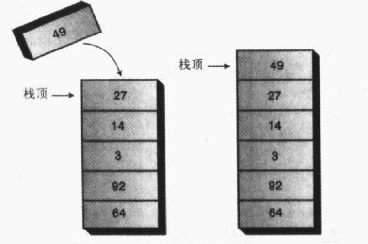

出栈操作示意图：

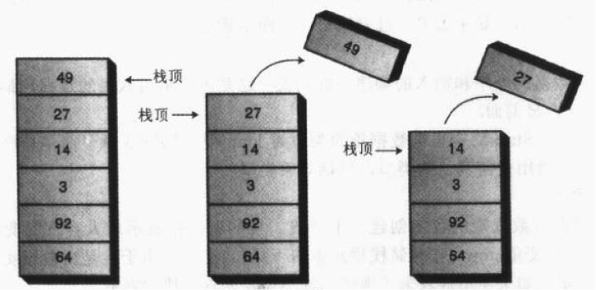

## 2.3 应用实例：分隔符匹配

通常，文本串是用计算机语言写的代码行，而解析它们的程序就是编译器。

下面我们来用栈来实现一个经典的应用：分隔符匹配。

想一下在 Eclipse 编程时，如果我们写的代码中多了一个“{”，或者少了一个“}”，或者括号的顺序错乱，都会报错。接下来我们就用栈来模拟这种分隔符匹配。

分隔符匹配程序从字符串中不断地读取字符，每次读取一个字符，若发现它是左分隔符（{、[、(），将它压入栈中。当读到一个右分隔符时（)、]、}），弹出栈顶元素，并且查看它是否和该右分隔符匹配。如果它们不匹配，则程序报错。如果到最后一直存在着没有被匹配的分隔符，程序也报错。

我们来看下面这个正确的字符串：`a{b(c[d]e)f}`，在栈中的变化过程：

| 所读字符 | 栈中内容 |
| -------- | -------- |
| a        | 空       |
| {        | {        |
| b        | {        |
| (        | {(       |
| c        | {(       |
| [        | {([      |
| d        | {([      |
| ]        | {(       |
| e        | {(       |
| )        | {        |
| f        | {        |
| }        | 空       |

最后出现的左分隔符需要被最先匹配，这符合栈“后进先出”的规则。

在本例中，要处理的是字符，所以需要对上面的 `Stack` 类进行修改，需要将存放元素的数组改为 `char` 类型，并把相关方法的参数类型改为 `char` 类型，其余不变。

```java
public class Stack {
	private int size;			//栈的大小
	private int top;			//栈顶元素的下标
	private char [] stackArray;	//栈的容器
	
	//构造函数
	public Stack(int size){
		stackArray = new char [size];
		top = -1;	//初始化栈的时候，栈内无元素，栈顶下标设为-1
		this.size = size;
	}
	
	//入栈，同时，栈顶元素的下标加一
	public void push(char elem) throws Exception{
		if(isFull()){
			throw new Exception("栈已满，不能进行入栈操作！");
		}
		stackArray[++top] = elem; //插入栈顶
	}

	//出栈，删除栈顶元素，同时，栈顶元素的下标减一
	public char pop() throws Exception{
		if(isEmpty()){
			throw new Exception("栈为空，不能进行出栈操作！");
		}
		return stackArray[top--];
	}
	
	//查看栈顶元素，但不删除
	public char peek() throws Exception{
		if(isEmpty()){
			throw new Exception("栈内没有元素！");
		}
		return stackArray[top];
	}
	
	//判空
	public boolean isEmpty(){
		return (top == -1);
	}
	
	//判满
	public boolean isFull(){
		return (top == size-1);
	}
	
}
```

然后写一个类来封装分隔符匹配的操作：

```java
public class BracketChecker {
	
	private String input;  //存储待检查的字符串
	
	//构造方法，接受待检查的字符串
	public BracketChecker(String in){
		this.input = in;
	}
	
	//检查分隔符匹配的方法
	public void check() throws Exception{
		int strLength = input.length();
		Stack stack = new Stack(strLength);
		
		for(int i=0;i<strLength;i++){
			
			char ch = input.charAt(i);  //一次获取串中的单个字符
			
			switch(ch){
				case '{' :
				case '[' :
				case '(' :
					 //如果为左分隔符，压入栈
					stack.push(ch); 
					break;
				case '}' :
				case ']' :
				case ')' :
					//如果为右分隔符，与栈顶元素进行匹配
					if(!stack.isEmpty()){
						char chx = stack.pop();
						
						if((ch == '}' && chx != '{')||
						   (ch == ')' && chx != '(')||
						   (ch == ']' && chx != '[')
						){
							System.out.println("匹配出错！字符："+ch+",下标："+i);
						}
					}else{
						System.out.println("匹配出错！字符："+ch+",下标："+i);
					}
					
				default :
					break;
			}
			
		}
		
		if(!stack.isEmpty()){
			//匹配结束时如果栈中还有元素，证明右分隔符缺失
			System.out.println("有括号没有关闭！");
		}
	}
	
}
```

测试类：

```java
public static void main(String[] args) throws Exception {

		System.out.println("输入需要检测的字符串：");
		String str = getString();
		BracketChecker checker = new BracketChecker(str);
		checker.check();
	}
	
	public static String getString(){
		String str = "";
		try{
			InputStreamReader reader = new InputStreamReader(System.in);
			BufferedReader bReader = new BufferedReader(reader);
			str = bReader.readLine();
		}catch(IOException e){
			e.printStackTrace();
		}
		return str;
	}
```

# 3 队列

## 3.1 概述

栈是**后进先出**（LIFO，Last In First Out）的数据结构，与之相反，队列是**先进先出**（FIFO，First In First Out）的数据结构。

队列的作用就像售票口前的人们站成的一排一样：第一个进入队列的人将最先买到票，最后排队的人最后才能买到票。

在计算机操作系统或网络中，有各种队列在安静地工作着。打印作业在打印队列中等待打印。当敲击键盘时，也有一个存储键盘键入内容的队列，如果我们敲击了一个键，而计算机又暂时在做其他事情，敲击的内容不会丢失，它会排在队列中等待，直到计算机有时间来读取它，利用队列保证了键入内容在处理时其顺序不会改变。

栈的插入和删除数据项的命名方法很标准，称为 `push` 和 `pop`，队列的方法至今也没有一个标准化的命名，插入可以称作 `put`、`add` 或 `enqueue` 等，删除可以叫作 `delete`、`get`、`remove` 或 `dequeue` 等。

## 3.2 队列的实现

下面我们依然使用数组作为底层容器来实现一个队列的操作封装，与栈不同的是，队列的数据项并不都是从数组的第一个下标开始，因为数据项在数组的下标越小代表其在队列中的排列越靠前，移除数据项只能从队头移除，然后队头指针后移，这样数组的前几个位置就会空出来，如下图所示：

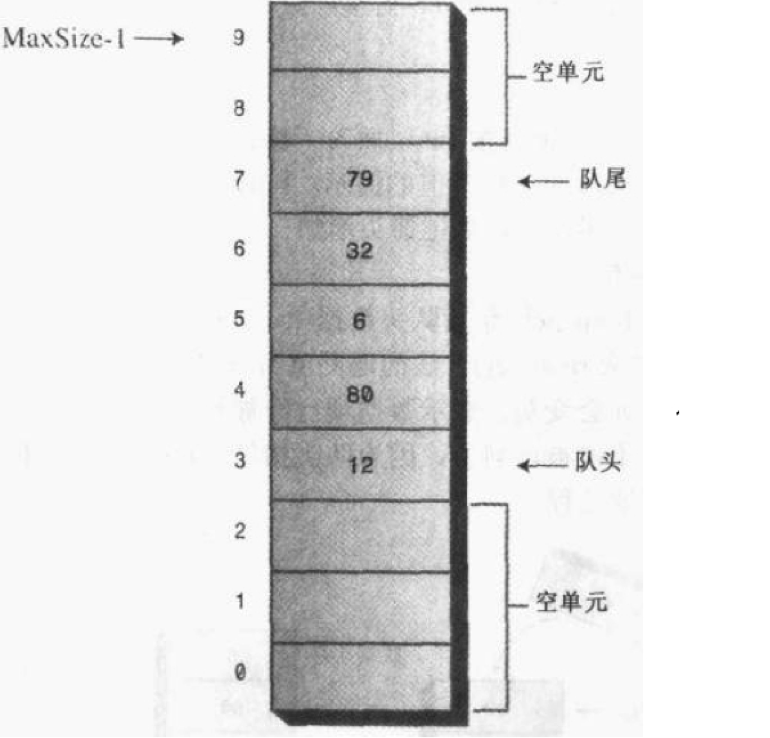

这与我们的直观感觉相反，因为我们排队买票时，队列总是向前移动，当前面的人买完票离开后，其他人都向前移动，而在我们的设计中，队列并没有向前移动，因为那样做会使效率大打折扣，我们只需要使用指针来标记队头和队尾，队列发生变化时，移动指针就可以，而数据项的位置不变。

但是，这样的设计还存在着一个问题，随着队头元素不断地移除，数组前面空出的位置会越来越多，当队尾指针移到最后的位置时，即使队列没有满，我们也不能再插入新的数据项了。

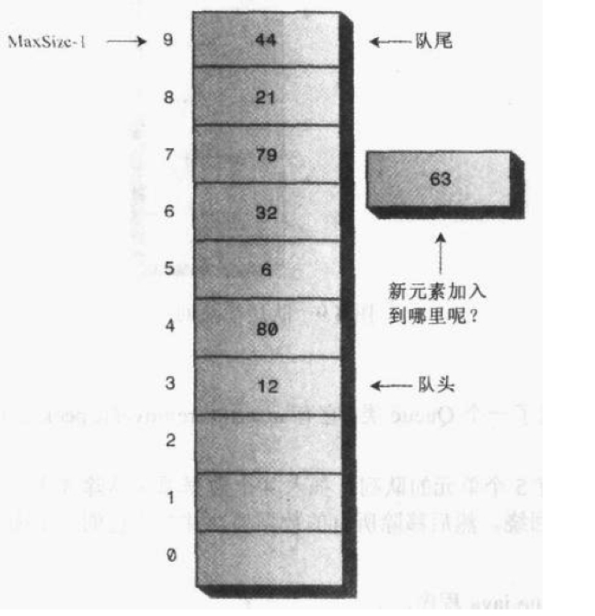

解决这种缺点的方法是**环绕式处理**，即让队尾指针回到数组的第一个位置：

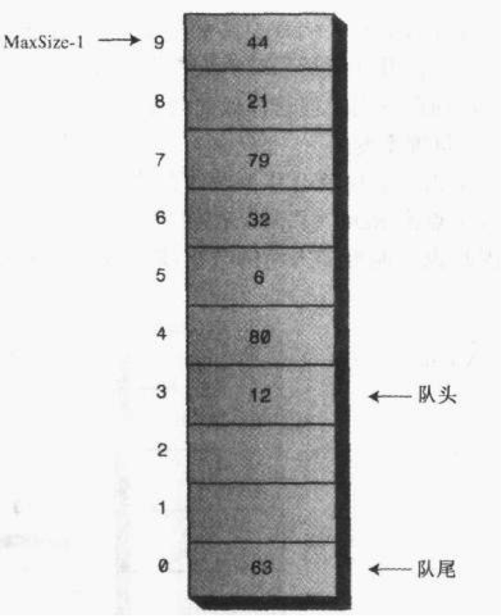

这就是**循环队列**（也称为**环形缓冲**）。虽然在存储上是线性的，但是在逻辑上它是一个首尾衔接的环形。

```java
public class Queue {
	
	private int [] queArray;
	private int maxSize;
	public int front;	//存储队头元素的下标
	public int rear;	//存储队尾元素的下标
	private int length; //队列长度
	
	//构造方法，初始化队列
	public Queue(int maxSize){
		this.maxSize = maxSize;
		queArray = new int [maxSize];
		front = 0;
		rear = -1;
		length = 0;
	}
	
	//插入
	public void insert(int elem) throws Exception{
		if(isFull()){
			throw new Exception("队列已满，不能进行插入操作！");
		}
		//如果队尾指针已到达数组的末端，插入到数组的第一个位置
		if(rear == maxSize-1){
			rear = -1;
		}
		queArray[++rear] = elem;
		length++;
	}
	
	//移除
	public int remove()throws Exception{
		if(isEmpty()){
			throw new Exception("队列为空，不能进行移除操作！");
		}
		int elem = queArray[front++];
		//如果队头指针已到达数组末端，则移到数组第一个位置
		if(front == maxSize){
			front = 0;
		}
		length--;
		return elem;
	}
	
	//查看队头元素
	public int peek()throws Exception{
		if(isEmpty()){
			throw new Exception("队列内没有元素！");
		}
		return queArray[front];
	}
	
	//获取队列长度
	public int size(){
		return length;
	}
	
	//判空
	public boolean isEmpty(){
		return (length == 0);
	}
	
	//判满
	public boolean isFull(){
		return (length == maxSize);
	}
	
}
```

还有一种称为**双端队列**的数据结构，队列的每一端都可以进行插入和移除操作。

其实**双端队列是队列和栈的综合体**。如果限制双端队列的一端只能插入，而另一端只能移除，就变成了平常意义上的队列；如果限制双端队列只能在一端进行插入和移除，就变成了栈。

## 3.3 优先级队列

像普通队列一样，优先级队列有一个队头和一个队尾，并且也是从队头移除数据，从队尾插入数据，不同的是，在优先级队列中，数据项按关键字的值排序，数据项插入的时候会按照顺序插入到合适的位置。

除了可以快速访问优先级最高的数据项，优先级队列还应该可以实现相当快的插入，因此，优先级队列通常使用一种称为堆的数据结构来实现。在下例中，简便起见，我们仍然使用数组来实现。

在数据项个数比较少，或不太关心速度的情况下，用数组实现优先级队列还可以满足要求，如果数据项很多，或对速度要求很高，采用堆是更好的选择。

优先级队列的实现跟上面普通队列的实现有很大的区别。

优先级队列的插入本来就需要移动元素来找到应该插入的位置，所以循环队列那种不需要移动元素的优势就不太明显了。在下例中，没有设置队头和队尾指针，而是使数组的第一个元素永远是队尾，数组的最后一个元素永远是队头，为什么不是相反的呢？因为队头有移除操作，所以将队头放在数组的末端，便于移除，如果放在首端，每次移除队头都需要将队列向前移动。

插入元素示意图：

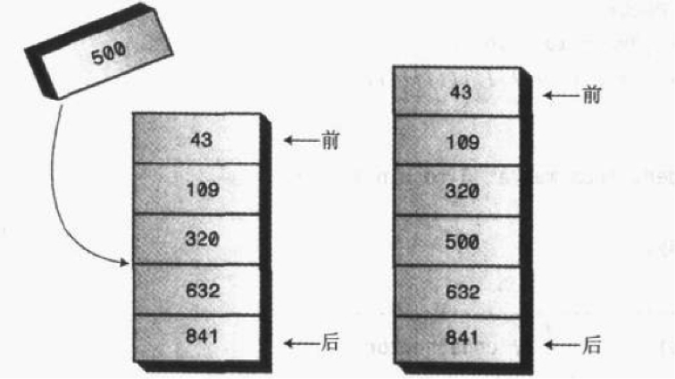

移除元素示意图：

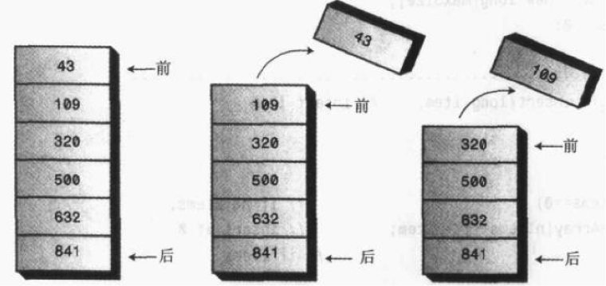

在下例中，我们设置了一个基准点，认为元素到基准点的距离越近则优先级越高，如设置的基准点为 2，3 到 2 的距离就是 `|3-2|=1`，而 -1 到 2 的距离是 `|-1-2|=3`，所以 3 的优先级就比 -1 要高。

```java
public class PriorityQueue {
	
	private int [] queArray;
	private int maxSize;
	private int length; //队列长度
	private int referencePoint;  //基准点
	
	//构造方法，初始化队列
	public PriorityQueue(int maxSize,int referencePoint){
		this.maxSize = maxSize;
		this.referencePoint = referencePoint;
		queArray = new int [maxSize];
		length = 0;
	}
	
	//插入
	public void insert(int elem) throws Exception{
		if(isFull()){
			throw new Exception("队列已满，不能进行插入操作！");
		}
		
		//如果队列为空，插入到数组的第一个位置
		if(length == 0){
			queArray[length++] = elem;
		}else{
			int i;
			for(i=length;i>0;i--){
				
				int dis = Math.abs(elem-referencePoint);  //待插入元素的距离
				int curDis = Math.abs(queArray[i-1]-referencePoint);  //当前元素的距离
				
				//将比插入元素优先级高的元素后移一位
				if(dis >= curDis){
					queArray[i] = queArray[i-1];
				}else{
					break;
				}
			}
			queArray[i] = elem;
			length++;
		}
	}
	
	//移除
	public int remove()throws Exception{
		if(isEmpty()){
			throw new Exception("队列为空，不能进行移除操作！");
		}
		int elem = queArray[--length];
		return elem;
	}
	
	//查看队头元素
	public int peek()throws Exception{
		if(isEmpty()){
			throw new Exception("队列内没有元素！");
		}
		return queArray[length-1];
	}
	
	//返回队列长度
	public int size(){
		return length;
	}
	
	//判空
	public boolean isEmpty(){
		return (length == 0);
	}
	
	//判满
	public boolean isFull(){
		return (length == maxSize);
	}
	
}
```

# 4 链表

## 4.1 概述

链表是一种插入和删除都比较快的数据结构，缺点是查找比较慢。除非需要频繁地通过下标来随机访问数据，否则在很多使用数组的地方都可以用链表代替。

在链表中，每个数据项都包含在**链结点**中，一个链结点是某个类的对象。每个链结点对象中都包含一个对下一个链结点的引用，链表本身的对象中有一个字段指向第一个链结点的引用，如下图所示：

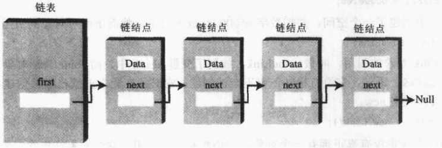

在数组中，每一项占用一个特定的位置，这个位置可以用一个下标号直接访问，就像一排房子，你可以凭房间号找到其中特定的一间。在链表中，寻找一个特定元素的唯一方法就是沿着这个元素的链一直找下去，直到发现要找的那个数据项。

## 4.2 单链表

链表的删除指定链结点，是通过将目标链结点的上一个链结点的 `next` 指针指向目标链结点的下一个链结点，示意图如下：

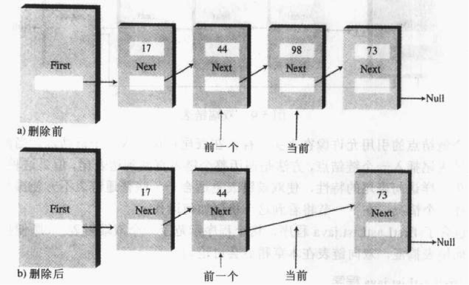

通过这种方法，在链表的指针链中将跳过与删除的元素，达到删除的目的。不过，实际上删除掉的元素的 `next` 指针还是指向原来的下一个元素的，只是它不能再被单链表检索到而已，JVM 的垃圾回收机制会在一定的时间之后回收它。

添加链结点比删除复杂一点，首先我们要使插入位置之前的链结点的 `next` 指针指向目标链结点，其次还要将目标链结点的 `next` 指针指向插入位置之后的链结点。本例中的插入位置仅限于链表的第一个位置，示意图如下：

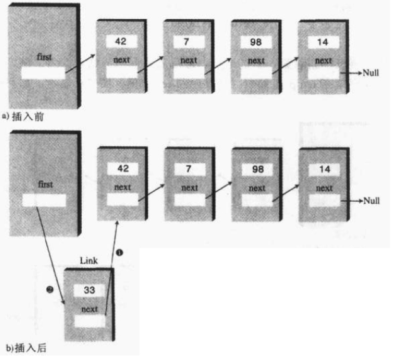

下面给出单链表的实现类。

```java
//链结点的封装类
public class Link {
	
	public int age;
	public String name;
	public Link next;  //指向该链结点的下一个链结点
	
	//构造方法
	public Link(int age,String name){
		this.age = age;
		this.name = name;
	}
	
	//打印该链结点的信息
	public void displayLink(){
		System.out.println("name:"+name+",age:"+age);
	}
}

//链表的封装类
public class LinkList {
	
	private Link first;  //指向链表中的第一个链结点
	
	public LinkList(){
		first = null;
	}
	
	//插入到链表的前端
	public void insertFirst(Link link){
		link.next = first;
		first = link;
	}
	
	//删除第一个链结点，返回删除的链结点引用
	public Link deleteFirst() throws Exception{
		if(isEmpty()){
			throw new Exception("链表为空！不能进行删除操作");
		}
		Link temp = first;
		first = first.next;
		return temp;
	}
	
	//打印出所有的链表元素
	public void displayList(){
		Link cur = first;
		while(cur != null){  //循环打印每个链结点
			cur.displayLink();
			cur = cur.next;
		}
	}
	
	//删除属性为指定值的链结点
	public Link delete(int key){
		Link link = null;
		Link cur = first;
		Link previous = null;
		while(cur != null){
			if(cur.age == key){  //找到了要删除的链结点
				link = cur;
				//如果当前链结点的前驱为null，证明当前链结点是链表的第一个链结点
                //删除该链结点后需要对first属性重新赋值
				if(previous == null){  
					this.first = cur.next;
				}else{
				//删除操作，即将前驱的next指针指向当前链结点的next
                //链表中将去掉当前链结点这一环
					previous.next = cur.next;
				}
				break;
			}
			
			//当前链结点不是要删除的目标，先记录前驱，再向后推进寻找
			previous = cur;
			cur = cur.next;
		}
		
		return link;
	}
	
	//查找属性为指定值的链结点
	public Link find(int key){
		Link link = null;
		Link cur = first;
		while(cur != null){
			if(cur.age == key){
				link = cur;
				break;
			}else if(cur.next == null){ 
            //当前链结点不是要找的目标且下一个链结点为null，则证明没有找到目标
				break;
			}
			
			//当前链结点不是要找的目标且存在下一个链结点，则向后继续寻找
			cur = cur.next;
		}
		
		return link;
	}
	
	//判空
	public boolean isEmpty(){
		return (first == null);
	}
	
}
```

## 4.3 双端链表

首先需要注意，**双端链表与双向链表是完全不同的两个概念**。

双端链表与单链表的区别在于它不只第一个链结点有引用，还对最后一个链结点有引用，如下图所示：

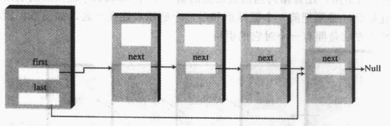

对最后一个链结点的引用允许像插入表头那样在表尾插入一个链结点，使用双端链表更适合于一些单链表不方便操作的场合，队列的实现就是这样一个情况。

下面是双端链表的实现类，与单链表不同的是，`DoubleEndList` 类多了指向表尾的引用，并且多了插入表尾的操作。

```java
//链表的封装类
public class DoubleEndList {
	
	private Link first;  //指向链表中的第一个链结点
	private Link last;   //指向链表中最后一个链结点
	
	public DoubleEndList(){
		first = null;
		last = null;
	}
	
	//插入到链表的前端
	public void insertFirst(Link link){
		if(isEmpty()){  //如果为空链表，则插入的第一个链结点既是表头也是表尾
			last = link;
		}
		link.next = first;
		first = link;
	}
	
	//插入到链表的末端
	public void insertLast(Link link){
		if(isEmpty()){  //如果为空链表，则插入的第一个链结点既是表头也是表尾
			first = link;
		}else{
			last.next = link;
		}
		last = link;
	}
	
	//删除第一个链结点，返回删除的链结点引用
	public Link deleteFirst() throws Exception{
		if(isEmpty()){
			throw new Exception("链表为空！不能进行删除操作");
		}
		Link temp = first;
		if(first.next == null){
			last = null;  //如果只有一个链结点，则删除后会影响到last指针
		}
		first = first.next;
		return temp;
	}
	
	//打印出所有的链表元素
	public void displayList(){
		Link cur = first;
		while(cur != null){  //循环打印每个链结点
			cur.displayLink();
			cur = cur.next;
		}
	}
	
	//判空
	public boolean isEmpty(){
		return (first == null);
	}
	
}
```


双端链表可以插入表尾，但是仍然不能方便地删除表尾，因为我们没有方法快捷地获取倒数第二个链结点，双端链表没有逆向的指针，这一点就要靠双向链表来解决了。

## 4.4 有序链表

对于某些应用来说，在链表中保持数据有序是很有用的，具有这个特性的链表叫作**有序链表**。

通常，有序链表的删除只限于最大值或最小值，不过，有时候也会查找和删除某一特定点，但这种操作对于有序链表来说效率不高。

有序链表优于有序数组的地方在于插入的效率更高（不需要像数组那样移动元素），另外链表可以灵活地扩展大小，而数组的大小是固定的。但是这种效率的提高和灵活的优势是以算法的复杂性为代价的。

下面我们给出一个有序单链表的实现类。

```java
//有序链表的封装类
public class SortedList {
	
	private Link first;  //指向链表中的第一个链结点
	
	public SortedList(){
		first = null;
	}
	
	//插入
	public void insert(Link link){
		Link previous = null;
		Link cur = first;
		while(cur != null && link.age>cur.age){  //链表由小到大排列
			previous = cur;
			cur = cur.next;
		}
		
		if(previous == null){  //如果previous为null，则证明当前链结点为表头
			this.first = link;
		}else{
			previous.next = link;
		}
		
		link.next = cur;
		
	}
	
	//删除第一个链结点，返回删除的链结点引用
	public Link deleteFirst() throws Exception{
		if(isEmpty()){
			throw new Exception("链表为空！不能进行删除操作");
		}
		Link temp = first;
		first = first.next;
		return temp;
	}
	
	//打印出所有的链表元素
	public void displayList(){
		Link cur = first;
		while(cur != null){  //循环打印每个链结点
			cur.displayLink();
			cur = cur.next;
		}
	}
	
	//判空
	public boolean isEmpty(){
		return (first == null);
	}
	
}
```


该实现类与单链表的差别在于插入操作，因为是有序的，所以需要先找到要插入的位置，然后才能进行插入。

有序链表可以用于一种高效的排序机制。假设有一个无序数组，如果从这个数组中取出数据插入有序链表，它们会自动按照顺序排列，然后把它们从有序链表中重新放入数组，该数组就变成了有序数组。这种排序方法比在数组中常用的插入排序效率更高，因为这种方式进行的复制次数少一些。

## 4.5 双向链表

下面来讨论一种更复杂的链表结构：**双向链表**。

传统链表存在着一个潜在的问题，就是没有反向引用，由上一个链结点跳到下一个链结点很容易，而从下一个链结点跳到上一个链结点很困难。

双向链表提供了这种能力，既允许向前遍历，也允许向后遍历。实现这种特性的关键在于每个链结点既有下一个链结点的引用，也有上一个链结点的引用，如下图所示：

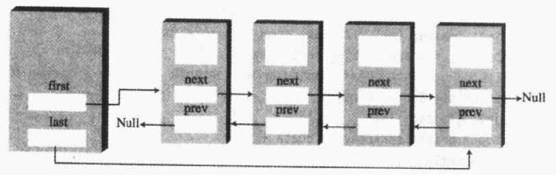

诚然，双向链表有其自身的优势，但是任何优势都要付出一定的代价，比如双向链表的插入和删除会变得更复杂，因为同时要处理双倍的指针变化。例如，我们在进行表头插入的操作示意图如下：

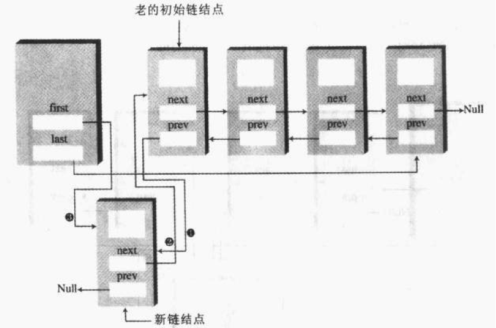

在表尾插入与之类似，是表头插入的镜像操作。

在表头表尾之外的其他位置插入新的链结点的示意图如下：

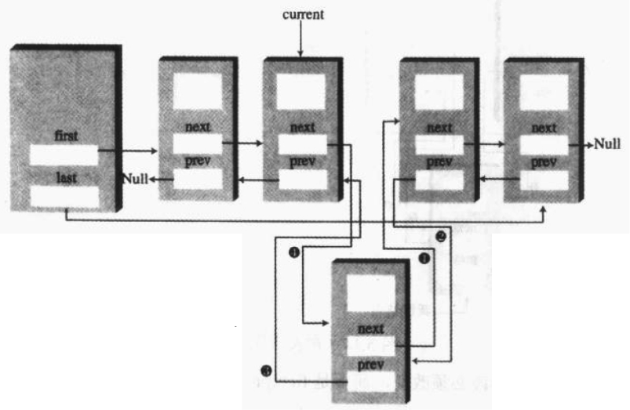

对于删除操作，如果要删除表头或表尾，比较简单，如果要删除指定值的链结点比较复杂，首先需要定位到要删除的链结点，然后改变其前后链结点的指针，示意图如下：

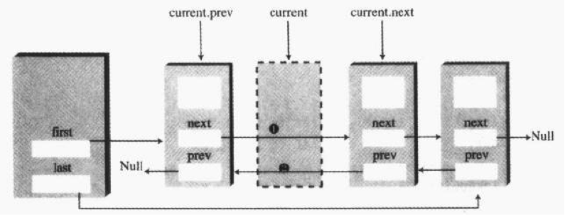

下面给出双向链表的实现类，与前面的链表不同的是，链结点的封装类需要做些改变，之前的链结点类只包含向后的引用 `next`，在双向链表中还需要加入向前的引用 `previous`。

```java
//链结点的封装类
public class Link {
	
	public int age;
	public String name;
	public Link next;  //指向下一个链结点
	public Link previous;  //指向前一个链结点
	
	//构造方法
	public Link(int age,String name){
		this.age = age;
		this.name = name;
	}
	
	//打印该链结点的信息
	public void displayLink(){
		System.out.println("name:"+name+",age:"+age);
	}
}

//双向链表的封装类
public class DoublyLinkList {
	
	private Link first;  //指向链表中的第一个链结点
	private Link last;   //指向链表中的最后一个链结点
	
	public DoublyLinkList(){
		first = null;
		last = null;
	}
	
	//插入到链表的前端
	public void insertFirst(Link link){
		if(isEmpty()){  //如果为空链表，则插入的第一个链结点既是表头也是表尾
			last = link;
		}else{  //如果不是空链表，则将链表的first指针指向该链结点
			first.previous = link;
		}
		link.next = first;
		first = link;
	}
	
	//插入到链表的末端
	public void insertLast(Link link){
		if(isEmpty()){  //如果为空链表，则插入的第一个链结点既是表头也是表尾
			first = link;
		}else{
			last.next = link;
			link.previous = last;
		}
		last = link;
	}
	
	//删除第一个链结点，返回删除的链结点引用
	public Link deleteFirst() throws Exception{
		if(isEmpty()){
			throw new Exception("链表为空！不能进行删除操作");
		}
		Link temp = first;
		if(first.next == null){
			last = null;  //如果只有一个链结点，则删除后会影响到last指针
		}else{  //如果至少有两个链结点，则将第二个链结点的previous设为null
			first.next.previous = null;
		}
		first = first.next;
		return temp;
	}
	
	//删除最后一个链结点，返回删除的链结点引用
	public Link deleteLast() throws Exception{
		if(isEmpty()){
			throw new Exception("链表为空！不能进行删除操作");
		}
		Link temp = last;
		if(last.previous == null){
			first = null;  //如果只有一个链结点，则删除后会影响到first指针
		}else{  //如果至少有两个链结点，则将倒数第二个链结点的next设为null
			last.previous.next = null;
		}
		last = last.previous;
		return temp;
	}
	
	//查找属性为指定值的链结点
	public Link find(int key){
		Link cur = first;
		while(cur != null && cur.age != key ){
			if(cur.next == null){
				return null;  //当前链结点不是要找的目标且已到达表尾
			}
			cur = cur.next;
		}
		
		return cur;
	}
	
	//在属性值为key的链结点之后插入newLink，操作成功返回true，操作失败返回false
	public boolean insertAfter(int key, Link newLink){
		Link target = find(key);  //先根据key定位插入的参照链结点
		boolean flag = true;
		if(target == null){  //没找到插入的参照链结点
			flag = false;
		}else{  //找到了插入的参照链结点
			if(target.next == null){ //参照链结点为表尾
				insertLast(newLink);
			}else { //该链表至少有两个链结点
				target.next.previous = newLink;
				newLink.next = target.next;
				//必须执行完上面两步，才能执行下面这两步
				//上面两步处理了newLink和它下一个链结点的关系
				//下面两步处理了newLink和它上一个链结点的关系
				target.next = newLink;
				newLink.previous = target;
			}
		}
			
		return flag;
	}
	
	//打印出所有的链表元素
	public void displayList(){
		Link cur = first;
		while(cur != null){  //循环打印每个链结点
			cur.displayLink();
			cur = cur.next;
		}
	}
	
	//判空
	public boolean isEmpty(){
		return (first == null);
	}
	
}
```

# 5 小结

（本节为合并时新增的总结，如不需要可直接删除。）

| 数据结构 | 存取特点 | 插入 | 删除 | 查找 | 主要适用场景 |
| -------- | -------- | ---- | ---- | ---- | ------------ |
| 无序数组 | 按下标随机访问 | 快 | 慢（需移动元素） | 慢 | 数据量小、按下标存取 |
| 有序数组 | 按下标随机访问 | 慢（需移动元素） | 慢 | 快（二分查找） | 查找频繁、增删少 |
| 栈 | 只能访问栈顶（LIFO） | 快（栈顶） | 快（栈顶） | 不支持直接查找 | 逆序处理、匹配、递归 |
| 队列 | 只能访问队头队尾（FIFO） | 快（队尾） | 快（队头） | 不支持直接查找 | 顺序处理、缓冲 |
| 链表 | 沿指针顺序访问 | 快（改指针即可） | 快（改指针即可） | 慢 | 频繁插入删除 |
