# 1 引言

在二叉树中已经探讨过，普通的二叉搜索树在面对特定顺序（如升序或降序）的插入时，会严重退化为链表结构；即使在随机插入下，也无法保证严格的平衡，最坏情况下的查找效率依然会降至 `O(N)`。

下图就是按照数据升序的顺序插入二叉树的情况：

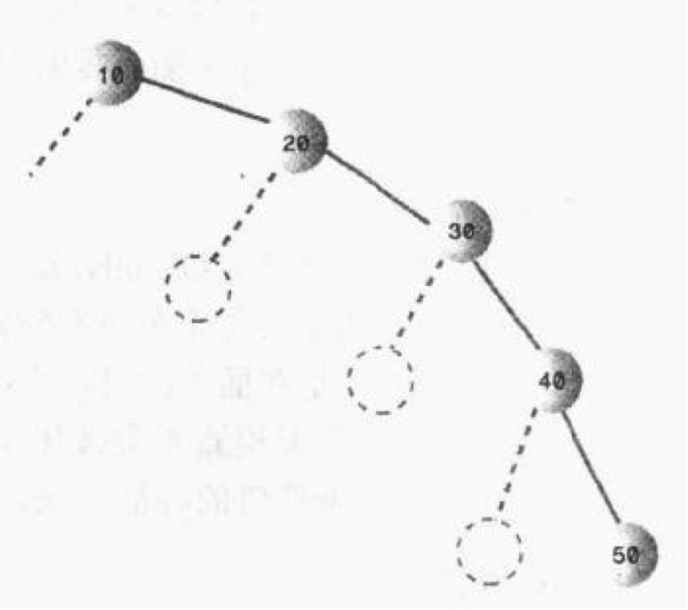

红黑树就是一种解决非平衡树的方法，它是增加了某些特点的二叉搜索树。

为了能在较短的时间内搜索一棵树，需要保证树总是平衡的（或者至少大部分是平衡的），就是说，对树中的每个节点，它左边的后代数量和它右边的后代数量应该大致相等。

> 注：本文为了直观，图中省略了黑色的 NIL 空节点，但在计算黑色高度时，这些空节点均视为黑色叶子节点。

# 2 红黑规则

当插入（或者删除）一个节点时，必须遵循一定的规则，它们被称为**红黑规则**。如果遵循这些规则，树就是平衡的：

- 每一个节点不是黑色就是红色
- 根总是黑色的
- 如果节点是红色的，则它的子节点必须是黑色的，反之则不一定成立
- 从根到叶节点或空子节点的每条路径，必须包含相同数目的黑色节点

规则 4 中的空子节点是指非叶节点可以接子节点的位置。换句话说，就是一个有右子节点的节点可能接左子节点的位置，或者是有左子节点的节点可能接右子节点的位置。

从根节点到叶节点路径上的黑色节点的数目被称为**黑色高度**。

这些约束保证了红黑树的关键性质： **从根到叶子的最长的可能路径不多于最短的可能路径的两倍长**。结果是这个树大致上是平衡的。因为插入、删除和查找等操作的最坏情况时间都与树的高度成比例，这个在高度上的理论上限允许红黑树在最坏情况下都是高效的，而不同于普通的二叉查找树。

要知道为什么这些特性确保了这个结果，可以分两步推理：

1. 根据**规则 4**，所有从根到叶子的路径包含相同数量的黑色节点（设为 `B`）。因此，最短的路径就是全由黑色节点组成的路径，长度为 `B`。
2. 根据**规则 3**，红色节点不能相邻，这意味着任何路径上两个黑色节点之间最多只能夹一个红色节点。因此，最长的路径是红黑交替的路径，长度为 `2B`。

综上，最长路径（`2B`）绝不会超过最短路径（`B`）的两倍。

# 3 算法分析

首先，当插入第一个节点时，这个节点就是根节点，所以必须是黑色的。

在增加新的节点的时候，我们先默认新节点都是红色的。为什么呢？因为**插入一个红色节点违背红黑规则的可能性比插入一个黑色节点的要小**。插入一个红色节点，肯定不会改变树的黑色高度；另外，如果插入节点的父节点是黑色节点，不会违背父子节点同时为红色的规则，如果插入节点的父节点是红色节点才会违背这一规则，这个时候就需要对树进行变换来适应规则。还有一点就是，违背规则 3（父子节点都是红色）比违背规则 4（黑色高度不同）要容易修正。

下面我们来进行一些实验，依次插入 50、25、75，就得到了下面这棵二叉树：

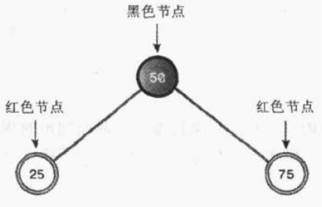

这棵树符合上面所列出的红黑规则，它是一棵平衡树。

## 3.1 颜色变换

接下来，我们再增加一个值为 12 的新节点。按照二叉搜索树的规则，12 应该插入 25 的左子节点，但是，由于我们默认新节点都是红色的，而 25 也是红色的，父子节点不能同时都为红色，这时就需要对 25 的父节点和其父节点的右子节点进行颜色变换，为什么还要对其父节点的右子节点也进行变换呢？试想，如果我们只将 25 变换成黑色而 75 保持红色不变，那么插入新节点之后，根节点的左子树的黑色高度势必会比右子树大 1，这就违背了红黑规则。

实际上，这种情况下，一般也需要将 25 的父节点变换颜色，因为此时 25 的父节点是根节点，所以保持黑色不变。

插入 12 之后，生成下面的红黑树：

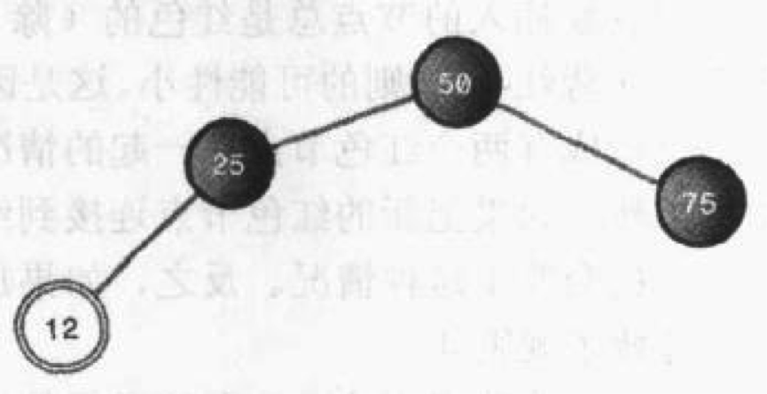

这时二叉树显得有一点不平衡，但是仍然符合红黑规则。

接下来，我们再插入一个值为 6 的新节点。

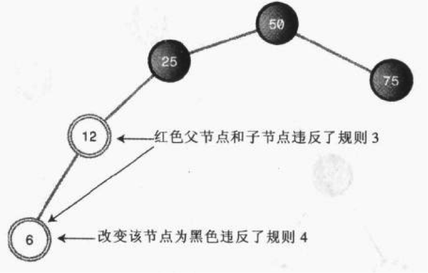

问题出现了，6 的父节点为 12，红色，而新节点也是红色，违背了红黑规则。如果将 6 变换成黑色，则 6 到根的黑色高度为 3，而 75 到根的黑色高度为 2，同样违背了红黑规则。

按照上面的经验，如果我们将 12 和 25 的颜色都变换掉呢？

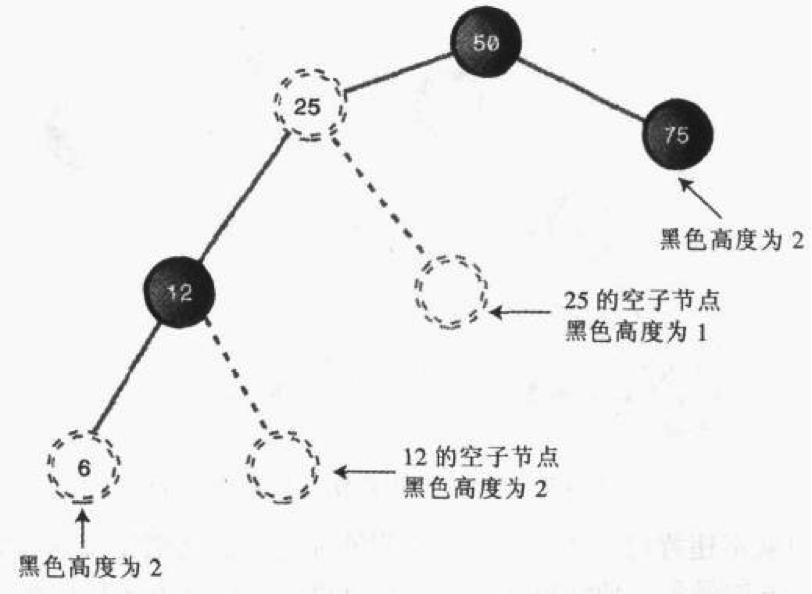

可见，仍然违背了红黑规则。

就是说，一棵树如果过分不平衡，是不可能满足红黑规则的，因为如果一条路径上的节点数超过了另一条路径上节点数的两倍，那它或者有更多的黑色节点，或者有两个相邻的红色节点，都会违背红黑规则。

我们陷入了一个困境，看来仅靠颜色变换是无法走出这个死胡同的。这时候就需要通过另外的途径来对红黑树进行变换了。

## 3.2 旋转

为了平衡一棵树，需要手动地重新排列节点，如果大部分节点都在根的左侧，就需要把一些节点移到右侧，成为右旋；如果大部分节点都在根的右侧，就需要把一些节点移到左侧，成为左旋。这里所说的左旋与右旋是相对于一棵子树的根节点而言的。

来看一个实例：

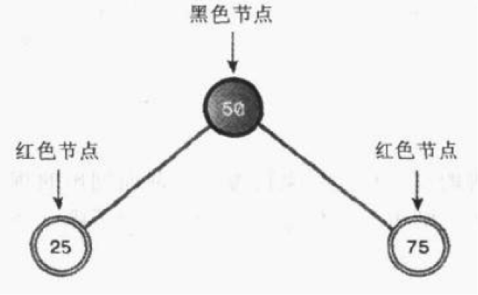

以根为中心，进行一次右旋之后的结果如下：

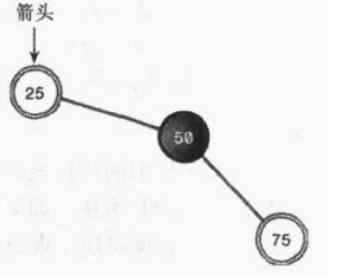

右旋的时候，以 50 为中心，周围的节点进行了顺时针旋转。

如果我们以上图中的 25 为中心，进行一次逆向操作——左旋，将 25 周围的节点进行逆时针旋转，就又回到了旋转之前的样子。

需要注意的是，旋转的时候仍然要遵循二叉搜索树的规则。比如在对第一幅图中的树进行右旋的时候，节点 25 以 50 为中心顺时针旋转，只能旋转到 50 的左上方，因为 25 比 50 小；而 75 比 50 大，不能再沿着顺时针方向转动了，所以它仍然在 50 的右下方保持相对位置不变。

无论是左旋还是右旋，比该节点小的值只能在该节点的左下方或者左上方；比该节点大的值只能在该节点的右下方或者右上方。这样才符合二叉搜索树的规则。

其实，旋转远比上面的简单例子要复杂，再来看一个例子：

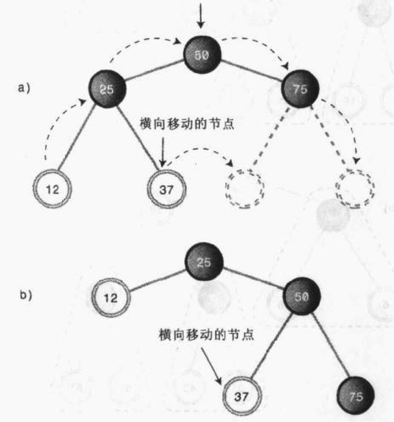

我们对一个两层、五个节点的树进行右旋，75 比 50 大，仍然在 50 的右下方，而 25 比 50 小，从 50 的左下方移到了 50 的左上方，12 作为 25 的左子节点没有变，但是所在层数由第三层变成了第二层。可以发现，以 50 为中心右旋之后，50 右侧的节点都下降了一个层级（包括 50 本身），而 50 左侧的节点都上升了一个层级。

但是，其中发生了一件奇怪的事，就是 37 从直观上来看，发生了横向移动，从左子树移动到了右子树。让我们分析一下出现这种情况的原因：左子树集体升高了一个层级，37 作为 25 的右子节点，本来也应该水涨船高，随着 25 上升一个层级，但是，此时 25 的右子节点已经被 50 先入为主地占据了，如此一来，37 只好沿着右子树重新找家，最后就只能委屈地在 50 的左下方扎根。

在上例中，37 就被称为 50 节点右旋操作的内侧子孙，而 12 就是外侧子孙。

其实，整棵子树也会发生集体的移动，比如：

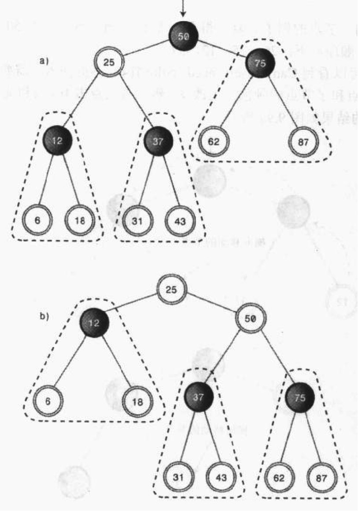

注意，这种横向移动只会发生在内侧子孙身上。

# 4 插入

插入或删除操作，都有可能改变红黑树的平衡性，利用颜色变化与旋转这两大法宝就可应对所有情况，将不平衡的红黑树变为平衡的红黑树。

在进行颜色变化或旋转的时候，往往要涉及祖孙三代节点：

- X：表示操作的基准节点
- P：代表 X 的父节点
- G：代表 X 的父节点的父节点

我们先来大体预览一下插入的过程：

- 沿着树查找插入点，如果查找过程中发现某个黑色节点的两个子节点都是红色，则执行一次颜色变换（父节点变为红色，而两个红色子节点变为黑色）。
- 第 1 步中，不会改变子树的黑色高度，但是可能会出现颜色冲突（红-红颜色冲突），执行一次或两次旋转即可解决。设红色子节点为 X，红色父节点为 P，旋转次数由 X 是 G 的内侧子孙还是外侧子孙决定。
- 找到插入点之后，设 X 为新插入的节点。如果 P 是黑色的，则不需要做任何改变，插入完成。
- 如果 P 是红色的，则发生红-红冲突。此时需要将父节点 P 变为黑色，祖父节点 G 变为红色。若 X 为外侧子孙，再以 G 为中心进行一次旋转即可；若 X 为内侧子孙，需先以 P 为中心旋转使其成为外侧子孙，再以 G 为中心进行第二次旋转。最终都可使树变为平衡的红黑树。

现在看不懂没关系，为何要这么做，我们接下来慢慢分析。

第 1 步与第 2 步看似与插入新节点没关系，其实是为了给新节点的插入扫清道路，到后面插入新节点时就会体现出来。

先来看第 1 步的详细过程：

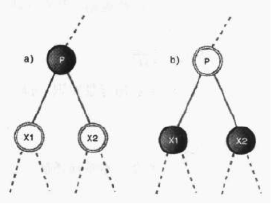

上图中，查找到 P 点，发现它的两个子节点都是红色，则进行颜色变换（如果 P 是根，则保持黑色不变）。这种变换并不会改变从根节点经 P 到叶节点或者空节点的路径上的黑色节点总数，即不会改变其黑色高度。将 P、X1、X2 看做三角形的三个顶点，颜色变换之前，经过此三角形时会增加一个黑色节点，颜色变换之后，P 变成了红色，X1、X2 变成了黑色，不论是经过 X1 还是经过 X2，还是会增加一个黑色节点。

如果 P 的父节点是黑色，则不会出现任何问题，但是，如果 P 的父节点也是红色，就会发生红-红颜色冲突，需要通过旋转来修正。发生颜色冲突时有两种情况需要区别对待。

注意，这时候我们选定红-红颜色冲突父子节点中的子节点作为基准节点，即 X。如果 X 在 P 的一侧与 P 在 G 的一侧相同，X 即为 G 的外侧子孙，反之，则为内侧子孙。

## 4.1 情况 1：X 为外侧子孙节点

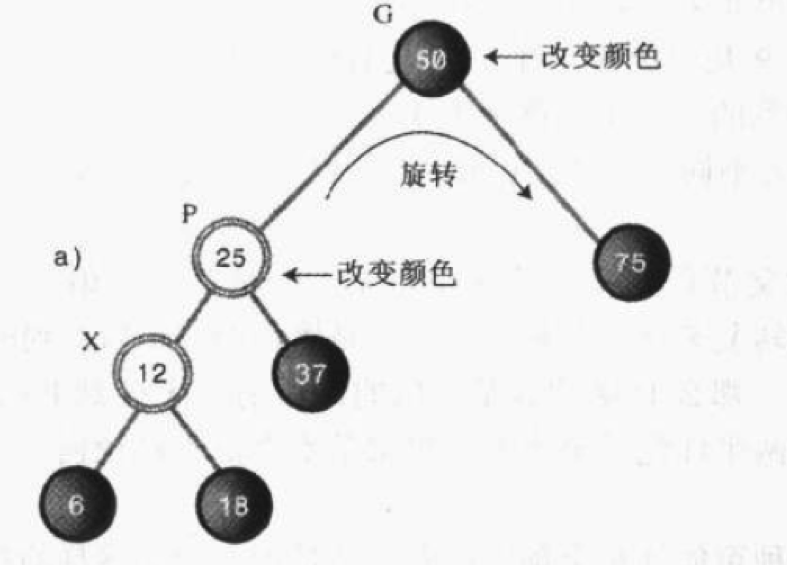

上图中，表示的是颜色变换之后的情况，12 跟 25 节点发生了颜色冲突，12 为 50 的外侧子孙。

在这种情况下需要采取三步操作：

- 改变 G 的颜色
- 改变 P 的颜色
- 以 G 为中心向 X 上升的方向旋转（本例中是右旋）

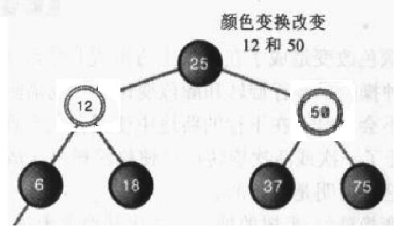

奇迹发生了，树突然之间平衡了，而且是符合红黑规则的。

需要注意的是，在本例中，由于 25 是 50 的左子节点，进行的是右旋操作，如果它是右子节点，则需要进行左旋操作。无论是左旋还是右旋，都是向着 X 上升的方向旋转。

## 4.2 情况 2：X 为内侧子孙节点

修正这种情况比较复杂一点，如果我们采取跟外侧子孙一样的做法，X 不会上移而是发生横向移动，使树变得更加不平衡。因此需要一种不同的方法来解决。

我们先要用一次旋转让 X 成为外侧子孙，然后再用一次旋转使树平衡。

这种情况需要进行四步操作：

- 改变 G 的颜色
- 改变 X 的颜色
- 以 P 为中心向 X 上升的方向旋转
- 以 G 为中心向 X 上升的方向旋转

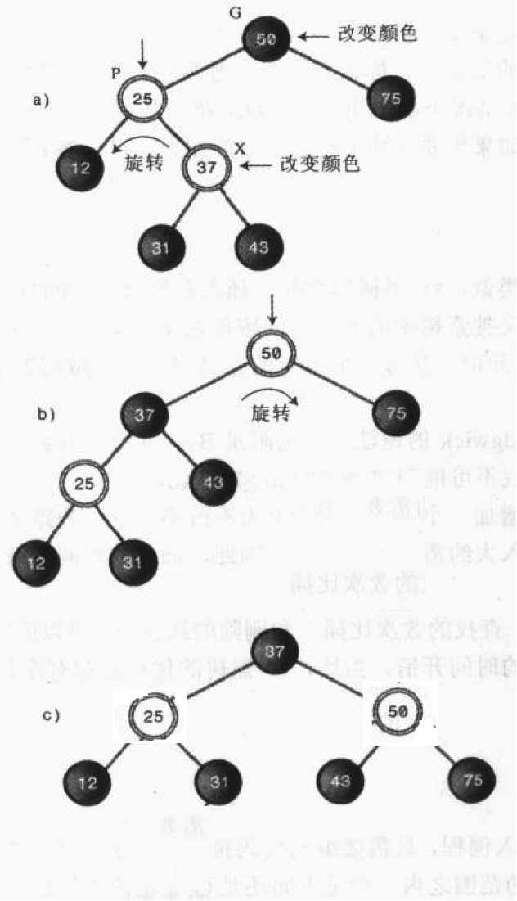

至此，前期工作已经完成，下面进行新节点的插入。在插入环节，我们以新节点为基准点，即 X。

在前面已经说过，我们总是默认新节点为红色。那么，找到插入点的时候，会有两种情况，一种是 X 的父节点 P 为黑色，直接插入即可（因为插入一个红色新节点既不会影响树的黑色高度，也不会发生颜色冲突）；另一种情况是 X 的父节点 P 也为红色，插入后会发生红-红颜色冲突，需要通过颜色变换与旋转来修正。

发生颜色冲突的时候，根据 X 是内侧子孙还是外侧子孙分别对待，处理方法与上面提到的方法类似。

外侧子孙：

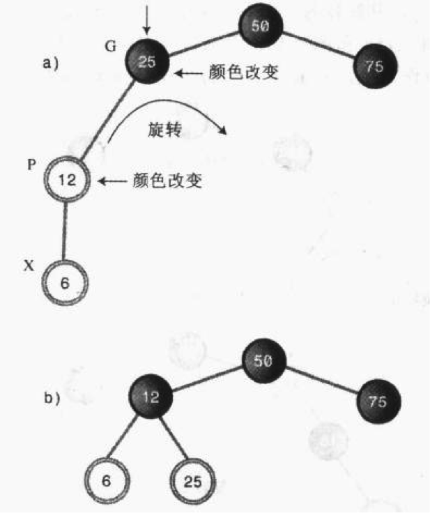

内侧子孙：

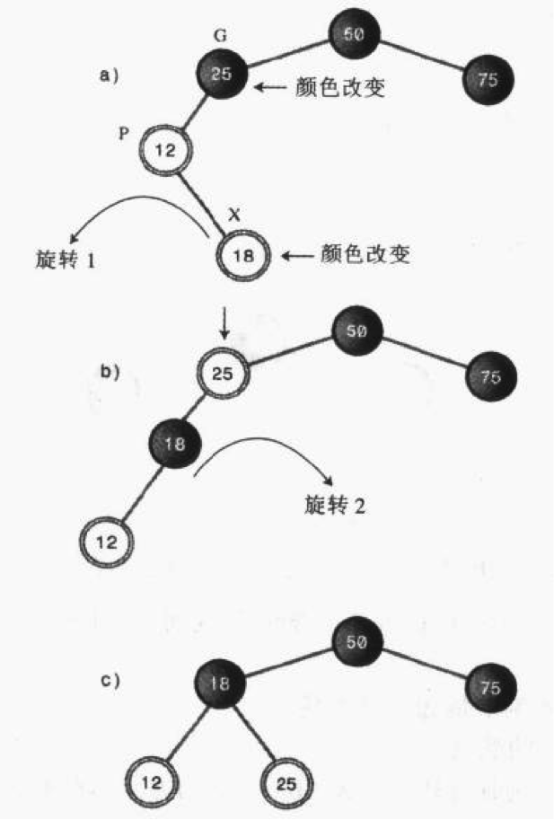

下面我们来讨论一下，是否还有其他情况。

假如 X 有一个兄弟节点 S，即 P 的另一个子节点，会使任何需要的旋转更加复杂。如果 P 为黑色，无论 X 有没有兄弟节点，都不需要旋转；如果 P 为红色，则插入之前，P 不可能有一个单独的黑色子节点，因为这样会使 S 和空子节点的黑色高度不一样。综上，插入新节点之后，不会出现 X 存在兄弟节点而且需要旋转修正的情况。

假如 P 有一个兄弟节点，即 X 的叔节点 U，也会使任何需要的旋转更加复杂。如果 P 为黑色，X 插入后不需要做任何旋转；如果 P 为红色，则 U 必须为红色，否则，G 到 P 的黑色高度与 G 到 U 的黑色高度就不同了。但是，有两个红色子节点的父节点在插入之前我们已经处理掉了，所以这种情况也不会存在。综上，插入新节点之后，不会出现 P 存在兄弟节点且需要旋转修正的情况。

到现在，就明白为什么要在寻找插入点的过程中，把有两个红色子节点的父节点的颜色变换掉，一方面是为了使树更加平衡，另一方面是大大简化了插入后的旋转操作。

# 5 删除

删除一个节点同样有可能改变树的平衡性，而且，对删除所造成的不平衡的修正，比插入的情况更加复杂。

化繁为简是算法分析中一个常用的方法。下面我们就根据欲删除节点的所有情况逐项讨论，而欲删除节点有两种可能的颜色，也需要分别对待。

为简化讨论，我们以欲删除节点在左侧的情况为例进行修正，如果欲删除节点在右侧，进行镜像的修正操作即可。

## 5.1 欲删除节点是叶子节点，即左子节点、右子节点都为空

### 5.1.1 欲删除节点为红色，父节点必为黑色，必无兄弟节点

只有下图所示两种情况，带黄色边框的为欲删除的节点：

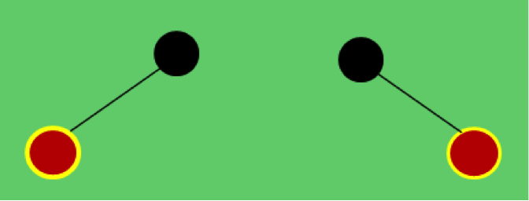

将该节点直接删除即可，所在子树的黑色高度不变，不会影响红黑树的性质。

### 5.1.2 欲删除节点为黑色，父节点可红可黑，必存在兄弟节点

为什么说黑色节点必存在兄弟节点呢？如果一个黑色节点不存在兄弟节点，无论父节点是红是黑，从该节点到父节点都会比空子节点到父节点多一个黑色高度，所以这种情况是不存在的。

下面就可能存在的情况逐个分析：

#### 5.1.2.1 父节点是红色，则兄弟节点必为黑色

- **情况 1：兄弟节点没有左子树**，修正策略如下

  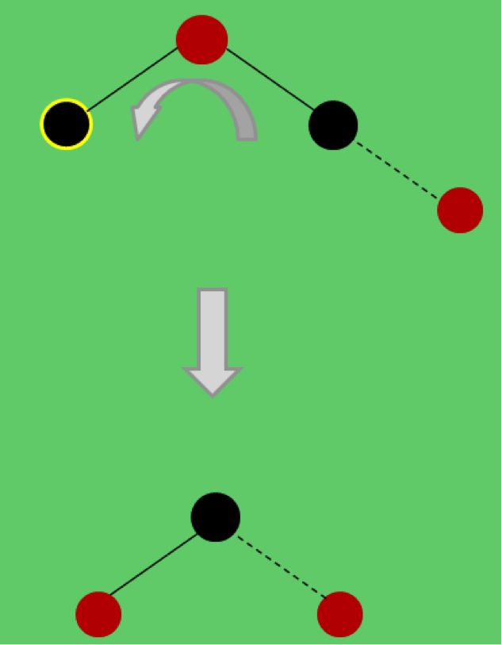

  上图中，虚线代表其连接的子节点可存在可不存在，对修正过程无影响。

- **情况 2：兄弟节点有左子树**，修正策略如下

  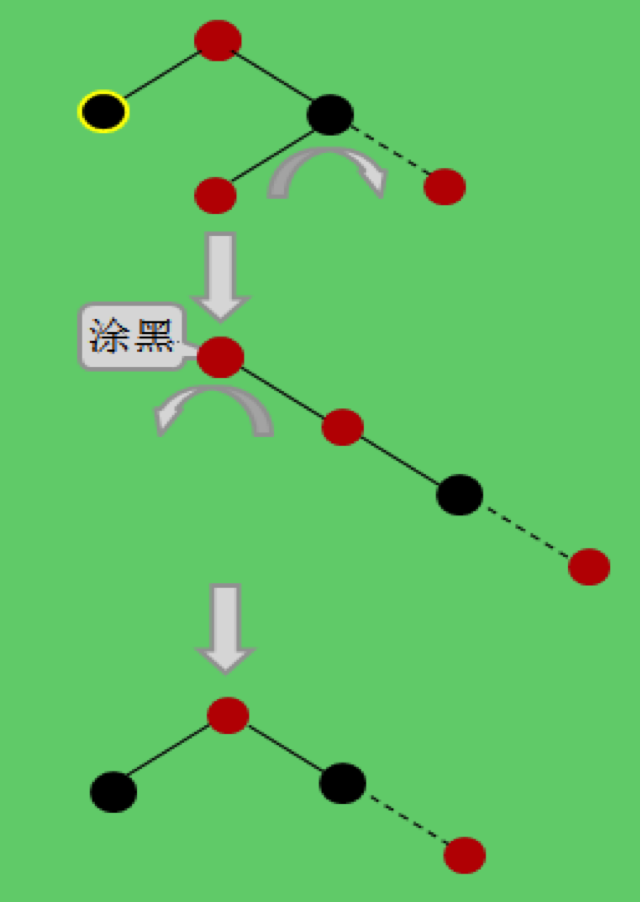

#### 5.1.2.2 父节点是黑色，则兄弟节点可红可黑

##### 兄弟节点为红色，则它必存在两个黑色子节点

与左侄节点是否有子节点相关，共三种情况。

- **情况 1：左侄节点有右子节点**，修正策略如下：

  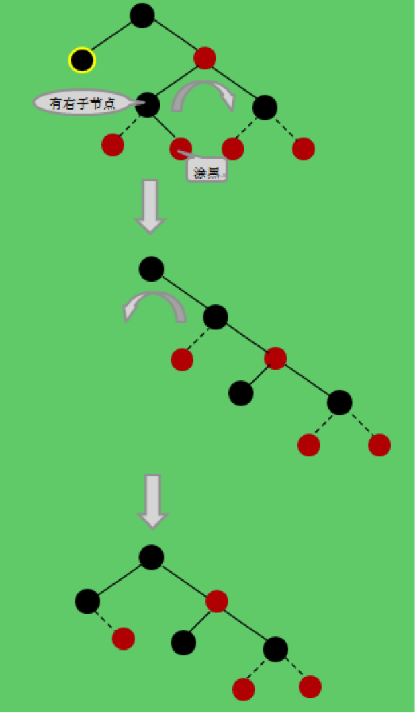

- **情况 2：左侄节点没有右子节点，只有左子节点**，修正策略如下：

  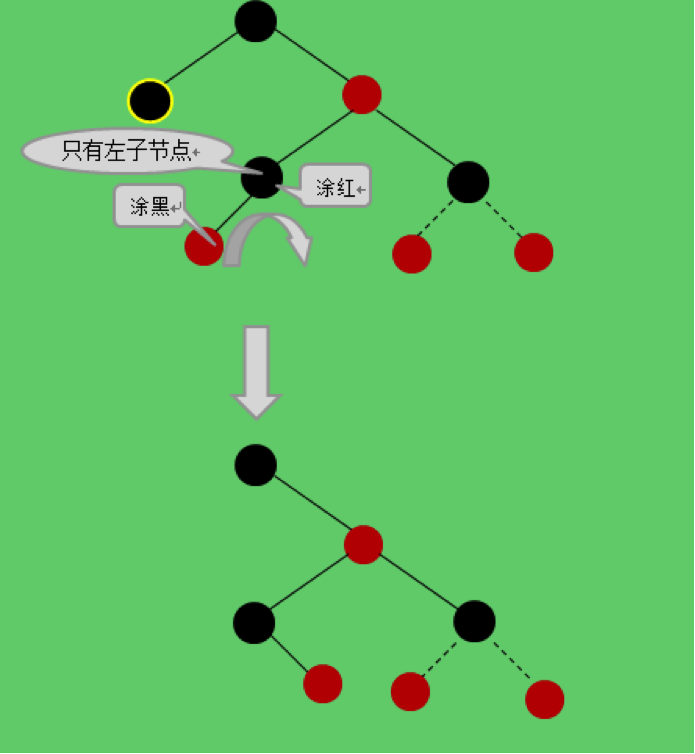

  这时，左侄节点就有了右子节点，再进行与上一种情况一样的修正。

- **情况 3：左侄节点为叶子节点**，修正策略如下：

  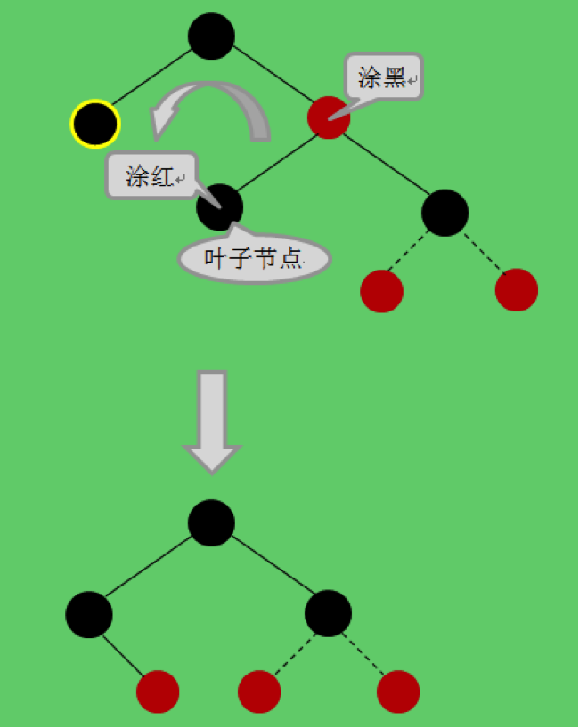

##### 兄弟节点为黑色

与兄弟节点是否有子节点相关。

- **情况 1：兄弟节点有右子节点**，修正策略如下：

  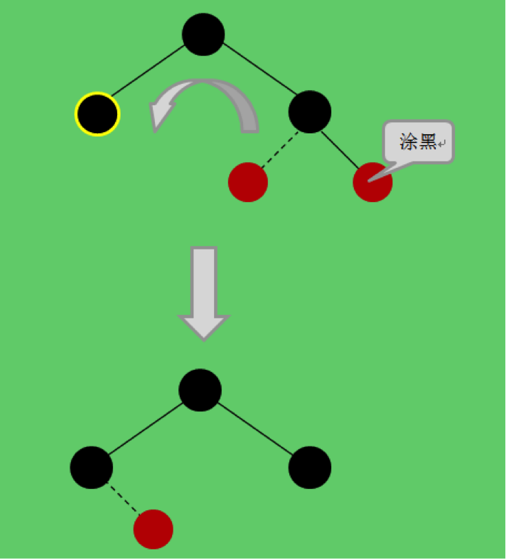

- **情况 2：兄弟节点无右子节点，只有左子节点**，修正策略如下：

  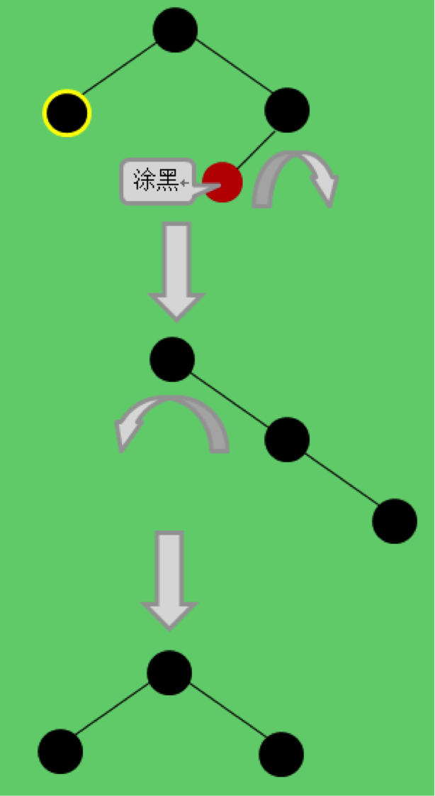

- **情况 3：兄弟节点既无左子节点，也无右子节点**，如下图所示：

  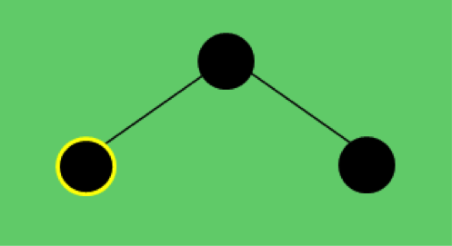

  此时，依靠该子树自身是无法解决的，因为该子树的黑色高度为 2，如果将带黄色边框的节点删除，无论如何变换颜色、旋转都无法使该子树恢复黑色高度。

  有两种解决思路：

  第一种是借助欲删除节点的祖父节点及祖父节点的子树来修正，只要祖父节点与祖父节点的另一棵子树中含有红色节点，就能通过颜色变换和旋转来修正。但是，如果祖父节点与祖父节点的另一棵子树中的节点全为黑色：

  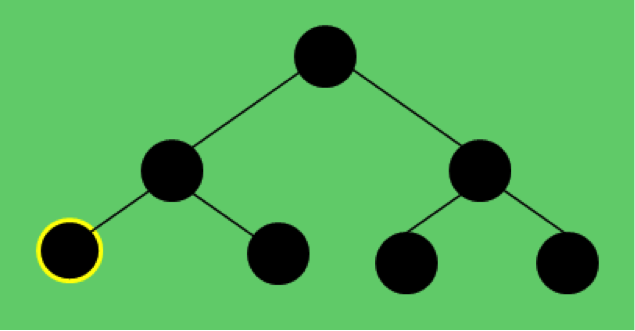

  这时，依靠该子树本身也是无法解决的，还需要借助更上层的节点。层层传递，直到根节点。如果到根节点还是不能解决，就需要采用第二种思路：降低黑色高度。

  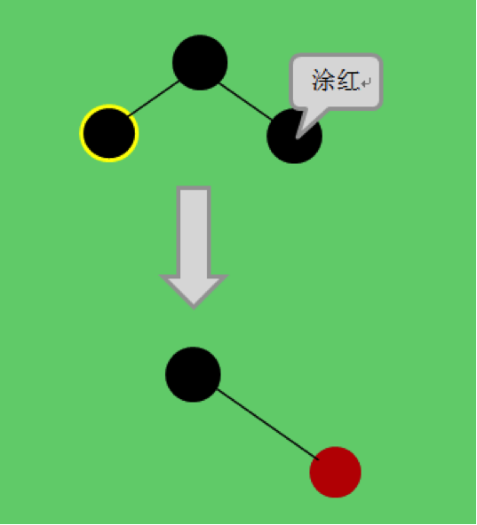

  但就这棵子树来说，确实是符合红黑规则的，但是，子树的黑色高度降低，会影响到整棵红黑树的黑色高度。

  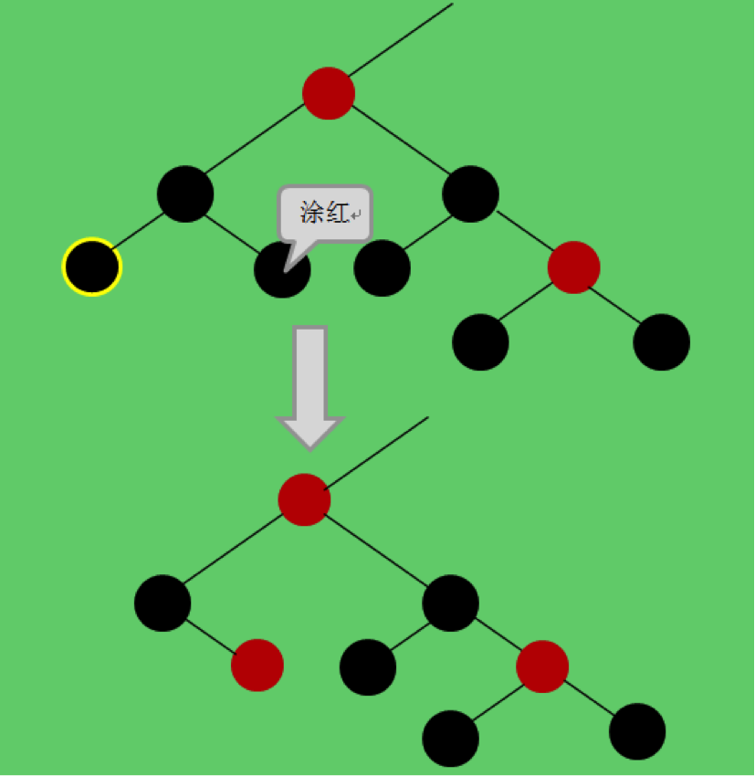

  可以看到，变换之后，左子树的黑色高度为 1，而右子树的黑色高度是 2，违背了红黑规则。这时候就需要同时降低右子树的黑色高度，并层层向上传递，直到根节点，最终使整棵树的黑色高度降低。

  但是，有的右子树是无法降低黑色高度的，比如：

  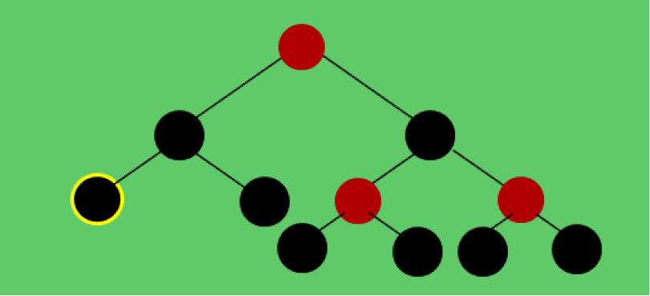

  上图中的右子树就无法降低黑色高度，但是这种情况下，右子树必存在红色节点，可以通过第一种思路解决。

  总之，结合两种思路，总是可以解决“**黑三角**”这种顽固问题的。

## 5.2 欲删除节点只有一个子节点，该节点必为黑色，子节点必为红色

红色节点要么没有子节点，要么有两个黑色子节点，所以该节点不可能为红色。
如果该节点只有一个黑色子节点，则黑色的子节点到该节点的黑色高度与空子节点到该点的黑色高度不一致，所以子节点只能为红色。

综上，只有下图所示的两种情况会出现。

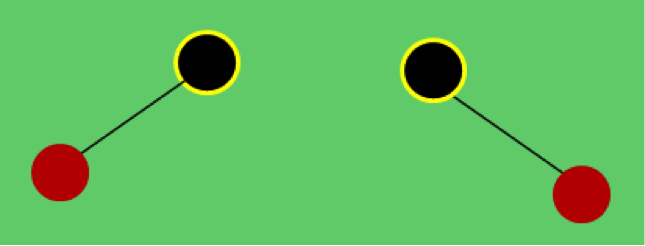

只需要将红色子节点涂黑，上移到被删除的节点位置即可。

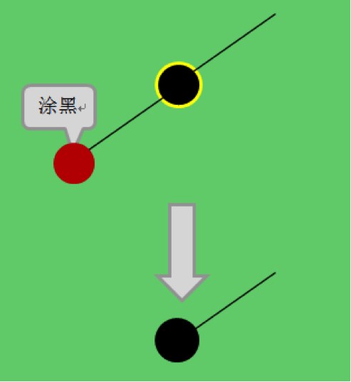

## 5.3 欲删除节点既有左子节点，又有右子节点

红黑树也属于二叉搜索树，所以要先找到欲删除节点的后继节点。后继节点的寻找过程如下：从该点的右子节点开始，如果有左子节点则跳到左子节点，层层向下，直到某个子节点没有左子节点为止。实际上就是找到比欲删除节点的关键字值大的集合中的最小值。这部分内容在二叉搜索树中已经介绍过，不再赘述。

第一步，我们要将欲删除节点与后继节点中的数据对换，如此一来，节点的删除操作就转移到了后继节点上来了。

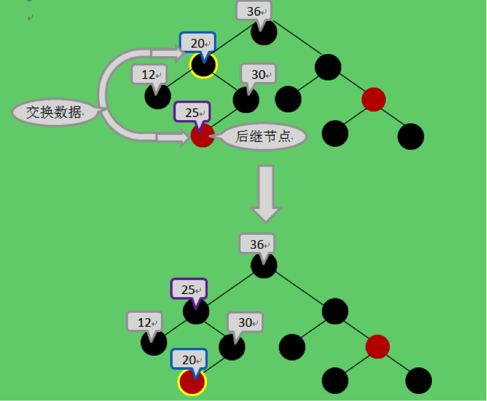

上图中，经过数据交换之后，没有改变任何节点的颜色，现在要删除的是带黄色边框的红色节点。前面已经论证，后继节点肯定是一个没有左子节点的节点，即是一个叶子节点或者只有一个右子节点的节点，而这两种情况的删除我们在之前已经分析过并给出了解决方法。

## 5.4 删除操作的宏观总结

虽然上面的删除情况分类繁多，但本质上只在做三件事：

1. **变色**：通过重新分配颜色来吸收“多出的黑色”。
2. **旋转**：通过改变拓扑结构，将复杂的兄弟节点情况转化为简单的情况。
3. **向上回溯**：如果当前子树实在无法消化这个“额外的黑色”（即黑三角问题），就把它甩给父节点，直到根节点直接染黑消除。

理解这三条主线，再回头看具体的分类讨论，就会清晰很多。