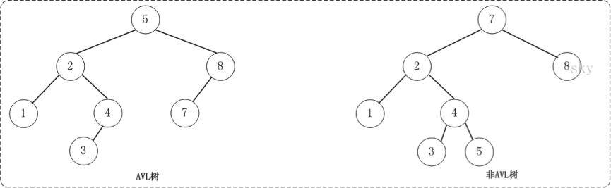
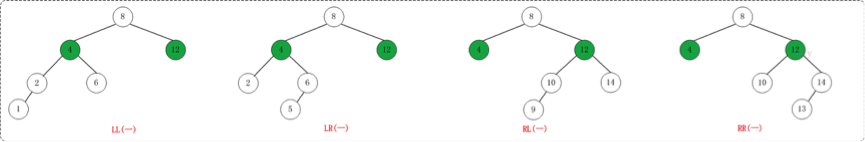
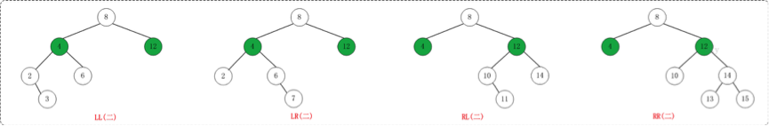
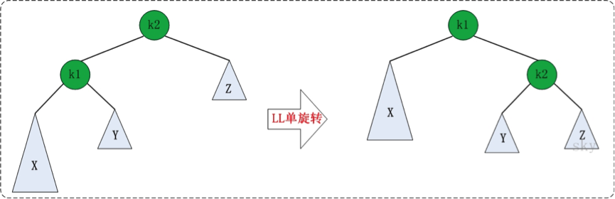
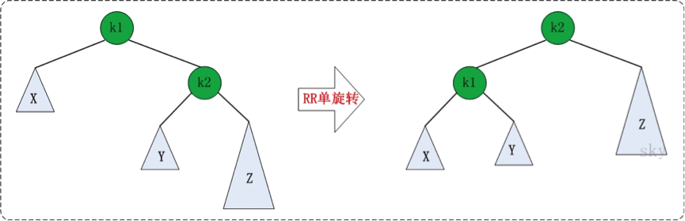
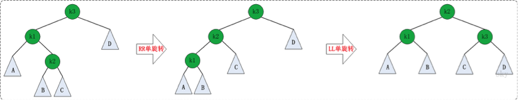

# 1 概述

AVL 树由两位科学家在 1962 年发表的论文*《An algorithm for the organization of information》*当中提出，其命名来自于它的发明者 `G.M. Adelson-Velsky` 和 `E.M. Landis` 的名字缩写。

AVL 树是最先发明的**自平衡二叉搜索树**，也被称为**高度平衡树**。相比于二叉搜索树，它的特点是：**任何节点的两个子树的最大高度差为 1**。



上面的两张图片，左边的是 AVL 树，它的任何节点的两个子树的高度差别都 ≤ 1；而右边的不是 AVL 树，因为 7 的两棵子树的高度相差为 2（以 2 为根节点的树的高度是 3，而以 8 为根节点的树的高度是 1）。

对于一般的二叉搜索树，其期望高度（即为一棵平衡树时）为 `log₂n`，其各操作的时间复杂度 `O(log₂n)` 同时也由此而决定。但是，在某些极端的情况下（如在插入的序列是有序的时），二叉搜索树将退化成近似链或链，此时，其操作的时间复杂度将退化成线性的，即 `O(n)`。我们可以通过随机化建立二叉搜索树来尽量避免这种情况。但在进行多次删除操作后，如果总是用待删除节点的后继（右子树的最小节点）来替代它，会导致右侧节点不断减少，使得树逐渐向左偏沉，最终破坏平衡性，导致操作时间复杂度升高。

例如：我们按顺序将一组数据 1、2、3、4、5、6 分别插入到一棵空二叉搜索树和 AVL 树中，插入的结果如下图：


由上图可知，同样的节点，由于插入方式不同导致树的高度也有所不同。特别是在待插入节点个数很多且正序的情况下，会导致二叉树的高度是 `O(n)`，而 AVL 树就不会出现这种情况，树的高度始终是 `O(log₂n)`。高度越小，对树的一些基本操作的时间复杂度就会越小。

AVL 树不仅是一棵二叉搜索树，它还有其他的性质。如果我们按照一般的二叉搜索树的插入方式可能会破坏 AVL 树的平衡性。同理，在删除的时候也有可能会破坏树的平衡性，所以我们要做一些特殊的旋转处理来重新恢复平衡。

# 2 旋转

如果在 AVL 树中进行插入或删除节点后，可能导致 AVL 树失去平衡。这种失去平衡的情况可以概括为 4 种姿态：LL（左左）、LR（左右）、RR（右右）和 RL（右左）。下面给出它们的示意图：



上图中的 4 棵树都是“失去平衡的 AVL 树”，从左往右的情况依次是：LL、LR、RL、RR。除了上面的情况之外，还有其他的失去平衡的 AVL 树，如下图：



上面的两张图都是为了便于理解，而列举的关于“失去平衡的 AVL 树”的例子。总的来说，AVL 树失去平衡时的情况一定是 LL、LR、RL、RR 这 4 种之一，它们都有各自的定义：

- **LL**：LeftLeft，也称为“左左”。插入或删除一个节点后，根节点的左子树的左子树还有非空子节点，导致“根的左子树的高度”比“根的右子树的高度”大 2，导致 AVL 树失去了平衡。
  例如，在上面的 LL 情况中，由于“根节点（8）的左子树（4）的左子树（2）还有非空子节点”，而“根节点（8）的右子树（12）没有子节点”，导致“根节点（8）的左子树（4）高度”比“根节点（8）的右子树（12）的高度”高 2。
- **LR**：LeftRight，也称为“左右”。插入或删除一个节点后，根节点的左子树的右子树还有非空子节点，导致“根的左子树的高度”比“根的右子树的高度”大 2，导致 AVL 树失去了平衡。
  例如，在上面的 LR 情况中，由于“根节点（8）的左子树（4）的右子树（6）还有非空子节点”，而“根节点（8）的右子树（12）没有子节点”，导致“根节点（8）的左子树（4）高度”比“根节点（8）的右子树（12）的高度”高 2。
- **RL**：RightLeft，称为“右左”。插入或删除一个节点后，根节点的右子树的左子树还有非空子节点，导致“根的右子树的高度”比“根的左子树的高度”大 2，导致 AVL 树失去了平衡。
  例如，在上面的 RL 情况中，由于“根节点（8）的右子树（12）的左子树（10）还有非空子节点”，而“根节点（8）的左子树（4）没有子节点”，导致“根节点（8）的右子树（12）高度”比“根节点（8）的左子树（4）的高度”高 2。
- **RR**：RightRight，称为“右右”。插入或删除一个节点后，根节点的右子树的右子树还有非空子节点，导致“根的右子树的高度”比“根的左子树的高度”大 2，导致 AVL 树失去了平衡。
  例如，在上面的 RR 情况中，由于“根节点（8）的右子树（12）的右子树（14）还有非空子节点”，而“根节点（8）的左子树（4）没有子节点”，导致“根节点（8）的右子树（12）高度”比“根节点（8）的左子树（4）的高度”高 2。

如果在 AVL 树中进行插入或删除节点后，可能导致 AVL 树失去平衡。AVL 失去平衡之后，可以通过旋转使其恢复平衡，下面分别介绍“LL（左左）、LR（左右）、RR（右右）和 RL（右左）”这 4 种情况对应的旋转方法。

## 2.1 LL 的旋转

LL 失去平衡的情况，可以通过一次旋转让 AVL 树恢复平衡。如下图：



图中左边是旋转之前的树，右边是旋转之后的树。从中可以发现，旋转之后的树又变成了 AVL 树，而且该旋转只需要一次即可完成。

对于 LL 旋转，你可以这样理解为：LL 旋转是围绕“失去平衡的 AVL 根节点”进行的，也就是节点 k2；而且由于是 LL 情况，即左左情况，就用手抓着“左孩子，即 k1”使劲摇。将 k1 变成根节点，k2 变成 k1 的右子树，“k1 的右子树”变成“k2 的左子树”。

## 2.2 RR 的旋转

理解了 LL 之后，RR 就相当容易理解了。RR 是与 LL 对称的情况！RR 恢复平衡的旋转方法如下：



图中左边是旋转之前的树，右边是旋转之后的树。RR 旋转也只需要一次即可完成。

## 2.3 LR 的旋转

LR 失去平衡的情况，需要经过两次旋转才能让 AVL 树恢复平衡。如下图：



第一次旋转是围绕“k1”进行的“RR 旋转”，第二次是围绕“k3”进行的“LL 旋转”。

## 2.4 RL 的旋转

RL 是与 LR 的对称情况！RL 恢复平衡的旋转方法如下：


第一次旋转是围绕“k3”进行的“LL 旋转”，第二次是围绕“k1”进行的“RR 旋转”。

# 3 实例

```java
public class AVLTree {

	public AVLTreeNode root; // 根节点

	/**
	 * 插入操作的入口
	 *
	 * @param insertValue
	 */
	public void insert(long insertValue) {
		root = insert(root, insertValue);
	}

	/**
	 * 插入的递归实现
	 *
	 * @param subTree
	 * @param insertValue
	 * @return
	 */
	private AVLTreeNode insert(AVLTreeNode subTree, long insertValue) {
		if (subTree == null) {
			return new AVLTreeNode(insertValue, null, null);
		}

		if (insertValue < subTree.value) { // 插入左子树

			subTree.left = insert(subTree.left, insertValue);
			if (unbalanceTest(subTree)) { // 插入后造成失衡
				if (insertValue < subTree.left.value) { // LL 型失衡
					subTree = leftLeftRotation(subTree);
				} else { // LR 型失衡
					subTree = leftRightRotation(subTree);
				}
			}

		} else if (insertValue > subTree.value) { // 插入右子树

			subTree.right = insert(subTree.right, insertValue);
			if (unbalanceTest(subTree)) { // 插入后造成失衡
				if (insertValue < subTree.right.value) { // RL 型失衡
					subTree = rightLeftRotation(subTree);
				} else { // RR 型失衡
					subTree = rightRightRotation(subTree);
				}
			}

		} else {
			throw new RuntimeException("duplicate value: " + insertValue);
		}

		return subTree;
	}

	/**
	 * RL 型旋转
	 *
	 * @param k1 子树根节点
	 * @return
	 */
	private AVLTreeNode rightLeftRotation(AVLTreeNode k1) {
		k1.right = leftLeftRotation(k1.right);

		return rightRightRotation(k1);
	}

	/**
	 * RR 型旋转
	 *
	 * @param k1 子树根节点
	 * @return
	 */
	private AVLTreeNode rightRightRotation(AVLTreeNode k1) {
		AVLTreeNode k2;

		k2 = k1.right;
		k1.right = k2.left;
		k2.left = k1;

		return k2;
	}

	/**
	 * LR 型旋转
	 *
	 * @param k3
	 * @return
	 */
	private AVLTreeNode leftRightRotation(AVLTreeNode k3) {
		k3.left = rightRightRotation(k3.left);

		return leftLeftRotation(k3);
	}

	/**
	 * LL 型旋转
	 *
	 * @param k2
	 * @return
	 */
	private AVLTreeNode leftLeftRotation(AVLTreeNode k2) {
		AVLTreeNode k1;

		k1 = k2.left;
		k2.left = k1.right;
		k1.right = k2;

		return k1;
	}

	/**
	 * 获取树的深度
	 *
	 * @param treeRoot 根节点
	 * @param initDeep 初始深度
	 * @return
	 */
	private static int getDepth(AVLTreeNode treeRoot, int initDeep) {
		if (treeRoot == null) {
			return initDeep;
		}
		int leftDeep = getDepth(treeRoot.left, initDeep + 1);
		int rightDeep = getDepth(treeRoot.right, initDeep + 1);
		return Math.max(leftDeep, rightDeep);
	}

	/**
	 * 判断是否失衡
	 *
	 * @param treeRoot
	 * @return
	 */
	private boolean unbalanceTest(AVLTreeNode treeRoot) {
		int leftHeight = getDepth(treeRoot.left, 0);
		int rightHeight = getDepth(treeRoot.right, 0);
		int diff = Math.abs(leftHeight - rightHeight);
		return diff > 1;
	}

	/**
	 * 删除操作的入口
	 *
	 * @param value
	 */
	public void remove(long value) {
		root = remove(root, value);
	}

	/**
	 * 删除操作的递归实现
	 *
	 * @param tree
	 * @param value
	 * @return
	 */
	private AVLTreeNode remove(AVLTreeNode tree, long value) {
		if (tree == null) {
			return null;
		}

		if (value < tree.value) { // 要删除的节点在左子树

			tree.left = remove(tree.left, value);

		} else if (value > tree.value) { // 要删除的节点在右子树

			tree.right = remove(tree.right, value);

		} else { // 要删除的节点就是本身

			if (tree.left != null && tree.right != null) { // 左右子树都存在
				if (getDepth(tree.left, 0) > getDepth(tree.right, 0)) {
					/*
					 * 如果 tree 的左子树比右子树高：
					 *
					 * 1. 找出 tree 的左子树中的最大节点
					 * 2. 将该最大节点的值赋值给 tree。
					 * 3. 删除该最大节点。
					 * 这类似于用“tree 的左子树中最大节点”做“tree”的替身
					 * 采用这种方式的好处是：删除“tree 的左子树中最大节点”之后，AVL 树更容易保持平衡
					 */
					AVLTreeNode max = getMaxNode(tree.left);
					tree.value = max.value;
					tree.left = remove(tree.left, max.value);
				} else {
					/*
					 * 如果 tree 的左子树不高于右子树：
					 * 1. 找出 tree 的右子树中的最小节点
					 * 2. 将该最小节点的值赋值给 tree。
					 * 3. 删除该最小节点。
					 * 这类似于用“tree 的右子树中最小节点”做“tree”的替身
					 * 采用这种方式的好处是：删除“tree 的右子树中最小节点”之后，AVL 树更容易保持平衡
					 */
					AVLTreeNode min = getMinNode(tree.right);
					tree.value = min.value;
					tree.right = remove(tree.right, min.value);

				}

			} else {

				tree = tree.left == null ? tree.right : tree.left;

			}
		}

		// ================= 以下为平衡维护逻辑 =================
		if (tree == null) {
			return null;
		}

		if (unbalanceTest(tree)) { // 删除后造成失衡
			int leftHeight = getDepth(tree.left, 0);
			int rightHeight = getDepth(tree.right, 0);

			if (leftHeight > rightHeight) { // L 型失衡
				int llHeight = tree.left != null ? getDepth(tree.left.left, 0) : -1;
				int lrHeight = tree.left != null ? getDepth(tree.left.right, 0) : -1;
				if (llHeight >= lrHeight) {
					tree = leftLeftRotation(tree); // LL 型失衡
				} else {
					tree = leftRightRotation(tree); // LR 型失衡
				}
			} else { // R 型失衡
				int rlHeight = tree.right != null ? getDepth(tree.right.left, 0) : -1;
				int rrHeight = tree.right != null ? getDepth(tree.right.right, 0) : -1;
				if (rrHeight >= rlHeight) {
					tree = rightRightRotation(tree); // RR 型失衡
				} else {
					tree = rightLeftRotation(tree); // RL 型失衡
				}
			}
		}
		// ====================================================

		return tree;
	}

	/**
	 * 获取值最大的节点
	 *
	 * @param node
	 * @return
	 */
	private AVLTreeNode getMaxNode(AVLTreeNode node) {
		if (node == null) {
			return null;
		}

		if (node.right != null) {
			return getMaxNode(node.right);
		} else {
			return node;
		}
	}

	/**
	 * 获取值最小的节点
	 *
	 * @param node
	 * @return
	 */
	private AVLTreeNode getMinNode(AVLTreeNode node) {
		if (node == null) {
			return null;
		}

		if (node.left != null) {
			return getMinNode(node.left);
		} else {
			return node;
		}
	}

}

// AVL 树的节点
class AVLTreeNode {
	long value; // 节点存储的数值
	AVLTreeNode left; // 左孩子
	AVLTreeNode right; // 右孩子

	public AVLTreeNode(long value, AVLTreeNode left, AVLTreeNode right) {
		this.value = value;
		this.left = left;
		this.right = right;
	}
}

```

测试类：

```java
	/**
	 * 前序遍历
	 *
	 * @param currentRoot
	 */
	public static void preorder(AVLTreeNode currentRoot) {
		if (currentRoot != null) {
			System.out.print(currentRoot.value + "\t");
			preorder(currentRoot.left);
			preorder(currentRoot.right);
		}
	}

	public static void main(String[] args) {
		AVLTree tree = new AVLTree();
		int[] arr = { 3, 2, 1, 4, 5, 6, 7, 16, 15, 14, 13, 12, 11, 10, 8, 9 };
		for (int a : arr) {
			tree.insert(a);
		}
		preorder(tree.root);

	}
```

打印结果如下：

`6	4	2	1	3	5	15	11	9	8	10	13	12	14	16	7`

补充说明：上面的实现为了便于理解，在判断失衡时通过 `getDepth` 实时计算子树高度，时间复杂度为 `O(n)`。标准的 AVL 实现会在每个节点中维护一个 `height` 字段，在插入、删除、旋转时同步更新它，这样判断失衡只需直接读取子节点的 `height`，时间复杂度为 `O(1)`，从而保证单次操作的时间复杂度稳定在 `O(log n)`。