# 1 2-3-4 树

在二叉树中，每个节点有一个数据项，最多有两个子节点。如果允许每个节点拥有更多的数据项和更多的子节点，就是**多叉树**（multiway tree）。

2-3-4 树是一种 4 阶多叉树。它和红黑树一样是平衡树，可以保证在 `O(log₂n)` 的时间内完成查找、插入和删除操作。它容易实现，但效率比红黑树稍差。

下图展示了一棵 2-3-4 树：

它有如下特点：

- 每个节点可以保存一个、两个或者三个数据项。
- 底层的六个节点都是叶节点，所有叶节点都位于同一层。
- 非叶节点的子节点总数总是比它含有的数据项多 1 个。

2-3-4 树中的 2、3、4 指的是一个节点可能含有的子节点数。非叶节点有以下三种情况：

- 有一个数据项的节点总是有两个子节点。
- 有两个数据项的节点总是有三个子节点。
- 有三个数据项的节点总是有四个子节点。

上述重要的关系决定了 2-3-4 树的结构。叶节点没有子节点，但可能含有一个、两个或者三个数据项；空节点不允许存在。在 2-3-4 树中，不允许节点只有一个链接。含有一个数据项的非叶节点必须有两个链接；叶节点没有链接。

如下图所示，有两个链接的节点被称为 2-节点，有三个链接的节点被称为 3-节点，有四个链接的节点被称为 4-节点。

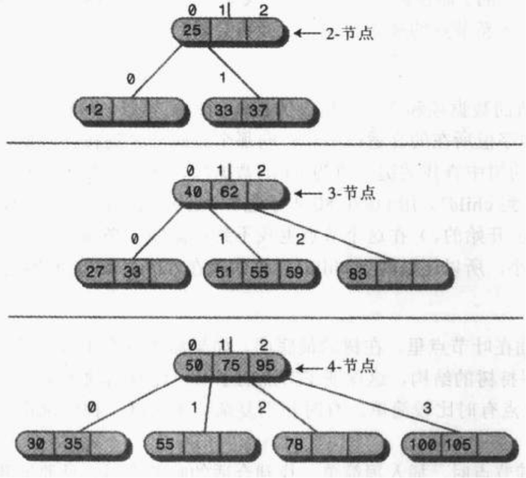

树结构中很重要的一点是链接与节点数据项中 key 的关系。二叉树中，所有 key 比某个节点值小的节点都在左子树中，所有 key 比该节点值大的节点都在右子树中。2-3-4 树的规则与之类似：

## 1.1 插入

- 在标准的不允许重复元素的 2-3-4 树中，如果已存在当前插入的 key，则插入失败；否则，最终一定在叶节点中执行插入操作。
- 如果待插入节点不是 4-节点，那么直接在该节点插入。
- 如果待插入节点是 4-节点，应先分裂该节点，再插入。一个 4-节点可以分裂成一个根节点和两个子节点（这三个节点各含一个 key），然后在相应的子节点中插入。将分裂形成的根节点中的 key 视为要向上层插入的 key，并重复第 2 步和第 3 步。

每次对 4-节点进行分裂都会多出一个分支；如果插入操作导致根节点分裂，则 2-3-4 树会生长一层。

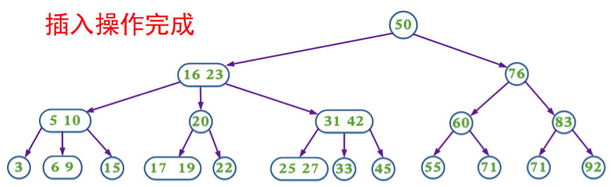

## 1.2 带预分裂的插入

上面的插入操作在某些情况下需要不断回溯来调整树的结构，以达到平衡。为了消除回溯过程，可以在插入搜索路径中采取预分裂：遇到 4-节点就分裂，分裂后形成的根节点中的 key 上移，并与父节点中的 key 合并。这样可以保证找到待插入节点时可以直接插入（即该节点一定不是 4-节点）。

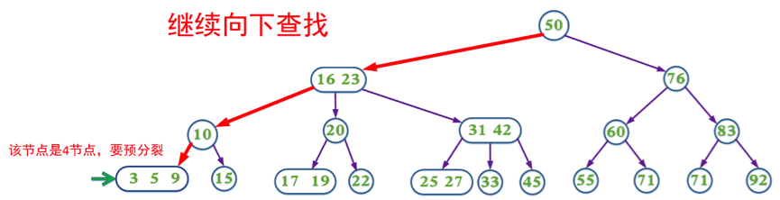

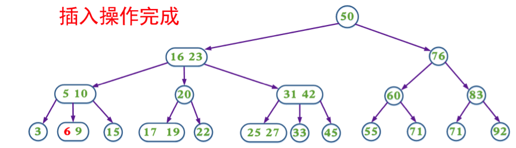

## 1.3 删除

- 如果 2-3-4 树中不存在当前需要删除的 key，则删除失败。
- 如果当前需要删除的 key 不位于叶节点上，则用后继 key 覆盖它，并在后继 key 所在的子树中删除该后继 key。
- 如果当前需要删除的 key 位于叶节点上：
  - 如果该节点不是 2-节点，删除 key，结束。
  - 如果该节点是 2-节点，需要删除该节点中的 key，并执行下列调整：
    - 如果兄弟节点不是 2-节点，则父节点中的 key 下移到该节点，兄弟节点中的一个 key 上移。
    - 如果兄弟节点是 2-节点，且父节点是 3-节点或 4-节点，则父节点中的 key 与兄弟节点合并。
    - 如果兄弟节点和父节点都是 2-节点，则父节点中的 key 与兄弟节点中的 key 合并，形成一个 3-节点。将此节点视为当前节点，并重复上述调整过程。

如果在 2-节点（叶节点）中删除 key，每次删除会减少一个分支。如果删除操作导致根节点参与合并，2-3-4 树会降低一层。

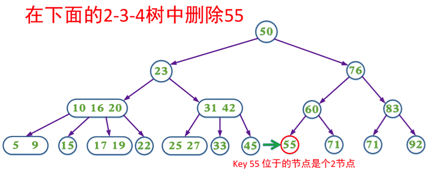

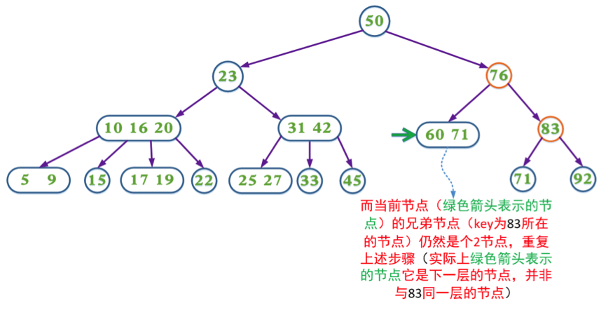

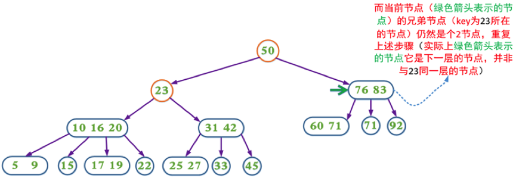

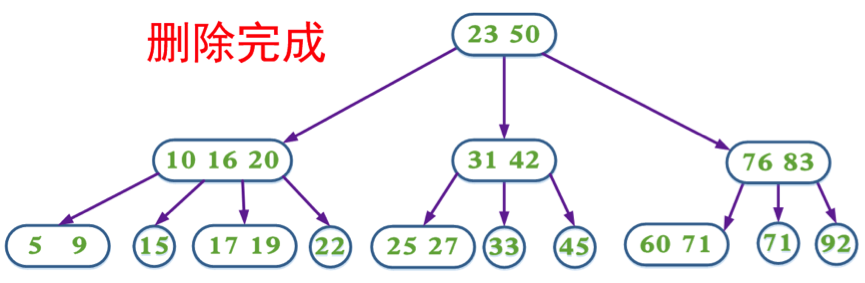

## 1.4 带预合并的删除

在删除过程中，同样可以采取预合并操作：在删除搜索路径中（根节点除外，因为根节点没有兄弟节点和父节点），如果当前节点是 2-节点且兄弟节点也是 2-节点，就将父节点中的 key 下移，与当前节点和兄弟节点合并；如果兄弟节点不是 2-节点，则将父节点的 key 下移，同时将兄弟节点中的一个 key 上移。这样可以保证找到待删除 key 所在的节点时可以直接删除（即该节点一定不是 2-节点）。

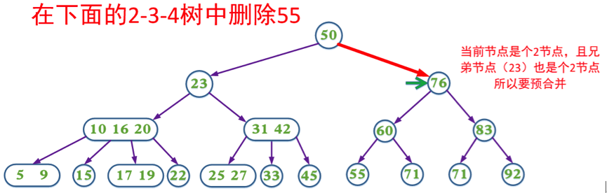

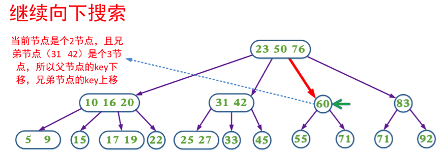

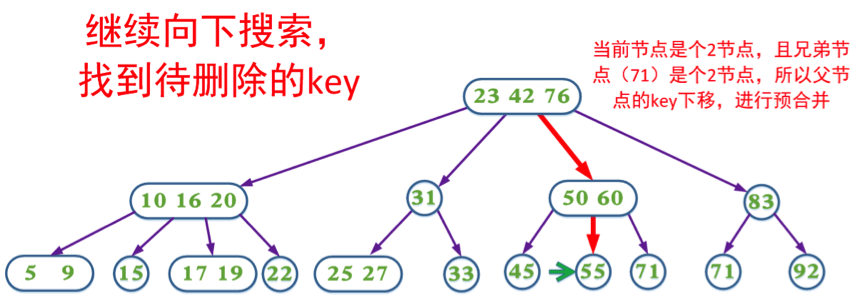

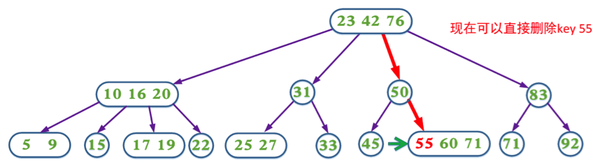

# 2 2-3 树

2-3 树也是一种多叉树，与 2-3-4 树类似，至今仍被许多应用程序使用。一些用于 2-3 树的技术会在 B-树中应用。

2-3 树比 2-3-4 树少一个数据项和一个子节点。节点可以保存一个或者两个数据项；叶节点有 0 个子节点，非叶节点有 2 个或者 3 个子节点。除此之外，父节点和子节点中 key 值的排列顺序与 2-3-4 树相同。

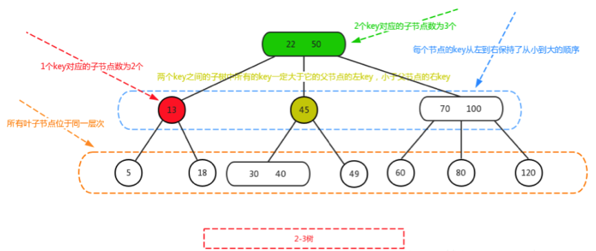

不同的是，2-3 树通常采用自底向上的分裂方式，较少使用预分裂；且其节点分裂必须在插入新数据项导致溢出时才触发。

## 2.1 插入

- 在标准的不允许重复元素的 2-3 树中，如果已存在当前插入的 key，则插入失败；否则，最终一定在叶节点中执行插入操作。
- 如果待插入节点只有一个 key，则直接插入即可。
- 如果待插入节点有两个 key，则对节点进行分裂。两个 key 加上待插入的 key 按序构成三个 key，其中中间 key 上升为父节点，另外两个 key 分别成为两个子节点中的 key。将上升的 key 视为要向上层插入的 key，并重复第 2 步和第 3 步，直到满足 2-3 树的定义性质。

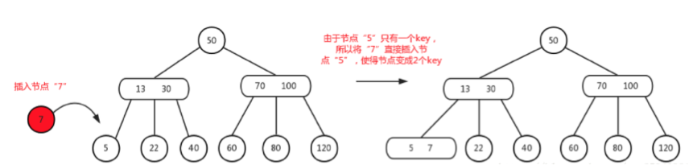

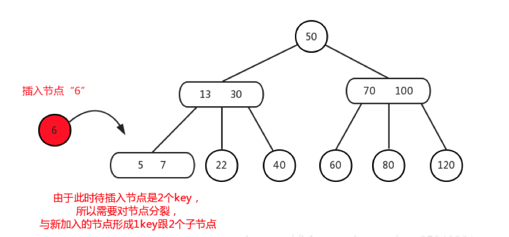

## 2.2 删除

2-3 树有四种节点：

- 仅有一个 key 的叶节点。
- 有两个 key 的叶节点。
- 仅有一个 key 的非叶节点。
- 有两个 key 的非叶节点。

即一个 key 与两个 key 的节点，以及是否为叶节点的组合。下面从简单到复杂的情况开始分析：

1. 当删除的节点是有两个 key 的叶节点时，直接删除目标 key 即可。原来的两 key 叶节点变成一个 key 的叶节点，仍符合 2-3 树的定义。

2. 当删除的节点是有两个 key 的非叶节点时，使用中序遍历找到待删除节点的后继节点，并用后继 key 替换待删除的 key。这样就将问题转化为删除叶节点中的 key：如果该叶节点有两个 key，则按情况 1 处理；如果该节点只有一个 key，则按情况 4 处理。

3. 当删除的节点是只有一个 key 的非叶节点时，操作与情况 2 相同：使用中序遍历找到后继节点并替换待删除的 key，将问题转化为删除叶节点中的 key。

4. 当删除的节点是只有一个 key 的叶节点时，删除后树将不满足 2-3 树的性质，需要调整。调整取决于当前待删除节点的兄弟节点和父节点分别有一个 key 还是两个 key：

   1. 当父节点有一个 key（即此时仅有一个兄弟节点），且兄弟节点有两个 key 时，将兄弟节点的一个 key 上移到父节点，并将父节点中的 key 下移到当前节点。此时树满足 2-3 树的定义，调整完成。

   2. 当父节点有一个 key，兄弟节点也只有一个 key 时，将父节点与兄弟节点合并，并将合并后的节点视为当前节点。重复情况 4 的判断，直到满足 2-3 树的定义。

   3. 当父节点有两个 key 时，当前节点有两个兄弟节点。删除节点的位置有左、中、右三种可能，另外两个兄弟节点分别有一个 key 或两个 key，因此一共有 `3 × 4 = 12` 种情况。但无论哪种情况，核心的调整动作只有两种：一种是**合并（Merge）**，即父节点中的 key 下移并与子节点合并；另一种是**借（Rotate）**，即父节点中的 key 下移，同时有两个 key 的子节点上移一个 key 到父节点。下面用 i～iv 四类情况覆盖这 12 种场景：

      - i. 若删除的是左或右节点，且中间节点只有一个 key，则父节点的一个 key 下移，与中间节点合并。此时父节点有一个 key、两个子节点，树满足 2-3 树的定义，调整完成。

      - ii. 若删除的是左或右节点，且中间节点有两个 key，则父节点的一个 key 下移，中间节点的一个 key 上移到父节点。此时父节点有两个 key、三个子节点，树满足 2-3 树的定义，调整完成。

      - iii. 若删除的是中间节点，且右节点只有一个 key，则父节点的一个 key 下移，与右节点合并。此时父节点有一个 key、两个子节点，树满足 2-3 树的定义，调整完成。

      - iv. 若删除的是中间节点，且右节点有两个 key，则父节点的一个 key 下移，右节点的一个 key 上移到父节点。此时父节点有两个 key、三个子节点，树满足 2-3 树的定义，调整完成。

综述：i 和 ii 分别考虑删除左或右节点、中间节点有一个或两个 key、另一兄弟节点有一个或两个 key 的情况，共 `2 × 2 × 2 = 8` 种；iii 和 iv 分别考虑删除中间节点、右节点有一个或两个 key、左节点有一个或两个 key 的情况，共 `1 × 2 × 2 = 4` 种。因此共 `4 + 8 = 12` 种场景，而每种场景最终都归结为上述“合并”或“借”两种操作之一。

最简单的是情况 1：待删除的节点有两个 key，直接删除节点中的 key“5”即可：

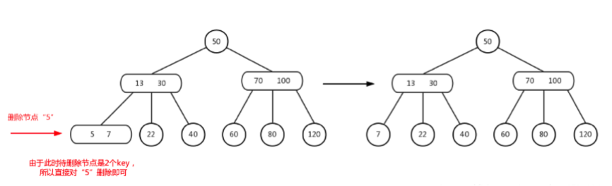

若删除节点属于情况 2，如下图所示，删除“100”。此时“100”位于有两个 key 的非叶节点中，找到后继节点“120”，用“120”替换“100”，然后删除“120”：

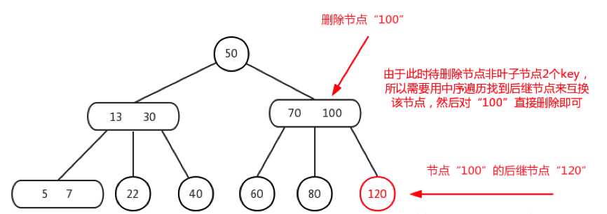

结果如下图所示，问题转化为删除只有一个 key 的叶节点。此时父节点有两个 key，删除的节点为右节点，中间节点只有一个 key，对应情况 4 的第 3 项中的 i。因此，需要将父节点的一个 key 下移并与中间节点合并：

再看情况 4 的第 3 项中的 iv：如下图所示，删除节点“22”，右兄弟节点有两个 key。将父节点的“30”下移到中间节点，然后将右兄弟节点的一个 key“40”上移到父节点：

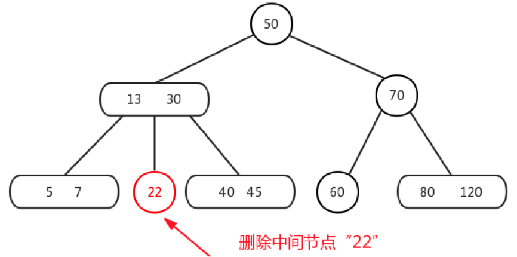

最后讨论一种特殊情况：当 2-3 树中的所有节点都只含有一个 key（即全部为 2-节点）时，它在结构上等同于一棵满二叉树（完美二叉树）。当从这样的树中删除叶节点时，对应情况 4 的第 2 项：将父节点与兄弟节点合并。此时树的层数会失衡，因此将合并后的节点视为当前节点；当前节点的兄弟节点和父节点依然都只有一个 key，继续按情况 4 的第 2 项处理，直到树恢复平衡。

实际上，节点删除的情况 2 和 3 可以合并处理：只要待删除节点是非叶节点，无论其包含多少个 key，都用中序遍历找到后继节点，将问题转化为删除叶节点中的一个 key。

下面对情况 4 的第 2 项补充说明。如下图所示，删除节点“10”，符合情况 4 的第 2 项，因此将父节点“13”与兄弟节点“18”合并：

合并后如下图所示，此时符合情况 4 的第 3 项中的 ii：父节点的 key“22”下移，中间节点的 key“30”上移到父节点：

变换结果如下图所示，此时 2-3 树已经调整完成。需要注意的是，前面所说的父子节点 key 上下移，对叶节点而言只是 key 的移动（叶节点没有子节点）；而对非叶节点而言，这种变换对应的是左旋与右旋。所以上一步的变换是以节点“22”做左旋操作：节点“22”由父节点降级为子节点，原本的子节点“30”晋升为父节点，并将“30”的左子节点转交给“22”作为右子节点：

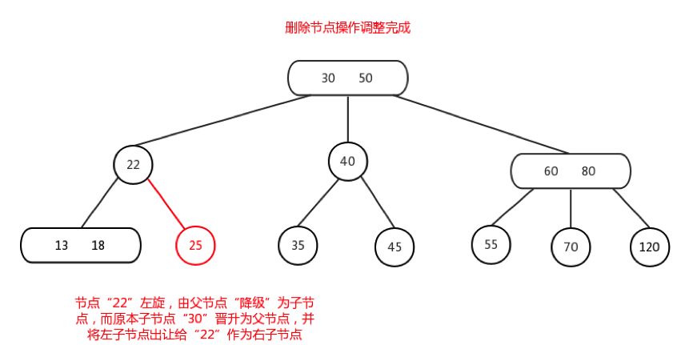

# 3 与红黑树、B 树的关系

纯粹的 2-3-4 树或 2-3 树如今很少在工程中直接实现，它们更多是作为红黑树（Red-Black Tree）的等价物存在于教学中。2-3-4 树在逻辑上完全等价于红黑树：4-节点对应红黑树的一个黑节点和两个红孩子，3-节点对应一个黑节点和一个红孩子，2-节点对应一个黑节点。现代编程语言（如 Java 的 TreeMap、C++ 的 std::map）底层均采用红黑树而非直接实现 2-3-4 树，因为指针操作的常数因子更小。

2-3-4 树的思想也是现代数据库 B-Tree / B+Tree 索引的基石。在大规模分布式数据库中，理解 2-3-4 树的分裂与合并机制，是掌握 LSM-Tree 和 B+Tree 底层原理的重要前置知识。