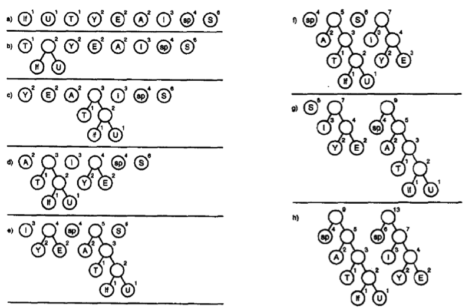
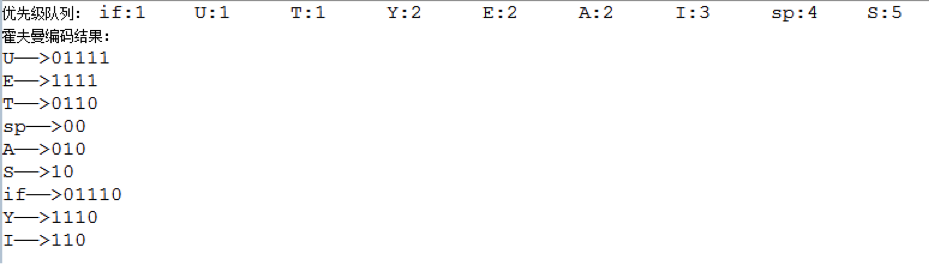
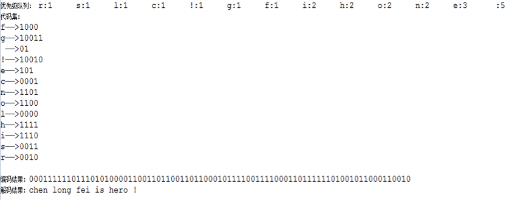

# 1、霍夫曼编码

计算机里每个字符在没有压缩的文本文件中都由一个字节（如ASCII码）或两个字节（如Unicode码）表示。这些方案中，每个字符需要相同的位数。

字母对应的ASCII码类似这样：

| 字母 | 十进制 | 二进制   |
| ---- | ------ | -------- |
| A    | 65     | 01000000 |
| B    | 66     | 01000001 |
| C    | 67     | 01000001 |
| ...  | ...    | ...      |
| X    | 88     | 01001100 |
| Y    | 89     | 01001100 |
| Z    | 90     | 01011010 |

在英文中，字母E的使用频率最高，而字母Z的使用频率最低，但是，无论使用频率高低，一律使用相同位数的编码来存储，是不是有些浪费空间呢？试想，如果我们对使用频率高的字母用较少的位数来存储，而对使用频率低的字母用较多的位数来存储，会大大提升存储效率。

霍夫曼编码就是根据以上的设想来处理数据压缩的。

例如，我们要发送一句消息：

`SUSIE SAYS IT IS EASY`

统计所有符号出现的频率：

| 符号   | 频次 |
| ------ | ---- |
| 换行符 | 1    |
| T      | 1    |
| U      | 1    |
| A      | 2    |
| E      | 2    |
| Y      | 2    |
| I      | 3    |
| 空格   | 4    |
| S      | 6    |

S出现的频率最多，我们可以将它的编码设为10，其次是空格，我们将它设置为00，接下来的编码必须增加位数了。

三位码我们有八种选择：000、001、010、011、100、101、110、111。

但是，以10或00开头的是不能使用的，只能从010,011,110,111中选择。因为如果我们用101表示I，用010表示Y，101010既可以分解为101、010两个有意义的编码，也能分解为10,10,10三个有意义的编码，这显然是不允许的。

我们必须保证，**任何信息编码之后，解码时都不会出现歧义**。借助霍夫曼树就能便捷的实现编码。

# 2、霍夫曼树

霍夫曼树是**最优二叉树**。

> 树的带权路径长度规定为所有叶子结点的带权路径长度之和，带权路径长度最短的树，即为**最优二叉树**。

在最优二叉树中，权值较大的结点离根较近。

首先就需要构建一个霍夫曼树，一般利用优先级队列来够贱霍夫曼树。

以上面的消息为例，我们先来分析一下构建霍夫曼树的过程，下图中，if代表换行符，sp代表空格。



首先，将字符按照频率插入一个优先级队列，频率越低越靠近队头，然后循环执行下面的操作：

- 取出队头的两个树
- 以它们为左右子节点构建一棵新树，新树的权值是两者之和
- 将这棵新树插入队列

直到队列中只有一棵树时，这棵树就是我们需要的霍夫曼树。
接下来我们用java来实现上面的过程。

节点类：

```java
public class Node {
	private String key;  		//树节点存储的关键字，如果是非叶子节点为空
	private int frequency;		//关键字词频
	private Node left;		//左子节点
	private Node right;		//右子节点
	private Node next;		//优先级队列中指向下一个节点的引用
	
	public Node(int fre,String str){  //构造方法1
		frequency = fre;
		key = str;
	}
	public Node(int fre){	//构造方法2
		frequency = fre;
	}
	
	public String getKey() {
		return key;
	}
	public void setKey(String key) {
		this.key = key;
	}
	public Node getLeft() {
		return left;
	}
	public void setLeft(Node left) {
		this.left = left;
	}
	public Node getRight() {
		return right;
	}
	public void setRight(Node right) {
		this.right = right;
	}
	public Node getNext() {
		return next;
	}
	public void setNext(Node next) {
		this.next = next;
	}
	public int getFrequency() {
		return frequency;
	}
	public void setFrequency(int frequency) {
		this.frequency = frequency;
	}
}
```

用于辅助创建霍夫曼树的优先级队列：

```java
public class PriorityQueue {
	private Node first;
	private int length;
	
	public PriorityQueue(){
		length = 0;
		first = null;
	}
	
	//插入节点
	public void insert(Node node){
		if(first == null){  //队列为空
			first = node;
		}else{
			Node cur = first;
			Node previous = null;
			while(cur.getFrequency() < node.getFrequency()){  
                //定位要插入位置的前一个节点和后一个节点
				previous = cur;
				if(cur.getNext() == null){  //已到达队尾
					cur = null;
					break;
				}else{
					cur = cur.getNext();
				}
				
			}
			if(previous == null){  //要插入第一个节点之前
				node.setNext(first);
				first = node;
			}else if(cur == null){  //要插入最后一个节点之后
				previous.setNext(node);
			}else{  //插入到两个节点之间
				previous.setNext(node);
				node.setNext(cur);
			}
		}
		length++;
	}
	
	//删除队头元素
	public Node delete(){
		Node temp = first;
		first = first.getNext();
		length--;
		return temp;
	}
	
	//获取队列长度
	public int getLength(){
		return length;
	}
	
	//按顺序打印队列
	public void display(){
		Node cur = first;
		System.out.print("优先级队列：\t");
		while(cur != null){
			System.out.print(cur.getKey()+":"+cur.getFrequency()+"\t");
			cur = cur.getNext();
		}
		System.out.println();
	}
	
	//构造霍夫曼树
	public HuffmanTree buildHuffmanTree(){
		while(length > 1){
			Node hLeft = delete();  //取出队列的第一个节点作为新节点的左子节点
			Node hRight = delete(); //取出队列的第二个节点作为新节点的右子节点
			//新节点的权值等于左右子节点的权值之和
			Node hRoot = new Node(hLeft.getFrequency()+hRight.getFrequency());
			hRoot.setLeft(hLeft);
			hRoot.setRight(hRight);
			insert(hRoot);
		}
		//最后队列中只剩一个节点，即为霍夫曼树的根节点
		return new HuffmanTree(first);
	}
	
}
```

霍夫曼树类：

```java
import java.util.HashMap;
import java.util.Map;


public class HuffmanTree {
	private Node root;
	private Map codeSet = new HashMap();  //该霍夫曼树对应的字符编码集
	
	public HuffmanTree(Node root){
		this.root = root;
		buildCodeSet(root,"");  //初始化编码集
	}
	
	//生成编码集的私有方法，运用了迭代的思想
	//参数currentNode表示当前节点，参数currentCode代表当前节点对应的代码
	private void buildCodeSet(Node currentNode,String currentCode){
		if(currentNode.getKey() != null){
			//霍夫曼树中，如果当前节点包含关键字，则该节点肯定是叶子节点，将该关键字和代码放入代码集
			codeSet.put(currentNode.getKey(), currentCode);
		}else{//如果不是叶子节点，必定同时包含左右子节点，这种节点没有对应关键字
			//转向左子节点需要将当前代码追加0
			buildCodeSet(currentNode.getLeft(),currentCode+"0");
			//转向右子节点需要将当前代码追加1
			buildCodeSet(currentNode.getRight(),currentCode+"1");
		}
	}
	
	//获取编码集
	public Map getCodeSet(){
		return codeSet;
	}
	
}
```

测试类：

```java
public static void main(String[] args) throws Exception{
		PriorityQueue queue = new PriorityQueue();
		Node n1 = new Node(1,"if");
		Node n2 = new Node(1,"U");
		Node n3 = new Node(1,"T");
		Node n4 = new Node(2,"Y");
		Node n5 = new Node(2,"E");
		Node n6 = new Node(2,"A");
		Node n7 = new Node(3,"I");
		Node n8 = new Node(4,"sp");
		Node n9 = new Node(5,"S");
		queue.insert(n3);
		queue.insert(n2);
		queue.insert(n1);
		queue.insert(n6);
		queue.insert(n5);
		queue.insert(n4);
		queue.insert(n7);
		queue.insert(n8);
		queue.insert(n9);
		queue.display();
		
		HuffmanTree tree = queue.buildHuffmanTree();
		Map map = tree.getCodeSet();
		Iterator it = map.entrySet().iterator();
		System.out.println("霍夫曼编码结果：");
		while(it.hasNext()){
			Entry<String,String> entry = (Entry)it.next();
			System.out.println(entry.getKey()+"——>"+entry.getValue());
		}
	}
```

控制台打印结果如下图所示：



可见，达到了预期的效果。

# 3、更进一步

秉承没有最好，只有更好的精神，我们不应该就此止步。现在我们做到的只是得到某个字符对应的霍夫曼编码，但是这个字符的词频仍然需要我们手工去统计、输入，更深入的思考一下，能不能更智能化一点，只要我们输入完整的一段消息，就能给出对应的霍夫曼编码，而且能对编码进行解码呢？

就是说，我们要利用上面已经写出的代码来封装一个编码类，这个类的一个方法接受一个字符串消息，返回霍夫曼编码。此外，还有一个解码类，接受一段完整的霍夫曼编码，返回解码后的消息内容。这实际上就是压缩与解压的模拟过程。

霍夫曼编码器：

```java 
import java.util.HashMap;
import java.util.Iterator;
import java.util.Map;
import java.util.Map.Entry;


public class HuffmanEncoder {
	private PriorityQueue queue;  	//辅助建立霍夫曼树的优先级队列
	private HuffmanTree tree;	   	//霍夫曼树
	private String [] message;	 	//以数组的形式存储消息文本
	private Map keyMap;				//存储字符以及词频的对应关系
	private Map codeSet;			//存储字符以及代码的对应关系
	
	public HuffmanEncoder(){
		queue = new PriorityQueue();
		keyMap = new HashMap<String,Integer>();
	}
	
	//获取指定字符串的霍夫曼编码
	public String encode(String msg){
		resolveMassage(msg);
		buildCodeSet();
		String code = "";
		for(int i=0;i<message.length;i++){//将消息文本的逐个字符翻译成霍夫曼编码
			code = code+codeSet.get(message[i]);
		}
		return code;
	}
	
	//将一段字符串消息解析成单个字符与该字符词频的对应关系，存入Map
	private void resolveMassage(String msg){
		
		char [] chars = msg.toCharArray();  //将消息转换成字符数组
		message = new String [chars.length];
		for(int i = 0;i<chars.length;i++){
			String key = "";
			key = chars[i]+"";  //将当前字符转换成字符串
			
			message [i] =  key;
			if(keyMap.containsKey(key)){//如果Map中已存在该字符，则词频加一
				keyMap.put(key, (Integer)keyMap.get(key)+1);
			}else{//如果Map中没有该字符，加入Map
				keyMap.put(key,1);
			}
		}
	}
	
	//建立对应某段消息的代码集
	private void buildCodeSet(){
		Iterator it = keyMap.entrySet().iterator();
		while(it.hasNext()){
			Entry entry = (Entry)it.next();
			//用该字符和该字符的词频为参数，建立一个新的节点，插入优先级队列
			queue.insert(new Node((Integer)entry.getValue(),(String)entry.getKey()));
		}
		queue.display();
		tree = queue.buildHuffmanTree();  //利用优先级队列生成霍夫曼树
		codeSet = tree.getCodeSet();	//获取霍夫曼树对应的代码集
	}
	
	//打印该段消息的代码集
	public void printCodeSet(){
		Iterator it = codeSet.entrySet().iterator();
		System.out.println("代码集：");
		while(it.hasNext()){
			Entry entry = (Entry)it.next();
			System.out.println(entry.getKey()+"——>"+entry.getValue());
		}
		System.out.println();
	}
	
	//获取该段消息的代码集
	public Map getCodeSet(){
		return codeSet;
	}
}
```

霍夫曼解码器：

```java
import java.util.Iterator;
import java.util.Map;
import java.util.Map.Entry;


public class HuffmanDecoder {
	private Map codeSet;  //代码段对应的代码集
	
	public HuffmanDecoder(Map map){
		codeSet = map;
	}
	
	//将代码段解析成消息文本
	public String decode(String code){
		String message = "";
		String key = "";
		char [] chars = code.toCharArray();
		for(int i=0;i<chars.length;i++){
			key += chars[i];
			if(codeSet.containsValue(key)){  //代码集中存在该段代码
				Iterator it = codeSet.entrySet().iterator();
				while(it.hasNext()){
					Entry entry = (Entry)it.next();
					if(entry.getValue().equals(key)){
						message += entry.getKey();  //获取该段代码对应的键值，即消息字符
					}
				}
				key = "";  //代码段变量置为0
			}else{
				continue;  //该段代码不能解析为文本消息，继续循环
			}
		}
		return message;
	}
}
```

测试类：

```java
public static void main(String[] args){
		
		String message = "chen long fei is hero !";
		HuffmanEncoder encoder = new HuffmanEncoder();
		String code = encoder.encode(message);
		
		encoder.printCodeSet();
		System.out.print("编码结果：");
		System.out.println(code);
		
		HuffmanDecoder decoder = new HuffmanDecoder(encoder.getCodeSet());
		String message2 = decoder.decode(code);
		System.out.print("解码结果：");
		System.out.println(message);
	}
```


运行结果如下图所示：

