# 1 应用背景

二叉查找树、AVL 树、红黑树等都属于二叉树，查找时间复杂度通常为 `O(log₂ N)`，与树的深度相关。因此，降低树的深度可以减少查找路径上的节点访问次数。

在大规模数据存储中，单个树节点可容纳的元素数量受到磁盘页大小限制。节点内的有序关键字通常可使用二分查找；但二叉查找树的深度较大，仍可能造成频繁的磁盘 I/O，进而降低查询效率。

因此，为**减少磁盘 I/O 次数，必须降低树的深度**，将“瘦高”的树变得“矮胖”。一个基本的想法是：

- 每个节点存储多个元素
- 摒弃二叉树结构，采用多叉树

这样便引出了新的查找树结构——**多路查找树**。平衡多路查找树可以将数据查找效率保持在 `O(log N)` 的对数级别。

## 1.1 机械硬盘结构

为什么树的深度会与磁盘I/O相关呢？这要从硬件层面来说明。

机械硬盘的结构图如下：

机械硬盘通常由多个盘片组成，每个盘片具有两个盘面，每个盘面对应一个读/写磁头。

从传统的 CHS 几何模型看，每个盘面被划分为若干磁道；位于各盘面相同半径处的磁道构成一个柱面。

盘面上一圈圈的同心圆可视为磁道；从圆心向外划分出的弧段称为扇区。扇区是设备可寻址的基本单位，传统逻辑扇区通常为 512 B；现代硬盘还常见 512e 和物理扇区为 4 KiB 的 4Kn 格式。采用更大扇区的主要目的包括提高纠错效率，而非单纯扩大磁盘容量。

以上图片是简化的传统机械硬盘示意图。实际硬盘通常采用分区记录等技术，不同半径的磁道所含扇区数量可能不同；因此，不宜仅根据图形的扇区弧长推断各磁道的存储密度或容量。

## 1.2 读写原理

当机械硬盘执行读写操作时，盘片绕主轴高速旋转；目标扇区经过读/写磁头下方时，设备便可进行数据读写。

早期磁盘常以柱面、磁头、扇区（CHS）描述位置。在现代系统中，操作系统与磁盘控制器主要使用逻辑块地址（LBA）寻址；文件系统负责将文件映射到逻辑块，实际物理位置与分配顺序由文件系统和设备共同决定。

由于机械运动的存在，机械硬盘的随机访问远慢于内存。为提高顺序访问效率，操作系统或磁盘控制器可能对连续数据执行预读；预读的长度和触发条件取决于具体的操作系统、文件系统、访问模式及设备策略，并非每次读取都会以固定长度预读。

页是虚拟内存管理的逻辑单位，常见大小为 4 KiB；操作系统的页缓存也常按页组织文件数据。当普通文件读取所需数据不在页缓存中时，内核会发起 I/O 将数据载入缓存；只有按需分页或内存映射访问等场景，访问未驻留的虚拟页才会触发缺页异常。两种机制都可能使系统一次读取相邻数据，但不能简单等同。

## 1.3 响应时间

机械硬盘的随机读取响应时间通常由以下部分构成：

- **寻道时间**：磁头移动到目标磁道所需的时间。具体数值随设备而异，常见量级为数毫秒。
- **旋转延迟**：目标扇区旋转到读/写磁头下方所需的等待时间。以 7200 rpm 硬盘为例，旋转一圈约需 `8.33 ms`，平均旋转延迟约为半圈，即 `4.17 ms`。
- **数据传输时间**：数据从磁盘传送至内存所需的时间，取决于介质密度、接口、传输块大小和设备状态，不能用固定的每字节时间概括。

对机械硬盘而言，寻道与旋转延迟通常是随机 I/O 的主要成本；固态硬盘没有机械寻道和旋转延迟。软件无法直接指定数据的物理柱面位置，但可通过顺序访问、批量读写和合适的页大小减少不必要的 I/O。

磁盘 I/O 通常以块为单位进行。B 树将多个有序关键字及其子指针组织在同一索引页中，以较少的页访问次数完成大规模数据查找。这正是 B 树及其变种 B+ 树、B* 树适用于外存索引的原因。

值得一提的是，如今多数数据库的底层存储已是 NVMe SSD。SSD 消除了机械寻道和旋转延迟，但外存 I/O 与内存访问之间仍存在数量级的延迟差距，且 SSD 的擦写寿命（Wear Leveling）也要求尽量减少无谓的页重写。因此，通过增大扇出降低树高、通过重分配减少分裂次数的思想，在 SSD 时代依然是外存索引设计的主流方案。

# 2 B 树

**B 树**（B-tree）由 Rudolf Bayer 和 Edward M. McCreight 在 1972 年发表的论文 *Organization and Maintenance of Large Ordered Indices* 中提出。

以下采用“阶 `m` 表示单个节点最多拥有 `m` 个孩子”的常见定义。一棵 `m` 阶 B 树具有以下特性：

- 根节点至少包含 1 个关键字（空树除外），最多包含 `m - 1` 个关键字。若根节点为非叶节点，则其孩子数至少为 2，最多为 `m`。
- 除根节点外，每个节点包含 `ceil(m/2) - 1` 至 `m - 1` 个关键字。
- 除根节点外，每个非叶节点拥有 `ceil(m/2)` 至 `m` 个孩子；若有 `k` 个孩子，则有 `k - 1` 个关键字。
- 所有叶节点均位于同一层。
- 每个节点中的关键字按从小到大排列，并将 `k` 个孩子的关键字范围划分为 `k` 个区间。

对比前面介绍过的 2-3 树与 2-3-4 树，可以发现，2-3 树是 `m = 3` 时的 B 树，2-3-4 树是 `m = 4` 时的 B 树，两者都是 B 树的特例。

**注意**：不要将 `m` 阶 B 树简单理解为普通的 `m` 叉树。B 树的“阶”描述节点允许的最大孩子数；它与四叉树、八叉树、KD 树、R 树和 R* 树等空间划分树并不等同。

一棵 3 阶 B 树的示意图如下：

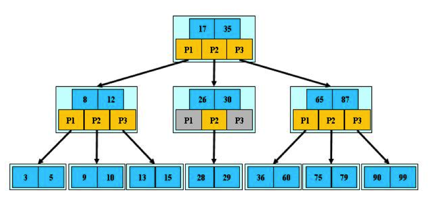

以上图为例，若查询的数值为 5。为便于说明，假定访问到的节点均未被缓存：

- 第一次磁盘 I/O：读取根节点所在页，在节点内与 17、35 比较；5 小于 17，进入左子树。
- 第二次磁盘 I/O：读取下一层节点，在节点内与 8、12 比较；5 小于 8，继续进入左子树。
- 第三次磁盘 I/O：读取叶节点，在节点内与 3、5 比较，找到 5，查找终止。

节点内的关键字有序，通常可使用二分查找。B 树不一定比二叉查找树使用更少的内存比较次数，但通过增大单个节点的扇出降低了树高，从而减少了磁盘页访问次数。实际数据库通常会缓存根节点和高层索引页，因此实际磁盘 I/O 次数可能更少；同时，节点大小应控制在一个或少数几个磁盘页内。

设 B 树包含 `N` 个关键字，阶为 `m`，并令 `t = ceil(m/2)`。若树高 `h` 以根到叶的边数计，则有 `log_m(N + 1) - 1 ≤ h ≤ log_t((N + 1) / 2)`，其中下界对应所有节点全满的情形，上界对应所有非根节点仅含最低数量关键字的情形。若改用层数 `L` 衡量（即从根到叶经历的节点数，`L = h + 1`），则最大层数满足 `L ≤ log_t((N + 1) / 2) + 1`，即在最坏情况下，查找一个关键字最多需要访问 `O(log_t N)` 个磁盘页；因此查找、插入和删除的页访问复杂度均为 `O(log N)`。每次访问节点后，还可在节点内使用二分查找定位关键字。

例如，若 `N = 62 × 10^9`、`m = 1024`，则 `t = 512`，在理想的最低填充率条件下树高小于 4 条边，即最多约 4 层节点。实际扇出取决于页大小、关键字长度、指针大小和节点布局，不能仅由阶数推断。

B 树的查找、插入等操作与前文的 2-3 树、2-3-4 树类似，此处不再赘述。

# 3 B+ 树

B+ 树是 B 树的一种变体，通常具有以下特征：

- 非叶节点若有 `k` 个孩子，通常包含 `k - 1` 个分隔关键字；少数实现会额外保存边界值，具体布局可能不同。
- 非叶节点主要保存索引信息；与记录相关的数据通常存放在叶节点中。
- 所有叶节点按关键字顺序链接成有序链表，可按顺序遍历记录。

一棵 3 阶 B+ 树如下所示：

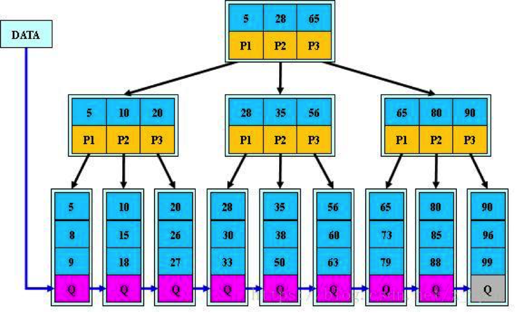

## 3.1 B+ 树的查找

B+ 树在范围查询方面具有明显优势，下面具体说明。

B+ 树与 B 树一样，从根节点自顶向下遍历；在每个节点内部通常使用二分查找确定下一条分支。

两者的主要区别如下：

1. B+ 树的非叶节点通常只保存分隔关键字和子指针，不保存完整记录；B 树的每个关键字则可关联记录或记录定位信息。因此，在相同大小的索引页中，B+ 树的非叶节点通常能容纳更多分隔关键字，树高可能更低，所需的页访问次数也可能更少。

   B 树的卫星数据：

   

   B+ 树的卫星数据：

   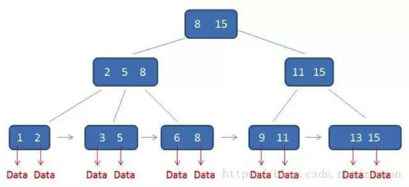

   叶节点中保存的内容依赖具体数据库实现。例如，聚集索引的叶节点可能保存完整行记录；非聚集索引的叶节点则可能保存行定位符或主键值，而非统一的“数据指针”。

2. B 树的点查询可能在内部节点命中，也可能到达叶节点；B+ 树的点查询通常必须到达叶节点。因此，B+ 树的查找路径长度更一致，但实际性能仍受缓存、页大小和实现策略影响。

3. 对范围查询，B 树通常先定位范围下限，再按中序后继逐项遍历；B+ 树定位到范围下限所在的叶节点后，可沿叶节点链表顺序扫描至范围上限，遍历过程更直接。

例如，查找范围 `[3, 11]` 时，两者的查询过程如下：

B 树的查找过程：

B+ 树的查找过程：

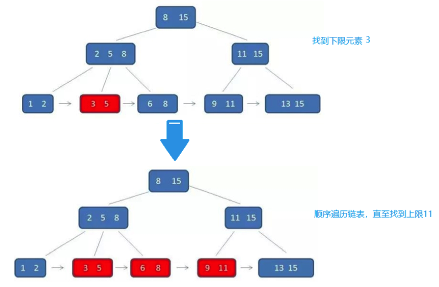

## 3.2 B+ 树的插入

先来看一个 B+ 树：其高度为 2，每个叶节点页最多可存放 4 条记录。

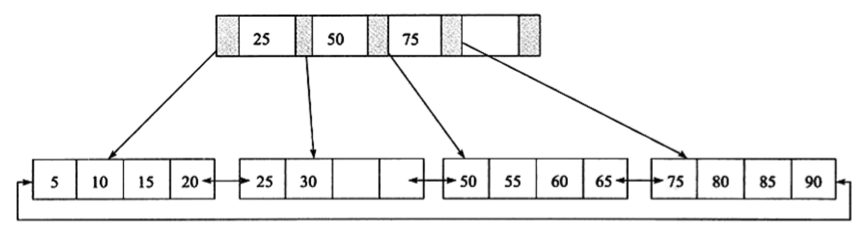

所有记录都位于叶节点中，并按关键字顺序存放。从最左侧叶节点开始顺序遍历，可以得到：5、10、15、20、25、30、50、55、60、65、75、80、85、90。

B+ 树插入后必须保持叶节点中的记录有序。根据叶节点和父索引节点是否已满，插入可能采取不同策略，如下表所示：

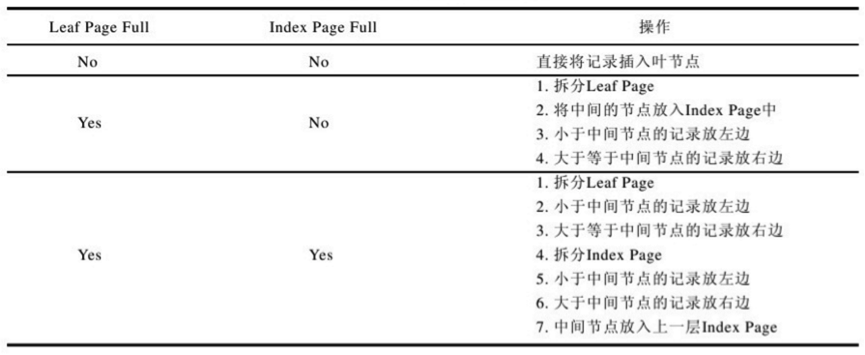

下面通过示例分析 B+ 树的插入过程。

1. 插入关键字 28 时，当前叶节点和父索引节点均未满，可以直接插入。

   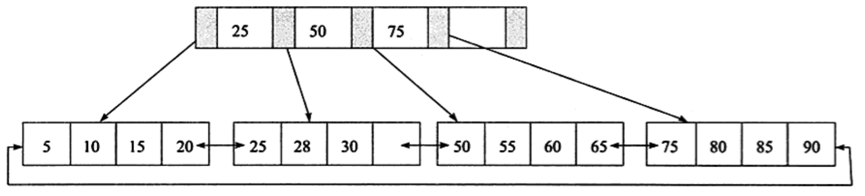

2. 再插入关键字 70 时，目标叶节点原有 50、55、60、65 四条记录，插入后变为 50、55、60、65、70。此时叶节点已满而父索引节点未满，因此以 60 为边界拆分叶节点，并在父索引节点中插入分隔关键字 60。叶节点仍保留关键字 60，父节点保存的是用于导航的分隔关键字。

   注：此处采用的是“复制上移”（Copy-up）策略，即分隔关键字被复制到父节点的同时保留在叶节点中；部分实现也可能采用“推举上移”（Push-up）策略，即将中间关键字直接移动到父节点，原叶节点不再保留该关键字。

   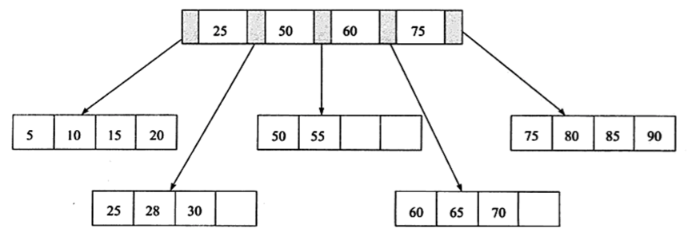

3. 插入关键字 95 时，目标叶节点和父索引节点均已满，需要先拆分叶节点，再处理父索引节点的分裂。

   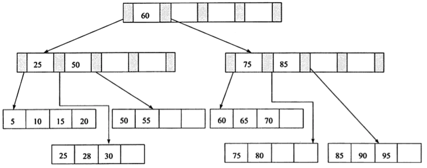

B+ 树通过分裂保持平衡，但页分裂通常会增加磁盘页修改次数。某些数据库实现会在相邻兄弟节点仍有空间时，先进行**重分配**（也常被称为旋转或 redistribution），以避免立即分裂；这不是所有 B+ 树实现都必须采用的策略。

以图中的插入 70 为例，若左兄弟节点仍有空间，可将当前叶节点最小的记录 50 移至左兄弟节点，并将父索引中的分隔关键字由 50 更新为 55。优先检查左兄弟还是右兄弟，以及具体重分配方式，均取决于实现策略。

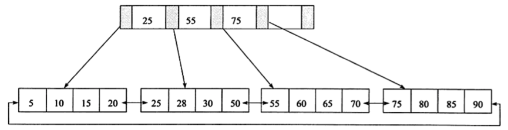

采用重分配可以减少一次页分裂，树的高度仍为 2。

## 3.3 B+ 树的删除

B+ 树删除后同样必须保持叶节点中的记录有序。按常见定义，非根节点通常至少保持半满；数据库产品还可能提供填充因子（fill factor）等配置来预留空间或调整页维护策略，但该配置不等同于 B+ 树删除时固定的最小占用率。删除时，节点可能无需调整、向兄弟节点借位，或与兄弟节点合并。

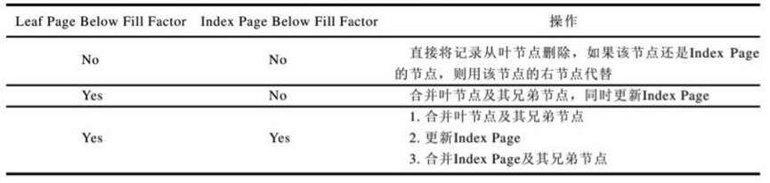

1. 删除关键字 70 时，删除后的叶节点仍满足最小占用率，因此不需要结构调整。

   

2. 删除关键字 25 时，若父索引以右孩子的最小关键字作为分隔关键字，则应将父索引中的 25 更新为右孩子的新最小关键字 28。

   

3. 删除关键字 60 后，若叶节点低于最小占用率，可先向兄弟节点借位；无法借位时再合并。删除或更新父节点中的分隔关键字后，只有父节点也低于最小占用率时，才需要继续向上执行借位或合并。

   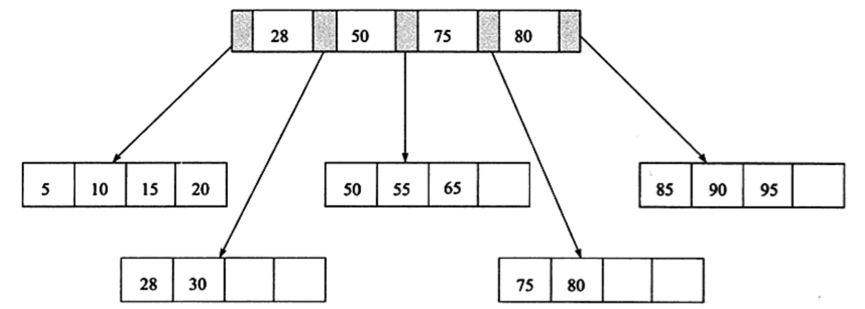

最后看 B+ 树在现代数据库中的具体映射。以 MySQL 的 InnoDB 引擎为例，**聚集索引（Clustered Index）** 的叶节点直接存储整行数据；**非聚集索引（Secondary 
Index，二级索引）** 的叶节点存储的是主键值，通过二级索引查找到主键后，还需“回表”到聚集索引查询完整数据。

# 4 B* 树

B* 树是 B 树家族的变体；一些资料将其视为 B+ 树的变种。其核心改进在于**延迟分裂（Deferred Splitting）**：当节点满时，不立即分裂，而是先尝试将数据转移（重分配）给相邻的兄弟节点；只有当兄弟节点也满时，才将两个节点的数据合并并分裂为三个节点。这使得节点的最低填充率从 B+ 树的约 1/2 提升到约 2/3，进一步降低了树高。兄弟指针的具体设置范围因定义和实现而异。

一棵 3 阶 B* 树如下所示：

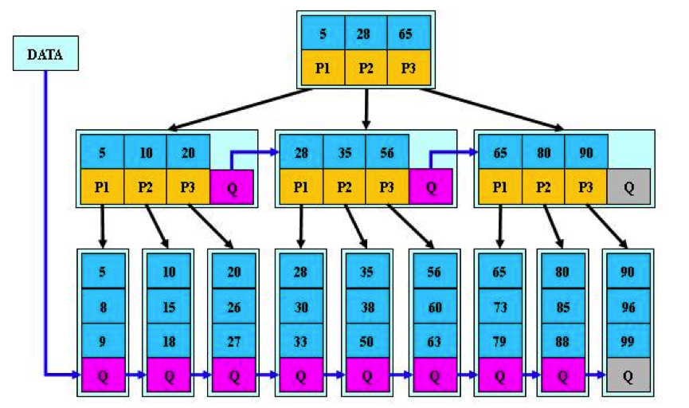

沿用本文“阶 `m` 表示最大孩子数”的定义，B* 树的非根内部节点通常至少拥有 `ceil(2m/3)` 个孩子，对应至少 `ceil(2m/3) - 1` 个分隔关键字。这里约 `2/3` 的最低使用率描述的是节点容量的目标下界，关键字数还需根据节点布局和取整规则计算。
