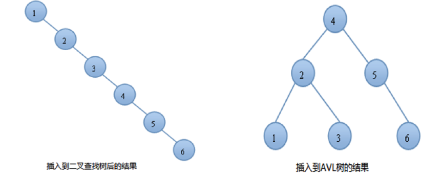
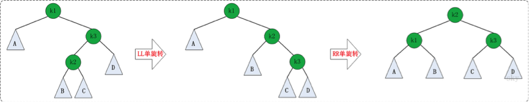

# 1、概述

AVL树由两位科学家在1962年发表的论文*《An algorithm for the organization of information》*当中提出，其命名来自于它的发明者`G.M. Adelson-Velsky`和`E.M. Landis`的名字缩写。

AVL树是最先发明的**自平衡二叉查找树**，也被称为**高度平衡树**。相比于二叉查找树，它的特点是：**任何节点的两个子树的最大高度差为1**。

 

上面的两张图片，左边的是AVL树，它的任何节点的两个子树的高度差别都<=1；而右边的不是AVL树，因为7的两颗子树的高度相差为2（以2为根节点的树的高度是3，而以8为根节点的树的高度是1）。

对于一般的二叉搜索树，其期望高度（即为一棵平衡树时）为`log2n`，其各操作的时间复杂度`O(log2n)`同时也由此而决定。但是，在某些极端的情况下（如在插入的序列是有序的时），二叉搜索树将退化成近似链或链，此时，其操作的时间复杂度将退化成线性的，即`O(n)`。我们可以通过随机化建立二叉搜索树来尽量的避免这种情况，但是在进行了多次的操作之后，由于在删除时，我们总是选择将待删除节点的后继代替它本身，这样就会造成总是右边的节点数目减少，以至于树向左偏沉。这同时也会造成树的平衡性受到破坏，提高它的操作的时间复杂度。

例如：我们按顺序将一组数据1,2,3,4,5,6分别插入到一颗空二叉查找树和AVL树中，插入的结果如下图：



由上图可知，同样的结点，由于插入方式不同导致树的高度也有所不同。特别是在带插入结点个数很多且正序的情况下，会导致二叉树的高度是O(N)，而AVL树就不会出现这种情况，树的高度始终是O(lgN)。高度越小，对树的一些基本操作的时间复杂度就会越小。

AVL树不仅是一颗二叉查找树，它还有其他的性质。如果我们按照一般的二叉查找树的插入方式可能会破坏AVL树的平衡性。同理，在删除的时候也有可能会破坏树的平衡性，所以我们要做一些特殊的旋转处理来重新恢复平衡。

# 2、旋转

如果在AVL树中进行插入或删除节点后，可能导致AVL树失去平衡。这种失去平衡的可以概括为4种姿态：LL(左左)，LR(左右)，RR(右右)和RL(右左)。下面给出它们的示意图：


上图中的4棵树都是"失去平衡的AVL树"，从左往右的情况依次是：LL、LR、RL、RR。除了上面的情况之外，还有其它的失去平衡的AVL树，如下图：


上面的两张图都是为了便于理解，而列举的关于"失去平衡的AVL树"的例子。总的来说，AVL树失去平衡时的情况一定是LL、LR、RL、RR这4种之一，它们都由各自的定义：

- **LL**：LeftLeft，也称为"左左"。插入或删除一个节点后，根节点的左子树的左子树还有非空子节点，导致"根的左子树的高度"比"根的右子树的高度"大2，导致AVL树失去了平衡。
  例如，在上面LL情况中，由于"根节点(8)的左子树(4)的左子树(2)还有非空子节点"，而"根节点(8)的右子树(12)没有子节点"；导致"根节点(8)的左子树(4)高度"比"根节点(8)的右子树(12)"高2。
- **LR**：LeftRight，也称为"左右"。插入或删除一个节点后，根节点的左子树的右子树还有非空子节点，导致"根的左子树的高度"比"根的右子树的高度"大2，导致AVL树失去了平衡。
  例如，在上面LR情况中，由于"根节点(8)的左子树(4)的左子树(6)还有非空子节点"，而"根节点(8)的右子树(12)没有子节点"；导致"根节点(8)的左子树(4)高度"比"根节点(8)的右子树(12)"高2。
- **RL**：RightLeft，称为"右左"。插入或删除一个节点后，根节点的右子树的左子树还有非空子节点，导致"根的右子树的高度"比"根的左子树的高度"大2，导致AVL树失去了平衡。
  例如，在上面RL情况中，由于"根节点(8)的右子树(12)的左子树(10)还有非空子节点"，而"根节点(8)的左子树(4)没有子节点"；导致"根节点(8)的右子树(12)高度"比"根节点(8)的左子树(4)"高2。
- **RR**：RightRight，称为"右右"。插入或删除一个节点后，根节点的右子树的右子树还有非空子节点，导致"根的右子树的高度"比"根的左子树的高度"大2，导致AVL树失去了平衡。
  例如，在上面RR情况中，由于"根节点(8)的右子树(12)的右子树(14)还有非空子节点"，而"根节点(8)的左子树(4)没有子节点"；导致"根节点(8)的右子树(12)高度"比"根节点(8)的左子树(4)"高2。

如果在AVL树中进行插入或删除节点后，可能导致AVL树失去平衡。AVL失去平衡之后，可以通过旋转使其恢复平衡，下面分别介绍"LL(左左)，LR(左右)，RR(右右)和RL(右左)"这4种情况对应的旋转方法。

## 2.1 LL的旋转

LL失去平衡的情况，可以通过一次旋转让AVL树恢复平衡。如下图：


图中左边是旋转之前的树，右边是旋转之后的树。从中可以发现，旋转之后的树又变成了AVL树，而且该旋转只需要一次即可完成。

对于LL旋转，你可以这样理解为：LL旋转是围绕"失去平衡的AVL根节点"进行的，也就是节点k2；而且由于是LL情况，即左左情况，就用手抓着"左孩子，即k1"使劲摇。将k1变成根节点，k2变成k1的右子树，"k1的右子树"变成"k2的左子树"。

## 2.2 RR的旋转

理解了LL之后，RR就相当容易理解了。RR是与LL对称的情况！RR恢复平衡的旋转方法如下：


图中左边是旋转之前的树，右边是旋转之后的树。RR旋转也只需要一次即可完成。

## 2.3 LR的旋转

LR失去平衡的情况，需要经过两次旋转才能让AVL树恢复平衡。如下图：


第一次旋转是围绕"k1"进行的"RR旋转"，第二次是围绕"k3"进行的"LL旋转"。

## 2.4 RL的旋转

RL是与LR的对称情况！RL恢复平衡的旋转方法如下：



第一次旋转是围绕"k3"进行的"LL旋转"，第二次是围绕"k1"进行的"RR旋转"。

# 3、实例

```java
/**
 * - @author chenlongfei
 */
public class AVLTree {

	public AVLTreeNode root; // 根结点

	/**
	 * - 插入操作的入口 
	 * - @author chenlongfei 
	 * - @param insertValue
	 */
	public void insert(long insertValue) {
		root = insert(root, insertValue);
	}

	/**
	 * - 插入的地递归实现
	 * <p>
	 * - @author chenlongfei
	 * <p>
	 * - @param subTree
	 * <p>
	 * - @param insertValue
	 * <p>
	 * - @return
	 */
	private AVLTreeNode insert(AVLTreeNode subTree, long insertValue) {
		if (subTree == null) {
			return new AVLTreeNode(insertValue, null, null);
		}

		if (insertValue < subTree.value) { // 插入左子树

			subTree.left = insert(subTree.left, insertValue);
			if (unbalanceTest(subTree)) { // 插入后造成失衡
				if (insertValue < subTree.left.value) { // LL型失衡
					subTree = leftLeftRotation(subTree);
				} else { // LR型失衡
					subTree = leftRightRotation(subTree);
				}
			}

		} else if (insertValue > subTree.value) { // 插入右子树

			subTree.right = insert(subTree.right, insertValue);
			if (unbalanceTest(subTree)) { // 插入后造成失衡
				if (insertValue < subTree.right.value) { // RL型失衡
					subTree = rightLeftRotation(subTree);
				} else { // RR型失衡
					subTree = rightRightRotation(subTree);
				}
			}

		} else {
			throw new RuntimeException("duplicate value: " + insertValue);
		}

		return subTree;
	}

	/**
	 * - RL型旋转
	 * <p>
	 * - @author chenlongfei
	 * <p>
	 * - @param k1 子树根节点
	 * <p>
	 * - @return
	 */
	private AVLTreeNode rightLeftRotation(AVLTreeNode k1) {
		k1.right = leftLeftRotation(k1.right);

		return rightRightRotation(k1);
	}

	/**
	 * - RR型旋转
	 * <p>
	 * - @author chenlongfei
	 * <p>
	 * - @param k1 k1 子树根节点
	 * <p>
	 * - @return
	 */
	private AVLTreeNode rightRightRotation(AVLTreeNode k1) {
		AVLTreeNode k2;

		k2 = k1.right;
		k1.right = k2.left;
		k2.left = k1;

		return k2;
	}

	/**
	 * - LR型旋转
	 * <p>
	 * - @author chenlongfei
	 * <p>
	 * - @param k3
	 * <p>
	 * - @return
	 */
	private AVLTreeNode leftRightRotation(AVLTreeNode k3) {
		k3.left = rightRightRotation(k3.left);

		return leftLeftRotation(k3);
	}

	/**
	 * - LL型旋转
	 * <p>
	 * - @author chenlongfei
	 * <p>
	 * - @param k2
	 * <p>
	 * - @return
	 */
	private AVLTreeNode leftLeftRotation(AVLTreeNode k2) {
		AVLTreeNode k1;

		k1 = k2.left;
		k2.left = k1.right;
		k1.right = k2;

		return k1;
	}

	/**
	 * - 获取树的深度
	 * <p>
	 * - @author chenlongfei
	 * <p>
	 * - @param treeRoot 根节点
	 * <p>
	 * - @param initDeep 初始深度
	 * <p>
	 * - @return
	 */
	private static int getDepth(AVLTreeNode treeRoot, int initDeep) {
		if (treeRoot == null) {
			return initDeep;
		}
		int leftDeep = initDeep;
		int rightDeep = initDeep;
		if (treeRoot.left != null) {
			leftDeep = getDepth(treeRoot.left, initDeep++);
		}
		if (treeRoot.right != null) {
			rightDeep = getDepth(treeRoot.right, initDeep++);
		}

		return Math.max(leftDeep, rightDeep);
	}

	/**
	 * - 判断是否失衡 - @author chenlongfei - @param treeRoot - @return
	 */
	private boolean unbalanceTest(AVLTreeNode treeRoot) {
		int leftHeight = getDepth(treeRoot.left, 1);
		int righHeight = getDepth(treeRoot.right, 1);
		int diff = Math.abs(leftHeight - righHeight);
		return diff > 1;
	}

	/**
	 * - 删除操作的入口 - @param value
	 */
	public void remove(long value) {
		root = remove(root, value);
	}

	/**
	 * - 删除操作的递归实现
	 * <p>
	 * - @param tree
	 * <p>
	 * - @param value
	 * <p>
	 * - @return
	 */
	private AVLTreeNode remove(AVLTreeNode tree, long value) {
		if (tree == null) {
			return tree;
		}

		if (value < tree.value) { // 要删除的节点在左子树

			tree.left = remove(tree.left, value);

		} else if (value > tree.value) { // 要删除的节点在右子树

			tree.right = remove(tree.right, value);

		} else if (tree.value == value) { // 要删除的节点就是本身

			if (tree.left != null && tree.right != null) { // 左右子树都存在
				if (getDepth(tree.left, 1) > getDepth(tree.right, 1)) {
					/*
					 * - 如果tree的左子树比右子树高:
					 * 
					 * - 1. 找出tree的左子树中的最大节点 
					 * - 2. 将该最大节点的值赋值给tree。 
					 * - 3. 删除该最大节点。 
					 * - 这类似于用"tree的左子树中最大节点"做"tree"的替身 
					 * - 采用这种方式的好处是：删除"tree的左子树中最大节点"之后，AVL树仍然是平衡的
					 */
					AVLTreeNode max = getMaxNode(tree.left);
					tree.value = max.value;
					tree.left = remove(tree.left, max.value);
				} else {
					/*
					 * - 如果tree的左子树不高于右子树: 
					 * - 1. 找出tree的右子树中的最小节点 
					 * - 2. 将该最小节点的值赋值给tree。 
					 * - 3. 删除该最小节点。
					 * - 这类似于用"tree的右子树中最小节点"做"tree"的替身 
					 * - 采用这种方式的好处是：删除"tree的左子树中最大节点"之后，AVL树仍然是平衡的
					 */
					AVLTreeNode min = getMinNode(tree.right);
					tree.value = min.value;
					tree.right = remove(tree.right, min.value);

				}

			} else {

				tree = tree.left == null ? tree.right : tree.left;

			}
		} else {
			System.out.println("no node matched value: " + value);
		}

		return tree;
	}

	/**
	 * - 获取值最大的节点
	 * <p>
	 * - @param node
	 * <p>
	 * - @return
	 */
	private AVLTreeNode getMaxNode(AVLTreeNode node) {
		if (node == null) {
			return null;
		}

		if (node.right != null) {
			return getMaxNode(node.right);
		} else {
			return node;
		}
	}

	/**
	 * - 获取值最小的节点
	 * <p>
	 * - @param node
	 * <p>
	 * - @return
	 */
	private AVLTreeNode getMinNode(AVLTreeNode node) {
		if (node == null) {
			return null;
		}

		if (node.left != null) {
			return getMinNode(node.left);
		} else {
			return node;
		}
	}

}

// AVL树的节点
class AVLTreeNode {
	long value; // 节点存储的数值
	AVLTreeNode left; // 左孩子
	AVLTreeNode right; // 右孩子

	public AVLTreeNode(long value, AVLTreeNode left, AVLTreeNode right) {
		this.value = value;
		this.left = left;
		this.right = right;
	}

	public long getValue() {
		return this.value;
	}

	public void setValue(long value) {
		this.value = value;
	}

	public AVLTreeNode getLeft() {
		return this.left;
	}

	public void setLeft(AVLTreeNode left) {
		this.left = left;
	}

	public AVLTreeNode getRight() {
		return this.right;
	}

	public void setRight(AVLTreeNode right) {
		this.right = right;
	}
}

```

测试类：

```java
	/**
	 * 
	 * - 前序遍历
	 * 
	 * - @param currentRoot
	 */
	public static void preorder(AVLTreeNode currentRoot) {
		if (currentRoot != null) {
			System.out.print(currentRoot.value + "\t");
			preorder(currentRoot.left);
			preorder(currentRoot.right);
		}
	}

	public static void main(String[] args) {
		AVLTree tree = new AVLTree();
		int arr[] = { 3, 2, 1, 4, 5, 6, 7, 16, 15, 14, 13, 12, 11, 10, 8, 9 };
		for (int a : arr) {
			tree.insert(a);

		}
		preorder(tree.root);

	}
```

打印结果如下：

`3	2	1	4	5	6	7	16	15	14	13	12	11	10	8	9`