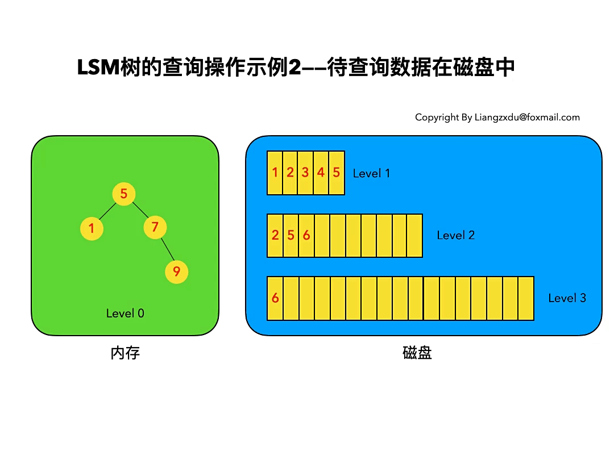
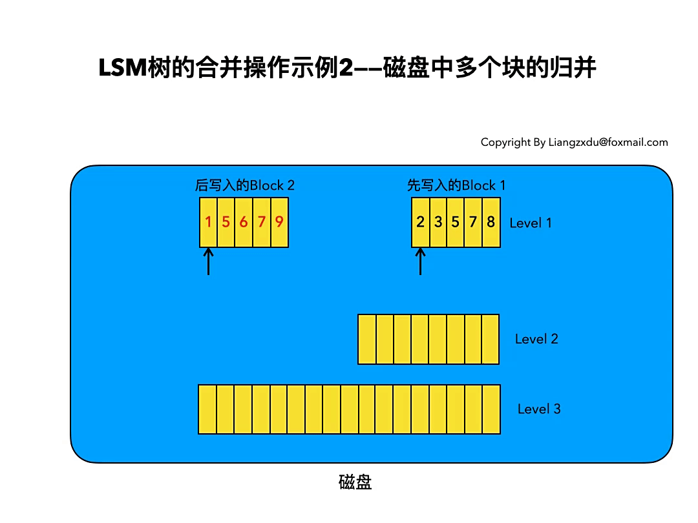

# 1 引言

数据库性能与数据组织方式密切相关。大量数据通常存储在外存中，外存访问远慢于内存访问，因此，减少不必要的磁盘 I/O 是提升数据库查询性能的重要手段之一。

关系数据库通常使用**索引**（Index）加速数据查找。由于索引经常需要支持范围查询，常见的实现会使用 B+ 树等有序树结构；Hash 索引更适合等值查询，通常不直接支持高效的范围扫描。

## 1.1 B+ 树

在传统关系数据库中，B+ 树及其变体是常见的索引结构。

B+ 树的非叶节点通常保存分隔关键字和子指针，叶节点保存完整记录、行定位符或主键等与具体索引实现相关的信息。由于非叶节点不保存完整记录，同等大小的索引页通常可以容纳更多分隔关键字，从而降低树高。叶节点按关键字顺序排列，并通过相邻指针连接，适合范围扫描；所有叶节点位于同一层，因此点查询的路径长度通常较为一致。

B+ 树更新时，仍需从根节点向下定位目标叶节点。更新可能引发页分裂、合并或重分配，但这些操作会维持树的平衡。

连续键在物理页中的布局由存储引擎的页分配、碎片整理和缓存策略共同决定。叶节点分裂可能降低局部性，但 B+ 树的叶链表仍可支持顺序范围扫描；实际范围查询性能取决于数据布局、缓存命中率和访问模式。

## 1.2 LSM 树

对机械硬盘而言，顺序读写通常显著快于随机读写。固态硬盘的顺序与随机访问性能也可能存在差异，但具体差异受设备、队列深度和缓存策略影响。

1992 年的日志结构文件系统研究提出了以追加写为主的存储思路：将新的数据和元数据持续追加到日志末端，以减少随机写入。1996 年，Patrick O'Neil 等人在论文 *The Log-Structured Merge-Tree* 中提出 LSM 树，通过内存缓冲、排序后的不可变文件和后台合并操作组织数据。LSM 树通常能获得较高的写入吞吐量，但读取时可能需要检查多个内存表或文件，因此需要额外的索引与过滤机制。

2006 年，Google 发表的 Bigtable 论文进一步推广了此类存储思想。HBase、Cassandra、LevelDB 和 RocksDB 等系统都采用了 LSM 树或受其启发的存储组织，但它们在层级划分、压缩策略和一致性机制上并不相同。

LSM 树不是由父子指针直接连接的严格树形结构，而是一类写优化的存储组织方法，通常由内存表和多个有序不可变文件组成。

以常见实现为例，LSM 树通常包含以下组件：

**MemTable**：位于内存中的有序数据结构，用于保存最近写入的数据。常见实现会同时写入预写日志（Write-Ahead Log，WAL）以支持故障恢复；是否在每次写入时同步持久化取决于具体系统的可靠性配置。

**Immutable MemTable**：当 MemTable 达到阈值后，一些实现会将其冻结为只读状态，并由后台任务刷写为 SSTable；新的写入进入新的 MemTable。该组件及刷写时是否阻塞写入属于具体实现策略。

**SSTable**（Sorted String Table）：磁盘上的有序、不可变键值文件。系统通常为 SSTable 建立块索引、稀疏索引和布隆过滤器，以减少读取时需要检查的文件和数据块。布隆过滤器可以可靠地排除不存在的键，但可能产生假阳性。

LSM 树的读操作通常先检查 MemTable，再按新旧顺序检查相关 SSTable。分层、块索引、布隆过滤器和压缩策略可减少需要检查的文件数量；在最坏情况下，读取仍可能涉及多个 Sorted Run（有序数据段）。

压缩（Compaction）会将多个 SSTable 归并为新的有序文件，以控制文件数量、清理可安全丢弃的旧版本或墓碑标记，并维持读取效率。是否能够立即清理旧版本还取决于快照和事务等保留条件。

## 1.3 总结

B+ 树与 LSM 树体现了不同的读写权衡。B+ 树常作为关系数据库的索引结构，支持高效的点查询和范围扫描；其实际增、删、改、查能力由完整的数据库存储引擎提供。频繁随机写入可能造成页修改和分裂，成本取决于缓存、页布局和工作负载。

LSM 树也支持点查询、更新、删除和顺序扫描。它通常先将写入追加到 WAL 和 MemTable，再通过批量刷盘与压缩生成有序文件，从而减少前台随机写入。代价是读取可能涉及多个文件，后台压缩也会带来写放大。

LSM 树的写入优势主要来自内存缓冲、批量刷盘和顺序化的文件生成，而不是消除全部随机 I/O。不同外存介质上的实际效果仍取决于设备特性和系统实现。

# 2 基本操作

下文使用“内存表、Level 0、Level 1”等名称说明一个简化的分层 LSM 模型。不同系统对层级名称和文件组织的定义可能不同，例如有些实现将 Level 0 用于磁盘上的最新 SSTable。

## 2.1 插入操作

一次写入通常先追加到 WAL，再写入当前 MemTable。若键已存在，系统会写入带有新序列号的新版本，或按具体 MemTable 实现进行覆盖；旧版本会在后续压缩中按版本规则处理。

如图所示，依次插入 `key = 9`、`key = 1`、`key = 6` 后，数据会按键顺序组织在内存表中。若 MemTable 使用跳表、平衡树等有序结构，插入和查找的复杂度通常为 `O(log n)`，其中 `n` 是当前 MemTable 的数据量。在实际工业应用中（如 LevelDB/RocksDB），MemTable 最常采用的底层数据结构是**跳表（Skip List）**：它在并发写入时的无锁化程度更高，且实现比红黑树等平衡树更简单。

## 2.2 删除操作

**LSM 树通常不直接在已有 SSTable 中删除数据**，而是写入一条带有版本信息的墓碑标记（tombstone）。后续读取遇到较新的墓碑标记时，会将对应的旧值视为已删除；满足保留条件后，压缩过程可清理旧值和墓碑标记。

### 2.2.1 待删除数据在内存中

如下图所示，若待删除数据位于当前内存表中，系统会写入墓碑标记，而不是直接移除该键。

### 2.2.2 待删除数据在磁盘中

若待删除数据位于磁盘上的 SSTable 中，系统同样会向当前 MemTable 写入墓碑标记，而不会原地修改已有 SSTable。

### 2.2.3 待删除数据根本不存在

在无法确认较低层是否存在旧版本时，系统通常仍会写入墓碑标记，以避免旧值在后续合并或读取时重新出现（即防止已被删除的旧版本在底层压缩后“复活”）。若实现能够确定该键不存在，也可能采用额外的优化策略。

无论旧值位于内存还是磁盘，常见的删除路径都是向当前 MemTable 写入墓碑标记。其内存表操作成本通常为 `O(log n)`，而 WAL、刷盘和压缩仍会产生后续 I/O。

## 2.3 修改操作

LSM 树的修改通常通过写入同一键的新版本完成，而不是原地修改已有 SSTable。读取时，系统依据序列号或时间戳选择最新可见版本。

### 2.3.1 待修改数据在内存中

如图所示，新的 `key = 7` 记录写入当前 MemTable。某些实现会在内存表内合并或覆盖同一键的旧版本，但对外仍应按版本顺序解释数据。

### 2.3.2 待修改数据在磁盘中

若旧版本位于磁盘上的 SSTable 中，系统不会原地修改该文件，而是将 `key = 7` 的新版本写入当前 MemTable。

### 2.3.3 该数据根本不存在

若该键不存在，修改操作等同于写入一条新的键值记录。

因此，更新的前台路径通常是写入 WAL 和 MemTable；当 MemTable 达到阈值后，后台任务会将其刷写为 SSTable，并通过压缩维护文件数量和版本。

## 2.4 查询操作

查询通常按“当前 MemTable、冻结的 MemTable、较新的 SSTable、较旧层级文件”的顺序进行。只有结合版本号、墓碑标记和各文件的新旧顺序，系统才能保证返回最新可见版本；不能仅凭层级编号判断结果的新旧。

### 2.4.1 待查询数据在内存中

若当前 MemTable 中存在 `key = 6` 的最新可见版本，查询可直接返回该记录。即使较低层 SSTable 中仍保存较旧版本，也不会影响结果。

### 2.4.2 待查询数据在磁盘中

若内存表中未命中，系统会根据文件元数据、块索引和层级规则检查相关 SSTable，并在找到最新可见版本后返回。例如，图中可在更低层文件中找到 `key = 6`。

LSM 树的读取成本可能高于单棵 B+ 树，因为一次读取可能涉及多个内存表或 SSTable；但不存在的键通常可由布隆过滤器、稀疏索引和块索引快速排除，不需要扫描整个数据库。

## 2.5 合并操作

刷盘和压缩（Compaction）是 LSM 树的重要后台操作。前者将达到阈值的 MemTable 持久化为有序 SSTable；后者合并多个 SSTable，以控制文件数量、维护层级结构，并按版本规则回收过期版本和可安全删除的墓碑标记。

之所以除了增、删、改、查之外还需要这些操作，主要有两个原因：

- 内存容量有限。MemTable 达到阈值后，需要先冻结，再由后台任务刷写到磁盘。
- 磁盘上的 SSTable 会随持续写入而增多。系统需要选择一组有重叠键范围的文件进行压缩，并将结果写入目标层级，以降低后续读取时需要检查的文件数量。

不同实现对层级命名和压缩策略的定义不同。下文的 Level 0、Level 1 仅用于说明基本过程。

### 2.5.1 内存数据写入磁盘的场景

当 MemTable 被冻结后，后台任务会按键顺序遍历其中的数据，并将其写成一个或多个有序 SSTable。图中将内存中的 Level 0 数据写入磁盘的 Level 1，这是为便于说明的简化标注。在 LevelDB、RocksDB 等标准实现中，MemTable 冻结刷盘后生成的是磁盘上的 Level 0（L0）SSTable；L0 的特点是各文件之间的键范围可能存在重叠，后续的 Compaction 才会将其合并入 Level 1 及更深层级。

有序文件有利于范围查询和后续压缩。系统通常还会为文件记录最小键、最大键和块索引等元数据，以便查询时跳过不相关的文件或数据块。

### 2.5.2 磁盘中多个块的归并

图中 `key = 5` 和 `key = 7` 同时存在于较旧的 Block 1 和较新的 Block 2。压缩时，系统会依据版本号或文件新旧顺序保留最新可见版本，因此结果中的这两个键来自较新的 Block 2。

对已排序的输入文件，压缩通常采用多路归并：顺序读取各输入文件，并依键顺序生成新的 SSTable。其 CPU 处理量与输入和输出记录总数成正比，但实际耗时还取决于读写 I/O、文件数量和压缩策略。墓碑标记只有在系统能够确认不会遮蔽更低层的旧版本时才能被安全移除。

不同的压缩策略决定了 LSM 树的性能特征，主流策略包括：

- **Leveled Compaction**：按层级严格控制文件大小和键范围重叠，读放大较小，但写放大较高。
- **Size-Tiered Compaction（STCS）**：按文件大小分组压缩，写放大较小，但空间放大和读放大较高。

此外还有 FIFO（按时间淘汰旧文件）等策略；具体系统（如 RocksDB）通常允许按工作负载选择和调优压缩策略。

## 2.6 总结

LSM 树通常将写入先追加到 WAL，再写入内存中的 MemTable；当内存表达到阈值后，后台任务将其刷写为有序 SSTable，并持续通过压缩维护磁盘文件。这种设计以追加写、批量写和顺序 I/O 为主，因此常适合写入密集型场景；其实际吞吐量仍取决于硬件、压缩策略、数据规模和具体实现。

相较于 B+ 树等原地更新式组织，LSM 树的读取可能需要检查多个内存表和 SSTable。布隆过滤器、块索引、缓存和压缩能够降低这一成本，但读性能、尾延迟和后台资源消耗仍需在具体工作负载中评估。两类结构没有绝对优劣，应结合读写比例、范围查询需求和运维成本选择。

LSM 树常见的代价包括：

- **读放大**：完成一次逻辑读取时，系统可能需要检查多个文件、索引块或数据块，导致实际 I/O 次数或读取字节数高于用户请求的数据量。
- **写放大**：一次逻辑写入除了写入 WAL 和初始 SSTable 外，还可能在后续压缩中被多次重写，导致物理写入字节数大于用户写入的数据量。
- **空间放大**：旧版本和墓碑标记在被压缩回收前会与最新数据同时占用磁盘空间，使实际占用空间大于有效数据量。

# 3 存储引擎的演进

站在近年存储引擎的发展来看，LSM 树本身也在持续演进：

- **硬件变革的影响**：高带宽 NVMe SSD 的发展使压缩带来的多次重写不再是致命瓶颈；CXL（Compute Express Link）等内存扩展技术提供的超大内存池，则让 MemTable 可以做得更大，进一步推迟刷盘和压缩的触发时机。
- **键值分离**：WiscKey 等键值分离（Key-Value Separation）方案将键与值分开存储——LSM 树中只保存键和指向值的指针，值单独存放在日志式的值文件中。这种针对 SSD 优化的设计能大幅降低写放大，近年来已被广泛引入 LSM 树存储引擎。
- **智能化压缩调度**：一些系统开始探索利用机器学习预测工作负载，动态调整 Compaction 的触发时机与层级选择，以在读写放大之间取得更好的平衡。
