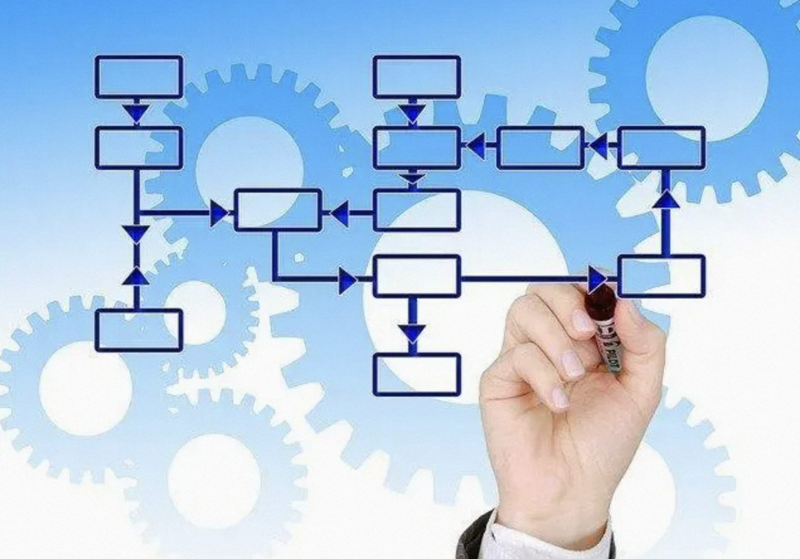
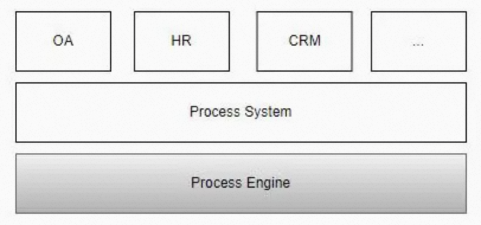
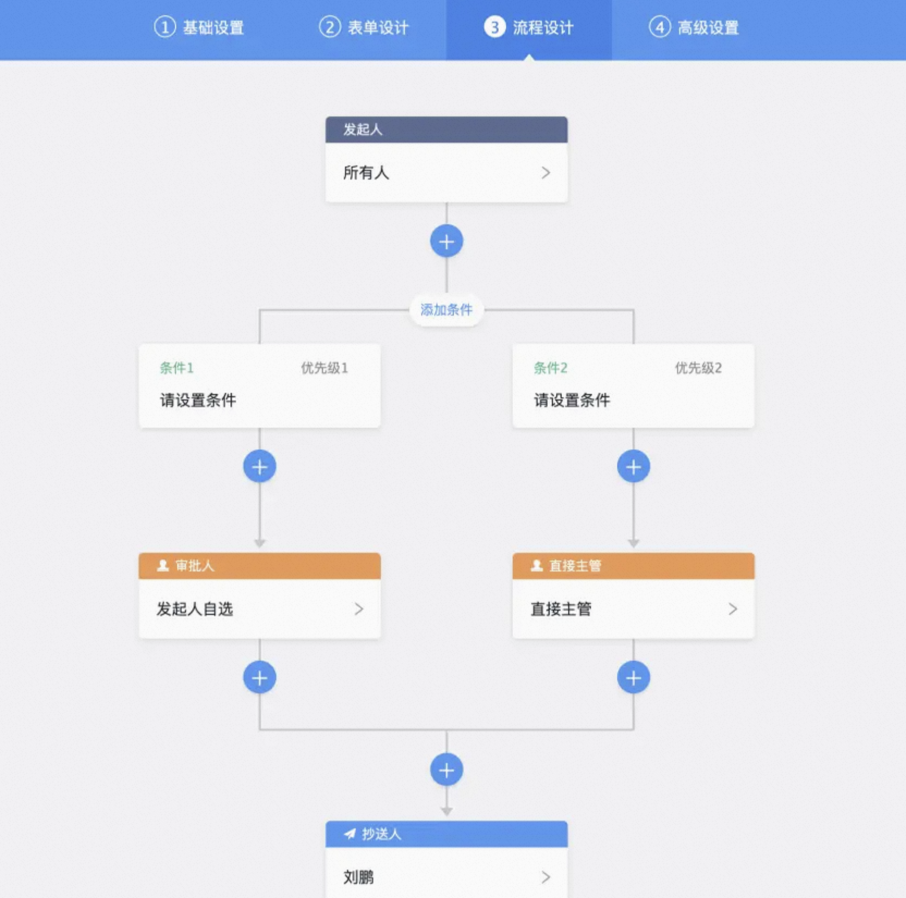
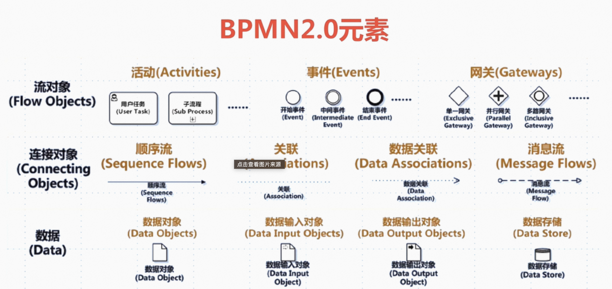
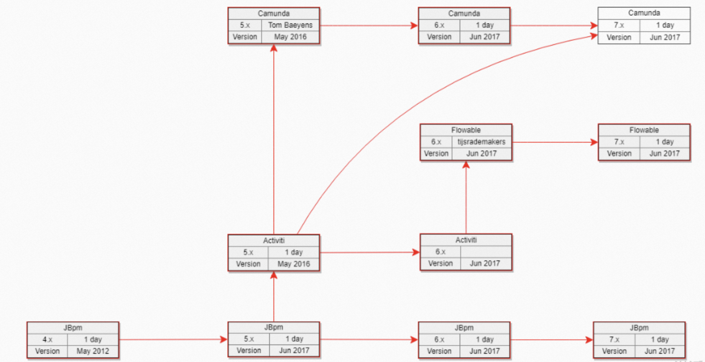
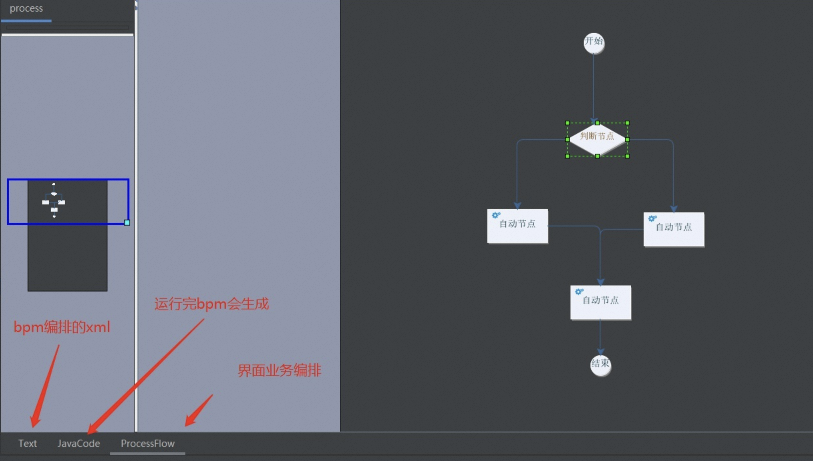
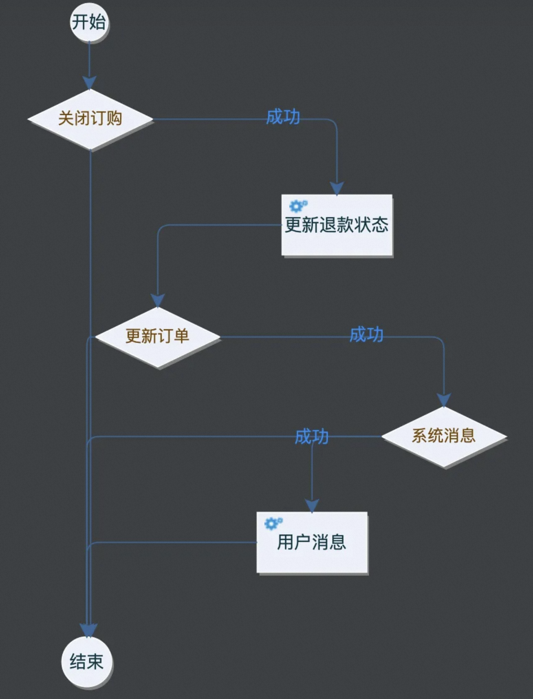

# 1、流程引擎是什么

## 1.1 流程是什么

简单来说，**流程就是一系列活动的有序组合**。比如，用于企业办公的OA系统中，就存在大量的申请审批类的流程。在生产制造业，有大量的从销售端的订单，到生产制造，再到签收回款的生产销售流程。综上，流程是一个概念，在和具体实现结合时，就产生了不同的流程产品，如DevOps、Spring Data Stream等。

在流程实现方面，主要可以分为2种实现方式，一种是用代码实现，比如：用代码实现一个加班申请，那么就要自己对接SSO进行单点登录，通过接口拿到发起人和审批人的信息，同时保存表单数据。另一种方式是使用流程引擎来实现，流程引擎对接应用场景所需数据，如加班申请，流程引擎对接SSO、OU、审批人配置、权限等，实现这样一个流程，只需要关心流程配置、流程节点和流程表单即可，流程流转以及流程的数据处理，都通过流程引擎来完成。

流程引擎可以快速落地流程实现，这也是流程引擎存在的价值。

## 1.2 引擎是什么

一般而言，引擎是一个程序或一套系统的支持部分。常见的程序引擎有游戏引擎、搜索引擎、杀毒引擎等。**引擎是脱离具体业务场景的某一类业务场景的高度抽象和封装**。

比如，某OA公司，封装了一套审批用的工作流，实施人员只需要配置流程和表单即可使用。再比如，美国某公司做了一个AI引擎做NBA（Next Best Action）推荐，封装了推荐领域的常用算法，在不同的场景自动选择和组合多种算法，进行智能推荐。

## 1.3 工作流是什么

> 工作流（Workflow），是对工作流程及其各操作步骤之间业务规则的抽象、概括描述。 工作流建模，即将工作流程中的工作如何前后组织在一起的逻辑和规则，在计算机中以恰当的模型表达并对其实施计算。 

简单来说，**工作流就是对业务的流程化抽象**。

之所以被称之为“流”，是因为各个节点通过内外部驱动引起节点的推进，形成一个流式的状态达到业务终点。比如一次用户查看淘宝商品的费用、一次支付成功后的权益开通、一次用户注册、一次调度任务的运行等，都是可以是一个工作流。

从代码层面上来说，工作流是对**业务逻辑代码的按照指定的流程格式化**。即原来可以用代码直接完成的任务流程，借助工作流工具来进行标准格式化、视图化。

另外要提一点，工作流本身是**一种工程化的设计思想**，在特定场景下，也是**一种业务的实现方式**。对于狭义的通用工程来说，工作流只是一种设计模式，或者说思维方式，不涉及任何的具体编码，即所有业务代码还是需要人工完成，只是用工作流的方式来规划和编排代码运行方式。而对于某些垂直的业务，工作流本身就是业务实现的具体方式，比如审批流的配置，可以直接通过工作流引擎的方式，直接实现配置化编排业务。

现在业务都趋于融合，所以很多工作流提供了默认的实现，也提供了自定义的实现。比如阿里巴巴旗下的“宜搭”就宣称“0代码搭建应用”。宜搭本身就是一种用工作流的思维提供的应用搭建平台。

## 1.4 流程引擎是什么

流程引擎是一个底层支撑平台，是为提供流程处理而开发设计的。流程引擎和流程应用，以及应用程序的关系如下图所示。

常见的支撑场景有：Workflow、BPM、流程编排等。

成熟的流程引擎一般都包括**图形化配置能力**，即负责对业务流程的**拖拽式工具**，有插件式也有WEB云端式的。

比如上图的审批流，流程引擎底层对接了组织用户关联的功能及调用外部服务的能力，在页面上通过拖拽、点击，就能组装出一套审批流程。

# 2、流程引擎选型

## 2.1 BPMN 规范

**BPMN**是听得比较多的工作流标准，但工作流的规范其实不止一种，还有XPDL，BPML等。甚至他们的出现时间比BPMN更早，只是因为一些技术和非技术原因，BPMN2.0被普遍使用了，而非BMPN2.0规范的厂商也逐渐转移了，最终，**BPMN2.0成为了BPM（Business Process Management）领域普遍认可的标准**。

BPMN2.0全称`Business Process Model And Notation 2.0`，是一套符合国际标准的业务流程建模符号。

BPMN 2.0 规范定义了业务流程的符号以及模型，并且为流程定义设定了转换格式，**目的是为了让流程的定义实现可移植性**，那么用户可以在不同的供应商环境中定义流程，并且这些流程可以移植到其他遵守 BPMN 2.0 规范的供应商环境中。

BPMN 想要解决流程设计和复杂需求中间寻找一个平衡点，可以让非技术人员建立简单并且易懂的业务流程模型，同时可以处理高度复杂的业务流程，因此要解决这两个矛盾的要求，需要在 BPMN 规范中定义标准的图形和符号。

## 2.2 产品

### 2.2.1 jBPM

jBPM由JBoss公司开发，目前最高版本jPBM7，不过从jBPM5开始已经跟之前不是同一个产品了，jBPM5的代码基础不是jBPM4，而是**从Drools Flow重新开始**，基于Drools Flow技术在国内市场上用的很少，所有不建议选择jBPM5以后版本，jBPM4诞生的比较早，后来jBPM4创建者Tom Baeyens离开JBoss后，加入Alfresco后很快推出了新的基于jBPM4的开源工作流系统Activiti, 另外JBPM以hibernate作为数据持久化ORM也已不是主流技术。

现在时间节点选择流程引擎，**jBPM不是最佳选择**。

### 2.2.2 Activiti

activiti由Alfresco软件开发，目前最高版本activiti 7。

选型时有必要先了解一下activiti几个版本的发展历史。

activiti5和activiti6的核心开发是Tijs Rademakers，由于团队内部分歧，在2017年时Tijs Rademakers离开团队，创建了后来的flowable, activiti6以及activiti5代码已经交接给了 Salaboy团队, activiti6以及activiti5的代码官方已经暂停维护了, Salaboy团队目前在开发activiti7框架，activiti7内核使用的还是activiti6，并没有为引擎注入更多的新特性，只是在activiti之外的上层封装了一些应用。

综上，**activiti可用，但是不推荐**。

### 2.2.3 Flowable

Flowable 是一个使用 Java 编写的轻量级业务流程引擎，Flowable基于activiti6衍生出来的版本，Flowable目前最新版本是v6.6.0，开发团队是从activiti中分裂出来的，修复了一众activiti6的bug，并在其基础上研发了DMN支持，BPEL支持等等，相对开源版，其商业版的功能会更强大。

Flowable 项目中包括 BPMN（Business Process Model and Notation）引擎、CMMN（Case Management Model and Notation）引擎、DMN（Decision Model and Notation）引擎、表单引擎（Form Engine）等模块。

以flowable6.4.1版本为分水岭，大力发展其商业版产品，开源版本维护不及时，部分功能已经不再开源版发布，比如表单生成器（表单引擎）、历史数据同步至其他数据源、ES等。

Flowable的NoSql方案和消息队列比较特别，同时对DMN和CMMN的研究也比较多，**是个不错的选择**。

### 2.2.4 Camunda

Camunda基于activiti5，所以其保留了PVM，最新版本Camunda7.15，保持每年发布2个小版本的节奏，开发团队也是从activiti中分裂出来的，发展轨迹与flowable相似，同时也提供了商业版，不过对于一般企业应用，开源版本也足够了。

通过上面的介绍可以发现，jBPM、Activiti、Flowable、Camunda同宗同源，祖先都是jBPM4。

选择camunda的理由：
* 通过压力测试验证Camunda BPMN引擎性能和稳定性更好。
* 功能比较完善，除了BPMN，Camunda还支持企业和社区版本中的CMMN（案例管理）和DMN（决策自动化）。Camunda不仅带有引擎，还带有非常强大的工具，用于建模，任务管理，操作监控和用户管理，所有这些都是开源的。

### 2.2.3 CompileFlow

CompileFlow基于淘宝工作流TBBPM开源，专注于**纯内存执行**，**无状态**的流程引擎，通过**将流程文件转换生成java代码编译执行**，简洁高效。在阿里巴巴中台解决方案中广泛使用，支撑了导购、交易、履约、资金等多个业务场景。

CompileFlow目前有IntelliJ IDEA、Eclipse可视化编排插件，并可以在流程设计中实时动态生成java代码并预览，所见即所得。

CompileFlow 的优势是很容易上手，可以与Spring集成，降低了工作流学习的难度。

劣势是CompileFlow原生只支持淘宝BPM规范，为兼容BPMN 2.0规范，做了一定适配，但**仅支持部分BPMN 2.0元素**，如需其他元素支持，需要原来基础上自行扩展。

# 3、流程引擎的优缺点

## 3.1 优点

### 业务可视化

首先，最大的优点，就是可以借助流程引擎，让业务可视化，可以通过视图看到整个业务流程，每个节点执行什么业务逻辑一目了然，分支处理、异常处理也非常清晰。

随着业务的不断发展，代码的执行链路难免会变得越来越长，分支也变得越来越多，到最后，最熟悉这块业务的开发，也很难描述出完整的视图是什么样子的。这种情况下，**可视化也是一种生产力**。

### 业务可编排

如果业务永远不变化，那么我们硬编码在一个方法里也无所谓。但是我们知道业务千变万化的，软件设计很重要的一个指标就是灵活可扩展。工作流程的重编排，则可以使得业务进一步在代码层面增加灵活性。可以通过节点的调整来快速调整业务流程，可以灵活增删节点，而不至于对整个流程有影响。

还是以上面的为例，如果要增加一个【关闭用户权益】的节点，或者删除【用户消息】，那么我们很容易利用工作流增删原有流程。这里实现了代码可维护里最核心的两点：**改动代码最简单**和**改动代码最快**。

### 自动重试

对于某些工作流来说，工作流引擎提供了框架层面持久化和自动重试的能力。

## 3.2 缺点

* 对于使用者来说，如果需要精通流程引擎，必须同时掌握Java语言 BPMN XML语法和图形符号，需要在这三者之间做到一一对应。 对参与人员的逻辑能力要求非常高，因为这些都是语言符号，只是表达逻辑的形式而已，不如直接用Java开发更简单方便。

* 流程引擎耦合了业务和技术架构，将可靠性（事务）、高性能（Job执行）和业务流程捆绑在一起，比如Job执行的方式就很难拓展到分布式弹性Job方式就比较难。流程事务和技术事务混淆在一起。 随着serverless和FaaS的兴起，K8s + Istio + Knative等将云架构技术将技术架构变成云平台的一部分，在此基础上使用Knative实现事件驱动的flow流程就更具有扩展性和可伸缩性。

* 工作流引擎违背六角形架构，按照六角形架构，业务核心不应该依赖REST或JMS或数据库或界面等外围。一些工作流引擎无法通过Spring那样对权限等多切面进行解耦，比如如今流行的OAuth和JWT其实已经剥离了权限，但是很难结合到现有工作流引擎中，同理，有些工作流引擎依赖于分层架构，比如表单对象其实表单对象应该是一个领域模型对象，但是因为某些原因在实际中要么会依赖UI层，要么依赖JPA层，有的人会将其耦合到SpringMVC的Controller或Struts的Action，这导致整个系统的扩展性完全丧失，几乎很难过度到Spring Boot的微服务架构。

* 将领域模型变成Map里面的数据，是先有领域边界？有界上下文？还是先有在这些上下文之间流动的流程呢？流程引擎默认是坚持后者，否定了有界上下文边界，将领域边界内的领域模型任意肢解成数据库的数据，通过Java的Map携带，这种不尊重领域模型的极端做法未来必然行不通，只要动态流程，不要静态结构了，没有结构，就没有不变，整个系统好像都可以变。思路应该是：以聚合根为主，在不同聚合根之间采取异步的事件通讯，将这种事件通讯和流程管理器整合在一起，如Saga模式。

工作流引擎其实都是某个阶段技术和业务的组装者，但是由于技术不断发展，工作流引擎如果没有实现模块化或分层化，那么很难避免随着技术发展不断淘汰，用户也是先尝甜头后再尝苦头，掉进坑里，这也是工作流引擎不断更新迭代，但是鲜有恒强者的原因，但是由于美妙市场的存在，用户渴求不需要开发人员，以为自己动动鼠标就能搞定政务系统或办公系统。

在一个分布式服务环境下，如何整合调度服务走向，Spring cloud代表的微服务路由网关给出了一点答案，但是目前网关的路由还无法类似BPMN那样通过XML进行各种流程逻辑组合，未来应该会有，K8s + Istio + Knative代表无服务器架构就是一个方向。不过，BPMN本身思路方向可能有问题，希望抛弃代码和配置，用一套全新的语言表达整个业务流程概念，这种方式必然导致业务和技术的深度耦合。

# 4、适用场景

那么适合用工作流的业务有什么特点？

## 4.1 领域业务高复杂度
对于偏向业务系统的逻辑，并且具备一定的领域专业性，比如进销存、CRM、订单管理等具备一定的领域复杂度的业务，可以用工作流模式，来实现业务的可视化。从全局的业务视角来观察整体系统架构，而不至于在代码大山面前无从下手。

## 4.2 多节点、长链路
比如询价需要经过加载用户信息、加载商品、加载优惠、计费等多个节点，每个节点都相对独立。此类业务就比较适合用无状态的内存工作流。

## 4.3 状态持久化和自动重试
对于异步的调度流程，例如订单支付成功后，驱动下游业务系统开通、发送用户提醒消息、扣减库存等异步流程节点，需要持久化每个节点的执行状态，同时在流程失败的情况下系统框架能进行重试恢复。

# 5、流程引擎与规则引擎

流程引擎与规则引擎都属于中间件的范畴，都是**将应用中复杂、易变的关注点进行分离出来，独立管理**。

不同点在于：
* 流程引擎是将应用中“什么人/系统、什么时间、完成什么工作/任务”进行分离，解决的是**复杂的流程**；
* 规则引擎是将应用中“什么场景、什么条件、做什么决策”进行分离，解决的是**复杂的算法**
