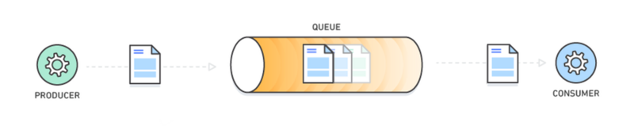
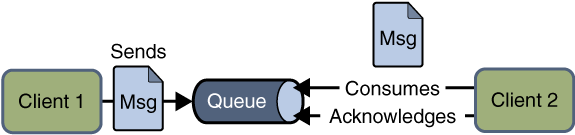
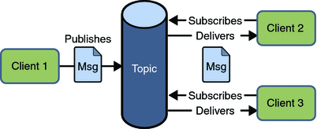
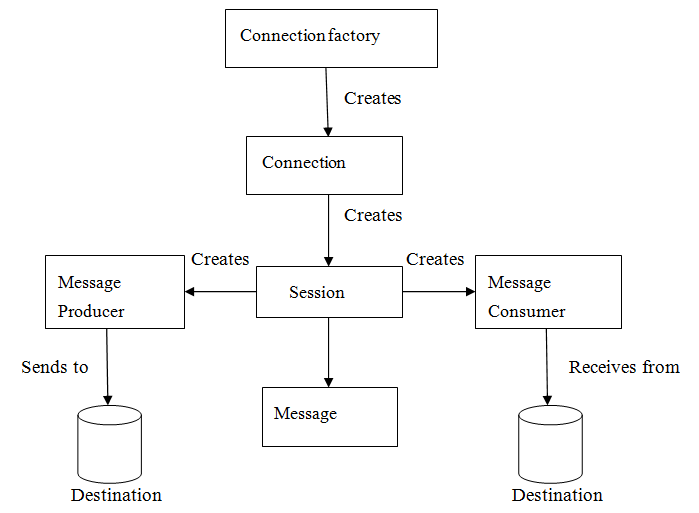

# 1、消息队列是什么

分布式系统中常用通讯模型主要是“请求-应答”模型和“发布-订阅”模型。前者常见如RPC通讯，常用HTTP REST或Dubbo等协议；后者多指消息队列通讯。

RPC大多属于请求-应答模式，也包括越来越多响应式范式，对于需要点对点交互、强事务保证和延迟敏感的服务/应用之间的通信，RPC是优于消息队列的。

**消息队列**（Message Queue，**MQ**）可以看做是一种异步RPC，把一次RPC变为两次或多次，进行内容转存，再在合适的时机投递出去。消息的发送者和接收者不需要在同一时间与消息队列进行交互，消息在被处理或被删除之前一直存储在队列上。

消息队列提供一个临时存储消息的轻量级缓存区，以及允许软件组件连接到队列以发送接受消息的的终端节点。这些消息通常较小，可以是请求、恢复、错误消息或明文消息等。要发送消息时，一个名为“生产者”的组件将消息添加到队列。消息将存储在队列中，直至名为“消费者”的另一组件检索该消息并执行相关操作。

许多生产者和消费者都可以使用队列，但一条信息只能有一组消费者处理一次。因此，这种消息收发模式通常称为一对一或点对点通信。如果消息需要由多个消费者进行处理，可以将将消息队列与发布/订阅结合起来使用。

# 2、消息队列协议

**AMQP**、**MQTT**和**STOMP**是三种最常见、最流行的基于TCP/IP的消息传递协议。

## 2.1 AMQP

AMQP，即**高级消息队列协议**（Advanced Message Queuing Protocol），一个提供统一消息服务的应用层标准高级消息队列协议，是应用层协议的一个开放标准，为面向消息的中间件设计。基于此协议的客户端与消息中间件可传递消息，并不受客户端/中间件不同产品，不同的开发语言等条件的限制。

核心角色如下：

- **Message**（消息）：消息服务器处理消息的原子单元，包括一个内容头，一组属性和一个内容体。
  消息有优先级，高优先级的消息在等待同一消息队列时会比低优先级的消息先发送，而且当消息必须被丢弃时，低优先级的消息优先被丢弃。
  使用AMQP协议，消息服务器不能修改内容体和内容头，但可以在内容头上添加额外信息。
- **PubLisher**（消息生产者）：发送消息
- **Consumer**（消息消费者）：消费消息
- **Broker**（消息代理）：消息队列服务器，负责接收客户端连接，路由消息。
- **Queue**（消息队列）：Broker中的一个角色，一个Broker中可以有多个Queue，负责保存消息直到发送给不同的消费者。算是消息的容器。一个消息可以被投入一个或多个队列中，每个队列的消息都会等待消费者连接到这个队列并被取走。
- **Exchange**（交换路由）：Broker中的一个角色，负责接收生产者发送的消息，并路由给服务器中的队列。可以被理解成一个规则表，指明消息该被投到哪个队列中。
- **Channel**（信道）：信道是一条独立的双向数据流通道。为了解决操作系统无法承受每秒建立特别多的TCP连接。

生产者发送消息时，必须指定消息要被路由到哪些个消息队列中。当消息到消息队列中，消息队列会尝试将消息传给消费者，如果失败，消息队列会存储消息并等待消费者。如果没有消费者，消息队列将选择性的将消息返回给生产者。如果消息别消费掉，消息队列会删除消息，删除的过程或者是及时的，或者是等到消费者消费结果后才删除的。

RabbitMQ是AMQP消息队列最有名的开源实现，当然RabbitMQ同时还可以通过插件支持STOMP、MQTT等协议接入。Kafka、RocketMQ均使用自定义的协议。

## 2.2 MQTT

MQTT，即**消息队列遥测传输**（Message Queuing Telemetry Transport）。由IBM开发，现在被**广泛用于物联网公司**。因为他的特点就是轻量，简单，开放和易于实现。所以它常用于很多计算能力有限、带宽低、网络不可靠的远程通信应用场景。

核心角色如下：

- **Publisher**（发布者）：消息发布客户端
- **Subscriber**（订阅者）：消息订阅客户端
- **Broker**（消息代理）：消息服务器端
- **Application Message**（应用消息）：指通过网络传输的应用数据，一般包括主题和负载。
- **Topic**（主题）：应用消息的类型，一般消息发布者会确定消息的主题，订阅者根据自己实际情况选择不同的主题进行消息订阅消费。
- **Payload**（负载）：消息订阅者具体接收的内容。

MQTT协议是通过交换预定义的MQTT控制报文来通信的，控制报文内容由三部分组成：固定报头，可变报头和消息体。固定报头通过标识不同位的值来确定报文类型，包括发布订阅的一些完成状态等；可变报头的内容根据控制报文类型不同而不同，常作为包的标识符；消息体也是根据不同的消息类型有着不同的内容。

MQTT协议中，客户端和服务端是**通过请求-应答模式通信**的。客户端发送一条控制报文数据给服务器，服务器再发送一条控制报文数据给客户端。

MQTT在发布消息时，有三种Qos等级：

- 至多一次（0级）
- 至少一次（1级）
- 只有一次（2级）

至多一次等级最低，客户端只需要将消息发出去即可，这种等级很低，用于消息不重要但特别多，为了减轻通信压力，就不顾质量，只看数量了。

至少一次等级中等，客户端要保证发出去的消息至少一次被服务端接收到，所以要收到服务端的回应，否则一直发，这种等级一般用于服务端有幂等处理，所以不怕重复消费，还要保证消息不会丢失。

只有一次等级最高，客户端先发消息过去，然后本地记录一个我已发送，但不确定你是否收到的状态，然后服务端接收到消息后，回给客户端一个我已接收的报文，同时服务端记录一个我不确定你知不知道我已接收的状态，然后客户端收到这个已接收的消息后，就确定服务端收到这个消息了，于是把自己本地记录的已发送未确定的状态删除，同时再给客户端发送一个我已经知道你收到的报文，服务端收到这个报文，也会把自己之前记录的状态删掉，整个一条报文只有一次的通信才算完成，这种等级就比较严格了，但质量上去了，相对低等级的，数量就会相对小些，但可靠就是王道，不多不少才是最好的。

只有一次的发送和确定，其实思想和三次握手差不多，都是两端互相确认的过程，所以会一来一回的。如果传输过程中出现丢包，都会由发送者重发上一条消息。

## 2.3 STOMP

STOMP，即**流文本定向消息协议**（Streaming Text Orientated Messaging Protocal），是一个相对简单的文本消息传输协议，主要特点就是简单易懂，没有特别多的套路。

核心角色如下：

- **客户端**：既可以是生产者，也可以是消费者
- **服务端**：消息中心

ActiveMQ以及它的下一代实现Apache Apollo，是STOMP协议的典型实现。

# 3、JMS

## 3.1 概述

JMS（Java MessageService）实际上是一套JAVA API接口，是由Sun公司早期提出的消息标准，旨在为java应用提供统一的消息操作，包括create、send、receive等。

严格来讲，**JMS并不属于消息协议**，而是一种规范，是对AMQP，MQTT，STOMP等协议更高一层的抽象。从使用角度看，JMS和JDBC担任差不多的角色，用户都是根据相应的接口可以和实现了JMS的服务进行通信，进行相关的操作。

JMS通常包含如下一些角色：                  

- JMS provider：实现了JMS接口的消息中间件，如ActiveMQ

- JMS client：生产或者消费消息的应用

- JMS producer/publisher：JMS消息生产者

- JMS consumer/subscriber：JMS消息消费者

- JMS message：消息，在各个JMS client传输的对象

- JMS queue：Provider存放等待被消费的消息的地方

- JMS topic：一种提供多个订阅者消费消息的一种机制；在MQ中常常被提到，topic模式

消息如何从producer端达到consumer端由message-routing来决定。在JMS中，消息路由非常简单，由producer和consumer链接到同一个queue（p2p）或者topic（pub/sub）来实现消息的路由。JMSconsumer同时支持message selector（消息选择器），通过消息选择器，consumer可以只消费那些通过了selector筛选的消息。

## 3.2 通信模型

JMS具有两种通信模式：

- Point-to-Point Messaging Domain （点对点）

- Publish/Subscribe Messaging Domain （发布/订阅模式）

在JMS API出现之前，大部分产品使用“点对点”和“发布/订阅”中的任一方式来进行消息通讯。JMS定义了这两种消息发送模型的规范，它们相互独立。任何JMS的提供者可以实现其中的一种或两种模型，这是它们自己的选择。JMS规范提供了通用接口保证我们基于JMS API编写的程序适用于任何一种模型。

### 3.2.1 点对点模型

在点对点通信模式中，应用程序由消息队列，发送方，接收方组成。每个消息都被发送到一个特定的队列，接收者从队列中获取消息。队列保留着消息，直到他们被消费或超时。

- 每个消息只要一个消费者
- 发送者和接收者在时间上是没有时间的约束，也就是说发送者在发送完消息之后，不管接收者有没有接受消息，都不会影响发送方发送消息到消息队列中。
- 发送方不管是否在发送消息，接收方都可以从消息队列中去到消息
- 接收方在接收完消息之后，需要向消息队列应答成功

### 3.2.2 发布/订阅模型

在发布/订阅消息模型中，发布者发布一个消息，该消息通过topic传递给所有的客户端。该模式下，发布者与订阅者都是匿名的，即发布者与订阅者都不知道对方是谁。并且可以动态的发布与订阅Topic。Topic主要用于保存和传递消息，且会一直保存消息直到消息被传递给客户端。

- 一个消息可以传递个多个订阅者（即：一个消息可以有多个接受方）
- 发布者与订阅者具有时间约束，针对某个主题（Topic）的订阅者，它必须创建一个订阅者之后，才能消费发布者的消息，而且为了消费消息，订阅者必须保持运行的状态。
- 为了缓和这样严格的时间相关性，JMS允许订阅者创建一个可持久化的订阅。这样，即使订阅者没有被激活（运行），它也能接收到发布者的消息。

## 3.3 接收消息

在JMS中，消息的产生和消息是异步的。对于消费来说，JMS的消息者可以通过两种方式来消费消息。

- 同步（Synchronous）
  在同步消费信息模式模式中，订阅者/接收方通过调用 receive（）方法来接收消息。在receive（）方法中，线程会阻塞直到消息到达或者到指定时间后消息仍未到达。
- 异步（Asynchronous）
  使用异步方式接收消息的话，消息订阅者需注册一个消息监听者，类似于事件监听器，只要消息到达，JMS服务提供者会通过调用监听器的onMessage()递送消息。

## 3.4 编程模型　

- Connection Factories：创建Connection对象的工厂，针对两种不同的jms消息模型，分别有QueueConnectionFactory和TopicConnectionFactory两种。可以通过JNDI来查找ConnectionFactory对象。客户端使用一个连接工厂对象连接到JMS服务提供者，它创建了JMS服务提供者和客户端之间的连接。JMS客户端（如发送者或接受者）会在JNDI名字空间中搜索并获取该连接。使用该连接，客户端能够与目的地通讯，往队列或话题发送/接收消息。
- Destination：目的地指明消息被发送的目的地以及客户端接收消息的来源。JMS使用两种目的地，队列和话题
- Connection：表示在客户端和JMS系统之间建立的链接（对TCP/IP socket的包装）。Connection可以产生一个或多个Session。跟ConnectionFactory一样，Connection也有两种类型：QueueConnection和TopicConnection。
- Session：对消息进行操作的接口，可以通过session创建生产者、消费者、消息等。Session 提供了事务的功能，如果需要使用session发送/接收多个消息时，可以将这些发送/接收动作放到一个事务中。
- Producter：消息生产者由Session创建，用于往目的地发送消息。生产者实现MessageProducer接口，我们可以为目的地、队列或话题创建生产者。
- Consumer：消息消费者由Session创建，用于接收被发送到Destination的消息。
- MessageListener：消息监听器。如果注册了消息监听器，一旦消息到达，将自动调用监听器的onMessage方法。

