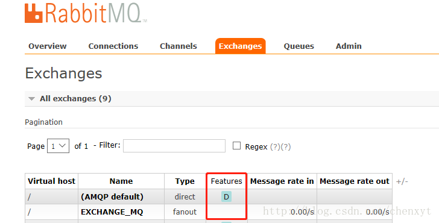
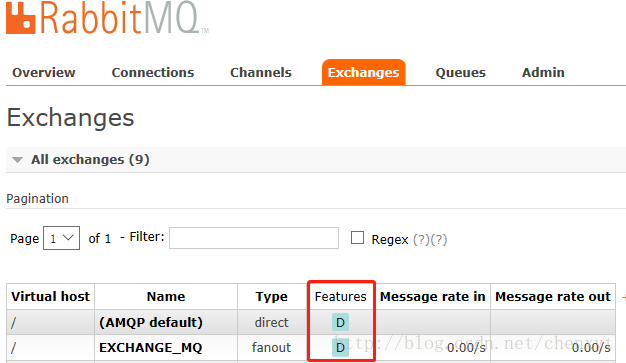

在生产过程中，难免会发生服务器宕机的事情，RabbitMQ也不例外，可能由于某种特殊情况下的异常而导致RabbitMQ宕机从而重启，那么这个时候对于消息队列里的数据，包括交换机、队列以及队列中存在消息恢复就显得尤为重要了。RabbitMQ本身带有持久化机制，包括交换机、队列以及消息的持久化。持久化的主要机制就是将信息写入磁盘，当RabbtiMQ服务宕机重启后，从磁盘中读取存入的持久化信息，恢复数据。

# 1、交换机的持久化

如果使用常规的声明交换机的方法：

```java
channel.exchangeDeclare(EXCHANGE_NAME, "fanout");
```

默认不是持久化的，在服务器重启之后，交换机会消失。我们在管理台的Exchange页签下查看交换机，可以看到使用上述方法声明的交换机，Features一列是空的，即没有任何附加属性。



我们换用另一种方法声明交换机：

```java
channel.exchangeDeclare(EXCHANGE_NAME, "fanout", true);
```

查看一下方法的说明：

```java
 * Actively declare a non-autodelete exchange with no extra arguments
 * @see com.rabbitmq.client.AMQP.Exchange.Declare
 * @see com.rabbitmq.client.AMQP.Exchange.DeclareOk
 * @param exchange the name of the exchange
 * @param type the exchange type
 * @param durable true if we are declaring a durable exchange (the exchange will survive a server restart)
 * @throws java.io.IOException if an error is encountered
 * @return a declaration-confirm method to indicate the exchange was successfully declared
 */
Exchange.DeclareOk (String exchange, String type, boolean durable) throws IOException;
```

我们可以看到第三个参数`durable`，如果为true时则表示要做持久化，当服务重启时，交换机依然存在，所以使用该方法声明的交换机是下面这个样子的：



# 2、队列的持久化

与交换机的持久化相同，队列的持久化也是通过durable参数实现的，看一下方法的定义：

```java
 * Declare a queue
 * @see com.rabbitmq.client.AMQP.Queue.Declare
 * @see com.rabbitmq.client.AMQP.Queue.DeclareOk
 * @param queue the name of the queue
 * @param durable true if we are declaring a durable queue (the queue will survive a server restart)
 * @param exclusive true if we are declaring an exclusive queue (restricted to this connection)
 * @param autoDelete true if we are declaring an autodelete queue (server will delete it when no longer in use)
 * @param arguments other properties (construction arguments) for the queue
 * @return a declaration-confirm method to indicate the queue was successfully declared
 * @throws java.io.IOException if an error is encountered
 */
Queue.DeclareOk queueDeclare(String queue, boolean durable, boolean exclusive, boolean autoDelete, Map<String, Object> arguments) throws IOException;
```

第二个参数跟交换机方法的参数一样，true表示做持久化，当RabbitMQ服务重启时，队列依然存在。

这里说一下另外两个参数：

- `exclusive`：排他队列。如果一个队列被声明为排他队列，那么这个队列只能被第一次声明他的连接所见，并在连接断开的时候自动删除。这里有三点需要说明：
  - 排他队列是基于连接可见的，同一连接的不同信道是可以同时访问同一连接创建的排他队列
  - 如果一个连接已经声明了一个排他队列，其他连接是不允许建立同名的排他队列的，这个与普通队列不同
  - 即使该队列是持久化的，一旦连接关闭或者客户端退出，该排他队列都会被自动删除的，这种队列适用于一个客户端发送读取消息的应用场景
- `autoDelete`：自动删除，如果该队列没有任何订阅的消费者的话，该队列会被自动删除。这种队列适用于临时队列

# 3、消息的持久化

消息的持久化是指当消息从交换机发送到队列之后，被消费者消费之前，服务器突然宕机重启，消息仍然存在。消息持久化的前提是队列持久化，假如队列不是持久化，那么消息的持久化毫无意义。

通过如下代码设置消息的持久化：

```java
channel.basicPublish(EXCHANGE_NAME,"",MessageProperties.PERSISTENT_TEXT_PLAIN,message.getBytes());

```

其中`MessageProperties.PERSISTENT_TEXT_PLAIN`是设置持久化的参数。

看一下basicPublish方法的定义：

```java
 * Publish a message
 * @see com.rabbitmq.client.AMQP.Basic.Publish
 * @param exchange the exchange to publish the message to
 * @param routingKey the routing key
 * @param props other properties for the message - routing headers etc
 * @param body the message body
 * @throws java.io.IOException if an error is encountered
 */
void basicPublish(String exchange, String routingKey, BasicProperties props, byte[] body) throws IOException;

```

再看下BasicProperties的类型：

```java
public BasicProperties(
    String contentType,
    String contentEncoding,
    Map<String,Object> headers,
    Integer deliveryMode,
    Integer priority,
    String correlationId,
    String replyTo,
    String expiration,
    String messageId,
    Date timestamp,
    String type,
    String userId,
    String appId,
    String clusterId)
```

其中`deliveryMode`是设置消息持久化的参数，等于1不设置持久化，等于2设置持久化。`PERSISTENT_TEXT_PLAIN`是实例化的一个`deliveryMode=2`的对象，便于编程：

```java
public static final BasicProperties PERSISTENT_TEXT_PLAIN =
    new BasicProperties("text/plain",
                        null,
                        null,
                        2,
                        0, null, null, null,
                        null, null, null, null,
                        null, null);
```

保证在服务器重启的时候可以保持不丢失相关信息，重点解决服务器的异常崩溃而导致的消息丢失问题。但是，将所有的消息都设置为持久化，会严重影响RabbitMQ的性能，写入硬盘的速度比写入内存的速度慢的不只一点点。对于可靠性不是那么高的消息可以不采用持久化处理以提高整体的吞吐率，在选择是否要将消息持久化时，需要在可靠性和吞吐量之间做一个权衡。

# 4、进一步思考

将Exchange、Queue、Message都设置了持久化之后就能保证100%保证数据不丢失了吗？

答案是否定的。

首先，从consumer端来说，如果这时autoAck=true，那么当consumer接收到相关消息之后，还没来得及处理就crash掉了，那么这样也算数据丢失，这种情况也好处理，只需将autoAck设置为false，然后在正确处理完消息之后进行手动ack。

还有要在producer引入事务机制或者Confirm机制来确保消息已经正确的发送至broker端。

其次，关键的问题是消息在正确存入RabbitMQ之后，还需要有一段时间（这个时间很短，但不可忽视）才能存入磁盘之中，RabbitMQ并不是为每条消息都做fsync的处理，可能仅仅保存到cache中而不是物理磁盘上，在这段时间内RabbitMQ broker发生crash，消息保存到cache但是还没来得及落盘，那么这些消息将会丢失。

那么这个怎么解决呢？首先可以引入RabbitMQ的镜像队列，这个相当于配置了副本，当master在此特殊时间内crash掉，可以自动切换到slave，这样有效的保障了HA，除非整个集群都挂掉，这样也不能完全的100%保障RabbitMQ不丢消息，但比没有镜像队列的要好很多，很多现实生产环境下都是配置了镜像队列的。

RabbitMQ的可靠性除了Exchange、Queue、Message的持久化，还涉及producer端的确认机制、broker端的镜像队列的配置以及consumer端的确认机制，要想确保消息的可靠性越高，那么性能也会随之而降，鱼和熊掌不可兼得，关键在于选择和取舍。