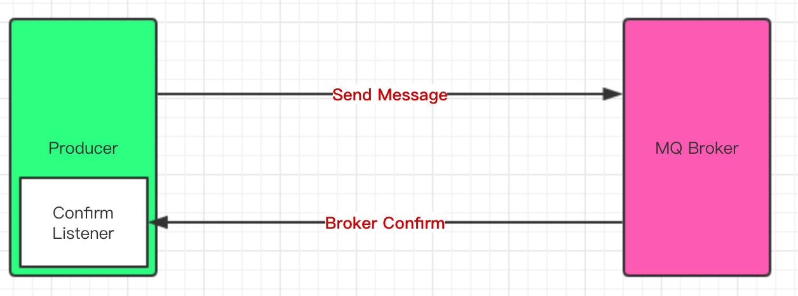

RabbitMQ的消息确认有两种：

- 对生产者发送消息的确认：发送消息时，由于网络等原因可能导致消息发送失败。所以，RabbitMQ必须有机制确保消息能准确到达mq，如果不能到达，必须反馈给生产端进行重发。

- 对消费者消费消息的确认：消息的消费过程中，也可能发生很多异常，比如消息格式不合法、处理超时等，RabbitMQ需要提供消费回执，消费成功的消息可以删除，消费失败的消息则继续存储，择机再次投递。


# 1、投递确认

 RabbitMQ对生产者发送消息的确认有两种实现方式：

- 通过AMQP提供的事务机制实现
- 使用发送者confirm模式实现

## 1.1 confirm

生产者投递消息后，如果 Broker 收到消息，则会给生产者一个应答。生产者进行接收应答，用来确定这条消息是否正常的发送到 Broker ，这种方式也是消息的可靠性投递的核心保障。



一旦 channel 处于 confirm 模式，broker 和 client 都将启动消息计数（以 confirm.select 为基础从 1 开始计数）。broker 会在处理完消息后，在当前 channel 上通过发送 basic.ack 的方式对其进行 confirm 。delivery-tag 域的值标识了被 confirm 消息的序列号。broker 也可以通过设置 basic.ack 中的 multiple 域来表明到指定序列号为止的所有消息都已被 broker 正确的处理了。

confirm在代码实现上分为两步：

- 在 channel 上开启确认模式: `channel.confirmSelect()`
- 在 channel 上添加监听: `channel.addConfirmListener(ConfirmListener listener)`, 监听成功和失败的返回结果，根据具体的结果对消息进行重新发送、或记录日志等后续处理。

```java
import com.rabbitmq.client.*;
import java.io.IOException;

public class ReturnListeningProducer {
    public static void main(String[] args) throws Exception {
        ConnectionFactory factory = new ConnectionFactory();
        factory.setHost("localhost");
        factory.setVirtualHost("/");
        factory.setUsername("guest");
        factory.setPassword("guest");
      
        Connection connection = factory.newConnection();
        Channel channel = connection.createChannel();

        String exchangeName = "test_return_exchange";
        String routingKey = "item.update";
        String errRoutingKey = "error.update";

        //指定消息的投递模式：confirm 确认模式
        channel.confirmSelect();

        //发送
        for (int i = 0; i < 3 ; i++) {
            String msg = "this is return——listening msg ";
            //@param mandatory 设置为 true 路由不可达的消息会被监听到，不会被自动删除
            if (i == 0) {
                channel.basicPublish(exchangeName, errRoutingKey, true,null, msg.getBytes());
            } else {
                channel.basicPublish(exchangeName, routingKey, true, null, msg.getBytes());
            }
            System.out.println("Send message : " + msg);
        }

        //添加一个确认监听， 这里就不关闭连接了，为了能保证能收到监听消息
        channel.addConfirmListener(new ConfirmListener() {
            /**
             * 返回成功的回调函数
             */
            public void handleAck(long deliveryTag, boolean multiple) throws IOException {
                System.out.println("succuss ack");
            }
            /**
             * 返回失败的回调函数
             */
            public void handleNack(long deliveryTag, boolean multiple) throws IOException {
                System.out.printf("defeat ack");
            }
        });

        //添加一个 return 监听
        channel.addReturnListener(new ReturnListener() {
            public void handleReturn(int replyCode, String replyText, String exchange, String routingKey, AMQP.BasicProperties properties, byte[] body) throws IOException {
                System.out.println("return body: " + new String(body));
            }
        });

    }
}
```

以上采用的异步 confirm 模式，除此之外还有单条同步 confirm 模式、批量同步 confirm 模式，但是现实场景中很少使用。


而后面的Return Listener 用于处理些不可路由的消息。在某些情况下，如果我们在发送消息的时候，当前的 exchange 不存在或者指定的路由 key 路由不到，如果需要监听这种不可达的消息，就要使用 Return Listener。

在基础API中有一个关键的配置项`Mandatory`：如果为 true，则监听器会接收到路由不可达的消息，然后进行后续处理，如果为 false，那么 broker 端自动删除该消息。


## 1.2 事务

事务的实现主要是对信道（Channel）的设置，主要的方法有三个：

- channel.txSelect()声明启动事务模式
- channel.txComment()提交事务
- channel.txRollback()回滚事务

```java
import com.rabbitmq.client.Channel;
import com.rabbitmq.client.Connection;
import com.wj.transation.config.MqConfig;
 
public class TxSend {
 
    private static final String QUEUE_NAME = "test_queue_tx";
 
    public static void send() throws Exception {
        Connection connection = MqConfig.getConnection();
        Channel channel = connection.createChannel();
        channel.queueDeclare(QUEUE_NAME, false, false, false, null);
        String msg = "hello tx!";
        try {
            // 用户将当前channel设置成transaction
            channel.txSelect();
 
            channel.basicPublish("", QUEUE_NAME, null, msg.getBytes());
 
            // 异常，使回滚
            int x=1/0;
 
            System.out.println("【发送端】消息："+msg);
            //提交事务
            channel.txCommit();
        } catch (Exception e) {
            channel.txRollback();
            System.out.println("发生异常，回滚");
        }
        channel.close();
        connection.close();
    }
}
```

如果RabbitMQ返回ack失败，生产端也无法确认消息是否真的发送成功，也会造成数据丢失。最好的办法是使用RabbitMQ的事务机制，但是RabbitMQ的**事务机制效率极低**，每秒钟处理的消息仅几百条，不适合并发量大的场景。


为了达到消息的可靠投递，还可以借助外部工具实现，比如redis：

- 生产端在发送消息之前，生成ack唯一确认的id
- 以ackId为键，消息为value，保存进redis缓存，设置超时时间
- redis实现超时触发接口，当key过期时，重发消息并再次执行第2步
- 生产端实现ConfirmCallback接口
- ConfirmCallback接口触发时，若ack为true，则直接删除此次ackId对应的msg；若ack为false，则将该ackId对应的msg取出重发

再比如利用队列与定时任务：

不通过设置redis超时时间触发超时事件进行重发，而是取出消息放入一个ackFailList中，然后开启定时任务，扫描ackFailList，重发失败的msg。

如果把List保存在内存中，不具备持久化的功能，并不安全，可以考虑保存到数据库中，防止消息丢失。

# 2、消费确认

为了保证消息能可靠到达消费端，RabbitMQ也提供了消费端的消息确认机制。消费者在声明队列时，可以指定noAck参数，当noAck=false时，RabbitMQ会等待消费者显式发回ack信号后才从内存(和磁盘，如果是持久化消息的话)中移去消息。否则，RabbitMQ会在队列中消息被消费后立即删除它。

采用消息确认机制后，只要令noAck=false，消费者就有足够的时间处理消息，不用担心处理消息过程中消费者进程挂掉后消息丢失的问题，因为RabbitMQ会一直持有消息直到消费者显式调用basicAck为止。

```java
import com.rabbitmq.client.*;
import java.io.IOException;

public class AckAndNackConsumer {
    public static void main(String[] args) throws Exception {
        ConnectionFactory factory = new ConnectionFactory();
        factory.setHost("localhost");
        factory.setVirtualHost("/");
        factory.setUsername("guest");
        factory.setPassword("guest");
        factory.setAutomaticRecoveryEnabled(true);
        factory.setNetworkRecoveryInterval(3000);

        Connection connection = factory.newConnection();

        final Channel channel = connection.createChannel();

        String exchangeName = "test_ack_exchange";
        String queueName = "test_ack_queue";
        String routingKey = "item.#";
        channel.exchangeDeclare(exchangeName, "topic", true, false, null);
        channel.queueDeclare(queueName, false, false, false, null);

        //一般不用代码绑定，在管理界面手动绑定
        channel.queueBind(queueName, exchangeName, routingKey);

        Consumer consumer = new DefaultConsumer(channel) {
            @Override
            public void handleDelivery(String consumerTag, Envelope envelope,
                                       AMQP.BasicProperties properties, byte[] body)
                    throws IOException {

                String message = new String(body, "UTF-8");
                System.out.println(" [x] Received '" + message + "'");

                try {
                    Thread.sleep(2000);
                } catch (InterruptedException e) {
                    e.printStackTrace();
                }

                if ((Integer) properties.getHeaders().get("num") == 0) {
                    channel.basicNack(envelope.getDeliveryTag(), false, true);
                } else {
                    channel.basicAck(envelope.getDeliveryTag(), false);
                }
            }
        };

        //6. 设置 Channel 消费者绑定队列，设为非自动ack
        channel.basicConsume(queueName, false, consumer);

    }
}
```
