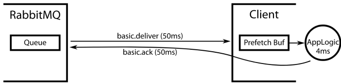
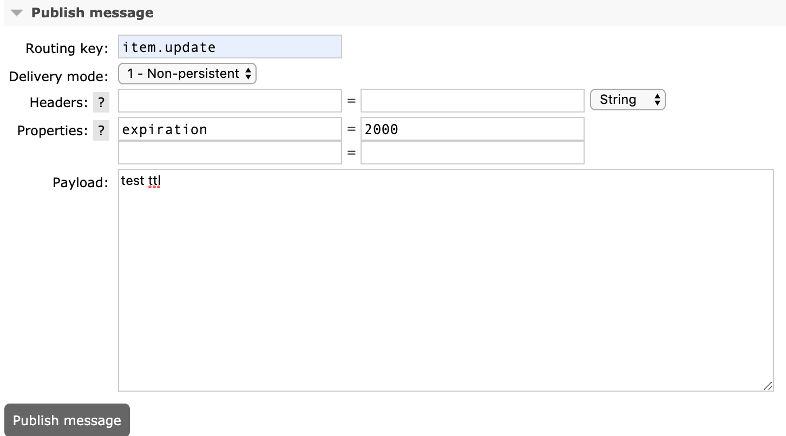
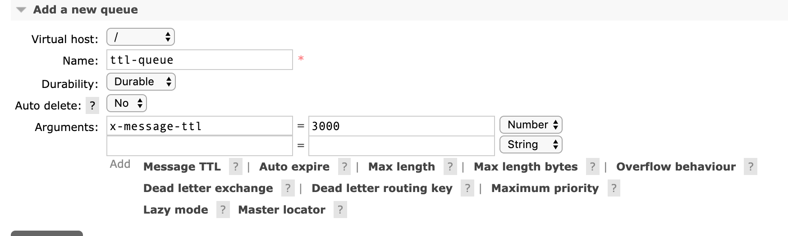
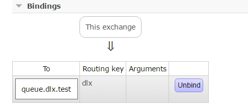
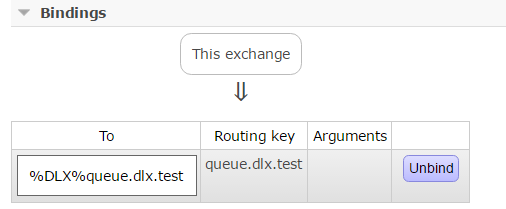
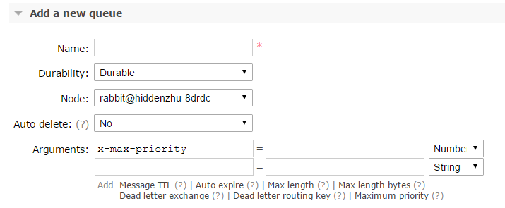

# 1、消费限流

假设一个场景：Rabbitmq 服务器积压了有上万条未处理的消息，我们随便打开一个消费者客户端，会出现这样情况: 巨量的消息瞬间全部推送过来，但是我们单个客户端无法同时处理这么多数据，当消息数量激增的时候很有可能造成资源耗尽，导致系统的卡顿甚至直接崩溃。

RabbitMQ 提供了一种 **qos** （服务质量保证）功能，即**在非自动确认消息的前提下**，如果一定数目的消息（通过基于 consume 或者 channel 设置 Qos 的值）未被确认前，不进行消费新的消息。

RabbitMQ客户端可通过Channel类的`basicQos(int prefetchCount)`设置消费者的预取数目，即消费者最大的未确认消息的数目。

假设prefetchCount=10，有两个消费者，两个消费者依次从队列中抓取10条消息缓存本地，若此时有新的消息到达队列，先判断信道中未确认的消息是否大于或等于20条，若是，则不向信道中投递消息，当信道中未确认消息数小于20条后，信道中哪个消费者未确认消息小于10条，就将消息投递给哪个消费者。

需要注意的是，prefetchCount**在消费端自动确认的模式下是不生效的**。

`channel.basicQos()`中设置的预取数量多少合适，是一个颇有讲究的问题。我们希望充分利用消费者的处理能力，因此不宜设置过小，否则在消费者处理消息后，RabbitMQ收到确认消息后才会投递新的消息，导致此期间消费者处于空闲状态，浪费消费者的处理能力；但设置过大，又可能使消息积压在消费者的缓存里，我们希望对于来不及处理的消息，应保留在队列中，便于加入新的消费者或空闲出来的消费者分担消息处理任务。

RabbitMQ官网的一篇文章详细讨论了预取数量的设置问题：
 　[https://www.rabbitmq.com/blog/2012/05/11/some-queuing-theory-throughput-latency-and-bandwidth/](https://links.jianshu.com/go?to=https%3A%2F%2Fwww.rabbitmq.com%2Fblog%2F2012%2F05%2F11%2Fsome-queuing-theory-throughput-latency-and-bandwidth%2F)

文章大致思路如下。

假设从RabbitMQ服务端队列取消息、传输消息到消费者耗时为50ms，消费者消费消息耗时4ms，消费者传输确认消息到服务端耗时为50ms。若网络状况、消费者处理速度稳定，则预取数量的最优数值为：(50 + 4 + 50)/4=26个。



最初服务端将向客户端发送26条消息，并缓存在客户端本地，当消费者处理好第一个消息后，向服务端发送确认消息并取本地缓存的第二个消息，确认消息由客户端传送到服务端耗时50ms，服务端收到确认后发送新的消息经过50ms又到达了客户端，而余下的25个消息被消费耗时为25×4=100ms，所以当新的消息达到时，第一轮的26个消息恰好全部处理完。依次类推，之后，每当处理完一个旧有的消息时，恰好会到达一个新的消息。既不会发生消息积压，消费者也不会空闲。

但实际情况是，网络的传输状况、消费者处理消息的速度都不会是恒定的，会时快时慢，造成消息积压或消费者空闲，这就要求预取数量要与网络和消费者的状况实时改变。

# 2、TTL

TTL是Time To Live的缩写，也就是生存时间。

RabbitMQ支持消息的过期时间，在消息发送时可以进行指定。

RabbitMQ支持队列的过期时间，从消息入队列开始计算，只要超过了队列的超时时间配置，那么消息会自动的清除。

如果上述两种方法同时使用，则消息的过期时间以两者之间TTL较小的那个数值为准。

对于设置队列TTL属性的方法，一旦消息过期，就会从队列中抹去，而如果在消息层面设置过期时间，即使消息过期，也不会马上从队列中抹去，因为每条消息是否过期时在即将投递到消费者之前判定的，为什么两者得处理方法不一致？因为第一种方法里，队列中已过期的消息肯定在队列头部，RabbitMQ只要定期从队头开始扫描是否有过期消息即可，而第二种方法里，每条消息的过期时间不同，如果要删除所有过期消息，势必要扫描整个队列，所以不如等到此消息即将被消费时再判定是否过期，如果过期，再进行删除。

## 2.1 消息的 TTL

我们在生产端发送消息的时候可以在 properties 中指定 `expiration`属性来对消息过期时间进行设置，单位为毫秒(ms)。

```java
	      /**
         * deliverMode 设置为 2 的时候代表持久化消息
         * expiration 意思是设置消息的有效期，超过10秒没有被消费者接收后会被自动删除
         * headers 自定义的一些属性
         * */
        //5. 发送
        Map<String, Object> headers = new HashMap<String, Object>();
        headers.put("myhead1", "111");
        headers.put("myhead2", "222");

        AMQP.BasicProperties properties = new AMQP.BasicProperties().builder()
                .deliveryMode(2)
                .contentEncoding("UTF-8")
                .expiration("100000")
                .headers(headers)
                .build();
        String msg = "test message";
        channel.basicPublish("", queueName, properties, msg.getBytes());
```

我们也可以后台管理页面中进入 Exchange 发送消息指定`expiration`：



## 2.2 队列的 TTL

我们也可以在后台管理界面中新增一个 queue，创建时可以设置 ttl，对于队列中超过该时间的消息将会被移除：



对应的代码：

```java
ConnectionFactory factory = new ConnectionFactory();
factory.setHost(ip);
factory.setPort(port);
factory.setUsername(username);
factory.setPassword(password);

Connection connection = factory.newConnection();
Channel channel = connection.createChannel();

Map<String, Object>  argss = new HashMap<String, Object>();
argss.put("vhost", "/");
argss.put("username","root");
argss.put("password", "root");
argss.put("x-message-ttl",3000); //设置队列的TTL
channel.queueDeclare(queueName, durable, exclusive, autoDelete, argss);
```

另外也可以同rabbitmq的命令行模式来设置：

```shell
rabbitmqctl set_policy TTL ".*" '{"message-ttl":60000}' --apply-to queues
```


# 3、死信队列

DLX(Dead-Letter-Exchange)，即死信队列。当消息在一个队列中变成死信（dead message）之后，它能被重新publish到另一个Exchange，这个Exchange就是DLX。消息变成死信一向有一下几种情况：

- 消息被拒绝（basic.reject/ basic.nack）并且不再重新投递 requeue=false
- TTL(time-to-live) 消息超时未消费
- 达到最大队列长度

DLX也是一个正常的Exchange，和一般的Exchange没有区别，它能在任何的队列上被指定，实际上就是设置某个队列的属性，当这个队列中有死信时，RabbitMQ就会自动的将这个消息重新发布到设置的Exchange上去，进而被路由到另一个队列，可以监听这个队列中消息做相应的处理。

通过在queueDeclare方法中加入`x-dead-letter-exchange`参数实现：

```java
channel.exchangeDeclare("some.exchange.name", "direct");

Map<String, Object> args = new HashMap<String, Object>();
args.put("x-dead-letter-exchange", "some.exchange.name");
channel.queueDeclare("myqueue", false, false, false, args);
```

你也可以为这个DLX指定routing key，如果没有特殊指定，则使用原队列的routing key：

```java
args.put("x-dead-letter-routing-key", "some-routing-key");
```

还可以使用policy来配置：

```java
rabbitmqctl set_policy DLX ".*" '{"dead-letter-exchange":"my-dlx"}' --apply-to queues
```


实例代码如下：

```java

ConnectionFactory factory = new ConnectionFactory();
factory.setHost(ip);
factory.setPort(port);
factory.setUsername(username);
factory.setPassword(password);

Connection connection = factory.newConnection();
Channel channel = connection.createChannel();

Map<String, Object>  argss = new HashMap<String, Object>();
argss.put("vhost", "/");
argss.put("username","root");
argss.put("password", "root");

 //指定死信的exchange
argss.put("x-dead-letter-exchange","exchange.dlx.test");

//指定死信的routing key，果不指定x-dead-letter-routing-key参数，则使用原来的routingkey
argss.put("x-dead-letter-routing-key","queue.dlx.test");

channel.queueDeclare("queue.dlx.test", durable, exclusive, autoDelete, argss);

```

在RabbitMQ中有两个exchange: `exchange.dlx.self`和`exchange.dlx.test`，两个queue：`queue.dlx.test`和`%DLX%queue.dlx.test`。

`exchange.dlx.self`是正常情况下生产者发送消息到此exchange中，绑定关系如图：



`exchang.dlx.test`是产生死信之后，原queue[queue.dlx.test]的死信发送到此exchange中，绑定关系如图：



数据首先发送到 exchange[exchange.dlx.self]，根据routingkey[dlx]路由到`queue.dlx.test`，如果正常情况下，消费者可以消费`queue.dlx.test`的内容。但是如果`queue.dlx.test`中有消息变成了dead message即死信了，那么这个死信则会通过`exchangeName=exchange.dlx.test`, `routingKey=queue.dlx.test`路由到死信队列`%DLX%queue.dlx.test`中，如果要消费这个dead message, 此时消费者必须消费`%DLX%queue.dlx.test`中的内容而不是`queue.dlx.test`中的内容。

# 4、优先级队列

优先级队列，顾名思义，具有更高优先级的队列具有较高的优先权，优先级高的消息具备优先被消费的特权。

可以通过RabbitMQ管理界面配置队列的优先级属性，如下图的`x-max-priority`：



也可以通过代码去实现，比如：

```java
Map<String,Object> args = new HashMap<String,Object>();
args.put("x-max-priority", 10);
channel.queueDeclare("queue_priority", true, false, false, args);
```

上面配置的是一个队列queue的最大优先级。之后要在发送的消息中设置消息本身的优先级，如下：

```java
AMQP.BasicProperties.Builder builder = new AMQP.BasicProperties.Builder();
builder.priority(5);
AMQP.BasicProperties properties = builder.build();
channel.basicPublish("exchange_priority","rk_priority",properties,("messages").getBytes());
```

下面演示一段生产-消费的代码。首先producer端先生产10个消息，第奇数个消息具备优先级，第偶数个消息就是默认的优先级。

```java
//create exchange
channel.exchangeDeclare("exchange_priority","direct",true);

//create queue with priority
Map<String,Object> args = new HashMap<String,Object>();
args.put("x-max-priority", 10);
channel.queueDeclare("queue_priority", true, false, false, args);
channel.queueBind("queue_priority", "exchange_priority", "rk_priority");

//send message with priority
for(int i=0;i<10;i++) {
  AMQP.BasicProperties.Builder builder = new AMQP.BasicProperties.Builder();
  if(i%2!=0)
    builder.priority(5);
  AMQP.BasicProperties properties = builder.build();
  channel.basicPublish("exchange_priority","rk_priority",properties,("messages-"+i).getBytes());
}
```

消费端运行结果：


> messages-1
> messages-3
> messages-5
> messages-7
> messages-9
> messages-0
> messages-2
> messages-4
> messages-6
> messages-8

当然，在消费端速度大于生产端速度，且broker中没有消息堆积的话，对发送的消息设置优先级也没什么实际意义，因为发送端刚发送完一条消息就被消费端消费了，那么就相当于broker至多只有一条消息，那么对于单条消息来说优先级是没有什么意义的。

# 5、延迟队列

延迟队列存储的对象肯定是对应的延迟消息，所谓”延迟消息”是指当消息被发送以后，并不想让消费者立即拿到消息，而是等待指定时间后，消费者才拿到这个消息进行消费。

目前常见的应用软件都有消息的延迟推送的影子，应用也极为广泛，例如：

- 淘宝七天自动确认收货。在我们签收商品后，物流系统会在七天后延时发送一个消息给支付系统，通知支付系统将款打给商家，这个过程持续七天，就是使用了消息中间件的延迟推送功能。
- 12306 购票支付确认页面。我们在选好票点击确定跳转的页面中往往都会有倒计时，代表着 30 分钟内订单不确认的话将会自动取消订单。其实在下订单那一刻开始购票业务系统就会发送一个延时消息给订单系统，延时30分钟，告诉订单系统订单未完成，如果我们在30分钟内完成了订单，则可以通过逻辑代码判断来忽略掉收到的消息。

在 RabbitMQ 3.6.x 之前我们一般采用**死信队列+TTL过期时间**来实现延迟队列。

在 RabbitMQ 3.6.x 开始，RabbitMQ 官方提供了延迟队列的插件，可以下载放置到 RabbitMQ 根目录下的 plugins 下。

## 5.1 死信队列+TTL

先来看看第一种的实现方式。

首先建立2个exchange和2个queue：

- exchange_delay_begin：这个是producer端发送时调用的exchange, 将消息发送至queue_dealy_begin中。
- queue_delay_begin: 通过routingKey="delay"绑定exchang_delay_begin, 同时配置DLX=exchange_delay_done, 当消息变成死信时，发往exchange_delay_done中。
- exchange_delay_done: 死信的exchange, 如果不配置x-dead-letter-routing-key则采用原有默认的routingKey，即queue_delay_begin绑定exchang_delay_beghin采用的“delay”。
- queue_delay_done：消息在TTL到期之后，最终通过exchang_delay_done发送值此queue，消费端通过消费此queue的消息，即可以达到延迟的效果。

**建立exchange和queue**的代码（当然这里可以通过RabbitMQ的管理界面来实现，无需code相关代码）：

```java
channel.exchangeDeclare("exchange_delay_begin", "direct", true);
channel.exchangeDeclare("exchange_delay_done", "direct", true);

Map<String, Object> args = new HashMap<String, Object>();
args.put("x-dead-letter-exchange", "exchange_delay_done");
channel.queueDeclare("queue_delay_begin", true, false, false, args);
channel.queueDeclare("queue_delay_done", true, false, false, null);

channel.queueBind("queue_delay_begin", "exchange_delay_begin", "delay");
channel.queueBind("queue_delay_done", "exchange_delay_done", "delay");

```

producer端代码：

```java
AMQP.BasicProperties.Builder builder = new AMQP.BasicProperties.Builder();
builder.expiration("60000");//设置消息TTL
builder.deliveryMode(2);//设置消息持久化
AMQP.BasicProperties properties = builder.build();

String message = String.valueOf(new Date());
channel.basicPublish("exchange_delay_begin","delay",properties,message.getBytes());
```

consumer端代码：

```java
QueueingConsumer consumer = new QueueingConsumer(channel);
channel.basicConsume("queue_delay_done", false, consumer);

while (true) {
    QueueingConsumer.Delivery delivery = consumer.nextDelivery();
    String msg = new String(delivery.getBody());
    System.out.println("receive msg time:" + new Date() + ", msg body:" + msg);
    channel.basicAck(delivery.getEnvelope().getDeliveryTag(), false);
}
```

## 5.2 插件模式

如果用插件方式来实现，编码上就简单多了：

```java
import org.springframework.amqp.core.*;
import org.springframework.context.annotation.Bean;
import org.springframework.context.annotation.Configuration;

import java.util.HashMap;
import java.util.Map;

@Configuration
public class MQConfig {

    public static final String LAZY_EXCHANGE = "Ex.LazyExchange";
    public static final String LAZY_QUEUE = "MQ.LazyQueue";
    public static final String LAZY_KEY = "lazy.#";

    @Bean
    public TopicExchange lazyExchange(){
        TopicExchange exchange = new TopicExchange(LAZY_EXCHANGE, true, false, pros);
        exchange.setDelayed(true);
        return exchange;
    }

    @Bean
    public Queue lazyQueue(){
        return new Queue(LAZY_QUEUE, true);
    }

    @Bean
    public Binding lazyBinding(){
        return BindingBuilder.bind(lazyQueue()).to(lazyExchange()).with(LAZY_KEY);
    }
}
```

我们在 Exchange 的声明中可以设置`exchange.setDelayed(true)`来开启延迟队列，也可以设置为以下内容传入交换机声明的方法中，因为第一种方式的底层就是通过这种方式来实现的。

```java
Map<String, Object> pros = new HashMap<>();
//设置交换机支持延迟消息推送
pros.put("x-delayed-message", "topic");
TopicExchange exchange = new TopicExchange(LAZY_EXCHANGE, true, false, pros);
```

发送消息时我们需要指定延迟推送的时间，我们这里在发送消息的方法中传入参数 `new MessagePostProcessor()` 是为了获得 `Message`对象，因为需要借助 `Message`对象的api 来设置延迟时间。

```java
import com.anqi.mq.config.MQConfig;
import org.springframework.amqp.AmqpException;
import org.springframework.amqp.core.Message;
import org.springframework.amqp.core.MessageDeliveryMode;
import org.springframework.amqp.core.MessagePostProcessor;
import org.springframework.amqp.rabbit.connection.CorrelationData;
import org.springframework.amqp.rabbit.core.RabbitTemplate;
import org.springframework.beans.factory.annotation.Autowired;
import org.springframework.stereotype.Component;

import java.util.Date;

@Component
public class MQSender {

    @Autowired
    private RabbitTemplate rabbitTemplate;
  
    public void sendLazy(Object message){
        rabbitTemplate.setMandatory(true);
        rabbitTemplate.setConfirmCallback(confirmCallback);
        rabbitTemplate.setReturnCallback(returnCallback);
        //id + 时间戳 全局唯一
        CorrelationData correlationData = new CorrelationData("12345678909"+new Date());

        //发送消息时指定 header 延迟时间
        rabbitTemplate.convertAndSend(MQConfig.LAZY_EXCHANGE, "lazy.boot", message,
                new MessagePostProcessor() {
            @Override
            public Message postProcessMessage(Message message) throws AmqpException {
                //设置消息持久化
                message.getMessageProperties().setDeliveryMode(MessageDeliveryMode.PERSISTENT);
                // 等同于代码：message.getMessageProperties().setHeader("x-delay", "6000");
                message.getMessageProperties().setDelay(6000);
                return message;
            }
        }, correlationData);
    }
}
```


