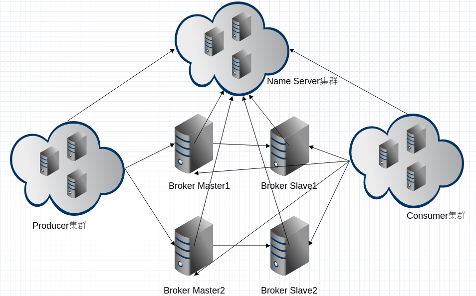
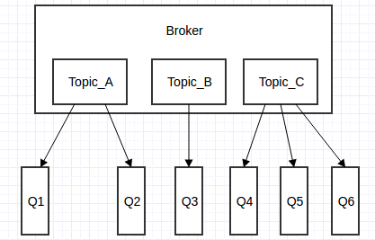

# 1、RocketMQ是什么

RocketMQ 是阿里巴巴在2012年开源的分布式消息中间件，目前已经捐赠给 Apache 软件基金会，并于2017年9月25日成为 Apache 的顶级项目。作为经历过多次阿里巴巴双十一的洗礼并有稳定出色表现的国产中间件，以其高性能、低延时和高可靠等特性近年来已经也被越来越多的企业使用。其主要特点有：

- 灵活可扩展性
  RocketMQ 天然支持分布式，其核心四组件（Name Server、Broker、Producer、Consumer）每一个都可以在没有单点故障的情况下进行水平扩展。
- 海量消息堆积能力
  RocketMQ 采用零拷贝原理实现超大的消息的堆积能力，单机已可以支持亿级消息堆积，而且在堆积了这么多消息后依然保持写入低延迟。
- 支持顺序消息
  可以保证消息消费者按照消息发送的顺序对消息进行消费。顺序消息分为全局有序和局部有序，一般推荐使用局部有序，即生产者通过将某一类消息按顺序发送至同一个队列来实现。
- 多种消息过滤方式
  消息过滤分为在服务器端过滤和在消费端过滤。服务器端过滤时可以按照消息消费者的要求做过滤，优点是减少不必要消息传输，缺点是增加了消息服务器的负担，实现相对复杂。消费端过滤则完全由具体应用自定义实现，这种方式更加灵活，缺点是很多无用的消息会传输给消息消费者。
- 支持事务消息
  RocketMQ 除了支持普通消息，顺序消息之外还支持事务消息，这个特性对于分布式事务来说提供了又一种解决思路。
- 回溯消费
   回溯消费是指消费者已经消费成功的消息，由于业务上需求需要重新消费，RocketMQ 支持按照时间回溯消费，时间维度精确到毫秒，可以向前回溯，也可以向后回溯。

# 2、基础架构

RocketMQ架构上主要分为四部分，如上图所示:

- **Producer**：消息发布的角色，支持分布式集群方式部署。Producer通过MQ的负载均衡模块选择相应的Broker集群队列进行消息投递，投递的过程支持快速失败并且低延迟。Producer与Name Server集群中的其中一个节点（随机选择）建立长连接，定期从Name Server取Topic路由信息，并向提供Topic服务的Master建立长连接，且定时向Master发送心跳。
- **Consumer**：消息消费的角色，支持分布式集群方式部署。支持以push推，pull拉两种模式对消息进行消费。同时也支持集群方式和广播方式的消费，它提供实时消息订阅机制，可以满足大多数用户的需求。Consumer与Name Server集群中的其中一个节点（随机选择）建立长连接，定期从Name Server取Topic路由信息，并向提供Topic服务的Master、Slave建立长连接，且定时向Master、Slave发送心跳。Consumer既可以从Master订阅消息，也可以从Slave订阅消息，订阅规则由Broker配置决定。
- **NameServer**：是一个几乎无状态节点，可集群部署，节点之间无任何信息同步。Broker是向每一台NameServer注册自己的路由信息，所以每一个NameServer实例上面都保存一份完整的路由信息。当某个NameServer因某种原因下线了，Broker仍然可以向其它NameServer同步其路由信息，Producer,Consumer仍然可以动态感知Broker的路由的信息。NameServer主要包括两个功能：
  - Broker管理，NameServer接受Broker集群的注册信息并且保存下来作为路由信息的基本数据。然后提供心跳检测机制，检查Broker是否还存活；
  - 路由信息管理，每个NameServer将保存关于Broker集群的整个路由信息和用于客户端查询的队列信息。然后Producer和Conumser通过NameServer就可以知道整个Broker集群的路由信息，从而进行消息的投递和消费。
- **BrokerServer**：Broker主要负责消息的存储、投递和查询以及服务高可用保证。Broker分为Master与Slave，一个Master可以对应多个Slave，但是一个Slave只能对应一个Master，Master与Slave的对应关系通过指定相同的BrokerName，不同的BrokerId来定义，BrokerId为0表示Master，非0表示Slave。Master也可以部署多个。每个Broker与Name Server集群中的所有节点建立长连接，定时注册Topic信息到所有Name Server。

# 3、基本概念

## 生产者组（Producer Group）

用来表示一个发送消息应用，一个Producer Group下包含多个Producer实例，可以是多台机器，也可以是一台机器的多个进程，或者一个进程的多个Producer对象。一个Producer Group可以发送多个Topic消息，Producer Group作用如下：

- 标识一类Producer
- 可以通过运维工具查询这个发送消息应用下有多个Producer实例
- 发送分布式事务消息时，如果Producer中途意外宕机，Broker会主动回调Producer Group内的任意一台机器来确认事务状态。

## 消费者组（Consumer Group）

用来表示一个消费消息应用，一个Consumer Group下包含多个Consumer实例，可以是多台机器，也可以是多个进程，或者是一个进程的多个Consumer对象。一个Consumer Group下的多个Consumer以均摊方式消费消息，如果设置为广播方式，那么这个Consumer Group下的每个实例都消费全量数据。

消费者组与生产者组类似，都是将相同角色的分组在一起并命名，分组是个很精妙的概念设计，RocketMQ 正是通过这种分组机制，实现了天然的消息负载均衡。消费消息时通过 Consumer Group 实现了将消息分发到多个消费者服务器实例，比如某个 Topic 有9条消息，其中一个 Consumer Group 有3个实例（3个进程或3台机器），那么每个实例将均摊3条消息，这也意味着我们可以很方便的通过加机器来实现水平扩展。

## 消息（Message）

消息就是要传输的信息。一条消息必须有一个主题，主题可以看做是你的信件要邮寄的地址。一条消息也可以拥有一个可选的标签和额处的键值对，它们可以用于设置一个业务 key 并在 Broker 上查找此消息以便在开发期间查找问题。

## 主题（Topic）

主题可以看做消息的规类，它是消息的第一级类型。比如一个电商系统可以分为：交易消息、物流消息等，一条消息必须有一个 Topic 。Topic 与生产者和消费者的关系非常松散，一个 Topic 可以有0个、1个、多个生产者向其发送消息，一个生产者也可以同时向不同的 Topic 发送消息。一个 Topic 也可以被 0个、1个、多个消费者订阅。

## 标签（tag）

标签（Tag）可以看作子主题，它是消息的第二级类型，用于为用户提供额外的灵活性。使用标签，同一业务模块不同目的的消息就可以用相同 Topic 而不同的 Tag 来标识。比如交易消息又可以分为：交易创建消息、交易完成消息等，一条消息可以没有 Tag 。标签有助于保持您的代码干净和连贯，并且还可以为 RocketMQ 提供的查询系统提供帮助。

## 消息队列（Message Queue）

主题被划分为一个或多个子主题，即消息队列。一个 Topic 下可以设置多个消息队列，发送消息时执行该消息的 Topic ，RocketMQ 会轮询该 Topic 下的所有队列将消息发出去。下图 Broker 内部消息情况：

# 4、集群部署模式

## 4.1 单 master 模式

也就是只有一个 master 节点，称不上是集群，一旦这个 master 节点宕机，那么整个服务就不可用，一般只用于实验场景。

## 4.2 多 master 模式

多个 master 节点组成集群，单个 master 节点宕机或者重启对应用没有影响。

- **优点**：所有模式中性能最高
- **缺点**：单个 master 节点宕机期间，未被消费的消息在节点恢复之前不可用，消息的实时性就受到影响。

**注意**：使用同步刷盘可以保证消息不丢失，同时 Topic 相对应的 queue 应该分布在集群中各个节点，而不是只在某各节点上，否则，该节点宕机会对订阅该 topic 的应用造成影响。

## 4.3 多 master 多 slave 异步复制模式

在多 master 模式的基础上，每个 master 节点都有至少一个对应的 slave。master节点可读可写，但是 slave 只能读不能写，类似于 mysql 的主备模式。

- **优点**： 在 master 宕机时，消费者可以从 slave 读取消息，消息的实时性不会受影响，性能几乎和多 master 一样。
- **缺点**：使用异步复制的同步方式有可能会有消息丢失的问题。

## 4.4 多 master 多 slave 同步双写模式

同多 master 多 slave 异步复制模式类似，区别在于 master 和 slave 之间的数据同步方式。

- **优点**：同步双写的同步模式能保证数据不丢失。
- **缺点**：发送单个消息 RT 会略长，性能相比异步复制低10%左右。

**注意**：要保证数据可靠，需采用同步刷盘和同步双写的方式，但性能会较其他方式低。